# Session 1 & 2 – Linux Fundamentals (Linux Homework Tasks)

**Name:** Vansh Dobhal | **Roll No:** 10099

Environment used for every command below: **Ubuntu 24.04.5 LTS on WSL2** (kernel `6.6.87.2-microsoft-standard-WSL2`, hostname `Vansh-G15`, user `vansh`, systemd enabled).
All screenshots were made with a small helper (`snap`) that **runs the commands for real** and saves a terminal image (`screenshots/*.png`) plus the exact text (`outputs/*.txt`). Nothing below is hand-typed output.

## Contents

- [Task 1: Soft Link & Hard Link](#task-1-soft-link--hard-link)
- [Task 2: adduser vs useradd](#task-2-adduser-vs-useradd)
- [Task 3: journalctl](#task-3-journalctl)
- [Task 4: Linux Command Cheat Sheet](#task-4-linux-command-cheat-sheet)
- [Folder structure](#folder-structure)
- [How to reproduce](#how-to-reproduce)

---

## Task 1: Soft Link & Hard Link

### Background: what is an inode?

Every file on an ext4 filesystem has an **inode**: a record that holds the file's metadata (owner, permissions, size, timestamps, pointers to the data blocks) but **not its name**. A file name is just a directory entry that points to an inode. That one fact explains both kinds of link.

### Difference

| | **Hard link** (`ln target link`) | **Soft / symbolic link** (`ln -s target link`) |
|---|---|---|
| What it is | Another directory entry (name) for the **same inode** | A small, separate file whose content is the **path** of the target |
| Inode number | Same as the original | Its own new inode |
| Link count (`ls -l` column 2) | Goes up by 1 for each hard link | The target's count does not change |
| If the original name is deleted | Data is still there, reachable through the hard link | Link **breaks** ("dangling"): it points to a path that no longer exists |
| Works for directories | No (`hard link not allowed for directory`) | Yes |
| Across filesystems / partitions | No (`Invalid cross-device link`) | Yes |
| `ls -l` shows | A normal file (`-rw-r--r--`) | `l` type and `link -> target` |
| Size | Same as the file (it *is* the file) | Length of the path string (12 bytes for `original.txt`) |
| Typical use | Backups/snapshots that share data (e.g. `rsync --link-dest`), keeping a file alive under two names | Shortcuts, version switching (`/usr/bin/python3 -> python3.12`), `/etc/nginx/sites-enabled/*`, `current -> releases/v2` deployments |

### Commands to create both

```bash
ln -s original.txt soft_link.txt   # soft (symbolic) link
ln    original.txt hard_link.txt   # hard link
ls -li                             # -i shows inode numbers
stat -c '%n inode=%i links=%h' *   # inode + hard-link count
readlink -f soft_link.txt          # where the soft link points
rm soft_link.txt / unlink hard_link.txt   # delete a link
```

### Practice 1: creating the links and comparing inodes

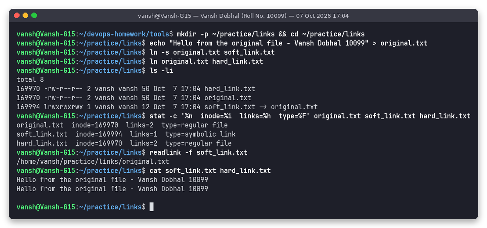

What I saw (from `outputs/01-links-create.txt`):

```
169970 -rw-r--r-- 2 vansh vansh 50 Oct  7 17:04 hard_link.txt
169970 -rw-r--r-- 2 vansh vansh 50 Oct  7 17:04 original.txt
169994 lrwxrwxrwx 1 vansh vansh 12 Oct  7 17:04 soft_link.txt -> original.txt
```

- `original.txt` and `hard_link.txt` have the **same inode (169970)** and a **link count of 2**, so they are two names for one file.
- `soft_link.txt` has a **different inode (169994)**, type `l`, size 12 bytes (the length of the text `original.txt`), and link count 1.
- `cat` gives the same content through both links.

### Practice 2: deleting the target

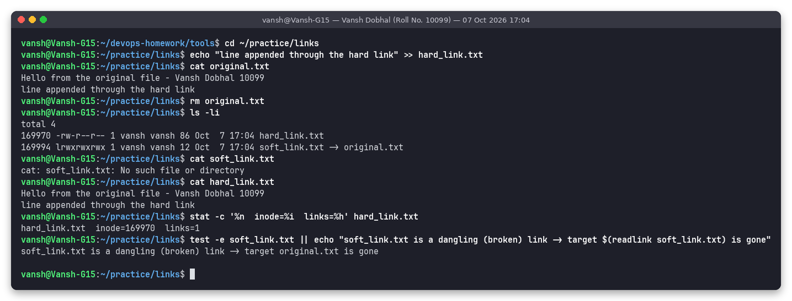

1. I appended a line through `hard_link.txt` and `cat original.txt` showed it too, because both names point to the same data blocks.
2. `rm original.txt` removed only **one name**. The link count of inode 169970 dropped from **2 to 1**.
3. `cat soft_link.txt` gave `No such file or directory`. The soft link still exists (`ls` shows `soft_link.txt -> original.txt`), but the path it stores is gone, so it is a **dangling link**.
4. `cat hard_link.txt` still printed **both lines**. The data is freed only when the link count reaches 0 and no process has the file open.

### Practice 3: limits and deleting links

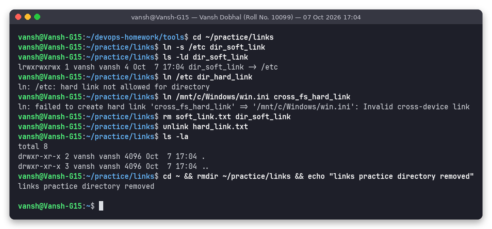

- `ln -s /etc dir_soft_link` works: soft links can point to directories.
- `ln /etc dir_hard_link` gives `hard link not allowed for directory`. This is blocked to stop loops in the directory tree.
- `ln /mnt/c/Windows/win.ini ...` gives `Invalid cross-device link`. An inode number only means something inside its own filesystem, so hard links cannot cross from ext4 (`/home`) to the Windows drive (`/mnt/c`).
- Links were deleted with `rm` (soft) and `unlink` (hard). Deleting a soft link never touches the target.

### Interview answer

> "A **hard link** is another name for the same inode. Both names share the inode number, permissions and data, and the file's link count goes up. Deleting one name only lowers the count, so the data stays until the last link is removed. Hard links cannot point to directories or cross filesystems.
> A **soft (symbolic) link** is a separate small file with its own inode that stores the *path* to the target, like a shortcut. It can point to directories and to other filesystems, but if the target is deleted or moved, the link breaks (becomes dangling).
> Create them with `ln target name` and `ln -s target name`, and check them with `ls -li`: same inode number means hard link, `l` plus `->` means soft link."

---

## Task 2: adduser vs useradd

### Difference

| | `useradd` | `adduser` |
|---|---|---|
| Type | Low-level **binary** from the `shadow`/`passwd` package (`ELF 64-bit` executable) | High-level **Perl script** (Debian/Ubuntu) that calls `useradd`, `passwd`, `chfn` and others for you |
| Home directory | **Not created** unless you pass `-m` (Ubuntu has no `CREATE_HOME` in `/etc/login.defs`) | Created automatically and filled from `/etc/skel` (`.bashrc`, `.profile`, `.bash_logout`) |
| Default shell | `/bin/sh` (from `/etc/default/useradd`) | `/bin/bash` (`DSHELL` in `/etc/adduser.conf`) |
| Password | Not set: account is locked until you run `passwd` | Asks for one interactively (or `--disabled-password`) |
| Full name / GECOS | Only with `-c` | Asks for it (or `--gecos`) |
| Extra groups | Only what you pass with `-G` | Adds the new user to the `users` group (`EXTRA_GROUPS`) |
| Config | `/etc/default/useradd`, `/etc/login.defs` | `/etc/adduser.conf` |
| Portability | On every Linux distro (good for scripts and Dockerfiles across distros) | Debian/Ubuntu family (on RHEL, `adduser` is just a symlink to `useradd`) |

### Which is preferred on Ubuntu, and why

**`adduser`** is preferred on Ubuntu for creating real (human) users. The `useradd(8)` man page on this machine says: *"useradd is a low level utility for adding users. On Debian, administrators should usually use adduser(8) instead."* Ubuntu is based on Debian. One command gives a complete, usable account: home directory with skeleton files, bash as the shell, a password prompt, GECOS info and the right groups. With `useradd` it is easy to forget `-m` or `-s` and end up with a user that has no home and a plain `sh` shell (shown below).
`useradd` is still the right choice in **portable scripts and Dockerfiles**, where you want exact, non-interactive control (`useradd -m -s /bin/bash -u 1001 app`).

### Creating a test user with the recommended command (adduser, non-interactive)

```bash
sudo adduser --disabled-password --gecos "Test User One,,," testuser1
```

`--disabled-password` skips the password prompt (the account has `!` in `/etc/shadow`, so password login is disabled). `--gecos` fills the full-name field so `adduser` does not prompt for it.

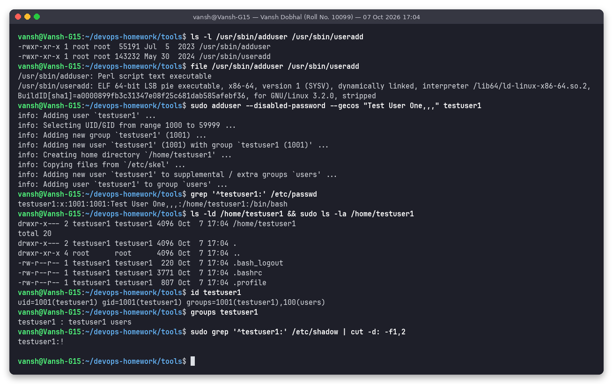

Observed:

- `/etc/passwd`: `testuser1:x:1001:1001:Test User One,,,:/home/testuser1:/bin/bash` (fields: name : x = password stored in shadow : UID : GID : GECOS : home : shell).
- `/home/testuser1` was created with mode `drwxr-x---` and contains `.bash_logout`, `.bashrc`, `.profile` copied from `/etc/skel`.
- `id testuser1` gives `uid=1001(testuser1) gid=1001(testuser1) groups=1001(testuser1),100(users)`, so a private group was created and the user was added to `users`.
- `/etc/shadow` shows `testuser1:!`, meaning the password is locked.

### useradd for contrast

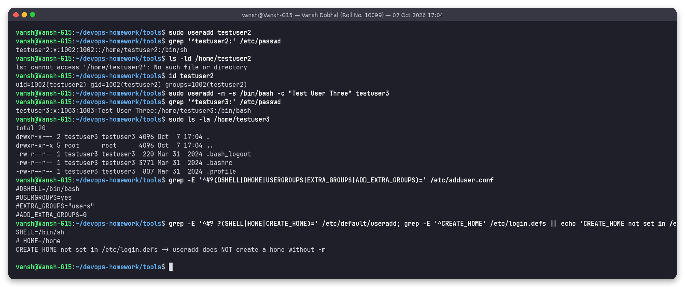

- `sudo useradd testuser2` (no options) gives `testuser2:x:1002:1002::/home/testuser2:/bin/sh`. There is **no GECOS**, the shell is **`/bin/sh`**, and `ls -ld /home/testuser2` returns **No such file or directory**: the home directory is listed in `/etc/passwd` but was never created.
- `sudo useradd -m -s /bin/bash -c "Test User Three" testuser3` is needed to get roughly what `adduser` gives by default.
- The config files explain the behaviour: `/etc/default/useradd` has `SHELL=/bin/sh`, and `/etc/login.defs` has no `CREATE_HOME`.

### Deleting the test users

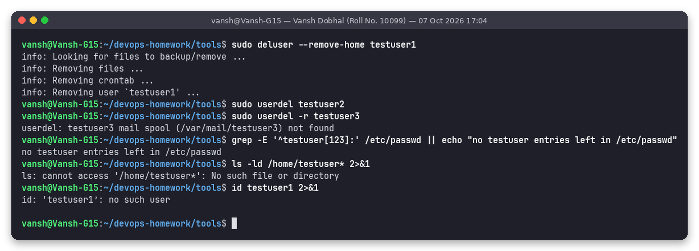

```bash
sudo deluser --remove-home testuser1   # Debian-friendly counterpart of adduser
sudo userdel testuser2                 # no home to remove
sudo userdel -r testuser3              # -r removes the home directory and mail spool
```

Afterwards `grep` finds no `testuser` lines in `/etc/passwd`, `/home/testuser*` no longer exists, and `id testuser1` returns `no such user`. (`userdel -r` warned `mail spool (/var/mail/testuser3) not found`. This is harmless: no mail was ever delivered to that user.)

---

## Task 3: journalctl

### What is it?

`journalctl` is the command for reading the **systemd journal**. `systemd-journald` collects logs from the kernel (`dmesg`), early boot, every systemd service's stdout/stderr, syslog, and programs that call `logger`/`sd_journal`. It stores them in an indexed binary format under `/var/log/journal/` (persistent) or `/run/log/journal/` (volatile). Because each entry has fields (`_SYSTEMD_UNIT`, `_PID`, `PRIORITY`, `_BOOT_ID`, and so on), you can filter by service, time, boot or priority instead of grepping many text files.

Note: as a normal user, journalctl prints only your own messages (it shows the hint *"Users in groups 'adm', 'systemd-journal' can see all messages"*). That is why `sudo` is used below.

### Useful options

| Command | Purpose |
|---|---|
| `journalctl` | Whole journal, oldest first (pager) |
| `journalctl --no-pager` | Print straight to the terminal or a pipe (needed in scripts) |
| `journalctl -n 20` | Last 20 entries |
| `journalctl -f` | Follow live, like `tail -f` (interactive, so not used in the screenshots) |
| `journalctl -u cron` / `-u docker` | Logs of one systemd **unit** (service) |
| `journalctl -b` / `-b -1` | Current boot / previous boot |
| `journalctl --list-boots` | List of recorded boots |
| `journalctl -p err` | Priority `err` and more severe (`emerg 0, alert 1, crit 2, err 3, warning 4, notice 5, info 6, debug 7`) |
| `journalctl -k` | Kernel messages only (like `dmesg`) |
| `journalctl --since "1 hour ago" --until "10 min ago"` | Time window (also accepts `"2026-10-07 16:00"`, `today`, `yesterday`) |
| `journalctl -t TAG` | Entries with a given syslog identifier |
| `journalctl -o short-iso` / `-o json` / `-o cat` | Output format |
| `journalctl --disk-usage` | Space used by the journal |
| `journalctl --vacuum-size=200M` / `--vacuum-time=7d` | Delete old logs |

### Viewing system logs

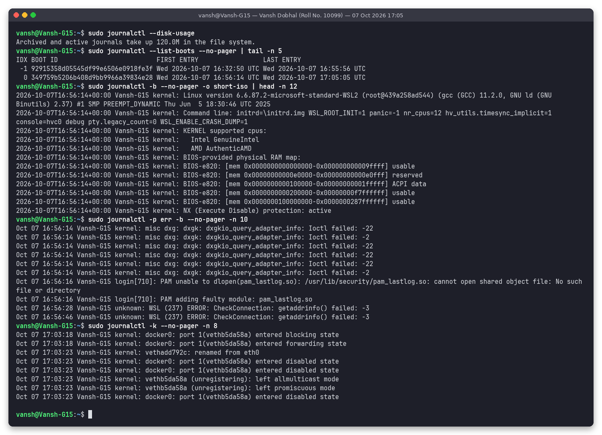

- `--disk-usage`: journals take **120.0M**.
- `--list-boots`: two boots recorded (`-1` and `0`), each with its boot ID and time range.
- `-b ... | head`: the current boot starts with the kernel banner (`Linux version 6.6.87.2-microsoft-standard-WSL2 ...`).
- `-p err -b`: real error-level lines from this boot, e.g. WSL GPU `dxgkio_query_adapter_info: Ioctl failed`, a missing `pam_lastlog.so` PAM module and a WSL `getaddrinfo() failed`. This is the quickest way to see "what went wrong since boot".
- `-k`: kernel messages about docker `veth` interfaces joining and leaving the `docker0` bridge.

### Checking logs for a specific service

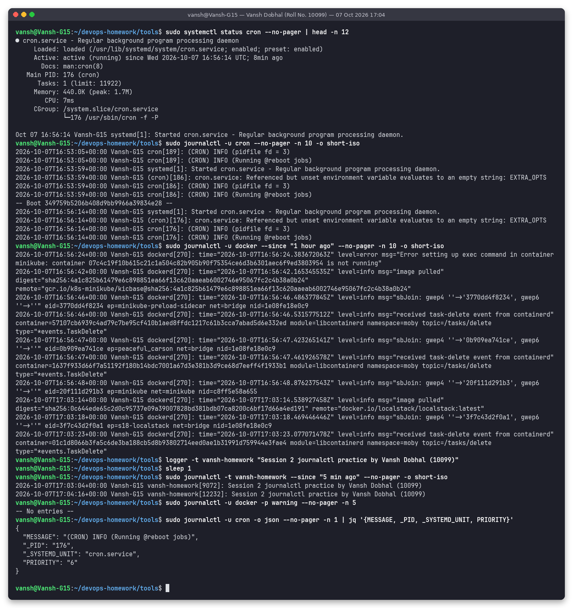

- `systemctl status cron` shows the service state plus its **last journal lines**.
- `journalctl -u cron -n 10 -o short-iso`: cron start messages across **both boots** (journalctl prints a `-- Boot ... --` separator).
- `journalctl -u docker --since "1 hour ago"`: the Docker daemon's logs, e.g. images being pulled and containers being created and deleted.
- `logger -t vansh-homework "..."` wrote my own entry and `journalctl -t vansh-homework` read it back. This shows that any script can log into the journal.
- `-u docker -p warning` returned `-- No entries --`: Docker logged nothing at priority 0–4 in this window. (Docker writes its own `level=error` text inside messages that journald stores at priority 6/info, so `-p` filters on the journal priority, not on the text.)
- `-o json | jq` shows the structured fields stored for every entry: `MESSAGE`, `_PID`, `_SYSTEMD_UNIT`, `PRIORITY` (6 = info).

---

## Task 4: Linux Command Cheat Sheet

I practised every command in the table below on the WSL Ubuntu machine. The screenshots after the table show the practice, grouped by topic.

### Files & directories

| Command | Purpose | Basic usage |
|---|---|---|
| `pwd` | Print current directory | `pwd` |
| `ls` | List directory contents | `ls -la`, `ls -li` (inodes), `ls -lh` |
| `cd` | Change directory | `cd ~/practice`, `cd ..`, `cd -` |
| `mkdir` | Create directory | `mkdir -p a/b/c`, `mkdir -p dir/{docs,logs}` |
| `touch` | Create empty file / update timestamp | `touch notes.txt` |
| `cp` | Copy | `cp file backup/`, `cp -r dir1 dir2` |
| `mv` | Move or rename | `mv notes.txt docs/notes.md` |
| `rm` / `rmdir` | Delete file / empty dir | `rm file`, `rm -rf dir` (careful), `rmdir emptydir` |
| `ln` | Hard / soft links | `ln -s target link` |
| `tree` | Directory tree | `tree .` |

### Viewing files

| Command | Purpose | Basic usage |
|---|---|---|
| `cat` | Print a whole file | `cat logs/app.log` |
| `less` | Page through a file | `less /var/log/syslog` |
| `head` / `tail` | First / last lines | `head -n 2 f`, `tail -n 2 f`, `tail -f f` |
| `wc` | Count lines/words/bytes | `wc -l app.log` |
| `sort`, `cut`, `uniq` | Text processing | `cut -d: -f1 /etc/passwd \| sort` |

### Permissions & ownership

| Command | Purpose | Basic usage |
|---|---|---|
| `chmod` | Change permissions (r=4, w=2, x=1) | `chmod u+x run.sh`, `chmod 640 file`, `chmod 755 script` |
| `chown` | Change owner:group | `sudo chown root:root file` |
| `umask` | Default permission mask | `umask` gives `0022` (new files are 644, dirs 755) |
| `stat` | Detailed metadata | `stat -c '%A %a %n' file` |
| `whoami`, `id`, `groups` | Who am I, UID/GID, groups | `id` |
| `sudo` | Run as root | `sudo apt-get update` |

### Processes & system

| Command | Purpose | Basic usage |
|---|---|---|
| `ps` | Snapshot of processes | `ps aux --sort=-%mem`, `ps -ef \| grep cron` |
| `top` / `htop` | Live process view | `top -bn1 \| head` (batch mode, one iteration) |
| `kill`, `pkill`, `pgrep` | Send signals / find PIDs | `kill PID`, `kill -9 PID`, `pgrep -a sleep` |
| `&`, `jobs`, `fg`, `bg` | Background jobs | `sleep 300 &`, `kill %1` |
| `uptime` | Uptime and load average | `uptime` |
| `free` | Memory usage | `free -h` |
| `uname` | Kernel info | `uname -a` |

### Disk

| Command | Purpose | Basic usage |
|---|---|---|
| `df` | Filesystem free space | `df -h` |
| `du` | Space used by files/dirs | `du -sh dir/*` |
| `lsblk` | Block devices | `lsblk` |

### Search

| Command | Purpose | Basic usage |
|---|---|---|
| `find` | Find files by name/type/time/size | `find . -type f -name "*.log"`, `find /etc -newer /etc/hostname` |
| `grep` | Search text | `grep -n error f`, `grep -ric error dir`, `grep -v error f` |
| `which` / `type` | Where a command comes from | `which tar`, `type cd` |
| `man -f` / `man` | Manual pages | `man -f ls`, `man tar` |

### Archives, packages, services

| Command | Purpose | Basic usage |
|---|---|---|
| `tar` | Create / list / extract archives | `tar -czvf a.tar.gz dir`, `tar -tzf a.tar.gz`, `tar -xzf a.tar.gz -C out/` |
| `apt` / `apt-get` | Ubuntu package manager | `sudo apt-get install -y tree`, `apt list --installed` |
| `apt-cache policy` | Installed vs candidate version | `apt-cache policy tree` |
| `dpkg -l` | Low-level package list | `dpkg -l \| grep jq` |
| `systemctl` | Manage systemd services | `systemctl status cron`, `systemctl is-active docker`, `sudo systemctl restart cron`, `systemctl list-units --type=service` |
| `journalctl` | Read logs | see Task 3 |

### Networking basics

| Command | Purpose | Basic usage |
|---|---|---|
| `hostname`, `hostname -I` | Host name / IPs | `hostname -I` |
| `ip a` / `ip -br a` | Interfaces and addresses | `ip -br a` |
| `ping` | Reachability and latency | `ping -c 2 8.8.8.8` |
| `curl` | HTTP requests | `curl -sI https://github.com` |
| `ss` | Listening sockets | `ss -tln` |

### Practice screenshots

**Files & viewing:** created a small project tree with brace expansion, then copied, moved, listed, `tree`, `cat`/`head`/`tail`/`wc`.

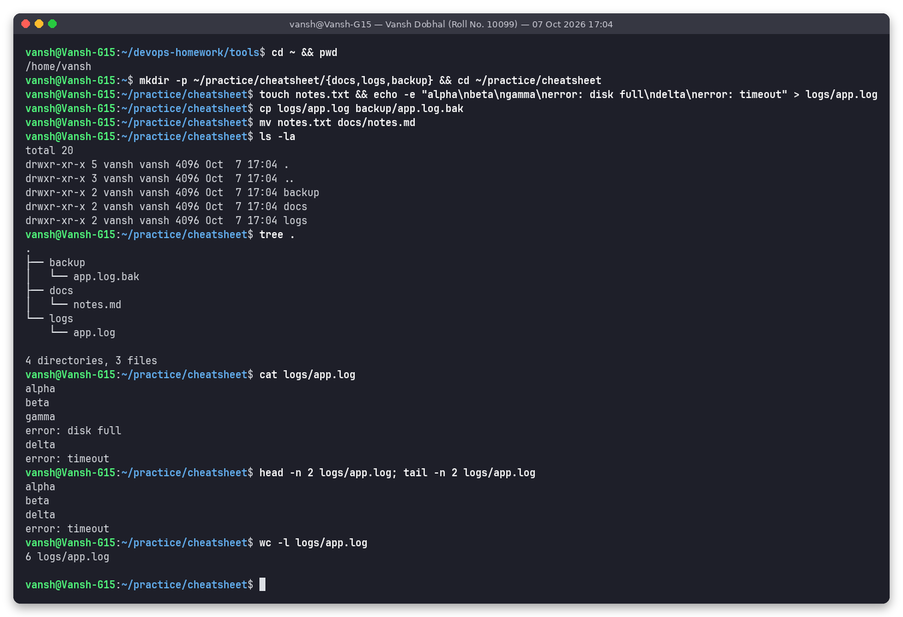

**Permissions:** `run.sh` went from `-rw-r--r--` to `-rwxr--r--` with `u+x` and could then be executed. `chmod 640` gave `-rw-r-----`. `stat` showed `-rwxr-xr-x 755`. `chown` to `root:root` and back. `umask` is `0022`.

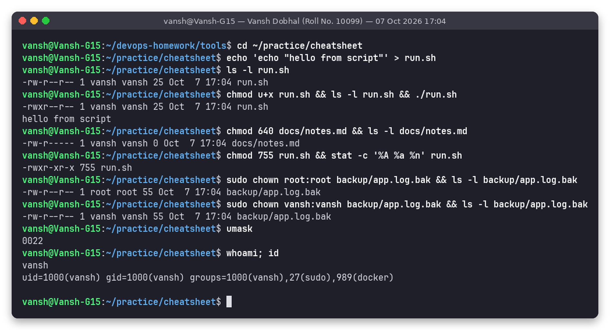

**Processes:** top memory users (kube-apiserver, dockerd), `top` in batch mode, started a background `sleep 300`, found it with `pgrep` and killed it with `kill %1`, then `uptime` and `free -h`.

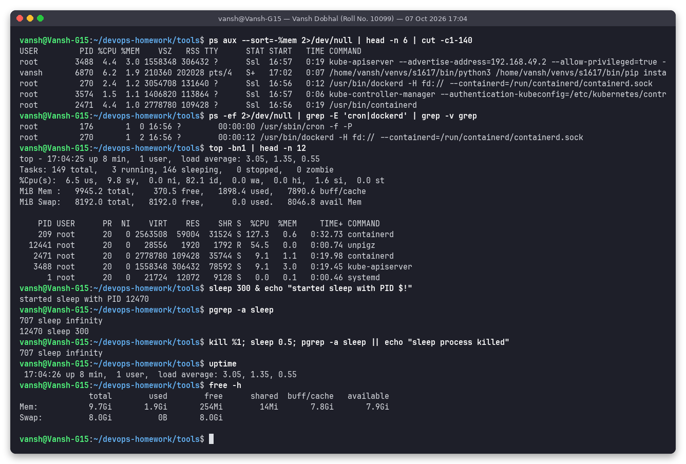

**Disk & search:** `df -h` (root ext4 disk `/dev/sdd` 1007G, and the Windows C: drive at 88% use), `du -sh`, `lsblk`, `find` by name and by modification time, `grep -n / -ric / -v`, and a `cut | sort` pipeline.

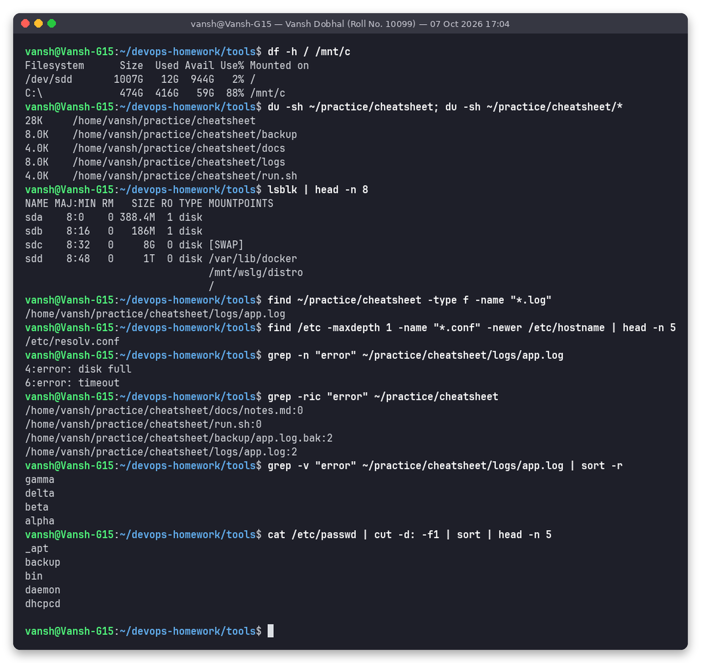

**Archives, packages, services:** made a `.tar.gz`, listed it, extracted it to `restore/`, checked package versions with `apt list`, `apt-cache policy` and `dpkg -l`, then `systemctl is-active` and running services.

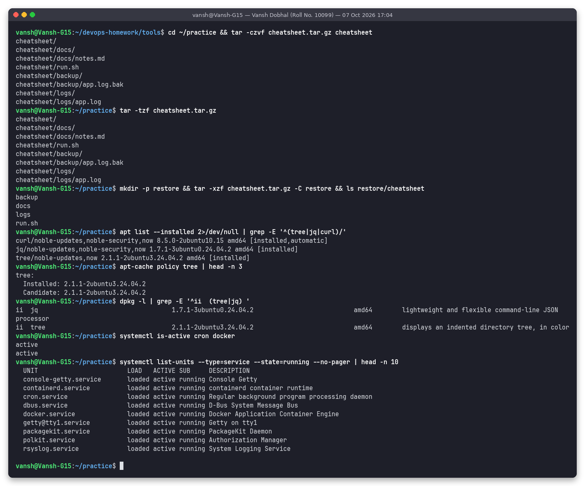

**Networking & misc:** `hostname -I`, `uname -a`, `/etc/os-release`, `ip -br a`, `ping`, `curl -sI`, `ss -tln`, a shell variable, `which`/`type`, `man -f`, and cleaning up the practice directory.

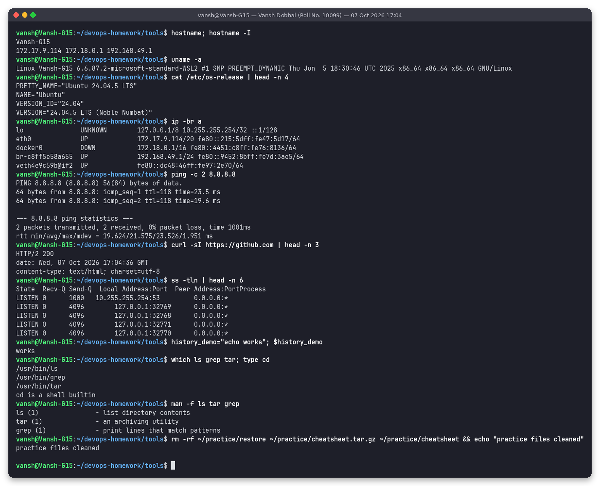

---

## Folder structure

```
session-01-02-linux-fundamentals/
├── README.md
├── outputs/        # exact text of every screenshot run (14 files)
│   ├── 01-links-create.txt ... 14-cheat-network-misc.txt
└── screenshots/    # terminal screenshots (14 PNGs)
    ├── 01-links-create.png
    ├── 02-links-delete-target.png
    ├── 03-links-cleanup.png
    ├── 04-adduser-create.png
    ├── 05-useradd-contrast.png
    ├── 06-delete-users.png
    ├── 07-journalctl-system.png
    ├── 08-journalctl-service.png
    ├── 09-cheat-files.png
    ├── 10-cheat-permissions.png
    ├── 11-cheat-processes.png
    ├── 12-cheat-disk-search.png
    ├── 13-cheat-archive-pkg-systemctl.png
    └── 14-cheat-network-misc.png
```

## How to reproduce

On any Ubuntu 22.04/24.04 machine (or WSL) with sudo:

```bash
# Task 1
mkdir -p ~/practice/links && cd ~/practice/links
echo "hello" > original.txt
ln -s original.txt soft_link.txt && ln original.txt hard_link.txt && ls -li
rm original.txt && cat soft_link.txt; cat hard_link.txt

# Task 2
sudo adduser --disabled-password --gecos "Test User One,,," testuser1
grep testuser1 /etc/passwd; id testuser1; sudo ls -la /home/testuser1
sudo useradd testuser2; ls -ld /home/testuser2     # no home directory
sudo deluser --remove-home testuser1; sudo userdel testuser2

# Task 3
sudo journalctl -u cron --no-pager -n 10
sudo journalctl -p err -b --no-pager
sudo journalctl --since "1 hour ago" -u docker --no-pager

# Task 4: run the commands from the cheat-sheet tables above
```
