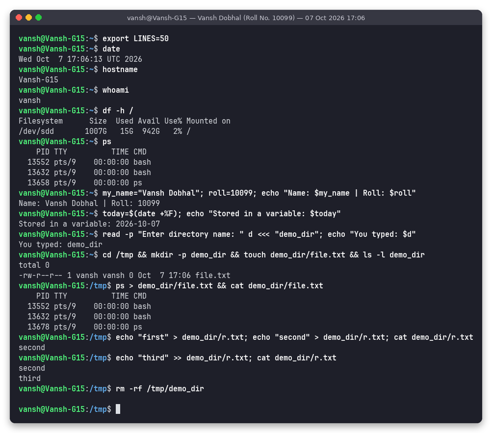
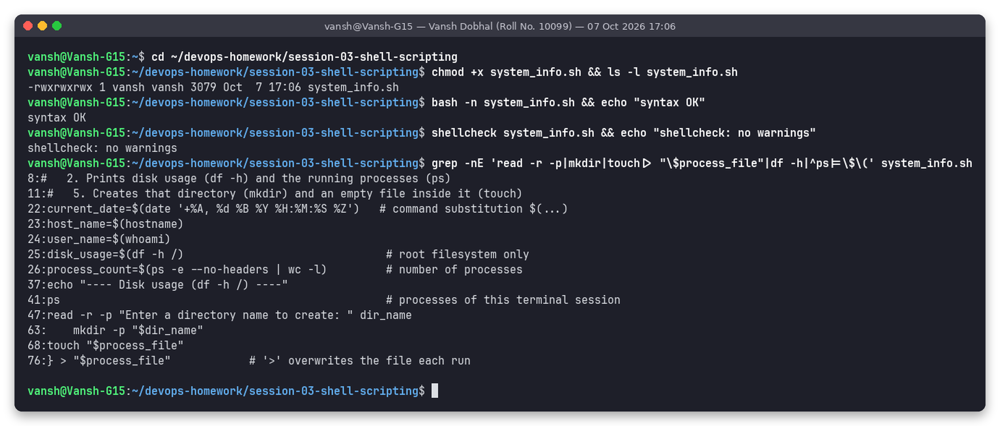
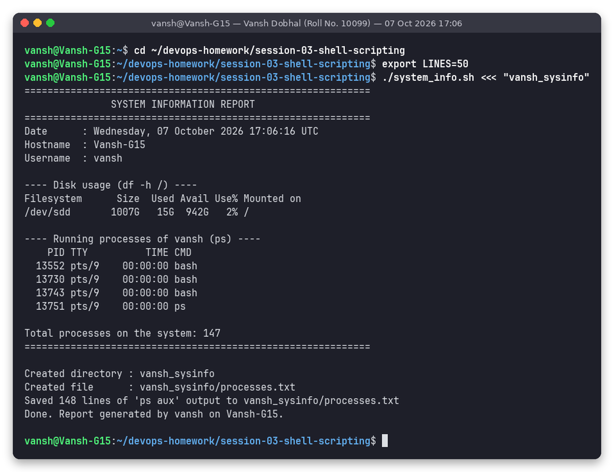
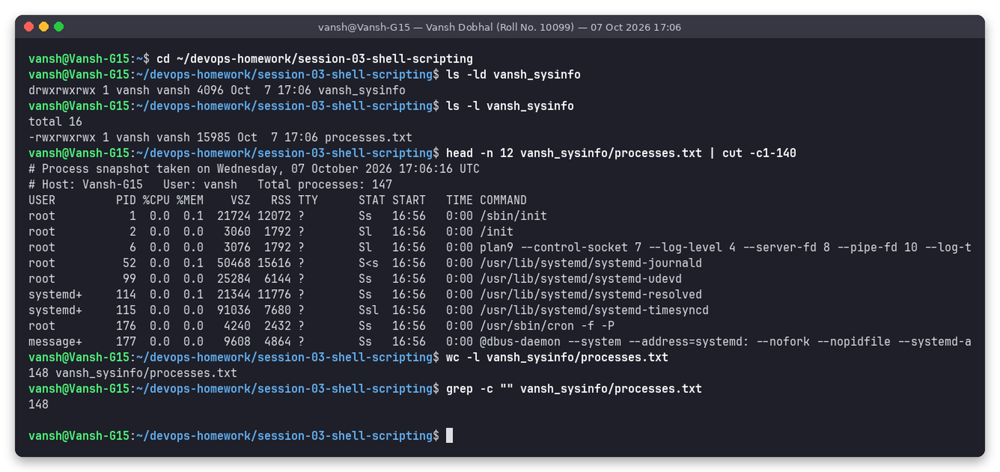
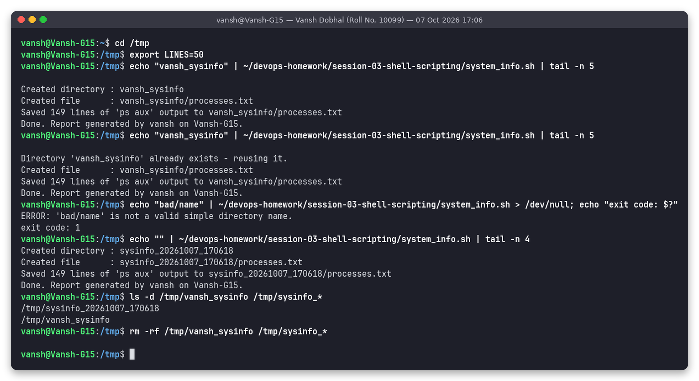

# Session 3 – Shell Scripting: System Information Script

**Name:** Vansh Dobhal | **Roll No:** 10099

**Task:** Create `system_info.sh`, a shell script that:

- prints the **current date**, **hostname** and **username**
- prints **disk usage** (`df -h`) and the **running processes** (`ps`)
- uses **variables** to store data and use it again
- takes **user input** with `read -p` (a directory name)
- **creates a directory** with `mkdir` and **creates a file** with `touch`
- **stores the running processes in that file** using `>` redirection

Commands used: `mkdir`, `touch`, `echo`, `df`, `ps`, `read -p`, variables, `>` redirection.
Submission: this README, with every command's output. The folder is part of my public GitHub repo **https://github.com/v4xsh/devops-homework** (folder `session-03-shell-scripting/`).

Environment: Ubuntu 24.04.5 LTS on WSL2, user `vansh`, host `Vansh-G15`. Every screenshot was made by a helper (`snap`) that runs the commands for real and saves both a PNG (`screenshots/`) and the exact text (`outputs/`).

---

## 1. The script: `system_info.sh`

```bash
#!/usr/bin/env bash
# =============================================================================
# system_info.sh - Session 3 homework (Shell Scripting)
# Author : Vansh Dobhal | Roll No: 10099
#
# What it does:
#   1. Prints the current date, hostname and username
#   2. Prints disk usage (df -h) and the running processes (ps)
#   3. Stores all of that in variables and re-uses them
#   4. Asks the user for a directory name (read -p)
#   5. Creates that directory (mkdir) and an empty file inside it (touch)
#   6. Saves the running-process list into the file using '>' redirection
#
# Usage:
#   ./system_info.sh                 # interactive - asks for a directory name
#   ./system_info.sh <<< "mydir"     # non-interactive - name fed on stdin
# =============================================================================

set -euo pipefail          # stop on errors, unset variables and pipe failures

# ---------- 1. Collect system information into variables ----------
current_date=$(date '+%A, %d %B %Y %H:%M:%S %Z')   # command substitution $(...)
host_name=$(hostname)
user_name=$(whoami)
disk_usage=$(df -h /)                               # root filesystem only
process_count=$(ps -e --no-headers | wc -l)         # number of processes
divider="============================================================"

# ---------- 2. Print the information ----------
echo "$divider"
echo "               SYSTEM INFORMATION REPORT"
echo "$divider"
echo "Date      : $current_date"
echo "Hostname  : $host_name"
echo "Username  : $user_name"
echo
echo "---- Disk usage (df -h /) ----"
echo "$disk_usage"
echo
echo "---- Running processes of $user_name (ps) ----"
ps                                                  # processes of this terminal session
echo
echo "Total processes on the system: $process_count"
echo "$divider"

# ---------- 3. Take user input ----------
read -r -p "Enter a directory name to create: " dir_name

# default value if the user just pressed Enter
dir_name=${dir_name:-sysinfo_$(date +%Y%m%d_%H%M%S)}

# reject names containing a slash or starting with '-' (keeps it simple and safe)
if [[ "$dir_name" == */* || "$dir_name" == -* ]]; then
    echo "ERROR: '$dir_name' is not a valid simple directory name." >&2
    exit 1
fi
echo     # newline after the prompt (useful when input is piped)

# ---------- 4. Create directory and file ----------
if [[ -d "$dir_name" ]]; then
    echo "Directory '$dir_name' already exists - reusing it."
else
    mkdir -p "$dir_name"
    echo "Created directory : $dir_name"
fi

process_file="$dir_name/processes.txt"
touch "$process_file"
echo "Created file      : $process_file"

# ---------- 5. Store running processes in the file using '>' ----------
{
    echo "# Process snapshot taken on $current_date"
    echo "# Host: $host_name   User: $user_name   Total processes: $process_count"
    ps aux
} > "$process_file"            # '>' overwrites the file each run

echo "Saved $(wc -l < "$process_file") lines of 'ps aux' output to $process_file"
echo "Done. Report generated by $user_name on $host_name."
```

### How the script works, step by step

| Step | Code | Explanation |
|---|---|---|
| Shebang | `#!/usr/bin/env bash` | Runs the file with bash, wherever bash is installed |
| Safety | `set -euo pipefail` | `-e` exits on any failing command, `-u` treats unset variables as errors, `pipefail` makes a pipeline fail if any part fails |
| Variables + command substitution | `current_date=$(date ...)`, `host_name=$(hostname)`, `user_name=$(whoami)`, `disk_usage=$(df -h /)`, `process_count=$(ps -e --no-headers \| wc -l)` | `$( )` runs a command and stores its output in a variable, so each value is collected once and used several times (on screen and in the file header) |
| Printing | `echo "Date : $current_date"` | `echo` prints text. Variables are expanded inside double quotes |
| Disk usage | `df -h /` | Disk free/used for the root filesystem; `-h` means human-readable sizes (G, M) |
| Processes | `ps` and `ps aux` | `ps` lists the current terminal session's processes; `ps aux` lists every process on the system with user, CPU %, memory % and command |
| User input | `read -r -p "Enter a directory name to create: " dir_name` | `-p` shows a prompt, `-r` keeps backslashes literal, and the answer is stored in `dir_name` |
| Default value | `${dir_name:-sysinfo_<timestamp>}` | Parameter expansion: if the input is empty, use a timestamped name |
| Validation | `[[ "$dir_name" == */* \|\| "$dir_name" == -* ]]` | Rejects names with `/` or a leading `-`. Errors go to stderr (`>&2`) with exit code 1 |
| Create directory | `mkdir -p "$dir_name"` | Creates the directory. `-p` means no error if it already exists. The `[[ -d ]]` check prints whether it was created or reused |
| Create file | `touch "$process_file"` | Creates an empty `processes.txt` (or updates its timestamp) |
| Redirection | `{ echo ...; ps aux; } > "$process_file"` | `>` sends the output of the whole `{ }` group into the file and **overwrites** it each run (`>>` would append) |
| Summary | `wc -l < "$process_file"` | `<` feeds the file to `wc` as input, so `wc` prints only the number of lines |

---

## 2. Each required command on its own

Before writing the script, I ran each building block by itself:



Full output (`outputs/01-commands-individually.txt`):

```text
~$ export LINES=50
~$ date
Wed Oct  7 17:06:13 UTC 2026
~$ hostname
Vansh-G15
~$ whoami
vansh
~$ df -h /
Filesystem      Size  Used Avail Use% Mounted on
/dev/sdd       1007G   15G  942G   2% /
~$ ps
    PID TTY          TIME CMD
  13552 pts/9    00:00:00 bash
  13632 pts/9    00:00:00 bash
  13658 pts/9    00:00:00 ps
~$ my_name="Vansh Dobhal"; roll=10099; echo "Name: $my_name | Roll: $roll"
Name: Vansh Dobhal | Roll: 10099
~$ today=$(date +%F); echo "Stored in a variable: $today"
Stored in a variable: 2026-10-07
~$ read -p "Enter directory name: " d <<< "demo_dir"; echo "You typed: $d"
You typed: demo_dir
~$ cd /tmp && mkdir -p demo_dir && touch demo_dir/file.txt && ls -l demo_dir
total 0
-rw-r--r-- 1 vansh vansh 0 Oct  7 17:06 file.txt
/tmp$ ps > demo_dir/file.txt && cat demo_dir/file.txt
    PID TTY          TIME CMD
  13552 pts/9    00:00:00 bash
  13632 pts/9    00:00:00 bash
  13678 pts/9    00:00:00 ps
/tmp$ echo "first" > demo_dir/r.txt; echo "second" > demo_dir/r.txt; cat demo_dir/r.txt
second
/tmp$ echo "third" >> demo_dir/r.txt; cat demo_dir/r.txt
second
third
/tmp$ rm -rf /tmp/demo_dir
```

What I learned from this:

- `date`, `hostname`, `whoami`, `df -h /` and `ps` each print one piece of system information.
- `var=value` (no spaces around `=`) creates a variable, `$var` reads it, and `var=$(command)` stores a command's output.
- `read -p "prompt" var <<< "demo_dir"`: the `<<<` "here-string" feeds input without a keyboard, which is how I ran the script non-interactively. Bash shows the `-p` prompt **only when input comes from a terminal**, so the prompt text does not appear when the input is piped.
- `mkdir -p` and `touch` created `demo_dir/file.txt` (an empty file of 0 bytes).
- `ps > file` saved the process list into the file.
- `>` **overwrites**: after writing "first" and then "second", only `second` was left. `>>` **appends**: "third" was added below.
- `export LINES=50` was needed only inside my screenshot tool. It has no real terminal, and `procps` prints a warning (`your 150x1 screen size is bogus`) when it cannot read a window height. In a normal terminal this line is not needed.

---

## 3. Checking the script



```text
~$ cd ~/devops-homework/session-03-shell-scripting
~/devops-homework/session-03-shell-scripting$ chmod +x system_info.sh && ls -l system_info.sh
-rwxrwxrwx 1 vansh vansh 3079 Oct  7 17:06 system_info.sh
~/devops-homework/session-03-shell-scripting$ bash -n system_info.sh && echo "syntax OK"
syntax OK
~/devops-homework/session-03-shell-scripting$ shellcheck system_info.sh && echo "shellcheck: no warnings"
shellcheck: no warnings
~/devops-homework/session-03-shell-scripting$ grep -nE 'read -r -p|mkdir|touch|> "\$process_file"|df -h|^ps|=\$\(' system_info.sh
8:#   2. Prints disk usage (df -h) and the running processes (ps)
11:#   5. Creates that directory (mkdir) and an empty file inside it (touch)
22:current_date=$(date '+%A, %d %B %Y %H:%M:%S %Z')   # command substitution $(...)
23:host_name=$(hostname)
24:user_name=$(whoami)
25:disk_usage=$(df -h /)                               # root filesystem only
26:process_count=$(ps -e --no-headers | wc -l)         # number of processes
37:echo "---- Disk usage (df -h /) ----"
41:ps                                                  # processes of this terminal session
47:read -r -p "Enter a directory name to create: " dir_name
63:    mkdir -p "$dir_name"
68:touch "$process_file"
76:} > "$process_file"            # '>' overwrites the file each run
```

- `chmod +x` makes the script executable so it can run as `./system_info.sh`. (The repository lives on the Windows drive mounted in WSL, which shows every file as `rwxrwxrwx`.)
- `bash -n` parses the script without running it, giving `syntax OK`.
- `shellcheck` (a static analyser for shell scripts) reported **no warnings**.
- `grep -n` shows the line where each required command is used: `read -r -p` (47), `mkdir` (63), `touch` (68), `>` redirection (76), `df -h` (25), `ps` (26, 41), variables with `$( )` (22–26).

---

## 4. Running the script

The input (directory name `vansh_sysinfo`) was given with a here-string, which is the same as typing it at the prompt:

```bash
./system_info.sh <<< "vansh_sysinfo"
```



Full output (`outputs/03-run-system-info.txt`):

```text
~$ cd ~/devops-homework/session-03-shell-scripting
~/devops-homework/session-03-shell-scripting$ export LINES=50
~/devops-homework/session-03-shell-scripting$ ./system_info.sh <<< "vansh_sysinfo"
============================================================
               SYSTEM INFORMATION REPORT
============================================================
Date      : Wednesday, 07 October 2026 17:06:16 UTC
Hostname  : Vansh-G15
Username  : vansh

---- Disk usage (df -h /) ----
Filesystem      Size  Used Avail Use% Mounted on
/dev/sdd       1007G   15G  942G   2% /

---- Running processes of vansh (ps) ----
    PID TTY          TIME CMD
  13552 pts/9    00:00:00 bash
  13730 pts/9    00:00:00 bash
  13743 pts/9    00:00:00 bash
  13751 pts/9    00:00:00 ps

Total processes on the system: 147
============================================================

Created directory : vansh_sysinfo
Created file      : vansh_sysinfo/processes.txt
Saved 148 lines of 'ps aux' output to vansh_sysinfo/processes.txt
Done. Report generated by vansh on Vansh-G15.
```

---

## 5. Checking the created directory and file



```text
~$ cd ~/devops-homework/session-03-shell-scripting
~/devops-homework/session-03-shell-scripting$ ls -ld vansh_sysinfo
drwxrwxrwx 1 vansh vansh 4096 Oct  7 17:06 vansh_sysinfo
~/devops-homework/session-03-shell-scripting$ ls -l vansh_sysinfo
total 16
-rwxrwxrwx 1 vansh vansh 15985 Oct  7 17:06 processes.txt
~/devops-homework/session-03-shell-scripting$ head -n 12 vansh_sysinfo/processes.txt | cut -c1-140
# Process snapshot taken on Wednesday, 07 October 2026 17:06:16 UTC
# Host: Vansh-G15   User: vansh   Total processes: 147
USER         PID %CPU %MEM    VSZ   RSS TTY      STAT START   TIME COMMAND
root           1  0.0  0.1  21724 12072 ?        Ss   16:56   0:00 /sbin/init
root           2  0.0  0.0   3060  1792 ?        Sl   16:56   0:00 /init
root           6  0.0  0.0   3076  1792 ?        Sl   16:56   0:00 plan9 --control-socket 7 --log-level 4 --server-fd 8 --pipe-fd 10 --log-t
root          52  0.0  0.1  50468 15616 ?        S<s  16:56   0:00 /usr/lib/systemd/systemd-journald
root          99  0.0  0.0  25284  6144 ?        Ss   16:56   0:00 /usr/lib/systemd/systemd-udevd
systemd+     114  0.0  0.1  21344 11776 ?        Ss   16:56   0:00 /usr/lib/systemd/systemd-resolved
systemd+     115  0.0  0.0  91036  7680 ?        Ssl  16:56   0:00 /usr/lib/systemd/systemd-timesyncd
root         176  0.0  0.0   4240  2432 ?        Ss   16:56   0:00 /usr/sbin/cron -f -P
message+     177  0.0  0.0   9608  4864 ?        Ss   16:56   0:00 @dbus-daemon --system --address=systemd: --nofork --nopidfile --systemd-a
~/devops-homework/session-03-shell-scripting$ wc -l vansh_sysinfo/processes.txt
148 vansh_sysinfo/processes.txt
~/devops-homework/session-03-shell-scripting$ grep -c "" vansh_sysinfo/processes.txt
148
```

The directory `vansh_sysinfo/` and the file `vansh_sysinfo/processes.txt` were created. The file has 148 lines: a 2-line header built from the variables, the `ps aux` header, and 145 process lines. The real file from this run is kept in this folder: [`vansh_sysinfo/processes.txt`](vansh_sysinfo/processes.txt).

---

## 6. Extra tests (robustness)



```text
~$ cd /tmp
/tmp$ export LINES=50
/tmp$ echo "vansh_sysinfo" | ~/devops-homework/session-03-shell-scripting/system_info.sh | tail -n 5

Created directory : vansh_sysinfo
Created file      : vansh_sysinfo/processes.txt
Saved 149 lines of 'ps aux' output to vansh_sysinfo/processes.txt
Done. Report generated by vansh on Vansh-G15.
/tmp$ echo "vansh_sysinfo" | ~/devops-homework/session-03-shell-scripting/system_info.sh | tail -n 5

Directory 'vansh_sysinfo' already exists - reusing it.
Created file      : vansh_sysinfo/processes.txt
Saved 149 lines of 'ps aux' output to vansh_sysinfo/processes.txt
Done. Report generated by vansh on Vansh-G15.
/tmp$ echo "bad/name" | ~/devops-homework/session-03-shell-scripting/system_info.sh > /dev/null; echo "exit code: $?"
ERROR: 'bad/name' is not a valid simple directory name.
exit code: 1
/tmp$ echo "" | ~/devops-homework/session-03-shell-scripting/system_info.sh | tail -n 4
Created directory : sysinfo_20261007_170618
Created file      : sysinfo_20261007_170618/processes.txt
Saved 149 lines of 'ps aux' output to sysinfo_20261007_170618/processes.txt
Done. Report generated by vansh on Vansh-G15.
/tmp$ ls -d /tmp/vansh_sysinfo /tmp/sysinfo_*
/tmp/sysinfo_20261007_170618
/tmp/vansh_sysinfo
/tmp$ rm -rf /tmp/vansh_sysinfo /tmp/sysinfo_*
```

| Test | Result |
|---|---|
| Run with a new name (input piped with `echo name \|`) | Directory created |
| Run again with the same name | `Directory 'vansh_sysinfo' already exists - reusing it.` The file is overwritten by `>` |
| Invalid name `bad/name` | Error message on stderr, **exit code 1**, nothing created |
| Empty input (just Enter) | The default name `sysinfo_YYYYMMDD_HHMMSS` was used |

The test directories in `/tmp` were deleted at the end.

---

## 7. Commands used: summary

| Command | Purpose in this task |
|---|---|
| `date` | Current date and time (`date '+%A, %d %B %Y %H:%M:%S %Z'` for a readable format) |
| `hostname` | Name of the machine |
| `whoami` | Current user name |
| `df -h` | Disk space in human-readable form |
| `ps` / `ps aux` / `ps -e` | Running processes (session / all with details / all, for counting) |
| `echo` | Print text and variables |
| `read -p` | Prompt the user and store the answer in a variable |
| variables, `$( )` | Store values and command outputs to use again |
| `mkdir -p` | Create the directory |
| `touch` | Create the empty file |
| `>` | Redirect output into a file, overwriting it |
| `>>` | Redirect and append (demonstrated in section 2) |
| `<<<` / `\|` | Feed input to `read` without a keyboard (here-string / pipe) |
| `wc -l` | Count lines in the saved file |

## Folder structure

```
session-03-shell-scripting/
├── README.md
├── system_info.sh                 # the script
├── vansh_sysinfo/
│   └── processes.txt              # file created by the script (real run)
├── outputs/                       # exact text of each screenshot run
│   ├── 01-commands-individually.txt
│   ├── 02-script-check.txt
│   ├── 03-run-system-info.txt
│   ├── 04-verify-output.txt
│   └── 05-edge-cases.txt
└── screenshots/
    ├── 01-commands-individually.png
    ├── 02-script-check.png
    ├── 03-run-system-info.png
    ├── 04-verify-output.png
    └── 05-edge-cases.png
```

## How to reproduce

```bash
git clone https://github.com/v4xsh/devops-homework.git
cd devops-homework/session-03-shell-scripting
chmod +x system_info.sh
./system_info.sh                 # interactive: type a directory name
# or non-interactive:
./system_info.sh <<< "mydir"
head mydir/processes.txt
```
