# Session 4 – Networking

**Name:** Vansh Dobhal | **Roll No:** 10099

**Tasks**
- **Task 1:** Practice the commands and repos shared in the devops-heros GitHub repo (`session4-networking/`).
- **Task 2:** Create a Markdown file, run networking commands, add the output/screenshots, and add a short explanation of what I understood about each command. **This README is that Markdown file.**

Environment: Ubuntu 24.04.5 LTS on WSL2 (host `Vansh-G15`, interface `eth0` = `172.17.9.114/20`, default gateway `172.17.0.1` = the Windows host's virtual switch). Docker and a minikube cluster also run on this machine, which is why `docker0` (172.18.0.0/16) and a `br-…` bridge (192.168.49.0/24) appear in the output.
Every screenshot was produced by a helper (`snap`) that **executes the commands for real** and saves the PNG (`screenshots/`) plus the exact text (`outputs/`). Tools installed for this session: `mtr-tiny`, `telnet`, `ipcalc`, `iputils-tracepath`.

## Contents
- [Task 1: devops-heros repo practice](#task-1-practice-commands-and-repo-shared-in-devops-heros-github-repo)
- [Task 2: Networking commands with output and explanation](#task-2-networking-commands-with-output-and-explanation)
- [Cheat tables: OSI / TCP-IP / ports / IP classes](#cheat-tables)
- [Folder structure](#folder-structure) and [How to reproduce](#how-to-reproduce)

---

## Task 1: Practice commands and repo shared in devops-heros GitHub repo

The course repo folder `session4-networking/` has two files:
- `ip.md`: class notes on IP addresses, classes A–D, subnet masks, network vs host bits, the number of hosts `2^n − 2`, and private ranges (examples `197.23.45.10/24`, `120.27.1.0/8`).
- `resources.md`: a list of networking practice repos by Nency Ravaliya (Network-Troubleshooting, OSI-Network-devices, Networking, Subnetting, IP-quest, IPFIX-NETFLOW-NTP, How-DHCP-Works).

### 1.1 Cloning the shared repos

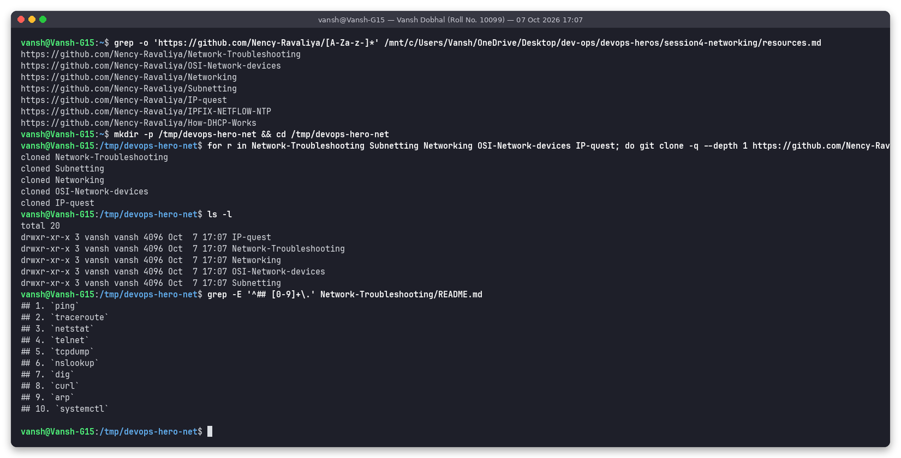

I extracted the links from `resources.md`, cloned five of the repos into `/tmp/devops-hero-net`, and listed the 10 troubleshooting steps from **Network-Troubleshooting** (`ping, traceroute, netstat, telnet, tcpdump, nslookup, dig, curl, arp, systemctl`). I then ran that whole sequence against google.com on my machine.

### 1.2 Network-Troubleshooting guide, steps 1–4 (ping, traceroute, netstat, telnet)

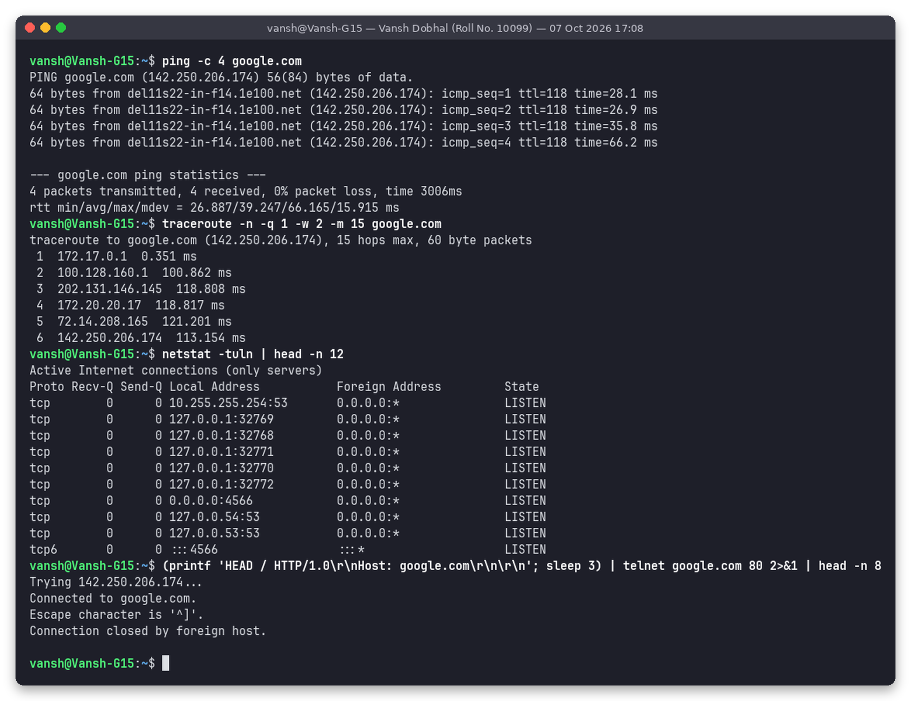

- **ping google.com:** 4/4 replies from `142.250.206.174` (`del11s22-in-f14.1e100.net`, a Google server in Delhi), 0% loss, about 39 ms average. Basic reachability and DNS both work.
- **traceroute:** 6 hops: `172.17.0.1` (WSL to Windows virtual switch), then `100.128.160.1` (ISP CGNAT range 100.64.0.0/10), then ISP routers, then `72.14.208.165` (Google edge), then Google's server.
- **netstat -tuln:** local listening sockets (DNS stub `127.0.0.53:53`, docker-proxy ports on 127.0.0.1:3276x, …). Nothing local blocks outbound web traffic.
- **telnet google.com 80:** `Connected to google.com.` proves TCP port 80 is reachable. Google closed the connection after the HEAD request (`Connection closed by foreign host`).

### 1.3 Network-Troubleshooting guide, steps 5–10 (tcpdump, nslookup, dig, curl, arp, systemctl)

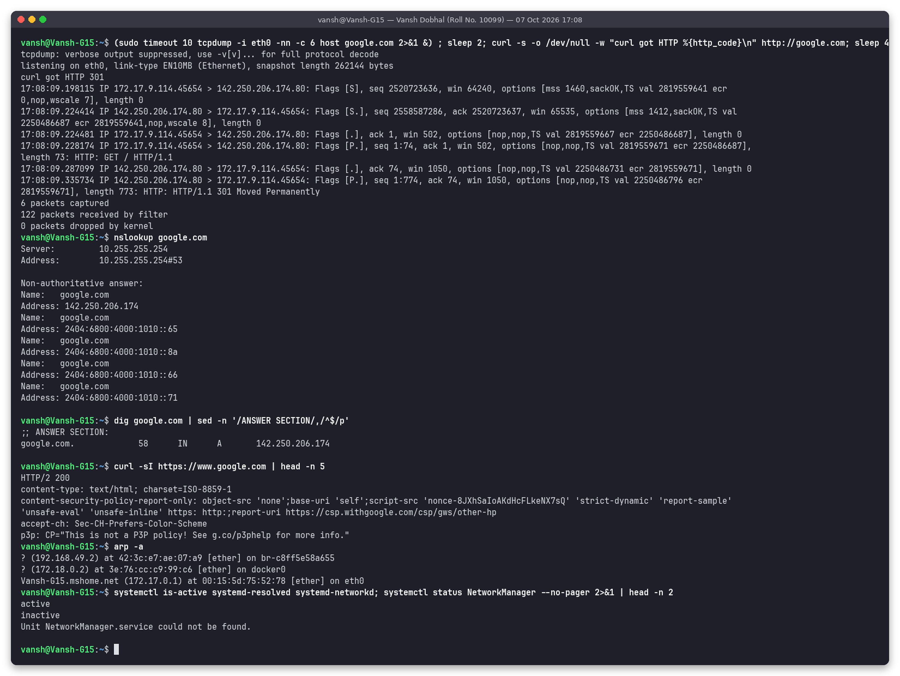

- **tcpdump** captured my `curl http://google.com`. The first three packets are the **TCP three-way handshake** (`Flags [S]` SYN, then `[S.]` SYN-ACK, then `[.]` ACK). Next is `[P.] ... HTTP: GET / HTTP/1.1` and the reply `HTTP/1.1 301 Moved Permanently`. This is exactly the Layer-4 handshake described in the shared *Networking* repo.
- **nslookup / dig:** google.com resolves to one IPv4 (A) and several IPv6 (AAAA) addresses. The resolver is `10.255.255.254` (WSL's DNS proxy).
- **curl -I https://www.google.com:** `HTTP/2 200`, so HTTPS works end-to-end.
- **arp -a:** the gateway `172.17.0.1` has MAC `00:15:5d:75:52:78`. `00:15:5d` is Microsoft's Hyper-V prefix, as expected inside WSL2.
- **systemctl:** the guide checks `NetworkManager`, but WSL Ubuntu doesn't use it (`Unit NetworkManager.service could not be found`). Here networking is handled by WSL itself, with `systemd-resolved` active for DNS.

### 1.4 Subnetting practice (ip.md + Subnetting repo) with `ipcalc`

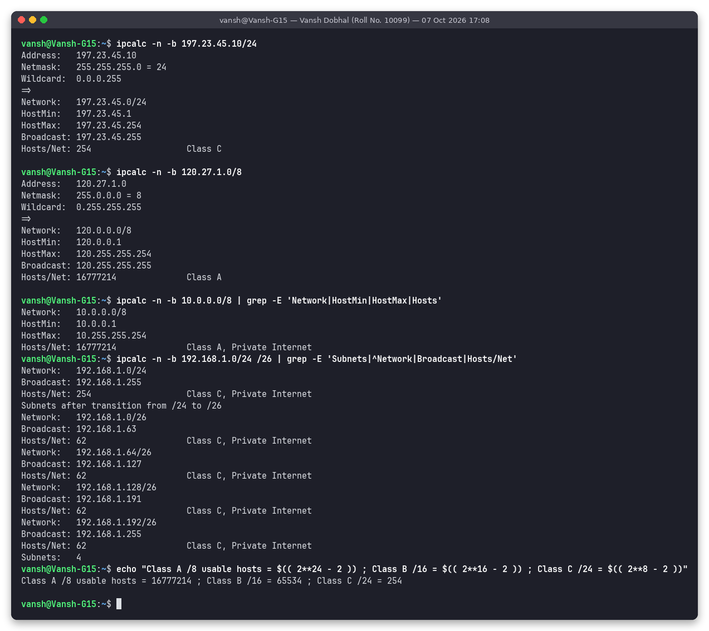

| Input (from class notes / repo) | Network | Broadcast | Usable host range | Hosts | Class |
|---|---|---|---|---|---|
| `197.23.45.10/24` | 197.23.45.0 | 197.23.45.255 | .1 – .254 | 254 | C |
| `120.27.1.0/8` | 120.0.0.0 | 120.255.255.255 | 120.0.0.1 – 120.255.255.254 | 16,777,214 (2^24 − 2) | A |
| `10.0.0.0/8` | 10.0.0.0 | 10.255.255.255 | 10.0.0.1 – 10.255.255.254 | 16,777,214 | A, private |
| `192.168.1.0/24` split into `/26` | .0, .64, .128, .192 | .63, .127, .191, .255 | 62 per subnet | 4 subnets | C, private |

What I understood: the mask decides how many bits are **network** and how many are **host**. `/8` leaves 24 host bits, so 2^24 − 2 usable hosts (minus the network and broadcast addresses). Borrowing 2 host bits (`/24` to `/26`) makes 2^2 = 4 subnets of 2^6 − 2 = 62 hosts each. These results match the class notes in `ip.md` and the Subnetting repo exactly.

---

## Task 2: Networking commands with output and explanation

### 2.1 Interfaces and IP addresses: `ip a`, `ip addr`, `ifconfig`, `hostname -I`

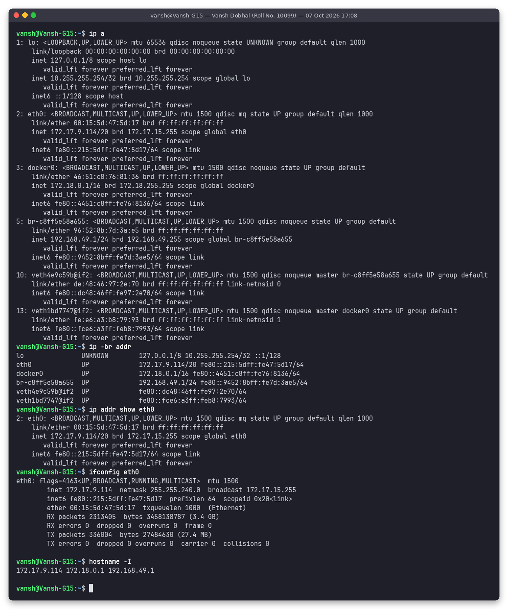

| Command | What I understood |
|---|---|
| `ip a` (= `ip addr`) | Modern (iproute2) command that lists every interface with its state (`UP`), MAC (`link/ether 00:15:5d:47:5d:17`), IPv4 (`inet 172.17.9.114/20`), IPv6 link-local (`fe80::…`) and MTU (1500). `lo` is loopback 127.0.0.1/8 |
| `ip -br addr` | Brief one-line-per-interface view, the quickest way to see all IPs |
| `ip addr show eth0` | The same details for one interface |
| `ifconfig eth0` | Older (net-tools) command. Same info, plus RX/TX packet and error counters (here 0 errors). It shows the netmask in dotted form (`255.255.240.0`) instead of `/20` |
| `hostname -I` | Just the IP addresses of the host: `172.17.9.114 172.18.0.1 192.168.49.1` (eth0, docker0, minikube bridge) |

### 2.2 Routing, ARP and name-resolution config: `ip route`, `route -n`, `ip neigh`, `arp`, `/etc/hosts`, `/etc/resolv.conf`

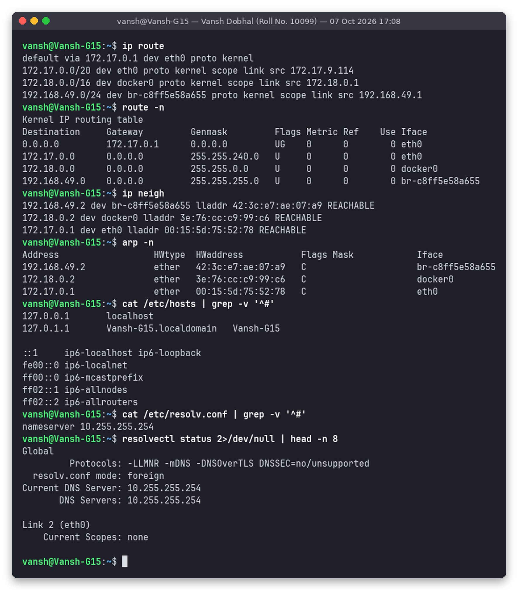

| Command | What I understood |
|---|---|
| `ip route` | The routing table. `default via 172.17.0.1 dev eth0` means anything not on a local network goes to the gateway. `172.17.0.0/20 dev eth0 ... scope link` means that network is directly connected. Docker and minikube networks have their own routes |
| `route -n` | The same table in the older format (flags `UG` = Up + Gateway) |
| `ip neigh` / `arp -n` | The ARP/neighbour cache maps IP to MAC on the local link (`172.17.0.1 → 00:15:5d:75:52:78 REACHABLE`). ARP works at Layer 2/3 and is needed before any frame can be sent on Ethernet |
| `/etc/hosts` | Static name-to-IP table checked **before** DNS (`127.0.0.1 localhost`, `127.0.1.1 Vansh-G15`) |
| `/etc/resolv.conf` | Which DNS server the system uses: `nameserver 10.255.255.254`, which WSL generates automatically |
| `resolvectl status` | systemd-resolved's view: the current DNS server and the DNSSEC/DoT settings |

### 2.3 Connectivity and path: `ping`, `traceroute`, `tracepath`

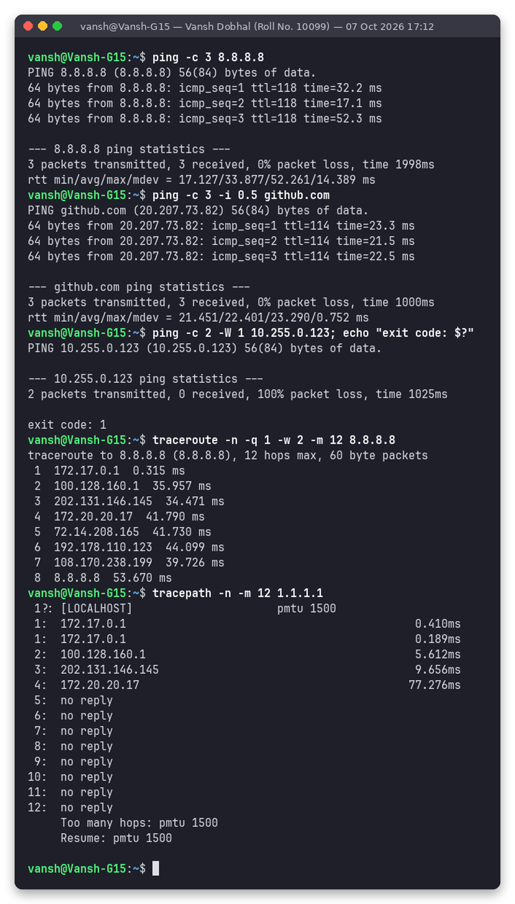

| Command | What I understood |
|---|---|
| `ping -c 3 8.8.8.8` | Sends ICMP echo requests. `ttl=118` and `time=…ms` show the remaining hop budget and the round-trip time. `-c` limits the count (otherwise ping runs forever on Linux) |
| `ping -c 3 -i 0.5 github.com` | Resolves the name first (`20.207.73.82`). `-i` sets the interval between packets |
| `ping -c 2 -W 1 10.255.0.123` | A host that does not exist: **100% packet loss**, **exit code 1**. Scripts can test `$?` |
| `traceroute -n -q 1 -w 2 8.8.8.8` | Sends packets with TTL = 1, 2, 3, … Each router that drops a packet replies, revealing the 8-hop path to Google DNS. `-n` skips reverse DNS, `-q 1` sends one probe per hop |
| `tracepath -n 1.1.1.1` | Like traceroute but needs no root and also discovers the **path MTU** (`pmtu 1500`). From hop 5 on there was `no reply`, because routers on that path do not answer UDP probes. This is a filtering behaviour, not a failure (the ping to 1.1.1.1 works) |

### 2.4 DNS: `nslookup`, `dig`, `host`

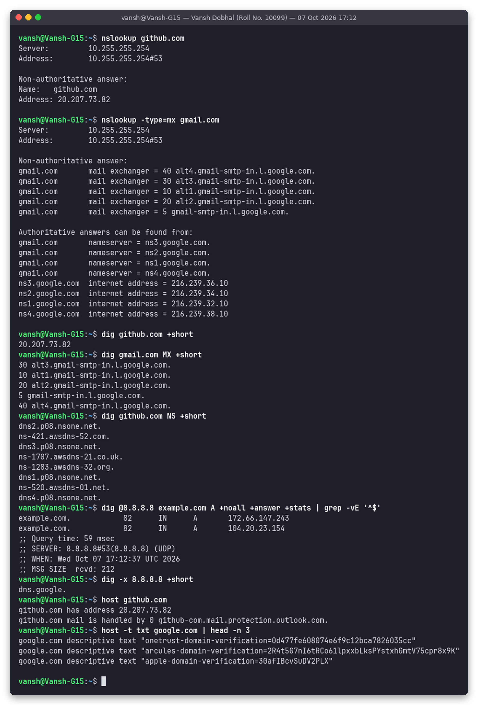

| Command | What I understood |
|---|---|
| `nslookup github.com` | Simple lookup. "Non-authoritative answer" means it came from a caching resolver, not from GitHub's own name servers |
| `nslookup -type=mx gmail.com` | Mail servers with priority (lower = preferred: `5 gmail-smtp-in.l.google.com`) plus the authoritative NS records |
| `dig github.com +short` | Only the answer: `20.207.73.82` |
| `dig gmail.com MX +short` / `dig github.com NS +short` | Record-type queries. GitHub's DNS is hosted on both NS1 (`nsone.net`) and AWS Route 53 (`awsdns`) for redundancy |
| `dig @8.8.8.8 example.com A +noall +answer +stats` | Asks a **specific server** (Google DNS). Shows the TTL (seconds the answer may be cached), the query time (59 ms) and that it used UDP port 53 |
| `dig -x 8.8.8.8 +short` | **Reverse DNS** (PTR record): `dns.google.` |
| `host github.com` / `host -t txt google.com` | Short human-readable output: A and MX records, and TXT records (domain-verification strings) |

### 2.5 HTTP / application layer: `curl`, `wget`

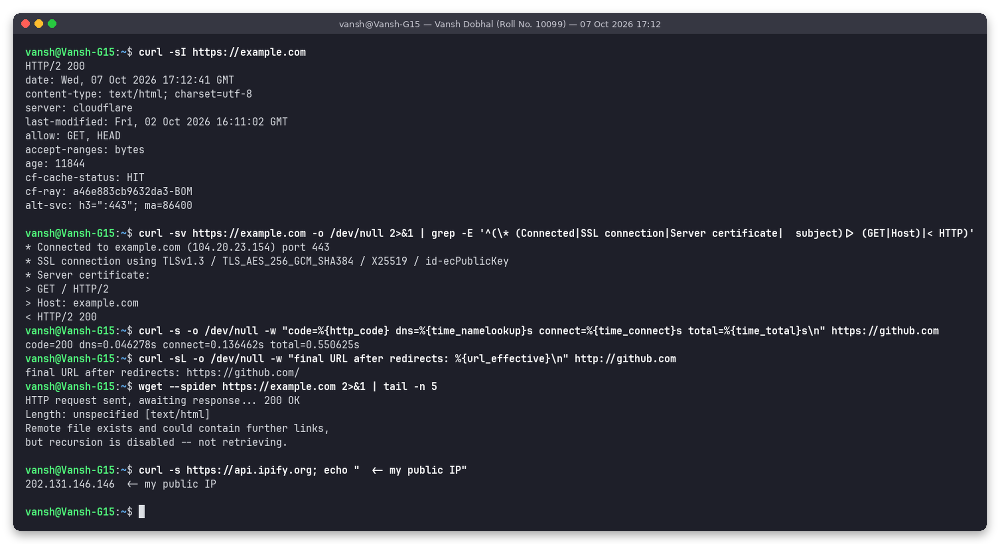

| Command | What I understood |
|---|---|
| `curl -sI https://example.com` | Sends a HEAD request and shows only the response headers: `HTTP/2 200`, `server: cloudflare`, `cf-cache-status: HIT` (served from a CDN cache) |
| `curl -sv ... \| grep` | Verbose mode shows each layer: `Connected to example.com (172.66.147.243) port 443` (TCP), `SSL connection using TLSv1.3 / TLS_AES_256_GCM_SHA384` (TLS), `> GET / HTTP/2` and `< HTTP/2 200` (HTTP) |
| `curl -w "...%{time_namelookup} %{time_connect} %{time_total}"` | Timing breakdown for github.com: DNS 0.036 s, TCP connect 0.107 s, total 0.474 s. Useful to tell whether DNS or the server is slow |
| `curl -sL -w %{url_effective} http://github.com` | `-L` follows redirects. HTTP was redirected to `https://github.com/` |
| `wget --spider https://example.com` | Checks that a URL exists (`200 OK`) without downloading it, which suits health checks |
| `curl -s https://api.ipify.org` | My **public** IP as seen by the internet (`202.131.146.146`), different from the private `172.17.9.114` because of NAT |

### 2.6 Ports and sockets: `ss`, `netstat`, `nc`, `telnet`

For this test I started a small web server, `python3 -m http.server 8080`, so there was a known open port.

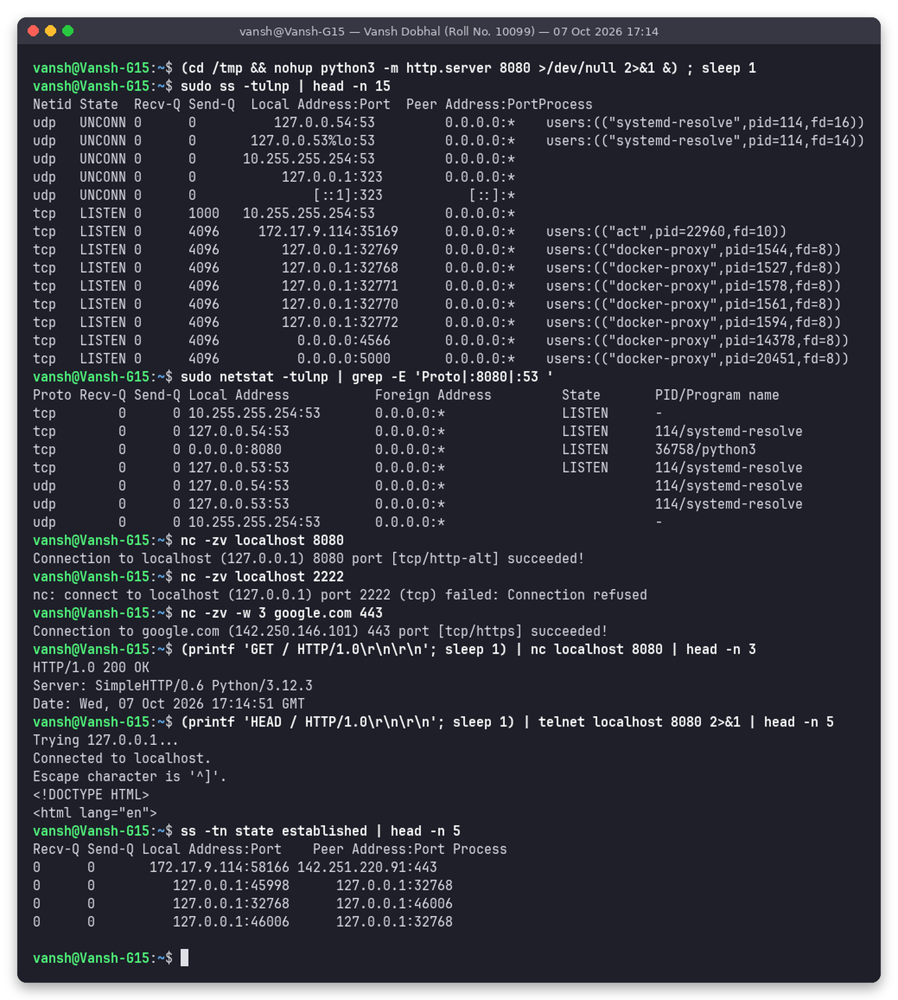

| Command | What I understood |
|---|---|
| `sudo ss -tulnp` | All **t**cp/**u**dp **l**istening sockets, **n**umeric, with **p**rocess: systemd-resolved on 127.0.0.53/54:53 (UDP and TCP), and docker-proxy listeners for the containers on this machine. `ss` is the modern replacement for netstat. (I cut the list at 15 lines with `head`, so 8080 falls just below the cut. The next command finds it) |
| `sudo netstat -tulnp \| grep` | The same in the old net-tools format. Filtering for `:8080` shows `0.0.0.0:8080 LISTEN .../python3`: my test server listening on all interfaces |
| `nc -zv localhost 8080` | Port check: `succeeded!`. `-z` only tests the connection, `-v` is verbose |
| `nc -zv localhost 2222` | `Connection refused`: nothing listens there (the kernel answers with a TCP RST) |
| `nc -zv -w 3 google.com 443` | Remote port check: HTTPS port open |
| `printf 'GET / ...' \| nc localhost 8080` | nc used as a raw TCP client: I typed HTTP by hand and got `HTTP/1.0 200 OK` from `SimpleHTTP/0.6 Python/3.12.3` |
| `telnet localhost 8080` | `Connected to localhost.` proves the port is open. The server sent back HTML without headers, most likely because telnet's line-ending handling made the request look like an old HTTP/0.9 request, which gets only a body in reply. telnet is fine for "is the port open", and `nc`/`curl` are better for real requests |
| `ss -tn state established` | Active connections, e.g. `172.17.9.114:58166 → 142.251.220.91:443` (an HTTPS connection to Google) |

### 2.7 Scanning and path quality: `nmap`, `mtr`

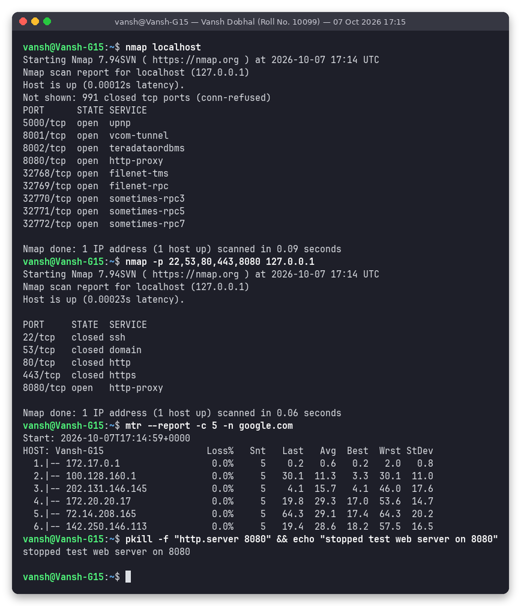

| Command | What I understood |
|---|---|
| `nmap localhost` | Scans the 1000 most common TCP ports. It found `8080/tcp open` (my test server) and other services running on this machine (docker-proxy ports 32768–32772 for minikube, and ports 5000/8001/8002 used by other lab containers). The other 991 ports are closed |
| `nmap -p 22,53,80,443,8080 127.0.0.1` | Scans chosen ports. 22 is **closed** because there is no SSH server in this WSL distro. 53 is closed on 127.0.0.1 because the DNS stub listens on 127.0.0.53/54, not 127.0.0.1 |
| `mtr --report -c 5 -n google.com` | traceroute and ping combined: per-hop **loss %** and **avg/best/worst latency** over 5 cycles. 0% loss on every hop means the path is healthy. The jitter (StDev) is mostly at the ISP hops 2–4 |

After the test, `pkill -f "http.server 8080"` stopped the web server.

### 2.8 Registration info: `whois`

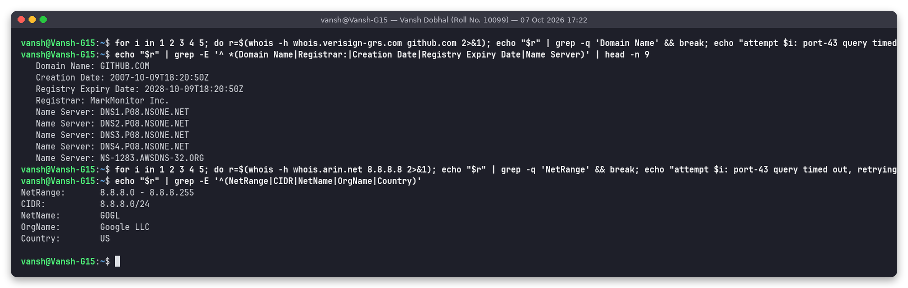

| Command | What I understood |
|---|---|
| `whois -h whois.verisign-grs.com github.com` | Domain registry data: registrar MarkMonitor, created 2007-10-09, expires 2028-10-09, plus the name servers (the same ones `dig NS` returned) |
| `whois -h whois.arin.net 8.8.8.8` | IP ownership: `8.8.8.0/24`, NetName `GOGL`, `Google LLC`, US. ARIN is the regional internet registry for North America |

Honest note: whois uses TCP port 43. From this network, plain `whois google.com` (which follows a referral to the registrar's server) timed out several times, so I queried the registry servers directly with `-h` and wrapped them in a small retry loop. The screenshot shows the successful run.

---

## Cheat tables

### OSI vs TCP/IP model (with the commands from this session)

| OSI layer | TCP/IP layer | Unit | Examples | Commands I used to see it |
|---|---|---|---|---|
| 7 Application | Application | Data | HTTP, HTTPS, DNS, SSH, FTP, SMTP, DHCP | `curl`, `wget`, `dig`, `nslookup`, `host`, `whois` |
| 6 Presentation | Application | Data | TLS encryption, encoding (UTF-8, gzip) | `curl -v` (TLSv1.3 handshake) |
| 5 Session | Application | Data | Session setup/teardown, TLS sessions | `curl -v`, `ss -tn state established` |
| 4 Transport | Transport | Segment | TCP (reliable, 3-way handshake), UDP (fast, no handshake), ports | `ss -tulnp`, `netstat`, `nc -zv`, `telnet`, `nmap`, `tcpdump` (SYN/SYN-ACK/ACK) |
| 3 Network | Internet | Packet | IP, ICMP, routing | `ip addr`, `ip route`, `ping`, `traceroute`, `tracepath`, `mtr`, `ipcalc` |
| 2 Data link | Network access | Frame | Ethernet, MAC addresses, ARP, switches | `ip link`, `ip neigh`, `arp -a` |
| 1 Physical | Network access | Bits | Cables, Wi-Fi radio, NIC | `ifconfig` RX/TX counters, `ip -s link` |

Devices: **switch** = Layer 2 (forwards by MAC), **router** = Layer 3 (forwards by IP between networks), **bridge** = Layer 2 link between LAN segments (`docker0` is a Linux bridge).

### Common ports

| Port | Protocol | Service |
|---|---|---|
| 20/21 | TCP | FTP data/control |
| 22 | TCP | SSH / SCP / SFTP |
| 23 | TCP | Telnet (plain text, avoid) |
| 25 / 587 | TCP | SMTP / SMTP submission |
| 53 | UDP + TCP | DNS |
| 67/68 | UDP | DHCP server/client |
| 80 | TCP | HTTP |
| 110 / 143 | TCP | POP3 / IMAP |
| 123 | UDP | NTP |
| 443 | TCP (and UDP for HTTP/3) | HTTPS |
| 3306 / 5432 / 6379 / 27017 | TCP | MySQL / PostgreSQL / Redis / MongoDB |
| 6443 | TCP | Kubernetes API server |
| 8080 | TCP | Alternate HTTP (Jenkins, dev servers) |
| 0–1023 / 1024–49151 / 49152–65535 | | Well-known / registered / ephemeral (client-side) ports |

### IP classes and private ranges (from `ip.md`)

| Class | First octet | Default mask | Network/host bits | Usable hosts per network | Private range |
|---|---|---|---|---|---|
| A | 1 – 126 (127 = loopback) | 255.0.0.0 (/8) | 8 / 24 | 2^24 − 2 = 16,777,214 | 10.0.0.0 – 10.255.255.255 |
| B | 128 – 191 | 255.255.0.0 (/16) | 16 / 16 | 2^16 − 2 = 65,534 | 172.16.0.0 – 172.31.255.255 |
| C | 192 – 223 | 255.255.255.0 (/24) | 24 / 8 | 2^8 − 2 = 254 | 192.168.0.0 – 192.168.255.255 |
| D | 224 – 239 | n/a | n/a | Multicast | n/a |
| E | 240 – 255 | n/a | n/a | Reserved / experimental | n/a |

Special addresses seen in this session: `127.0.0.0/8` loopback, `100.64.0.0/10` carrier-grade NAT (hop 2 of the traceroute), `169.254.0.0/16` link-local, and `0.0.0.0` meaning "all interfaces" in `ss` output.

---

## Folder structure

```
session-04-networking/
├── README.md                     # this file (Task 2 Markdown + Task 1 notes)
├── outputs/                      # exact text of each screenshot run
└── screenshots/
    ├── 01-task1-clone-shared-repos.png
    ├── 02-task1-troubleshoot-google-part1.png
    ├── 03-task1-troubleshoot-google-part2.png
    ├── 04-task1-subnetting-ipcalc.png
    ├── 05-interfaces.png
    ├── 06-routes-arp-config.png
    ├── 07-ping-traceroute-tracepath.png
    ├── 08-dns-nslookup-dig-host.png
    ├── 09-http-curl-wget.png
    ├── 10-ports-ss-netstat-nc.png
    ├── 11-nmap-mtr.png
    └── 12-whois.png
```

## How to reproduce

```bash
sudo apt-get install -y net-tools dnsutils traceroute iputils-tracepath nmap mtr-tiny telnet netcat-openbsd whois ipcalc tcpdump
git clone --depth 1 https://github.com/Nency-Ravaliya/Network-Troubleshooting
ip a; ip route; ip neigh; cat /etc/resolv.conf
ping -c 4 google.com; traceroute -n google.com; tracepath -n 1.1.1.1; mtr --report -c 5 google.com
nslookup github.com; dig github.com +short; dig gmail.com MX +short; dig -x 8.8.8.8 +short; host github.com
curl -I https://example.com; wget --spider https://example.com
python3 -m http.server 8080 & sudo ss -tulnp; nc -zv localhost 8080; nmap localhost
ipcalc 192.168.1.0/24 /26
```
