# Session 5 – Git & GitHub (Git Homework Tasks)

**Name:** Vansh Dobhal | **Roll No:** 10099

All practice was done in a throwaway repository, **`~/practice/git-homework`** (Ubuntu 24.04 on WSL2, `git version 2.43.0`). The commit author was set **only for that repo** (`git config --local`) to `Vansh Dobhal <vanshdobhal11@gmail.com>`.
Screenshots were made with a helper (`snap`) that runs the commands for real and saves a PNG (`screenshots/`) and the exact text (`outputs/`). The resulting files of the practice repo (without `.git`) and its full history are in [`practice-repo-snapshot/`](practice-repo-snapshot/).

Reference cheat-sheets from the course repo: https://git-scm.com/cheat-sheet and https://education.github.com/git-cheat-sheet-education.pdf

## Contents
- [Setup](#setup)
- [Task 1: git commit -a -m](#task-1-git-commit--a--m)
- [Task 2: Git Cherry-Pick](#task-2-git-cherry-pick)
- [Folder structure](#folder-structure)
- [How to reproduce](#how-to-reproduce)

---

## Setup

```bash
mkdir -p ~/practice/git-homework && cd ~/practice/git-homework
git init -b main
git config user.name  "Vansh Dobhal"            # local to this repo only
git config user.email "vanshdobhal11@gmail.com"
echo "# Git Homework - Vansh Dobhal (10099)" > README.md
echo "line 1" > app.txt
git add README.md app.txt && git commit -m "Initial commit: README and app.txt"
```

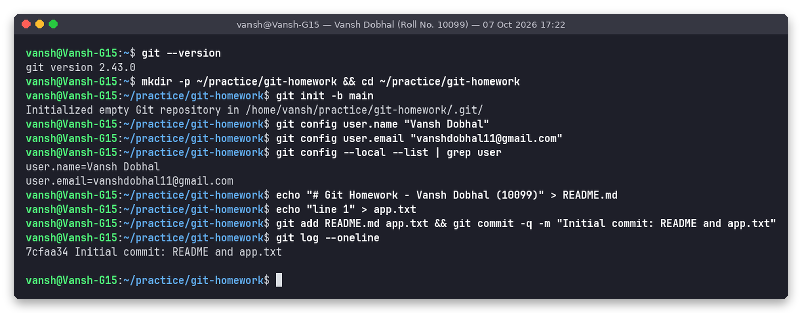

---

## Task 1: git commit -a -m

### Theory: the three areas, and what each command commits

```
 working directory  --git add-->  staging area (index)  --git commit-->  repository (history)
```

| Command | What gets committed |
|---|---|
| `git commit -m "msg"` | **Only what is already staged** (put in the index with `git add`). Unstaged changes are ignored. If nothing is staged, nothing is committed |
| `git commit -a -m "msg"` (`-am`) | First **automatically stages every modified or deleted file that Git already tracks** (like `git add -u`), then commits. **New, untracked files are NOT included** |
| `git add <file>` + `git commit -m` | Full control: you choose exactly which files and changes go in, including new files |

### Test setup

The repo has one commit. I modified a tracked file (`app.txt`) and created a new untracked file (`new_file.txt`):

```
 M app.txt        <- tracked, modified (not staged)
?? new_file.txt   <- untracked
```

### Test A: `git commit -m` without `git add` commits nothing

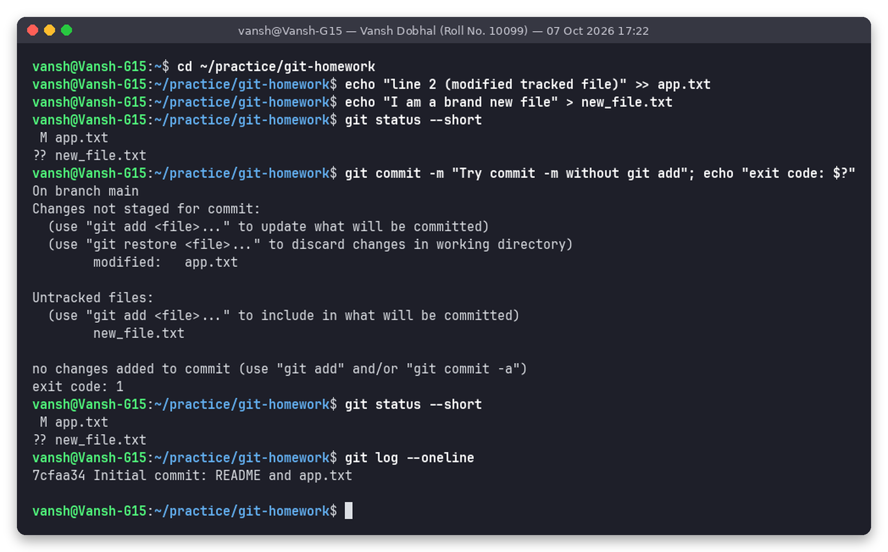

```
$ git commit -m "Try commit -m without git add"; echo "exit code: $?"
On branch main
Changes not staged for commit:
	modified:   app.txt
Untracked files:
	new_file.txt
no changes added to commit (use "git add" and/or "git commit -a")
exit code: 1
```

**Observation:** Git refused to commit (exit code 1). `git status` before and after is identical (` M app.txt`, `?? new_file.txt`), and `git log` still shows only the initial commit `7cfaa34`. Git's own hint suggests `git add` or `git commit -a`.

### Test B: `git commit -a -m` stages the tracked file only

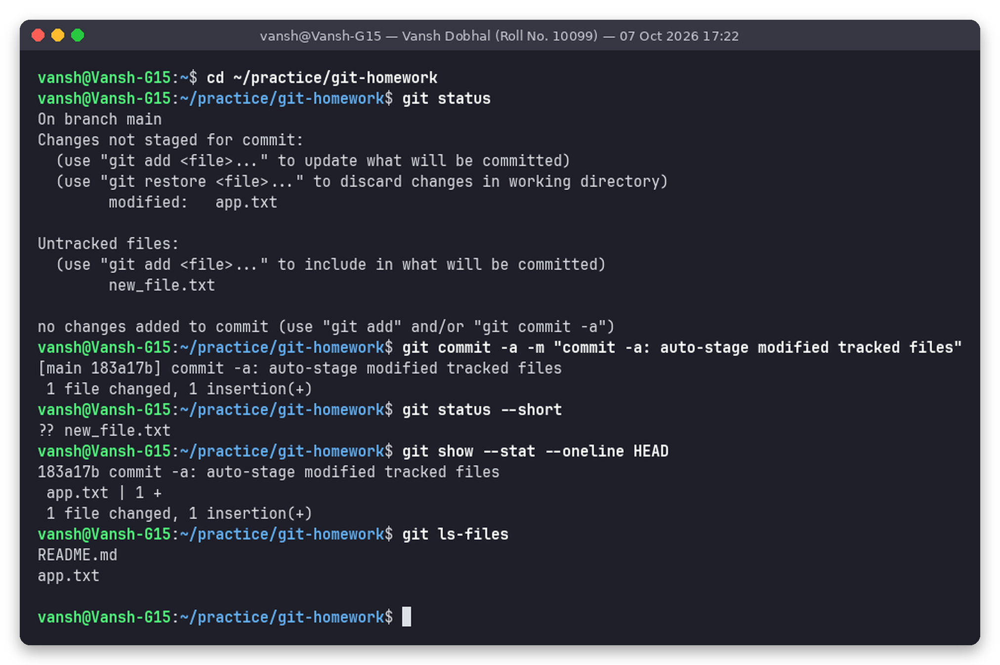

```
$ git commit -a -m "commit -a: auto-stage modified tracked files"
[main 183a17b] commit -a: auto-stage modified tracked files
 1 file changed, 1 insertion(+)
$ git status --short
?? new_file.txt
$ git show --stat --oneline HEAD
183a17b commit -a: auto-stage modified tracked files
 app.txt | 1 +
```

**Observation:** `-a` picked up the modified tracked file `app.txt` without a `git add`, but **`new_file.txt` is still untracked** (`??`) and is not in `git ls-files`. `-a` never adds new files.

### Test C: new files need `git add` and then `git commit -m`

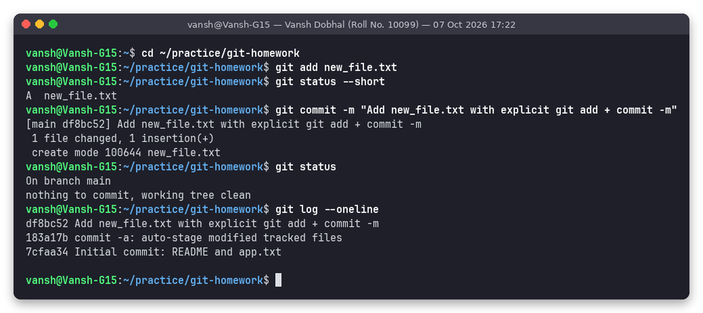

After `git add new_file.txt` the status became `A  new_file.txt` (staged), and `git commit -m` created `df8bc52` (`create mode 100644 new_file.txt`). The working tree is now clean.

### Test D (extra): `-a` also stages deletions of tracked files

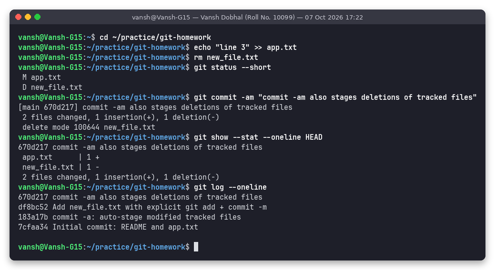

I modified `app.txt` and deleted the tracked `new_file.txt` (` M` and ` D`). A single `git commit -am` recorded both: `2 files changed, 1 insertion(+), 1 deletion(-)`, `delete mode 100644 new_file.txt`.

### Summary of what I observed

| Scenario | `git commit -m` (no add) | `git commit -a -m` |
|---|---|---|
| Modified tracked file | Not committed | Committed |
| Deleted tracked file | Not committed | Committed |
| New untracked file | Not committed | **Not committed** (needs `git add`) |
| Already staged changes | Committed | Committed |

**When to use which:** `git commit -am` is a handy shortcut for "commit all my edits to existing files". Use `git add <files>` + `git commit -m` when the change includes new files, or when you want to commit only some of the changes (`git add -p`) to keep each commit focused.

---

## Task 2: Git Cherry-Pick

**`git cherry-pick <commit>`** takes the changes introduced by one specific commit on another branch and applies them as a **new commit** on the current branch. The new commit has the same message, author and diff, but a **different hash**, because its parent is different. It is used to bring a single hotfix into `main` or a release branch without merging the whole feature branch.

### Step 1: commits on `main`

```bash
echo "def login(): pass"  > auth.py && git add auth.py && git commit -m "main: add auth.py login stub"
echo "def logout(): pass" >> auth.py && git commit -am "main: add logout to auth.py"
echo "v1.0" > VERSION && git add VERSION && git commit -m "main: add VERSION file"
git log --oneline
```

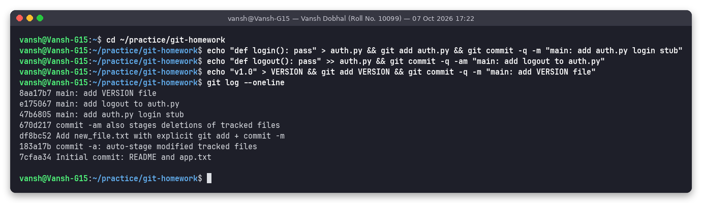

`main` now has 3 new commits (`47b6805`, `e175067`, `8aa17b7`) on top of the 4 commits from Task 1.

### Step 2: new branch with 3 commits

```bash
git switch -c feature
echo "def pay(): return 'paid'" > payment.py && git add payment.py && git commit -m "feature: add payment.py"
echo "BUGFIX: validate user input before login" > hotfix.txt && git add hotfix.txt && git commit -m "feature: critical input-validation fix"
echo "def refund(): return 'refunded'" >> payment.py && git commit -am "feature: add refund to payment.py"
git log --oneline main..feature      # commits on feature that are not on main
```

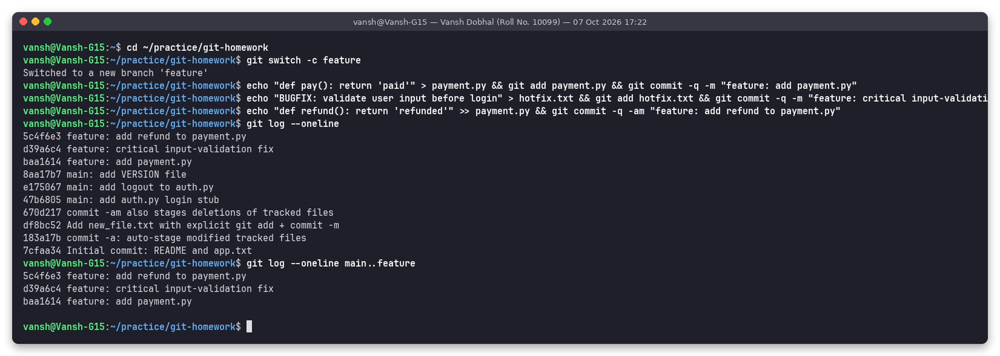

```
5c4f6e3 feature: add refund to payment.py
d39a6c4 feature: critical input-validation fix
baa1614 feature: add payment.py
```

The scenario: the payment feature is not ready, but the **input-validation fix (`d39a6c4`)** is needed on `main` now.

### Step 3: identify the specific commit

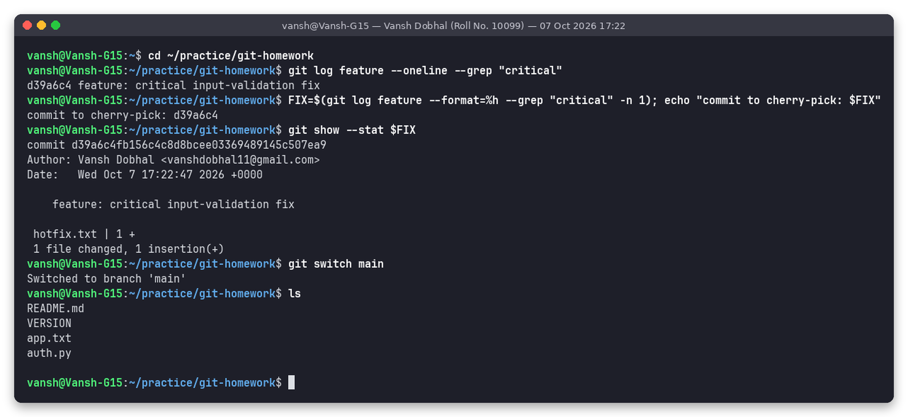

- `git log feature --oneline --grep "critical"` gives `d39a6c4 feature: critical input-validation fix`.
- `git show --stat d39a6c4` confirms it only adds `hotfix.txt` (1 file, 1 insertion).
- `git switch main` and `ls` show `main` does not yet have `hotfix.txt` or `payment.py`.

### Step 4: cherry-pick into `main`

```bash
git switch main
git cherry-pick d39a6c4
```

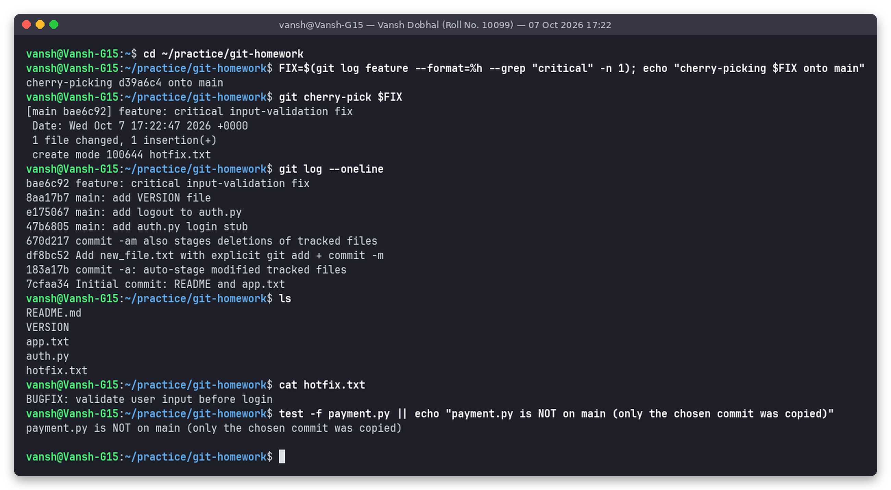

```
[main bae6c92] feature: critical input-validation fix
 Date: Wed Oct 7 17:22:47 2026 +0000
 1 file changed, 1 insertion(+)
 create mode 100644 hotfix.txt
```

### Step 5: verify

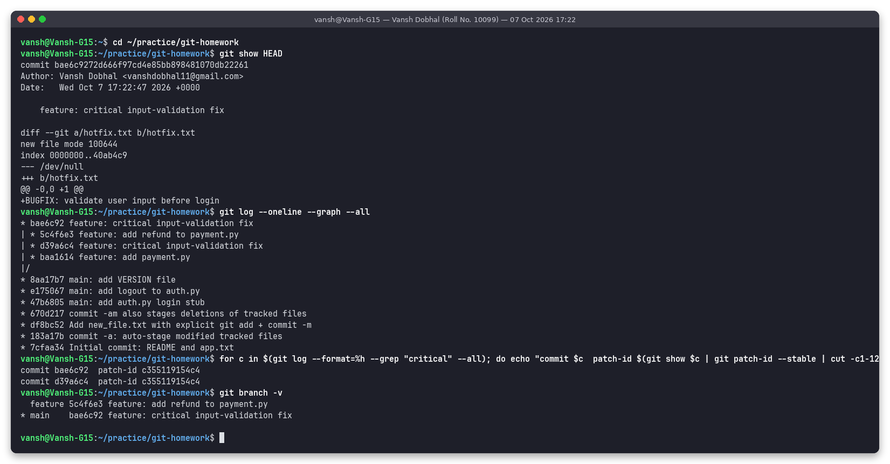

- `git log --oneline` on main: `bae6c92 feature: critical input-validation fix` is the newest commit.
- `cat hotfix.txt` prints `BUGFIX: validate user input before login`.
- `payment.py` is **not** on main: only the chosen commit was copied, not the commits before or after it.
- `git show HEAD` shows the same diff (`+BUGFIX: validate user input before login` in the new file `hotfix.txt`).
- The original `d39a6c4` and the copy `bae6c92` have **different hashes** but the **same patch-id `c355119154c4`**. Git sees them as the same change applied on a different parent.

`git log --oneline --graph --all`:

```
* bae6c92 feature: critical input-validation fix          <- cherry-picked copy on main
| * 5c4f6e3 feature: add refund to payment.py
| * d39a6c4 feature: critical input-validation fix        <- original on feature
| * baa1614 feature: add payment.py
|/
* 8aa17b7 main: add VERSION file
* e175067 main: add logout to auth.py
* 47b6805 main: add auth.py login stub
* 670d217 commit -am also stages deletions of tracked files
* df8bc52 Add new_file.txt with explicit git add + commit -m
* 183a17b commit -a: auto-stage modified tracked files
* 7cfaa34 Initial commit: README and app.txt
```

(The arrows are my annotations. The unannotated output is in `outputs/10-task2-verify.txt`.)

Final state, with branch labels and author shown:

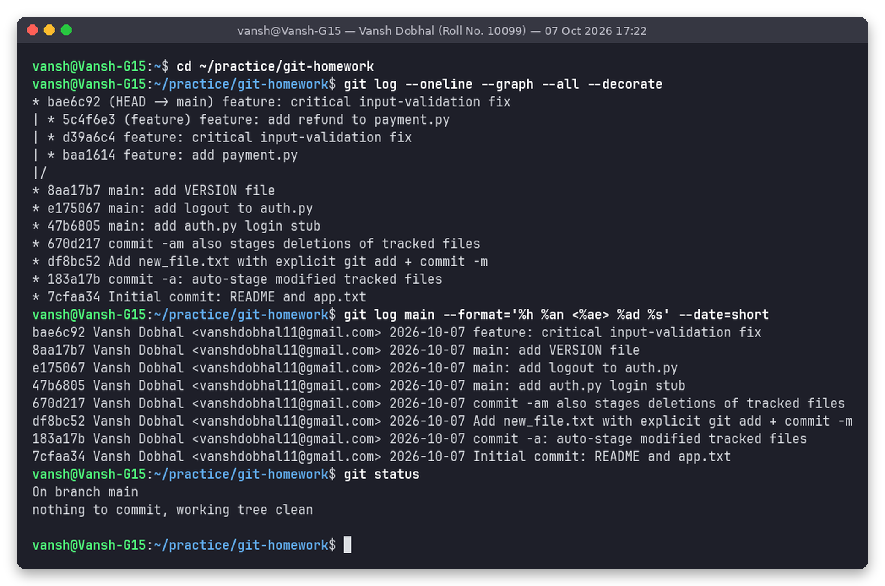

### Cherry-pick notes

| Option / situation | Meaning |
|---|---|
| `git cherry-pick A B C` | Pick several commits in order |
| `git cherry-pick A..B` | Pick a range (excluding A) |
| `git cherry-pick -x <c>` | Adds "(cherry picked from commit ...)" to the message, useful on release branches |
| `git cherry-pick -n <c>` | Apply the changes without committing (stage only) |
| Conflict | Fix the files, `git add`, then `git cherry-pick --continue` (or `--abort` / `--skip`) |
| Caution | Cherry-picking creates duplicate commits with different hashes. Merging the branch later is usually fine (same patch), but cherry-pick is not a replacement for merging whole features |

---

## Folder structure

```
session-05-git-github/
├── README.md
├── practice-repo-snapshot/          # files of ~/practice/git-homework (no .git), via git archive
│   ├── git-log.txt                  # git log --graph --all --decorate (full history)
│   ├── main/      README.md app.txt auth.py VERSION hotfix.txt
│   └── feature/   README.md app.txt auth.py VERSION hotfix.txt payment.py
├── outputs/                         # exact text of each screenshot run (11 files)
└── screenshots/
    ├── 01-setup-repo.png
    ├── 02-task1-commit-m-without-add.png
    ├── 03-task1-commit-a-m.png
    ├── 04-task1-commit-m-after-add.png
    ├── 05-task1-deleted-file-and-am.png
    ├── 06-task2-main-commits.png
    ├── 07-task2-feature-branch.png
    ├── 08-task2-identify-commit.png
    ├── 09-task2-cherry-pick.png
    ├── 10-task2-verify.png
    └── 11-final-history.png
```

## How to reproduce

```bash
mkdir -p ~/practice/git-homework && cd ~/practice/git-homework
git init -b main && git config user.name "Vansh Dobhal" && git config user.email "vanshdobhal11@gmail.com"
echo "line 1" > app.txt && git add . && git commit -m "init"

# Task 1
echo "line 2" >> app.txt; echo new > new_file.txt
git commit -m "no add"         # nothing committed
git commit -am "auto-stage"    # app.txt committed, new_file.txt still untracked
git add new_file.txt && git commit -m "add new file"

# Task 2
echo a > auth.py && git add . && git commit -m "main: auth"
git switch -c feature
echo p > payment.py && git add . && git commit -m "feature: payment"
echo fix > hotfix.txt && git add . && git commit -m "feature: critical fix"
git switch main
git cherry-pick $(git log feature --format=%h --grep "critical" -n 1)
git log --oneline --graph --all
```
