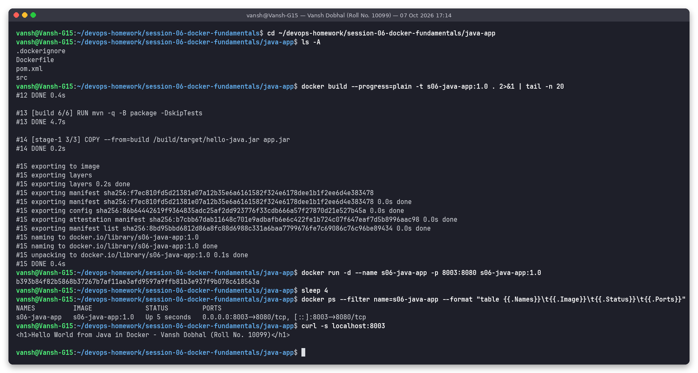
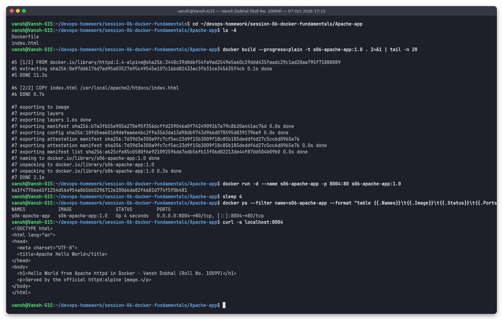
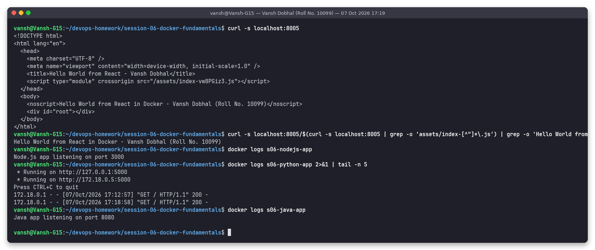
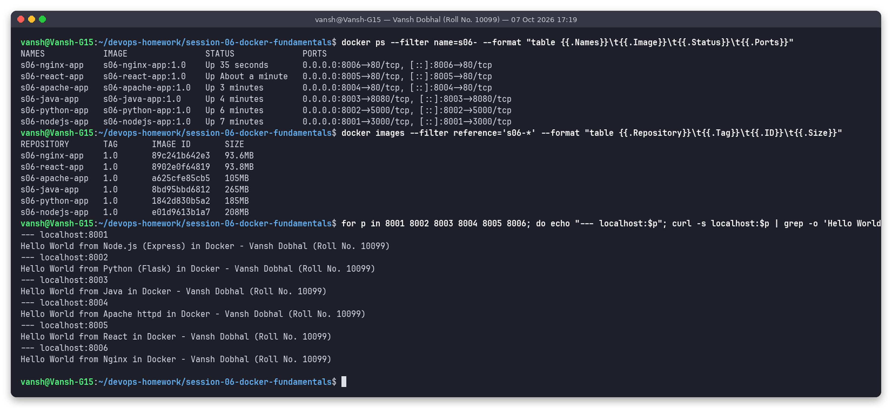

# Session 6 - Docker Fundamentals: Hello World web apps

**Name:** Vansh Dobhal | **Roll No:** 10099

**Task:** Create simple Hello World web applications with Docker - one folder each for `nodejs-app`, `python-app`, `java-app`, `Apache-app`, `React-app` and `nginx-app`. Each folder has the app code, a Dockerfile and its own README. Each image was built, run as a container and checked with `curl` to confirm "Hello World" shows on the web page.

Environment: Docker Engine 29.8.2 in WSL2 (Ubuntu 24.04, host `Vansh-G15`). Every screenshot below was made with the `snap` tool: it runs the commands for real and saves the terminal output as a PNG plus a `.txt` log in [`outputs/`](outputs/). Nothing in this README is typed in by hand.

## Summary

| # | App folder | Stack | Base image(s) | Container | Host port -> container port | Image size |
|---|---|---|---|---|---|---|
| 1 | [`nodejs-app`](nodejs-app/) | Node.js 20 + Express | `node:20-alpine` | `s06-nodejs-app` | 8001 -> 3000 | 208MB |
| 2 | [`python-app`](python-app/) | Python 3.12 + Flask | `python:3.12-slim` | `s06-python-app` | 8002 -> 5000 | 185MB |
| 3 | [`java-app`](java-app/) | Java 17, JDK `HttpServer`, Maven | `maven:3.9-eclipse-temurin-17` -> `eclipse-temurin:17-jre-alpine` (multi-stage) | `s06-java-app` | 8003 -> 8080 | 265MB |
| 4 | [`Apache-app`](Apache-app/) | Apache httpd 2.4 | `httpd:2.4-alpine` | `s06-apache-app` | 8004 -> 80 | 105MB |
| 5 | [`React-app`](React-app/) | React 18 + Vite, served by nginx | `node:20-alpine` -> `nginx:alpine` (multi-stage) | `s06-react-app` | 8005 -> 80 | 93.8MB |
| 6 | [`nginx-app`](nginx-app/) | Nginx | `nginx:alpine` | `s06-nginx-app` | 8006 -> 80 | 93.6MB |

Every page shows `Hello World from <stack> in Docker - Vansh Dobhal (Roll No. 10099)`.

---

## 1. nodejs-app (Node.js + Express)

**Code:** [`nodejs-app/server.js`](nodejs-app/server.js) - an Express server with a `GET /` route that returns the Hello World `<h1>`.

**Dockerfile explained** ([`nodejs-app/Dockerfile`](nodejs-app/Dockerfile)):

```dockerfile
FROM node:20-alpine          # small official Node.js runtime on Alpine Linux
WORKDIR /app                 # all later instructions run in /app
COPY package*.json ./        # dependency manifest first, so the next layer can be cached
RUN npm install --omit=dev   # install express (production deps only)
COPY server.js ./            # application code - changes often, so it comes last
EXPOSE 3000                  # documents the port; publishing is done with -p
CMD ["node", "server.js"]    # process the container runs (PID 1)
```

**Build / run / verify:**
```bash
cd nodejs-app
docker build --progress=plain -t s06-nodejs-app:1.0 .
docker run -d --name s06-nodejs-app -p 8001:3000 s06-nodejs-app:1.0
docker ps --filter name=s06-nodejs-app
curl -s localhost:8001
```


Observed: the container is `Up` with `0.0.0.0:8001->3000/tcp`, and `curl` returns `<h1>Hello World from Node.js (Express) in Docker - Vansh Dobhal (Roll No. 10099)</h1>`.

---

## 2. python-app (Python + Flask)

**Code:** [`python-app/app.py`](python-app/app.py) - Flask app with a `/` route, started with `app.run(host="0.0.0.0", port=5000)`. Binding to `0.0.0.0` matters: Flask's default `127.0.0.1` would only accept connections from inside the container. [`requirements.txt`](python-app/requirements.txt) pins `flask==3.0.3`.

**Dockerfile explained** ([`python-app/Dockerfile`](python-app/Dockerfile)):

```dockerfile
FROM python:3.12-slim                         # Debian slim Python (no compilers/docs, about 1/8 of python:3.12)
ENV PYTHONDONTWRITEBYTECODE=1 PYTHONUNBUFFERED=1   # no .pyc files, logs are not buffered
WORKDIR /app
COPY requirements.txt .                       # deps first (cache friendly)
RUN pip install --no-cache-dir -r requirements.txt  # --no-cache-dir keeps pip's cache out of the layer
COPY app.py .
EXPOSE 5000
CMD ["python", "app.py"]
```

**Build / run / verify:**
```bash
cd python-app
docker build --progress=plain -t s06-python-app:1.0 .
docker run -d --name s06-python-app -p 8002:5000 s06-python-app:1.0
docker ps --filter name=s06-python-app
curl -s localhost:8002
```


Observed: `pip` installed Flask 3.0.3 plus its dependencies (Werkzeug, Jinja2, ...). The container is published on 8002 and `curl` returns the Flask Hello World heading.

---

## 3. java-app (Java 17, Maven multi-stage)

**Code:** [`HelloServer.java`](java-app/src/main/java/com/vansh/hello/HelloServer.java) uses the JDK's built-in `com.sun.net.httpserver.HttpServer`, so no framework is needed. [`pom.xml`](java-app/pom.xml) packages `hello-java.jar` and sets `Main-Class` in the manifest so it runs with `java -jar`.

**Dockerfile explained** ([`java-app/Dockerfile`](java-app/Dockerfile)):

```dockerfile
# Stage 1 - build
FROM maven:3.9-eclipse-temurin-17 AS build   # Maven + full JDK 17
WORKDIR /build
COPY pom.xml .
RUN mvn -q -B dependency:go-offline          # download plugins once; cached while pom.xml is unchanged
COPY src ./src
RUN mvn -q -B package -DskipTests            # produces target/hello-java.jar

# Stage 2 - runtime
FROM eclipse-temurin:17-jre-alpine           # JRE only, no Maven, no compiler
WORKDIR /app
COPY --from=build /build/target/hello-java.jar app.jar   # copy just the artifact out of stage 1
EXPOSE 8080
CMD ["java", "-jar", "app.jar"]
```

**Build / run / verify:**
```bash
cd java-app
docker build --progress=plain -t s06-java-app:1.0 .
docker run -d --name s06-java-app -p 8003:8080 s06-java-app:1.0
docker ps --filter name=s06-java-app
curl -s localhost:8003
```



Observed: the build log shows `[build 6/6] RUN mvn ... package` followed by `[stage-1 3/3] COPY --from=build ...`. The final image (265MB) contains only the JRE and the jar. `curl localhost:8003` returns the Java Hello World heading.

---

## 4. Apache-app (Apache httpd)

**Code:** [`Apache-app/index.html`](Apache-app/index.html).

**Dockerfile explained** ([`Apache-app/Dockerfile`](Apache-app/Dockerfile)):

```dockerfile
FROM httpd:2.4-alpine                                       # official Apache HTTP Server, Alpine variant
COPY index.html /usr/local/apache2/htdocs/index.html        # httpd's DocumentRoot in this image
EXPOSE 80
CMD ["httpd-foreground"]                                    # keeps Apache in the foreground (same as the base image's CMD)
```

**Build / run / verify:**
```bash
cd Apache-app
docker build --progress=plain -t s06-apache-app:1.0 .
docker run -d --name s06-apache-app -p 8004:80 s06-apache-app:1.0
docker ps --filter name=s06-apache-app
curl -s localhost:8004
```



Observed: a two-step build (`FROM`, then `COPY`). Apache serves the custom page on port 8004.

---

## 5. React-app (React + Vite, multi-stage node -> nginx)

**Code:** a minimal Vite project: [`index.html`](React-app/index.html), [`src/main.jsx`](React-app/src/main.jsx), [`src/App.jsx`](React-app/src/App.jsx) (renders the Hello World `<h1>`), [`vite.config.js`](React-app/vite.config.js), and [`nginx.conf`](React-app/nginx.conf) (SPA fallback: `try_files $uri $uri/ /index.html`).

**Dockerfile explained** ([`React-app/Dockerfile`](React-app/Dockerfile)):

```dockerfile
# Stage 1 - build static files
FROM node:20-alpine AS build
WORKDIR /app
COPY package*.json ./
RUN npm install                 # react, react-dom, vite, @vitejs/plugin-react
COPY . .
RUN npm run build               # vite build -> /app/dist (index.html + hashed JS bundle)

# Stage 2 - serve with nginx
FROM nginx:alpine
COPY nginx.conf /etc/nginx/conf.d/default.conf
COPY --from=build /app/dist /usr/share/nginx/html   # only the compiled files; node_modules is left behind
EXPOSE 80
CMD ["nginx", "-g", "daemon off;"]
```

**Build / run / verify:**
```bash
cd React-app
docker build --progress=plain -t s06-react-app:1.0 .
docker run -d --name s06-react-app -p 8005:80 s06-react-app:1.0
docker ps --filter name=s06-react-app
curl -s localhost:8005
```


Observed: Vite built `dist/assets/index-vw8PGiz3.js` (142.90 kB, 45.96 kB gzip). The final image is only 93.8MB because Node and `node_modules` stay in the build stage. React renders in the browser, so `curl` gets the HTML shell, which includes the `<noscript>` Hello World text. The next screenshot pulls the built JS bundle and shows that the rendered `<h1>` text is inside it:



---

## 6. nginx-app (Nginx)

**Code:** [`nginx-app/index.html`](nginx-app/index.html).

**Dockerfile explained** ([`nginx-app/Dockerfile`](nginx-app/Dockerfile)):

```dockerfile
FROM nginx:alpine                                    # official nginx, Alpine variant
COPY index.html /usr/share/nginx/html/index.html     # replace the default welcome page
EXPOSE 80
CMD ["nginx", "-g", "daemon off;"]                   # run in the foreground; a daemonised nginx would make PID 1 exit and stop the container
```

**Build / run / verify:**
```bash
cd nginx-app
docker build --progress=plain -t s06-nginx-app:1.0 .
docker run -d --name s06-nginx-app -p 8006:80 s06-nginx-app:1.0
docker ps --filter name=s06-nginx-app
curl -s localhost:8006
```


Observed: the `FROM nginx:alpine` step is `CACHED` because the base image was already present locally, so only the `COPY` layer was built. (The build also printed a BuildKit `WARNING: current commit information was not captured` line: BuildKit tried to read git metadata for the build context, and this folder is not a git repo yet. It does not affect the image.)

---

## All six containers, `docker ps` and the `docker images` table

```bash
docker ps --filter name=s06- --format "table {{.Names}}\t{{.Image}}\t{{.Status}}\t{{.Ports}}"
docker images --filter reference='s06-*' --format "table {{.Repository}}\t{{.Tag}}\t{{.ID}}\t{{.Size}}"
for p in 8001 8002 8003 8004 8005 8006; do curl -s localhost:$p | grep -o 'Hello World from ...'; done
```



`docker images` output from that run ([`outputs/07-all-containers-and-images.txt`](outputs/07-all-containers-and-images.txt)):

```
REPOSITORY       TAG       IMAGE ID       SIZE
s06-nginx-app    1.0       89c241b642e3   93.6MB
s06-react-app    1.0       8902e0f64819   93.8MB
s06-apache-app   1.0       a625cfe85cb5   105MB
s06-java-app     1.0       8bd95bbd6812   265MB
s06-python-app   1.0       1842d830b5a2   185MB
s06-nodejs-app   1.0       e01d9613b1a7   208MB
```

(Docker 29 uses the containerd image store, and `SIZE` here is the on-disk size, which includes both the compressed and the unpacked layers. Compressed "content size" is smaller.)

## What I learned

- **Image vs container:** `docker build` creates a read-only image made of layers. `docker run` adds a thin writable layer on top and starts the `CMD` process. One image can run as many containers.
- **`EXPOSE` does not publish a port.** Only `-p host:container` maps a host port. I used host ports 8001-8006 so all six apps could run at once, even though three of them listen on 80 inside their containers.
- **Instruction order matters for the cache:** copying `package.json` / `requirements.txt` / `pom.xml` before the source means a code change does not re-run `npm install` / `pip install` / `mvn dependency:go-offline`.
- **Multi-stage builds** (java-app, React-app) leave build tools out of the final image. The React image ends up the same size as a plain nginx image.
- **Foreground process:** a container lives only as long as its PID 1. That is why nginx runs with `daemon off;` and Apache with `httpd-foreground`.
- Apps must listen on `0.0.0.0` inside the container (Flask, Java `HttpServer`), not `localhost`.

## Folder structure

```
session-06-docker-fundamentals
├── .gitignore
├── Apache-app/      Dockerfile, index.html, README.md
├── React-app/       .dockerignore, Dockerfile, index.html, nginx.conf, package.json, src/{App.jsx,main.jsx}, vite.config.js, README.md
├── java-app/        .dockerignore, Dockerfile, pom.xml, src/main/java/com/vansh/hello/HelloServer.java, README.md
├── nginx-app/       Dockerfile, index.html, README.md
├── nodejs-app/      .dockerignore, Dockerfile, package.json, server.js, README.md
├── python-app/      .dockerignore, Dockerfile, app.py, requirements.txt, README.md
├── scripts/run-session06.sh     builds, runs and checks all six apps (this produced every screenshot)
├── screenshots/     01-nodejs-app.png ... 08-react-page-source.png
└── outputs/         plain-text logs of the same runs
```

## How to reproduce

```bash
cd ~/devops-homework/session-06-docker-fundamentals
bash scripts/run-session06.sh        # needs the `snap` helper from ../tools; or run the commands from each section by hand
# open http://localhost:8001 ... http://localhost:8006 in a browser
# clean up:
docker rm -f s06-nodejs-app s06-python-app s06-java-app s06-apache-app s06-react-app s06-nginx-app
```

Containers were removed after the screenshots were taken. The `s06-*:1.0` images were kept.
