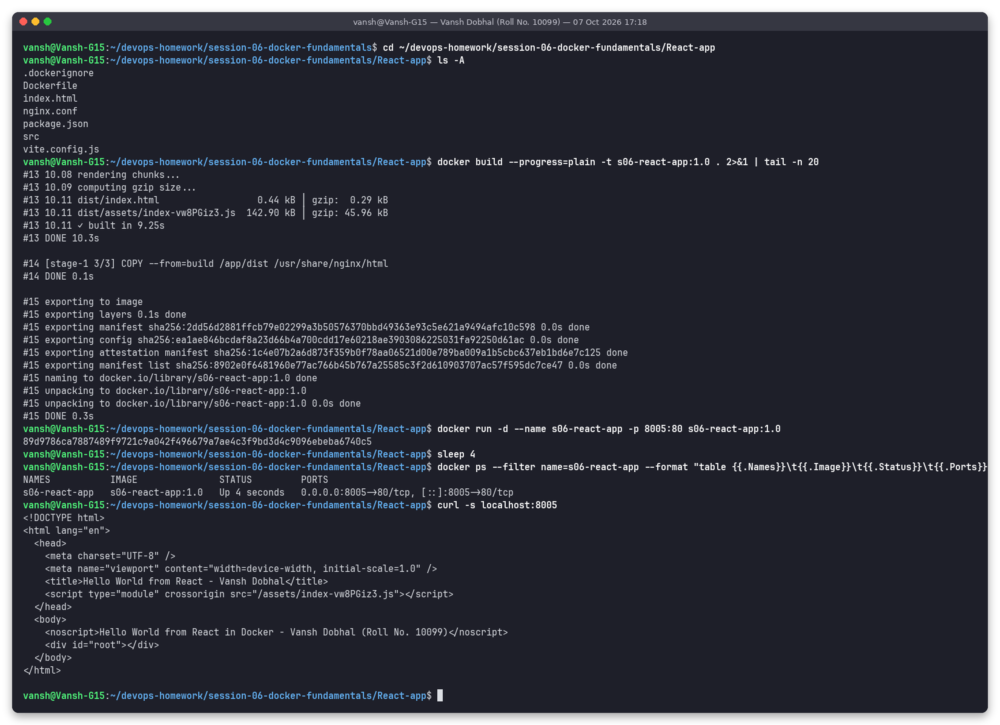

# React-app - React (Vite, multi-stage node -> nginx) Hello World

**Name:** Vansh Dobhal | **Roll No:** 10099

Part of [Session 6 - Docker Fundamentals](../README.md).

## What it is
A minimal Vite + React 18 project (`index.html`, `src/main.jsx`, `src/App.jsx`, `vite.config.js`). Stage 1 runs `npm install` and `npm run build` to produce static files in `dist/`; stage 2 copies only `dist/` and `nginx.conf` (SPA fallback with `try_files`) into nginx. The heading is rendered by JavaScript, so `curl` shows the HTML shell plus the `<noscript>` text, and the heading text is found inside the built JS bundle (screenshot 08 of the main README).

Base image(s): `node:20-alpine -> nginx:alpine`

Files: `.dockerignore`, `Dockerfile`, `index.html`, `nginx.conf`, `package.json`, `src`, `vite.config.js`

## Build and run
```bash
cd session-06-docker-fundamentals/React-app
docker build -t s06-react-app:1.0 .
docker run -d --name s06-react-app -p 8005:80 s06-react-app:1.0
docker ps --filter name=s06-react-app
curl -s localhost:8005
```

## Result
The page at `http://localhost:8005` shows:

> Hello World from React in Docker - Vansh Dobhal (Roll No. 10099)



Full text log of the same run: [`../outputs/05-React-app.txt`](../outputs/05-React-app.txt)

## Clean up
```bash
docker rm -f s06-react-app
```
