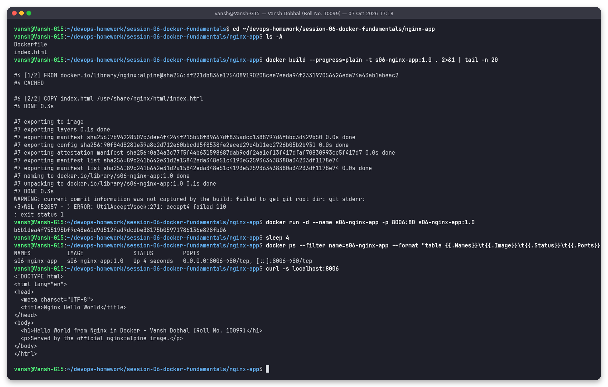

# nginx-app - Nginx Hello World

**Name:** Vansh Dobhal | **Roll No:** 10099

Part of [Session 6 - Docker Fundamentals](../README.md).

## What it is
`index.html` replaces nginx's default page in `/usr/share/nginx/html/`. `CMD ["nginx", "-g", "daemon off;"]` keeps nginx in the foreground so the container stays running.

Base image(s): `nginx:alpine`

Files: `Dockerfile`, `index.html`

## Build and run
```bash
cd session-06-docker-fundamentals/nginx-app
docker build -t s06-nginx-app:1.0 .
docker run -d --name s06-nginx-app -p 8006:80 s06-nginx-app:1.0
docker ps --filter name=s06-nginx-app
curl -s localhost:8006
```

## Result
The page at `http://localhost:8006` shows:

> Hello World from Nginx in Docker - Vansh Dobhal (Roll No. 10099)



Full text log of the same run: [`../outputs/06-nginx-app.txt`](../outputs/06-nginx-app.txt)

## Clean up
```bash
docker rm -f s06-nginx-app
```
