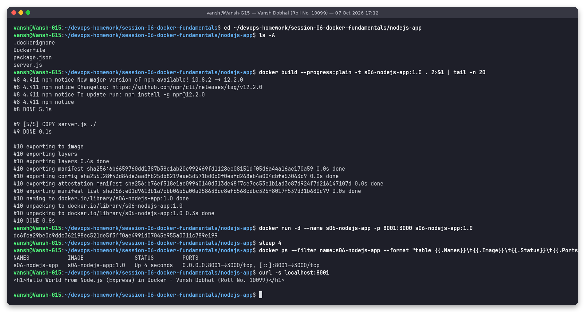

# nodejs-app - Node.js (Express) Hello World

**Name:** Vansh Dobhal | **Roll No:** 10099

Part of [Session 6 - Docker Fundamentals](../README.md).

## What it is
`server.js` is an Express server with a `/` route returning the Hello World heading and a `/health` JSON route. `package.json` declares the single dependency (`express`).

Base image(s): `node:20-alpine`

Files: `.dockerignore`, `Dockerfile`, `package.json`, `server.js`

## Build and run
```bash
cd session-06-docker-fundamentals/nodejs-app
docker build -t s06-nodejs-app:1.0 .
docker run -d --name s06-nodejs-app -p 8001:3000 s06-nodejs-app:1.0
docker ps --filter name=s06-nodejs-app
curl -s localhost:8001
```

## Result
The page at `http://localhost:8001` shows:

> Hello World from Node.js (Express) in Docker - Vansh Dobhal (Roll No. 10099)



Full text log of the same run: [`../outputs/01-nodejs-app.txt`](../outputs/01-nodejs-app.txt)

## Clean up
```bash
docker rm -f s06-nodejs-app
```
