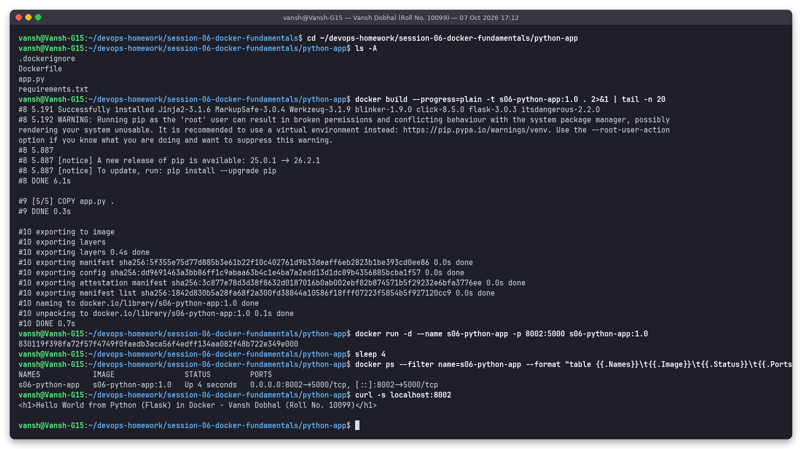

# python-app - Python (Flask) Hello World

**Name:** Vansh Dobhal | **Roll No:** 10099

Part of [Session 6 - Docker Fundamentals](../README.md).

## What it is
`app.py` is a Flask app bound to `0.0.0.0:5000` (binding to 127.0.0.1 would make it unreachable from outside the container). `requirements.txt` pins `flask==3.0.3`.

Base image(s): `python:3.12-slim`

Files: `.dockerignore`, `Dockerfile`, `app.py`, `requirements.txt`

## Build and run
```bash
cd session-06-docker-fundamentals/python-app
docker build -t s06-python-app:1.0 .
docker run -d --name s06-python-app -p 8002:5000 s06-python-app:1.0
docker ps --filter name=s06-python-app
curl -s localhost:8002
```

## Result
The page at `http://localhost:8002` shows:

> Hello World from Python (Flask) in Docker - Vansh Dobhal (Roll No. 10099)



Full text log of the same run: [`../outputs/02-python-app.txt`](../outputs/02-python-app.txt)

## Clean up
```bash
docker rm -f s06-python-app
```
