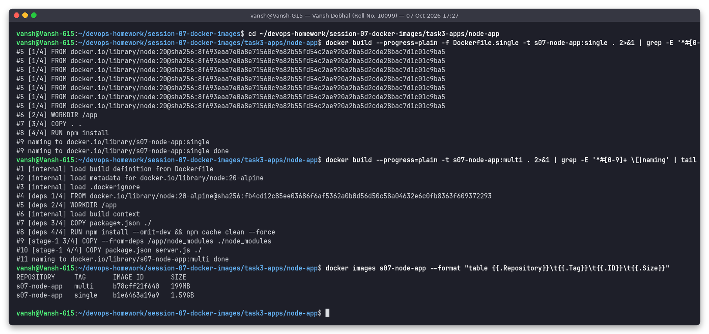
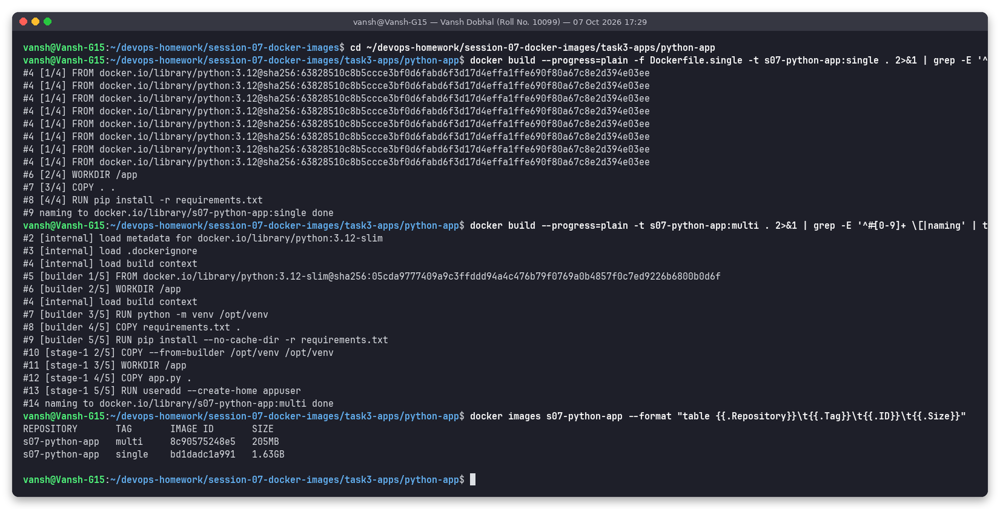
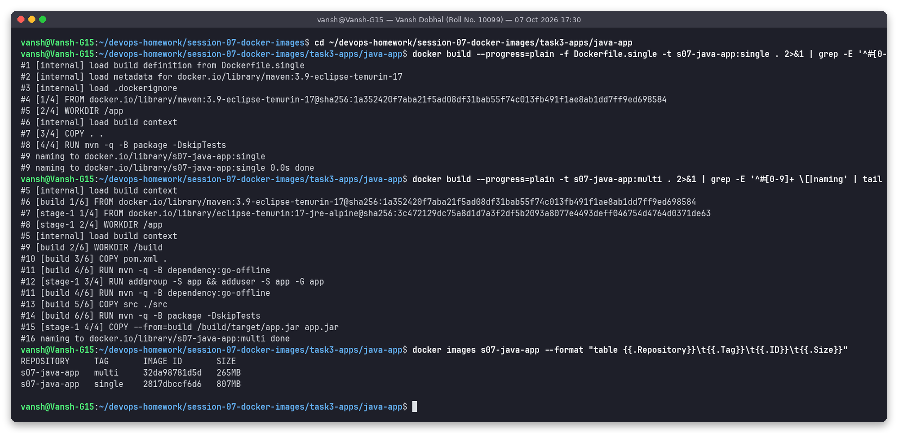
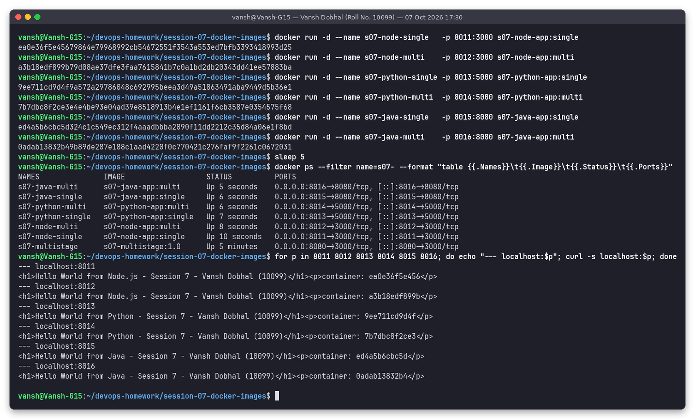
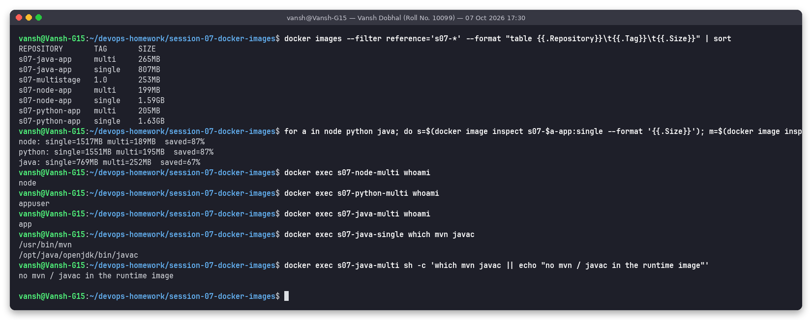
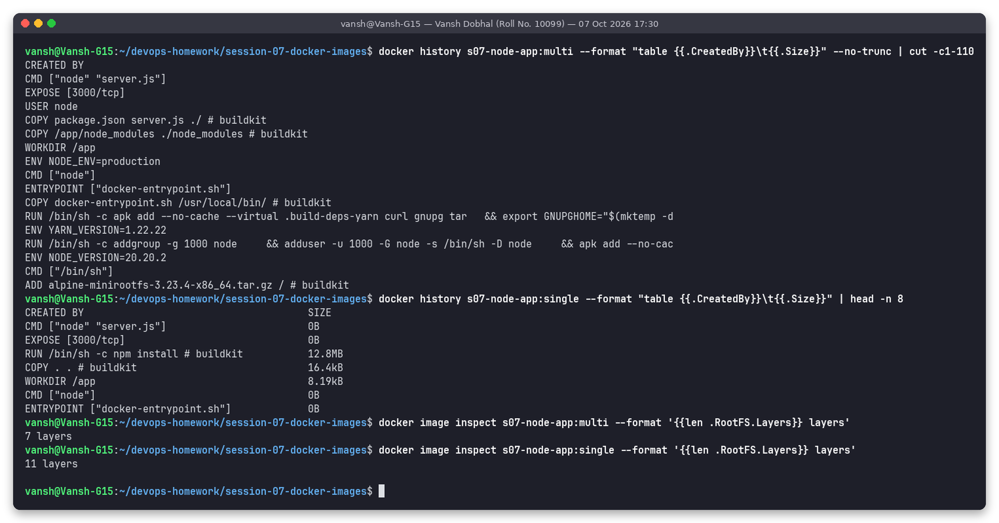
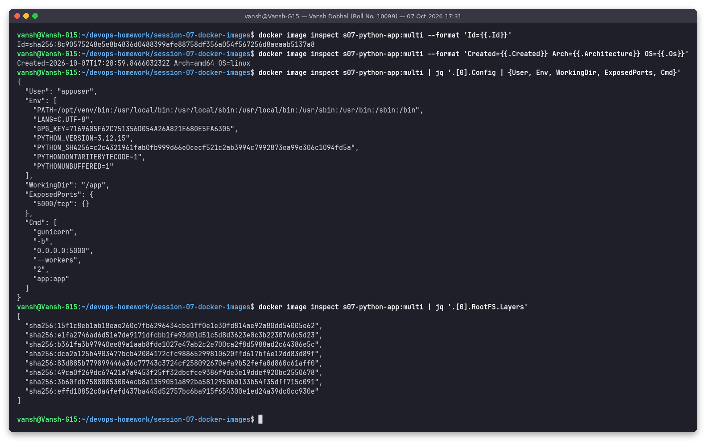
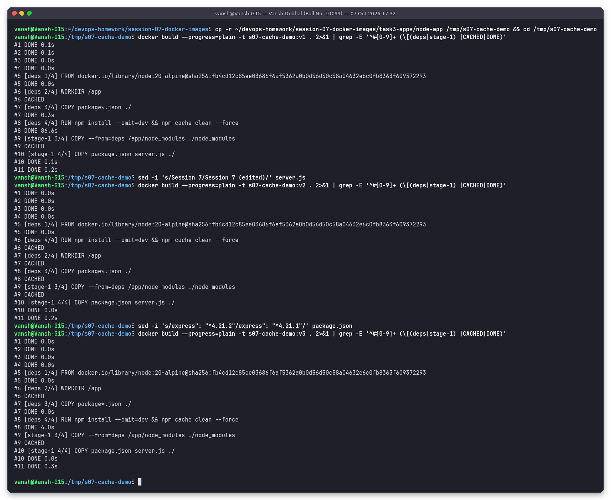
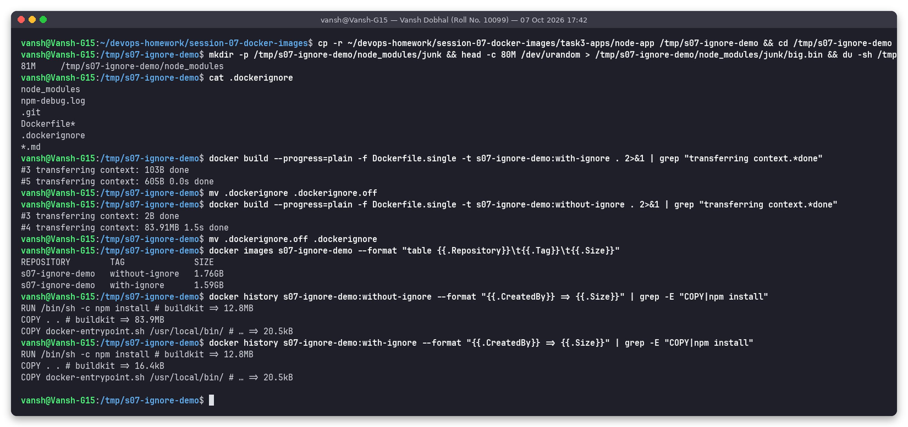
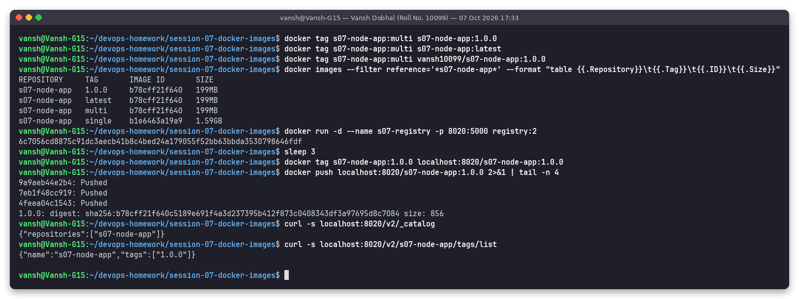

# Session 7 - Docker Images (multi-stage builds, layers, caching, tags)

**Name:** Vansh Dobhal | **Roll No / Enrollment No:** 10099

Environment: Docker Engine 29.8.2 (BuildKit, containerd image store) in WSL2 Ubuntu 24.04 on host `Vansh-G15`. Every screenshot was made with the `snap` tool, which runs the commands for real and saves a PNG plus a text log in [`outputs/`](outputs/). The script that produced all of them is [`scripts/run-session07.sh`](scripts/run-session07.sh).

| Task | Where |
|---|---|
| Task 1: Run Multi-Stage Dockerfile | [below](#task-1-run-multi-stage-dockerfile), files in [`task1-multistage/`](task1-multistage/) |
| Task 2: Documentation (.md with name, enrollment no., screenshots) | [`task1-multistage/README.md`](task1-multistage/README.md) and [below](#task-2-documentation) |
| Task 3: Deploy 3 app types (Node.js, Python, Java) with Docker | [below](#task-3-deploy-nodejs-python-and-java-apps-with-docker), code in [`task3-apps/`](task3-apps/) |
| Image concepts: layers, history, inspect, cache, .dockerignore, tags | [below](#image-concepts-with-real-demos) |

---

## Task 1: Run Multi-Stage Dockerfile

**Requirement:** clone the repository that has the multi-stage Dockerfile, build the image, run a container, open the app, check that it shows "Hello World from Docker multi-stage build", check `docker ps`, and confirm port 8080.

The multi-stage Dockerfile is in the instructor's repo at `session6-7-docker/multi-stage-dockerfile/`. I cloned it fresh from GitHub:

```bash
git clone --depth 1 https://github.com/Nency-Ravaliya/devops-heros.git /tmp/s07-devops-heros
cd /tmp/s07-devops-heros/session6-7-docker/multi-stage-dockerfile
```


**The Dockerfile (from the repo), explained:**

```dockerfile
# Stage 1: Build
FROM node:24-alpine AS builder          # named stage "builder"
WORKDIR /app
COPY package*.json ./
RUN npm install                         # all deps (incl. dev) available for building/testing
COPY . .

# Stage 2: Production
FROM node:24-alpine AS production       # fresh base: nothing from stage 1 carries over unless copied
WORKDIR /app
COPY --from=builder /app/package*.json ./
RUN npm install --omit=dev              # production deps only
COPY --from=builder /app/server.js ./   # only the file the app needs
EXPOSE 3000
CMD ["npm", "start"]                    # -> node server.js
```

**Build** (`--no-cache`, so every step really runs):

```bash
docker build --no-cache --progress=plain -t s07-multistage:1.0 .
```


**Run on port 8080 and verify.** The Express app listens on 3000 inside the container, so I published it as host port 8080:

```bash
docker run -d --name s07-multistage -p 8080:3000 s07-multistage:1.0
docker ps --filter name=s07-multistage
docker port s07-multistage
curl -s -i localhost:8080
```


Observed:
- `docker ps` shows `0.0.0.0:8080->3000/tcp` and status `Up`, so port 8080 is confirmed.
- `curl` returns `HTTP/1.1 200 OK` and `<h1>Hello World from Docker Multi-Stage Build!</h1>`.
- `docker logs`: `Server running on port 3000`.

---

## Task 2: Documentation

The separate documentation file is **[`task1-multistage/README.md`](task1-multistage/README.md)**. It contains my name (Vansh Dobhal), enrollment number (10099), the steps, the screenshot of the app running, and the screenshot of `docker ps` showing port 8080 ([`screenshots/03-task1-run-and-verify.png`](screenshots/03-task1-run-and-verify.png)).

---

## Task 3: Deploy Node.js, Python and Java apps with Docker

Each app in [`task3-apps/`](task3-apps/) has two Dockerfiles, so the effect of a multi-stage build can be measured:

| App | `Dockerfile.single` (naive) | `Dockerfile` (optimized multi-stage) |
|---|---|---|
| [`node-app`](task3-apps/node-app/) (Express) | `FROM node:20`, `COPY . .`, `npm install` | `deps` stage on `node:20-alpine` installs prod deps; runtime stage copies `node_modules` + 2 files, `NODE_ENV=production`, `USER node` |
| [`python-app`](task3-apps/python-app/) (Flask + gunicorn) | `FROM python:3.12`, `pip install` | `builder` stage creates a venv in `/opt/venv`; runtime `python:3.12-slim` copies only the venv + `app.py`, runs as `appuser` |
| [`java-app`](task3-apps/java-app/) (JDK `HttpServer`) | build **and** run in `maven:3.9-eclipse-temurin-17` | `build` stage (Maven + JDK) -> runtime `eclipse-temurin:17-jre-alpine` with only `app.jar`, `USER app` |

Optimized Python Dockerfile, as an example ([`task3-apps/python-app/Dockerfile`](task3-apps/python-app/Dockerfile)):

```dockerfile
FROM python:3.12-slim AS builder
WORKDIR /app
RUN python -m venv /opt/venv                      # self-contained dependency folder, easy to copy
ENV PATH="/opt/venv/bin:$PATH"
COPY requirements.txt .
RUN pip install --no-cache-dir -r requirements.txt

FROM python:3.12-slim
ENV PATH="/opt/venv/bin:$PATH" PYTHONDONTWRITEBYTECODE=1 PYTHONUNBUFFERED=1
COPY --from=builder /opt/venv /opt/venv           # only the installed packages
WORKDIR /app
COPY app.py .
RUN useradd --create-home appuser
USER appuser                                      # do not run as root
EXPOSE 5000
CMD ["gunicorn", "-b", "0.0.0.0:5000", "--workers", "2", "app:app"]   # production WSGI server
```

### Builds

```bash
for app in node python java; do
  cd ~/devops-homework/session-07-docker-images/task3-apps/$app-app
  docker build -f Dockerfile.single -t s07-$app-app:single .
  docker build                      -t s07-$app-app:multi  .
done
```





### Run all six containers and verify

```bash
docker run -d --name s07-node-single   -p 8011:3000 s07-node-app:single
docker run -d --name s07-node-multi    -p 8012:3000 s07-node-app:multi
docker run -d --name s07-python-single -p 8013:5000 s07-python-app:single
docker run -d --name s07-python-multi  -p 8014:5000 s07-python-app:multi
docker run -d --name s07-java-single   -p 8015:8080 s07-java-app:single
docker run -d --name s07-java-multi    -p 8016:8080 s07-java-app:multi
```



All six return their Hello World page (`Hello World from Node.js / Python / Java - Session 7 - Vansh Dobhal (10099)`) along with the container hostname. The single-stage and multi-stage images behave the same way.

### Image size comparison: single-stage vs multi-stage



Real numbers from [`outputs/08-image-size-comparison.txt`](outputs/08-image-size-comparison.txt):

| App | single-stage | multi-stage | saved |
|---|---|---|---|
| Node.js | 1.59GB (1517 MiB) | 199MB (189 MiB) | **87%** |
| Python | 1.63GB (1551 MiB) | 205MB (195 MiB) | **87%** |
| Java | 807MB (769 MiB) | 265MB (252 MiB) | **67%** |

The same screenshot shows two more benefits besides size:
- **Non-root:** `whoami` prints `node`, `appuser` and `app` in the multi-stage containers.
- **Smaller attack surface:** the single-stage Java container still has `/usr/bin/mvn` and `javac`. The multi-stage one has neither (`no mvn / javac in the runtime image`).

---

## Image concepts with real demos

### Layers and `docker history`

Each filesystem-changing instruction (`FROM`'s rootfs, `RUN`, `COPY`, `ADD`) creates a read-only layer, identified by a content hash. `ENV`, `CMD`, `EXPOSE`, `USER` and `WORKDIR` only change metadata (0B in history). Layers are shared between images and between containers. A running container adds one thin writable layer on top (copy-on-write).

```bash
docker history s07-node-app:multi --no-trunc
docker history s07-node-app:single
docker image inspect s07-node-app:multi --format '{{len .RootFS.Layers}} layers'
```



Observed: the multi-stage image has **7** layers and the single-stage one has **11**. In the multi-stage history, the build stage's `RUN npm install` is gone. Only `COPY /app/node_modules ./node_modules` from stage `deps` is there, because a final image contains only the layers of its last stage.

### `docker image inspect`

```bash
docker image inspect s07-python-app:multi | jq '.[0].Config | {User, Env, WorkingDir, ExposedPorts, Cmd}'
docker image inspect s07-python-app:multi | jq '.[0].RootFS.Layers'
```



Inspect shows the image ID (`sha256:8c90575248e5...`), the architecture (`amd64/linux`), the config set by my Dockerfile (`User: appuser`, `PATH=/opt/venv/bin:...`, `ExposedPorts 5000/tcp`, the gunicorn `Cmd`), and the 8 layer digests.

### Build cache

BuildKit reuses a cached layer when the instruction and all of its inputs (files being copied, parent layer) are unchanged. As soon as one step misses the cache, every step after it is rebuilt.

```bash
docker build -t s07-cache-demo:v1 .              # baseline
sed -i 's/Session 7/Session 7 (edited)/' server.js
docker build -t s07-cache-demo:v2 .              # only source changed
sed -i 's/"^4.21.2"/"^4.21.1"/' package.json
docker build -t s07-cache-demo:v3 .              # dependency manifest changed
```



| Build | What changed | `COPY package*.json` | `RUN npm install` | `COPY server.js` |
|---|---|---|---|---|
| v1 | first build in a new directory | DONE 0.3s | DONE 86.6s | DONE |
| v2 | `server.js` only | **CACHED** | **CACHED** | DONE 0.0s |
| v3 | `package.json` | DONE | DONE 4.0s (re-ran) | DONE |

This is why every Dockerfile here copies the dependency manifest before the source code. Editing code never re-downloads dependencies.

### `.dockerignore`

`.dockerignore` removes files from the **build context** before it is sent to the builder. That makes builds faster, keeps images small, and keeps secrets and junk out of `COPY . .`. My Node.js `.dockerignore`:

```
node_modules
npm-debug.log
.git
Dockerfile*
.dockerignore
*.md
```

Demo: I put an 80MB fake `node_modules/junk/big.bin` in a copy of the app and built `Dockerfile.single` (`COPY . .`) with and without `.dockerignore`:



| | build context sent | `COPY . .` layer | image |
|---|---|---|---|
| with `.dockerignore` | **605B** | 16.4kB | 1.59GB |
| without `.dockerignore` | **83.91MB** | 83.9MB | 1.76GB |

Note: `npm install` later prunes unknown folders from `node_modules`, so the junk file is not visible in the final filesystem. The 83.9MB `COPY . .` layer is still stored in the image, because a later layer cannot shrink an earlier one. (BuildKit only sends the paths that `COPY` instructions use. That is why I used `Dockerfile.single` with `COPY . .` for this test. The multi-stage Dockerfile copies only `package*.json` and `server.js`, so it would not show the difference.)

### Tags and a registry push

A tag is a human-readable pointer (`repository:tag`) to an image ID. One image can have many tags. Without a tag, Docker uses `latest`, which is just a name and does not mean "newest". For releases I would use immutable version tags (`1.0.0`) or the git SHA.

```bash
docker tag s07-node-app:multi s07-node-app:1.0.0
docker tag s07-node-app:multi s07-node-app:latest
docker tag s07-node-app:multi vansh10099/s07-node-app:1.0.0      # Docker Hub style name: user/repo:tag
docker run -d --name s07-registry -p 8020:5000 registry:2       # local private registry
docker tag s07-node-app:1.0.0 localhost:8020/s07-node-app:1.0.0
docker push localhost:8020/s07-node-app:1.0.0
curl -s localhost:8020/v2/_catalog
```



Observed: `multi`, `1.0.0`, `latest` and the `vansh10099/...` tag all point to the same image ID `b78cff21f640`, so tagging copies nothing. The push went to a real local `registry:2` container: the catalog API returns `{"repositories":["s07-node-app"]}` and tags `["1.0.0"]`. I did not push to Docker Hub because that needs account credentials. The local registry speaks the same Registry HTTP API v2.

### Quick reference: image commands used

| Command | Purpose |
|---|---|
| `docker build -t name:tag -f File .` | build from a Dockerfile with a context directory |
| `docker images` / `docker image ls` | list local images and sizes |
| `docker history IMAGE` | list layers and the instruction that created each one |
| `docker image inspect IMAGE` | full JSON metadata (config, layers, arch) |
| `docker tag SRC TARGET` | add another name for the same image |
| `docker push / pull` | upload to / download from a registry |
| `docker rmi IMAGE` | remove a tag (the image is deleted when its last tag is gone) |
| `docker build --no-cache` | ignore the build cache |

## What I learned
- Multi-stage builds separate build tools from what runs in production. Here they cut 67-87% of image size and also removed compilers and package managers from the runtime.
- Layer order should go from least to most frequently changed. The cache demo shows a 86s step being skipped completely.
- `.dockerignore` limits the build context. Anything included can end up in a layer for good, even if a later step deletes it.
- Tags are only pointers. Use version tags for anything you deploy.

## Folder structure

```
session-07-docker-images
├── .gitignore
├── README.md
├── scripts/run-session07.sh          all commands that produced the screenshots
├── task1-multistage/                 Task 1 files copied from the cloned instructor repo + Task 2 doc
│   ├── Dockerfile  package.json  server.js
│   └── README.md                     Task 2 documentation
├── task3-apps/
│   ├── node-app/    .dockerignore  Dockerfile  Dockerfile.single  package.json  server.js
│   ├── python-app/  .dockerignore  Dockerfile  Dockerfile.single  app.py  requirements.txt
│   └── java-app/    .dockerignore  Dockerfile  Dockerfile.single  pom.xml  src/main/java/com/vansh/hello/App.java
├── screenshots/                      01 ... 13 (*.png)
└── outputs/                          text logs of the same runs
```

## How to reproduce

```bash
cd ~/devops-homework/session-07-docker-images
bash scripts/run-session07.sh      # clones the repo to /tmp, builds everything, takes the screenshots
# clean up
docker rm -f s07-multistage s07-node-single s07-node-multi s07-python-single s07-python-multi s07-java-single s07-java-multi s07-registry
```

All containers were removed after the run. The `s07-*` images were kept. The throwaway `s07-cache-demo` / `s07-ignore-demo` images and the `localhost:8020/...` tag were deleted.
