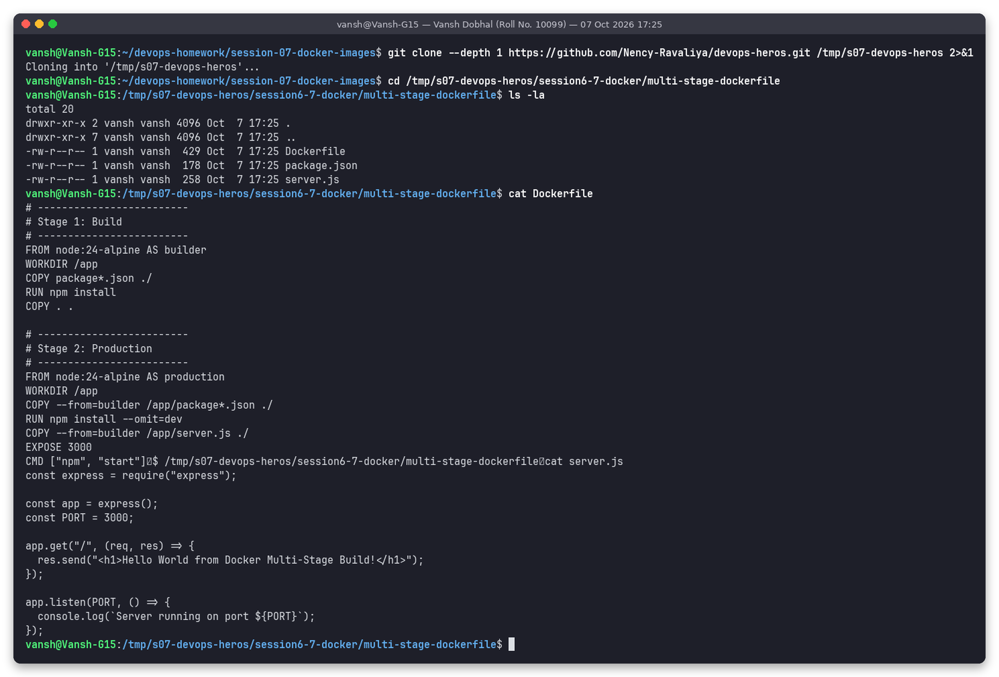
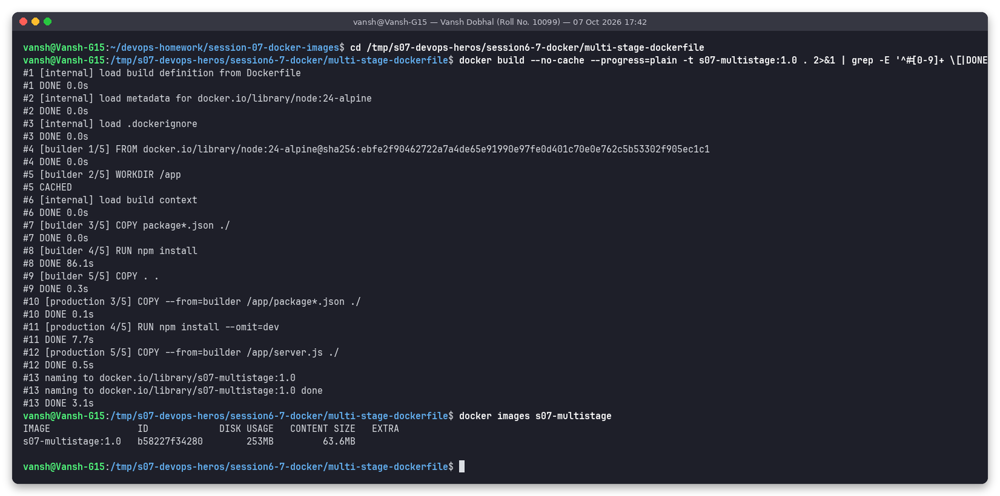
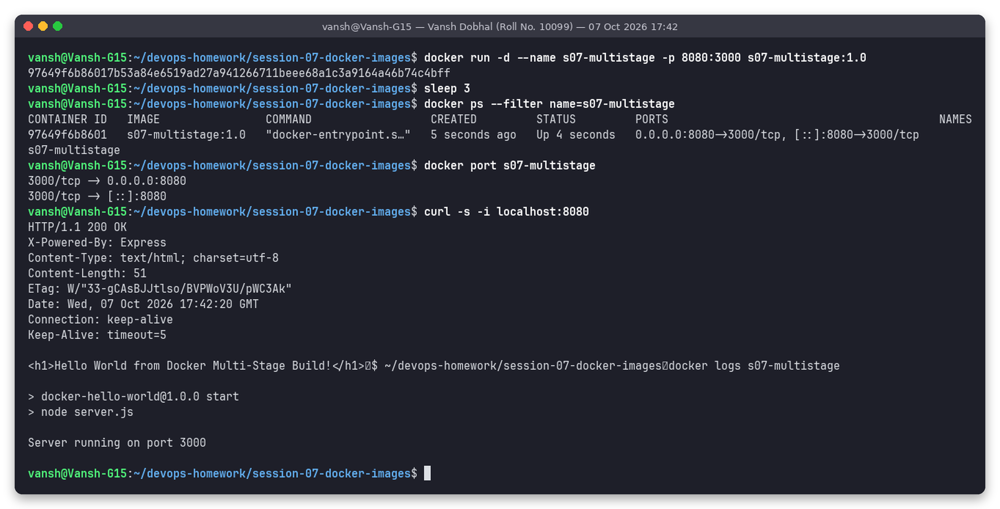

# Multi-Stage Dockerfile - Run Documentation (Session 7, Task 2)

**Name:** Vansh Dobhal | **Roll No / Enrollment No:** 10099

| Item | Value |
|---|---|
| Source repository | https://github.com/Nency-Ravaliya/devops-heros (instructor repo) |
| Path in repo | `session6-7-docker/multi-stage-dockerfile/` |
| Image built | `s07-multistage:1.0` |
| Container | `s07-multistage` |
| Port mapping | host **8080** -> container 3000 (`-p 8080:3000`) |
| Expected page | `Hello World from Docker Multi-Stage Build!` |
| Date run | 07 Oct 2026 (timestamp in each screenshot's title bar) |

The files in this folder (`Dockerfile`, `server.js`, `package.json`) were copied from the clone with `cp` after the build, for reference. The build itself ran inside the fresh clone at `/tmp/s07-devops-heros`.

## Steps performed

```bash
git clone --depth 1 https://github.com/Nency-Ravaliya/devops-heros.git /tmp/s07-devops-heros
cd /tmp/s07-devops-heros/session6-7-docker/multi-stage-dockerfile
docker build --no-cache --progress=plain -t s07-multistage:1.0 .
docker run -d --name s07-multistage -p 8080:3000 s07-multistage:1.0
docker ps --filter name=s07-multistage
docker port s07-multistage
curl -s -i localhost:8080
```

### 1. Clone the repository and look at the Dockerfile


### 2. Build the image (both stages)


The log shows the `builder` stage (`[builder 1/5]` ... `[builder 5/5] COPY . .`) and then the `production` stage (`[production 3/5] COPY --from=builder /app/package*.json`, `[production 4/5] RUN npm install --omit=dev`, `[production 5/5] COPY --from=builder /app/server.js`).

### 3. Screenshot: application running, and `docker ps` showing port 8080


Real output (from [`../outputs/03-task1-run-and-verify.txt`](../outputs/03-task1-run-and-verify.txt)):

```
CONTAINER ID   IMAGE                COMMAND                  CREATED         STATUS         PORTS                                         NAMES
97649f6b8601   s07-multistage:1.0   "docker-entrypoint.s…"   5 seconds ago   Up 4 seconds   0.0.0.0:8080->3000/tcp, [::]:8080->3000/tcp   s07-multistage

$ docker port s07-multistage
3000/tcp -> 0.0.0.0:8080
3000/tcp -> [::]:8080

$ curl -s -i localhost:8080
HTTP/1.1 200 OK
X-Powered-By: Express
...
<h1>Hello World from Docker Multi-Stage Build!</h1>
```

## Result
- `docker ps` shows the container `Up` with `0.0.0.0:8080->3000/tcp`. Port 8080 on the host is confirmed.
- `http://localhost:8080` returns HTTP 200 with **"Hello World from Docker Multi-Stage Build!"**.
- `docker logs` shows `Server running on port 3000` (the Express app listens on 3000 inside the container; the `-p 8080:3000` mapping exposes it on 8080).

## Note about this Dockerfile
Both stages use `node:24-alpine`, and stage 2 runs `npm install --omit=dev` again instead of copying `node_modules`. The multi-stage split still keeps dev dependencies and the build context out of the final image, but the saving is small here because the app has a single runtime dependency. The Task 3 images in [`../task3-apps`](../task3-apps/) show the bigger savings you get when the runtime stage uses a smaller base than the build stage.
