# Session 8 - Docker Networking and Volumes

**Name:** Vansh Dobhal | **Roll No:** 10099

Environment: Docker Engine 29.8.2 in WSL2 Ubuntu 24.04 (host `Vansh-G15`). All screenshots were made with the `snap` tool, which runs each command for real and stores a PNG plus a text log in [`outputs/`](outputs/). Every command is in [`scripts/run-session08.sh`](scripts/run-session08.sh).

| Task | Section |
|---|---|
| Task 1: 3 containers, 3 networks, backend on 2 networks, connectivity checks | [Task 1](#task-1-multi-network-setup-frontend--backend--database) |
| Task 2: Apache with host network on port 80 | [Task 2](#task-2-apache2-with---network-host-on-port-80) |
| Task 3: Bind mount, live change without restart | [Task 3](#task-3-bind-mount---hello-students) |
| Task 4: Overlay network research + real demo | [Task 4](#task-4-overlay-network-research--demo) |
| Volumes: named volume vs bind mount vs tmpfs | [Volumes](#volumes-named-volumes-vs-bind-mounts-vs-tmpfs) |

---

## Task 1: Multi-network setup (frontend / backend / database)

### Design

| Container | Image | Networks | Published |
|---|---|---|---|
| `s08-frontend` | `nginx:alpine` | `s08-frontend-net` | 8021 -> 80 |
| `s08-backend` | `nginx:alpine` | `s08-frontend-net` **and** `s08-db-net` (2 networks) | none |
| `s08-database` | `mysql:8` | `s08-db-net` | none |

```
                 s08-frontend-net                     s08-db-net
   host:8021 ─► [ s08-frontend ] ◄──────► [ s08-backend ] ◄──────► [ s08-database :3306 ]
                                            (2 NICs)
   s08-backend-net : third network, no tier attached; used to show that a container on an unrelated network cannot reach anything
```

The three user-defined bridge networks are `s08-frontend-net`, `s08-backend-net` and `s08-db-net`. The backend is the only container on two networks, so it is the only path between the web tier and the database. The frontend cannot even resolve the database's name. `s08-backend-net` is the third network. I attached a throwaway alpine container to it to show isolation: a container on a network that shares nothing with the app can reach none of the tiers. Each frontend/backend nginx serves its own small `index.html` from [`01-multi-network/`](01-multi-network/) (read-only bind mount), so the HTTP response shows which container answered.

### Step 1 - create the networks

```bash
docker network create --driver bridge s08-frontend-net
docker network create --driver bridge s08-backend-net
docker network create --driver bridge s08-db-net
```

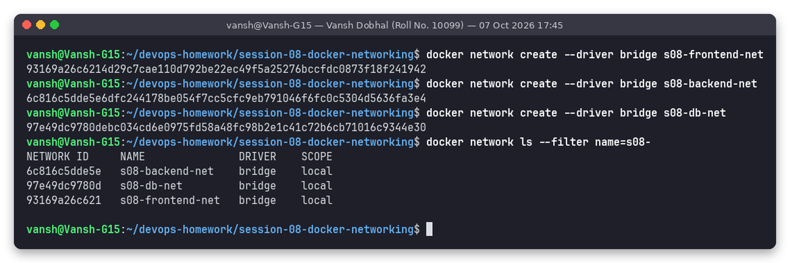

### Step 2 - run the containers; connect the backend to a second network

```bash
docker run -d --name s08-frontend --network s08-frontend-net -p 8021:80 -v "$PWD/frontend":/usr/share/nginx/html:ro nginx:alpine
docker run -d --name s08-backend  --network s08-frontend-net -v "$PWD/backend":/usr/share/nginx/html:ro nginx:alpine
docker network connect s08-db-net s08-backend          # backend now has 2 networks
docker run -d --name s08-database --network s08-db-net -e MYSQL_ROOT_PASSWORD="$MYSQL_PWD" -e MYSQL_DATABASE=appdb mysql:8
```

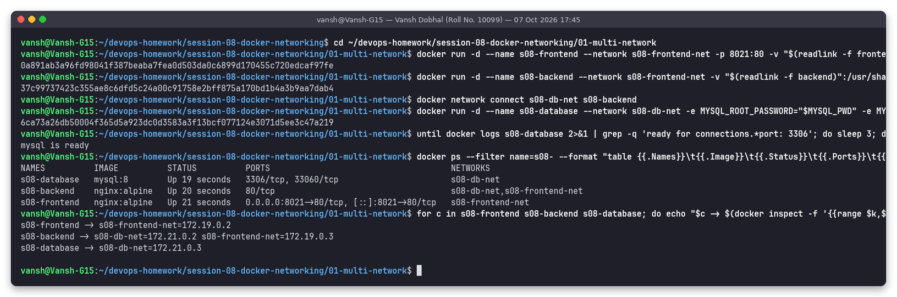

`docker ps` shows `NETWORKS = s08-db-net,s08-frontend-net` for the backend. The backend has one IP per network: `172.19.0.3` on frontend-net and `172.21.0.2` on db-net.

### Step 3 - connectivity checks (by container name)

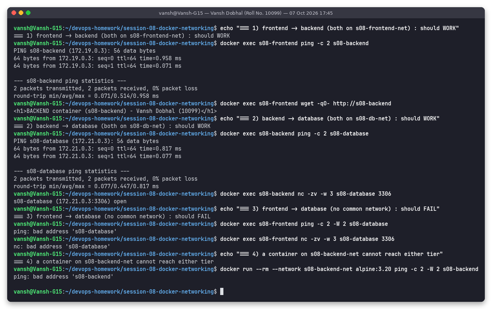

| Test | Command | Result |
|---|---|---|
| frontend -> backend | `docker exec s08-frontend ping -c 2 s08-backend` / `wget -qO- http://s08-backend` | **works**: 0% loss, response `BACKEND container (s08-backend)` |
| backend -> database | `docker exec s08-backend ping -c 2 s08-database` / `nc -zv s08-database 3306` | **works**: `s08-database (172.21.0.3:3306) open` |
| frontend -> database | `docker exec s08-frontend ping s08-database` / `nc -zv s08-database 3306` | **fails**: `bad address 's08-database'` (no DNS record) |
| container on s08-backend-net -> backend | `docker run --rm --network s08-backend-net alpine ping s08-backend` | **fails**: `bad address` |

Extra checks:

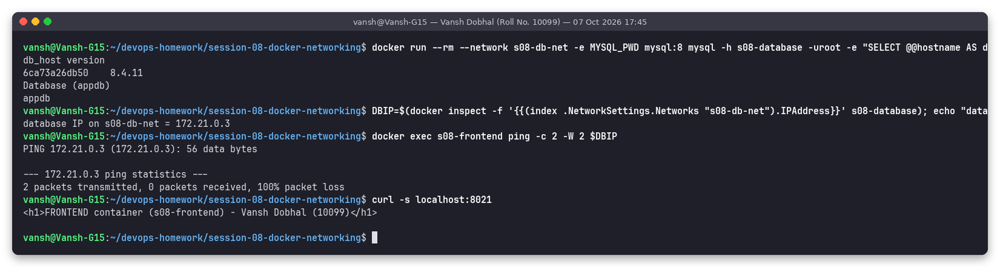

- A real MySQL query over `s08-db-net` (`mysql -h s08-database -uroot -e "SELECT @@hostname, VERSION()"`) returns the server hostname, version `8.4.11` and the `appdb` database.
- Isolation is enforced at L3, not only by DNS: pinging the database **IP** (`172.21.0.3`) from the frontend gets **100% packet loss**. Docker's iptables rules drop traffic between different bridge networks.
- `curl localhost:8021` reaches the frontend through its published port.

### Step 4 - `docker network inspect`

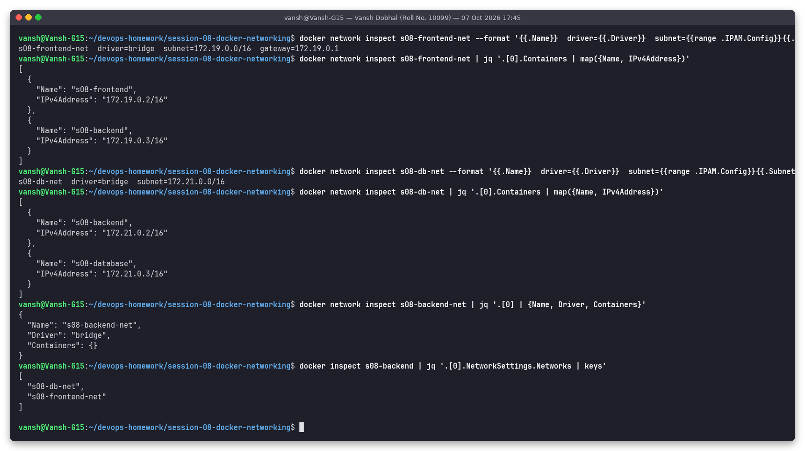

- `s08-frontend-net` (172.19.0.0/16, gw 172.19.0.1) contains `s08-frontend` and `s08-backend`.
- `s08-db-net` (172.21.0.0/16) contains `s08-backend` and `s08-database`.
- `s08-backend-net` has `Containers: {}`.
- `docker inspect s08-backend` lists the networks `["s08-db-net", "s08-frontend-net"]`.

**Why user-defined bridges:** unlike the default `bridge` network, they come with an embedded DNS server (127.0.0.11), so containers can find each other by name. Each one is its own isolated L2 segment, and containers can be connected and disconnected while running (`docker network connect/disconnect`).

---

## Task 2: Apache2 with `--network host` on port 80

```bash
sudo ss -ltnp 'sport = :80'                                 # make sure nothing uses :80
docker run -d --name s08-apache-host --network host ubuntu/apache2:latest
sudo ss -ltnp 'sport = :80'                                 # apache2 now listens directly on the host
curl -s localhost:80 | grep -o '<title>.*</title>'
docker rm -f s08-apache-host                               # stop it afterwards
```

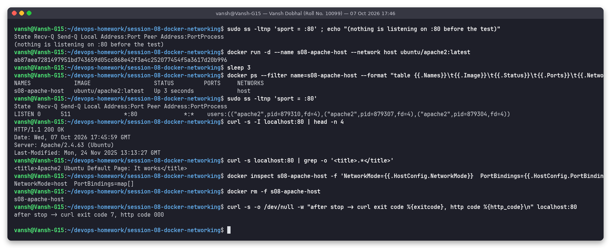

Observed:
- Before the run nothing was listening on `:80`. After it, `ss` shows `apache2` processes listening on `*:80` **in the host's network namespace**.
- `docker ps` shows an **empty PORTS column** and `NETWORKS=host`. `docker inspect` shows `NetworkMode=host PortBindings=map[]`. No `-p` mapping or NAT is involved; the container uses the host's network stack directly.
- `curl localhost:80` returns `HTTP/1.1 200 OK`, `Server: Apache/2.4.63 (Ubuntu)`, title **"Apache2 Ubuntu Default Page: It works"**.
- After `docker rm -f`, `curl` fails with exit code 7 (connection refused), so port 80 is free again.

Host mode removes the NAT overhead, but there is no port isolation: two host-mode containers cannot both bind port 80. (Here "host" means the WSL2 Linux VM, where the Docker daemon runs.)

---

## Task 3: Bind mount - "Hello students"

Local folder [`03-bind-mount/site/`](03-bind-mount/site/) holds `index.html` with "Hello students". [`index.original.html`](03-bind-mount/index.original.html) is the starting version; the script copies it back before each run.

```bash
cd 03-bind-mount
docker run -d --name s08-bind-nginx -p 8023:80 -v "$(readlink -f site)":/usr/share/nginx/html nginx:alpine
curl -s localhost:8023
docker inspect s08-bind-nginx | jq '.[0].Mounts'
docker inspect -f 'StartedAt={{.State.StartedAt}} RestartCount={{.RestartCount}}' s08-bind-nginx
```

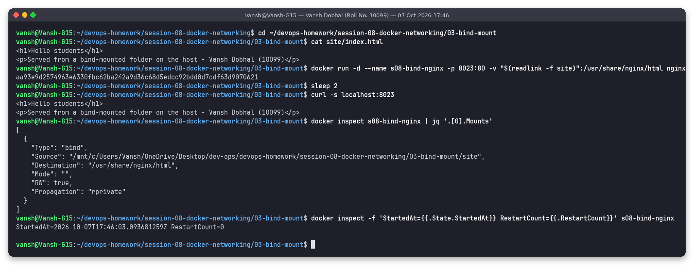

Then **edit the file on the host** without touching the container:

```bash
sed -i 's#<h1>Hello students</h1>#<h1>Hello students - UPDATED on the host without restarting the container!</h1>#' site/index.html
curl -s localhost:8023
docker exec s08-bind-nginx cat /usr/share/nginx/html/index.html
docker inspect -f 'StartedAt={{.State.StartedAt}} RestartCount={{.RestartCount}}' s08-bind-nginx
```

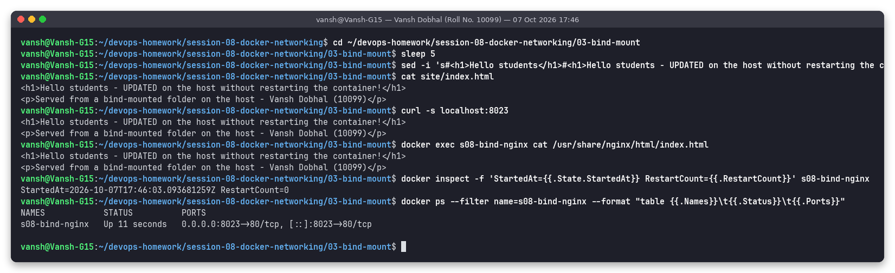

Observed:
- `Mounts` shows `"Type": "bind"` with the host path `/mnt/c/.../03-bind-mount/site` mapped to `/usr/share/nginx/html`.
- After the edit, `curl` immediately returns the **UPDATED** heading, and the file inside the container shows the same content (it is the same file, not a copy).
- `StartedAt=2026-10-07T17:46:03.093681259Z` and `RestartCount=0` are **the same before and after**, and `docker ps` shows the container has been `Up` the whole time. The change appeared without a restart.

Because of this demo, `site/index.html` in the repo is left in its updated state.

---

## Task 4: Overlay network research + demo

### What is an overlay network?
An overlay network is a virtual layer-2 network spanning **several Docker hosts**. Containers on different machines get IPs from the same subnet (e.g. 10.0.1.0/24) and talk to each other as if they shared a switch. The real hosts only need IP connectivity between each other (the "underlay"). Docker's built-in `overlay` driver needs **Docker Swarm mode** (or an external key-value store in very old versions) because the hosts have to share network state.

### How it works across multiple hosts

| Piece | What it does |
|---|---|
| **VXLAN encapsulation (data plane)** | A container's Ethernet frame is wrapped in a VXLAN header + UDP packet and sent to the other host's IP on **UDP 4789**, where it is unwrapped and delivered. Each overlay network gets a VXLAN ID (VNI): my network got `vxlanid_list: 4097`, the swarm `ingress` network `4096`. |
| **Network namespace + bridge per host** | On every host that runs a task of the network, Docker creates a namespace with a `br0` bridge and a `vxlan` interface. Containers connect to it through veth pairs. A separate `docker_gwbridge` gives containers outbound internet access. |
| **Control plane - Raft (managers)** | Swarm managers store the cluster state (networks, services, IP allocations) in a Raft log. Manager traffic and node joins use **TCP 2377**. |
| **Control plane - gossip (all nodes)** | Nodes share endpoint information (which container IP/MAC is on which host, so the VXLAN tunnel endpoint is known) with a SWIM-based gossip protocol (`memberlist`) on **TCP+UDP 7946**. Only nodes that have tasks on a network receive its gossip. |
| **Service discovery & load balancing** | Embedded DNS (127.0.0.11) resolves a service name to a **virtual IP**, which IPVS balances across the tasks. `tasks.<service>` returns the individual task IPs. |
| **Routing mesh (`ingress` overlay)** | A port published by a service (`-p 8024:80`) is open on **every** swarm node. A request to any node is forwarded over the `ingress` overlay to a healthy task. |
| **Encryption (optional)** | `docker network create -d overlay --opt encrypted` adds IPsec (ESP, IP protocol 50) to the VXLAN traffic between hosts. |

Firewall ports needed between swarm hosts: **2377/tcp** (cluster management), **7946/tcp+udp** (gossip / node discovery), **4789/udp** (VXLAN data). Plus protocol 50 (ESP) if encryption is enabled.

### Use cases
- Microservices spread over a cluster of hosts that need to call each other by service name (Docker Swarm stacks).
- Scaling a service to replicas on different machines behind one virtual IP / published port.
- Isolating multi-host application tiers (one overlay per tier or per stack), much like the bridge networks in Task 1 but across hosts.
- `--attachable` overlays let standalone `docker run` containers (debug tools, one-off jobs) join a swarm network.

| | bridge | host | overlay |
|---|---|---|---|
| Scope | single host | single host | multi-host (swarm) |
| Isolation | own namespace + subnet | none (shares host stack) | own subnet across hosts |
| Port publishing | `-p` with NAT | not needed | routing mesh on all nodes |
| Typical use | single-host apps, compose | max performance, network tools | Swarm services across nodes |

### Real demo (single-node swarm)

I only have one machine, so the swarm has one node. The overlay driver, VXLAN VNI, gossip/Raft listeners, service DNS and routing mesh are the same components that would be used across several nodes; with one node, the VXLAN packets just never leave the host.

```bash
docker swarm init --advertise-addr $(hostname -I | awk '{print $1}')
docker network create -d overlay --attachable s08-overlay-net
docker service create --name s08-web --network s08-overlay-net --replicas 2 -p 8024:80 nginx:alpine
docker service ls; docker service ps s08-web
```

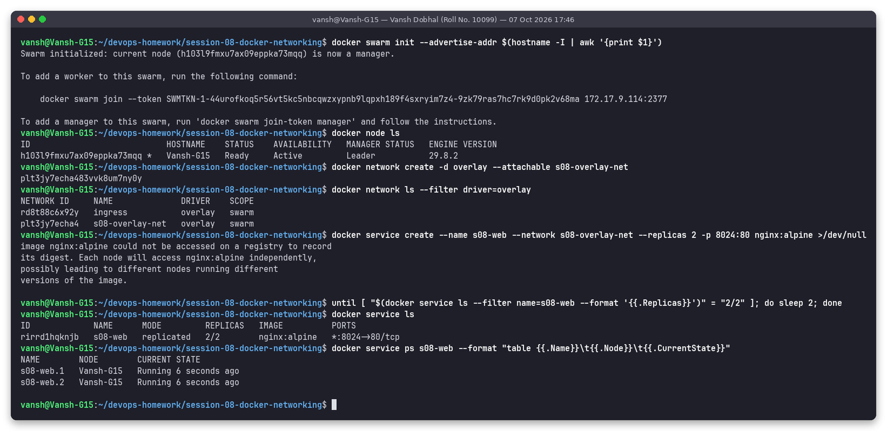

```bash
docker run --rm --network s08-overlay-net alpine:3.20 nslookup tasks.s08-web      # per-task IPs
docker run --rm --network s08-overlay-net alpine:3.20 wget -qO- http://s08-web    # via service VIP
curl -s localhost:8024                                                            # via routing mesh
docker network inspect s08-overlay-net
sudo ss -lntu | grep -E ':(2377|7946|4789)\b'
```

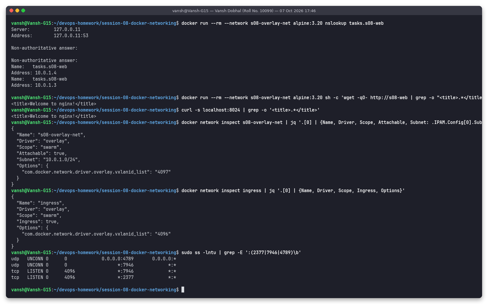

Observed:
- The swarm initialised (node `Vansh-G15` is `Leader`). `s08-overlay-net` shows `DRIVER overlay, SCOPE swarm` next to the automatic `ingress` overlay.
- `s08-web` reached `2/2` replicas. `nslookup tasks.s08-web` returns the two task IPs `10.0.1.3` and `10.0.1.4` from the overlay subnet `10.0.1.0/24`.
- A standalone container (possible because the network is `--attachable`) fetched the nginx page via the service name, and `curl localhost:8024` worked through the routing mesh.
- `network inspect`: `Driver: overlay, Scope: swarm, Attachable: true, vxlanid_list: 4097`. `ingress` has `Ingress: true, vxlanid_list: 4096`.
- `ss` shows the real listeners: **2377/tcp**, **7946/tcp + 7946/udp**, **4789/udp**.

Cleanup: remove the service and the network, then leave the swarm:

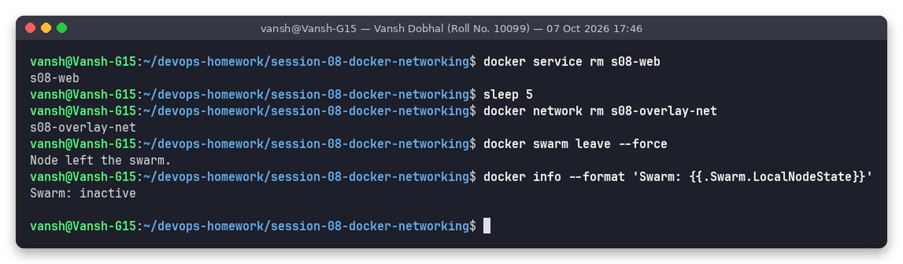

`docker info` ends with `Swarm: inactive`. (The join token printed by `swarm init` in screenshot 09 stopped working when the swarm was dissolved.)

---

## Volumes: named volumes vs bind mounts vs tmpfs

A container's writable layer is deleted with the container. To keep data, mount storage from outside it:

| | Named volume | Bind mount | tmpfs |
|---|---|---|---|
| Syntax | `-v mydata:/path` or `--mount type=volume,src=mydata,dst=/path` | `-v /host/dir:/path` or `--mount type=bind,...` | `--tmpfs /path` or `--mount type=tmpfs,...` |
| Lives in | `/var/lib/docker/volumes/<name>/_data`, managed by Docker | any host path you choose | host RAM only |
| Survives container removal | yes | yes (it is your host folder) | no, gone when the container stops |
| Managed with | `docker volume create/ls/inspect/rm` | normal host tools | nothing to manage |
| Pre-populated from image | yes (empty volume gets the image's files) | no (host dir hides the image's files) | no |
| Best for | databases, persistent app data, sharing data between containers | dev live-reload, config files, Task 3 | secrets/scratch data that must never hit disk |

### Demo - MySQL data survives deleting the container

```bash
docker volume create s08-mysql-data
docker run -d --name s08-voldb -e MYSQL_ROOT_PASSWORD="$MYSQL_PWD" -v s08-mysql-data:/var/lib/mysql mysql:8
docker exec s08-voldb mysql -uroot -e "CREATE DATABASE school; CREATE TABLE school.students(id INT PRIMARY KEY, name VARCHAR(50), roll INT); INSERT INTO school.students VALUES (1,'Vansh Dobhal',10099);"
docker rm -f s08-voldb                                         # container is gone
docker run -d --name s08-voldb-new -e MYSQL_ROOT_PASSWORD="$MYSQL_PWD" -v s08-mysql-data:/var/lib/mysql mysql:8
docker exec s08-voldb-new mysql -uroot -e "SELECT * FROM school.students;"
```

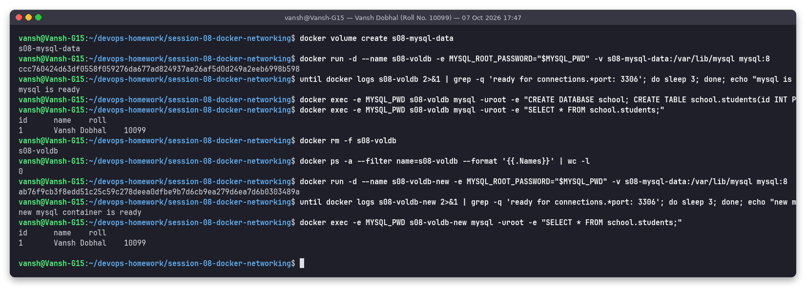

Observed: after `docker rm -f` the container count is `0`. The **new** container, started on the same volume, still returns the row `1  Vansh Dobhal  10099`. The data lived in the volume, not in the container. (The root password was passed through the `MYSQL_PWD` environment variable, so it does not appear in the screenshots. It was a throwaway demo password.)

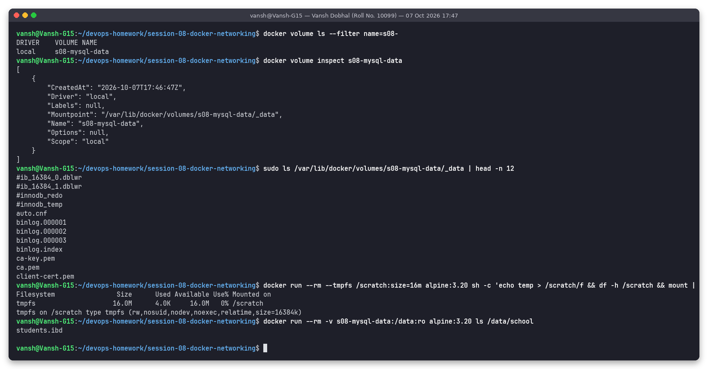

- `docker volume inspect` shows `Driver: local` and `Mountpoint: /var/lib/docker/volumes/s08-mysql-data/_data`. Listing that directory shows the InnoDB files, and `school/students.ibd` can also be seen by mounting the volume read-only into an alpine container.
- tmpfs: `--tmpfs /scratch:size=16m` creates a 16MB `tmpfs` filesystem (`df` / `mount` output). It is RAM-backed and disappears with the container.

---

## What I learned
- User-defined bridge networks provide DNS by container name and isolate traffic per network. A container on two networks (the backend) acts as the controlled bridge between tiers, which is how a DMZ / app tier / DB tier layout is built with plain Docker.
- Isolation applies to IP traffic too, not only DNS: pinging the DB's IP from the frontend got 100% packet loss.
- `--network host` skips NAT and `-p` completely. That is useful for performance or network tools, but ports can collide with the host.
- Bind mounts reflect host changes instantly with no restart. Named volumes are the right choice for database data that must outlive containers.
- Overlay networks = VXLAN data plane (4789/udp) + Raft (2377/tcp) and gossip (7946) control plane. Swarm adds service DNS, VIP load balancing and the routing mesh on top.

## Folder structure

```
session-08-docker-networking
├── README.md
├── 01-multi-network/
│   ├── frontend/index.html          served by s08-frontend (read-only bind mount)
│   └── backend/index.html           served by s08-backend
├── 03-bind-mount/
│   ├── index.original.html          starting "Hello students" page
│   └── site/index.html              bind-mounted into nginx (left in its UPDATED state by the demo)
├── scripts/run-session08.sh         every command used for the screenshots
├── screenshots/                     01 ... 13 (*.png)
└── outputs/                         text logs of the same runs
```

## How to reproduce

```bash
cd ~/devops-homework/session-08-docker-networking
bash scripts/run-session08.sh
# clean up
docker rm -f s08-frontend s08-backend s08-database s08-bind-nginx s08-voldb-new
docker network rm s08-frontend-net s08-backend-net s08-db-net
docker volume rm s08-mysql-data
```

After the run I removed all `s08-*` containers, networks and the `s08-mysql-data` volume. The swarm was already left in step 11. Images were kept.
