# Session 09 – Kubernetes Fundamentals

**Name:** Vansh Dobhal | **Roll No:** 10099

Hands-on work for session 9: install and verify Minikube, look at how a Kubernetes cluster is put together, learn the basic objects and `kubectl` commands, and complete all six modules of the official kubernetes.io **"Learn Kubernetes Basics"** tutorial.

Every screenshot in `screenshots/` is a real terminal run captured with my `snap` helper (`tools/snap.sh`). The helper runs the commands and saves both a PNG and the exact text output (`outputs/<name>.txt`). Nothing in this README was typed in by hand.

**Environment:** Windows 11 → WSL2 Ubuntu 24.04 (`vansh@Vansh-G15`) → Docker Engine 29.8.2 → Minikube v1.39.0 (docker driver, containerd 2.3.4 runtime) → Kubernetes v1.37.0, kubectl client v1.37.1.
The tutorial objects were created in my own namespace **`s09`**, which I deleted at the end.

---

## Task list covered

| # | Task | Section |
|---|------|---------|
| 1 | Install and configure Minikube | [1. Install and configure Minikube](#1-install-and-configure-minikube) |
| 2 | Verify cluster status | [2. Verify cluster status](#2-verify-cluster-status) |
| 3 | Explore Kubernetes architecture | [3. Kubernetes architecture](#3-explore-kubernetes-architecture) |
| 4 | Learn basic objects and commands | [4. Basic objects and commands](#4-learn-basic-objects-and-commands) |
| 5 | Perform the Kubernetes Basics tutorial hands-on | [5. Kubernetes Basics tutorial](#5-kubernetes-basics-tutorial-hands-on-modules-16) |

---

## 1. Install and configure Minikube

### Install commands (Ubuntu / WSL2)

Minikube needs a driver. On WSL2 the simplest one is **Docker**, so Docker Engine has to be installed and running first.

```bash
# 0) prerequisites: Docker Engine (docker driver) + your user in the docker group
sudo apt-get update && sudo apt-get install -y ca-certificates curl
curl -fsSL https://get.docker.com | sudo sh
sudo usermod -aG docker $USER && newgrp docker

# 1) kubectl (latest stable)
curl -LO "https://dl.k8s.io/release/$(curl -L -s https://dl.k8s.io/release/stable.txt)/bin/linux/amd64/kubectl"
sudo install -o root -g root -m 0755 kubectl /usr/local/bin/kubectl

# 2) minikube
curl -LO https://storage.googleapis.com/minikube/releases/latest/minikube-linux-amd64
sudo install minikube-linux-amd64 /usr/local/bin/minikube && rm minikube-linux-amd64

# 3) start a single-node cluster with the docker driver
minikube start --driver=docker --cpus=8 --memory=7g
minikube config set driver docker          # make docker the default driver

# 4) addons used in later sessions
minikube addons enable ingress
minikube addons enable metrics-server
```

Minikube and kubectl were already installed in `/usr/local/bin` and the cluster was already running on this machine (other sessions share it). To show that the install commands above really work, I ran the download steps again into a scratch folder (`/tmp/s09-install`) and executed the downloaded binaries:

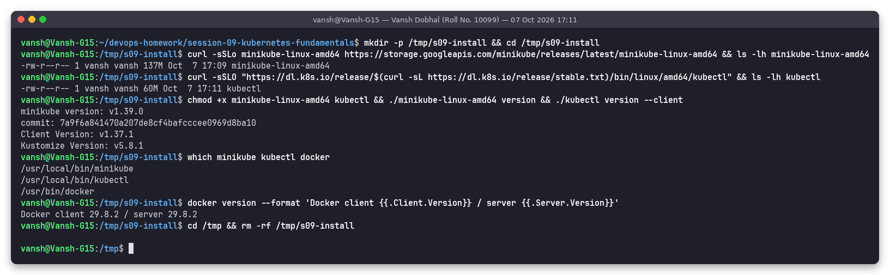

Observed: the downloaded `minikube` is **v1.39.0** (137 MB) and `kubectl` is **v1.37.1** (60 MB). `which` shows the copies actually in use live in `/usr/local/bin`, and the Docker client and server are both 29.8.2.

---

## 2. Verify cluster status

```bash
minikube version
minikube status
minikube profile list
kubectl version
kubectl config current-context
kubectl cluster-info
kubectl get nodes -o wide
```

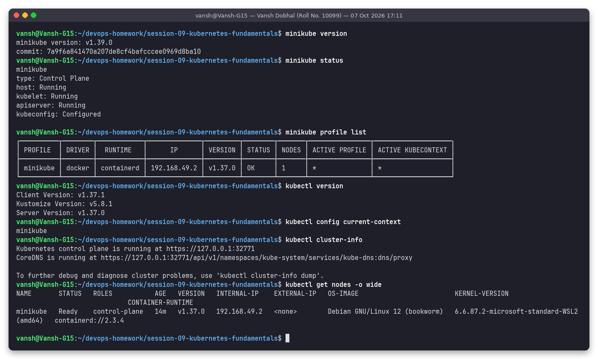

What the output shows:
- `minikube status` reports host, kubelet and apiserver as **Running** and kubeconfig as **Configured**.
- `minikube profile list` shows one profile, `minikube`: driver `docker`, runtime `containerd`, IP `192.168.49.2`, Kubernetes v1.37.0, status OK.
- `kubectl version` shows client v1.37.1 and server v1.37.0. One minor version of skew is supported.
- `kubectl cluster-info` reports the API server at `https://127.0.0.1:32771`. The docker driver publishes the container's port 8443 on localhost.
- The single node `minikube` is **Ready** with role `control-plane`, OS Debian 12, kernel `6.6.87.2-microsoft-standard-WSL2` and runtime `containerd://2.3.4`.

### Addons

```bash
minikube addons list
```

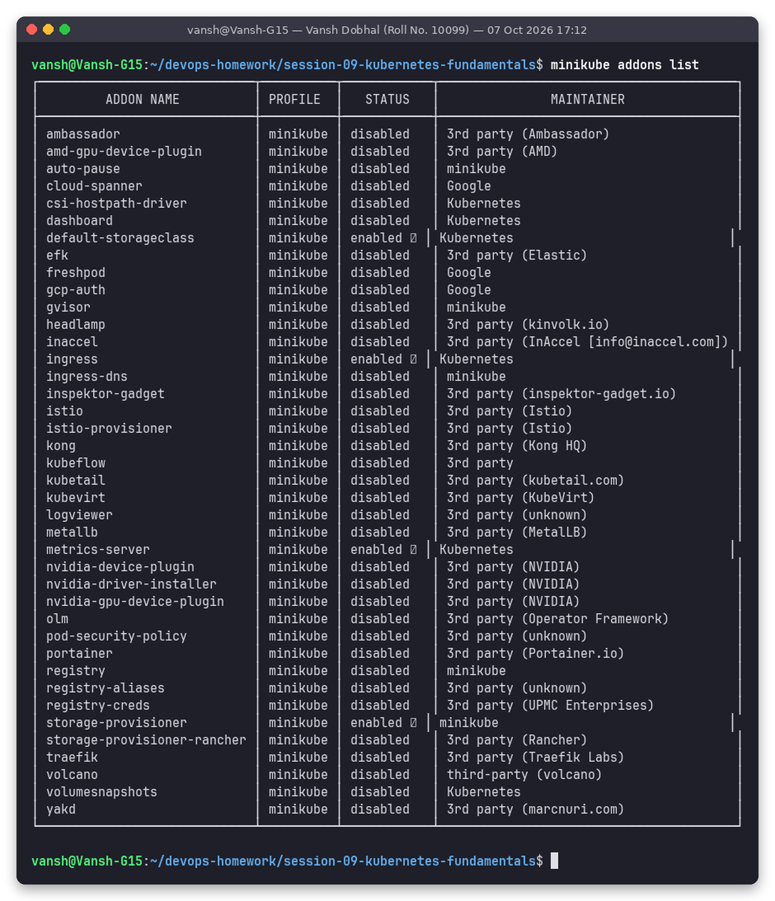

Enabled: `default-storageclass`, `ingress`, `metrics-server` and `storage-provisioner`. All other addons are disabled.

---

## 3. Explore Kubernetes architecture

### Architecture diagram

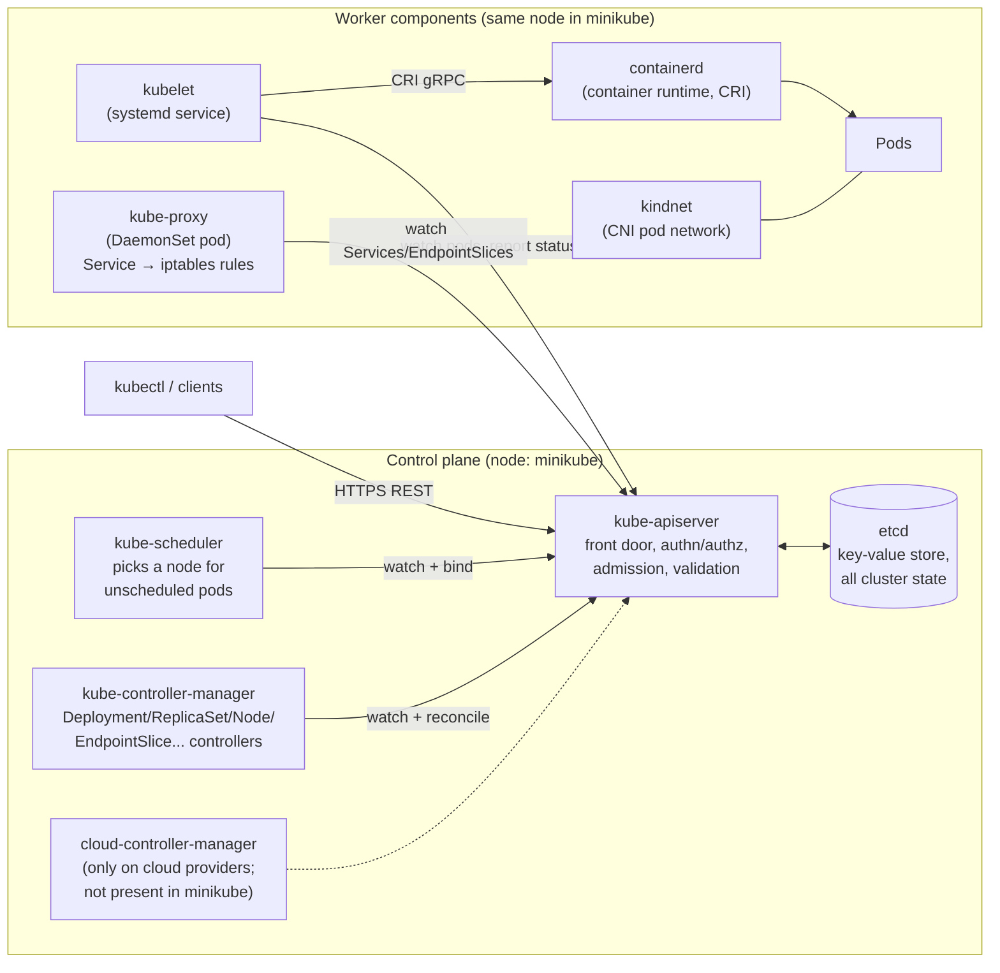
```mermaid
flowchart LR
    user["kubectl / clients"] -->|HTTPS REST| api

    subgraph CP["Control plane (node: minikube)"]
        api["kube-apiserver<br/>front door, authn/authz,<br/>admission, validation"]
        etcd[("etcd<br/>key-value store,<br/>all cluster state")]
        sched["kube-scheduler<br/>picks a node for<br/>unscheduled pods"]
        cm["kube-controller-manager<br/>Deployment/ReplicaSet/Node/<br/>EndpointSlice... controllers"]
        ccm["cloud-controller-manager<br/>(only on cloud providers;<br/>not present in minikube)"]
        api <--> etcd
        sched -->|watch + bind| api
        cm -->|watch + reconcile| api
        ccm -.-> api
    end

    subgraph WN["Worker components (same node in minikube)"]
        kubelet["kubelet<br/>(systemd service)"]
        proxy["kube-proxy<br/>(DaemonSet pod)<br/>Service → iptables rules"]
        cri["containerd<br/>(container runtime, CRI)"]
        cni["kindnet<br/>(CNI pod network)"]
        pods["Pods"]
        kubelet -->|CRI gRPC| cri --> pods
        cni --- pods
    end

    kubelet -->|watch pods, report status| api
    proxy -->|watch Services/EndpointSlices| api
```

The same thing in plain text:

```
                +---------------------------- CONTROL PLANE ----------------------------+
 kubectl ---->  |  kube-apiserver  <---->  etcd                                          |
                |      ^      ^                                                         |
                |      |      +---- kube-scheduler          (assigns pods to nodes)    |
                |      +----------- kube-controller-manager (desired == actual loops)  |
                |                   cloud-controller-manager (cloud LBs/routes; n/a here)|
                +------|----------------------------------------------------------------+
                       | watch / status
                +------v----------------------- NODE -----------------------------------+
                |  kubelet --CRI--> containerd --> [pod][pod][pod]                       |
                |  kube-proxy (iptables for Services)     kindnet (CNI, pod IPs 10.244/16)|
                +------------------------------------------------------------------------+
```

### Component notes

| Component | Where it runs in my cluster | What it does |
|-----------|-----------------------------|--------------|
| **kube-apiserver** | static pod `kube-apiserver-minikube` | The only component that talks to etcd. Every read and write (kubectl, kubelet, controllers) goes through its REST API, which authenticates, authorizes, runs admission and validates objects. |
| **etcd** | static pod `etcd-minikube` | Consistent, distributed key-value store holding all cluster state (desired and observed). Losing etcd means losing the cluster. |
| **kube-scheduler** | static pod `kube-scheduler-minikube` | Watches for pods with no `nodeName`, filters nodes (resources, taints, affinity), scores them and binds the pod to the best one. The "Insufficient memory" Pending pod in session 10 is the scheduler's filter at work. |
| **kube-controller-manager** | static pod `kube-controller-manager-minikube` | Runs the reconcile loops (Deployment, ReplicaSet, Node, Job, EndpointSlice, ServiceAccount...). Each loop compares desired state with actual state and acts to close the gap. |
| **cloud-controller-manager** | **not present**: minikube is not on a cloud | Talks to the cloud API to create load balancers, routes and node metadata on EKS/GKE/AKS. |
| **kubelet** | systemd service on the node (`active`) | Node agent. Watches the API server for pods bound to its node, starts them through the CRI, runs the probes and reports status. It also starts the static pods from `/etc/kubernetes/manifests`. |
| **kube-proxy** | DaemonSet pod `kube-proxy-*` | Watches Services and EndpointSlices and programs iptables rules so that a ClusterIP or NodePort load-balances across pod IPs. |
| **Container runtime** | `containerd 2.3.4` | Pulls images and runs containers. The kubelet talks to it over CRI, and `crictl` is the CLI for it. |
| CNI (add-on) | DaemonSet `kindnet` | Gives every pod an IP (10.244.0.x) and pod-to-pod connectivity. |
| CoreDNS (add-on) | Deployment `coredns` | Cluster DNS (`<svc>.<ns>.svc.cluster.local`). |

### Real view of the control plane in kube-system

```bash
kubectl get pods -n kube-system -o wide
minikube ssh -- sudo ls -l /etc/kubernetes/manifests
kubectl get pods -n kube-system -l tier=control-plane \
  -o custom-columns=NAME:.metadata.name,COMPONENT:.metadata.labels.component,STATIC-POD-OWNER:.metadata.ownerReferences[0].kind
kubectl get daemonset,deployment -n kube-system
```

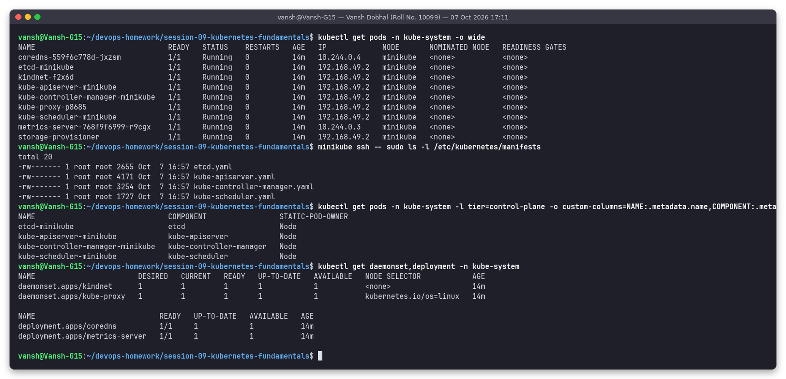

Observed:
- `/etc/kubernetes/manifests` on the node holds exactly four files: `etcd.yaml`, `kube-apiserver.yaml`, `kube-controller-manager.yaml` and `kube-scheduler.yaml`. These are **static pods**. The kubelet starts them straight from disk, before the API server even exists.
- The owner of those four pods is `Node`, not a ReplicaSet. That is how a static pod's "mirror pod" looks in the API.
- They use the node IP (`192.168.49.2`, hostNetwork), while CoreDNS and metrics-server get pod IPs (`10.244.0.x`).
- kube-proxy and kindnet are **DaemonSets** (one per node). CoreDNS and metrics-server are **Deployments**.

### Control-plane health

```bash
kubectl get componentstatuses          # deprecated, but still answers
kubectl get --raw='/readyz?verbose'
kubectl get --raw='/livez'
kubectl get --raw='/version'
```

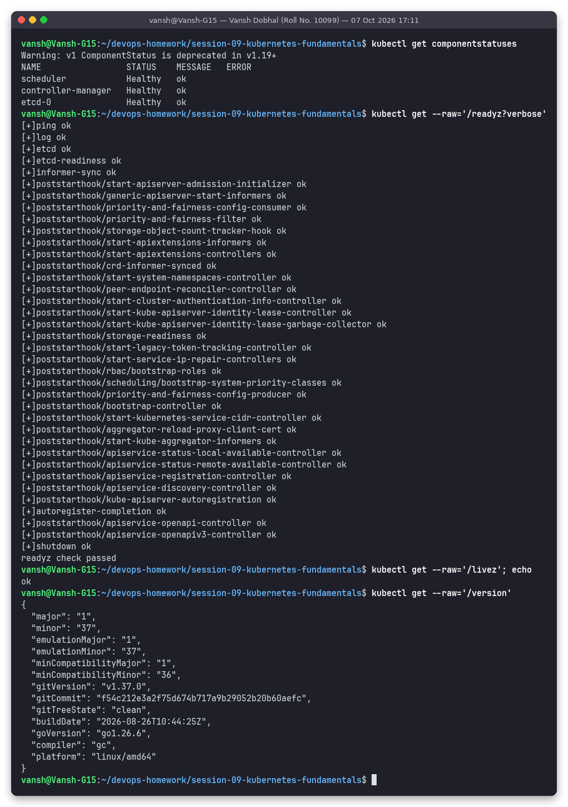

Observed: `componentstatuses` prints a deprecation warning (v1.19+) but still reports scheduler, controller-manager and etcd-0 as **Healthy**. `/readyz?verbose` lists every API-server check (`etcd ok`, `etcd-readiness ok`, `informer-sync ok`, post-start hooks...) and ends with `readyz check passed`. `/livez` returns `ok`. The modern way to check control-plane health is the `/readyz` and `/livez` endpoints.

### Node components (kubelet, runtime, kube-proxy)

```bash
minikube ssh -- sudo systemctl is-active kubelet containerd
minikube ssh -- "sudo systemctl status kubelet --no-pager | head -n 8"
minikube ssh -- "sudo crictl ps | grep -E 'NAME|kube-|etcd|coredns'"
kubectl get pods -n kube-system -l k8s-app=kube-proxy -o wide
kubectl logs -n kube-system -l k8s-app=kube-proxy --tail=5
kubectl describe node minikube | sed -n '/Capacity:/,/System Info:/p'
```

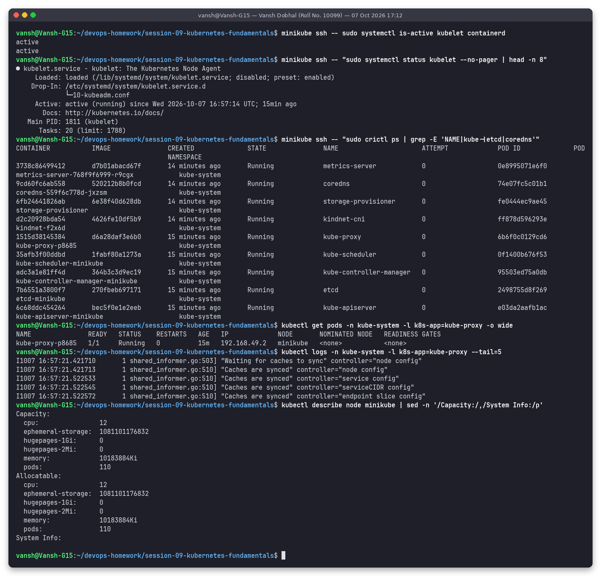

Observed: kubelet and containerd are both `active` systemd services. The kubelet runs from `/lib/systemd/system/kubelet.service` with the kubeadm drop-in `10-kubeadm.conf`. `crictl ps` lists the containers that containerd actually runs: kube-apiserver, scheduler, controller-manager, kube-proxy, coredns, kindnet and so on. kube-proxy's log shows its informers syncing the service and EndpointSlice configs. The node reports 12 CPUs and about 10 GiB of allocatable memory, with room for 110 pods.

---

## 4. Learn basic objects and commands

```bash
kubectl api-resources --api-group=''     # core group objects
kubectl api-resources --api-group=apps   # workload controllers
kubectl get namespaces
kubectl explain pod.spec.containers
```

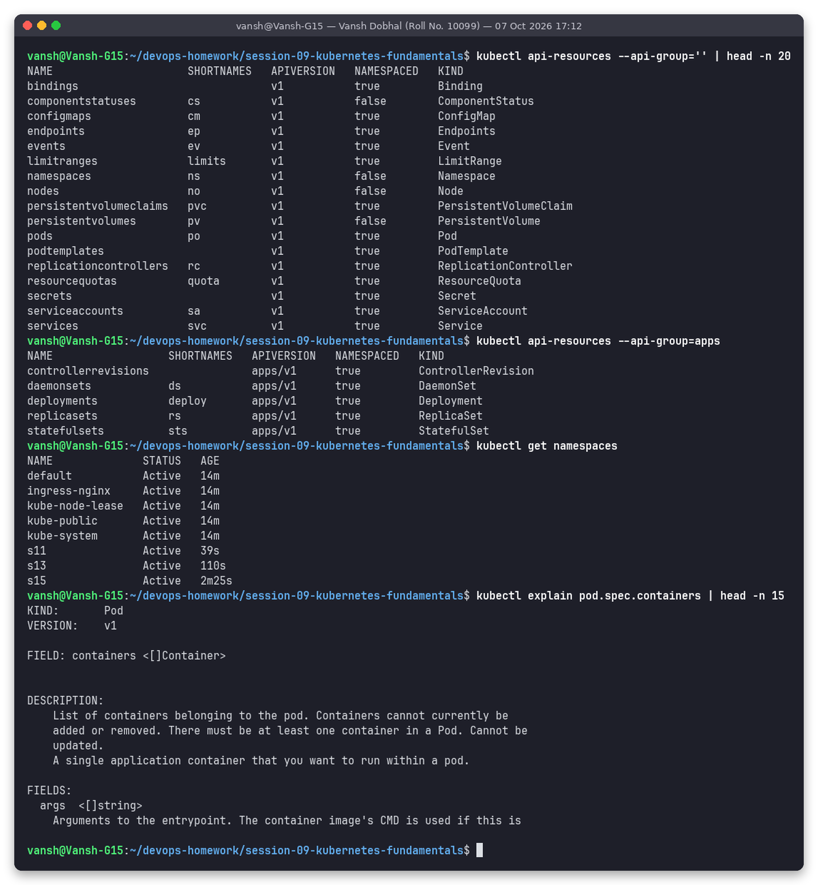

### Basic objects

| Object | Short name | API group / version | Namespaced | Purpose |
|--------|-----------|---------------------|-----------|---------|
| Pod | `po` | `v1` | yes | Smallest deployable unit: one or more containers sharing a network namespace (IP) and volumes |
| ReplicaSet | `rs` | `apps/v1` | yes | Keeps N identical pods running (self-healing). Normally managed by a Deployment |
| Deployment | `deploy` | `apps/v1` | yes | Declarative updates for pods: rolling update, rollback, revision history, scaling |
| DaemonSet | `ds` | `apps/v1` | yes | One pod per node (kube-proxy, kindnet, log agents) |
| StatefulSet | `sts` | `apps/v1` | yes | Pods with stable identity and storage (databases) |
| Service | `svc` | `v1` | yes | Stable virtual IP and DNS name in front of pods selected by labels (ClusterIP / NodePort / LoadBalancer) |
| EndpointSlice | – | `discovery.k8s.io/v1` | yes | The actual pod IPs behind a Service |
| Namespace | `ns` | `v1` | no | Virtual cluster used to isolate names, quotas and RBAC |
| ConfigMap / Secret | `cm` / – | `v1` | yes | Configuration and sensitive data injected into pods |
| Node | `no` | `v1` | no | A worker machine registered by its kubelet |
| PersistentVolume / Claim | `pv` / `pvc` | `v1` | no / yes | Storage and a request for storage |
| Label / Selector | – | metadata | – | Key/value tags. Selectors are how Services, RS and Deployments find "their" pods |

### Command reference (all used in this session)

| Goal | Command |
|------|---------|
| Cluster info | `kubectl cluster-info`, `kubectl get nodes -o wide`, `kubectl version` |
| Create a deployment | `kubectl create deployment NAME --image=IMG` |
| Declarative apply | `kubectl apply -f file.yaml` |
| List | `kubectl get pods\|deploy\|rs\|svc [-n NS] [-o wide\|yaml\|json] [-l key=val] [--show-labels]` |
| Details and events | `kubectl describe pod/NAME` |
| Logs | `kubectl logs POD [-c container] [--previous] [-f]` |
| Run a command in a container | `kubectl exec POD -- cmd`, interactive: `kubectl exec -ti POD -- sh` |
| API proxy | `kubectl proxy --port=8099` then `curl localhost:8099/api/v1/...` |
| Expose | `kubectl expose deployment/NAME --type=NodePort --port 8080` |
| Labels | `kubectl label pods POD version=v1`, `kubectl get pods -l version=v1` |
| Scale | `kubectl scale deployments/NAME --replicas=4` |
| Update image | `kubectl set image deployments/NAME CONTAINER=IMG:TAG` |
| Rollout | `kubectl rollout status\|history\|undo deployment/NAME` |
| Delete | `kubectl delete deploy/NAME`, `kubectl delete svc -l app=X`, `kubectl delete ns NS` |
| Schema help | `kubectl explain pod.spec.containers` |
| Raw API | `kubectl get --raw='/readyz?verbose'` |

---

## 5. Kubernetes Basics tutorial hands-on (modules 1–6)

Everything ran in namespace `s09` with the tutorial's own images: `gcr.io/google-samples/kubernetes-bootcamp:v1` and, for the update module, `docker.io/jocatalin/kubernetes-bootcamp:v2`. Script: [`scripts/02-kubernetes-basics-tutorial.sh`](scripts/02-kubernetes-basics-tutorial.sh).

### Module 1 – Create a cluster

```bash
minikube status
kubectl cluster-info
kubectl get nodes
kubectl create namespace s09
```

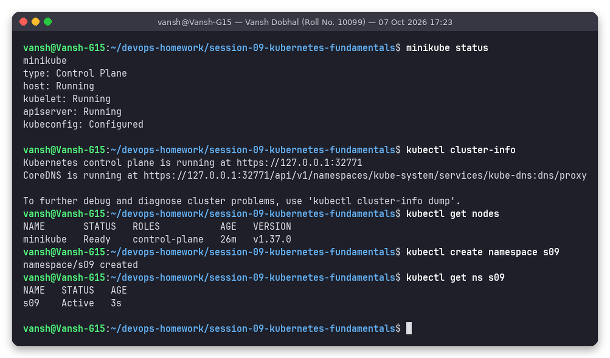

The cluster is up and the one node is `Ready`. I created a separate namespace so my objects don't collide with other labs running on the same cluster.

### Module 2 – Deploy an app

```bash
kubectl create deployment kubernetes-bootcamp --image=gcr.io/google-samples/kubernetes-bootcamp:v1 -n s09
kubectl annotate deployment/kubernetes-bootcamp -n s09 kubernetes.io/change-cause='initial deploy kubernetes-bootcamp:v1'
kubectl rollout status deployment/kubernetes-bootcamp -n s09
kubectl get deployments -n s09
kubectl get deployment kubernetes-bootcamp -n s09 -o yaml   # spec section
```

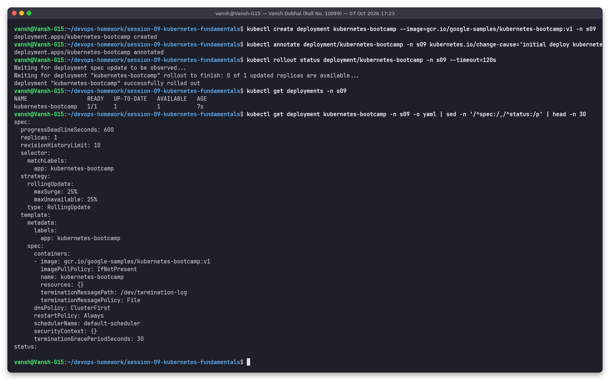

`kubectl create deployment` produced a Deployment with `replicas: 1`, the selector `app=kubernetes-bootcamp` and the default `RollingUpdate` strategy (maxSurge 25%, maxUnavailable 25%). It reached `READY 1/1`. The annotation sets the CHANGE-CAUSE column of `rollout history` (see module 6).

### Module 3 – Explore your app (get / describe / logs / exec)

```bash
kubectl get pods -n s09 -o wide
export POD_NAME=$(kubectl get pods -n s09 -l app=kubernetes-bootcamp -o jsonpath='{.items[0].metadata.name}')
kubectl describe pod $POD_NAME -n s09
```

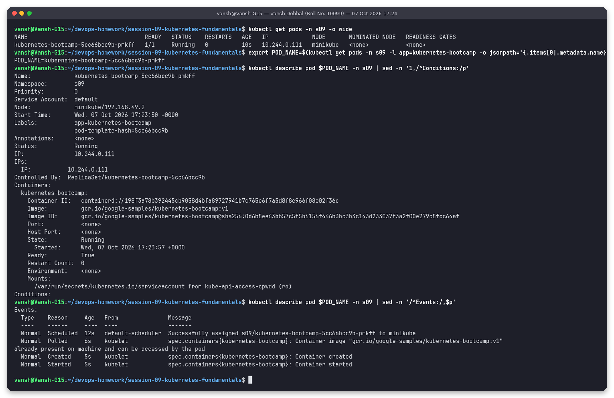

`describe` shows the pod's node (`minikube/192.168.49.2`), its pod IP (10.244.0.x), the labels `app=kubernetes-bootcamp` and `pod-template-hash`, `Controlled By: ReplicaSet/kubernetes-bootcamp-5cc66bcc9b`, the containerd container ID and image digest, and the Scheduled → Pulled → Created → Started events.

```bash
kubectl proxy --port=8099 &                       # tutorial uses 8001; 8099 avoids clashes
curl -s http://localhost:8099/version
curl -s http://localhost:8099/api/v1/namespaces/s09/pods/$POD_NAME:8080/proxy/
kubectl logs $POD_NAME -n s09
kubectl exec $POD_NAME -n s09 -- env
kubectl exec $POD_NAME -n s09 -- sh -c 'ls /; head -n 12 server.js'
kubectl exec $POD_NAME -n s09 -- curl -s http://localhost:8080
```

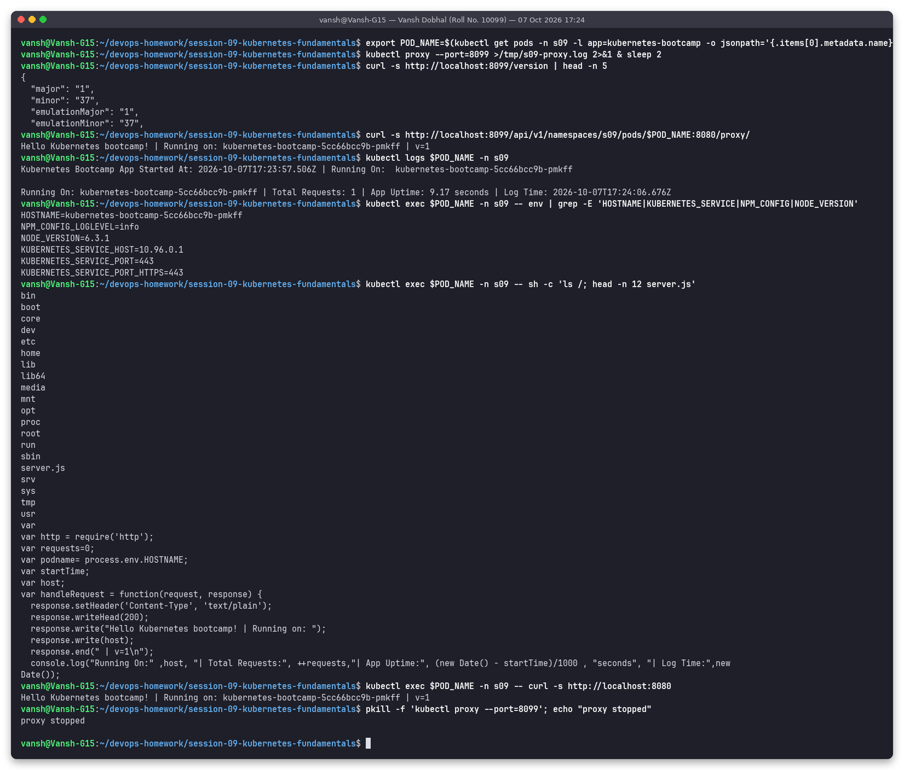

What I saw:
- Through `kubectl proxy` I reached the pod over the API server's pod-proxy subresource with no Service at all. The response was `Hello Kubernetes bootcamp! | Running on: kubernetes-bootcamp-... | v=1`.
- `kubectl logs` shows the app's stdout, including one line per request (`Total Requests: 1`).
- `env` inside the container shows `HOSTNAME` (= pod name), `NODE_VERSION=6.3.1` and the injected `KUBERNETES_SERVICE_HOST=10.96.0.1`.
- `server.js` is a tiny Node HTTP server on port 8080. `curl localhost:8080` from inside the container returns the same greeting.

### Module 4 – Expose your app publicly (Service + labels)

```bash
kubectl expose deployment/kubernetes-bootcamp --type="NodePort" --port 8080 -n s09
kubectl get services -n s09
kubectl describe services/kubernetes-bootcamp -n s09
export NODE_PORT=$(kubectl get services/kubernetes-bootcamp -n s09 -o go-template='{{(index .spec.ports 0).nodePort}}')
curl http://$(minikube ip):$NODE_PORT
```

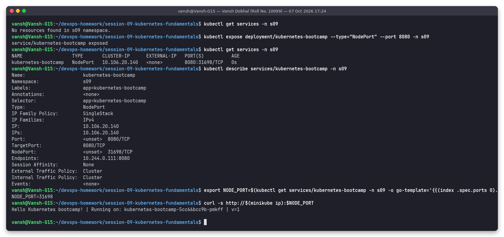

The Service received a ClusterIP and a random NodePort (31698 in this run). `describe` shows `Selector: app=kubernetes-bootcamp` and one Endpoint, the pod IP on port 8080. `curl` to `192.168.49.2:<NodePort>` from WSL reached the pod.

```bash
kubectl get pods -l app=kubernetes-bootcamp -n s09
kubectl get services -l app=kubernetes-bootcamp -n s09
kubectl label pods $POD_NAME version=v1 -n s09
kubectl get pods -n s09 --show-labels
kubectl get pods -l version=v1 -n s09
kubectl delete service -l app=kubernetes-bootcamp -n s09
curl http://$(minikube ip):$NODE_PORT        # fails now
kubectl exec -n s09 $POD_NAME -- curl -s http://localhost:8080   # app still running
```

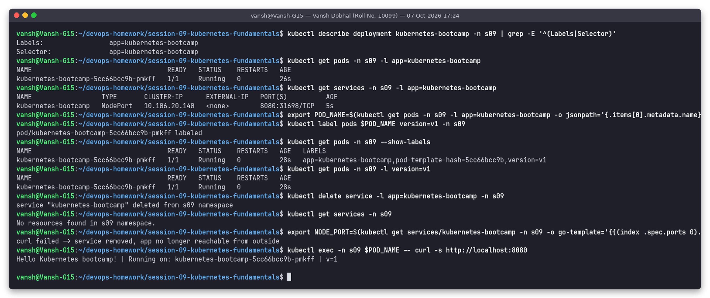

Labels are how Kubernetes objects find each other. The Deployment, its pods and the Service all carry `app=kubernetes-bootcamp`. I added `version=v1` to the pod and could then filter on it. After I deleted the Service by label, the outside `curl` failed (`curl failed -> service removed`), but `exec curl` inside the pod still worked. Deleting a Service removes the network entry point, not the app.

### Module 5 – Scale your app

```bash
kubectl expose deployment/kubernetes-bootcamp --type="NodePort" --port 8080 -n s09
kubectl get rs -n s09
kubectl scale deployments/kubernetes-bootcamp --replicas=4 -n s09
kubectl get deployments -n s09
kubectl get pods -n s09 -o wide
kubectl describe deployments/kubernetes-bootcamp -n s09   # events
kubectl get endpointslices -n s09 -l kubernetes.io/service-name=kubernetes-bootcamp
```

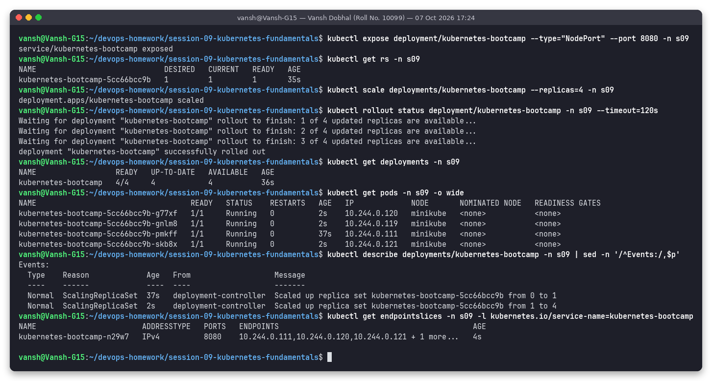

The ReplicaSet went from DESIRED 1 to 4. Four pods now run with different IPs, the event `Scaled up replica set ... from 1 to 4` was recorded, and the Service's EndpointSlice now lists four endpoints.

```bash
for i in $(seq 1 40); do curl -s http://$(minikube ip):$NODE_PORT; done | grep -o 'kubernetes-bootcamp-[a-z0-9-]*' | sort | uniq -c
kubectl scale deployments/kubernetes-bootcamp --replicas=2 -n s09
```

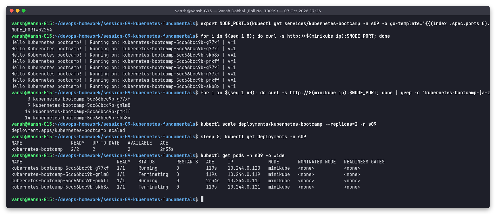

Load balancing for real: 40 requests through the NodePort were spread over all 4 pods (**3 / 9 / 14 / 14** in the captured run). kube-proxy's iptables mode picks a backend at random for each new connection, so the split is roughly even, not exact round-robin. After I scaled down to 2, two pods went to `Terminating` and the deployment showed `2/2`.

### Module 6 – Update your app (rolling update and rollback)

```bash
kubectl set image deployments/kubernetes-bootcamp kubernetes-bootcamp=docker.io/jocatalin/kubernetes-bootcamp:v2 -n s09
kubectl rollout status deployments/kubernetes-bootcamp -n s09
kubectl get pods,rs -n s09
curl http://$(minikube ip):$NODE_PORT
kubectl get pods -n s09 -o custom-columns='POD:.metadata.name,IMAGE:.spec.containers[0].image,BEING-DELETED-AT:.metadata.deletionTimestamp'
```

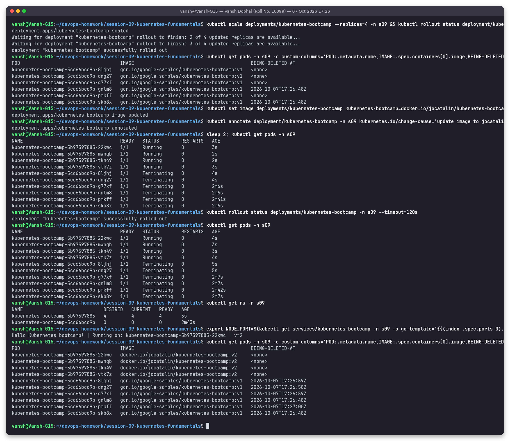

The rolling update created a new ReplicaSet (`...5b97597885`, image v2) and scaled the old one (`...5cc66bcc9b`) to 0. `curl` now answers `| v=2`. The old v1 pods stay in `Terminating` for a while. The custom-columns view shows they carry a `deletionTimestamp`, so they no longer receive traffic. The bootcamp Node.js process ignores SIGTERM, which means each old pod waits out the full 30 s grace period before the kubelet sends SIGKILL.

```bash
kubectl set image deployments/kubernetes-bootcamp kubernetes-bootcamp=gcr.io/google-samples/kubernetes-bootcamp:v10 -n s09
kubectl get deployments,pods -n s09                   # ImagePullBackOff
kubectl rollout history deployment/kubernetes-bootcamp -n s09
kubectl rollout undo deployments/kubernetes-bootcamp -n s09
kubectl rollout status deployments/kubernetes-bootcamp -n s09
```

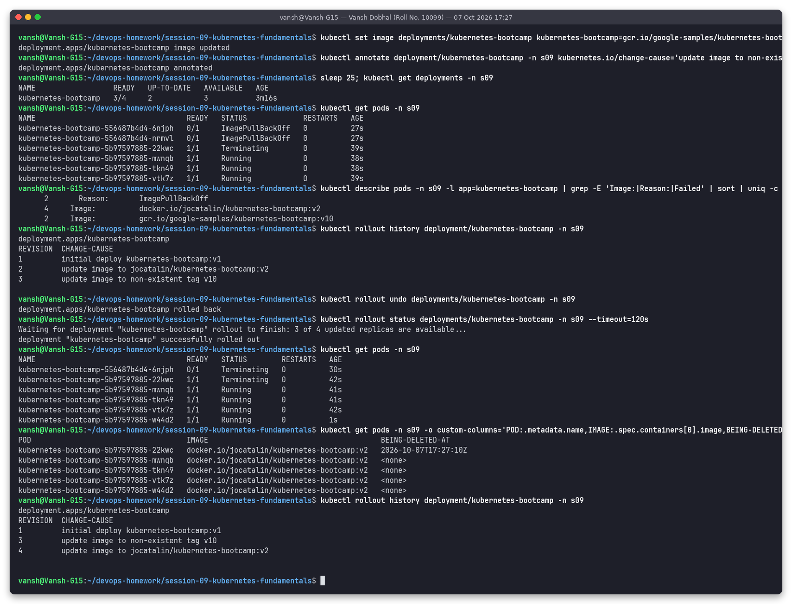

The update to the non-existent tag `v10` was **safe**. Two new pods went into `ImagePullBackOff`, but the Deployment kept 3 of 4 v2 pods available (`READY 3/4`): the rolling-update limits stopped it from tearing down working pods before new ones were ready. `kubectl rollout undo` went back to the previous revision. All pods ran `jocatalin/kubernetes-bootcamp:v2` again, and the history renumbered revision 2 as **4** (`1, 3, 4`), because a rollback is recorded as a new revision.

### Cleanup

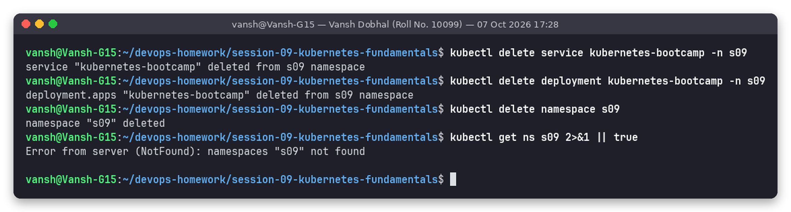

The Service, the Deployment and the `s09` namespace were deleted. `kubectl get ns s09` returns `NotFound`.

---

## What I learned

- Kubernetes is a set of **reconcile loops** around one API server backed by etcd. I never "start a container". I write desired state, and controllers (ReplicaSet, Deployment, scheduler, kubelet) keep making reality match it.
- In minikube the control plane runs as **static pods** that the kubelet starts from `/etc/kubernetes/manifests`, while kube-proxy and the CNI are DaemonSets. There is no cloud-controller-manager because there is no cloud.
- **Labels and selectors** tie Deployments, ReplicaSets, Pods and Services together. A Service can be deleted and re-created without touching the pods.
- `scale` changes only the replica count of the current ReplicaSet. `set image` creates a new ReplicaSet and shifts pods over gradually. `rollout undo` brings back an old ReplicaSet template.

## Folder structure

```
session-09-kubernetes-fundamentals
├── README.md
├── scripts
│   ├── 01-setup-and-architecture.sh     # snaps 01–07 (install, status, architecture, objects)
│   └── 02-kubernetes-basics-tutorial.sh # snaps 10–20 (tutorial modules 1–6 + cleanup)
├── screenshots/                         # 18 PNGs (real runs)
└── outputs/                             # exact text of every screenshot
```

## How to reproduce

```bash
# inside WSL Ubuntu with minikube running (minikube start --driver=docker)
cd ~/devops-homework/session-09-kubernetes-fundamentals
bash scripts/01-setup-and-architecture.sh
bash scripts/02-kubernetes-basics-tutorial.sh     # creates and finally deletes namespace s09
```
Both scripts call `snap` (from `../tools/snap.sh`) to regenerate `screenshots/` and `outputs/`.
