# Session 10 – Pods, ReplicaSets & Deployments

**Name:** Vansh Dobhal | **Roll No:** 10099

This session has two parts. **Task 1** implements the four Deployment strategies (Rolling Update, Blue-Green, Canary, Recreate) and checks each one with real traffic. **Task 2** walks a Pod through every common lifecycle state and probe type, and adds a ReplicaSet self-healing demo.

Every screenshot is a real run on my minikube cluster (Kubernetes v1.37.0, containerd runtime, WSL2 Ubuntu 24.04), captured with my `snap` helper (`tools/snap.sh`). The helper runs the commands and saves a PNG plus the exact text (`outputs/<name>.txt`). Extra logs written during the runs (timestamped pod watches, curl loops) are also in `outputs/`.

The YAMLs are adapted from the instructor repo (`devops-heros/session10-k8s-core-objects`). My changes:
- added `kubernetes.io/change-cause` annotations, so `rollout history` is readable
- removed the hard-coded `nodePort` values, so they can't collide with other labs on the shared cluster
- raised the Pending pod's memory request to 64Gi, because the node actually has about 10 GiB allocatable and the original 9Gi would have been scheduled
- added a `curl-client` pod and a ReplicaSet self-healing YAML

**Namespaces used:** `s10-rolling`, `s10-bluegreen`, `s10-canary`, `s10-recreate`, `s10-lifecycle`. I deleted all of them after capturing.

---

## Contents

- [Task 1: Deployment Strategies](#task-1-deployment-strategies)
  - [01 Rolling Update](#01-rolling-update)
  - [02 Blue-Green](#02-blue-green)
  - [03 Canary](#03-canary)
  - [04 Recreate](#04-recreate)
  - [Strategy comparison](#strategy-comparison)
- [Task 2: Pod Lifecycle](#task-2-pod-lifecycle)
  - [Lifecycle phase diagram](#lifecycle-phase-diagram)
  - [01 Running](#01-running) · [02 Pending](#02-pending) · [03 Succeeded](#03-succeeded) · [04 Failed](#04-failed) · [05 CrashLoopBackOff](#05-crashloopbackoff) · [06 ImagePullBackOff](#06-imagepullbackoff)
  - [07 Readiness probe](#07-readiness-probe) · [08 Liveness probe](#08-liveness-probe) · [09 Startup probe](#09-startup-probe) · [10 Init container](#10-init-container) · [11 Multi-container](#11-multi-container-pod) · [12 Graceful termination](#12-graceful-termination)
  - [ReplicaSet self-healing](#replicaset-self-healing-demo)
  - [Summary of all lifecycle pods](#summary-of-all-lifecycle-pods)
- [Folder structure](#folder-structure) · [How to reproduce](#how-to-reproduce)

---

## Task 1: Deployment Strategies

All four strategies use nginx images, where **v1 = `nginx:1.24-alpine`** and **v2 = `nginx:1.25-alpine`**. A `postStart` hook writes a page that names the version (e.g. `VERSION: v1`, `BLUE ENVIRONMENT`, `CANARY v2`), so a plain `curl` shows which version answered.

Traffic is always sent from **inside the cluster**, from the `curl-client` pod ([`common/curl-client.yaml`](task1-deployment-strategies/common/curl-client.yaml), image `curlimages/curl:8.10.1`), straight to the Service's DNS name.

Two helper scripts:
- [`scripts/watch-pods.sh`](scripts/watch-pods.sh) runs `kubectl get pods -w --output-watch-events` in the background and stamps each line with the wall-clock time (ms).
- [`scripts/curl-loop.sh`](scripts/curl-loop.sh) sends N requests from curl-client and logs `time  version` for each one, or `FAIL` when there is no answer within 1 s.

### 01 Rolling Update

**Files:** [`deployment-v1.yaml`](task1-deployment-strategies/01-rolling-update/deployment-v1.yaml), [`deployment-v2.yaml`](task1-deployment-strategies/01-rolling-update/deployment-v2.yaml), [`service.yaml`](task1-deployment-strategies/01-rolling-update/service.yaml)

```yaml
spec:
  replicas: 4
  strategy:
    type: RollingUpdate
    rollingUpdate:
      maxSurge: 1        # at most 4+1 = 5 pods during the update
      maxUnavailable: 0  # never fewer than 4 ready pods
  template:
    spec:
      containers:
        - name: web
          image: nginx:1.24-alpine      # v2 file: nginx:1.25-alpine
          readinessProbe: { httpGet: { path: /, port: 80 }, initialDelaySeconds: 3, periodSeconds: 5 }
```

**Step 1: create the v1 Deployment**

```bash
kubectl apply -n s10-rolling -f 01-rolling-update/deployment-v1.yaml -f 01-rolling-update/service.yaml
kubectl rollout status deployment/app-rolling -n s10-rolling
kubectl get deploy app-rolling -n s10-rolling -o jsonpath='{.spec.strategy}'
kubectl get pods -L version -o wide ; kubectl get rs
kubectl exec curl-client -- curl -s http://app-rolling-service
```

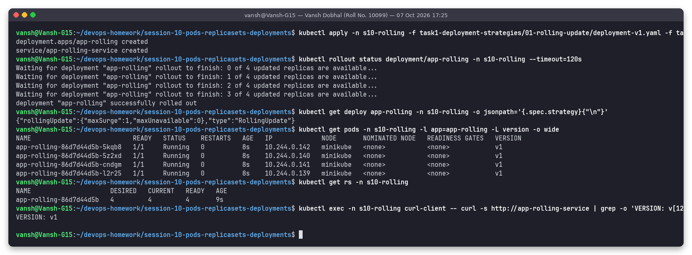

Result: 4 pods with label `version=v1`, one ReplicaSet `app-rolling-86d7d44d5b`, and the strategy `{"rollingUpdate":{"maxSurge":1,"maxUnavailable":0},"type":"RollingUpdate"}`. The Service returns `VERSION: v1`.

**Step 2: perform the update v1 → v2 while watching pods and sending traffic**

```bash
bash scripts/watch-pods.sh s10-rolling outputs/01-rolling-watch.log &
bash scripts/curl-loop.sh s10-rolling http://app-rolling-service 70 0.5 'VERSION: v[12]' > outputs/01-rolling-curl-during-update.log &
kubectl apply -n s10-rolling -f 01-rolling-update/deployment-v2.yaml
sleep 5; kubectl get pods -L version; kubectl get rs -L version      # mid-rollout
kubectl rollout status deployment/app-rolling -n s10-rolling
kubectl get pods -L version; kubectl get rs
kubectl rollout history deployment/app-rolling -n s10-rolling
```

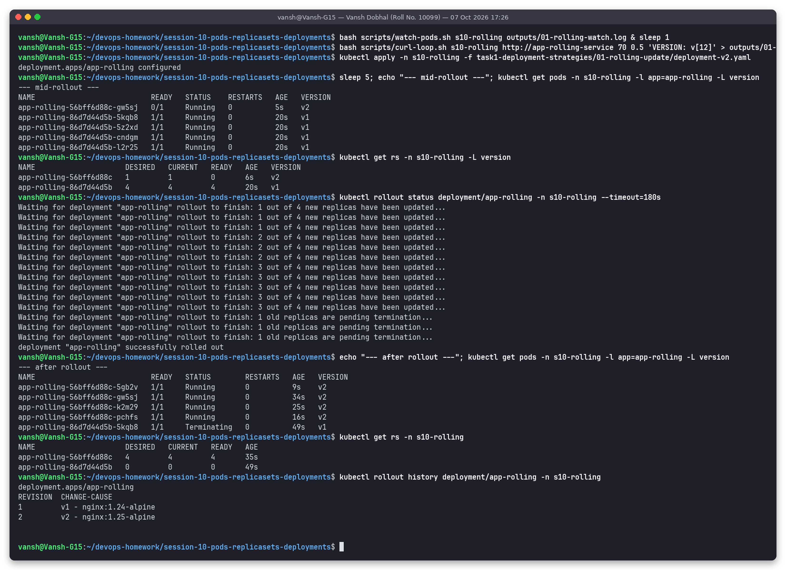

**Mid-rollout** (5 s after the apply) both versions run side by side. There are **4 v1 pods `1/1`** plus **1 v2 pod `0/1`** still waiting for its readiness probe, which is exactly `maxSurge: 1`. The new ReplicaSet `app-rolling-56bff6d88c` has DESIRED 1 and READY 0, and the old one still has 4. At the end the new RS has 4/4 and the old RS has 0, and is kept for rollback. History shows `1  v1 - nginx:1.24-alpine` and `2  v2 - nginx:1.25-alpine`.

**Step 3: check old vs new pods (timestamped watch, traffic, events) and roll back**

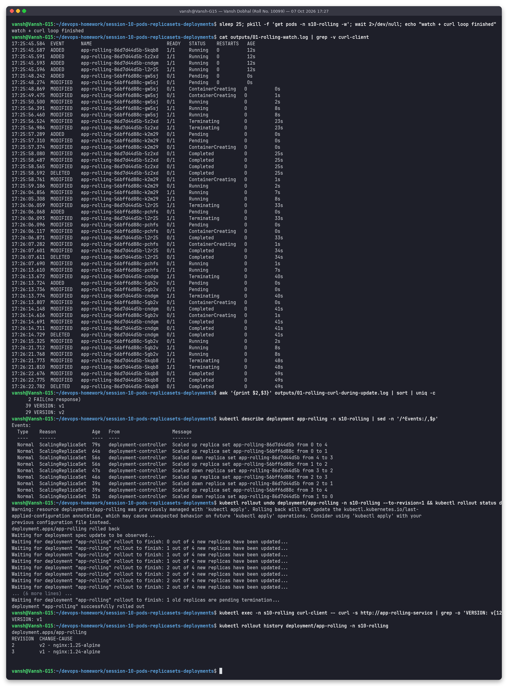

The timestamped watch log ([`outputs/01-rolling-watch.log`](outputs/01-rolling-watch.log)) shows the one-in, one-out pattern:

```
17:25:48.242  ADDED      app-rolling-56bff6d88c-gw5sj   0/1     Pending
17:25:56.391  MODIFIED   app-rolling-56bff6d88c-gw5sj   1/1     Running        <- new pod becomes Ready
17:25:56.524  MODIFIED   app-rolling-86d7d44d5b-5z2xd   1/1     Terminating    <- only then one old pod is removed
17:25:57.289  ADDED      app-rolling-56bff6d88c-k2m29   0/1     Pending        <- and the next new pod is created
...
17:26:22.782  DELETED    app-rolling-86d7d44d5b-5kqb8   0/1     Completed      <- last v1 pod gone (~34 s total)
```

The Deployment events confirm the same steps: `Scaled up ...56bff6d88c from 0 to 1`, `Scaled down ...86d7d44d5b from 4 to 3`, `1 to 2`, and so on until `1 to 0`.

Traffic during the update (70 requests, one every 0.5 s): **39 × v1, 29 × v2, 2 × FAIL**. The two failures are at `17:26:06` and `17:26:22`, the exact moments two v1 pods went to `Terminating`. This is the known race between the kubelet stopping nginx and kube-proxy removing the pod from the Service endpoints. It is the reason production manifests add a `preStop: sleep 5` hook, so a pod keeps serving for a few seconds after it is marked for deletion.

Rollback: `kubectl rollout undo deployment/app-rolling --to-revision=1` rolled v1 back in with the same surge rules, and `curl` again returned `VERSION: v1`. History now reads `2` and `3` (v1 re-applied as revision 3).

### 02 Blue-Green

**Files:** [`deployment-blue.yaml`](task1-deployment-strategies/02-blue-green/deployment-blue.yaml) (`slot: blue`, v1), [`deployment-green.yaml`](task1-deployment-strategies/02-blue-green/deployment-green.yaml) (`slot: green`, v2), [`service-blue.yaml`](task1-deployment-strategies/02-blue-green/service-blue.yaml) / [`service-green.yaml`](task1-deployment-strategies/02-blue-green/service-green.yaml). The Service's selector is the switch:

```yaml
selector:
  app: myapp
  slot: blue     # change to green to cut over 100% of traffic at once
```

**Step 1: run both environments, with the Service on blue**

```bash
kubectl apply -n s10-bluegreen -f deployment-blue.yaml -f deployment-green.yaml -f service-blue.yaml
kubectl get deploy,svc -o wide
kubectl get pods -l app=myapp -L slot,version -o wide
kubectl get endpointslices -l kubernetes.io/service-name=myapp-service
```

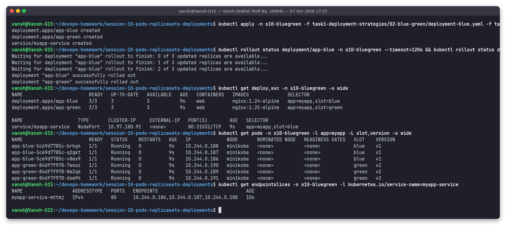

Six pods run: 3 blue (v1, 10.244.0.186–188) and 3 green (v2, 10.244.0.189–191). The Service selector is `app=myapp,slot=blue`, so the EndpointSlice holds **only the three blue IPs**. Green is fully deployed and warm but gets no traffic.

**Step 2: switch the Service selector with `kubectl patch` and check the active version via curl**

```bash
kubectl exec curl-client -- sh -c 'for i in $(seq 1 10); do curl -s http://myapp-service | grep -oE "(BLUE|GREEN) ENVIRONMENT"; done' | sort | uniq -c
kubectl patch service myapp-service -n s10-bluegreen -p '{"spec":{"selector":{"app":"myapp","slot":"green"}}}'
kubectl exec curl-client -- sh -c '... same loop ...' | sort | uniq -c
kubectl get endpointslices -l kubernetes.io/service-name=myapp-service
```

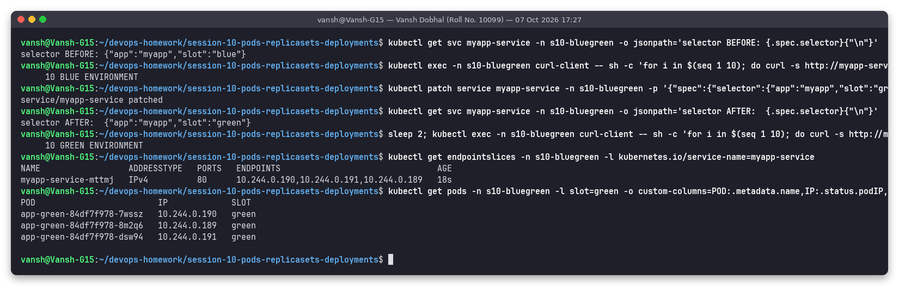

| | Selector | 10 requests |
|-|----------|-------------|
| Before patch | `{"app":"myapp","slot":"blue"}` | **10 BLUE ENVIRONMENT** |
| After patch | `{"app":"myapp","slot":"green"}` | **10 GREEN ENVIRONMENT** |

After the patch the EndpointSlice switched to 10.244.0.189/.190/.191, which matches the green pod IPs. The cut-over is atomic: no request got a mix of versions.

**Step 3: instant rollback, then retire blue**

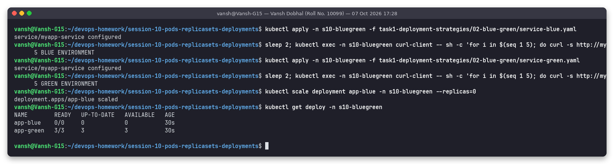

`kubectl apply -f service-blue.yaml` gave 5/5 BLUE right away, and `service-green.yaml` gave 5/5 GREEN again. Once green was confirmed, blue was scaled to 0 (`app-blue 0/0`). Until then it served as the rollback target. The cost of blue-green is that **double the capacity** runs during the switch.

### 03 Canary

**Files:** [`deployment-stable.yaml`](task1-deployment-strategies/03-canary/deployment-stable.yaml) (9 replicas, `track: stable`, v1), [`deployment-canary.yaml`](task1-deployment-strategies/03-canary/deployment-canary.yaml) (1 replica, `track: canary`, v2), [`service.yaml`](task1-deployment-strategies/03-canary/service.yaml). The Service selects only the **shared label** `app: myapp-canary`, so it load-balances across all 10 pods.

```bash
kubectl apply -n s10-canary -f 03-canary/
kubectl get pods -l app=myapp-canary -L track,version
kubectl describe svc myapp-canary-service | grep -E 'Selector|Endpoints'
kubectl get endpointslices ... -o jsonpath='{range .items[*].endpoints[*]}{.addresses[0]} {.targetRef.name}{"\n"}{end}'
```

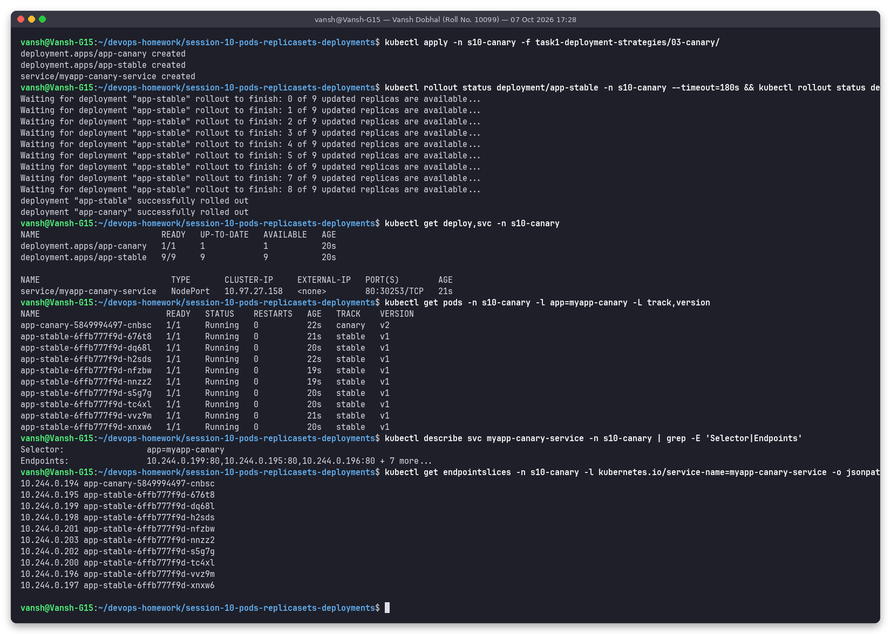

The EndpointSlice lists 10 endpoints: 1 `app-canary-*` and 9 `app-stable-*`.

**Traffic split, measured with real requests:**

```bash
for run in 1 2 3; do
  kubectl exec -n s10-canary curl-client -- sh -c 'for i in $(seq 1 100); do curl -s http://myapp-canary-service | grep -oE "STABLE v1|CANARY v2"; done' | sort | uniq -c
done
```

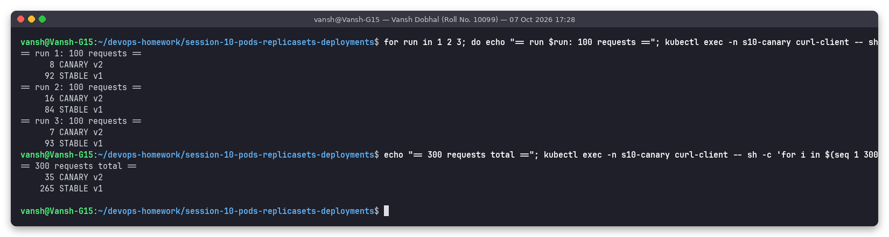

| Sample | STABLE v1 | CANARY v2 | Canary % |
|--------|-----------|-----------|----------|
| Run 1 (100 req) | 92 | 8 | 8 % |
| Run 2 (100 req) | 84 | 16 | 16 % |
| Run 3 (100 req) | 93 | 7 | 7 % |
| One run of 300 req | 265 | 35 | 11.7 % |

Expected: 1/10 = 10 %. The measured values scatter around 10 % because kube-proxy in iptables mode picks a random endpoint for each new connection. That is probability, not exact round-robin, so small samples vary (7–16 %) and the larger sample comes closer (11.7 %). The weight is controlled **only by pod counts**.

**Promote the canary to 50 %:**

```bash
kubectl scale deployment app-canary --replicas=5 && kubectl scale deployment app-stable --replicas=5
kubectl exec curl-client -- sh -c 'for i in $(seq 1 200); do ...; done' | sort | uniq -c
```

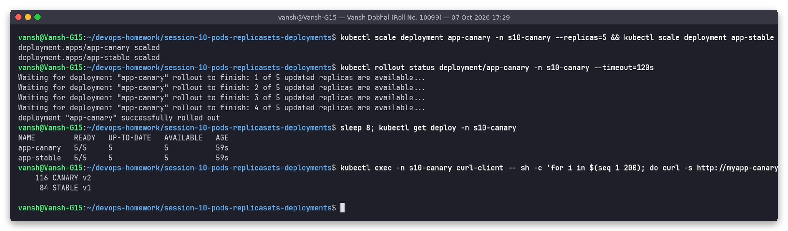

With 5 + 5 pods, 200 requests gave **116 CANARY v2 / 84 STABLE v1** (58 % / 42 %), close to the expected 50/50. The next step would be canary at 10 replicas and stable at 0.

**Precise weights with ingress-nginx (not used here, for reference).** With plain Services the weight is limited to pod ratios. The ingress-nginx controller (enabled on this cluster) can split by percentage, independent of replica count, using a second Ingress that carries canary annotations:

```yaml
metadata:
  annotations:
    nginx.ingress.kubernetes.io/canary: "true"
    nginx.ingress.kubernetes.io/canary-weight: "10"          # 10% of requests
    # or route by header/cookie: canary-by-header: "X-Canary"
```

### 04 Recreate

**Files:** [`deployment-v1.yaml`](task1-deployment-strategies/04-recreate/deployment-v1.yaml), [`deployment-v2.yaml`](task1-deployment-strategies/04-recreate/deployment-v2.yaml), [`service.yaml`](task1-deployment-strategies/04-recreate/service.yaml), with `strategy: { type: Recreate }`, 3 replicas.

```bash
kubectl apply -n s10-recreate -f 04-recreate/deployment-v1.yaml -f 04-recreate/service.yaml
kubectl get deploy app-recreate -o jsonpath='{.spec.strategy}'     # {"type":"Recreate"}
```

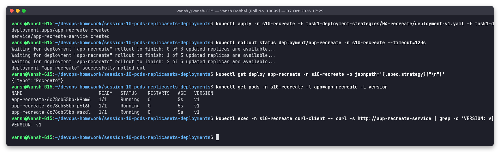

**Update with a background timestamped watch and a curl loop running:**

```bash
bash scripts/watch-pods.sh s10-recreate outputs/04-recreate-watch.log &      # kubectl get pods -w --output-watch-events
bash scripts/curl-loop.sh s10-recreate http://app-recreate-service 30 0.5 'VERSION: v[12]' > outputs/04-recreate-curl-during-update.log &
kubectl apply -n s10-recreate -f 04-recreate/deployment-v2.yaml
kubectl get pods -L version; kubectl get rs -L version
kubectl rollout status deployment/app-recreate -n s10-recreate
```

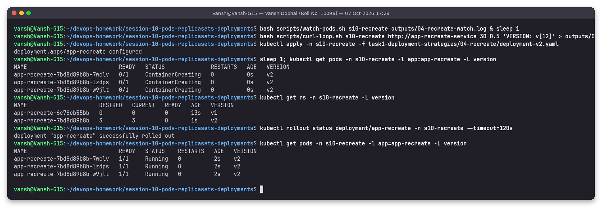

1 s after the apply the old ReplicaSet already shows DESIRED 0, and only v2 pods exist (in `ContainerCreating`). Old and new pods never ran together.

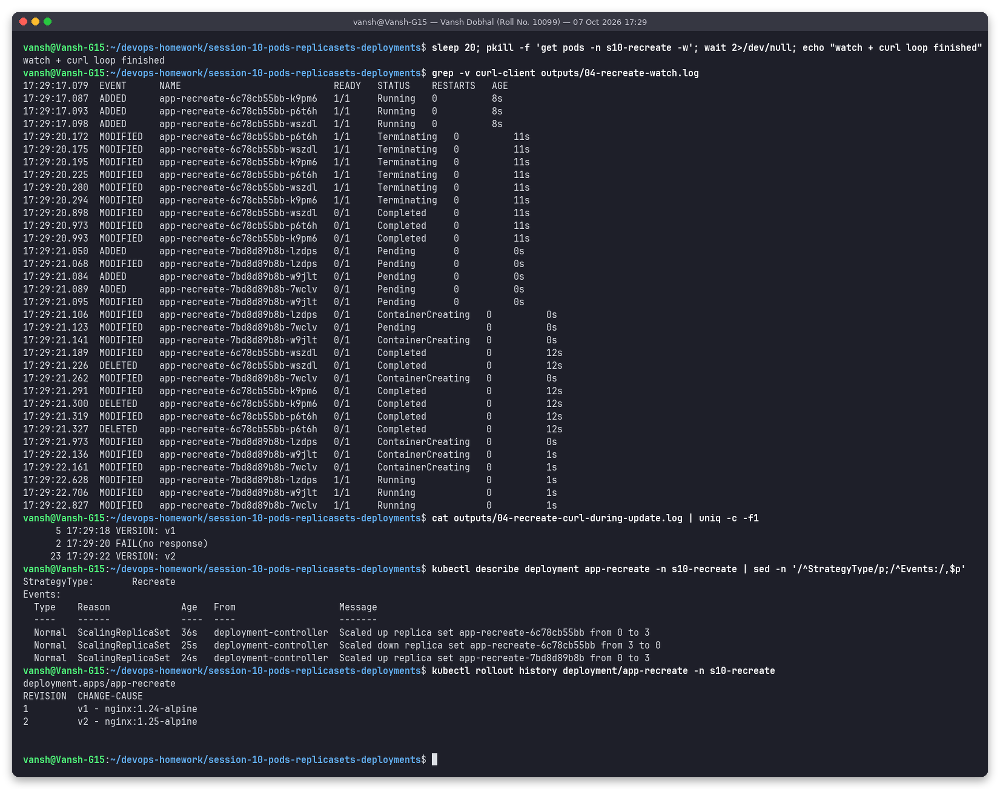

The watch log ([`outputs/04-recreate-watch.log`](outputs/04-recreate-watch.log)) proves the ordering:

```
17:29:20.172  MODIFIED   app-recreate-6c78cb55bb-p6t6h   1/1   Terminating   <- all 3 v1 pods get Terminating at once
17:29:20.175  MODIFIED   app-recreate-6c78cb55bb-wszdl   1/1   Terminating
17:29:20.195  MODIFIED   app-recreate-6c78cb55bb-k9pm6   1/1   Terminating
17:29:20.898 … 20.993    (all three)                     0/1   Completed     <- all v1 containers stopped
17:29:21.050  ADDED      app-recreate-7bd8d89b8b-lzdps   0/1   Pending       <- only now the first v2 pod is created
17:29:22.827  MODIFIED   app-recreate-7bd8d89b8b-7wclv   1/1   Running       <- all v2 Running
```

The curl loop measured the **downtime** this strategy causes:

```
      5 17:29:18 VERSION: v1
      2 17:29:20 FAIL(no response)     <- ~2 s with no pods serving
     23 17:29:22 VERSION: v2
```

The events agree: `Scaled down replica set app-recreate-6c78cb55bb from 3 to 0` comes first, then `Scaled up replica set app-recreate-7bd8d89b8b from 0 to 3`. Use Recreate when two versions must never run together, for example an incompatible DB schema or a singleton holding an RWO volume, and when a short outage is acceptable.

### Strategy comparison

| Strategy | How it works in K8s | Two versions at once? | Downtime observed | Extra capacity | Rollback |
|----------|--------------------|-----------------------|-------------------|----------------|----------|
| Rolling Update | Deployment `RollingUpdate`, new RS scaled up while old RS scaled down (maxSurge/maxUnavailable) | Yes, mixed v1/v2 responses (39/29) | None from capacity; 2/70 requests hit terminating pods (fix with preStop) | +1 pod (maxSurge) | `rollout undo` (gradual) |
| Blue-Green | Two Deployments, Service selector flipped with `kubectl patch` | No, 10/10 blue → 10/10 green | None | 2× during switch | Flip selector back (instant) |
| Canary | Two Deployments behind one Service on a shared label; weight = replica ratio | Yes, by design (~10 %) | None | +1 pod | Scale canary to 0 |
| Recreate | Deployment `Recreate`: old RS → 0, then new RS → N | Never | ~2 s (2 FAIL in curl loop) | None | Re-apply v1 (another outage) |

---

## Task 2: Pod Lifecycle

**Files:** [`task2-pod-lifecycle/01..12-*.yaml`](task2-pod-lifecycle/) and [`13-replicaset-self-healing.yaml`](task2-pod-lifecycle/13-replicaset-self-healing.yaml). Script: [`scripts/task2-lifecycle.sh`](scripts/task2-lifecycle.sh).

For each YAML I applied it, checked the pod status, looked at the details (`describe`, events, logs, jsonpath on `.status`) and noted what happened. A background timestamped watch of the whole namespace is in [`outputs/lifecycle-watch.log`](outputs/lifecycle-watch.log).

### Lifecycle phase diagram

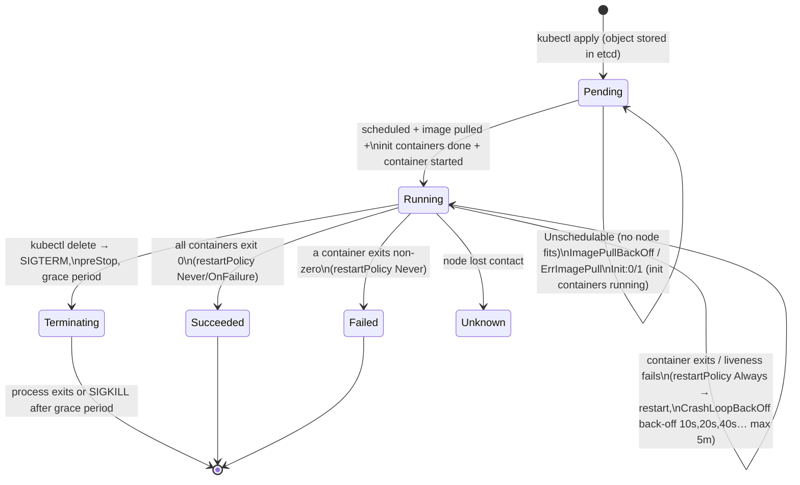
```mermaid
stateDiagram-v2
    [*] --> Pending: kubectl apply (object stored in etcd)
    Pending --> Pending: Unschedulable (no node fits)\nImagePullBackOff / ErrImagePull\nInit:0/1 (init containers running)
    Pending --> Running: scheduled + image pulled +\ninit containers done + container started
    Running --> Succeeded: all containers exit 0\n(restartPolicy Never/OnFailure)
    Running --> Failed: a container exits non-zero\n(restartPolicy Never)
    Running --> Running: container exits / liveness fails\n(restartPolicy Always → restart,\nCrashLoopBackOff back-off 10s,20s,40s… max 5m)
    Running --> Terminating: kubectl delete → SIGTERM,\npreStop, grace period
    Terminating --> [*]: process exits or SIGKILL after grace period
    Succeeded --> [*]
    Failed --> [*]
    Running --> Unknown: node lost contact
```

| Phase (`.status.phase`) | Meaning | "STATUS" column values seen in this lab |
|-------------------------|---------|-----------------------------------------|
| Pending | Accepted, but not all containers are running yet | `Pending`, `ContainerCreating`, `Init:0/1`, `ImagePullBackOff` |
| Running | Bound to a node, at least one container running or restarting | `Running`, `Error`/`CrashLoopBackOff` (between restarts) |
| Succeeded | All containers ended with exit 0 and won't restart | `Completed` |
| Failed | All containers ended, at least one non-zero, no restart | `Error` |
| Unknown | Node not reporting | (not produced) |

Probes add **conditions** on top of the phase: `PodScheduled`, `Initialized`, `ContainersReady`, `Ready`. A pod can be `Running` and still not `Ready`.

### 01 Running

[`01-running.yaml`](task2-pod-lifecycle/01-running.yaml): a single `nginx:1.27` container.

```bash
kubectl apply -n s10-lifecycle -f task2-pod-lifecycle/01-running.yaml
kubectl wait --for=condition=Ready pod/lifecycle-running
kubectl get pod lifecycle-running -o wide
kubectl get pod lifecycle-running -o jsonpath='phase={.status.phase} ... conditions'
kubectl describe pod lifecycle-running | sed -n '/^Events:/,$p'
```

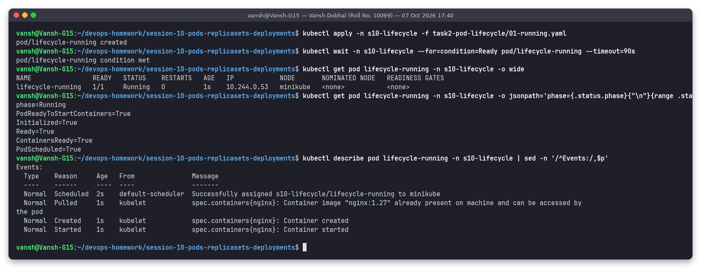

Observed: `phase=Running`, with all five conditions True (`PodReadyToStartContainers`, `Initialized`, `Ready`, `ContainersReady`, `PodScheduled`). The events show the happy path: `Scheduled → Pulled (already present) → Created → Started`.

### 02 Pending

[`02-pending.yaml`](task2-pod-lifecycle/02-pending.yaml) requests `cpu: 1` and `memory: 64Gi`.

```bash
kubectl apply -n s10-lifecycle -f task2-pod-lifecycle/02-pending.yaml
kubectl get pod lifecycle-pending -o wide
kubectl get pod lifecycle-pending -o jsonpath='phase=... PodScheduled=... reason=...'
kubectl describe pod lifecycle-pending      # Requests + Events
kubectl get node minikube -o jsonpath='{.status.allocatable.memory}'
```

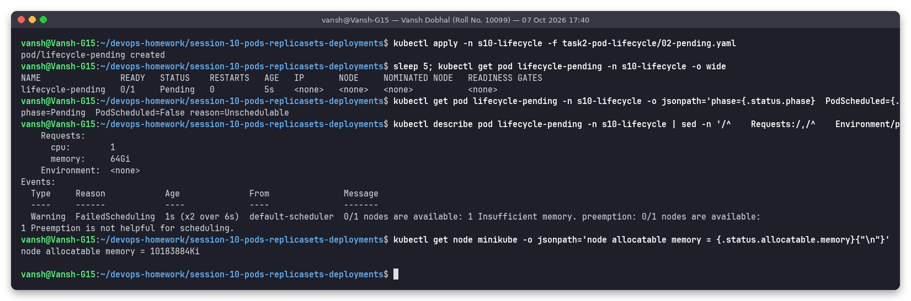

Observed: `phase=Pending`, `PodScheduled=False`, `reason=Unschedulable`, and NODE `<none>`. The scheduler's event explains it: `0/1 nodes are available: 1 Insufficient memory. preemption: ... Preemption is not helpful`. The node's allocatable memory is `10183884Ki` (≈9.7 GiB), far less than 64Gi. The pod stays Pending until a node with enough room shows up. **Fix:** lower the requests, or add or scale nodes.

### 03 Succeeded

[`03-succeeded.yaml`](task2-pod-lifecycle/03-succeeded.yaml): `restartPolicy: Never`, busybox prints, sleeps 5 s, then `exit 0`.

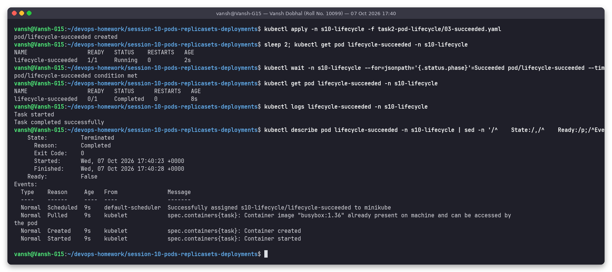

Observed: `Running 1/1` at 2 s, then `Completed 0/1` at 8 s (`kubectl wait --for=jsonpath='{.status.phase}'=Succeeded` matched). Logs: `Task started` / `Task completed successfully`. Container state: `Terminated, Reason: Completed, Exit Code: 0`, with Started and Finished 5 s apart. This is how Jobs and batch tasks end.

### 04 Failed

[`04-failed.yaml`](task2-pod-lifecycle/04-failed.yaml): the same, but `exit 1`.

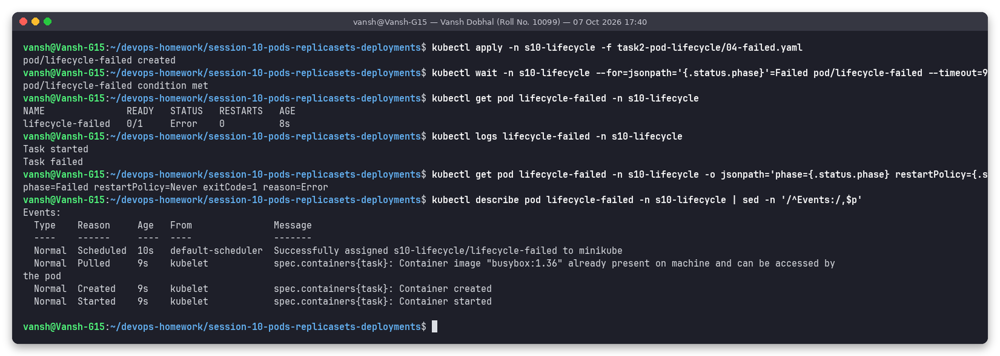

Observed: STATUS `Error`, `phase=Failed restartPolicy=Never exitCode=1 reason=Error`. Logs: `Task started` / `Task failed`. Because of `restartPolicy: Never` the kubelet does **not** restart it, so the pod stays Failed for inspection.

### 05 CrashLoopBackOff

[`05-crashloopbackoff.yaml`](task2-pod-lifecycle/05-crashloopbackoff.yaml): default `restartPolicy: Always`; the app prints, sleeps 3 s and exits 1.

```bash
kubectl apply -n s10-lifecycle -f task2-pod-lifecycle/05-crashloopbackoff.yaml
for i in $(seq 1 100); do echo "$(date +%T) $(kubectl get pod lifecycle-crashloop --no-headers | awk '{print $3, "restarts="$4}')"; sleep 1; done | uniq -f1
kubectl logs lifecycle-crashloop
kubectl describe pod lifecycle-crashloop | sed -n '/^Events:/,$p'
```

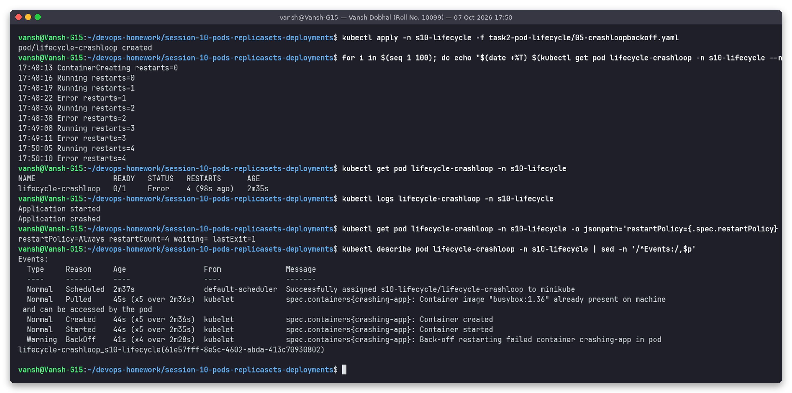

Observed: the status sampled every second shows the restart loop with **growing gaps**:

```
17:48:16 Running restarts=0
17:48:22 Error   restarts=1  -> restarted 17:48:34  (~12 s later)
17:48:38 Error   restarts=2  -> restarted 17:49:08  (~30 s later)
17:49:11 Error   restarts=3  -> restarted 17:50:05  (~54 s later)
```

That is the kubelet's exponential back-off (10 s, 20 s, 40s… capped at 5 min), plus the 3 s the app runs each time and polling overhead. The events show `Warning BackOff ... Back-off restarting failed container crashing-app (x4)`. `kubectl logs` shows the last crashed run, `Application started` / `Application crashed`, and lastExit is 1.

Note on this Kubernetes version (v1.37): while the pod waits in back-off, the STATUS column usually showed the last termination reason, `Error`. The `CrashLoopBackOff` waiting reason appeared in the namespace summary taken during an earlier pass of the same YAML (see [summary](#summary-of-all-lifecycle-pods): `WAITING=CrashLoopBackOff`, `RESTARTS=5`). The `phase` stays `Running` the whole time, because with `restartPolicy: Always` the pod never reaches a terminal phase. **Debug with:** `kubectl logs --previous`, `describe` (exit code), and checking the command/config.

### 06 ImagePullBackOff

[`06-imagepullbackoff.yaml`](task2-pod-lifecycle/06-imagepullbackoff.yaml): image `jakwehrgkaejw:kahsdfgkhj`, which does not exist.

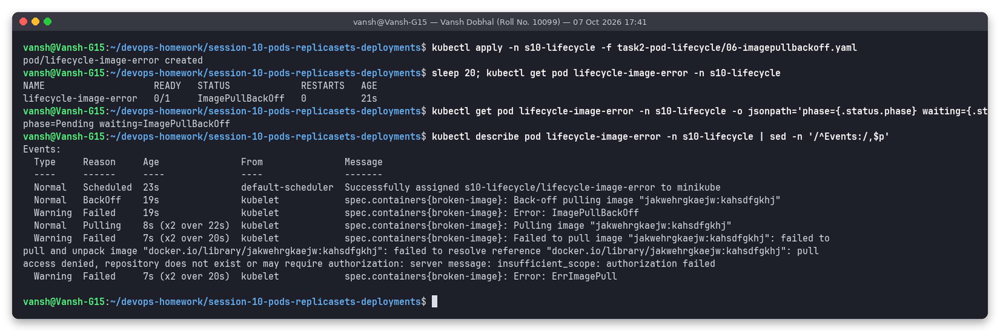

Observed: `phase=Pending waiting=ImagePullBackOff`. The events show the cycle `Pulling → Failed (ErrImagePull) → BackOff (ImagePullBackOff) → Pulling` again. The real cause is in the message: `failed to resolve reference "docker.io/library/jakwehrgkaejw:kahsdfgkhj": pull access denied, repository does not exist or may require authorization`. Typical causes: a typo in the image or tag, a private registry without `imagePullSecrets`, or rate limits.

### 07 Readiness probe

[`07-readiness.yaml`](task2-pod-lifecycle/07-readiness.yaml): nginx with `readinessProbe httpGet / :80, initialDelaySeconds 5, periodSeconds 5`.

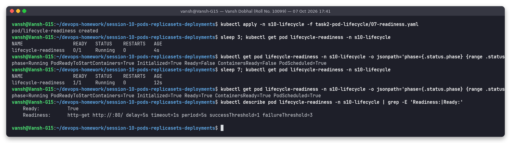

Observed:
- at **4 s**: `0/1 Running`, with `Ready=False ContainersReady=False`. The container runs, but the probe has not passed yet, so the pod would **not** get Service traffic.
- at **12 s**: `1/1 Running`, with `Ready=True`. `describe` shows `Readiness: http-get http://:80/ delay=5s timeout=1s period=5s successThreshold=1 failureThreshold=3`.

Readiness controls **traffic** (EndpointSlice membership) and never restarts a container. Task 1's rolling update relied on this: a new pod only counted as available after this probe passed.

### 08 Liveness probe

[`08-liveness.yaml`](task2-pod-lifecycle/08-liveness.yaml): the app creates `/tmp/healthy`, deletes it after 20 s and keeps running. The probe `test -f /tmp/healthy` runs every 5 s with `failureThreshold: 2`.

```bash
kubectl apply -n s10-lifecycle -f task2-pod-lifecycle/08-liveness.yaml
kubectl wait --for=jsonpath='{.status.containerStatuses[0].restartCount}'=1 pod/lifecycle-liveness --timeout=180s
kubectl logs lifecycle-liveness --previous
kubectl describe pod lifecycle-liveness
```

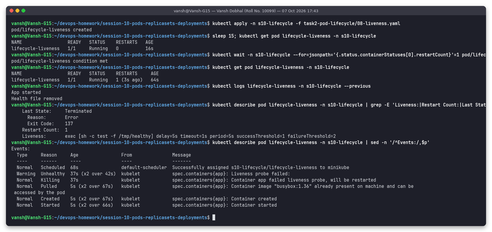

Observed: healthy at 16 s (`1/1`, 0 restarts). Once the file was gone, the events show `Liveness probe failed (x2)` and then `Killing ... Container app failed liveness probe, will be restarted`. The previous container's logs end with `Health file removed`. `describe` shows `Last State: Terminated, Reason: Error, Exit Code: 137` (128+9 = SIGKILL) and `Restart Count: 1`; by the summary it had reached 3 restarts.

The restart came about **30 s after the Killing event**. busybox `sh` runs as PID 1 with no SIGTERM handler, so it ignores SIGTERM, and the kubelet has to wait out the default 30 s `terminationGracePeriodSeconds` before sending SIGKILL. Liveness = "is the process stuck? then restart it".

### 09 Startup probe

[`09-startup.yaml`](task2-pod-lifecycle/09-startup.yaml): the app needs 30 s to start (`touch /tmp/started` after `sleep 30`). The startup probe checks every 5 s, `failureThreshold: 10`, so it allows up to 50 s.

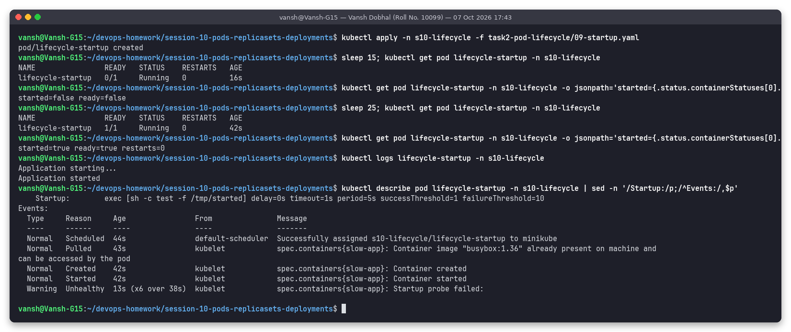

Observed:
- at 16 s: `0/1 Running`, `started=false ready=false`
- events: `Startup probe failed (x6 over 38s)`, which is expected while the app boots and is **not** fatal while under the threshold
- at 42 s: `1/1 Running`, `started=true ready=true restarts=0`. Logs: `Application starting...` / `Application started`.

While a startup probe is defined, liveness and readiness probes are held off until it succeeds. Slow-booting apps (JVMs, apps that run migrations) get time to start without a short liveness probe killing them in a restart loop.

### 10 Init container

[`10-init-container.yaml`](task2-pod-lifecycle/10-init-container.yaml): init container `setup` (busybox, sleeps 10 s) runs before the `nginx:1.27` app container.

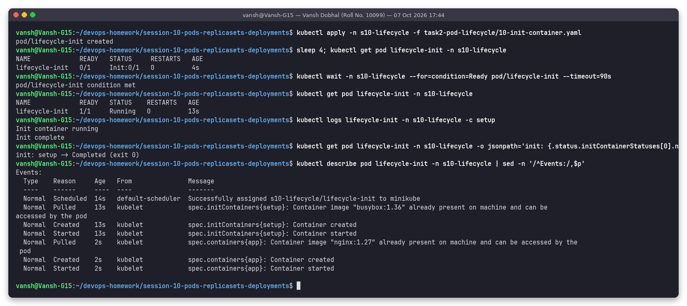

Observed: at 4 s STATUS is `Init:0/1` (the pod is still in phase Pending while init containers run). At 13 s it is `1/1 Running`. Init status: `setup -> Completed (exit 0)`, and its logs show `Init container running` / `Init complete`. The event timestamps show the order: `spec.initContainers{setup}` Started 13 s ago, and only **11 s later** (2 s ago) `spec.containers{app}` Pulled/Created/Started. Init containers run one after another, each to completion, and must succeed before app containers start. Typical uses: waiting for a DB, running migrations, fetching config.

### 11 Multi-container Pod

[`11-multi-container.yaml`](task2-pod-lifecycle/11-multi-container.yaml): `app` (nginx) plus `sidecar` (busybox loop that logs every 10 s).

```bash
kubectl get pod lifecycle-multi-container                 # READY 2/2
kubectl get pod ... -o jsonpath='{range .status.containerStatuses[*]}{.name}: ready={.ready} image={.image}{"\n"}{end}'
kubectl logs lifecycle-multi-container -c sidecar
kubectl exec lifecycle-multi-container -c sidecar -- wget -qO- http://localhost:80
```

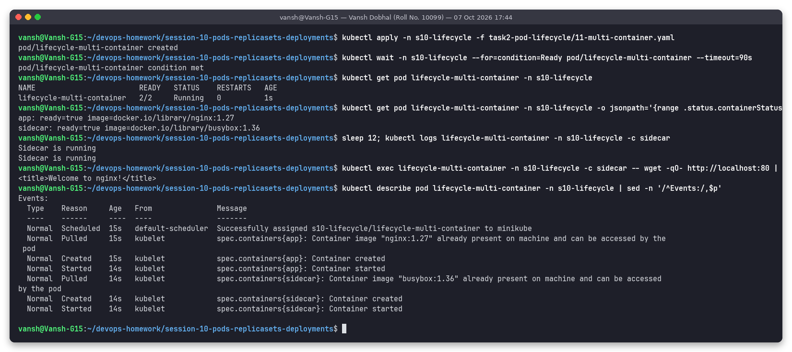

Observed: `READY 2/2`, both containers `ready=true`. `-c sidecar` selects one container's logs (`Sidecar is running` ×2). From **inside the sidecar**, `wget http://localhost:80` returned nginx's `<title>Welcome to nginx!</title>`. The containers share the pod's network namespace, so `localhost` is the same for both. This is the sidecar pattern used by log shippers, proxies (Envoy/Istio) and similar tools.

### 12 Graceful termination

[`12-termination.yaml`](task2-pod-lifecycle/12-termination.yaml): `terminationGracePeriodSeconds: 20`. The shell traps `TERM`, prints a message, "cleans up" for 10 s and exits 0.

```bash
kubectl apply -n s10-lifecycle -f task2-pod-lifecycle/12-termination.yaml
date +%T; kubectl delete pod lifecycle-termination --wait=false
sleep 3; kubectl get pod lifecycle-termination      # Terminating
kubectl logs lifecycle-termination                  # shows SIGTERM handler output
kubectl wait --for=delete pod/lifecycle-termination; date +%T
kubectl get events --field-selector involvedObject.name=lifecycle-termination
```

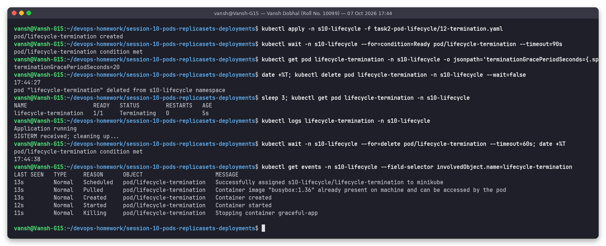

Observed: delete issued at **17:44:27**. 3 s later the pod is `Terminating` (still `1/1`), and its logs show `SIGTERM received; cleaning up...`. The pod was gone at **17:44:38**, **11 s** later: 10 s of cleanup plus overhead, inside the 20 s grace period, so no SIGKILL was needed. Event: `Killing ... Stopping container graceful-app`.

The termination sequence is: Pod marked Terminating and removed from endpoints → `preStop` hook (if any) → SIGTERM → wait up to `terminationGracePeriodSeconds` → SIGKILL. Compare the liveness and bootcamp pods, which **ignore** SIGTERM and therefore always take the full 30 s.

### ReplicaSet self-healing demo

[`13-replicaset-self-healing.yaml`](task2-pod-lifecycle/13-replicaset-self-healing.yaml): a ReplicaSet `yatri-backend-rs` with 3 replicas (python http.server).

```bash
kubectl apply -n s10-lifecycle -f task2-pod-lifecycle/13-replicaset-self-healing.yaml
kubectl get rs,pods -l app=yatri-backend
kubectl delete pod <one of them>
kubectl get pods -l app=yatri-backend
kubectl describe rs yatri-backend-rs           # events
kubectl scale rs yatri-backend-rs --replicas=5
kubectl get pod -l app=yatri-backend -o custom-columns=POD:...,OWNER-KIND:...,OWNER:...
```

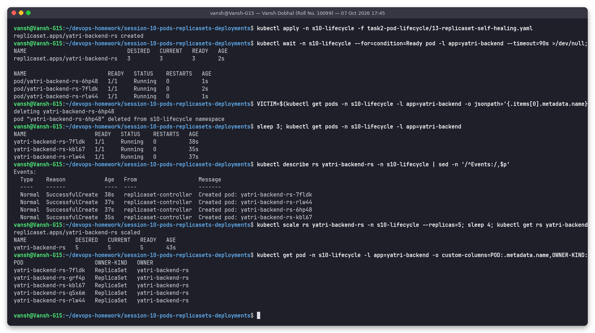

Observed: I deleted `yatri-backend-rs-6hp48`. Afterwards the RS still had **3** pods, and the new one `yatri-backend-rs-kbl67` is about 3 s younger than its siblings. The RS events show 4 × `SuccessfulCreate`: the original 3 plus the replacement. The replacement was created **as soon as the pod entered Terminating**, not after it disappeared. The `kubectl delete` itself took about 30 s because python as PID 1 ignores SIGTERM. Scaling to 5 created 2 more pods. Every pod's `ownerReferences` points to `ReplicaSet/yatri-backend-rs`, and that owner link plus the label selector is how the controller counts "its" pods. In practice you rarely create bare ReplicaSets: Deployments create them for you (as seen in Task 1 with `app-rolling-86d7d44d5b` / `-56bff6d88c`).

### Summary of all lifecycle pods

```bash
kubectl get pods -n s10-lifecycle -o custom-columns='POD:...,PHASE:.status.phase,READY:...,RESTARTS:...,WAITING:...state.waiting.reason,TERMINATED:...state.terminated.reason'
kubectl get events -n s10-lifecycle --field-selector type=Warning --sort-by=.lastTimestamp
```

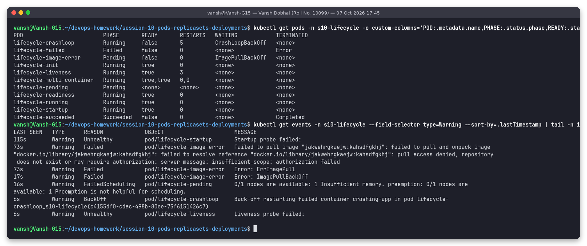

| Pod | Phase | Ready | Restarts | Reason | Lesson |
|-----|-------|-------|----------|--------|--------|
| lifecycle-running | Running | true | 0 | – | happy path |
| lifecycle-pending | Pending | – | – | FailedScheduling: Insufficient memory | requests must fit a node |
| lifecycle-succeeded | Succeeded | false | 0 | Completed (exit 0) | batch-style pod finished |
| lifecycle-failed | Failed | false | 0 | Error (exit 1) | `restartPolicy: Never` → terminal |
| lifecycle-crashloop | Running | false | 5 | CrashLoopBackOff | Always-restart + exponential back-off |
| lifecycle-image-error | Pending | false | 0 | ImagePullBackOff | image/tag/registry problem |
| lifecycle-readiness | Running | true | 0 | – | Ready only after probe passes |
| lifecycle-liveness | Running | true | 3 | liveness failed → exit 137 | probe failure ⇒ restart |
| lifecycle-startup | Running | true | 0 | – | startup probe protects slow boot |
| lifecycle-init | Running | true | 0 | init: Completed | init runs first |
| lifecycle-multi-container | Running | true,true | 0,0 | – | shared network namespace |

The Warning events in the same screenshot match each case: `FailedScheduling`, `Failed/ErrImagePull/ImagePullBackOff`, `BackOff`, `Unhealthy` (liveness and startup).

---

## Folder structure

```
session-10-pods-replicasets-deployments
├── README.md
├── scripts
│   ├── prepull.sh            # pre-pull images into minikube (stable probe timings)
│   ├── task1-strategies.sh   # snaps 01–12 (all four strategies)
│   ├── task2-lifecycle.sh    # snaps 20–33 (pod lifecycle + RS self-healing)
│   ├── watch-pods.sh         # timestamped `kubectl get pods -w --output-watch-events`
│   ├── curl-loop.sh          # N requests from curl-client, logs version per request
│   └── cleanup.sh            # delete the s10-* namespaces
├── task1-deployment-strategies
│   ├── common/curl-client.yaml
│   ├── 01-rolling-update/{deployment-v1,deployment-v2,service}.yaml
│   ├── 02-blue-green/{deployment-blue,deployment-green,service-blue,service-green}.yaml
│   ├── 03-canary/{deployment-stable,deployment-canary,service}.yaml
│   └── 04-recreate/{deployment-v1,deployment-v2,service}.yaml
├── task2-pod-lifecycle
│   ├── 01-running.yaml … 12-termination.yaml
│   └── 13-replicaset-self-healing.yaml
├── screenshots/   # 26 PNGs (real runs)
└── outputs/       # text of every screenshot + watch/curl logs
```

## How to reproduce

```bash
# inside WSL Ubuntu, minikube running
cd ~/devops-homework/session-10-pods-replicasets-deployments
bash scripts/prepull.sh          # optional
bash scripts/task1-strategies.sh # creates s10-rolling / s10-bluegreen / s10-canary / s10-recreate
bash scripts/task2-lifecycle.sh  # creates s10-lifecycle
bash scripts/cleanup.sh          # deletes all s10-* namespaces
```

Manual equivalent for any single item, e.g. `kubectl create ns s10-lifecycle && kubectl apply -n s10-lifecycle -f task2-pod-lifecycle/05-crashloopbackoff.yaml && kubectl get pods -n s10-lifecycle -w`.
