# Session 11 – Kubernetes Networking & Services

**Name:** Vansh Dobhal | **Roll No:** 10099

All work was done on a local **minikube** cluster (v1.37.0, single node, containerd runtime, docker driver inside WSL2 Ubuntu-24.04) in namespace **`s11`** (plus `s12` for the cross-namespace DNS tests).
Every screenshot below was produced by actually running the commands with the `snap` helper; the exact text of each run is in the matching `outputs/*.txt` file.

| Task | Where |
|---|---|
| Task 1: All 5 Service types | this README (folders `00-namespace` … `05-headless`) |
| Task 2: Object comparisons | [object-comparison/README.md](object-comparison/README.md) |
| Task 3: FQDN | [fqdn/README.md](fqdn/README.md) |
| Task 4: CoreDNS | [coredns/README.md](coredns/README.md) |

---

## Task 1: Deploy & demonstrate all 5 Service types

### Setup – namespace and test clients

`00-namespace/namespace.yaml` creates `s11`; `00-namespace/client-pods.yaml` creates two long-running test pods:

* `curl-client` (`curlimages/curl:8.5.0`) – to send HTTP requests from inside the cluster
* `dnsutils` (`registry.k8s.io/e2e-test-images/jessie-dnsutils:1.3`, the image the Kubernetes docs use for DNS debugging) – has `nslookup` and `dig`

Every nginx backend writes its own pod name into `index.html` at start-up, so each `curl` answer shows **which pod** served the request – that makes load balancing visible.

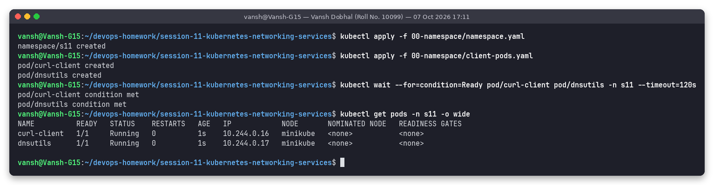

### Summary of what was built

| # | Type | Files | Backend | Port mapping | How it was tested |
|---|---|---|---|---|---|
| 1 | ClusterIP | `01-clusterip/` | Deployment, 3 nginx pods | svc `8080` → pod `80` | curl from `curl-client` by name, FQDN and IP |
| 2 | NodePort | `02-nodeport/` | Deployment, 2 nginx pods | `80` → `80`, nodePort `31111` | curl `$(minikube ip):31111` from WSL host |
| 3 | LoadBalancer | `03-loadbalancer/` | Deployment, 3 nginx pods | `8081` → `80` (nodePort auto) | `<pending>` → `minikube tunnel` → curl EXTERNAL-IP |
| 4 | ExternalName | `04-externalname/` | none (DNS CNAME to `example.com`) | – | `nslookup`/`dig` shows CNAME, curl through it |
| 5 | Headless | `05-headless/` | StatefulSet `web`, 3 pods | `clusterIP: None`, `80` | `nslookup` returns 3 pod IPs, `web-0.web-service-headless…` |

---

### 1. ClusterIP

**YAML** – [`01-clusterip/service.yaml`](01-clusterip/service.yaml)

```yaml
apiVersion: v1
kind: Service
metadata:
  name: web-service-clusterip
  namespace: s11
spec:
  type: ClusterIP
  selector:
    app: web-clusterip        # must match the pod template labels
  ports:
    - name: http
      port: 8080              # port exposed on the ClusterIP
      targetPort: 80          # containerPort on the pods
```

**Deploy and verify the Service (get svc, endpoints, endpointslices):**

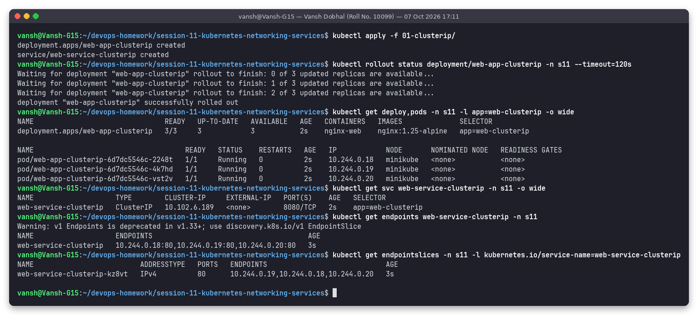

**describe:** the `Endpoints:` line lists the 3 pod IPs that match the selector.

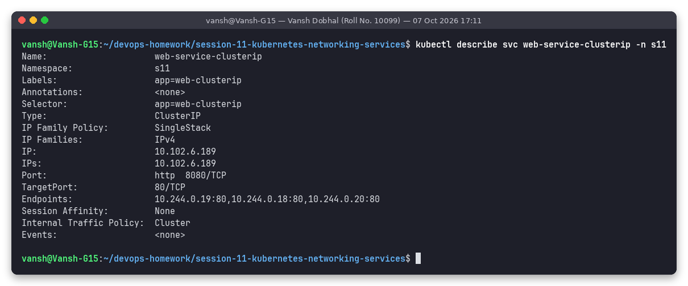

**Connectivity test:**

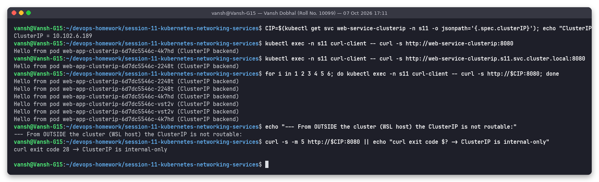

Observed (from `outputs/03-clusterip-test.txt`):

```text
ClusterIP = 10.102.6.189
Hello from pod web-app-clusterip-6d7dc5546c-2248t (ClusterIP backend)
Hello from pod web-app-clusterip-6d7dc5546c-4k7hd (ClusterIP backend)
Hello from pod web-app-clusterip-6d7dc5546c-vst2v (ClusterIP backend)
...
curl exit code 28 -> ClusterIP is internal-only
```

* The short name, the FQDN and the raw ClusterIP all work **from inside** the cluster, and the 6 requests were spread across all 3 pods.
* From the WSL host the same IP times out (exit 28): a ClusterIP is a virtual IP that only exists in the iptables rules of the cluster nodes.

---

### 2. NodePort

**YAML** – [`02-nodeport/service.yaml`](02-nodeport/service.yaml): `type: NodePort`, `port: 80`, `targetPort: 80`, `nodePort: 31111`.

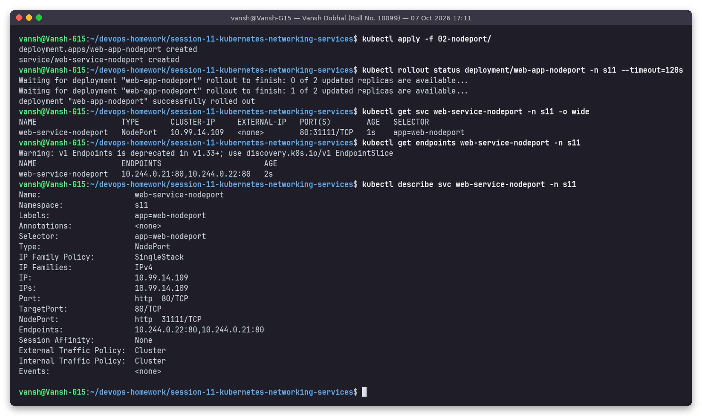

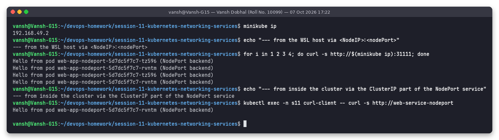

```text
$ minikube ip
192.168.49.2
$ for i in 1 2 3 4; do curl -s http://$(minikube ip):31111; done
Hello from pod web-app-nodeport-5d7dc5f7c7-rvntm (NodePort backend)
Hello from pod web-app-nodeport-5d7dc5f7c7-rvntm (NodePort backend)
Hello from pod web-app-nodeport-5d7dc5f7c7-rvntm (NodePort backend)
Hello from pod web-app-nodeport-5d7dc5f7c7-tz596 (NodePort backend)
```

A NodePort service **is also a ClusterIP service** (`10.99.14.109`, reachable as `http://web-service-nodeport` from inside), plus port 31111 opened on every node's IP. That is why the WSL host – which is outside the cluster but can reach the node IP 192.168.49.2 – gets an answer.

---

### 3. LoadBalancer

**YAML** – [`03-loadbalancer/service.yaml`](03-loadbalancer/service.yaml): `type: LoadBalancer`, `port: 8081` → `targetPort: 80`.

**Before the tunnel – `EXTERNAL-IP <pending>`.** minikube has no cloud controller manager, so nothing provisions a load balancer. The Service still gets a ClusterIP and an auto-assigned NodePort (31470) and the endpoints are already populated:

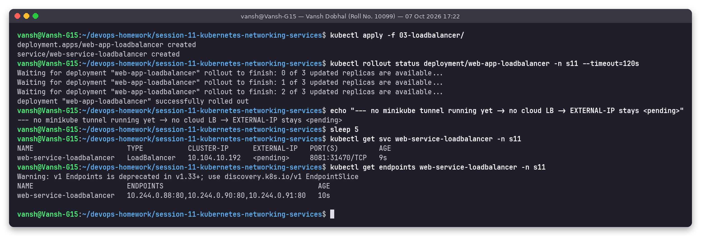

```text
NAME                       TYPE           CLUSTER-IP      EXTERNAL-IP   PORT(S)          AGE
web-service-loadbalancer   LoadBalancer   10.104.10.192   <pending>     8081:31470/TCP   9s
```

**With `minikube tunnel` running** (started in the background with `nohup minikube tunnel > /tmp/s11-tunnel.log 2>&1 &`; no sudo was needed because port 8081 > 1024). The tunnel plays the role of the cloud LB controller: it writes `status.loadBalancer.ingress` and, on the docker driver, opens an SSH port-forward from `127.0.0.1:8081` to the service:

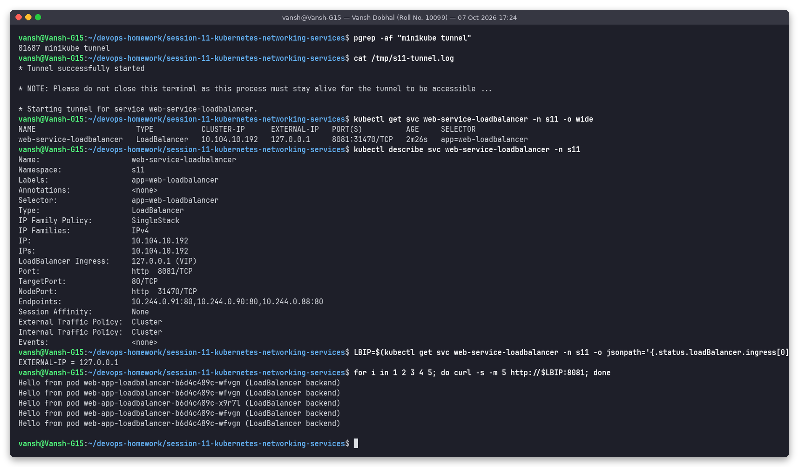

```text
web-service-loadbalancer   LoadBalancer   10.104.10.192   127.0.0.1     8081:31470/TCP   2m26s   app=web-loadbalancer
LoadBalancer Ingress:     127.0.0.1 (VIP)
EXTERNAL-IP = 127.0.0.1
Hello from pod web-app-loadbalancer-b6d4c489c-... (LoadBalancer backend)   (x5, spread over the 3 pods)
```

**After stopping the tunnel** (graceful SIGINT, like Ctrl+C) the external IP is withdrawn again and nothing listens on it any more:

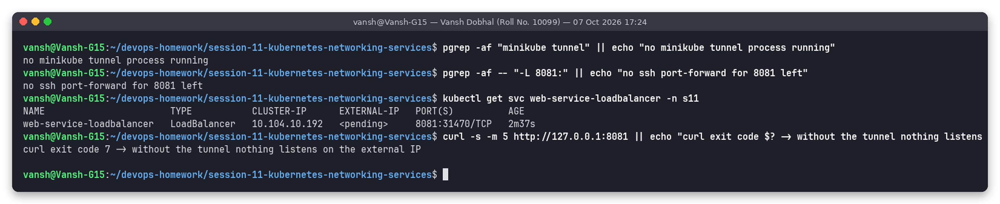

> Lesson learned while doing this: the first time I killed the tunnel with a plain `kill`, its child `ssh -L 8081:...` processes kept running and `127.0.0.1:8081` still answered. Stopping it with SIGINT lets minikube clean up properly (the status went back to `<pending>`), and the script also kills any leftover `ssh -L 8081:` forwarder. In a real cloud the EXTERNAL-IP would be a public IP / DNS name of an AWS NLB/ELB, Azure LB or GCP LB.

---

### 4. ExternalName

**YAML** – [`04-externalname/service.yaml`](04-externalname/service.yaml)

```yaml
spec:
  type: ExternalName
  externalName: example.com
```

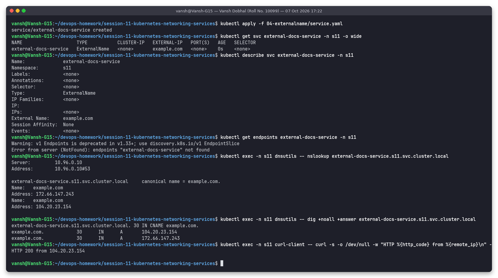

```text
external-docs-service   ExternalName   <none>       example.com   <none>    0s    <none>
Error from server (NotFound): endpoints "external-docs-service" not found

$ nslookup external-docs-service.s11.svc.cluster.local
external-docs-service.s11.svc.cluster.local	canonical name = example.com.
Name:	example.com
Address: 172.66.147.243
...
$ dig +noall +answer external-docs-service.s11.svc.cluster.local
external-docs-service.s11.svc.cluster.local. 30	IN CNAME example.com.
example.com.		30	IN	A	104.20.23.154
HTTP 200 from 104.20.23.154
```

* No ClusterIP, no selector, no Endpoints object at all – kube-proxy is not involved.
* CoreDNS answers the service name with a **CNAME** record pointing at `example.com`. Pods can use a cluster-internal name for an external dependency (e.g. a managed database) and only the Service has to change if the provider changes.
* The `curl` needed `-H "Host: example.com"` because HTTP virtual hosting looks at the Host header, which would otherwise be `external-docs-service`. (ExternalName is pure DNS – it does not rewrite HTTP headers or TLS SNI.)

---

### 5. Headless Service (+ StatefulSet)

**YAML** – [`05-headless/service.yaml`](05-headless/service.yaml) (`clusterIP: None`) and [`05-headless/app-statefulset.yaml`](05-headless/app-statefulset.yaml) (`serviceName: web-service-headless`, 3 replicas).

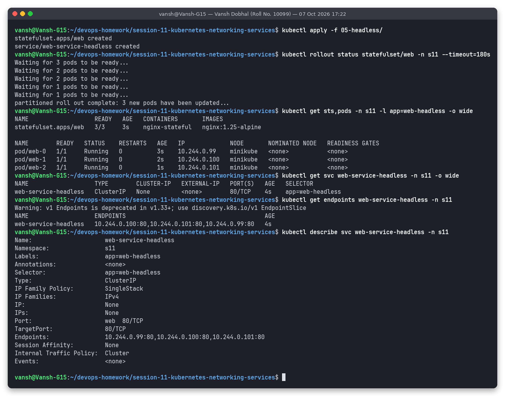

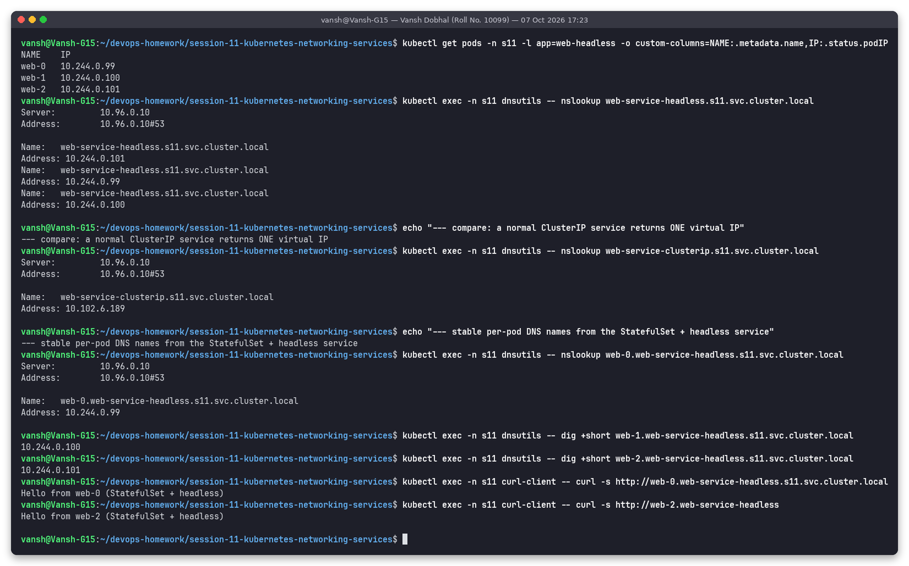

```text
NAME    IP
web-0   10.244.0.99
web-1   10.244.0.100
web-2   10.244.0.101
$ nslookup web-service-headless.s11.svc.cluster.local
Name:	web-service-headless.s11.svc.cluster.local   Address: 10.244.0.101
Name:	web-service-headless.s11.svc.cluster.local   Address: 10.244.0.99
Name:	web-service-headless.s11.svc.cluster.local   Address: 10.244.0.100
$ nslookup web-service-clusterip.s11.svc.cluster.local     (normal service, for comparison)
Address: 10.102.6.189
$ nslookup web-0.web-service-headless.s11.svc.cluster.local
Address: 10.244.0.99
$ curl -s http://web-0.web-service-headless.s11.svc.cluster.local
Hello from web-0 (StatefulSet + headless)
```

* A normal service resolves to **one virtual IP**; the headless service resolves to **all ready pod IPs** – the client (or a database driver) chooses the pod itself.
* Together with the StatefulSet each pod gets a stable name `<pod>.<service>.<namespace>.svc.cluster.local`, which is what clustered databases (MongoDB replica sets, Kafka, Cassandra, PostgreSQL Patroni…) use to address a specific member.

### All services side by side

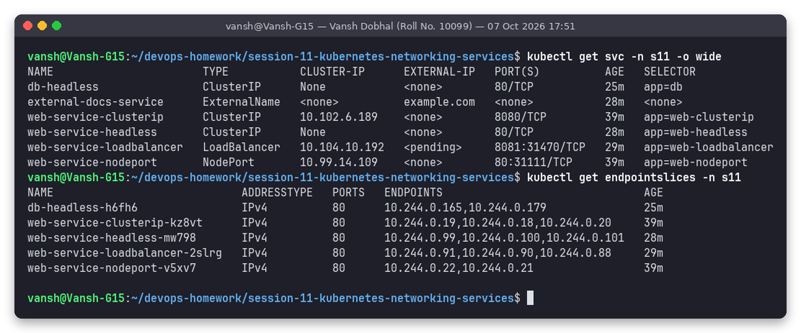

(Captured at the end, after the tunnel was stopped – so the LoadBalancer is back to `<pending>`. `db-headless` belongs to the StatefulSet storage demo of Task 2.)

### Comparison of the 5 types

| Type | ClusterIP? | Reachable from | DNS answer | Typical use |
|---|---|---|---|---|
| ClusterIP | yes | inside cluster only | A → virtual IP | internal microservice-to-microservice traffic |
| NodePort | yes | inside + `<NodeIP>:30000-32767` | A → virtual IP | quick external access, on-prem, behind an external LB |
| LoadBalancer | yes (+ NodePort) | inside + cloud LB external IP | A → virtual IP | exposing a service publicly in a cloud |
| ExternalName | no | – (just DNS) | CNAME → external host | alias for an external DB/API |
| Headless | no (`None`) | inside cluster | A → each pod IP (+ per-pod names) | StatefulSets, client-side load balancing, service discovery |

---

## Task 2: Object comparisons

Deployment vs ReplicaSet, Deployment vs DaemonSet vs StatefulSet and ReplicaSet vs Service – with real `ownerReferences`, rolling update, DaemonSet/StatefulSet demos and the kube-proxy iptables chain for a Service:
**[object-comparison/README.md](object-comparison/README.md)**

## Task 3: FQDN

What an FQDN is, Kubernetes service/pod DNS naming, SRV records, namespace-based resolution with real cross-namespace `nslookup`/`dig` output:
**[fqdn/README.md](fqdn/README.md)**

## Task 4: CoreDNS

What CoreDNS is, how a pod's query is resolved (`resolv.conf`, search domains, `ndots:5`), the real Corefile explained plugin by plugin, and a DNS troubleshooting checklist:
**[coredns/README.md](coredns/README.md)**

---

## Folder structure

```text
session-11-kubernetes-networking-services
├── README.md
├── 00-namespace/        namespace.yaml, client-pods.yaml
├── 01-clusterip/        app-deployment.yaml, service.yaml
├── 02-nodeport/         app-deployment.yaml, service.yaml
├── 03-loadbalancer/     app-deployment.yaml, service.yaml
├── 04-externalname/     service.yaml
├── 05-headless/         app-statefulset.yaml, service.yaml
├── object-comparison/   README.md, deployment.yaml, replicaset.yaml, daemonset.yaml,
│                        statefulset-with-storage.yaml, screenshots/, outputs/
├── fqdn/                README.md, cross-namespace-client.yaml, screenshots/, outputs/
├── coredns/             README.md, screenshots/, outputs/
├── scripts/             task1-services.sh, task2-objects.sh, task3-fqdn.sh, task4-coredns.sh, prepull.sh
├── screenshots/         00-… to 12-… (Task 1)
└── outputs/             text logs of every screenshot
```

## How to reproduce

```bash
# minikube running (docker driver), snap helper on PATH
cd ~/devops-homework/session-11-kubernetes-networking-services
bash scripts/prepull.sh          # optional: pull images into the node
bash scripts/task1-services.sh   # all 5 service types (starts + stops minikube tunnel)
bash scripts/task2-objects.sh    # Deployment/RS/DS/STS + kube-proxy evidence
bash scripts/task3-fqdn.sh       # FQDN / cross-namespace DNS
bash scripts/task4-coredns.sh    # CoreDNS
# clean up
kubectl delete ns s11 s12
```

Manual equivalents: `kubectl apply -f 01-clusterip/` etc., then the `kubectl exec … curl/nslookup` commands shown in the screenshots.

The namespaces `s11` and `s12` were deleted after the outputs were captured; the YAML files and the outputs stay in this folder.
