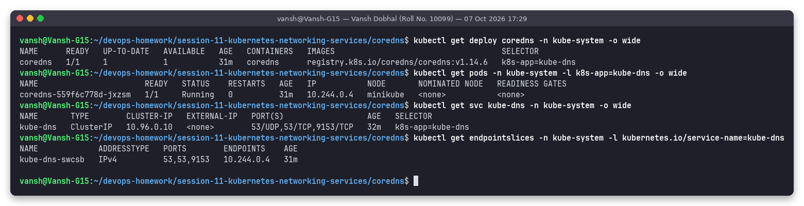
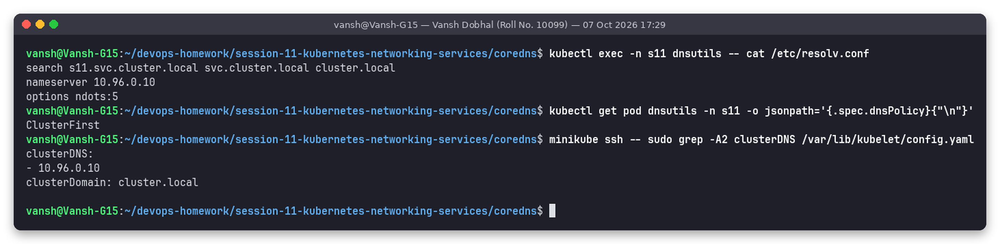
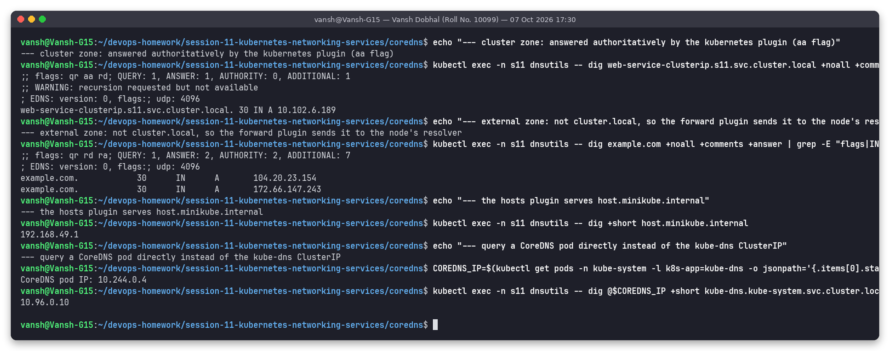
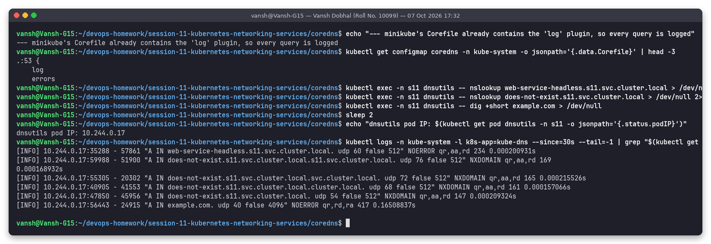
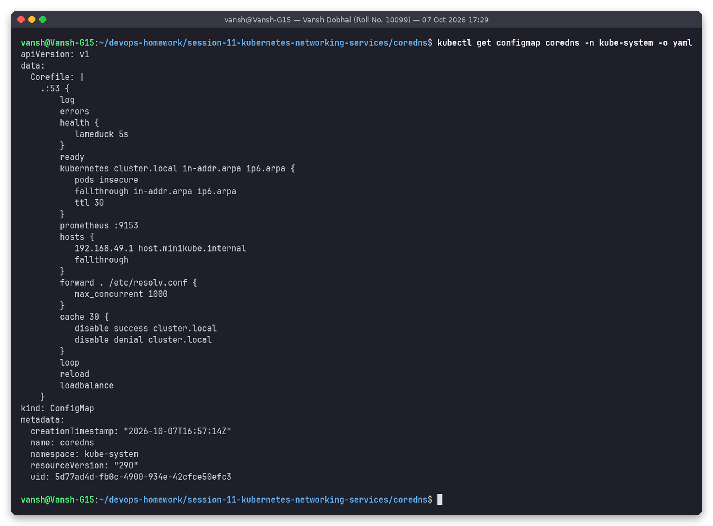
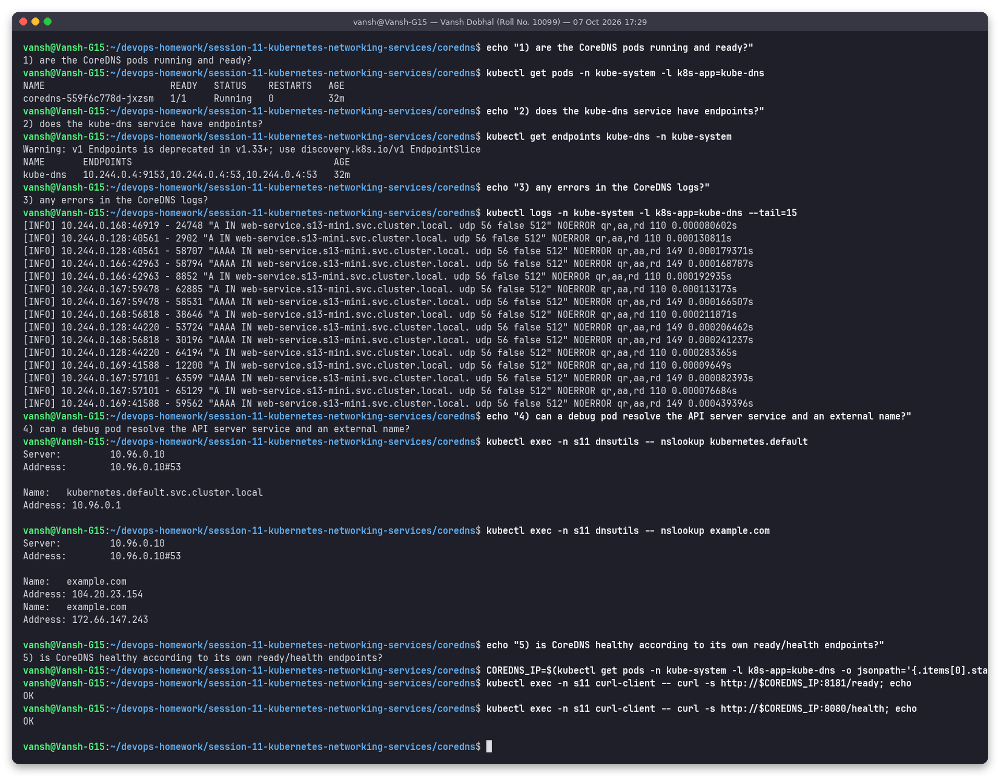
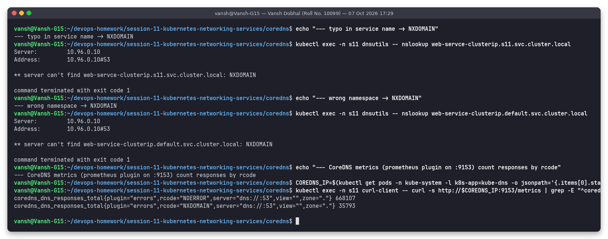

# Task 4: CoreDNS

**Name:** Vansh Dobhal | **Roll No:** 10099

Back to the [session README](../README.md). Script: [`../scripts/task4-coredns.sh`](../scripts/task4-coredns.sh). All outputs are from the shared minikube cluster (CoreDNS `v1.14.6`).

## What is CoreDNS?

CoreDNS is a DNS server written in Go (a CNCF graduated project) whose behaviour is built entirely from **plugins** chained together in a config file called the **Corefile**. Since Kubernetes 1.13 it is the default cluster DNS, replacing kube-dns (dnsmasq + skydns). For historical compatibility it still runs behind a Service named **`kube-dns`**, and its pods carry the label `k8s-app=kube-dns`.

## Why Kubernetes uses it

* **Service discovery** – pod and service IPs change all the time; apps need names. CoreDNS's `kubernetes` plugin watches Services, EndpointSlices and Pods through the API server and answers queries from that in-memory view, so a new Service is resolvable within seconds without any manual DNS change.
* **One resolver for everything** – cluster names are answered locally, everything else (`example.com`, `github.com`) is forwarded upstream and cached.
* **Pluggable and small** – single static binary, low memory, health/readiness/metrics endpoints built in, config reloads without restart.

## CoreDNS in this cluster



```text
deployment coredns   1/1   registry.k8s.io/coredns/coredns:v1.14.6   selector k8s-app=kube-dns
coredns-559f6c778d-jxzsm   1/1   Running   10.244.0.4   minikube
kube-dns   ClusterIP   10.96.0.10   53/UDP,53/TCP,9153/TCP
kube-dns-swcsb   IPv4   53,53,9153   10.244.0.4
```

So: a normal **Deployment** (1 replica on minikube, 2 on most clusters) + a **ClusterIP Service** with the well-known IP `10.96.0.10` + a ConfigMap `coredns` holding the Corefile.

## Service discovery – how a pod knows where DNS is



```text
$ kubectl exec -n s11 dnsutils -- cat /etc/resolv.conf
search s11.svc.cluster.local svc.cluster.local cluster.local
nameserver 10.96.0.10
options ndots:5
$ kubectl get pod dnsutils -o jsonpath='{.spec.dnsPolicy}'
ClusterFirst
$ minikube ssh -- sudo grep -A2 clusterDNS /var/lib/kubelet/config.yaml
clusterDNS:
- 10.96.0.10
clusterDomain: cluster.local
```

The **kubelet** writes this `resolv.conf` into every pod with `dnsPolicy: ClusterFirst` (the default), using its `clusterDNS` and `clusterDomain` settings:

| Line | Meaning |
|---|---|
| `nameserver 10.96.0.10` | the ClusterIP of the `kube-dns` Service → kube-proxy load-balances to the CoreDNS pods |
| `search s11.svc.cluster.local svc.cluster.local cluster.local` | suffixes tried for "short" names; first one is the pod's own namespace, so `web-service-clusterip` works inside `s11` |
| `options ndots:5` | a name with **fewer than 5 dots** is treated as relative → tried with each search suffix first, then as-is. `web-service-clusterip.s11.svc.cluster.local` has 4 dots, so even it gets search-expanded first unless written with a trailing dot |

## How a DNS query is resolved (step by step)

1. App in pod calls `getaddrinfo("web-service-clusterip")`.
2. libc reads `/etc/resolv.conf`; 0 dots < 5 → first candidate `web-service-clusterip.s11.svc.cluster.local`.
3. UDP packet to `10.96.0.10:53` → iptables (kube-proxy) DNAT → CoreDNS pod `10.244.0.4:53`.
4. CoreDNS matches the server block `.:53` and runs the plugin chain. The name is inside `cluster.local`, so the **kubernetes** plugin answers authoritatively from its API cache (`aa` flag).
5. A name outside the cluster zone (e.g. `example.com`) falls through to the **forward** plugin → upstream resolver from the node's `/etc/resolv.conf` → result stored by **cache**.

Real evidence:



```text
--- cluster zone: answered authoritatively by the kubernetes plugin (aa flag)
;; flags: qr aa rd; QUERY: 1, ANSWER: 1
web-service-clusterip.s11.svc.cluster.local. 30	IN A 10.102.6.189
--- external zone: not cluster.local, so the forward plugin sends it to the node's resolver
example.com.		15	IN	A	104.20.23.154
--- the hosts plugin serves host.minikube.internal
192.168.49.1
--- query a CoreDNS pod directly instead of the kube-dns ClusterIP
kube-dns.kube-system.svc.cluster.local -> 10.96.0.10
```

And the CoreDNS query log for my own queries (minikube already enables the `log` plugin, so I did not have to edit the shared ConfigMap):



```text
[INFO] 10.244.0.17:35288 "A IN web-service-headless.s11.svc.cluster.local. udp 60 false 512" NOERROR qr,aa,rd 234 0.000200931s
[INFO] 10.244.0.17:59988 "A IN does-not-exist.s11.svc.cluster.local.s11.svc.cluster.local. ..." NXDOMAIN qr,aa,rd
[INFO] 10.244.0.17:55305 "A IN does-not-exist.s11.svc.cluster.local.svc.cluster.local. ..."     NXDOMAIN qr,aa,rd
[INFO] 10.244.0.17:40905 "A IN does-not-exist.s11.svc.cluster.local.cluster.local. ..."         NXDOMAIN qr,aa,rd
[INFO] 10.244.0.17:47850 "A IN does-not-exist.s11.svc.cluster.local. ..."                       NXDOMAIN qr,aa,rd
[INFO] 10.244.0.17:56443 "A IN example.com. udp 40 false 4096" NOERROR qr,rd,ra 417 0.16508837s
```

This log shows three things nicely: the **ndots:5 search expansion** (a 4-dot name was tried with all 3 suffixes before the literal name), the cluster answers are authoritative (`aa`) and answered in ~0.2 ms, while `example.com` had no `aa`, had `ra` (recursion available) and took **165 ms** because it was forwarded upstream.

## CoreDNS configuration – the real Corefile



```text
.:53 {
    log
    errors
    health {
       lameduck 5s
    }
    ready
    kubernetes cluster.local in-addr.arpa ip6.arpa {
       pods insecure
       fallthrough in-addr.arpa ip6.arpa
       ttl 30
    }
    prometheus :9153
    hosts {
       192.168.49.1 host.minikube.internal
       fallthrough
    }
    forward . /etc/resolv.conf {
       max_concurrent 1000
    }
    cache 30 {
       disable success cluster.local
       disable denial cluster.local
    }
    loop
    reload
    loadbalance
}
```

Plugin by plugin:

| Plugin | What it does here |
|---|---|
| `.:53 { … }` | one server block: serve **all zones** (`.`) on port 53 (UDP + TCP) |
| `log` | logs every query (client, type, name, rcode, flags, duration) to stdout – minikube adds it; upstream default Corefile does not |
| `errors` | logs errors that occur while answering |
| `health { lameduck 5s }` | `http://:8080/health` liveness endpoint; on shutdown keeps answering "OK" 5 s more so in-flight queries finish |
| `ready` | `http://:8181/ready` readiness endpoint – returns OK when all plugins (e.g. the kubernetes API sync) are ready; used by the pod's readinessProbe |
| `kubernetes cluster.local in-addr.arpa ip6.arpa` | authoritative for the cluster domain and reverse zones; builds Service/Pod/EndpointSlice records from the API |
| `  pods insecure` | answer `a-b-c-d.<ns>.pod.cluster.local` for any IP without checking that such a pod exists (kube-dns compatible) |
| `  fallthrough in-addr.arpa ip6.arpa` | if a reverse lookup is not a cluster IP, pass it to the next plugin instead of NXDOMAIN |
| `  ttl 30` | TTL of the generated records (the `30` seen in every `dig` answer) |
| `prometheus :9153` | metrics endpoint (`coredns_dns_requests_total`, `coredns_dns_responses_total{rcode=...}`, cache hits…) – also exposed on the kube-dns Service port 9153 |
| `hosts { 192.168.49.1 host.minikube.internal; fallthrough }` | static hosts-file entries; minikube injects the host gateway name; others fall through |
| `forward . /etc/resolv.conf` | everything not answered above goes to the upstream servers from the CoreDNS pod's resolv.conf (the node's resolver); `max_concurrent 1000` caps parallel upstream queries |
| `cache 30` | cache answers up to 30 s; `disable success/denial cluster.local` – minikube disables caching of cluster answers so new Services resolve immediately |
| `loop` | detects forwarding loops (e.g. upstream pointing back to CoreDNS) and stops the process instead of spinning at 100 % CPU |
| `reload` | re-reads the Corefile when the ConfigMap changes (~30 s–2 min) – no pod restart needed |
| `loadbalance` | round-robins the order of A/AAAA records in answers (e.g. the 3 headless pod IPs) |

Common customisations: a stub domain (`corp.example:53 { forward . 10.0.0.53 }`), custom upstreams (`forward . 8.8.8.8 1.1.1.1`), or `rewrite` rules. On managed clusters this is usually done through a separate `coredns-custom` ConfigMap.

## Troubleshooting DNS

Checklist I ran (all healthy in this cluster):



| # | Check | Command | Healthy result here |
|---|---|---|---|
| 1 | CoreDNS pods Running/Ready? | `kubectl get pods -n kube-system -l k8s-app=kube-dns` | `1/1 Running` |
| 2 | kube-dns Service has endpoints? | `kubectl get endpoints kube-dns -n kube-system` | `10.244.0.4:53,…:9153` – empty would mean pods not Ready |
| 3 | Errors in logs? | `kubectl logs -n kube-system -l k8s-app=kube-dns` | only `[INFO]` query lines (other students' namespaces too), no `[ERROR]`/timeouts |
| 4 | Can a debug pod resolve internal + external names? | `kubectl exec dnsutils -- nslookup kubernetes.default` / `nslookup example.com` | `10.96.0.1` / public IPs |
| 5 | CoreDNS own health? | `curl http://<coredns-pod>:8181/ready` and `:8080/health` | `OK` / `OK` |
| 6 | Pod's resolv.conf correct? | `kubectl exec <pod> -- cat /etc/resolv.conf` | nameserver `10.96.0.10`, correct search list |

Typical failure signatures:



```text
--- typo in service name -> NXDOMAIN
** server can't find web-servce-clusterip.s11.svc.cluster.local: NXDOMAIN
--- wrong namespace -> NXDOMAIN
** server can't find web-service-clusterip.default.svc.cluster.local: NXDOMAIN
coredns_dns_responses_total{plugin="errors",rcode="NOERROR",...} 668107
coredns_dns_responses_total{plugin="errors",rcode="NXDOMAIN",...} 35793
```

How to read symptoms:

| Symptom | Likely cause | Next step |
|---|---|---|
| `NXDOMAIN` for a service | typo, wrong namespace, service not created | `kubectl get svc -A` and look for the name; use `<svc>.<ns>` |
| `connection timed out; no servers could be reached` | CoreDNS pods down, kube-dns has no endpoints, NetworkPolicy blocks UDP/TCP 53, kube-proxy broken | checks 1, 2, `kubectl get netpol -A` |
| internal names OK, external fail | upstream (`forward`) unreachable, node DNS broken | CoreDNS logs `[ERROR] plugin/errors … i/o timeout`; check node `/etc/resolv.conf` |
| CoreDNS in `CrashLoopBackOff` with `Loop … detected` | upstream points back to CoreDNS (e.g. systemd-resolved `127.0.0.53`) | point `forward` to a real upstream / kubelet `resolvConf` |
| slow external lookups | `ndots:5` search expansion (4 queries per name) | trailing dot or `dnsConfig.options ndots: 2` in the pod spec |

To get query logs on a cluster where the `log` plugin is not enabled: `kubectl -n kube-system edit configmap coredns`, add `log` under `.:53 {`, wait for the `reload` plugin (no restart needed) and watch `kubectl logs -n kube-system -l k8s-app=kube-dns -f`. I did **not** edit the ConfigMap here because the cluster is shared with other workloads and `log` was already enabled by minikube.
