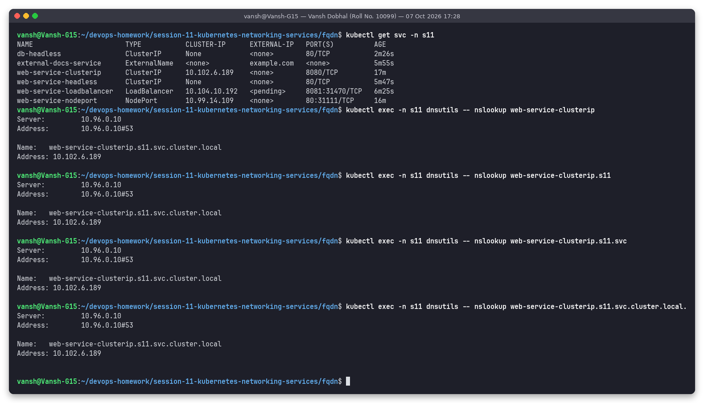
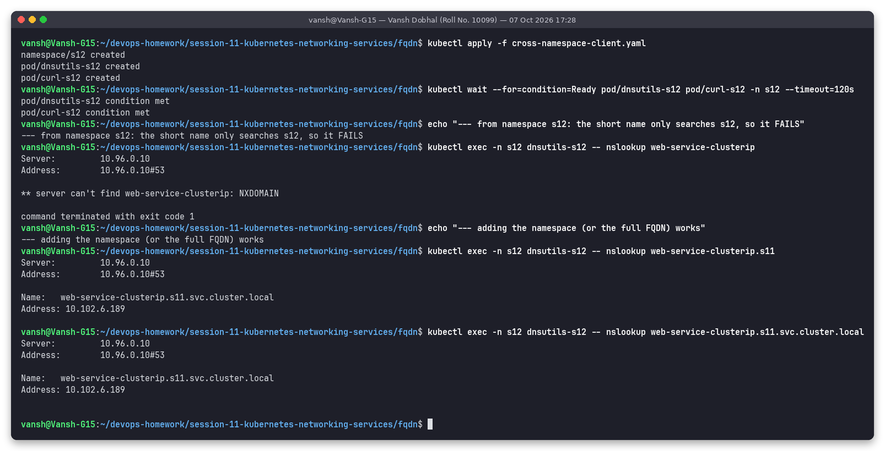
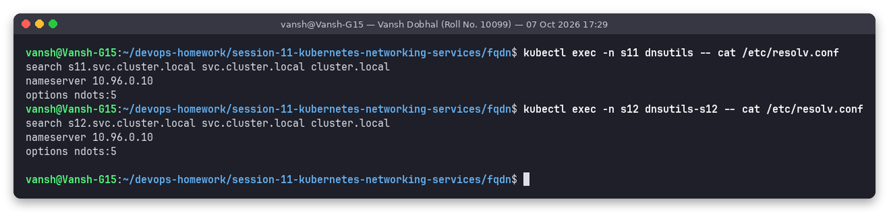
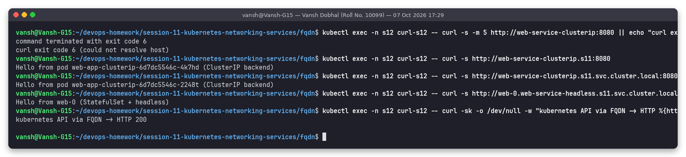
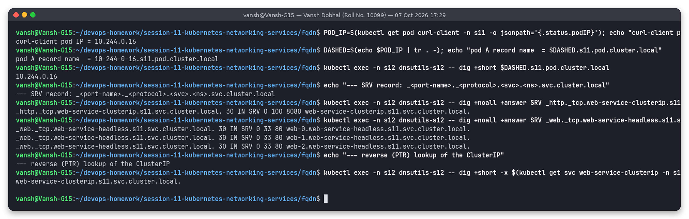
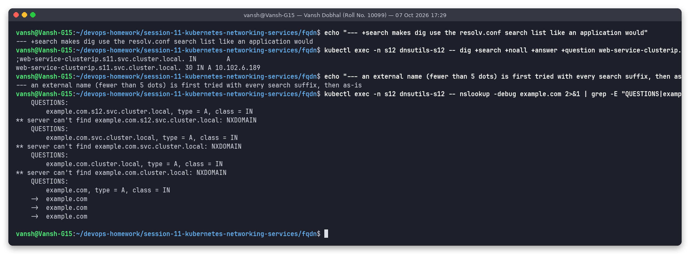

# Task 3: FQDN in Kubernetes

**Name:** Vansh Dobhal | **Roll No:** 10099

Back to the [session README](../README.md). Script: [`../scripts/task3-fqdn.sh`](../scripts/task3-fqdn.sh). The services queried are the ones from Task 1 in namespace `s11`; a second set of client pods ([`cross-namespace-client.yaml`](cross-namespace-client.yaml)) runs in namespace `s12`.

## What is an FQDN?

A **Fully Qualified Domain Name** is the complete, unambiguous name of a host in the DNS tree, from the host label up to the root: `www.example.com.` – the trailing dot is the root zone. A *partially* qualified name such as `web-service-clusterip` only makes sense relative to a search domain, the same way a file name only makes sense relative to the current directory. Resolvers decide whether a name is "absolute" by the trailing dot or by the `ndots` rule (see CoreDNS task).

## Kubernetes service DNS

Every Service gets DNS records automatically from CoreDNS (the `kubernetes` plugin watches the API). The cluster domain is `cluster.local` (set in kubelet's `clusterDomain`).

### Naming convention

| Object | Record | Name format | Example from this cluster |
|---|---|---|---|
| ClusterIP / NodePort / LB Service | A | `<svc>.<ns>.svc.cluster.local` | `web-service-clusterip.s11.svc.cluster.local → 10.102.6.189` |
| Headless Service | A (one per ready pod) | `<svc>.<ns>.svc.cluster.local` | `web-service-headless.s11.svc.cluster.local → 10.244.0.99/100/101` |
| StatefulSet pod behind headless svc | A | `<pod>.<svc>.<ns>.svc.cluster.local` | `web-0.web-service-headless.s11.svc.cluster.local → 10.244.0.99` |
| Any pod | A | `<pod-ip-with-dashes>.<ns>.pod.cluster.local` | `10-244-0-16.s11.pod.cluster.local → 10.244.0.16` |
| Named service port | SRV | `_<port-name>._<proto>.<svc>.<ns>.svc.cluster.local` | `_http._tcp.web-service-clusterip.s11.svc.cluster.local → 0 100 8080 web-service-clusterip...` |
| ExternalName Service | CNAME | `<svc>.<ns>.svc.cluster.local` | `external-docs-service.s11.svc.cluster.local → example.com.` |
| ClusterIP reverse | PTR | `<reversed-ip>.in-addr.arpa` | `10.102.6.189 → web-service-clusterip.s11.svc.cluster.local.` |

## Same-namespace lookups – all forms resolve



From a pod in `s11`, `web-service-clusterip`, `web-service-clusterip.s11`, `web-service-clusterip.s11.svc` and the full `web-service-clusterip.s11.svc.cluster.local.` all return `10.102.6.189`. The short forms work because the resolver appends the search domains from `/etc/resolv.conf`.

## Namespace-based DNS – lookups from another namespace



```text
--- from namespace s12: the short name only searches s12, so it FAILS
$ kubectl exec -n s12 dnsutils-s12 -- nslookup web-service-clusterip
** server can't find web-service-clusterip: NXDOMAIN
--- adding the namespace (or the full FQDN) works
$ kubectl exec -n s12 dnsutils-s12 -- nslookup web-service-clusterip.s11
Name:	web-service-clusterip.s11.svc.cluster.local
Address: 10.102.6.189
```

The reason is the per-namespace search list – the first search domain is always the pod's own namespace:



```text
# pod in s11                                      # pod in s12
search s11.svc.cluster.local svc.cluster.local    search s12.svc.cluster.local svc.cluster.local
       cluster.local                                     cluster.local
nameserver 10.96.0.10                             nameserver 10.96.0.10
options ndots:5                                   options ndots:5
```

From `s12`, `web-service-clusterip` expands to `web-service-clusterip.s12.svc.cluster.local` (does not exist), then `...svc.cluster.local` and `...cluster.local` (not valid service names) → NXDOMAIN. `web-service-clusterip.s11` expands via the second search domain to `web-service-clusterip.s11.svc.cluster.local` → found.

Namespaces are therefore a DNS scope: two teams can both have a service called `api` in different namespaces without conflict, and a short name always means "the one in my namespace".

## Pod-to-service communication across namespaces



```text
$ kubectl exec -n s12 curl-s12 -- curl -s -m 5 http://web-service-clusterip:8080
curl exit code 6 (could not resolve host)
$ kubectl exec -n s12 curl-s12 -- curl -s http://web-service-clusterip.s11:8080
Hello from pod web-app-clusterip-6d7dc5546c-4k7hd (ClusterIP backend)
$ kubectl exec -n s12 curl-s12 -- curl -s http://web-service-clusterip.s11.svc.cluster.local:8080
Hello from pod web-app-clusterip-6d7dc5546c-2248t (ClusterIP backend)
$ kubectl exec -n s12 curl-s12 -- curl -s http://web-0.web-service-headless.s11.svc.cluster.local
Hello from web-0 (StatefulSet + headless)
kubernetes API via FQDN -> HTTP 200      (https://kubernetes.default.svc.cluster.local/version)
```

Without a NetworkPolicy, Kubernetes networking is flat: any pod can reach any service in any namespace – DNS naming is the only thing that changes.

**Best practice:** in application config use `<svc>.<ns>` or the full FQDN for cross-namespace dependencies (e.g. `DB_HOST=postgres.data.svc.cluster.local`), and the short name only inside the same namespace. A trailing dot (`...cluster.local.`) skips the search list completely and saves extra queries.

## Pod A records, SRV and PTR records



```text
pod A record name  = 10-244-0-16.s11.pod.cluster.local
10.244.0.16
_http._tcp.web-service-clusterip.s11.svc.cluster.local. 30 IN SRV 0 100 8080 web-service-clusterip.s11.svc.cluster.local.
_web._tcp.web-service-headless.s11.svc.cluster.local. 30 IN SRV 0 33 80 web-0.web-service-headless.s11.svc.cluster.local.
_web._tcp.web-service-headless.s11.svc.cluster.local. 30 IN SRV 0 33 80 web-1.web-service-headless.s11.svc.cluster.local.
_web._tcp.web-service-headless.s11.svc.cluster.local. 30 IN SRV 0 33 80 web-2.web-service-headless.s11.svc.cluster.local.
web-service-clusterip.s11.svc.cluster.local.        (PTR for 10.102.6.189)
```

* Pod A records (`pods insecure` in the Corefile) just echo the dashed IP back – useful for TLS certificates for pods, not for discovery.
* SRV records publish the **port number**: `_http._tcp` comes from the port *name* `http` in the Service. For the headless service there is one SRV target per pod (weight 33 each) – this is how e.g. Cassandra or etcd clients discover all members and their ports.

## Search list and ndots in action



```text
;web-service-clusterip.s11.svc.cluster.local. IN A          <- dig +search expanded "web-service-clusterip.s11"
	example.com.s12.svc.cluster.local, type = A   -> NXDOMAIN
	example.com.svc.cluster.local, type = A       -> NXDOMAIN
	example.com.cluster.local, type = A           -> NXDOMAIN
	example.com, type = A                         -> answer
```

`example.com` has only 1 dot (< `ndots:5`), so the resolver first tries all three search suffixes before the absolute name – 4 queries instead of 1. Using `example.com.` (with trailing dot) in latency-sensitive apps avoids that.

## Examples summary

| From a pod in | Name used | Result |
|---|---|---|
| `s11` | `web-service-clusterip` | OK - 10.102.6.189 |
| `s12` | `web-service-clusterip` | FAIL - NXDOMAIN (searched in s12) |
| `s12` | `web-service-clusterip.s11` | OK - 10.102.6.189 |
| `s12` | `web-service-clusterip.s11.svc.cluster.local` | OK - 10.102.6.189 |
| `s12` | `web-0.web-service-headless.s11.svc.cluster.local` | OK - pod IP of web-0 |
| any | `kubernetes.default.svc.cluster.local` | OK - API server (HTTP 200 on /version) |
