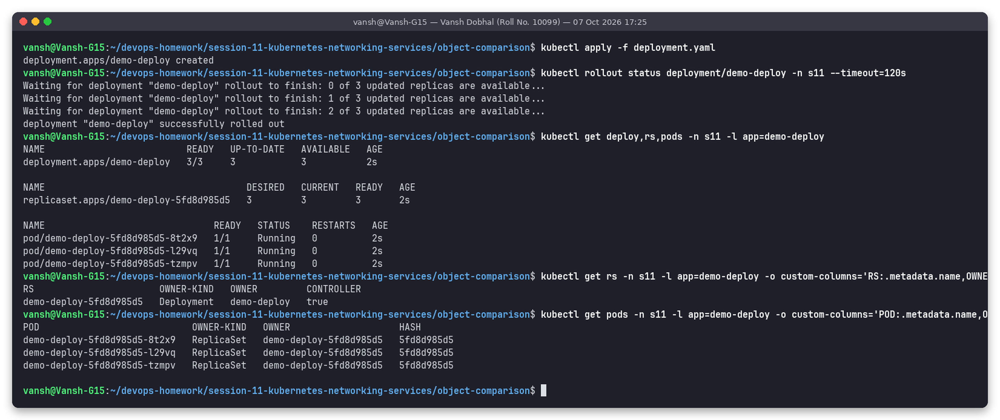
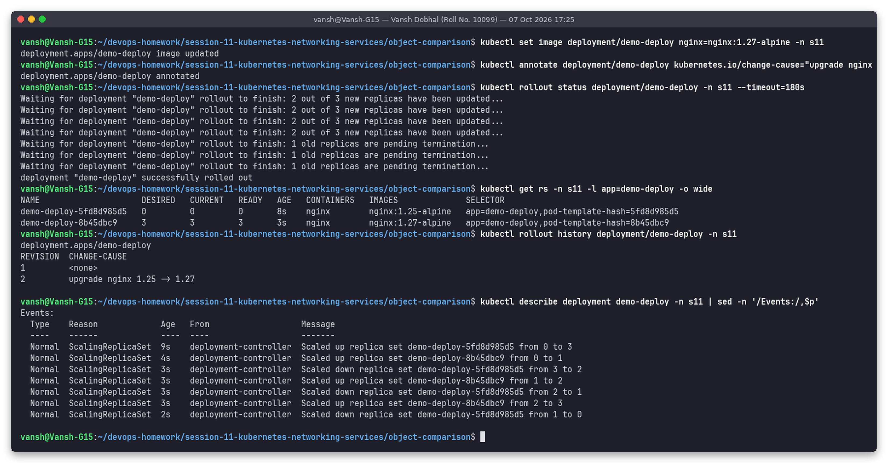
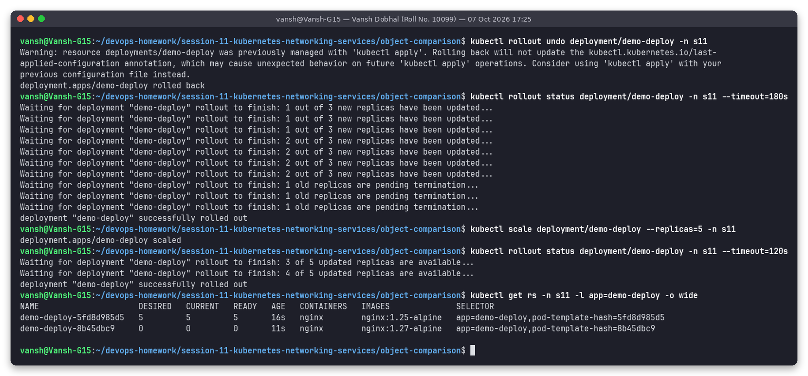
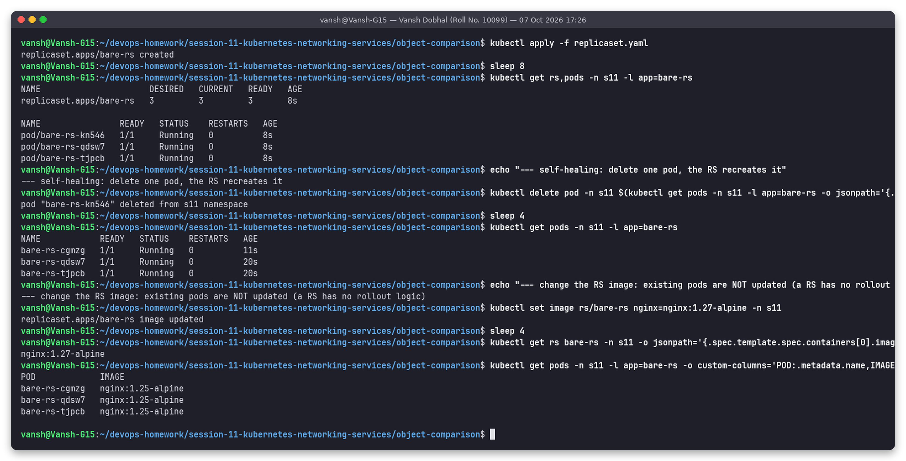
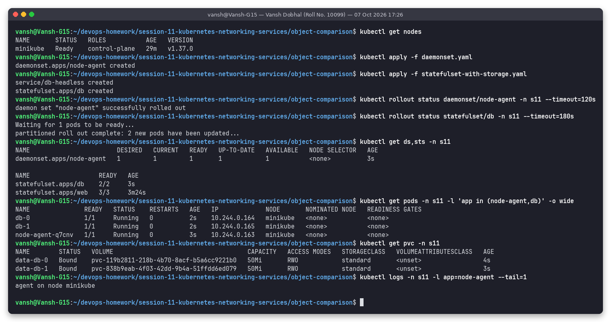
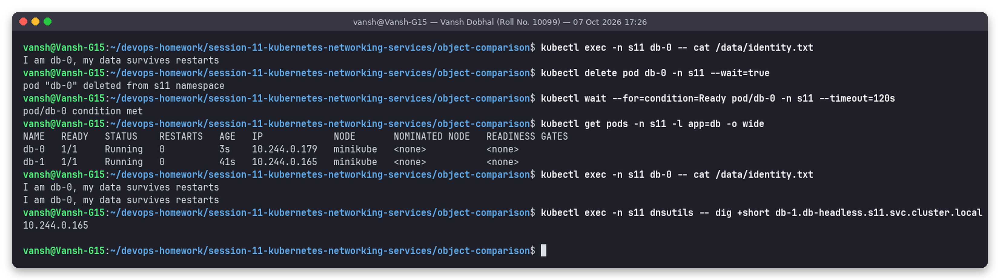
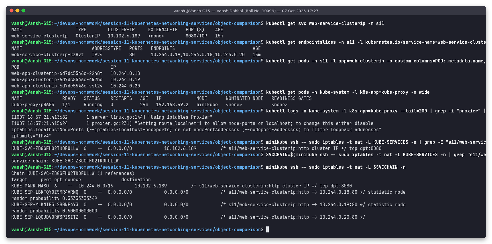

# Task 2: Kubernetes Object Comparisons

**Name:** Vansh Dobhal | **Roll No:** 10099

Back to the [session README](../README.md). Everything below was run in namespace `s11` on minikube; the manifests are in this folder and the scripts in [`../scripts/task2-objects.sh`](../scripts/task2-objects.sh).

| File | Purpose |
|---|---|
| `deployment.yaml` | Deployment `demo-deploy` (3 replicas, RollingUpdate maxSurge 1 / maxUnavailable 0) |
| `replicaset.yaml` | a bare ReplicaSet `bare-rs` created directly (no Deployment) |
| `daemonset.yaml` | DaemonSet `node-agent` (busybox, prints the node name) |
| `statefulset-with-storage.yaml` | headless svc `db-headless` + StatefulSet `db` with `volumeClaimTemplates` |

---

## 1. Deployment vs ReplicaSet

### Real relationship – ownerReferences



```text
RS                       OWNER-KIND   OWNER         CONTROLLER
demo-deploy-5fd8d985d5   Deployment   demo-deploy   true

POD                            OWNER-KIND   OWNER                    HASH
demo-deploy-5fd8d985d5-8t2x9   ReplicaSet   demo-deploy-5fd8d985d5   5fd8d985d5
demo-deploy-5fd8d985d5-l29vq   ReplicaSet   demo-deploy-5fd8d985d5   5fd8d985d5
demo-deploy-5fd8d985d5-tzmpv   ReplicaSet   demo-deploy-5fd8d985d5   5fd8d985d5
```

The chain is **Deployment → ReplicaSet → Pods**. Each object's `metadata.ownerReferences` points to its parent (with `controller: true`), which is also what garbage collection uses: deleting the Deployment cascades to the RS and pods. The suffix `5fd8d985d5` is the `pod-template-hash` – a hash of the pod template – which is added to the RS selector so ReplicaSets of different revisions never fight over the same pods.

### Rolling update = a new ReplicaSet



```text
NAME                     DESIRED   CURRENT   READY   IMAGES
demo-deploy-5fd8d985d5   0         0         0       nginx:1.25-alpine
demo-deploy-8b45dbc9     3         3         3       nginx:1.27-alpine

Scaled up replica set demo-deploy-8b45dbc9 from 0 to 1
Scaled down replica set demo-deploy-5fd8d985d5 from 3 to 2
Scaled up replica set demo-deploy-8b45dbc9 from 1 to 2
...
Scaled down replica set demo-deploy-5fd8d985d5 from 1 to 0
```

`kubectl set image` changed the pod template, so the Deployment controller created a **second ReplicaSet** and shifted replicas one at a time (maxSurge 1, maxUnavailable 0 → never fewer than 3 ready pods). The old RS is kept at 0 replicas as history.

### Rollback and scaling



`kubectl rollout undo` simply scaled the **old** RS (`5fd8d985d5`, nginx 1.25) back up and the new one to 0; `kubectl scale --replicas=5` changed only the active RS's `DESIRED`.

### A bare ReplicaSet cannot roll out



```text
--- self-healing: delete one pod, the RS recreates it
bare-rs-cgmzg   1/1   Running   0   11s      <- new pod
--- change the RS image: existing pods are NOT updated
nginx:1.27-alpine                             <- RS template
bare-rs-cgmzg   nginx:1.25-alpine             <- pods still old
bare-rs-qdsw7   nginx:1.25-alpine
bare-rs-tjpcb   nginx:1.25-alpine
```

A ReplicaSet only counts pods matching its selector; when the template changes it does nothing to running pods (only *new* pods would get the new image). That missing logic is exactly what a Deployment adds.

### Comparison table

| Aspect | ReplicaSet | Deployment |
|---|---|---|
| **Purpose** | keep N identical pods running (self-healing, replica count) | declarative application releases on top of ReplicaSets |
| **Pod management** | creates/deletes pods directly to match `replicas` and the selector | never touches pods directly – manages ReplicaSets which manage pods |
| **Scaling** | `kubectl scale rs` – changes the count | `kubectl scale deploy` – the Deployment changes the active RS's count (also HPA target) |
| **Rolling updates** | none – template changes don't affect existing pods | RollingUpdate / Recreate strategies, `maxSurge`/`maxUnavailable`, pause/resume |
| **Rollback / history** | none | `rollout history`, `rollout undo` (old RSs kept, `revisionHistoryLimit`) |
| **Relationship** | owned by a Deployment (`ownerReferences`), owns pods | owns one RS per template revision |
| **When to use** | almost never directly | default for stateless apps |

---

## 2. Deployment vs DaemonSet vs StatefulSet



```text
daemonset.apps/node-agent   DESIRED 1  CURRENT 1  READY 1        <- 1 node => 1 pod
statefulset.apps/db         2/2
db-0               1/1   Running   10.244.0.164   minikube
db-1               1/1   Running   10.244.0.165   minikube
node-agent-q7cnv   1/1   Running   10.244.0.163   minikube
data-db-0   Bound   pvc-119b2811-...   50Mi   RWO   standard
data-db-1   Bound   pvc-838b9eab-...   50Mi   RWO   standard
agent on node minikube
```

**Stable identity + stable storage of a StatefulSet pod:**



```text
$ kubectl exec db-0 -- cat /data/identity.txt
I am db-0, my data survives restarts
$ kubectl delete pod db-0           # pod is recreated...
db-0   1/1   Running   0   3s   10.244.0.179     # same NAME, new IP
$ kubectl exec db-0 -- cat /data/identity.txt
I am db-0, my data survives restarts
I am db-0, my data survives restarts             # same PVC re-attached: line from the first life is still there
```

The recreated pod kept the name `db-0`, got its **own** PVC `data-db-0` back (the file now has two lines), and stays reachable as `db-0.db-headless.s11.svc.cluster.local`. A Deployment pod would come back with a random name and no data.

### Comparison table

| Aspect | Deployment | DaemonSet | StatefulSet |
|---|---|---|---|
| **Use case** | stateless apps: web, APIs, workers | one agent per node: log shippers (Fluent Bit), monitoring (node-exporter), CNI (Calico), kube-proxy | stateful apps needing identity/storage: databases, Kafka, ZooKeeper, Elasticsearch |
| **Pod creation** | all at once (in parallel) via a ReplicaSet, random names `name-<hash>-<rand>` | one pod per eligible node, automatically added when a node joins | ordered `web-0`, `web-1`, `web-2`; next starts only when the previous is Ready; deleted in reverse |
| **Scaling** | `replicas` (manual or HPA) | not by replicas – follows the number of nodes (nodeSelector / tolerations limit it) | `replicas`, ordered up/down; highest ordinal removed first |
| **Pod identity** | interchangeable | tied to a node | sticky ordinal + hostname, kept across reschedule |
| **Networking** | normal ClusterIP Service in front, pods anonymous | often `hostNetwork`/hostPort, or accessed per node | requires a **headless** Service (`serviceName`) → per-pod DNS `pod-N.svc.ns.svc.cluster.local` |
| **Storage** | usually none, or one shared PVC (all replicas mount the same claim) | usually `hostPath` (node logs, `/proc`, sockets) | `volumeClaimTemplates` → one PVC per pod (`data-db-0`, `data-db-1`), not deleted on scale-down |
| **Updates** | RollingUpdate / Recreate | RollingUpdate (node by node) / OnDelete | RollingUpdate in reverse ordinal order, `partition` for canaries / OnDelete |
| **Examples in this cluster** | `coredns`, `ingress-nginx-controller`, `demo-deploy` | `kube-proxy`, `node-agent` | `web`, `db` |

---

## 3. ReplicaSet vs Service

### ReplicaSet responsibility
* Keeps **N pods** alive that match a label selector: creates replacements on crash/deletion (seen above: `bare-rs-cgmzg` appeared after a pod was deleted).
* Knows nothing about networking – it never assigns IPs or forwards traffic.

### Service responsibility
* Gives a **stable virtual IP + DNS name** to a changing set of pods selected by labels.
* Continuously tracks which pods are **Ready** (EndpointSlices) and load-balances connections across them.

### Why a Service is required
Pods are ephemeral – every replacement pod gets a **new IP** (in the StatefulSet demo `db-0` changed from `10.244.0.164` to `10.244.0.179`). Clients cannot hard-code pod IPs, and a ReplicaSet does not publish them anywhere. The Service decouples "who is serving" (managed by the RS) from "where do I connect" (stable name/IP). Both select pods by the same labels but they are completely independent objects.

| | ReplicaSet | Service |
|---|---|---|
| Layer | workload / compute | networking / discovery |
| Selects pods by labels | yes – to **count and create** them | yes – to **route traffic** to them |
| Gives a stable address | no | yes (ClusterIP + DNS name) |
| Reacts to pod failure | starts a new pod | removes the unready pod from its endpoints |
| Load balancing | no | yes (kube-proxy) |

### How traffic actually reaches the pods – kube-proxy + iptables



```text
web-service-clusterip   ClusterIP   10.102.6.189   8080/TCP
web-service-clusterip-kz8vt   IPv4   80   10.244.0.19,10.244.0.18,10.244.0.20

"Using iptables Proxier"                                   <- kube-proxy mode

KUBE-SVC-ZBGGFHO2TKOFULLW  tcp  10.102.6.189  /* s11/web-service-clusterip:http cluster IP */ tcp dpt:8080

Chain KUBE-SVC-ZBGGFHO2TKOFULLW
KUBE-MARK-MASQ  !10.244.0.0/16 -> 10.102.6.189 dpt:8080
KUBE-SEP-LBKTQYOZ5MR4VRNQ  /* -> 10.244.0.18:80 */ statistic mode random probability 0.33333333349
KUBE-SEP-YLKNIR3L2BGNF4Y3  /* -> 10.244.0.19:80 */ statistic mode random probability 0.50000000000
KUBE-SEP-LQQJDVORW3PISITZ  /* -> 10.244.0.20:80 */
```

Step by step:

1. The **EndpointSlice controller** watches pods matching the Service selector and writes their Ready IPs + targetPort into EndpointSlices (`10.244.0.18/19/20:80`).
2. **kube-proxy** (a DaemonSet, one per node, here in *iptables* mode) watches Services + EndpointSlices and programs NAT rules on the node.
3. A packet to `10.102.6.189:8080` hits the `KUBE-SERVICES` chain → jumps to the service chain `KUBE-SVC-…`.
4. That chain picks one `KUBE-SEP-…` (service endpoint) chain at random: 1/3, then 1/2 of the rest, then the last – i.e. equal probability per pod.
5. The `KUBE-SEP` chain DNATs the destination to the pod IP and **targetPort** (`10.244.0.18:80`); the CNI routes it to the pod. Replies are un-NATed by conntrack.

No process "listens" on the ClusterIP – it only exists as these rules, which is why it was unreachable from the WSL host in Task 1.

---

## How to reproduce

```bash
cd ~/devops-homework/session-11-kubernetes-networking-services
bash scripts/task2-objects.sh     # needs Task 1 (namespace s11, web-service-clusterip, dnsutils) first
```
