# Session 12 – Ingress, ConfigMaps & Secrets

**Name:** Vansh Dobhal | **Roll No:** 10099

Environment: minikube v1.37.0 (single node, docker driver in WSL2 Ubuntu-24.04) with the **ingress-nginx** addon (controller `v1.15.1`). Namespaces used: **`s12`** (Tasks 1–4) and **`s12-troubleshoot`** (Task 5).
All screenshots are real terminal runs captured with the `snap` helper; the plain text of each is in `outputs/` next to the `screenshots/` folder.

| Task | Where | Deliverable files |
|---|---|---|
| Task 1: ConfigMap | this README | `01-configmap/app-config.yaml`, `app.properties`, `nginx-extra.conf`, `pod-using-configmaps.yaml` |
| Task 2: Secret | this README | `02-secret/db-secret.yaml` (dummy values), `pod-using-secret.yaml`, `.gitignore` |
| Task 3: Ingress | this README | `03-ingress/app1.yaml`, `app2.yaml`, `ingress-path-based.yaml`, `ingress-host-based.yaml` |
| Task 4: Ingress vs Ingress Controller | [ingress-vs-controller/README.md](ingress-vs-controller/README.md) | – |
| Task 5: Troubleshooting | [troubleshooting/README.md](troubleshooting/README.md) (summary below) | `troubleshooting/manifests/*` |

---

## Task 1: ConfigMap

### Create – three methods

| Method | Command / file | Resulting ConfigMap |
|---|---|---|
| literal | `kubectl create configmap app-literal-config --from-literal=APP_COLOR=blue --from-literal=APP_MODE=demo --from-literal=FEATURE_FLAGS=search,booking` | `app-literal-config` (3 keys) |
| file | `kubectl create configmap app-file-config --from-file=app.properties --from-file=nginx-extra.conf` | `app-file-config` (key = file name, value = file content) |
| YAML | [`01-configmap/app-config.yaml`](01-configmap/app-config.yaml) | `yatri-app-config` (5 env-style keys + a multi-line `settings.json`) |

```yaml
apiVersion: v1
kind: ConfigMap
metadata:
  name: yatri-app-config
  namespace: s12
data:
  ENVIRONMENT: "production"
  LOG_LEVEL: "INFO"
  PORT: "5000"
  DEFAULT_CURRENCY: "INR"
  MAX_BOOKING_DAYS: "30"
  settings.json: |
    {
      "region": "ap-south-1",
      "maxPassengers": 6,
      "supportEmail": "support@yatri.example"
    }
```

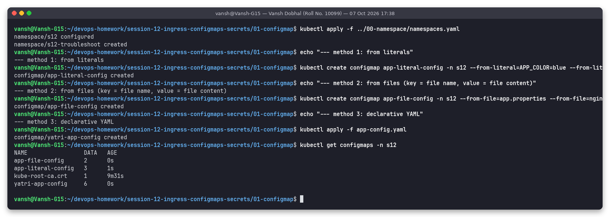

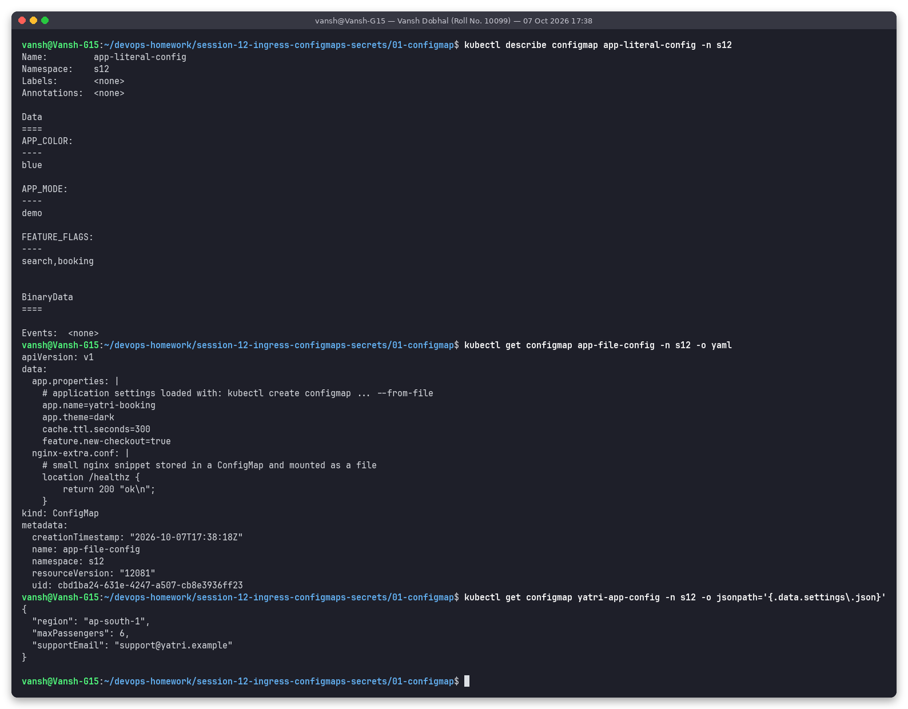

### Inject into a Pod – env, envFrom, volume

[`01-configmap/pod-using-configmaps.yaml`](01-configmap/pod-using-configmaps.yaml) uses all three ways in one pod:

```yaml
      env:
        - name: APP_ENV                      # (1) env + configMapKeyRef: one key, renamed
          valueFrom:
            configMapKeyRef: { name: yatri-app-config, key: ENVIRONMENT }
        ...
      envFrom:
        - configMapRef: { name: app-literal-config }   # (2) ALL keys as env vars
          prefix: LIT_
      volumeMounts:
        - { name: yaml-config, mountPath: /etc/yatri, readOnly: true }   # (3) keys as files
        - { name: file-config, mountPath: /etc/app,   readOnly: true }
  volumes:
    - name: yaml-config
      configMap:
        name: yatri-app-config
        items:
          - { key: settings.json, path: settings.json }
          - { key: LOG_LEVEL,     path: log_level }
    - name: file-config
      configMap: { name: app-file-config }
```

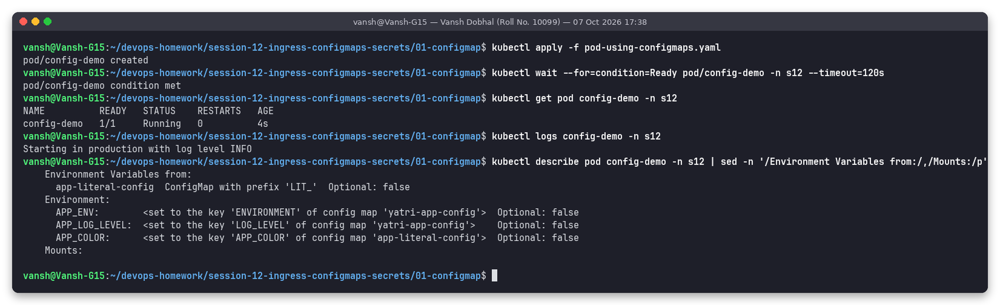

### Verify inside the container

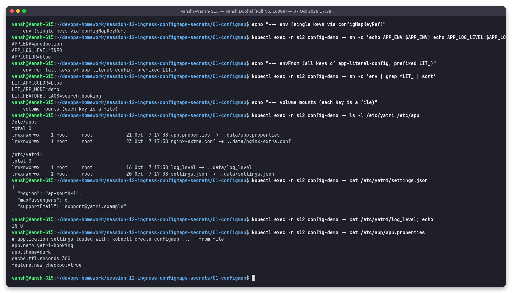

```text
APP_ENV=production
APP_LOG_LEVEL=INFO
APP_COLOR=blue
LIT_APP_COLOR=blue
LIT_APP_MODE=demo
LIT_FEATURE_FLAGS=search,booking
/etc/yatri:  log_level -> ..data/log_level   settings.json -> ..data/settings.json
/etc/app:    app.properties -> ..data/app.properties   nginx-extra.conf -> ..data/nginx-extra.conf
{ "region": "ap-south-1", "maxPassengers": 6, ... }
```

### Bonus: what happens on update

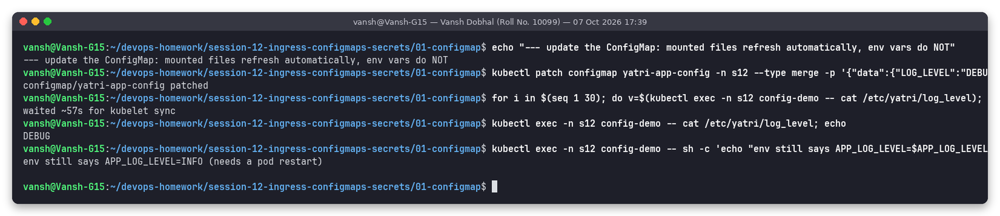

```text
configmap/yatri-app-config patched          (LOG_LEVEL -> DEBUG)
waited ~57s for kubelet sync
DEBUG                                        <- mounted file updated in place
env still says APP_LOG_LEVEL=INFO (needs a pod restart)
```

Mounted files are symlinks into a `..data` directory that the kubelet swaps atomically on its sync loop (here ~1 minute), so volume-mounted config updates **live**. Environment variables are fixed when the container starts → you need `kubectl rollout restart` (or a config hash annotation, e.g. Helm `checksum/config`) for env changes.

**Observations:** ConfigMaps hold non-sensitive configuration separate from the image, so the same image runs in dev/stage/prod. Use `env`/`envFrom` for simple flags and volumes for whole config files; keep a ConfigMap under 1 MiB.

---

## Task 2: Secret

### Create and store sensitive values

* Imperative (value never written to disk in the repo): `kubectl create secret generic api-token-secret --from-literal=token=demo-token-12345`
* Declarative: [`02-secret/db-secret.yaml`](02-secret/db-secret.yaml) – **dummy demo values only**, clearly marked in the file:

```yaml
# SAMPLE SECRET - DUMMY VALUES FOR THE CLASS DEMO ONLY.
apiVersion: v1
kind: Secret
metadata:
  name: yatri-db-secret
  namespace: s12
type: Opaque
data:
  POSTGRES_USER: ZGVtb191c2Vy                         # echo -n "demo_user" | base64
  POSTGRES_PASSWORD: ZGVtby1wYXNzd29yZC1ub3QtcmVhbA== # echo -n "demo-password-not-real" | base64
stringData:
  POSTGRES_DB: yatri_demo_db      # plain text, API server encodes it into .data
```

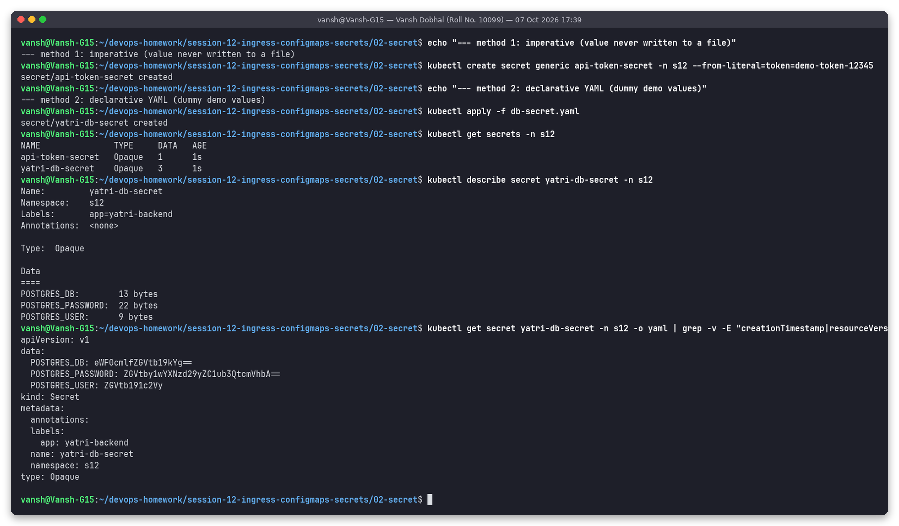

`kubectl describe secret` only shows sizes (`POSTGRES_PASSWORD: 22 bytes`), but `-o yaml` shows the base64 data – and the `stringData` value was converted into `.data.POSTGRES_DB: eWF0cmlfZGVtb19kYg==`.

### Inject into a Pod – env and volume

[`02-secret/pod-using-secret.yaml`](02-secret/pod-using-secret.yaml): `env[].valueFrom.secretKeyRef` for `DB_USER`, `DB_PASSWORD`, `DB_NAME`, `API_TOKEN`, plus a `secret` volume at `/etc/secrets/db` with `defaultMode: 0400`.

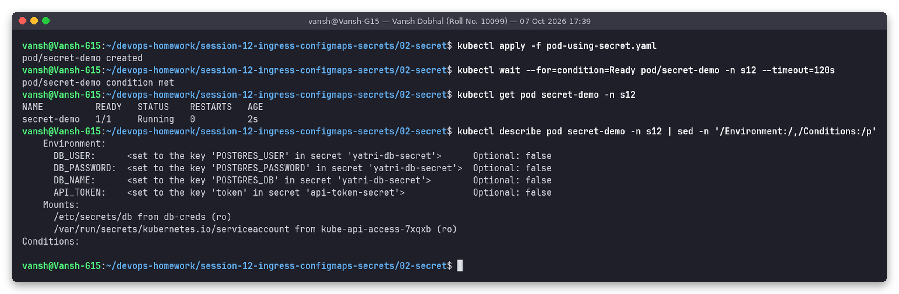

### Verify inside the container

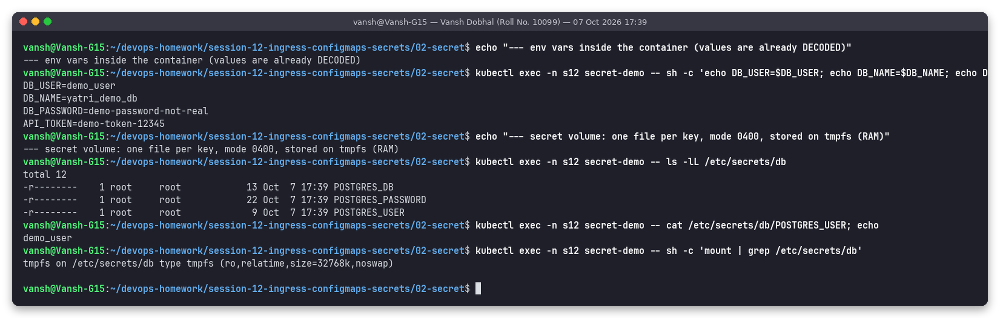

```text
DB_USER=demo_user
DB_NAME=yatri_demo_db
DB_PASSWORD=demo-password-not-real
API_TOKEN=demo-token-12345
-r--------    1 root root  13 POSTGRES_DB
-r--------    1 root root  22 POSTGRES_PASSWORD
-r--------    1 root root   9 POSTGRES_USER
tmpfs on /etc/secrets/db type tmpfs (ro,relatime,size=32768k,noswap)
```

Inside the container the values are already **decoded**. The volume is a read-only **tmpfs** (RAM, never written to the node's disk) and the files have mode 0400.

### base64 is encoding, not encryption

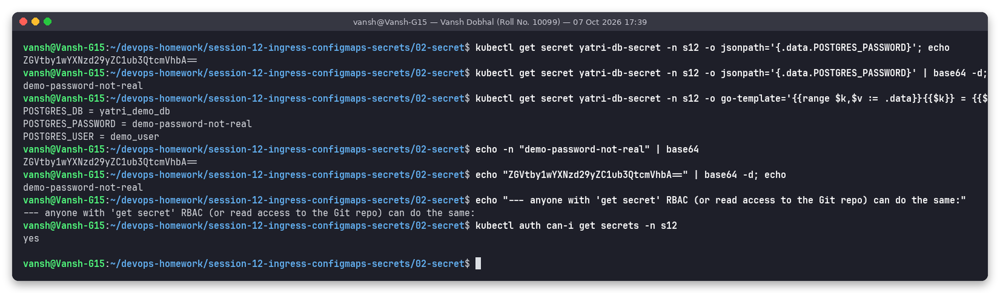

```text
$ kubectl get secret yatri-db-secret -o jsonpath='{.data.POSTGRES_PASSWORD}'
ZGVtby1wYXNzd29yZC1ub3QtcmVhbA==
$ ... | base64 -d
demo-password-not-real
$ kubectl get secret yatri-db-secret -o go-template='{{range $k,$v := .data}}{{$k}} = {{$v | base64decode}}{{"\n"}}{{end}}'
POSTGRES_DB = yatri_demo_db
POSTGRES_PASSWORD = demo-password-not-real
POSTGRES_USER = demo_user
$ kubectl auth can-i get secrets -n s12
yes
```

base64 is a reversible *representation* (so binary data like TLS keys fits into JSON/YAML) – no key is needed to reverse it. Anyone who can `get secrets` in the namespace, read etcd backups, or read the Git repository has the plaintext. Real protection comes from: RBAC on `secrets`, **encryption at rest** in etcd (`EncryptionConfiguration` with aescbc/KMS), not exposing secrets in env (they leak into crash dumps / `ps e`), and keeping them out of Git.

### Why secrets must not be committed to Git

* Git history is permanent: deleting the file later does not remove it from old commits, forks, clones and CI caches.
* Repos are shared widely (whole team, CI systems, sometimes public) – far wider than "who may know the prod DB password".
* Bots scan public GitHub for credentials within minutes of a push.
* A committed base64 Secret is literally a committed plaintext password.

Proof that scanners catch it – `gitleaks` run over the `02-secret` folder:

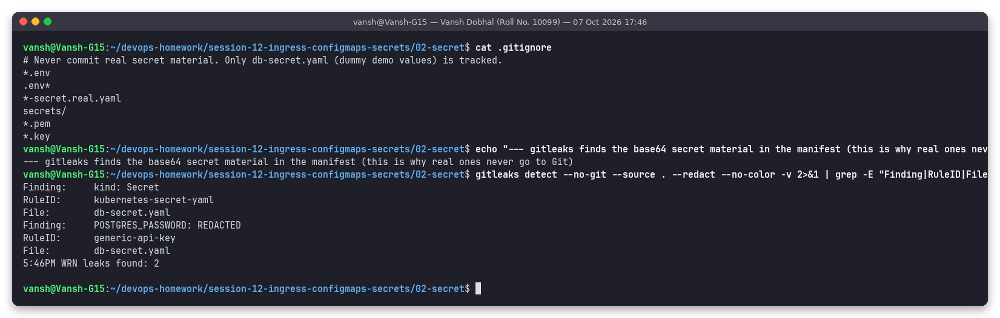

```text
Finding:     kind: Secret                 RuleID: kubernetes-secret-yaml    File: db-secret.yaml
Finding:     POSTGRES_PASSWORD: REDACTED  RuleID: generic-api-key           File: db-secret.yaml
WRN leaks found: 2
```

(The only Secret manifest kept in this repo is `db-secret.yaml`, with obviously fake values for the demo.)

**What to do instead**

| Approach | How it works |
|---|---|
| `.gitignore` | [`02-secret/.gitignore`](02-secret/.gitignore) ignores `*.env`, `.env*`, `*-secret.real.yaml`, `secrets/`, `*.pem`, `*.key` – real values stay local / in the CI secret store and are created with `kubectl create secret` |
| **Sealed Secrets** (Bitnami) | `kubeseal` encrypts a Secret with the cluster controller's public key → `SealedSecret` YAML is safe to commit; only the in-cluster controller can decrypt it |
| **External Secrets Operator** | commit only an `ExternalSecret` reference; the operator fetches the value from AWS Secrets Manager / GCP Secret Manager / Azure Key Vault / Vault and creates the Secret |
| **SOPS** (+ age/PGP/KMS) | encrypts only the values inside YAML; Flux/Argo CD or `helm secrets` decrypt at deploy time |
| **HashiCorp Vault** | central secret store with dynamic, short-lived credentials; injected via the Vault Agent sidecar or CSI driver |
| Pre-commit scanning | `gitleaks`/`trufflehog` as a pre-commit hook and in CI to block accidental commits |

---

## Task 3: Ingress

### Apps and Services

Two backends using `hashicorp/http-echo` (2 replicas each) that reply with their app and pod name, each behind a ClusterIP Service on port 80 → 5678: [`03-ingress/app1.yaml`](03-ingress/app1.yaml), [`03-ingress/app2.yaml`](03-ingress/app2.yaml).

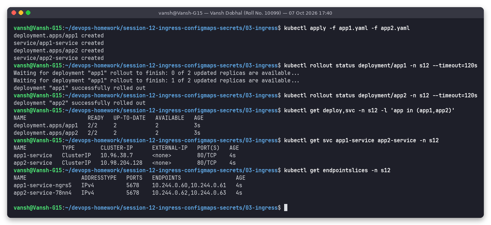

### Ingress configuration

**Path-based** – [`03-ingress/ingress-path-based.yaml`](03-ingress/ingress-path-based.yaml):

```yaml
apiVersion: networking.k8s.io/v1
kind: Ingress
metadata:
  name: path-ingress
  namespace: s12
  annotations:
    nginx.ingress.kubernetes.io/use-regex: "true"
    nginx.ingress.kubernetes.io/rewrite-target: /$2
spec:
  ingressClassName: nginx
  rules:
    - host: app.local
      http:
        paths:
          - path: /app1(/|$)(.*)
            pathType: ImplementationSpecific
            backend: { service: { name: app1-service, port: { number: 80 } } }
          - path: /app2(/|$)(.*)
            pathType: ImplementationSpecific
            backend: { service: { name: app2-service, port: { number: 80 } } }
```

`rewrite-target: /$2` strips the `/app1` prefix (capture group 2 is the rest of the path) so the backend receives `/`.

**Host-based** – [`03-ingress/ingress-host-based.yaml`](03-ingress/ingress-host-based.yaml): `app1.local → app1-service`, `app2.local → app2-service`, path `/` (Prefix).

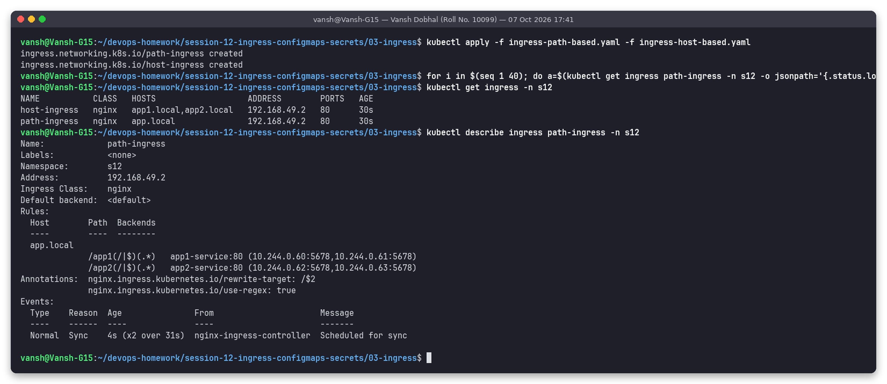

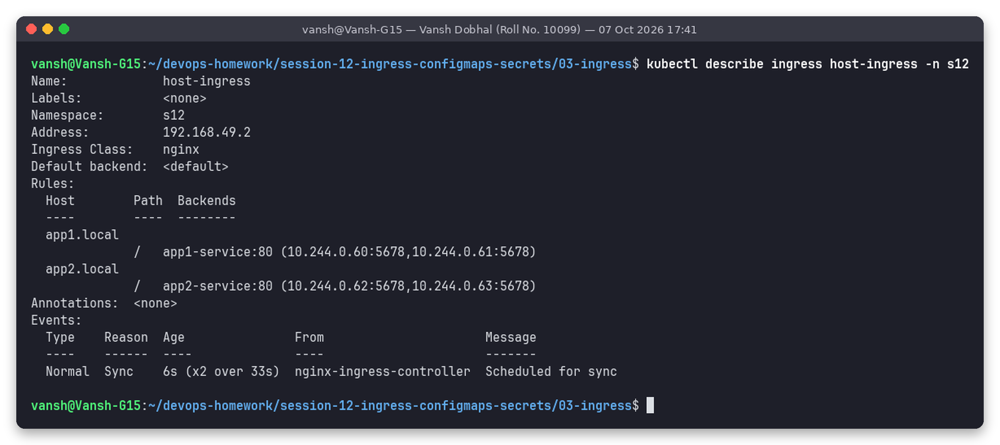

```text
NAME           CLASS   HOSTS                   ADDRESS        PORTS   AGE
host-ingress   nginx   app1.local,app2.local   192.168.49.2   80      30s
path-ingress   nginx   app.local               192.168.49.2   80      30s

Rules:
  Host        Path  Backends
  app.local
              /app1(/|$)(.*)   app1-service:80 (10.244.0.60:5678,10.244.0.61:5678)
              /app2(/|$)(.*)   app2-service:80 (10.244.0.62:5678,10.244.0.63:5678)
```

### Access via the Ingress and verify routing

The ingress-nginx controller listens on the minikube node (`hostPort 80`), so from WSL: `curl -H 'Host: …' http://$(minikube ip)/…`.

**Path-based:**

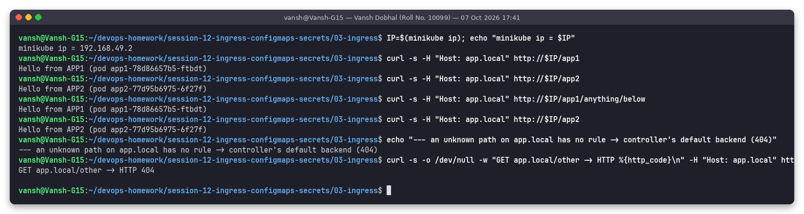

```text
minikube ip = 192.168.49.2
$ curl -s -H "Host: app.local" http://$IP/app1
Hello from APP1 (pod app1-78d86657b5-ftbdt)
$ curl -s -H "Host: app.local" http://$IP/app2
Hello from APP2 (pod app2-77d95b6975-6f27f)
$ curl -s -H "Host: app.local" http://$IP/app1/anything/below
Hello from APP1 (pod app1-78d86657b5-ftbdt)
GET app.local/other -> HTTP 404
```

**Host-based:**

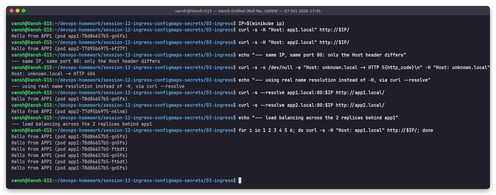

```text
$ curl -s -H "Host: app1.local" http://$IP/
Hello from APP1 (pod app1-78d86657b5-gn5fs)
$ curl -s -H "Host: app2.local" http://$IP/
Hello from APP2 (pod app2-77d95b6975-6f27f)
Host: unknown.local -> HTTP 404
$ curl -s --resolve app1.local:80:$IP http://app1.local/
Hello from APP1 (pod app1-78d86657b5-gn5fs)
--- load balancing across the 2 replicas behind app1
Hello from APP1 (pod app1-78d86657b5-gn5fs)
Hello from APP1 (pod app1-78d86657b5-ftbdt)   ...
```

**Controller access log** proves which upstream served each request – note that nginx talks to the **pod IPs** directly (`10.244.0.60/61:5678`), taken from the EndpointSlices, not to the Service ClusterIP:

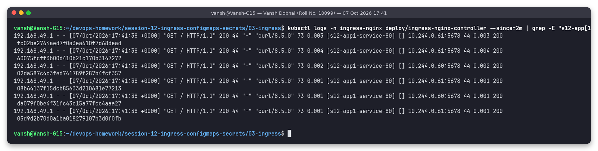

```text
192.168.49.1 - - [07/Oct/2026:17:41:38 +0000] "GET / HTTP/1.1" 200 44 "-" "curl/8.5.0" 73 0.003 [s12-app1-service-80] [] 10.244.0.61:5678 44 0.003 200 ...
192.168.49.1 - - [07/Oct/2026:17:41:38 +0000] "GET / HTTP/1.1" 200 44 "-" "curl/8.5.0" 73 0.002 [s12-app1-service-80] [] 10.244.0.60:5678 44 0.002 200 ...
```

**Observations:** one IP and one port (80) serve 3 hostnames and 2 path prefixes. Unmatched host/path combinations fall to the controller's default backend (404). In production you would add a `tls:` section with a certificate Secret (cert-manager) and point DNS records at the controller's LoadBalancer.

---

## Task 4: Ingress vs Ingress Controller

Full write-up with the real controller pods, IngressClass, controller arguments, the generated `nginx.conf` server blocks and an "orphan" Ingress with no controller:
**[ingress-vs-controller/README.md](ingress-vs-controller/README.md)**

Short version: an **Ingress** is only a routing *rule* stored in the API; an **Ingress Controller** (ingress-nginx here) is the running proxy that watches those rules and actually serves traffic. Without a controller, an Ingress does nothing (shown with real output).

---

## Task 5: Troubleshooting

Full details (problem → commands → root cause → fix → before/after screenshots): **[troubleshooting/README.md](troubleshooting/README.md)**. Based on the instructor's `session-11/troubleshooting/empty-endpoints.yaml`, `session-12/troubleshooting/secret-base64-gotcha.md` and `session10/troubleshooting/broken-image.yaml` + `selector-mismatch.yaml`, run in namespace `s12-troubleshoot`.

| # | Problem (symptom) | Key diagnostic | Root cause | Fix |
|---|---|---|---|---|
| 1 | Service exists, `curl` → connection refused (exit 7) | `kubectl get endpoints` → `<none>`; `get pods --show-labels` | Service selector `app: wrong-backend-name`, pods are `app: yatri-backend` | correct selector → endpoints `10.244.0.109/110:5000`, curl OK |
| 2 | PostgreSQL: `FATAL: password authentication failed for user "yatri_admin"` | `base64 -d \| xxd` shows trailing `0a`; password length 11 not 10 | Secret value made with `echo "mypassword" \| base64` (adds `\n`) | `echo -n` → `bXlwYXNzd29yZA==`, recreate pod → `psql` works |
| 3 | Rollout stuck, new pod `ErrImagePull/ImagePullBackOff` | `describe pod` events: `pull access denied, repository does not exist` | non-existent image tag `yatri-backend:non-existent-tag-v999` | `kubectl rollout undo` (old pods kept serving the whole time) |
| 4 | `kubectl apply` rejected | API error `selector does not match template labels` | Deployment `selector.matchLabels` ≠ template labels | make template labels match → Deployment created |

---

## Folder structure

```text
session-12-ingress-configmaps-secrets
├── README.md
├── 00-namespace/namespaces.yaml                 s12 + s12-troubleshoot
├── 01-configmap/   app-config.yaml, app.properties, nginx-extra.conf, pod-using-configmaps.yaml
├── 02-secret/      db-secret.yaml (dummy), pod-using-secret.yaml, .gitignore
├── 03-ingress/     app1.yaml, app2.yaml, ingress-path-based.yaml, ingress-host-based.yaml
├── ingress-vs-controller/   README.md, screenshots/, outputs/
├── troubleshooting/         README.md, manifests/ (broken + fixed YAMLs), screenshots/, outputs/
├── scripts/        task1-configmap.sh, task2-secret.sh, task3-ingress.sh, task5-troubleshooting.sh
├── screenshots/    01-… to 16-… (Tasks 1–3)
└── outputs/        text of every screenshot
```

## How to reproduce

```bash
# minikube running with: minikube addons enable ingress ; snap helper on PATH
cd ~/devops-homework/session-12-ingress-configmaps-secrets
bash scripts/task1-configmap.sh
bash scripts/task2-secret.sh
bash scripts/task3-ingress.sh          # also produces ingress-vs-controller/ screenshots
bash scripts/task5-troubleshooting.sh
# manual checks
curl -H 'Host: app.local'  http://$(minikube ip)/app1
curl -H 'Host: app2.local' http://$(minikube ip)/
# clean up
kubectl delete ns s12 s12-troubleshoot
```

The namespaces were deleted after capturing the outputs; all manifests and outputs remain in this folder.
