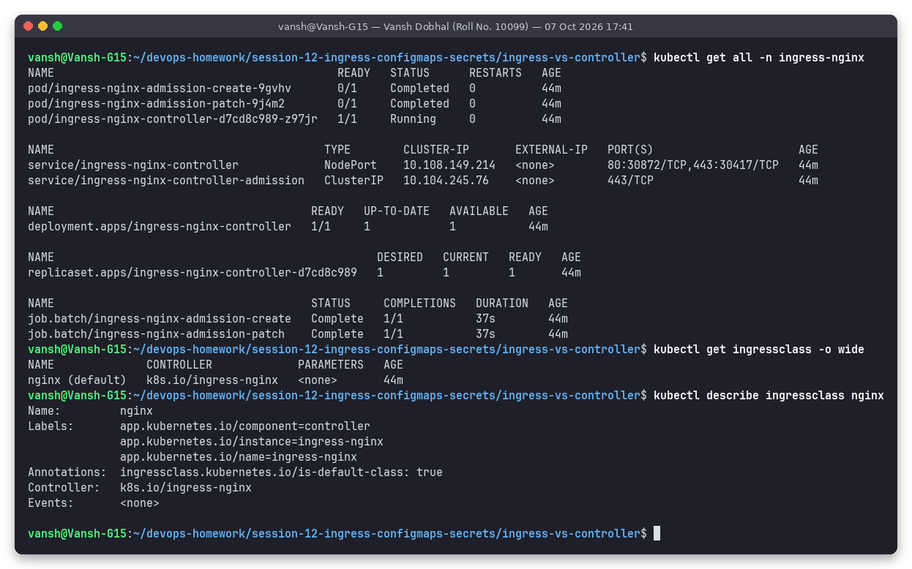
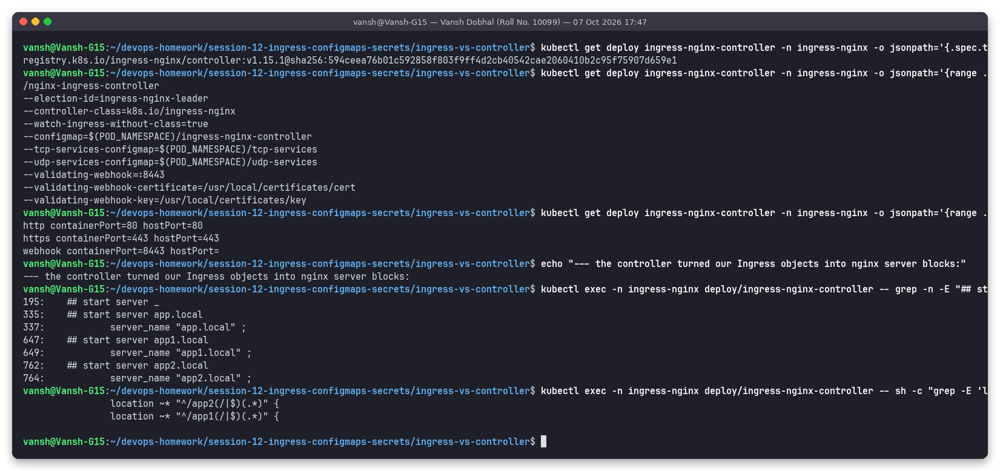
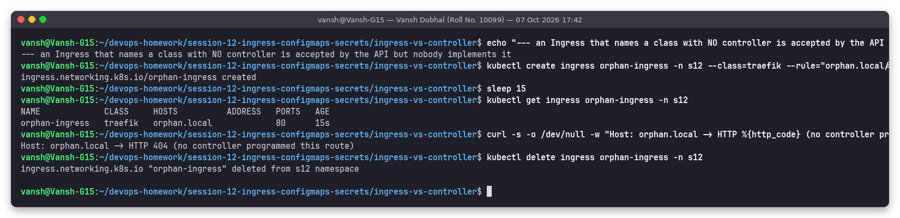

# Task 4: Ingress vs Ingress Controller

**Name:** Vansh Dobhal | **Roll No:** 10099

Back to the [session README](../README.md). Commands are in [`../scripts/task3-ingress.sh`](../scripts/task3-ingress.sh) (second half).

## What is an Ingress?

An **Ingress** (`networking.k8s.io/v1`, kind `Ingress`) is an API object that describes **how external HTTP/HTTPS traffic should be routed to Services** inside the cluster:

* rules by **host** (`app1.local`) and **path** (`/app1`, `pathType: Prefix | Exact | ImplementationSpecific`)
* a backend `service.name` + `port`
* optional `tls:` section (host list + certificate Secret) and a `defaultBackend`
* `ingressClassName` – which controller should implement it
* controller-specific behaviour via annotations (e.g. `nginx.ingress.kubernetes.io/rewrite-target`)

It is just **data in etcd** – a declarative wish ("send `app.local/app1` to `app1-service:80`"). It opens no port and runs no code.

## What is an Ingress Controller?

An **Ingress Controller** is a real workload (Deployment/DaemonSet + Service) running a reverse proxy / load balancer. It:

1. watches Ingress, Service, EndpointSlice and Secret objects through the API server,
2. translates the Ingress rules into its own proxy configuration (nginx.conf, Envoy config, HAProxy config, or a cloud load balancer),
3. receives the external traffic (via LoadBalancer/NodePort Service or hostPort) and proxies it to the backend pods,
4. writes the address it serves on into the Ingress `status.loadBalancer` (the `ADDRESS` column).

Kubernetes does **not** ship a controller – the kube-controller-manager has no Ingress controller. You must install one.

## The controller in this cluster (real output)



```text
pod/ingress-nginx-controller-d7cd8c989-z97jr   1/1   Running
pod/ingress-nginx-admission-create-9gvhv       0/1   Completed    <- jobs that create the webhook TLS cert
pod/ingress-nginx-admission-patch-9j4m2        0/1   Completed
service/ingress-nginx-controller             NodePort    10.108.149.214   80:30872/TCP,443:30417/TCP
service/ingress-nginx-controller-admission   ClusterIP   10.104.245.76    443/TCP
deployment.apps/ingress-nginx-controller   1/1

NAME              CONTROLLER             PARAMETERS   AGE
nginx (default)   k8s.io/ingress-nginx   <none>       44m
Annotations:  ingressclass.kubernetes.io/is-default-class: true
```



```text
registry.k8s.io/ingress-nginx/controller:v1.15.1@sha256:594ceea7...
/nginx-ingress-controller
--controller-class=k8s.io/ingress-nginx       <- matches IngressClass "nginx".spec.controller
--watch-ingress-without-class=true
--configmap=$(POD_NAMESPACE)/ingress-nginx-controller
--validating-webhook=:8443
http  containerPort=80  hostPort=80           <- why curl http://$(minikube ip)/ works
https containerPort=443 hostPort=443
--- the controller turned our Ingress objects into nginx server blocks:
335:	## start server app.local
337:		server_name "app.local" ;
649:		server_name "app1.local" ;
764:		server_name "app2.local" ;
		location ~* "^/app2(/|$)(.*)" {
		location ~* "^/app1(/|$)(.*)" {
```

This is the clearest proof of the split: my two Ingress objects (Task 3) became `server {}` and `location {}` blocks inside the controller pod's `/etc/nginx/nginx.conf`. The controller also runs a **validating admission webhook** (port 8443) that rejects Ingress objects that would produce an invalid nginx config.

## Ingress without a matching controller



```text
$ kubectl create ingress orphan-ingress -n s12 --class=traefik --rule="orphan.local/=app1-service:80"
ingress.networking.k8s.io/orphan-ingress created
$ kubectl get ingress orphan-ingress -n s12          (after 15 s)
NAME             CLASS     HOSTS          ADDRESS   PORTS   AGE
orphan-ingress   traefik   orphan.local             80      15s
Host: orphan.local -> HTTP 404 (no controller programmed this route)
```

The API server happily stored the Ingress, but no Traefik controller is installed, so `ADDRESS` stays empty and requests for `orphan.local` hit nginx's default backend (404) – ingress-nginx ignores it because the class is not its own.

## Difference

| | Ingress | Ingress Controller |
|---|---|---|
| What | API resource (YAML, stored in etcd) | running software (pods) |
| Role | **declares** routing rules | **implements** them, carries the traffic |
| Provided by | Kubernetes API (`networking.k8s.io/v1`) | third party / cloud: ingress-nginx, Traefik, HAProxy, AWS LB Controller, GKE… |
| Created with | `kubectl apply -f ingress.yaml` | Helm chart / manifests / `minikube addons enable ingress` |
| Count | many per cluster (one per app/team) | usually one or a few per cluster |
| Linked by | `spec.ingressClassName: nginx` | `IngressClass.spec.controller: k8s.io/ingress-nginx` |
| Without the other | does nothing (orphan demo above) | runs, but serves only its default backend (404) |
| Analogy | the entry in a routing table / nginx `server{}` you'd like | nginx itself |

## Why both are required

Kubernetes separates **intent** from **implementation**:

* Developers write portable Ingress rules per app without caring which proxy runs them.
* Platform teams choose the controller (cloud LB, nginx, Envoy-based…) and can switch it or run several side by side, selected by **IngressClass**.
* One controller (one external IP / cloud LB) serves *many* Services, instead of one paid LoadBalancer per Service.
* The same pattern is used elsewhere in Kubernetes (Service + kube-proxy, PVC + CSI driver), and continues in the newer **Gateway API** (GatewayClass/Gateway/HTTPRoute).

## Examples of Ingress Controllers

| Controller | Data plane | Notes / where used |
|---|---|---|
| **ingress-nginx** (Kubernetes community) | NGINX | the one used here (minikube addon); annotations `nginx.ingress.kubernetes.io/*`. The community project announced retirement in favour of Gateway API implementations, so new clusters should plan for that |
| **NGINX Ingress Controller** (F5/NGINX Inc.) | NGINX / NGINX Plus | different project, annotations `nginx.org/*`, CRDs `VirtualServer` |
| **Traefik** | Traefik (Go) | default in k3s; auto-discovery, Let's Encrypt built in, `IngressRoute` CRD |
| **HAProxy Ingress / HAProxy Kubernetes Ingress** | HAProxy | very high performance, fine-grained load balancing options |
| **AWS Load Balancer Controller** | AWS ALB (HTTP) / NLB | provisions a real **Application Load Balancer** per Ingress (or IngressGroup); annotations `alb.ingress.kubernetes.io/*`, targets pod IPs directly in `ip` mode |
| **GKE Ingress (GCE controller)** | Google Cloud HTTP(S) Load Balancer | class `gce` / `gce-internal`, global anycast IP, managed certs |
| **Azure Application Gateway Ingress Controller (AGIC)** | Azure App Gateway | AKS |
| **Contour / Emissary / Istio gateway** | Envoy | Envoy-based, also Gateway API implementations |
| **Kong** | NGINX + OpenResty | API gateway features (auth, rate limiting plugins) |

Cloud controllers (ALB, GCE) don't run a proxy inside the cluster at all – they program a managed load balancer outside it – which shows again that "Ingress Controller" is a role, not a specific piece of software.
