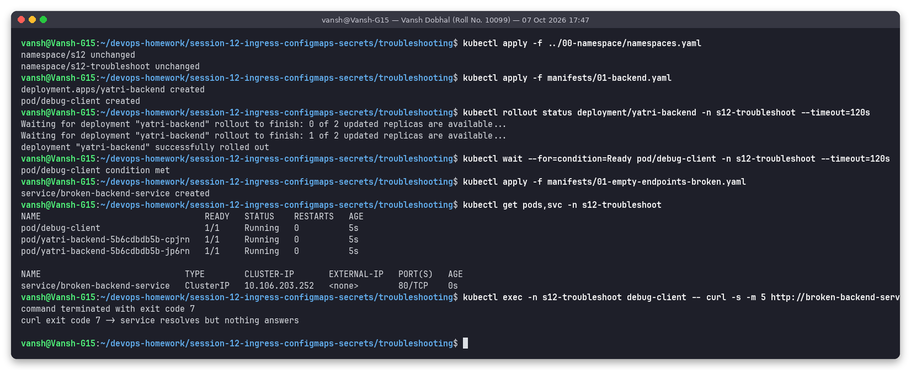
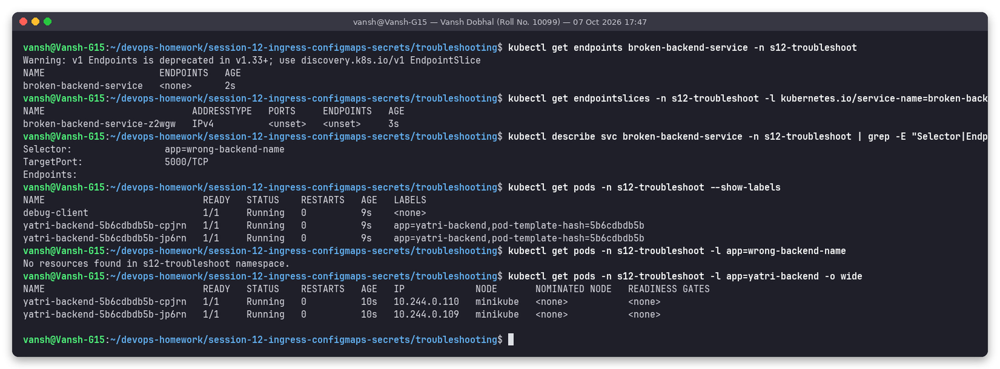
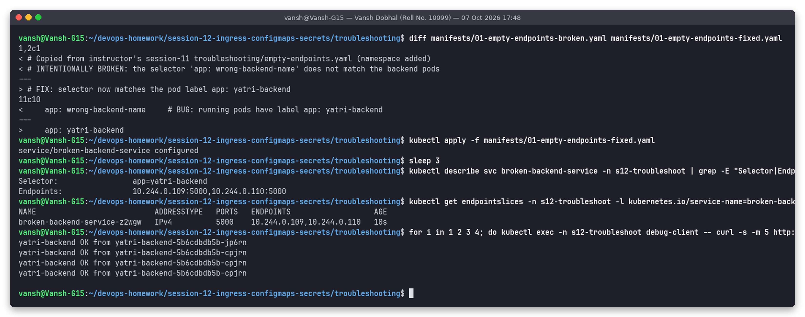
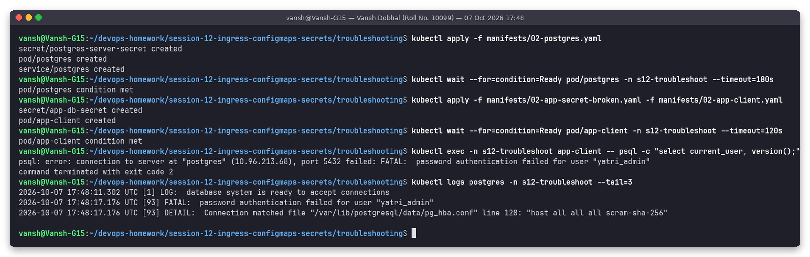
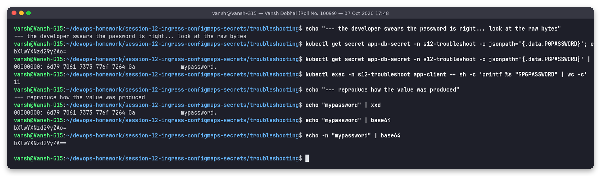
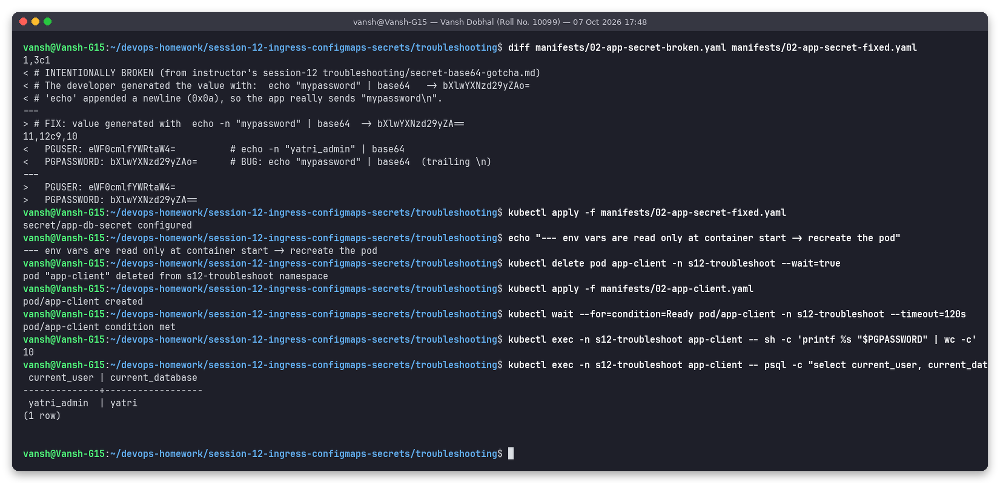
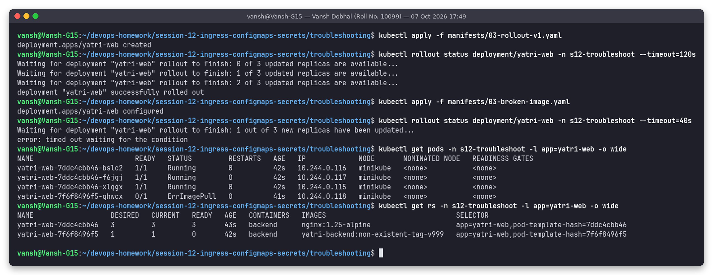
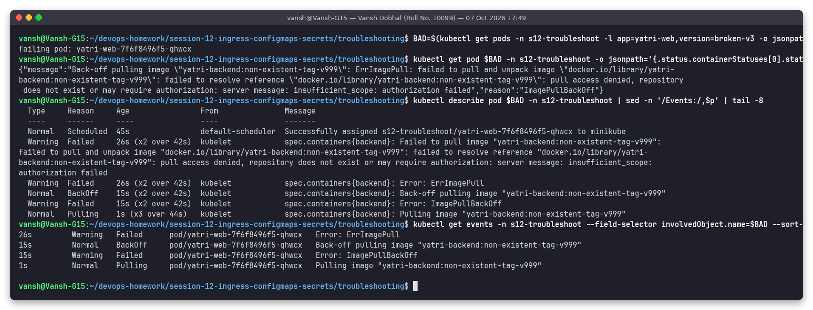
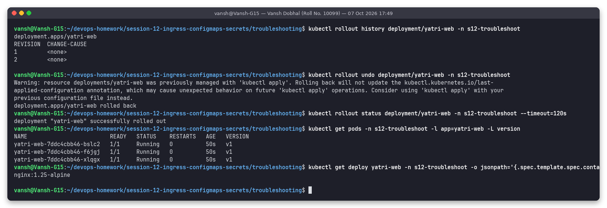
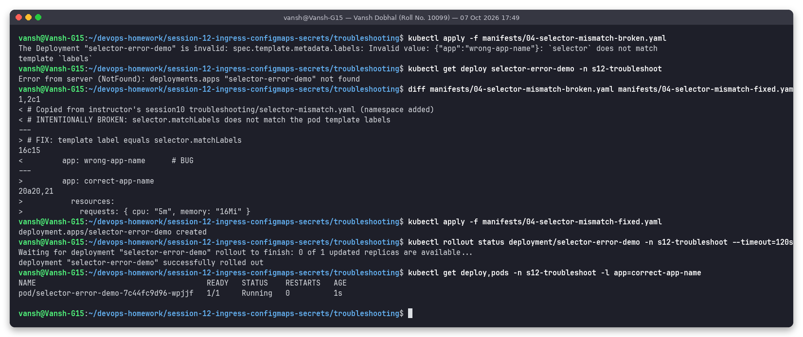

# Task 5: Troubleshooting

**Name:** Vansh Dobhal | **Roll No:** 10099

Back to the [session README](../README.md). Namespace: **`s12-troubleshoot`**. Script: [`../scripts/task5-troubleshooting.sh`](../scripts/task5-troubleshooting.sh). Broken and fixed manifests are in [`manifests/`](manifests/).

The drills come from the instructor's repo:

| Scenario | Instructor source | My manifests |
|---|---|---|
| 1. Service with empty endpoints | `session-11-kubernetes-services/troubleshooting/empty-endpoints.yaml` | `01-backend.yaml`, `01-empty-endpoints-broken.yaml`, `01-empty-endpoints-fixed.yaml` |
| 2. Secret base64 trailing newline | `session-12-ingress-configmaps-secrets/troubleshooting/secret-base64-gotcha.md` | `02-postgres.yaml`, `02-app-secret-broken.yaml`, `02-app-secret-fixed.yaml`, `02-app-client.yaml` |
| 3. Broken image during rollout | `session10-k8s-core-objects/troubleshooting/broken-image.yaml` | `03-rollout-v1.yaml`, `03-broken-image.yaml` |
| 4. Selector / label mismatch | `session10-k8s-core-objects/troubleshooting/selector-mismatch.yaml` | `04-selector-mismatch-broken.yaml`, `04-selector-mismatch-fixed.yaml` |

General method used for each: **symptom → look at the object chain (Service → EndpointSlice → Pods / Deployment → ReplicaSet → Pod → events) → compare what is expected with what is there → root cause → minimal fix → verify.**

---

## Scenario 1: Service with empty endpoints

### Problem

Backend pods are `Running`, the Service exists and resolves in DNS, but every request fails.



```text
pod/yatri-backend-5b6cdbdb5b-cpjrn   1/1   Running
pod/yatri-backend-5b6cdbdb5b-jp6rn   1/1   Running
service/broken-backend-service   ClusterIP   10.106.203.252   80/TCP
$ kubectl exec debug-client -- curl -s -m 5 http://broken-backend-service
command terminated with exit code 7
curl exit code 7 -> service resolves but nothing answers
```

### Troubleshooting commands



```text
$ kubectl get endpoints broken-backend-service
broken-backend-service   <none>
$ kubectl get endpointslices -l kubernetes.io/service-name=broken-backend-service
broken-backend-service-z2wgw   IPv4   <unset>   <unset>
$ kubectl describe svc broken-backend-service | grep -E "Selector|Endpoints|TargetPort"
Selector:     app=wrong-backend-name
TargetPort:   5000/TCP
Endpoints:
$ kubectl get pods --show-labels
yatri-backend-...   app=yatri-backend,pod-template-hash=5b6cdbdb5b
$ kubectl get pods -l app=wrong-backend-name
No resources found in s12-troubleshoot namespace.
```

### Root cause

The Service selector is `app: wrong-backend-name`, but the pods are labelled `app: yatri-backend`. The EndpointSlice controller finds **zero** matching pods, so kube-proxy has no endpoints for the ClusterIP and rejects the connection (curl exit 7 = connection refused). Running pods + empty endpoints almost always means **selector ≠ labels** (other causes: pods not Ready, or wrong namespace).

### Fix



```text
<     app: wrong-backend-name     # BUG: running pods have label app: yatri-backend
>     app: yatri-backend
service/broken-backend-service configured
Selector:   app=yatri-backend
Endpoints:  10.244.0.109:5000,10.244.0.110:5000
yatri-backend OK from yatri-backend-5b6cdbdb5b-jp6rn
yatri-backend OK from yatri-backend-5b6cdbdb5b-cpjrn
```

Endpoints appeared within seconds and traffic is balanced over both pods. (`targetPort: 5000` was already correct – that is the second thing to check when endpoints exist but connections still fail.)

---

## Scenario 2: Secret base64 "trailing newline" gotcha

### Problem

A real PostgreSQL 16 pod (`postgres`) is created with the password `mypassword`. The application pod (`app-client`, a `psql` client) takes `PGUSER`/`PGPASSWORD` from Secret `app-db-secret`, whose value the developer made with `echo "mypassword" | base64`.



```text
$ kubectl exec app-client -- psql -c "select current_user, version();"
psql: error: connection to server at "postgres" (10.96.213.68), port 5432 failed: FATAL:  password authentication failed for user "yatri_admin"
$ kubectl logs postgres --tail=3
... FATAL:  password authentication failed for user "yatri_admin"
... DETAIL:  Connection matched file "/var/lib/postgresql/data/pg_hba.conf" line 128: "host all all all scram-sha-256"
```

### Troubleshooting commands



```text
$ kubectl get secret app-db-secret -o jsonpath='{.data.PGPASSWORD}'
bXlwYXNzd29yZAo=
$ kubectl get secret app-db-secret -o jsonpath='{.data.PGPASSWORD}' | base64 -d | xxd
00000000: 6d79 7061 7373 776f 7264 0a              mypassword.
$ kubectl exec app-client -- sh -c 'printf %s "$PGPASSWORD" | wc -c'
11
$ echo "mypassword" | base64
bXlwYXNzd29yZAo=
$ echo -n "mypassword" | base64
bXlwYXNzd29yZA==
```

### Root cause

`echo` appends a newline. The decoded secret is `mypassword\n` (last byte `0a`, 11 bytes instead of 10), so the client sends a different password and PostgreSQL correctly rejects it. Tell-tale sign: base64 of a newline-terminated string often ends in `K`, `o=` or `Cg==` (`...ZAo=` here vs `...ZA==`).

### Fix



```text
<   PGPASSWORD: bXlwYXNzd29yZAo=      # BUG: echo "mypassword" | base64  (trailing \n)
>   PGPASSWORD: bXlwYXNzd29yZA==
secret/app-db-secret configured
--- env vars are read only at container start -> recreate the pod
10
 current_user | current_database
--------------+------------------
 yatri_admin  | yatri
(1 row)
```

Two lessons: always use `echo -n` / `printf %s` (or `stringData:` / `kubectl create secret --from-literal`, which never adds a newline), and remember that changing a Secret does **not** update env vars in running pods – the pod had to be recreated.

---

## Scenario 3: Broken image tag during a rolling update

### Problem

A healthy Deployment `yatri-web` (3 × nginx) is updated with the instructor's broken manifest (`image: yatri-backend:non-existent-tag-v999`). The rollout never finishes.



```text
Waiting for deployment "yatri-web" rollout to finish: 1 out of 3 new replicas have been updated...
error: timed out waiting for the condition
yatri-web-7ddc4cbb46-bslc2   1/1   Running        0   42s
yatri-web-7ddc4cbb46-f6jgj   1/1   Running        0   42s
yatri-web-7ddc4cbb46-xlqgx   1/1   Running        0   42s
yatri-web-7f6f8496f5-qhwcx   0/1   ErrImagePull   0   41s
yatri-web-7ddc4cbb46   3   3   3   nginx:1.25-alpine
yatri-web-7f6f8496f5   1   1   0   yatri-backend:non-existent-tag-v999
```

### Troubleshooting commands



```text
{"message":"Back-off pulling image \"yatri-backend:non-existent-tag-v999\": ErrImagePull: failed to pull and unpack image \"docker.io/library/yatri-backend:non-existent-tag-v999\": ... pull access denied, repository does not exist or may require authorization ...","reason":"ImagePullBackOff"}
Warning  Failed   kubelet  Error: ErrImagePull
Normal   BackOff  kubelet  Back-off pulling image "yatri-backend:non-existent-tag-v999"
Warning  Failed   kubelet  Error: ImagePullBackOff
```

### Root cause

The image `docker.io/library/yatri-backend:non-existent-tag-v999` does not exist (no such repo/tag on Docker Hub), so the kubelet cannot pull it and backs off with increasing delay. Because the strategy is `maxSurge: 1, maxUnavailable: 0`, Kubernetes created only **one** surge pod and kept all 3 old pods serving – the outage was avoided by the strategy, only the release was blocked.

### Fix



```text
deployment.apps/yatri-web rolled back
deployment "yatri-web" successfully rolled out
yatri-web-7ddc4cbb46-bslc2   1/1   Running   v1
yatri-web-7ddc4cbb46-f6jgj   1/1   Running   v1
yatri-web-7ddc4cbb46-xlqgx   1/1   Running   v1
nginx:1.25-alpine
```

`kubectl rollout undo` brought the Deployment back to revision 1 and the failing ReplicaSet was scaled to 0. The permanent fix is to push/reference a tag that exists (and add `imagePullSecrets` if the registry is private).

---

## Scenario 4: Deployment selector does not match template labels



### Problem / command

```text
$ kubectl apply -f manifests/04-selector-mismatch-broken.yaml
The Deployment "selector-error-demo" is invalid: spec.template.metadata.labels: Invalid value: {"app":"wrong-app-name"}: `selector` does not match template `labels`
$ kubectl get deploy selector-error-demo
Error from server (NotFound): deployments.apps "selector-error-demo" not found
```

### Root cause

`spec.selector.matchLabels: app=correct-app-name` but the template creates pods with `app=wrong-app-name`. A controller that could not select its own pods would create them forever, so the API server validation rejects the object outright (nothing is created). Note also that a Deployment's selector is **immutable** after creation – fixing it later requires delete + recreate.

### Fix

```text
<         app: wrong-app-name      # BUG
>         app: correct-app-name
deployment.apps/selector-error-demo created
deployment "selector-error-demo" successfully rolled out
pod/selector-error-demo-7c44fc9d96-wpjjf   1/1   Running
```

---

## Summary

| # | Symptom | Most useful command | Root cause | Fix |
|---|---|---|---|---|
| 1 | curl to Service fails, pods Running | `kubectl get endpoints` / `get pods --show-labels` | selector ≠ pod labels | correct selector |
| 2 | DB `password authentication failed` | `base64 -d \| xxd` | `echo` added `\n` to the secret | `echo -n`, recreate pod |
| 3 | rollout stuck, `ImagePullBackOff` | `kubectl describe pod` (Events) | image tag does not exist | `rollout undo`, use a valid tag |
| 4 | `kubectl apply` rejected | read the API error | selector ≠ template labels | match the labels |

Generic checklist I'll reuse: `kubectl get` (status) → `kubectl describe` (events) → `kubectl logs` / `--previous` → `kubectl get endpoints/endpointslices` → `kubectl exec` into a debug pod (curl, nslookup) → compare labels/ports/names character by character.
