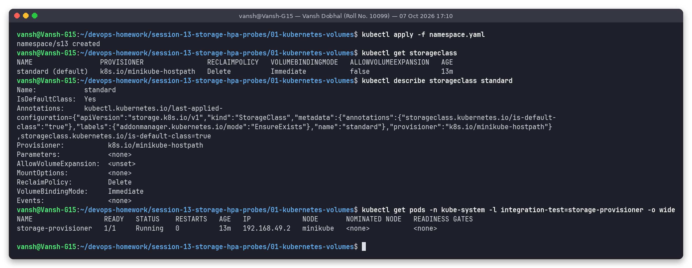
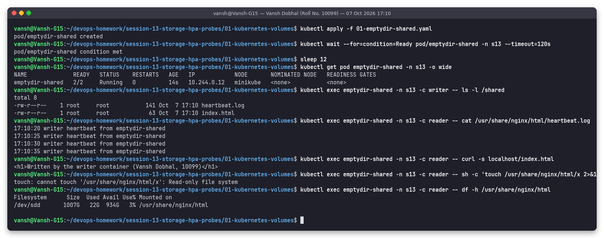
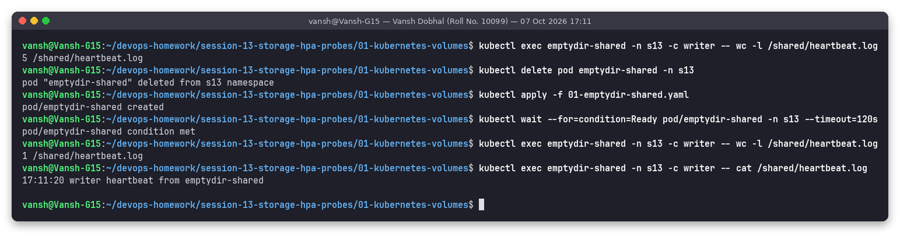
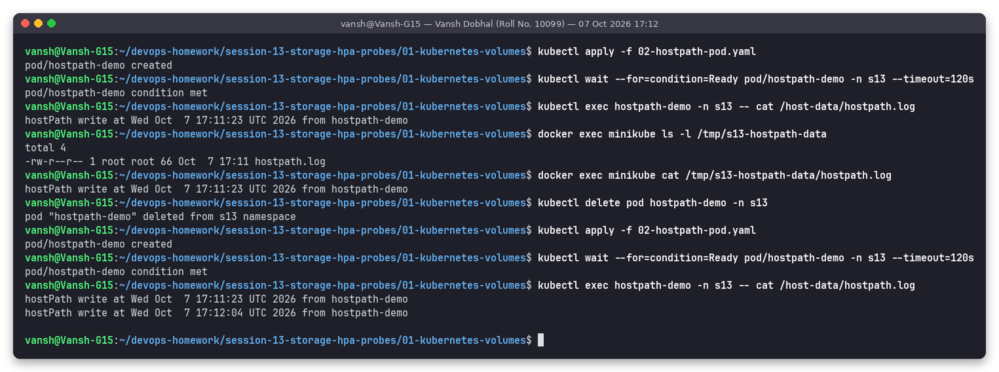
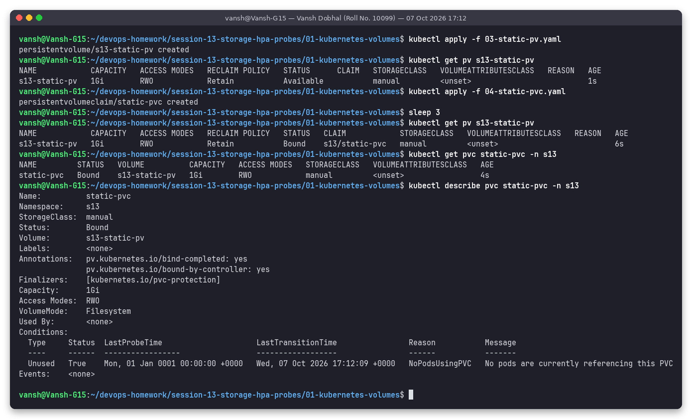
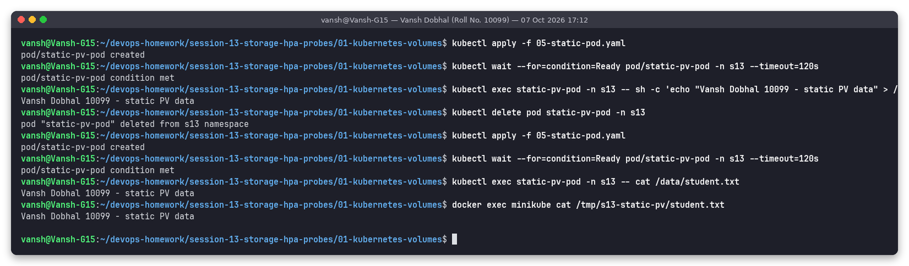
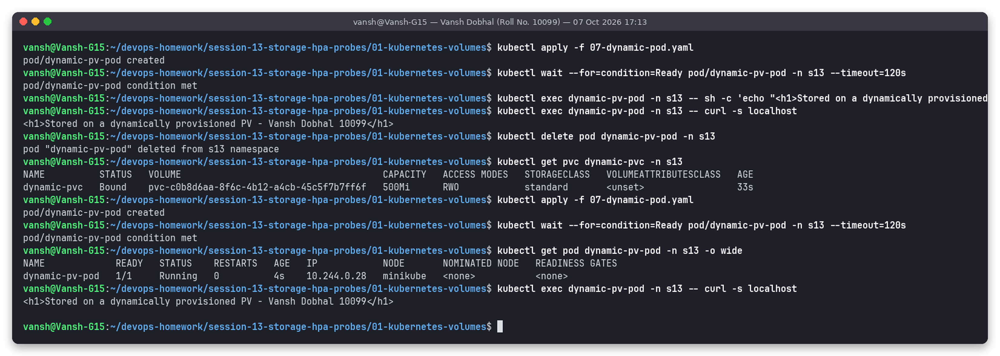
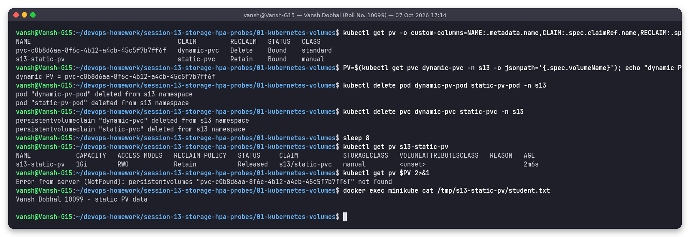

# Task 1: Kubernetes Volumes, PV, PVC, StorageClass and Dynamic Provisioning

**Name:** Vansh Dobhal | **Roll No:** 10099

Everything here was run on the shared minikube cluster (Kubernetes v1.37.0, containerd runtime, docker driver)
in namespace `s13`. Every screenshot was produced by the `snap` tool, which runs the commands for real and
saves the exact text next to the image in [`outputs/`](outputs/).

---

## 1. Why volumes exist

A container's filesystem is ephemeral: it is built from the image layers plus a thin writable layer, and that
writable layer is thrown away whenever the container restarts or the pod is deleted. Volumes solve two
problems:

1. **Sharing** files between containers of the same pod (sidecars, log shippers, content generators).
2. **Persistence**: keeping data after a container crash, a pod reschedule or a rollout.

Kubernetes splits storage into three layers:

| Layer | Object | Who creates it | Scope |
|---|---|---|---|
| "I need storage" | **PersistentVolumeClaim (PVC)** | Developer | Namespaced |
| "Here is a piece of storage" | **PersistentVolume (PV)** | Admin (static) or provisioner (dynamic) | Cluster-wide |
| "How to create storage on demand" | **StorageClass** | Admin / cluster add-on | Cluster-wide |

The pod only ever references the PVC by name, so the same YAML works on minikube (hostPath), AWS (EBS),
GCP (PD) or on-prem (NFS/Ceph): only the StorageClass behind it changes.

---

## 2. Volume types covered

| Type | Lives where | Survives container restart | Survives pod deletion | Typical use |
|---|---|---|---|---|
| `emptyDir` | Node disk (or RAM with `medium: Memory`) under the pod's directory | Yes | **No**, deleted with the pod | Scratch space, cache, sharing files between containers in one pod |
| `hostPath` | A fixed directory on the node | Yes | Yes, but **only on that node** | Node agents (log collectors, CNI, kubelet plugins). Avoid for apps: ties pod to a node and is a security risk |
| PV + PVC (static) | Storage pre-created by an admin | Yes | Yes | Existing disks / NFS exports that must be reused |
| PVC + StorageClass (dynamic) | Storage created on demand by a provisioner | Yes | Yes (until PVC deleted, then reclaim policy decides) | Normal way to give apps persistent storage |

### Cluster StorageClass used in this lab



`standard` is the default class (annotation `storageclass.kubernetes.io/is-default-class=true`), provisioner
`k8s.io/minikube-hostpath`, reclaim policy `Delete`, binding mode `Immediate`. The `storage-provisioner`
pod in `kube-system` is the controller that actually creates the directories.

---

## 3. Demo 1: emptyDir shared between two containers

File: [`01-emptydir-shared.yaml`](01-emptydir-shared.yaml)

- `writer` (busybox) writes `index.html` once and appends a heartbeat line to `heartbeat.log` every 5 s in `/shared`.
- `reader` (nginx) mounts the **same** emptyDir at `/usr/share/nginx/html` with `readOnly: true` and serves it.
- `sizeLimit: 50Mi` caps how much the pod can write (kubelet evicts the pod if exceeded).



Observed:
- The pod is `2/2 Running`; files written by `writer` are visible from `reader` (`cat heartbeat.log`, and `curl localhost/index.html` returns the writer's HTML).
- `touch` in the reader fails with `Read-only file system`, because the mount is read-only for that container only.
- `df` shows the emptyDir is just a directory on the node's disk.

### emptyDir is deleted with the pod



Before deletion the log had **5** lines; after `kubectl delete pod` + re-create it has **1** line with a new
timestamp. emptyDir lives exactly as long as the pod (it does survive a *container* restart inside the same pod).

---

## 4. Demo 2: hostPath

File: [`02-hostpath-pod.yaml`](02-hostpath-pod.yaml) mounts node directory `/tmp/s13-hostpath-data`
(`type: DirectoryOrCreate`) at `/host-data`. On start the container appends one line to `hostpath.log`.



Observed:
- The file written inside the pod is visible on the node itself (`docker exec minikube cat /tmp/s13-hostpath-data/hostpath.log`, since the minikube "node" is a docker container).
- After deleting and recreating the pod the log has **two** lines (17:11:23 and 17:12:04), so data survived pod deletion.
- Caveat: this only works because there is one node. On a multi-node cluster the new pod could land on another node and see an empty directory. hostPath also gives the pod access to the node filesystem, which is why Pod Security "baseline/restricted" forbid it.

---

## 5. Demo 3: static provisioning (PV + PVC bound)

Files: [`03-static-pv.yaml`](03-static-pv.yaml), [`04-static-pvc.yaml`](04-static-pvc.yaml), [`05-static-pod.yaml`](05-static-pod.yaml)

- PV `s13-static-pv`: 1Gi, `ReadWriteOnce`, `persistentVolumeReclaimPolicy: Retain`, `storageClassName: manual`, label `owner: vansh-10099`, backed by hostPath `/tmp/s13-static-pv`.
- PVC `static-pvc`: requests 500Mi RWO from class `manual` with a label selector `owner: vansh-10099` so it can only bind to my PV.



Observed: the PV starts as `Available` with no claim; seconds after the PVC is created both show `Bound`
(`CLAIM s13/static-pvc`). Note the PVC reports **1Gi** capacity although it asked for 500Mi: a claim binds to
a whole PV, and the smallest matching PV was 1Gi.

### Data persists after pod deletion



`student.txt` was written by the first pod, the pod was deleted, a new pod mounted the same claim and read
the same content. The file is also visible on the node in `/tmp/s13-static-pv/`.

---

## 6. Demo 4: dynamic provisioning with the `standard` StorageClass

Files: [`06-dynamic-pvc.yaml`](06-dynamic-pvc.yaml), [`07-dynamic-pod.yaml`](07-dynamic-pod.yaml)

No PV is written by hand. The PVC just says `storageClassName: standard`, 500Mi, RWO.


Observed:
- Before: only my static PV exists. After applying the PVC, a new PV `pvc-c0b8d6aa-...` (500Mi, `Delete`, class `standard`) appears automatically and the PVC is `Bound` within 5 s.
- The PVC events show the whole flow: `ExternalProvisioning` (controller waits for provisioner) -> `Provisioning` (minikube-hostpath picks it up) -> `ProvisioningSucceeded`.
- The PV carries annotation `pv.kubernetes.io/provisioned-by: k8s.io/minikube-hostpath` and its real location is `/tmp/hostpath-provisioner/s13/dynamic-pvc` on the node. The reclaim policy `Delete` is inherited from the StorageClass.

### Data persists after pod deletion (dynamic PV)



An nginx pod mounts the claim at `/usr/share/nginx/html`. I wrote a custom `index.html`, deleted the pod
(the PVC stayed `Bound`), created a new pod and `curl localhost` still returned
`Stored on a dynamically provisioned PV - Vansh Dobhal 10099`.

---

## 7. Demo 5: reclaim policy in action (Retain vs Delete)



After deleting both pods and both PVCs:
- `s13-static-pv` (`Retain`) moved to **`Released`**: the PV object and the data stay (`student.txt` still readable on the node). An admin must clean it up or remove `claimRef` before it can be bound again.
- The dynamic PV (`Delete`) was **removed automatically** (`NotFound`), together with its directory.

Cleanup: [`09-cleanup.png`](screenshots/09-cleanup.png) deletes the retained PV and the node directories.

---

## 8. Access modes and reclaim policies

### Access modes

| Mode | Short | Meaning | Example backends |
|---|---|---|---|
| ReadWriteOnce | RWO | Read-write by pods on **one node** (several pods on the same node may share it) | AWS EBS, GCE PD, minikube hostpath |
| ReadOnlyMany | ROX | Read-only by many nodes | NFS, CephFS, pre-populated disks |
| ReadWriteMany | RWX | Read-write by many nodes | NFS, CephFS, Azure Files, EFS |
| ReadWriteOncePod | RWOP | Read-write by **exactly one pod** in the cluster (GA since 1.29, CSI only) | CSI drivers that support it |

### Reclaim policies (what happens to the PV when its PVC is deleted)

| Policy | Behaviour | Seen in this lab | When to use |
|---|---|---|---|
| `Retain` | PV becomes `Released`, data kept, manual cleanup needed | `s13-static-pv` -> `Released`, file still on disk | Production databases, anything you cannot lose |
| `Delete` | PV object **and** the backing storage are deleted | dynamic PV disappeared | Default for dynamic classes; scratch / reproducible data |
| `Recycle` | Deprecated (`rm -rf` then reuse) | not used | Do not use, replaced by dynamic provisioning |

### PV / PVC lifecycle

```text
 PV:   Available ──bind──► Bound ──PVC deleted──► Released ──(Retain: admin cleans)──► Available
                                         └──(Delete policy)──► PV + storage deleted
 PVC:  Pending ──matching PV found / provisioned──► Bound
```

### StorageClass fields worth knowing

| Field | Meaning |
|---|---|
| `provisioner` | Plugin that creates the volume (`k8s.io/minikube-hostpath`, `ebs.csi.aws.com`, ...) |
| `reclaimPolicy` | Copied into each dynamically created PV (`Delete` default) |
| `volumeBindingMode` | `Immediate` (provision as soon as PVC exists) or `WaitForFirstConsumer` (wait until a pod is scheduled, so the disk is created in the right zone) |
| `allowVolumeExpansion` | Whether `spec.resources.requests.storage` of a PVC can be increased later |
| `parameters` | Provisioner-specific settings (disk type, IOPS, filesystem) |

---

## Key learnings

- emptyDir = per-pod scratch/shared space; it dies with the pod.
- hostPath persists but is node-bound and a security risk; fine for system agents, not for apps.
- PVC is the developer-facing abstraction; PV is the actual storage; StorageClass automates PV creation.
- A claim binds to a whole PV (500Mi request got the 1Gi PV).
- Reclaim policy decides the fate of data after the claim is deleted: `Retain` keeps it, `Delete` removes it.
