# Session 13: Kubernetes Storage, HPA and Probes

**Name:** Vansh Dobhal | **Roll No:** 10099

Environment: shared minikube (Kubernetes **v1.37.0**, containerd, docker driver, 1 node: 12 CPU / ~9.7 GiB
allocatable), addons metrics-server + storage-provisioner + default StorageClass `standard`, kubectl
v1.37.1, run from WSL Ubuntu 24.04. My namespaces: `s13` (Tasks 1-2 and probes) and `s13-mini` (Task 3).

All screenshots were produced with the `snap` tool, which runs the commands for real and stores the PNG plus
the exact text of the same run in `outputs/`. Instructor reference reused/adapted:
`devops-heros/session-13-storage-hpa-probes` (`01-volumes`, `02-persistent-storage`, `03-storageclass`,
`04-hpa`, `hpa/hpa-backend.yaml`, `hpa/load_generator.sh`, `05-probes`, `mini-project`).

---

## Task 1: Kubernetes Volumes (emptyDir, hostPath, PV, PVC, StorageClass, dynamic provisioning)

Full notes and all screenshots: **[01-kubernetes-volumes/README.md](01-kubernetes-volumes/README.md)**

| Demo | YAML | Result (real) | Screenshot |
|---|---|---|---|
| emptyDir shared by 2 containers | `01-emptydir-shared.yaml` | writer (busybox) writes, reader (nginx, read-only mount) serves the same files | [01](01-kubernetes-volumes/screenshots/01-emptydir-shared.png) |
| emptyDir lifetime | same | 5 log lines before pod delete, 1 after: data gone with the pod | [02](01-kubernetes-volumes/screenshots/02-emptydir-lost-on-delete.png) |
| hostPath | `02-hostpath-pod.yaml` | file visible on the node (`docker exec minikube cat ...`), survives pod re-creation | [03](01-kubernetes-volumes/screenshots/03-hostpath.png) |
| Static PV + PVC | `03-static-pv.yaml`, `04-static-pvc.yaml` | PV `Available` -> `Bound` to `s13/static-pvc` (500Mi claim got the whole 1Gi PV) | [04](01-kubernetes-volumes/screenshots/04-static-pv-pvc-bound.png) |
| Data persists (static) | `05-static-pod.yaml` | `student.txt` readable from a new pod after deleting the old one | [05](01-kubernetes-volumes/screenshots/05-static-pv-data-persists.png) |
| Dynamic provisioning | `06-dynamic-pvc.yaml` | PV `pvc-c0b8d6aa-...` auto-created by `k8s.io/minikube-hostpath`, events `Provisioning -> ProvisioningSucceeded` | [06](01-kubernetes-volumes/screenshots/06-dynamic-provisioning.png) |
| Data persists (dynamic) | `07-dynamic-pod.yaml` | custom `index.html` served again by a new pod | [07](01-kubernetes-volumes/screenshots/07-dynamic-data-persists.png) |
| Reclaim policy | - | `Retain` PV -> `Released` with data kept; `Delete` PV removed automatically | [08](01-kubernetes-volumes/screenshots/08-reclaim-policy.png) |

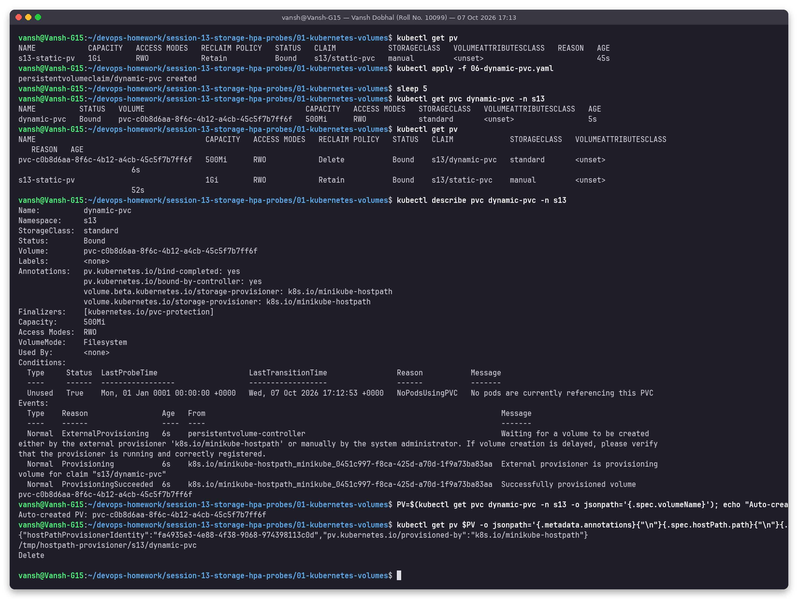

The access-mode table (RWO / ROX / RWX / RWOP) and reclaim-policy table (Retain / Delete / Recycle) are in the
Task 1 README, section 8.

---

## Task 2: HPA hands-on

Files in [`02-hpa/`](02-hpa/):

| File | What |
|---|---|
| [`php-apache.yaml`](02-hpa/php-apache.yaml) | Deployment `php-apache` (`registry.k8s.io/hpa-example`, CPU-burning PHP page) with **requests cpu 200m**, limits 500m, + Service |
| [`hpa.yml`](02-hpa/hpa.yml) | `autoscaling/v2` HPA: **min 1, max 10, CPU 50%**; `behavior.scaleDown.stabilizationWindowSeconds: 60` (default 300) so scale-down is visible in the demo |
| [`load-generator.yaml`](02-hpa/load-generator.yaml) | Deployment of busybox pods running `while true; do wget -q -O- http://php-apache...; done` (in-cluster version of the instructor's `hpa/load_generator.sh`, no port-forward needed) |

Script: [`scripts/02-hpa.sh`](scripts/02-hpa.sh).

### Why CPU requests are required
The HPA computes `utilization = current CPU usage / CPU request`. Without `resources.requests.cpu` the
percentage is undefined and the HPA shows `<unknown>`. The formula used:

```text
desiredReplicas = ceil( currentReplicas * currentUtilization / targetUtilization )
e.g. 1 pod at 250%  -> ceil(1 * 250 / 50) = 5 pods
```

### Step 1: Deploy the app

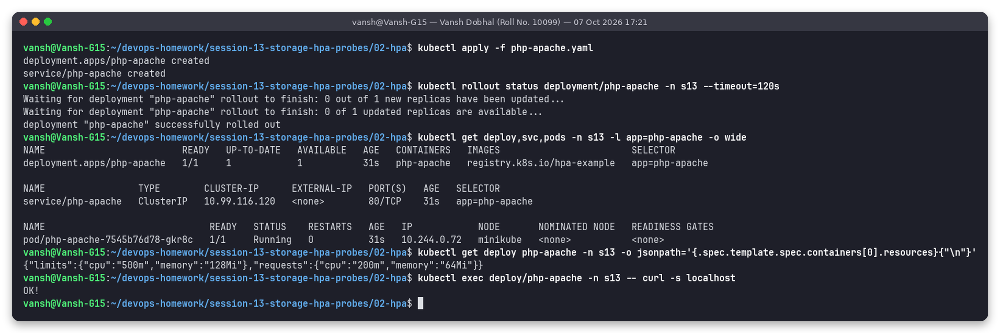

1 pod Running, resources `requests cpu 200m / limits 500m`, `curl localhost` returns `OK!`.

### Step 2: Configure and verify the HPA

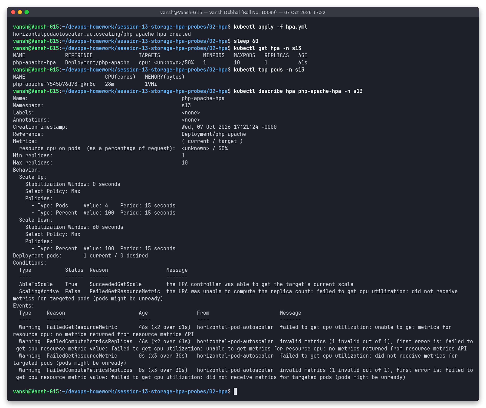

Right after creation the HPA shows `cpu: <unknown>/50%` with `FailedGetResourceMetric ... no metrics returned
from resource metrics API` and later `did not receive metrics for targeted pods`. metrics-server scrapes every
15-60 s, so a brand new pod has no metrics for the first minute; `kubectl top` already reported 28m. `describe`
also shows the behavior I configured: scale-up window 0 s (policies 4 pods or 100% per 15 s), scale-down window 60 s.

### Step 3: Deploy the load generator

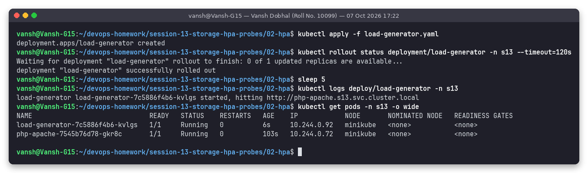

### Step 4: CPU rises and pods scale up (snapshots ~45 s apart)

| Time (UTC) | Load | `kubectl get hpa` TARGETS | REPLICAS | Observation | Screenshot |
|---|---|---|---|---|---|
| 17:23:20 | 1 generator | 51%/50% | 1 | php-apache at 103m | [t1](02-hpa/screenshots/04-load-t1.png) |
| 17:24:06 | 1 generator | **250%/50%** | 1 -> 5 | single pod pinned at its 500m **limit**; 4 new pods 9 s old | [t2](02-hpa/screenshots/04-load-t2.png) |
| 17:24:52 | 1 generator | 250%/50% (stale) | 5 | `top` already shows load spread: 156-262m per pod | [t3](02-hpa/screenshots/04-load-t3.png) |
| ~17:25:00 | **scaled generator to 3** | | | "increase load" | [05](02-hpa/screenshots/05-increase-load.png) |
| 17:25:45 | 3 generators | 96%/50% | 6 | | [t4](02-hpa/screenshots/04-load-t4.png) |
| 17:26:32 | 3 generators | 105%/50% | **10 (max)** | every pod ~190-230m | [t5](02-hpa/screenshots/04-load-t5.png) |
| 17:27:19 | 3 generators | 90%/50% | 10 | capped by `maxReplicas: 10` | [t6](02-hpa/screenshots/04-load-t6.png) |

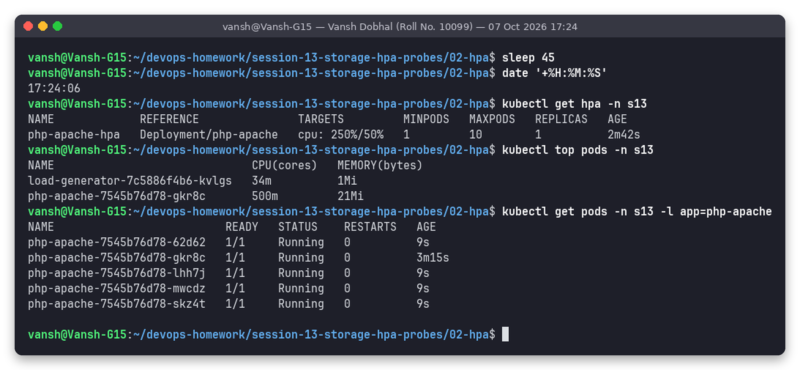

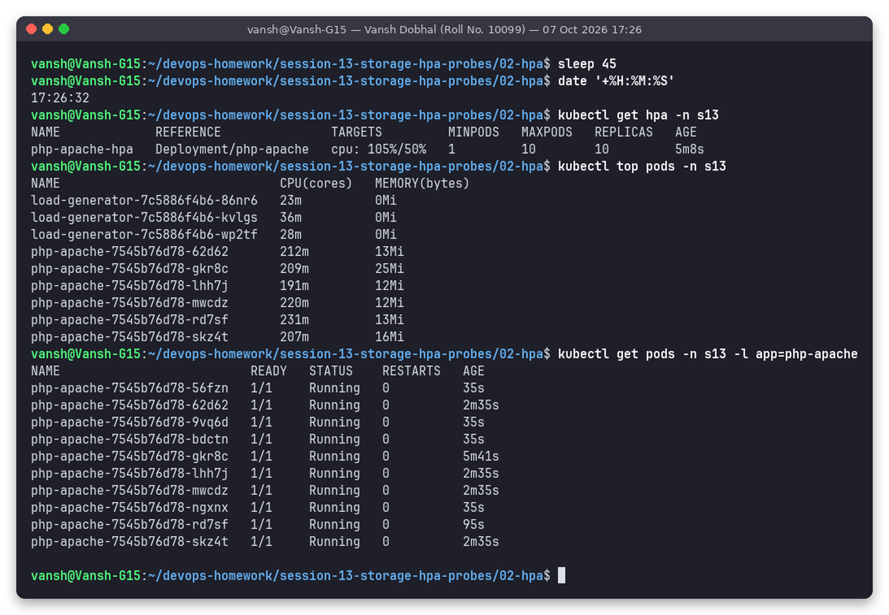

`describe hpa` at full scale:

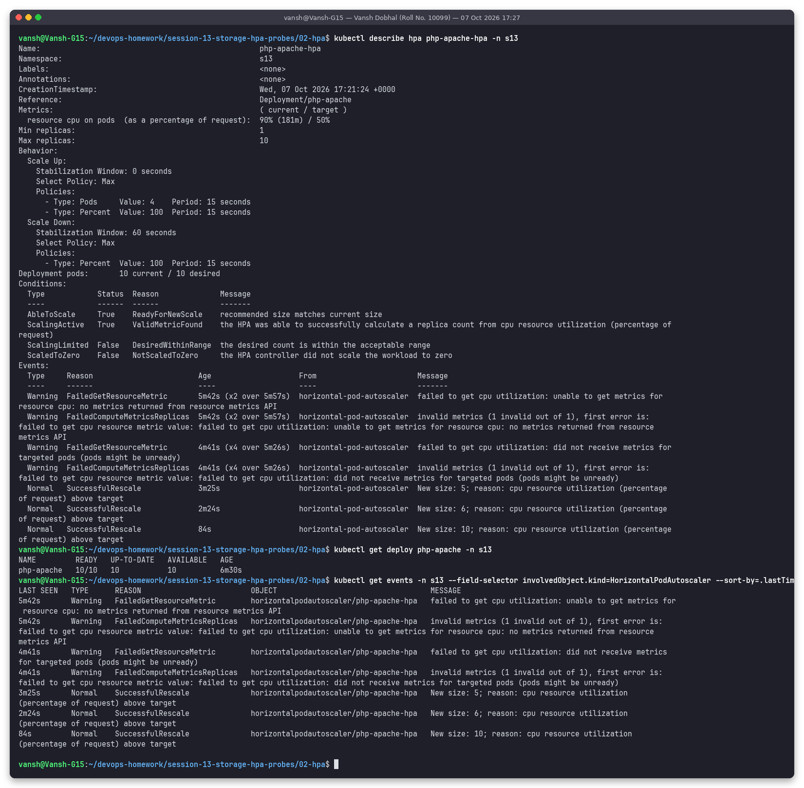

Events `SuccessfulRescale  New size: 5`, `New size: 6`, `New size: 10; reason: cpu resource utilization
(percentage of request) above target`, current `90% (181m) / 50%`.

### Step 5: Remove load and watch scale-down

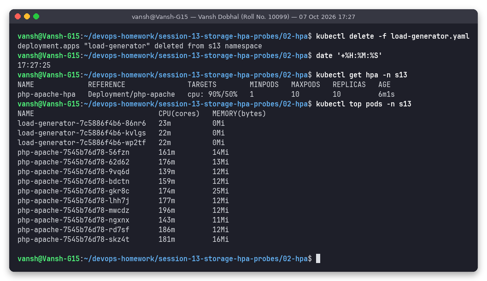

| Time (UTC) | TARGETS | REPLICAS / pods | Screenshot |
|---|---|---|---|
| 17:27:25 | 90%/50% (load generator just deleted) | 10 | [07](02-hpa/screenshots/07-remove-load.png) |
| 17:28:16 | 77%/50% (metrics lag ~1 min) | 10 | [t1](02-hpa/screenshots/08-scale-down-t1.png) |
| 17:29:13 | 20%/50% | 10 (inside the 60 s stabilization window) | [t2](02-hpa/screenshots/08-scale-down-t2.png) |
| 17:30:05 | 0%/50% | **4** | [t3](02-hpa/screenshots/08-scale-down-t3.png) |
| 17:30:57 | 0%/50% | **1 pod running** (`get hpa` column still said 4, updated on the next sync) | [t4](02-hpa/screenshots/08-scale-down-t4.png) |

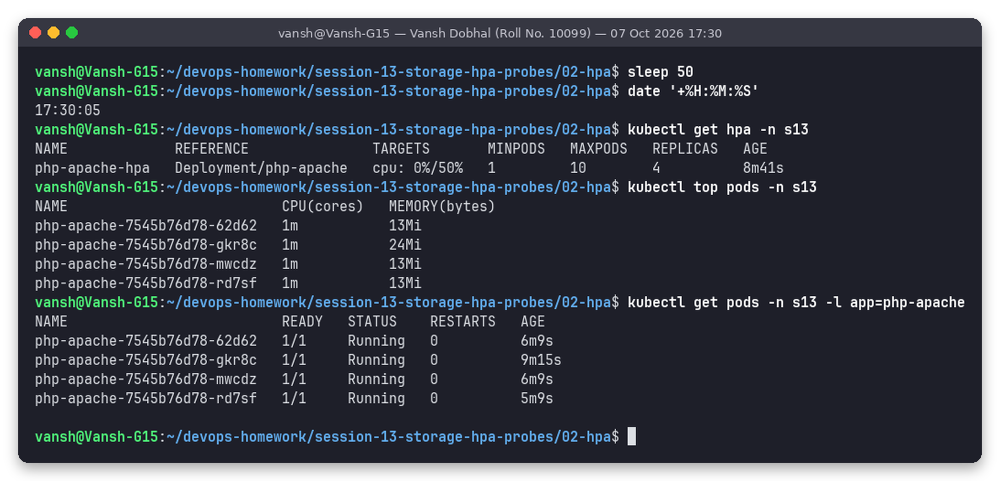

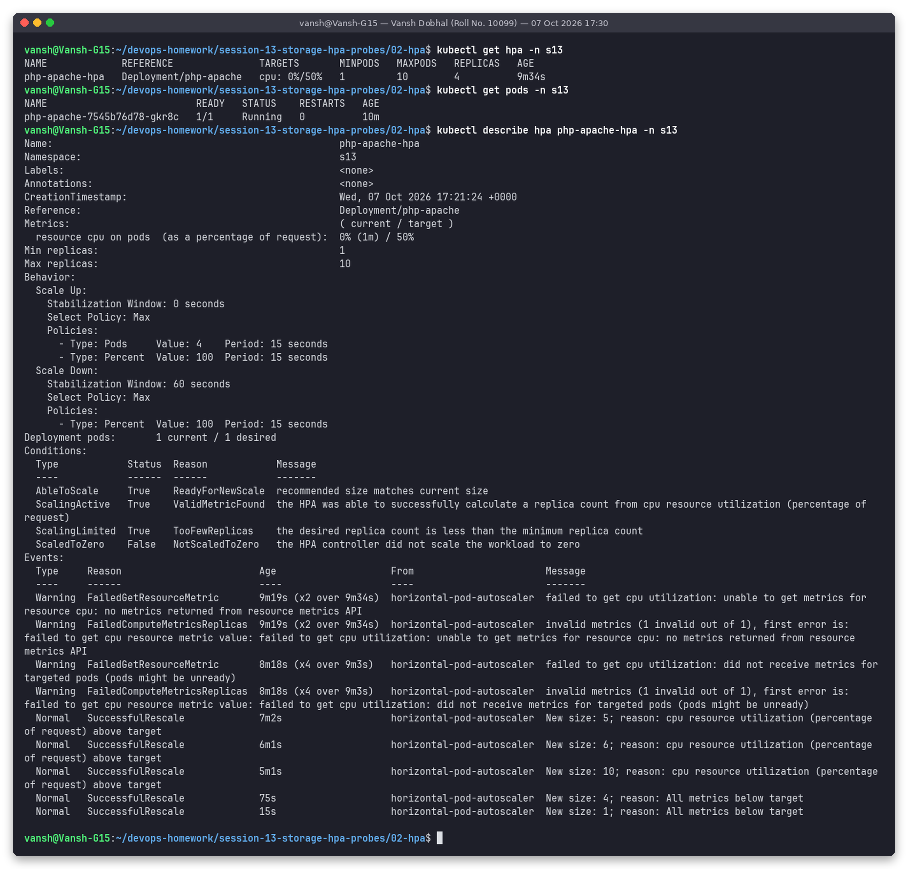

Final events: `New size: 4; reason: All metrics below target` then `New size: 1`; condition
`ScalingLimited True TooFewReplicas` (desired 0 is below `minReplicas: 1`). So from removing the load to
1 replica took about 3.5 minutes with the 60 s window. With the **default 300 s window** it takes over 5 minutes
after the metric drops, which I observed for real in the mini project (5 -> 2 replicas ~5 min after the
CPU fell to 1%).

### What I learned from the HPA run
- Metrics lag: the HPA reacts to metrics that are 15-60 s old, so it overshoots a bit (it went 6 -> 10).
- A single pod can never show more than `limit/request` = 500m/200m = 250% (seen at t2/t3).
- Scale-up is fast (window 0 s), scale-down is deliberately slow to avoid flapping.
- `kubectl get hpa`, `kubectl top pods`, `kubectl get pods`, `kubectl describe hpa` (Events + Conditions) together tell the whole story.

---

## Probes: liveness, readiness, startup

Files in [`03-probes/`](03-probes/) (adapted from the instructor's `05-probes`), script [`scripts/03-probes.sh`](scripts/03-probes.sh)
(the two restart demos were re-captured with [`scripts/03b-probes-recapture.sh`](scripts/03b-probes-recapture.sh) after adding
`terminationGracePeriodSeconds: 5`: `sh` as PID 1 ignores SIGTERM, so the first capture caught the pod still
inside the default 30 s kill grace period, showing the `Killing` event but no restart yet).

| Probe | Question it answers | On failure |
|---|---|---|
| **livenessProbe** | Is the container still working? | kubelet kills and restarts the container |
| **readinessProbe** | Can it serve traffic right now? | Pod removed from Service endpoints, no restart |
| **startupProbe** | Has it finished starting? | Restart after `failureThreshold x periodSeconds`; liveness/readiness are disabled until it succeeds |

Probe mechanisms: `httpGet` (2xx/3xx = success), `tcpSocket`, `exec` (exit 0 = success), `grpc`.
Timing fields: `initialDelaySeconds`, `periodSeconds`, `timeoutSeconds`, `failureThreshold`, `successThreshold`.

### Liveness (exec) restarts an unhealthy container: [`01-liveness-exec.yaml`](03-probes/01-liveness-exec.yaml)

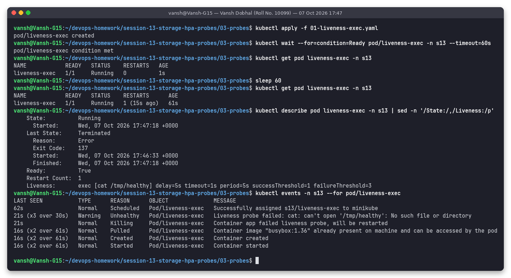

The container deletes `/tmp/healthy` after 30 s. Events: `Liveness probe failed: cat: can't open '/tmp/healthy'
(x3 over 30s)` -> `Container app failed liveness probe, will be restarted`; `RESTARTS 1`, `Last State:
Terminated, Exit Code 137` (killed by the kubelet).

### Liveness (httpGet) healthy: [`02-liveness-http.yaml`](03-probes/02-liveness-http.yaml) (instructor's file)

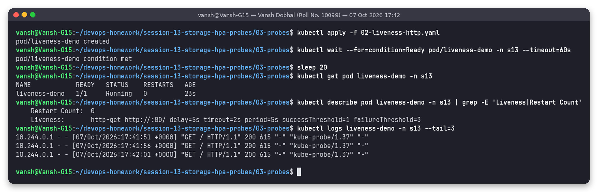

nginx access log shows the kubelet's probes (`"GET / HTTP/1.1" 200 ... "kube-probe/1.37"`) every 5 s, 0 restarts.

### Readiness gates traffic: [`03-readiness.yaml`](03-probes/03-readiness.yaml)

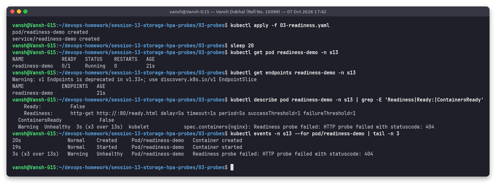

Probe path `/ready.html` does not exist yet -> `Readiness probe failed: HTTP probe failed with statuscode: 404`,
pod `Running` but `0/1`, Service endpoints **empty**.

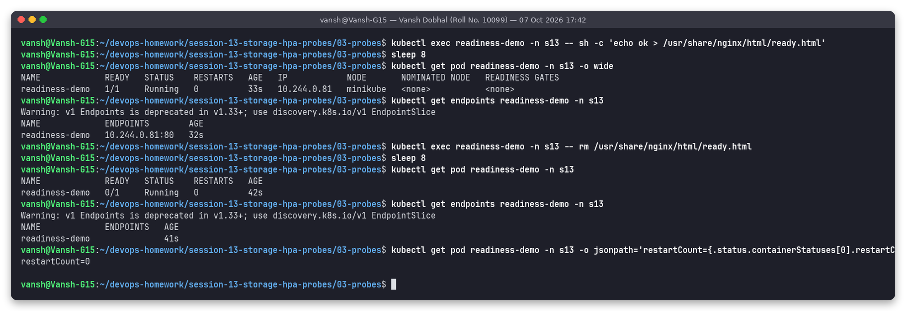

After creating the file: `1/1` and endpoint `10.244.0.81:80` appears. After deleting it again: back to `0/1`,
endpoints empty, `restartCount=0`. Readiness never restarts anything.

### Startup probe protects a slow-starting app: [`04-startup.yaml`](03-probes/04-startup.yaml)

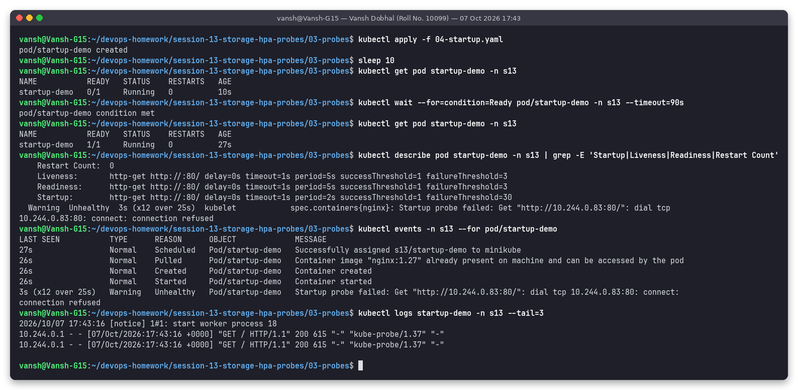

The container sleeps 25 s before nginx starts. `Startup probe failed: ... connection refused (x12 over 25s)`
but the budget is 30 x 2 s = 60 s, so the pod became `1/1 Running` at 27 s with **0 restarts**. Without a
startup probe, the liveness probe (period 5 s, threshold 3) would have killed it at ~15 s.

### Startup budget too short: [`05-startup-too-short.yaml`](03-probes/05-startup-too-short.yaml)

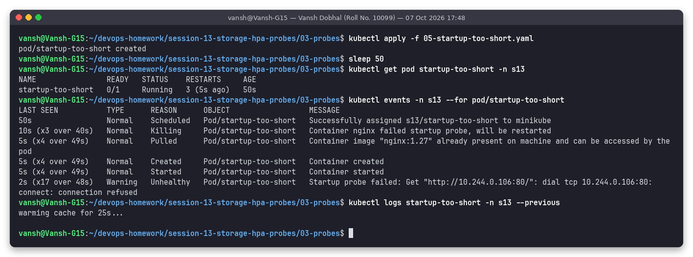

Same app with only 5 x 2 s = 10 s: `Container nginx failed startup probe, will be restarted (x3 over 40s)`,
`RESTARTS 3` after 50 s, and `logs --previous` shows only `warming cache for 25s...`: it is killed before it
can ever start, a restart loop caused purely by a badly sized probe.

---

## Task 3: Mini project (PVC + HPA + probes)

Full write-up: **[mini-project/README.md](mini-project/README.md)** (namespace `s13-mini`).

- PVC `web-data` 500Mi RWO bound dynamically; Deployment `web-app` (2 replicas, probes, requests/limits, `/data` on the PVC), Service `web-service`, HPA 2-5 @ 50%.
- **Storage persistence:** `Student: Vansh Dobhal (Roll No. 10099)` written to `/data/student.txt`, pod deleted, file read back from the replacement pod (and still there at the very end after three rollouts).
- **Service:** port-forward + curl. The first attempt failed for real (`8080 already in use`) and is documented; the second on port 18013 worked.
- **HPA:** the assignment's single `kubectl run` generator only reached 13%, so I added 4 more generators -> 71% -> 139% -> 5 replicas (max). Scale-down with the default 300 s window: 5 -> 2 about 5 minutes after CPU dropped (second pass).
- **Bonus 2 / 3:** readiness path `/does-not-exist` -> all pods `0/1`, endpoints empty; liveness path `/crash` -> 3 restarts in 75 s.

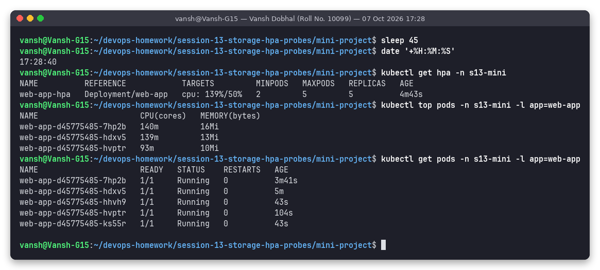

---

## Deliverables checklist

| Deliverable | Where |
|---|---|
| Volume docs | [01-kubernetes-volumes/README.md](01-kubernetes-volumes/README.md) |
| HPA YAML | [02-hpa/hpa.yml](02-hpa/hpa.yml) (+ [php-apache.yaml](02-hpa/php-apache.yaml)) |
| Load generator | [02-hpa/load-generator.yaml](02-hpa/load-generator.yaml), [mini-project/load-generator.yaml](mini-project/load-generator.yaml) |
| HPA output | [02-hpa/outputs/](02-hpa/outputs/) (text of every capture) |
| Screenshots | `*/screenshots/*.png` |
| Mini project | [mini-project/](mini-project/) |
| README | this file + one per task |

## Honest notes

- The only two re-captures (probes restart demos and the mini project's Service test / scale-down) are explained above; the first attempts are kept where they are informative (`mini-project/screenshots/06-task2-service.png`, `12-task3-scale-down-t*.png`).
- `kubectl get hpa -w` / `get pods -w` stream forever, so repeated snapshots with timestamps (`date`) were taken instead.
- Mini-project bonus challenge 1 (30% target) was not run separately.

## Folder structure

```text
session-13-storage-hpa-probes/
├── README.md
├── 01-kubernetes-volumes/   namespace.yaml, 01..07 *.yaml, README.md, screenshots/ (10), outputs/
├── 02-hpa/                  php-apache.yaml, hpa.yml, load-generator.yaml, screenshots/ (17), outputs/
├── 03-probes/               01-liveness-exec.yaml, 02-liveness-http.yaml, 03-readiness.yaml, 04-startup.yaml, 05-startup-too-short.yaml, screenshots/ (6), outputs/
├── mini-project/            namespace/pvc/deployment/service/hpa/load-generator .yaml, README.md, screenshots/, outputs/
└── scripts/                 01-volumes.sh, 02-hpa.sh, 03-probes.sh, 03b-probes-recapture.sh, 04-mini-project.sh, 04b-mini-project-rerun.sh
```

## How to reproduce

```bash
# inside WSL with minikube running (metrics-server, storage-provisioner, default-storageclass enabled)
cd ~/devops-homework/session-13-storage-hpa-probes
bash scripts/01-volumes.sh        # Task 1   (~3 min)
bash scripts/02-hpa.sh            # Task 2   (~12 min, waits for real scaling)
bash scripts/03-probes.sh         # probes   (~5 min)
bash scripts/04-mini-project.sh   # Task 3   (~20 min)
# plain kubectl equivalent of the HPA part:
kubectl apply -f 01-kubernetes-volumes/namespace.yaml -f 02-hpa/php-apache.yaml -f 02-hpa/hpa.yml
kubectl apply -f 02-hpa/load-generator.yaml; kubectl get hpa -n s13 -w
kubectl delete -f 02-hpa/load-generator.yaml
kubectl delete namespace s13 s13-mini   # cleanup
```
