# Task 3: Mini Project - Production-Ready Kubernetes Web App (PVC + HPA + Probes)

**Name:** Vansh Dobhal | **Roll No:** 10099

Based on the instructor's `session-13-storage-hpa-probes/mini-project/README.md`. The YAML is the
instructor's, with one change: namespace `production-webapp` became **`s13-mini`** (my assigned namespace
on the shared cluster). Scripts: [`../scripts/04-mini-project.sh`](../scripts/04-mini-project.sh) (first pass) and
[`../scripts/04b-mini-project-rerun.sh`](../scripts/04b-mini-project-rerun.sh) (second pass, explained below).

## Architecture

```text
                       [ Service: web-service  ClusterIP 10.101.6.188:80 ]
                                      │
                ┌─────────────────────┼─────────────────────┐
                ▼                     ▼                     ▼
          [ Pod web-app-1 ]     [ Pod web-app-2 ]  ...  [ Pod web-app-N ]   (2..5, HPA)
          startup / readiness / liveness probes (httpGet / :80)
          requests cpu 100m mem 64Mi, limits cpu 200m mem 128Mi
          volumeMount /data ──────────────┐
                                           ▼
                    PVC web-data (500Mi, RWO) -> PV pvc-8e004a46-... (auto-created)
                                           ▼
                    StorageClass standard (k8s.io/minikube-hostpath)

          [ HPA web-app-hpa: min 2, max 5, target 50% CPU ] <── metrics-server
```

| File | Content |
|---|---|
| [`namespace.yaml`](namespace.yaml) | Namespace `s13-mini` |
| [`pvc.yaml`](pvc.yaml) | `web-data`, 500Mi, ReadWriteOnce, default StorageClass |
| [`deployment.yaml`](deployment.yaml) | `web-app`, 2 replicas, `strategy: Recreate`, nginx:1.27, requests/limits, startup + readiness + liveness probes, PVC at `/data` |
| [`service.yaml`](service.yaml) | `web-service`, ClusterIP, port 80 |
| [`hpa.yaml`](hpa.yaml) | `web-app-hpa`, autoscaling/v2, min 2 / max 5 / 50% CPU |
| [`load-generator.yaml`](load-generator.yaml) | Extra load (4 busybox wget loops), added by me because one generator was not enough (see Task 3) |

`strategy: Recreate` matters: the PVC is ReadWriteOnce, so the old pods are stopped before the new ones
start on a rollout. (All replicas can share it here only because minikube has a single node; RWO is per node.)

---

## 5. Step-by-step deployment

### 5.1 + 5.2 Namespace and PVC

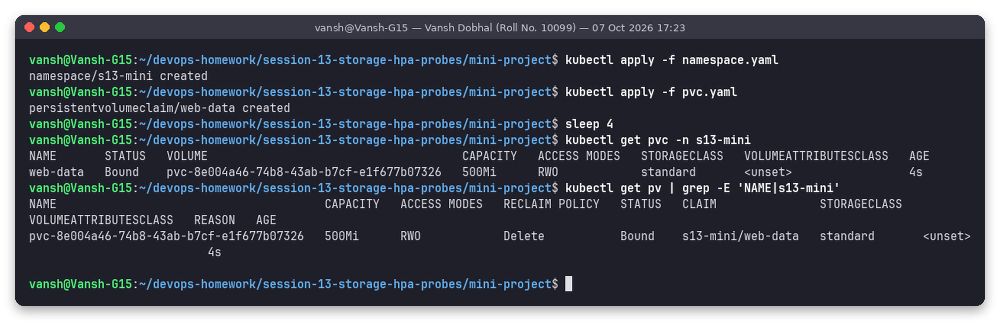

`web-data` is `Bound` after 4 s to the dynamically provisioned `pvc-8e004a46-74b8-43ab-b7cf-e1f677b07326` (500Mi, RWO, `standard`, reclaim `Delete`).

### 5.3 Deployment and Service

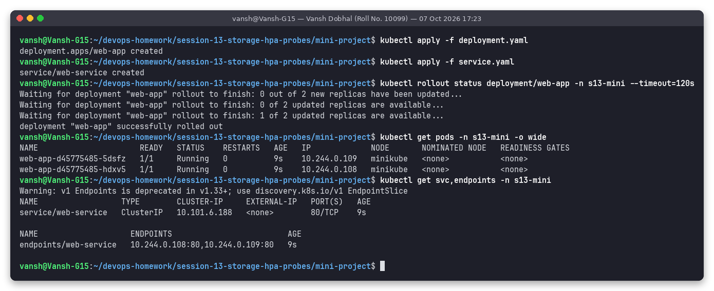

Both replicas `1/1 Running`; `web-service` endpoints `10.244.0.108:80,10.244.0.109:80`.

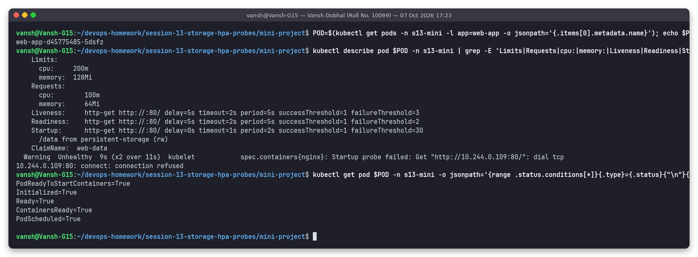

`describe pod` confirms the probes and resources from the YAML:

```text
Liveness:   http-get http://:80/ delay=5s timeout=2s period=5s successThreshold=1 failureThreshold=3
Readiness:  http-get http://:80/ delay=5s timeout=2s period=5s successThreshold=1 failureThreshold=2
Startup:    http-get http://:80/ delay=0s timeout=1s period=2s successThreshold=1 failureThreshold=30
/data from persistent-storage (rw)    ClaimName: web-data
```

It also caught a real `Startup probe failed: ... connect: connection refused` event from the first second
of the pod's life (before nginx was listening). That is exactly what the startup probe is for: it tolerated
the failures (up to 30 x 2 s) and then passed, so no restart happened.

### 5.4 HPA

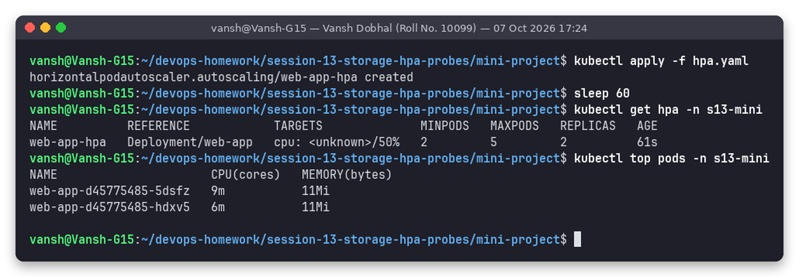

60 s after creation the HPA still showed `cpu: <unknown>/50%` while `kubectl top` already had numbers
(9m / 6m). metrics-server needs a couple of scrapes for new pods; the HPA filled in the value shortly afterwards
(`13%/50%` in the next screenshot). See also troubleshooting Issue 2 of the assignment.

---

## 6. Verification tasks

### Task 1: Verify storage persistence

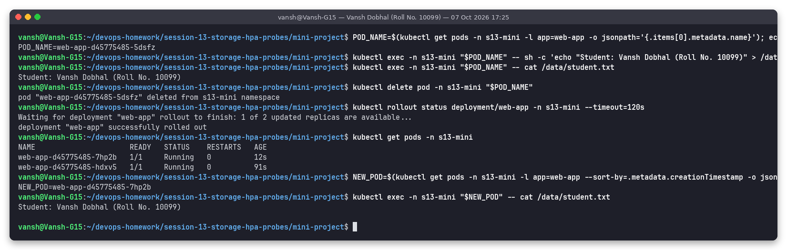

1. Wrote `Student: Vansh Dobhal (Roll No. 10099)` to `/data/student.txt` in pod `web-app-d45775485-5dsfz`.
2. Deleted that pod; the ReplicaSet created `web-app-d45775485-7hp2b`.
3. The new pod reads the same file: **data survived the pod deletion** because it lives on the PV, not in the container.

(I picked the *newest* pod with `--sort-by=.metadata.creationTimestamp` so the check really ran on the replacement pod.)

### Task 2: Service verification (port-forward + curl)

First attempt, [`06-task2-service.png`](screenshots/06-task2-service.png): `kubectl port-forward ... 8080:80`
**failed** with `bind: address already in use`, because another program on this machine already listens on
8080, and the `curl localhost:8080` answered from that other program (`Hello World from Docker Multi-Stage Build!`),
not from my Service. I kept that screenshot as a real example of a misleading test.

Second attempt on a free port:

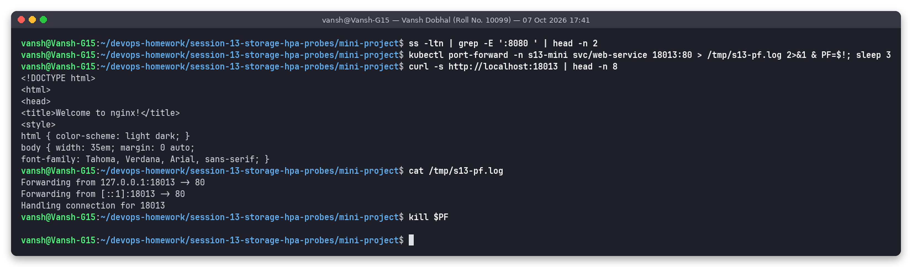

`Forwarding from 127.0.0.1:18013 -> 80`, `Handling connection for 18013`, and `curl` returns the
`Welcome to nginx!` page from `web-service`.

### Task 3: Trigger HPA elastic scaling

**Load with the assignment's single generator** (`kubectl run load-generator ... wget loop`):

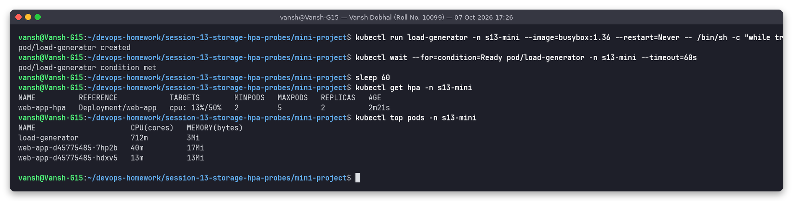

CPU only reached **13%/50%**: nginx serving a static page is very cheap (40m + 13m), while the single
busybox loop itself is the bottleneck (712m in the generator pod). So I added
[`load-generator.yaml`](load-generator.yaml) (4 more loops):

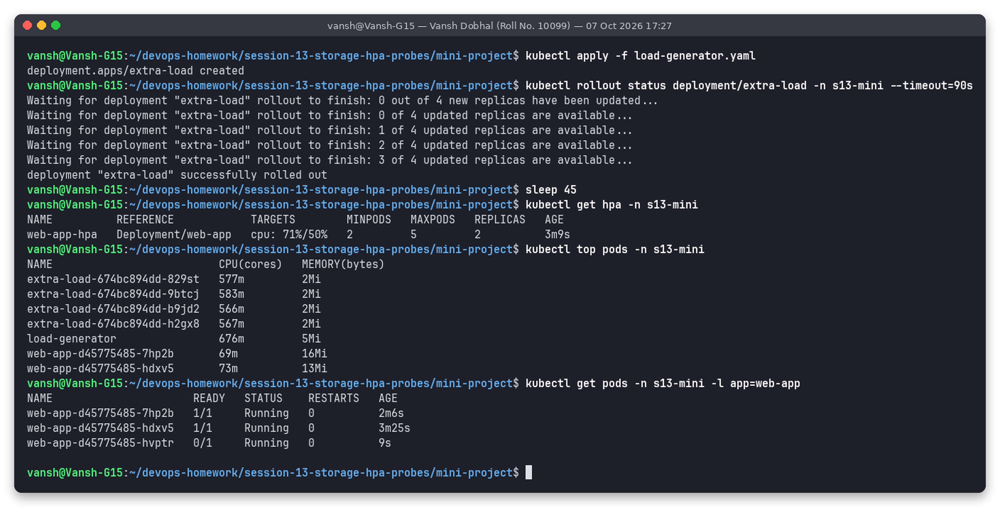

Now **71%/50%** and a third pod is already being created (`0/1 Running`, waiting for its probes).

Scale-out snapshots ~45 s apart:

| Time (UTC) | TARGETS | REPLICAS | Screenshot |
|---|---|---|---|
| 17:27:53 | 71%/50% | 3 | [t1](screenshots/09-task3-scale-out-t1.png) |
| 17:28:40 | 139%/50% | 5 (max) | [t2](screenshots/09-task3-scale-out-t2.png) |
| 17:29:27 | 88%/50% | 5 | [t3](screenshots/09-task3-scale-out-t3.png) |


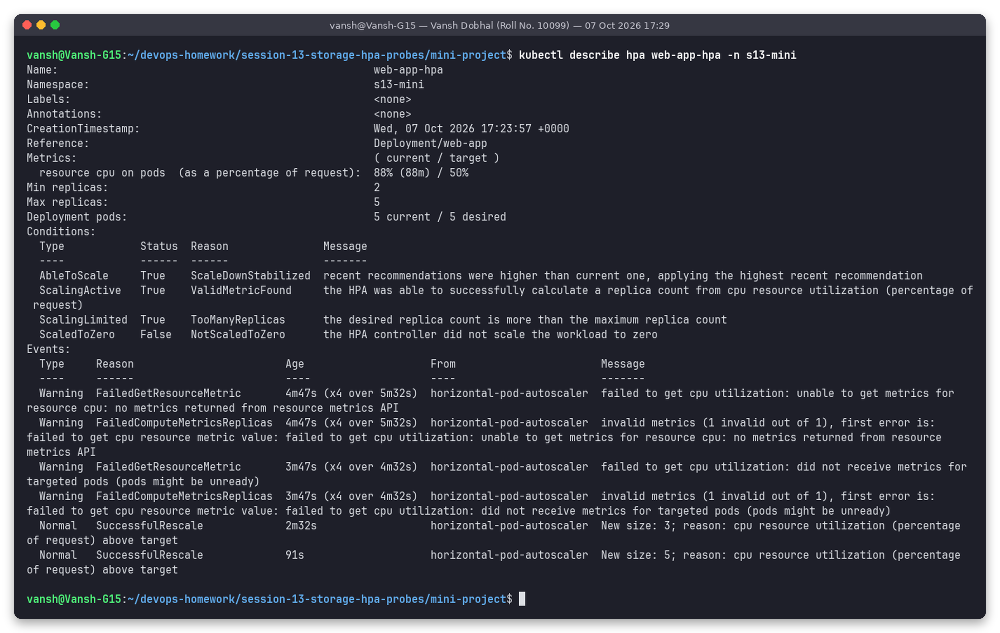

`describe hpa`: events `New size: 3` then `New size: 5`, condition `ScalingLimited True TooManyReplicas`
(it would like more than 5 but `maxReplicas: 5` caps it), current `88% (88m) / 50%`.

**Stop load and watch scale-down:**

First pass ([`11`](screenshots/11-task3-stop-load.png), [`12-...-t1..t7`](screenshots/12-task3-scale-down-t7.png), [`13`](screenshots/13-task3-describe-after-scale-down.png)):
I stopped the load at 17:30:02 and watched until 17:36:35. CPU fell to 1% by 17:32:51, but the replicas stayed at 5
and the HPA condition said `ScaleDownStabilized: recent recommendations were higher than current one`.
The HPA in this mini project has **no `behavior` section**, so the default 300 s scale-down stabilization
window applies, and that window starts only when the *recommendation* drops (metrics lag ~1-2 min behind).
My watch ended just before the window expired.

So I ran the cycle again (second pass, [`04b-mini-project-rerun.sh`](../scripts/04b-mini-project-rerun.sh)) and watched for 9 minutes:

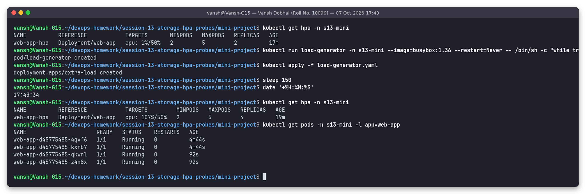

| Time (UTC) | Event | TARGETS | REPLICAS |
|---|---|---|---|
| 17:43:34 | load running for 150 s | 107%/50% | 4 |
| 17:44:07 | load generators deleted ([18](screenshots/18-rerun-stop-load.png)) | 101%/50% | 4 |
| 17:45:08 | metrics still lagging, HPA even went to 5 | 83%/50% | 5 |
| 17:46:09 | CPU idle | 1%/50% | 5 |
| 17:47:10 - 17:50:16 | stabilization window, no change ([t3](screenshots/19-rerun-scale-down-t3.png) ... [t6](screenshots/19-rerun-scale-down-t6.png)) | 1%/50% | 5 |
| 17:51:18 | **scaled down** ([t7](screenshots/19-rerun-scale-down-t7.png)) | 1%/50% | **2** |

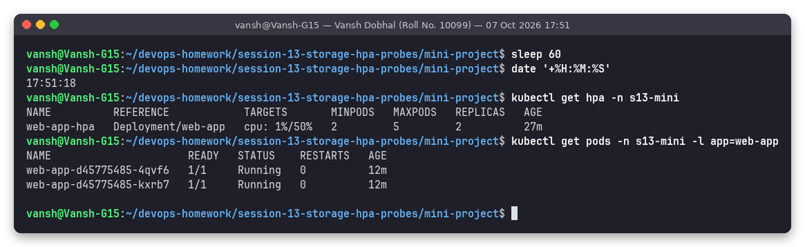

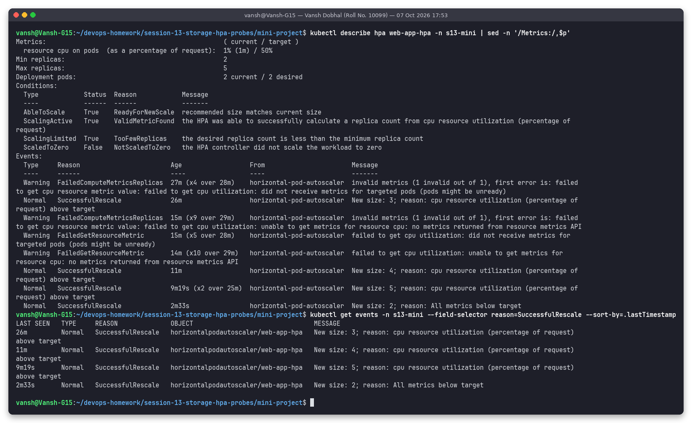

Event `New size: 2; reason: All metrics below target`; condition `ScalingLimited True TooFewReplicas`
(desired would be 1, but `minReplicas: 2`). The scale-down came about 5 minutes after the last high
recommendation, which matches the default 300 s window.

---

## 7. Probe diagnostics reference

| Probe | Question | On failure | Seen in this project |
|---|---|---|---|
| Startup | Has the process finished initialising? | Restart container (liveness/readiness are paused until it passes) | `Startup probe failed: connection refused` at boot, then passed, 0 restarts |
| Readiness | Can this pod receive traffic now? | Removed from Service endpoints, **no restart** | Bonus 2: 5 pods `0/1`, endpoints empty |
| Liveness | Is the container still healthy? | kubelet kills and restarts the container | Bonus 3: restarts every ~20 s |

## 8. Troubleshooting guide (what I hit or checked)

| Issue | Seen? | Check | Explanation / fix |
|---|---|---|---|
| PVC stuck in `Pending` | No, bound in 4 s | `kubectl get pvc`, `kubectl get sc` | default StorageClass `standard` + storage-provisioner running |
| HPA `TARGETS <unknown>/50%` | **Yes**, first ~60-90 s | `kubectl top pods`, `kubectl describe hpa` (`FailedGetResourceMetric ... no metrics returned`) | Normal right after creation; it persists only if metrics-server is down or `resources.requests.cpu` is missing |
| CrashLoopBackOff from probes | **Yes**, deliberately in Bonus 3 | `kubectl describe pod` events `Liveness probe failed: HTTP probe failed with statuscode: 404` | probe path must return 200-399 |
| Port-forward test hitting the wrong app | **Yes** (Task 2) | read the port-forward output: `address already in use` | use a free local port |

## 9. Bonus challenges

**Challenge 2: readiness gating** (`readinessProbe.httpGet.path` -> `/does-not-exist`, applied with `kubectl patch`):

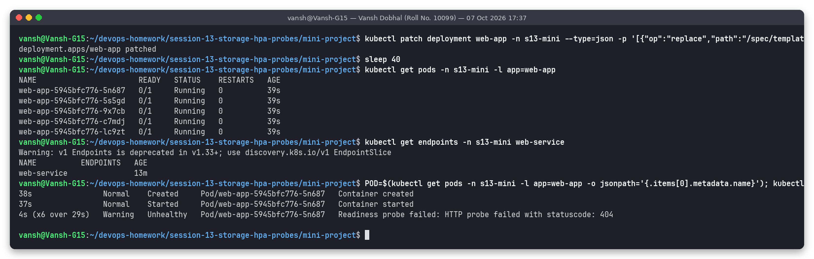

All 5 pods (HPA still had 5 at that moment) are `Running` but `READY 0/1`, `kubectl get endpoints web-service`
is **empty**, and the events say `Readiness probe failed: HTTP probe failed with statuscode: 404`. No restarts:
readiness only controls traffic.

**Challenge 3: liveness restart loop** (`livenessProbe.httpGet.path` -> `/crash`, after restoring the deployment):

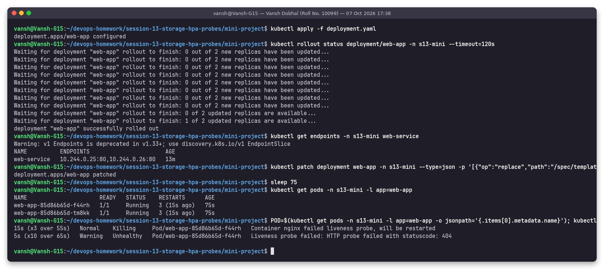

After 75 s both pods have `RESTARTS 3`; events `Liveness probe failed: HTTP probe failed with statuscode: 404`
(x10) and `Container nginx failed liveness probe, will be restarted` (x3). With `period 5s x failureThreshold 3`
the container is killed about every 15 s plus restart time.

Challenge 1 (lowering the target to 30%) was not run as a separate experiment; the scaling behaviour at 50% is fully documented above.

**Final state** after restoring the original deployment:

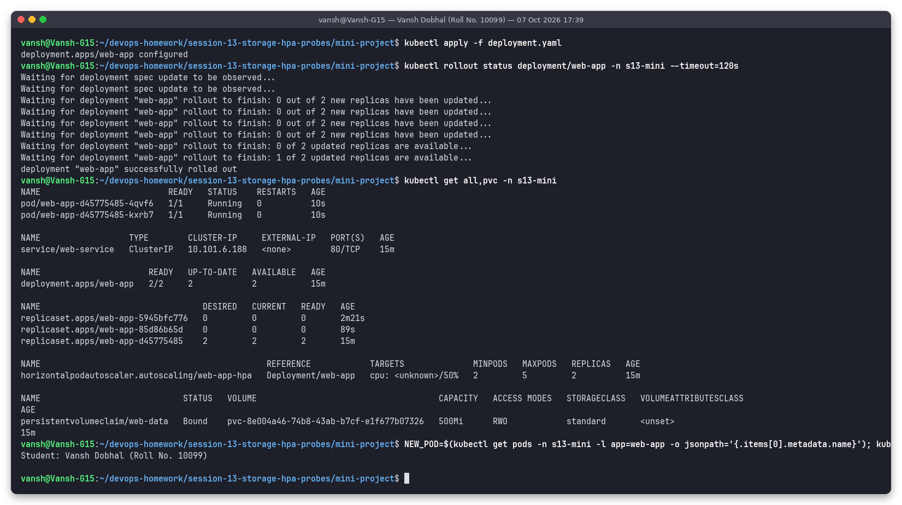

2 pods Running, HPA 2-5, PVC Bound, and `/data/student.txt` still contains
`Student: Vansh Dobhal (Roll No. 10099)` after three rollouts that replaced every pod.
