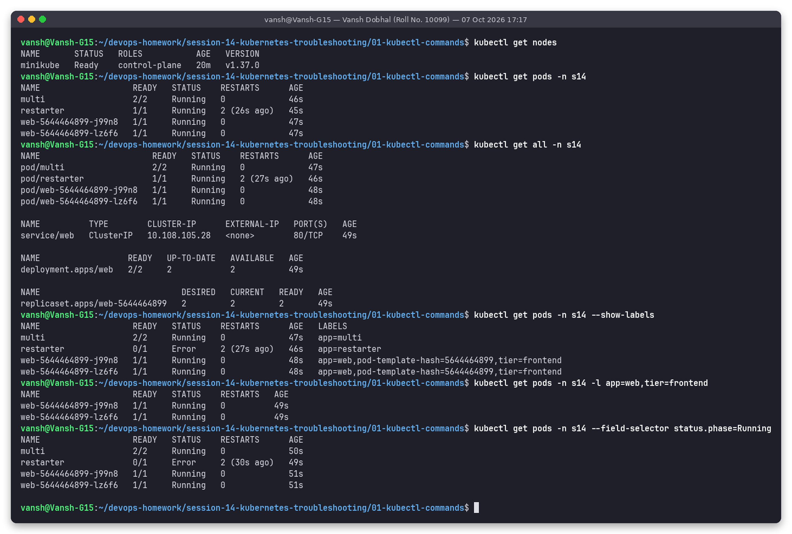
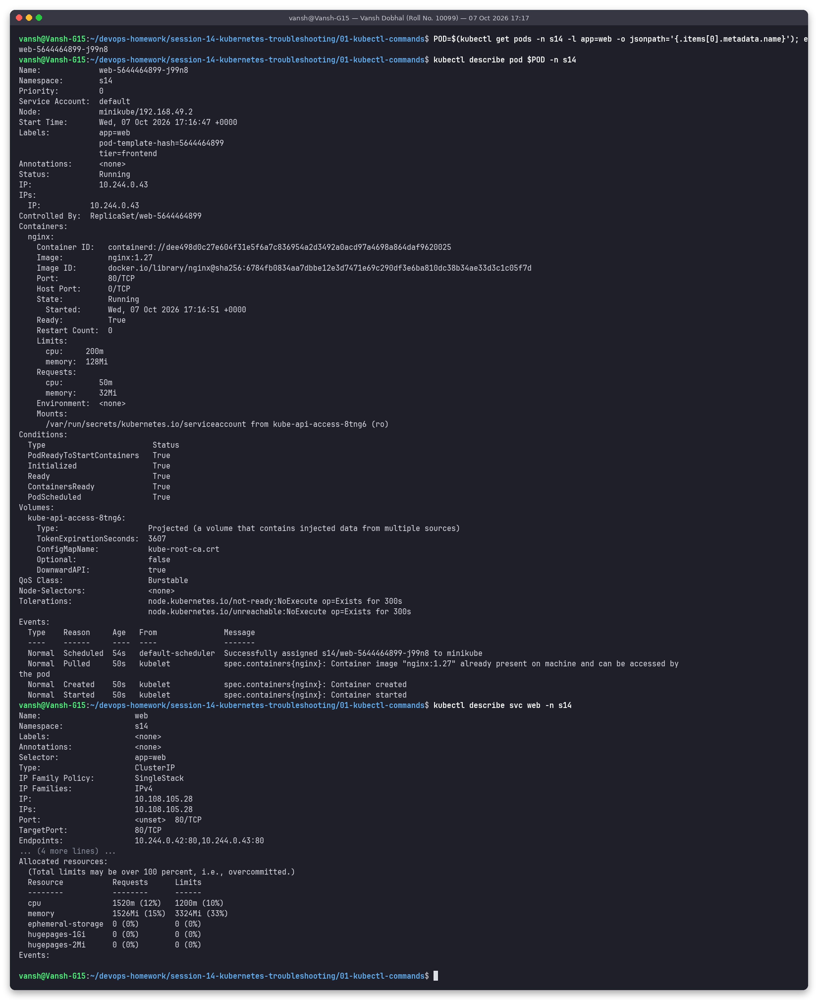
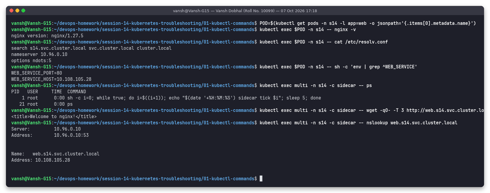
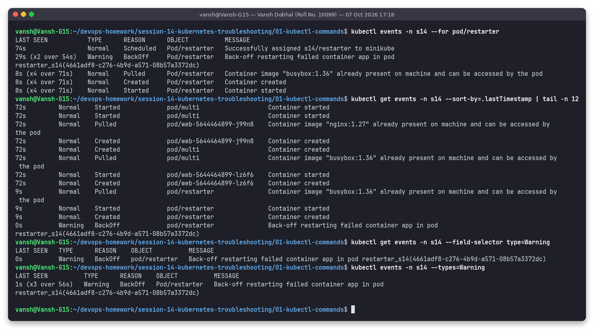
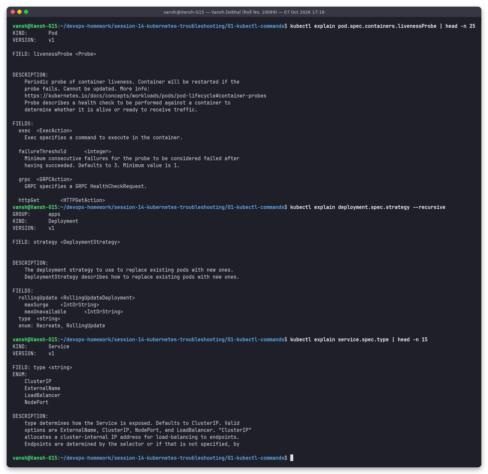
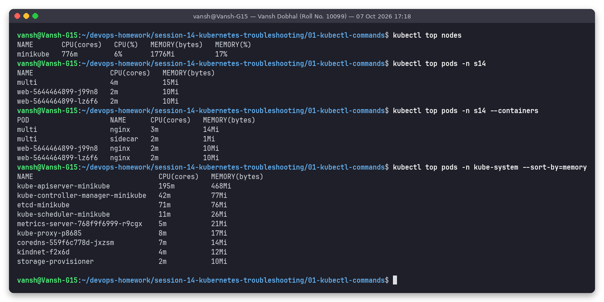
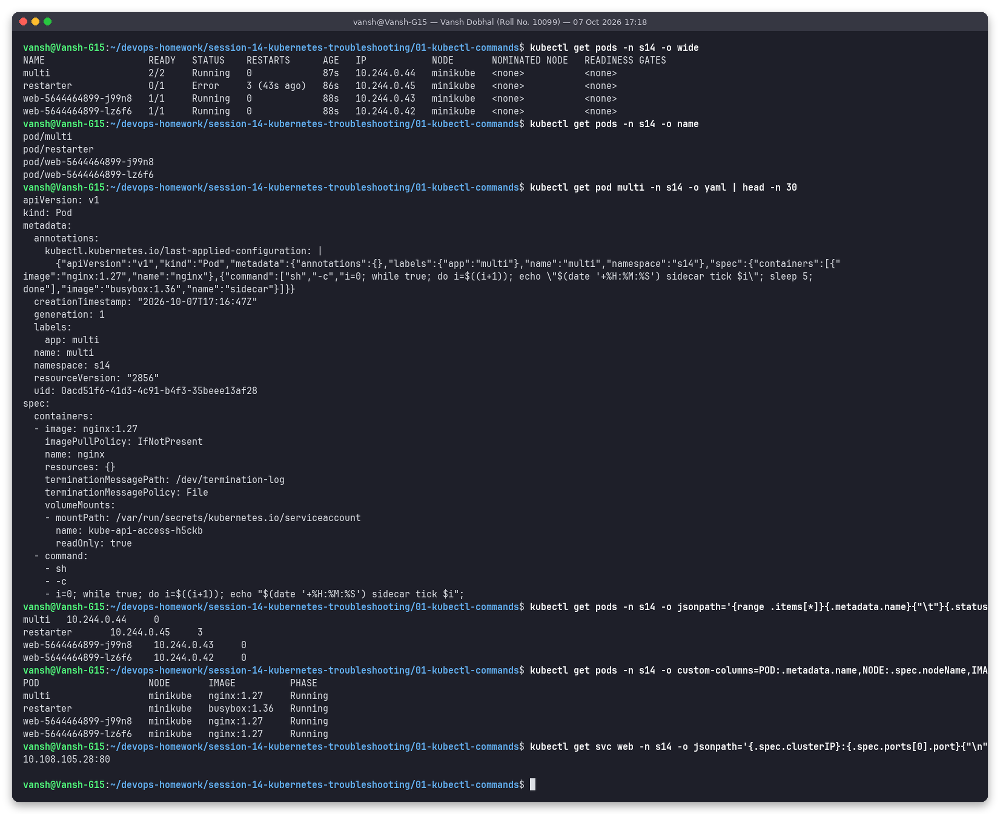

# Task 1: Hands-on with the core kubectl troubleshooting commands

**Name:** Vansh Dobhal | **Roll No:** 10099

Workloads: [`demo-app.yaml`](demo-app.yaml), applied in namespace `s14`:

| Object | Why it is there |
|---|---|
| Deployment `web` (2 x nginx, labels `app=web,tier=frontend`) + Service `web` | Normal healthy app for get/describe/exec/top |
| Pod `multi` (nginx + busybox `sidecar`) | Practise `-c <container>` with logs and exec |
| Pod `restarter` (prints, sleeps 8 s, `exit 1`) | Produces restarts and `BackOff` events, so `logs --previous` and Warning events have something to show |

Script that produced every screenshot: [`../scripts/01-kubectl-commands.sh`](../scripts/01-kubectl-commands.sh).
Text of each run: [`outputs/`](outputs/).

---

## 1. `kubectl get`: what exists and what state is it in

| Command | What it told me |
|---|---|
| `kubectl get nodes` | 1 node `minikube`, `Ready`, v1.37.0 |
| `kubectl get pods -n s14` | READY / STATUS / RESTARTS at a glance. `restarter` already shows `2 (26s ago)` restarts |
| `kubectl get all -n s14` | Pods + Service + Deployment + ReplicaSet in one view (ClusterIP of `web` = 10.108.105.28) |
| `--show-labels` | Labels decide what a Service/Deployment selects (`app=web,tier=frontend,pod-template-hash=...`) |
| `-l app=web,tier=frontend` | Label selector: only the 2 web pods |
| `--field-selector status.phase=Running` | Filter on a field. Note `restarter` is still phase `Running` while its STATUS column shows `Error`: STATUS is the container reason, phase is the pod phase |

## 2. `kubectl describe`: full detail + events for one object

`describe pod` shows things `get` hides: node and IP, `Controlled By: ReplicaSet/...`, image ID, container
`State`/`Last State`/`Restart Count`, requests/limits and resulting **QoS class** (`Burstable`), mounted volumes,
conditions (`PodScheduled`, `Initialized`, `ContainersReady`, `Ready`), tolerations and, most importantly, the
**Events** at the bottom. `describe svc web` shows `Selector`, `TargetPort` and `Endpoints` (the 2 pod IPs).
`describe node | sed -n '/Allocated resources/,/Events/p'` shows how much CPU/memory is already requested on
the node, which is what the scheduler uses to decide whether a pod fits (key for `Pending` debugging).

## 3. `kubectl logs`: what the application printed

| Command | Use |
|---|---|
| `kubectl logs deploy/web --tail=4` | Logs of one pod picked from the Deployment, only the last 4 lines |
| `kubectl logs multi -c sidecar --tail=3` | Choose a container in a multi-container pod |
| `--since=12s --timestamps` | Only recent lines, with the runtime's RFC3339 timestamps |
| `-l app=web --prefix --tail=2` | Logs from all pods matching a label, each line prefixed with `[pod/<name>/<container>]` |
| `kubectl logs restarter --previous` | Logs of the **previous, crashed** container instance: `ERROR: lost connection to queue, exiting`. This is the most important flag for CrashLoopBackOff |
| `kubectl logs multi` (no `-c`) | kubectl prints `Defaulted container "nginx" out of: nginx, sidecar` |

`kubectl logs -f` (follow) streams forever, so it cannot be captured in a non-interactive screenshot; `--tail`
and `--since` are the equivalent for a bounded snapshot.

## 4. `kubectl exec`: run commands inside a container

- `nginx -v` confirms the exact binary version in the running container (nginx/1.27.5).
- `cat /etc/resolv.conf` shows the DNS config injected by kubelet: `nameserver 10.96.0.10` (CoreDNS), search domains `s14.svc.cluster.local svc.cluster.local cluster.local`, `ndots:5`.
- `env | grep ^WEB_SERVICE` shows the Service env vars Kubernetes injects (`WEB_SERVICE_HOST=10.108.105.28`).
- `-c sidecar -- ps` shows process list in a specific container.
- `wget` to `web.s14.svc.cluster.local` and `nslookup` from inside the pod test Service routing and DNS from the pod's point of view, which is the standard way to debug connectivity.

Interactive shells (`kubectl exec -it <pod> -- sh`) work the same way but need a TTY, so single commands are used here.

## 5. Events: `kubectl events` and `kubectl get events`

- `kubectl events -n s14 --for pod/restarter` lists only events of that object, with aggregation (`x4 over 71s`): Scheduled -> Pulled -> Created -> Started, repeating, plus `Warning BackOff`.
- `kubectl get events --sort-by=.lastTimestamp` is the classic form; without sorting events come out in random order.
- `--field-selector type=Warning` / `kubectl events --types=Warning` show only problems: here only the BackOff of `restarter`.
- Events are kept for 1 hour by default, so check them soon after an incident.

## 6. `kubectl explain`: built-in API documentation

`explain pod.spec.containers.livenessProbe` documents every probe field (e.g. `failureThreshold` default 3),
`explain deployment.spec.strategy --recursive` shows the whole subtree (`type: Recreate|RollingUpdate`,
`maxSurge`, `maxUnavailable`) and `explain service.spec.type` lists the enum values. Useful when a YAML is
rejected because of a misspelled or misplaced field.

## 7. `kubectl top`: live CPU / memory (needs metrics-server)

`top nodes` (776m CPU, 1776Mi used), `top pods`, `top pods --containers` (per-container split of `multi`:
nginx 3m / sidecar 2m) and `--sort-by=memory` (kube-apiserver is the biggest at 468Mi). Used to spot
OOM candidates and to compare real usage against requests/limits.

## 8. Output formats: `-o wide`, `-o yaml`, `-o name`, `jsonpath`, `custom-columns`

| Format | Use |
|---|---|
| `-o wide` | Adds pod IP and node |
| `-o name` | `pod/<name>` lines, handy for scripting (`xargs kubectl delete`) |
| `-o yaml` | The live object including defaults the API server filled in (`imagePullPolicy: IfNotPresent`, `terminationMessagePath`, service-account token mount) |
| `-o jsonpath='{range .items[*]}...{end}'` | Extract exact fields: name, podIP, restartCount (restarter = 3) |
| `-o custom-columns=...` | Your own table (pod, node, image, phase) |

---

## Summary: which command answers which question

| Question | Command |
|---|---|
| Is it running? How many restarts? | `kubectl get pods [-o wide]` |
| Why is it in this state? | `kubectl describe pod 
` (Events section) |
| What happened cluster/namespace wide? | `kubectl events -n <ns>` / `kubectl get events --sort-by=.lastTimestamp` |
| What did the app print? Why did it crash? | `kubectl logs 
 [-c c] [--previous] [--tail N] [--since 5m]` |
| Does it work from inside? | `kubectl exec 
 -- curl/wget/nslookup/env/cat` |
| Is it using too much CPU/memory? | `kubectl top pods [--containers]` |
| What does this field mean? | `kubectl explain <resource.field>` |
| Give me one exact value | `kubectl get ... -o jsonpath=...` |
