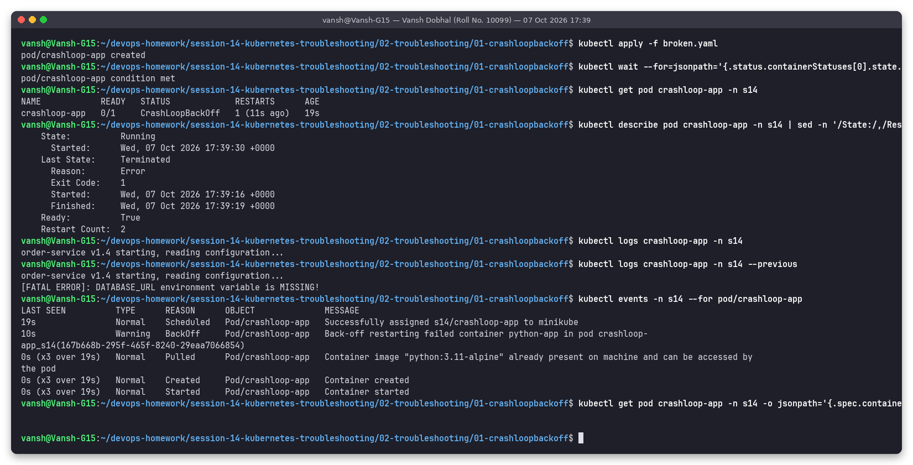
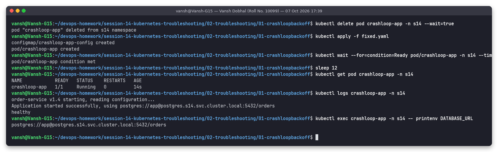

# Issue 1: CrashLoopBackOff (missing environment variable)

**Name:** Vansh Dobhal | **Roll No:** 10099

Files: [`broken.yaml`](broken.yaml), [`fixed.yaml`](fixed.yaml) | Raw output: [`outputs/before.txt`](outputs/before.txt), [`outputs/after.txt`](outputs/after.txt)

## Problem statement
The `crashloop-app` pod (a small Python "order-service", adapted from the instructor's
`scenarios/scenario-1-crashloop`) keeps restarting and is never available.

## Investigation (before)



| Step | Command | What it showed |
|---|---|---|
| 1 | `kubectl get pod crashloop-app -n s14` | `0/1 CrashLoopBackOff`, `RESTARTS 1 (11s ago)` after 19 s |
| 2 | `kubectl describe pod ... \| sed -n '/State:/,/Restart Count/p'` | `Last State: Terminated, Reason: Error, Exit Code: 1`; the container lived 3 s (Started 17:39:16, Finished 17:39:19). Exit code 1 = the application itself exited with an error (not OOM = 137, not a missing binary = 127/128) |
| 3 | `kubectl logs crashloop-app -n s14` | Current attempt has only printed `order-service v1.4 starting, reading configuration...` |
| 4 | `kubectl logs crashloop-app -n s14 --previous` | The **crashed** attempt: `[FATAL ERROR]: DATABASE_URL environment variable is MISSING!` |
| 5 | `kubectl events -n s14 --for pod/crashloop-app` | `Pulled / Created / Started (x3)` + `Warning BackOff  Back-off restarting failed container python-app` |
| 6 | `kubectl get pod ... -o jsonpath='{.spec.containers[0].env}'` | Empty: no env vars are defined in the spec at all |

Note on step 2: the describe output says `State: Running` because the snapshot caught the kubelet's next
restart attempt; `Last State` is what tells you why the previous run died.

## Root cause
The app requires `DATABASE_URL` and calls `sys.exit(1)` when it is missing. The pod spec does not define it,
so every start fails after 3 s. Because `restartPolicy: Always`, the kubelet restarts it with an exponential
back-off (10 s, 20 s, 40 s ... capped at 5 min) and shows `CrashLoopBackOff` while waiting.

## Fix
[`fixed.yaml`](fixed.yaml) adds a ConfigMap `crashloop-app-config` with `DATABASE_URL` and injects it:

```yaml
env:
  - name: DATABASE_URL
    valueFrom:
      configMapKeyRef:
        name: crashloop-app-config
        key: DATABASE_URL
```

Env vars of a running pod cannot be changed, so: `kubectl delete pod crashloop-app -n s14 && kubectl apply -f fixed.yaml`.

## Verification (after)



`1/1 Running`, `RESTARTS 0`, logs show `Application started successfully, using postgres://...` followed by
`healthy`, and `printenv DATABASE_URL` inside the container returns the value.

## Takeaways
- CrashLoopBackOff is not an error by itself, it is the kubelet waiting before the next restart. The real error is in `--previous` logs and the `Last State` exit code.
- Exit codes: `1` app error, `137` killed (OOM or SIGKILL), `139` segfault, `127` command not found, `0` with `restartPolicy: Always` = the process simply finished (e.g. missing `sleep`/foreground process).
