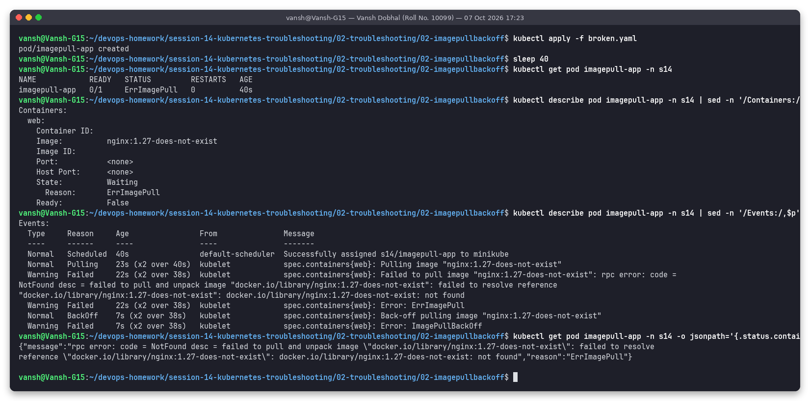
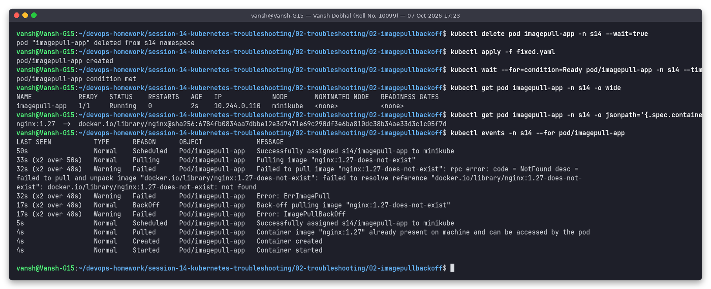

# Issue 2: ImagePullBackOff (image tag does not exist)

**Name:** Vansh Dobhal | **Roll No:** 10099

Files: [`broken.yaml`](broken.yaml), [`fixed.yaml`](fixed.yaml) | Raw output: [`outputs/before.txt`](outputs/before.txt), [`outputs/after.txt`](outputs/after.txt)

## Problem statement
Pod `imagepull-app` never starts: `READY 0/1`, STATUS alternates between `ErrImagePull` and `ImagePullBackOff`.

## Investigation (before)



| Step | Command | What it showed |
|---|---|---|
| 1 | `kubectl get pod imagepull-app -n s14` | `0/1 ErrImagePull`, 0 restarts (the container never existed) |
| 2 | `kubectl describe pod ... \| sed -n '/Containers:/,/Ready:/p'` | `Image: nginx:1.27-does-not-exist`, `State: Waiting`, `Reason: ErrImagePull`, empty `Container ID` / `Image ID` |
| 3 | `kubectl describe pod ... \| sed -n '/Events:/,$p'` | `Pulling image "nginx:1.27-does-not-exist"` -> `Failed ... code = NotFound ... docker.io/library/nginx:1.27-does-not-exist: not found` -> `Error: ErrImagePull` -> `Back-off pulling image` -> `Error: ImagePullBackOff` |
| 4 | `kubectl get pod ... -o jsonpath='{.status.containerStatuses[0].state.waiting}'` | The exact error message from containerd |

`kubectl logs` is useless here: there is no container yet, so there are no logs.

## Root cause
The registry (`docker.io`) and repository (`library/nginx`) are fine, but the **tag** `1.27-does-not-exist`
does not exist, so the registry answered `NotFound`.

**ErrImagePull vs ImagePullBackOff:** `ErrImagePull` is the status right after a failed pull attempt.
The kubelet then waits with an exponential back-off (10s, 20s, 40s ... up to 5 min) before retrying, and
during that wait the status is `ImagePullBackOff`. The events show both (`x2 over 38s`). The snapshot at
40 s happened to land on a retry, so `get` shows `ErrImagePull`; both names mean the same problem.

## Fix
`fixed.yaml` uses `image: nginx:1.27` (a real tag). The image field of a running pod is mutable, but the
clean way is delete + re-apply.

```bash
kubectl delete pod imagepull-app -n s14
kubectl apply -f fixed.yaml
```

## Verification (after)



Pod `1/1 Running`, image resolved to digest `docker.io/library/nginx@sha256:6784fb08...`, events show
`Pulled -> Created -> Started` for the new pod (the older events above them belong to the deleted pod with the same name).

## Prevention
- Pin images to tags that CI has actually pushed (or to digests), and check with `docker manifest inspect <image>` / `crane ls` before deploying.
- Private images also give `ImagePullBackOff` with `pull access denied` / `401 Unauthorized`: fix with an `imagePullSecret`.
