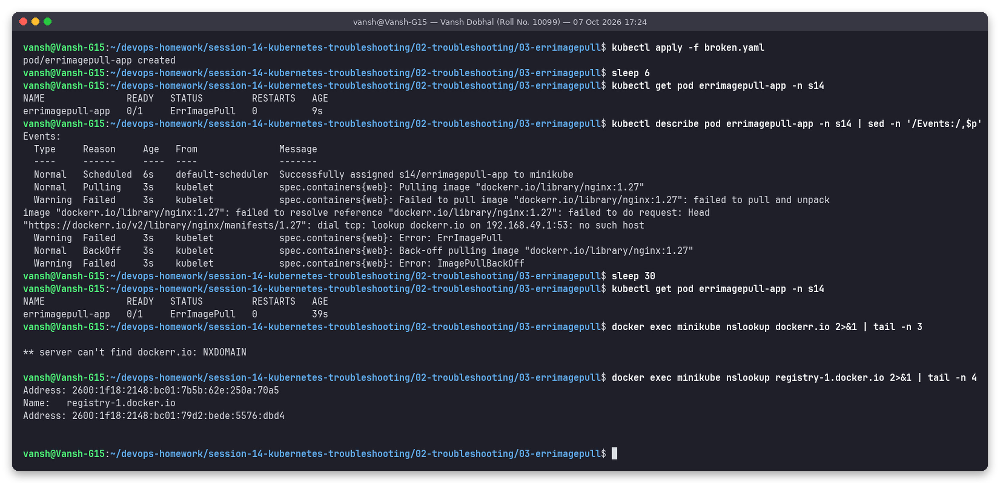
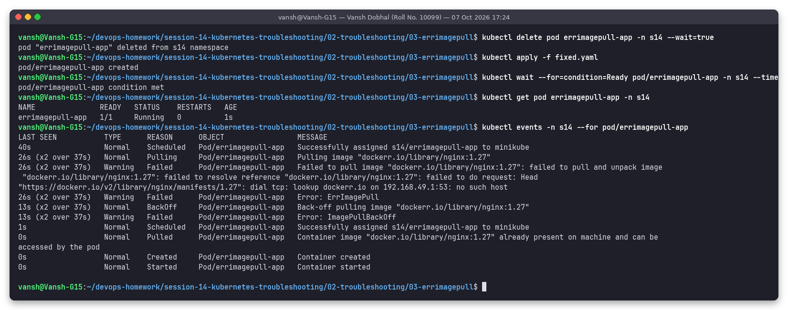

# Issue 3: ErrImagePull (registry hostname typo)

**Name:** Vansh Dobhal | **Roll No:** 10099

Files: [`broken.yaml`](broken.yaml), [`fixed.yaml`](fixed.yaml) | Raw output: [`outputs/before.txt`](outputs/before.txt), [`outputs/after.txt`](outputs/after.txt)

## Problem statement
Pod `errimagepull-app` (image `dockerr.io/library/nginx:1.27`) shows `ErrImagePull` a few seconds after creation and never starts.

## Investigation (before)

| Step | Command | What it showed |
|---|---|---|
| 1 | `kubectl get pod errimagepull-app -n s14` (6 s after apply) | `0/1 ErrImagePull` |
| 2 | `kubectl describe pod ... \| sed -n '/Events:/,$p'` | `Failed to pull image "dockerr.io/library/nginx:1.27": ... failed to do request: Head "https://dockerr.io/v2/library/nginx/manifests/1.27": dial tcp: lookup dockerr.io on 192.168.49.1:53: no such host` (full text in `outputs/before.txt`; the PNG cuts long lines), then `Back-off pulling image` / `ImagePullBackOff` |
| 3 | `kubectl get pod` again 30 s later | still `ErrImagePull` (the kubelet keeps retrying with back-off, the status flips between the two reasons) |
| 4 | `docker exec minikube nslookup dockerr.io` | `** server can't find dockerr.io: NXDOMAIN`: the node cannot resolve the registry name |
| 5 | `docker exec minikube nslookup registry-1.docker.io` | Resolves fine, so node DNS and internet access work; only the name in the image is wrong |

Step 4/5 is the important habit: test from the **node** (that is where containerd pulls images), not from your laptop.

## Root cause
Typo in the registry part of the image reference: `dockerr.io` instead of `docker.io`. The pull fails before
even reaching a registry, unlike Issue 2 where the registry answered `NotFound` for a tag.

| Message in events | Meaning |
|---|---|
| `no such host` / NXDOMAIN / `failed to resolve reference` with DNS error | Registry hostname wrong or node DNS broken |
| `not found` / `manifest unknown` | Repo or tag does not exist |
| `pull access denied`, `401 Unauthorized`, `403` | Private image without/with wrong `imagePullSecrets` |
| `i/o timeout`, `TLS handshake timeout` | Network / proxy / firewall between node and registry |
| `toomanyrequests` | Docker Hub rate limit |

## Fix
`fixed.yaml`: `image: docker.io/library/nginx:1.27`, then delete + apply.

## Verification (after)

`1/1 Running` within a second; events show `Pulled -> Created -> Started` for the new pod.
