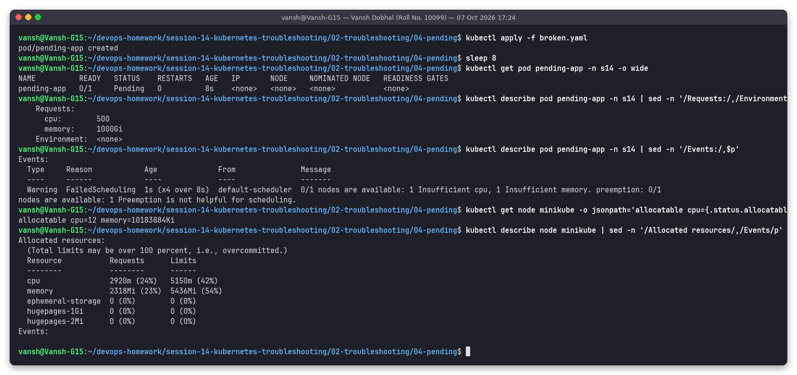
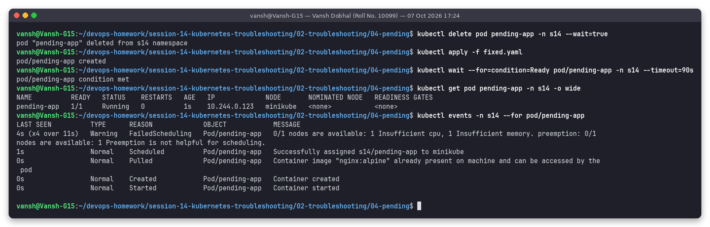

# Issue 4: Pod stuck in Pending (insufficient CPU / memory)

**Name:** Vansh Dobhal | **Roll No:** 10099

Files: [`broken.yaml`](broken.yaml), [`fixed.yaml`](fixed.yaml) | Raw output: [`outputs/before.txt`](outputs/before.txt), [`outputs/after.txt`](outputs/after.txt)

## Problem statement
Pod `pending-app` stays `Pending` forever: no IP, no node.

## Investigation (before)

| Step | Command | What it showed |
|---|---|---|
| 1 | `kubectl get pod pending-app -n s14 -o wide` | `Pending`, `IP <none>`, `NODE <none>`: the scheduler never placed it, so it is a scheduling problem, not a container problem |
| 2 | `kubectl describe pod ... \| sed -n '/Requests:/,/Environment/p'` | `cpu: 500`, `memory: 1000Gi` |
| 3 | `kubectl describe pod ... \| sed -n '/Events:/,$p'` | `FailedScheduling ... 0/1 nodes are available: 1 Insufficient cpu, 1 Insufficient memory. preemption: ... Preemption is not helpful` |
| 4 | `kubectl get node minikube -o jsonpath=...allocatable` | Node allocatable: `cpu=12`, `memory=10183884Ki` (~9.7 GiB) |
| 5 | `kubectl describe node minikube \| sed -n '/Allocated resources/,/Events/p'` | 2920m CPU (24%) and 2318Mi (23%) already requested by other pods |

## Root cause
The scheduler places pods by **requests**, not by real usage. The pod requests 500 cores and 1000 GiB, the
node only has 12 cores / ~9.7 GiB allocatable, so no node can ever fit it. Preemption cannot help because
even an empty node would be too small.

Other common reasons for `Pending` (all visible in the same `FailedScheduling` event):

| Event text | Cause |
|---|---|
| `Insufficient cpu/memory` | Requests too big or cluster full (add nodes / reduce requests / cluster-autoscaler) |
| `node(s) didn't match Pod's node affinity/selector` | `nodeSelector` / affinity label not present on any node |
| `node(s) had untolerated taint` | Node tainted (e.g. control-plane) and pod has no toleration |
| `pod has unbound immediate PersistentVolumeClaims` | PVC is Pending (no StorageClass / no matching PV) |
| `didn't have free ports for the requested pod ports` | `hostPort` conflict |

## Fix
`fixed.yaml`: realistic requests `cpu: 100m, memory: 64Mi` and limits `cpu: 250m, memory: 128Mi`.
Resource requests of an existing pod cannot be edited, so delete + apply.

## Verification (after)

`1/1 Running` on node `minikube` with IP `10.244.0.123`. The events show the old `FailedScheduling`
warnings followed by `Scheduled -> Pulled -> Created -> Started` for the new pod.
