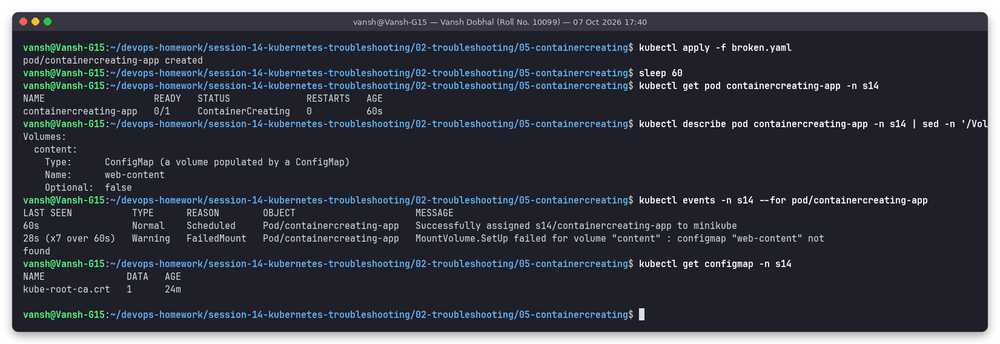
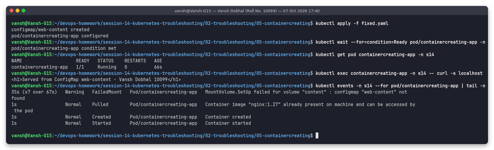

# Issue 5: Pod stuck in ContainerCreating (missing ConfigMap volume)

**Name:** Vansh Dobhal | **Roll No:** 10099

Files: [`broken.yaml`](broken.yaml), [`fixed.yaml`](fixed.yaml) | Raw output: [`outputs/before.txt`](outputs/before.txt), [`outputs/after.txt`](outputs/after.txt)

## Problem statement
Pod `containercreating-app` (nginx that serves its HTML from a ConfigMap volume) has been `ContainerCreating` for over a minute.

## Investigation (before)

| Step | Command | What it showed |
|---|---|---|
| 1 | `kubectl get pod containercreating-app -n s14` | `0/1 ContainerCreating`, age 60s. The pod **is** scheduled (unlike Pending), but the kubelet cannot start the container yet |
| 2 | `kubectl describe pod ... \| sed -n '/Volumes:/,/Optional/p'` | Volume `content`: `Type: ConfigMap`, `Name: web-content`, `Optional: false` |
| 3 | `kubectl events -n s14 --for pod/containercreating-app` | `Warning FailedMount (x7 over 60s) MountVolume.SetUp failed for volume "content" : configmap "web-content" not found` |
| 4 | `kubectl get configmap -n s14` | Only `kube-root-ca.crt`: `web-content` really does not exist |

`kubectl logs` would return nothing useful (container not created yet), so describe/events are the tools here.

## Root cause
The pod mounts ConfigMap `web-content` (non-optional), but it was never created in namespace `s14`. The
kubelet must set up all volumes before it creates the container, so it keeps retrying the mount and the
pod stays in `ContainerCreating`.

Same symptom, other causes (all show up as `FailedMount` / `FailedAttachVolume` / `FailedCreatePodSandBox` events):

| Event | Cause |
|---|---|
| `configmap "x" not found` / `secret "x" not found` | Referenced ConfigMap/Secret missing or in another namespace |
| `FailedAttachVolume` / `Multi-Attach error` | Cloud disk still attached to another node (RWO) |
| `FailedCreatePodSandBox ... network` | CNI plugin problem, no pod IP available |
| Image pull still in progress (event `Pulling`) | Big image, slow registry (not an error, just wait) |

(A missing **PVC** is different: the scheduler refuses to place the pod, so it stays `Pending` instead.)

## Fix
[`fixed.yaml`](fixed.yaml) adds the missing ConfigMap with an `index.html`; the pod spec is unchanged.
`kubectl apply -f fixed.yaml` creates the ConfigMap; the pod is reported as `configured` (no change) and
the kubelet's next mount retry succeeds on its own, with no pod restart needed.

## Verification (after)

The pod became `1/1 Running` (same pod, age 66 s, 0 restarts), `curl localhost` inside it returns
`Served from ConfigMap web-content - Vansh Dobhal 10099`, and the events go from `FailedMount (x7)` to `Pulled -> Created -> Started`.

## Prevention
Apply ConfigMaps/Secrets before the workloads that use them (or keep them in the same Helm chart / kustomization), or mark truly optional ones with `optional: true`.
