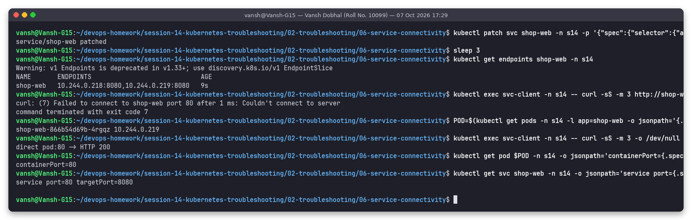

# Issue 6: Service connectivity (selector mismatch + wrong targetPort)

**Name:** Vansh Dobhal | **Roll No:** 10099

Files: [`broken.yaml`](broken.yaml), [`fixed.yaml`](fixed.yaml) | Raw output: [`outputs/`](outputs/)

## Problem statement
Deployment `shop-web` (2 nginx pods) is healthy, but a client pod (`svc-client`) cannot reach it through the
Service: `curl http://shop-web` fails with `Couldn't connect to server`.

## Investigation (before)

| Step | Command | What it showed |
|---|---|---|
| 1 | `kubectl exec svc-client -- curl -sS -m 3 http://shop-web` | `curl: (7) Failed to connect to shop-web port 80`. The name resolved (otherwise curl would say "Could not resolve host"), so DNS is fine and the problem is behind the Service |
| 2 | `kubectl get svc shop-web` | Service exists, ClusterIP 10.104.27.7, port 80 |
| 3 | `kubectl get endpoints shop-web` / `get endpointslices -l kubernetes.io/service-name=shop-web` | `ENDPOINTS <none>` / `<unset>`: the Service has **no backends** |
| 4 | `kubectl describe svc shop-web \| grep -E 'Selector\|TargetPort\|Endpoints'` | `Selector: app=shopweb`, `TargetPort: 8080/TCP`, `Endpoints:` empty |
| 5 | `kubectl get pods -l app=shop-web --show-labels` | Pods are labelled `app=shop-web` (with a dash) |

### Bug 1 found: selector `app=shopweb` does not match label `app=shop-web`. Fixed it first with a patch:

| Step | Command | What it showed |
|---|---|---|
| 6 | `kubectl patch svc shop-web -p '{"spec":{"selector":{"app":"shop-web"}}}'` | Endpoints now `10.244.0.218:8080,10.244.0.219:8080` |
| 7 | `curl http://shop-web` again | **Still** `Couldn't connect to server` |
| 8 | `curl http://<podIP>:80` directly | `direct pod:80 -> HTTP 200`: the pod itself works on port 80 |
| 9 | `containerPort` vs Service `targetPort` | `containerPort=80` but `service port=80 targetPort=8080` |

### Bug 2 found: kube-proxy forwards to pod port 8080, where nothing listens.

## Root cause
1. **Selector mismatch**: the Service selects pods with `app=shopweb`; none exist, so the endpoints list is empty and kube-proxy has nowhere to send traffic (connection refused/rejected immediately).
2. **Wrong targetPort**: after fixing the selector, endpoints exist but point to port 8080, while nginx listens on 80, so connections are refused by the pod.

Endpoints empty = selector/readiness problem. Endpoints present but connection refused = port problem.

## Fix
[`fixed.yaml`](fixed.yaml): `selector: app: shop-web` and `targetPort: 80`.

## Verification (after)

`Selector: app=shop-web`, `TargetPort: 80/TCP`, `Endpoints: 10.244.0.218:80,10.244.0.219:80`;
`curl http://shop-web` returns `<title>Welcome to nginx!</title>` and the FQDN
`shop-web.s14.svc.cluster.local` returns HTTP 200.

## Service checklist
1. `kubectl get endpoints <svc>` (or endpointslices): empty? -> compare `describe svc` Selector with `get pods --show-labels`, and check pods are `READY` (unready pods are removed from endpoints).
2. Endpoints present? -> compare `targetPort` with the port the process really listens on (`containerPort`, `kubectl exec <pod> -- ss -ltn`), then `curl <podIP>:<port>` directly.
3. Still failing? -> NetworkPolicy (Issue 8) or DNS (Issue 7).
