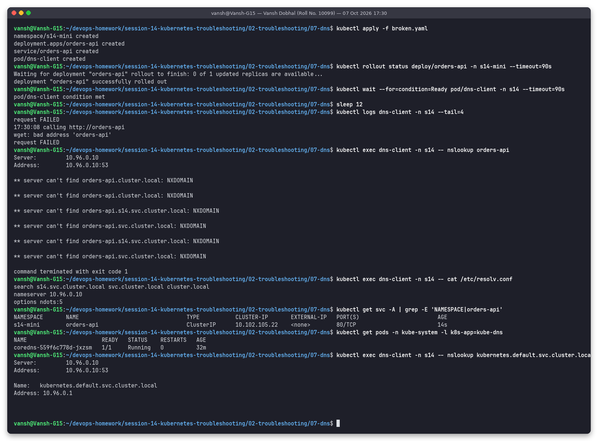
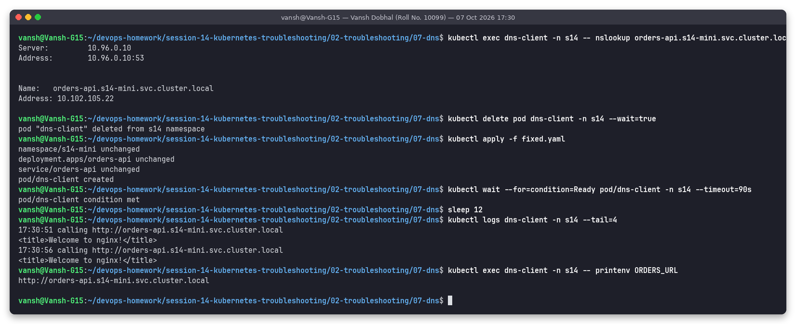

# Issue 7: DNS issue (service name used from the wrong namespace)

**Name:** Vansh Dobhal | **Roll No:** 10099

Files: [`broken.yaml`](broken.yaml), [`fixed.yaml`](fixed.yaml) | Raw output: [`outputs/before.txt`](outputs/before.txt), [`outputs/after.txt`](outputs/after.txt)

## Problem statement
`dns-client` (namespace `s14`) calls the `orders-api` service every 5 s using `ORDERS_URL=http://orders-api`.
Every call fails. `orders-api` itself (Deployment + Service) runs in namespace `s14-mini`.

## Investigation (before)

| Step | Command | What it showed |
|---|---|---|
| 1 | `kubectl logs dns-client -n s14 --tail=4` | `wget: bad address 'orders-api'` / `request FAILED`. "bad address" = the **name could not be resolved**, nothing to do with ports |
| 2 | `kubectl exec dns-client -- nslookup orders-api` | NXDOMAIN for `orders-api.s14.svc.cluster.local`, `orders-api.svc.cluster.local`, `orders-api.cluster.local` |
| 3 | `kubectl exec dns-client -- cat /etc/resolv.conf` | `search s14.svc.cluster.local svc.cluster.local cluster.local`, `nameserver 10.96.0.10`, `ndots:5` |
| 4 | `kubectl get svc -A \| grep orders-api` | The Service exists, but in namespace **`s14-mini`** |
| 5 | `kubectl get pods -n kube-system -l k8s-app=kube-dns` | CoreDNS `1/1 Running`, so cluster DNS is up |
| 6 | `nslookup kubernetes.default.svc.cluster.local` | Resolves to 10.96.0.1, proving DNS works in general from this pod |

## Root cause
A short name like `orders-api` is expanded using the pod's search list, which starts with **its own**
namespace (`s14.svc.cluster.local`). The service lives in `s14-mini`, so none of the expanded names exist
and CoreDNS returns NXDOMAIN. DNS itself is healthy; the client is asking for the wrong name.

Kubernetes service DNS names:

| Name used from a pod in `s14` | Resolves? |
|---|---|
| `orders-api` | Only if the service is in `s14` |
| `orders-api.s14-mini` | Yes (search domain `svc.cluster.local` is appended) |
| `orders-api.s14-mini.svc.cluster.local` | Yes, fully qualified, works from anywhere in the cluster |

## Fix
[`fixed.yaml`](fixed.yaml) sets `ORDERS_URL=http://orders-api.s14-mini.svc.cluster.local`. Env vars are
immutable on a running pod, so delete the pod and apply.

## Verification (after)

`nslookup orders-api.s14-mini.svc.cluster.local` returns `10.102.105.22`; after recreating the pod the logs
show `calling http://orders-api.s14-mini.svc.cluster.local` -> `<title>Welcome to nginx!</title>` every 5 s.

## Other DNS failure patterns
| Symptom | Likely cause | Check |
|---|---|---|
| NXDOMAIN for every name, even `kubernetes.default` | CoreDNS down or kube-dns Service has no endpoints | `kubectl get pods,endpoints -n kube-system -l k8s-app=kube-dns`, CoreDNS logs |
| Timeouts on lookups | NetworkPolicy blocking egress to UDP/TCP 53 | `kubectl get netpol`, allow egress to kube-system:53 |
| Typo in service name | Wrong name | `kubectl get svc -A \| grep <part>` |
| External names fail, internal work | Upstream DNS / CoreDNS `forward` config | `kubectl -n kube-system get cm coredns -o yaml` |
