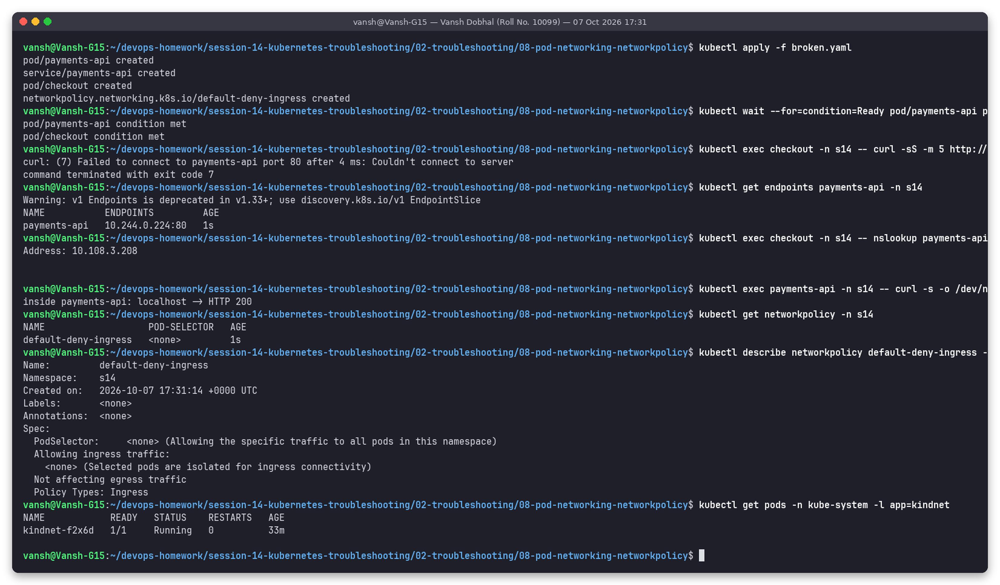
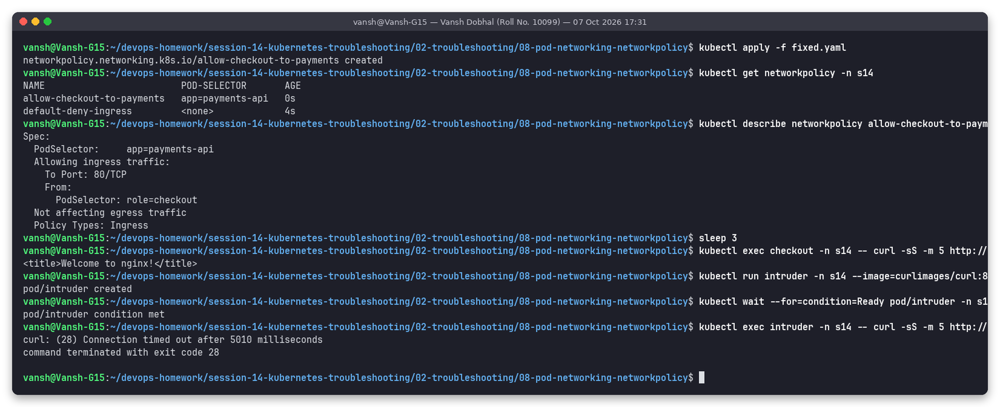

# Issue 8: Pod networking issue (NetworkPolicy default-deny blocks traffic)

**Name:** Vansh Dobhal | **Roll No:** 10099

Files: [`broken.yaml`](broken.yaml), [`fixed.yaml`](fixed.yaml) | Raw output: [`outputs/before.txt`](outputs/before.txt), [`outputs/after.txt`](outputs/after.txt)

**Does minikube enforce NetworkPolicy here?** Yes. This minikube uses the **kindnet** CNI
(`kindnet-f2x6d` in kube-system), and current kindnet versions implement NetworkPolicy. I verified it before
writing this scenario (a throw-away deny-all test timed out), and the outputs below show the policy being
enforced. On a CNI without policy support (old kindnet, flannel) the policy objects would be accepted but
silently ignored.

## Problem statement
`checkout` (label `role=checkout`) cannot reach `payments-api` through its Service. Everything else looks healthy.

## Investigation (before)



| Step | Command | What it showed |
|---|---|---|
| 1 | `kubectl exec checkout -- curl -sS -m 5 http://payments-api` | `Failed to connect to payments-api port 80 after 4 ms: Couldn't connect to server` |
| 2 | `kubectl get endpoints payments-api` | `10.244.0.224:80`: selector and port are correct (rules out Issue 6) |
| 3 | `nslookup payments-api.s14.svc.cluster.local` from checkout | Resolves to `10.108.3.208` (rules out Issue 7) |
| 4 | `kubectl exec payments-api -- curl localhost` | `HTTP 200`: the app works inside its own pod, so the block is on the network path between pods |
| 5 | `kubectl get networkpolicy -n s14` | `default-deny-ingress` with an empty pod selector |
| 6 | `kubectl describe networkpolicy default-deny-ingress` | `PodSelector: <none> (... all pods in this namespace)`, `Allowing ingress traffic: <none> (Selected pods are isolated for ingress connectivity)` |
| 7 | `kubectl get pods -n kube-system -l app=kindnet` | The CNI that enforces the policy |

## Root cause
A "lock everything down" NetworkPolicy selects **every** pod in `s14` for Ingress and has no `ingress`
rules, so all incoming connections to `payments-api` are dropped/rejected by the CNI. Policies are additive
allow-lists: once a pod is selected by any Ingress policy, only traffic explicitly allowed by some policy gets in,
and nobody added the allow rule for `checkout`.

## Fix
Keep the default-deny (good practice) and add a targeted allow rule, [`fixed.yaml`](fixed.yaml):

```yaml
spec:
  podSelector: { matchLabels: { app: payments-api } }
  policyTypes: [Ingress]
  ingress:
    - from: [ { podSelector: { matchLabels: { role: checkout } } } ]
      ports: [ { protocol: TCP, port: 80 } ]
```

## Verification (after)



- Both policies are listed; `describe` shows `Allowing ingress traffic: To Port: 80/TCP, From: PodSelector: role=checkout`.
- `checkout` -> `payments-api` now returns `<title>Welcome to nginx!</title>`.
- Negative test: a new pod `intruder` (label `role=intruder`) still gets `curl: (28) Connection timed out after 5010 milliseconds`, which proves the policy is enforced and only the intended client was allowed.

(The blocked connection showed up as an immediate "Couldn't connect" in the first test and as a 5 s timeout for
the intruder: both are how this CNI blocks traffic; with most CNIs a dropped packet looks like a timeout.)

## Pod-networking checklist
1. Pod -> its own `localhost` works? (app is fine)
2. Pod -> other pod IP directly? (`curl <podIP>:<port>`), then -> Service ClusterIP, then -> Service DNS name.
3. `kubectl get networkpolicy -A`: any policy selecting the source (egress) or destination (ingress) pod?
4. App listening on `127.0.0.1` instead of `0.0.0.0`, or on a different port than `containerPort`, gives similar "connection refused" symptoms: check with `kubectl exec <pod> -- ss -ltnp` / `netstat -ltn`.
5. CNI pods healthy (`kubectl get pods -n kube-system`)?
