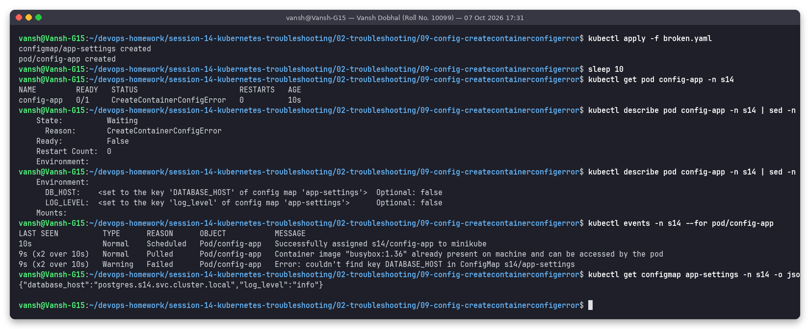
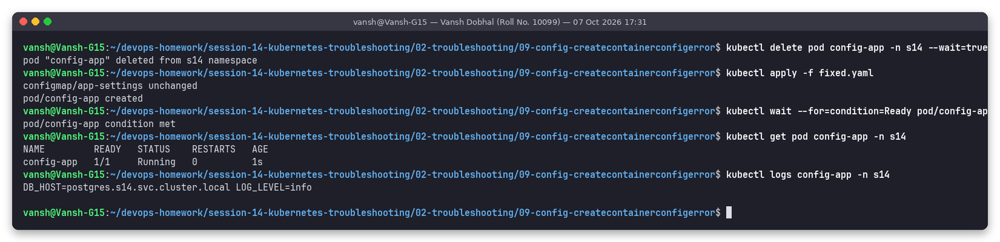

# Issue 9: Configuration issue (CreateContainerConfigError, wrong ConfigMap key)

**Name:** Vansh Dobhal | **Roll No:** 10099

Files: [`broken.yaml`](broken.yaml), [`fixed.yaml`](fixed.yaml) | Raw output: [`outputs/before.txt`](outputs/before.txt), [`outputs/after.txt`](outputs/after.txt)

## Problem statement
Pod `config-app` reads `DB_HOST` and `LOG_LEVEL` from ConfigMap `app-settings`. It never starts: STATUS `CreateContainerConfigError`.

## Investigation (before)

| Step | Command | What it showed |
|---|---|---|
| 1 | `kubectl get pod config-app -n s14` | `0/1 CreateContainerConfigError`, 0 restarts |
| 2 | `kubectl describe pod ... \| sed -n '/State:/,/Environment:/p'` | `State: Waiting, Reason: CreateContainerConfigError` |
| 3 | `kubectl describe pod ... \| sed -n '/Environment:/,/Mounts:/p'` | `DB_HOST: <set to the key 'DATABASE_HOST' of config map 'app-settings'>` |
| 4 | `kubectl events -n s14 --for pod/config-app` | `Warning Failed  Error: couldn't find key DATABASE_HOST in ConfigMap s14/app-settings` |
| 5 | `kubectl get configmap app-settings -o jsonpath='{.data}'` | `{"database_host":"postgres.s14.svc.cluster.local","log_level":"info"}` |

## Root cause
ConfigMap keys are **case-sensitive**. The pod asks for key `DATABASE_HOST`, the ConfigMap contains
`database_host`. Because the reference is not `optional: true`, the kubelet refuses to build the container's
config, so the container is never created (no logs, no restarts, just `CreateContainerConfigError`).

The same status appears for: a missing ConfigMap/Secret referenced by `env`/`envFrom`, a missing key in a
Secret, or `runAsNonRoot: true` with an image whose user is root.

## Fix
[`fixed.yaml`](fixed.yaml): `key: database_host`. Delete the pod and apply.

## Verification (after)

`1/1 Running`, and the logs print `DB_HOST=postgres.s14.svc.cluster.local LOG_LEVEL=info`, so both values are injected.
