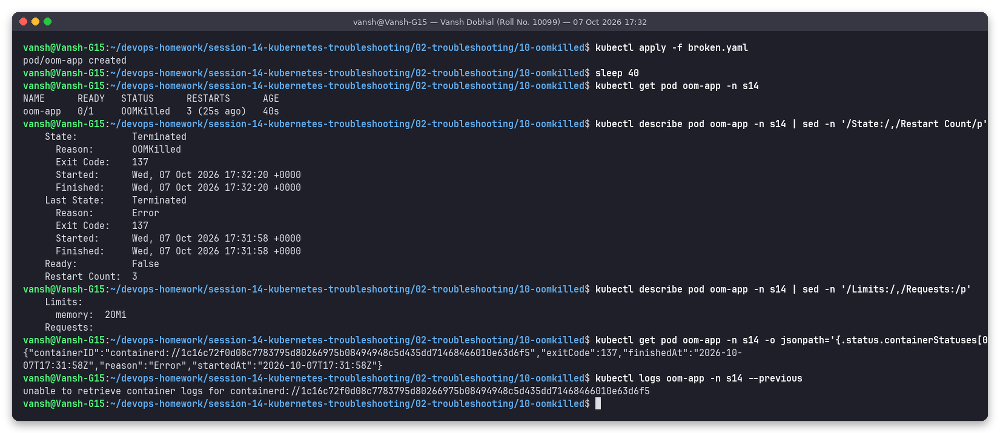
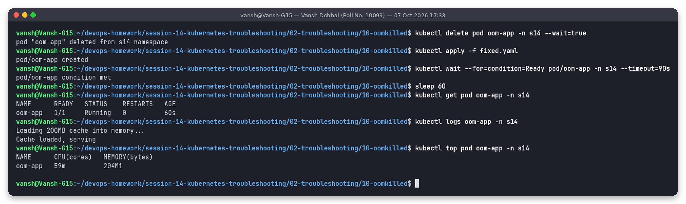

# Issue 10 (extra): OOMKilled (memory limit too low)

**Name:** Vansh Dobhal | **Roll No:** 10099

Adapted from the instructor's `scenarios/scenario-5-oomkilled`. Not in the required list, but a very common
cause of restarts, so I included it.

Files: [`broken.yaml`](broken.yaml), [`fixed.yaml`](fixed.yaml) | Raw output: [`outputs/before.txt`](outputs/before.txt), [`outputs/after.txt`](outputs/after.txt)

## Problem statement
`oom-app` loads a ~200 MB cache at start-up and keeps restarting.

## Investigation (before)

| Step | Command | What it showed |
|---|---|---|
| 1 | `kubectl get pod oom-app -n s14` | `0/1 OOMKilled`, `RESTARTS 3` within 40 s |
| 2 | `kubectl describe pod ... \| sed -n '/State:/,/Restart Count/p'` | `Reason: OOMKilled`, `Exit Code: 137` (128 + 9 = SIGKILL from the kernel OOM killer) |
| 3 | `kubectl describe pod ... \| sed -n '/Limits:/,/Requests:/p'` | `Limits: memory: 20Mi` |
| 4 | `-o jsonpath='{.status.containerStatuses[0].lastState.terminated}'` | `exitCode 137` for the previous attempt too |
| 5 | `kubectl logs oom-app --previous` | `unable to retrieve container logs for containerd://...`: the process is killed within milliseconds of starting, so there was nothing useful to keep. This is typical for OOM; the exit code and reason are the evidence, not the logs |

## Root cause
The container's cgroup memory limit is 20 MiB, while the process needs about 200 MB. When usage hits the
limit the Linux kernel kills the process (SIGKILL), the kubelet reports `OOMKilled` and restarts it, which
leads to CrashLoopBackOff.

## Fix
[`fixed.yaml`](fixed.yaml): `requests.memory: 256Mi`, `limits.memory: 320Mi` (real working set plus headroom).
Resources cannot be changed on a running pod here, so delete + apply.

## Verification (after)

After 60 s: `1/1 Running`, 0 restarts, logs `Cache loaded, serving`, and `kubectl top pod oom-app` shows
**204Mi** real usage, comfortably under the new 320Mi limit.

## Takeaway
Size memory limits from measured usage (`kubectl top`, Prometheus `container_memory_working_set_bytes`),
not guesses. Exit code 137 + `OOMKilled` = raise the limit or fix the leak; exit code 137 without OOMKilled = something else sent SIGKILL (e.g. a failed liveness probe).
