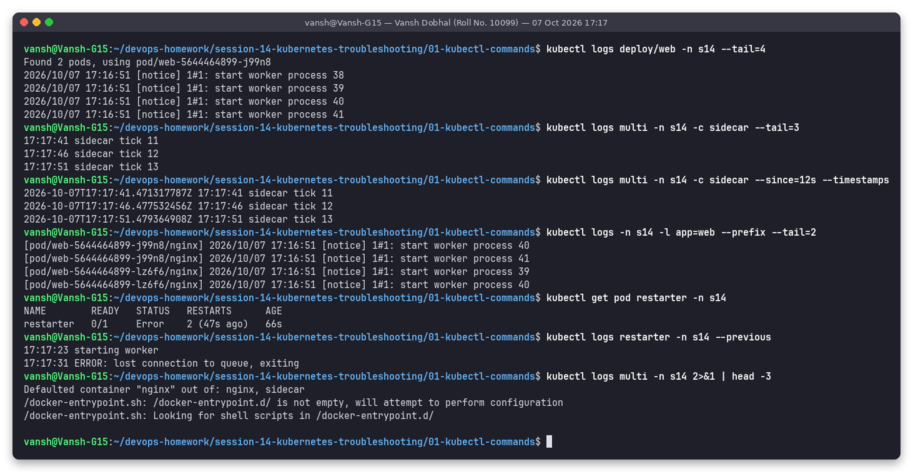
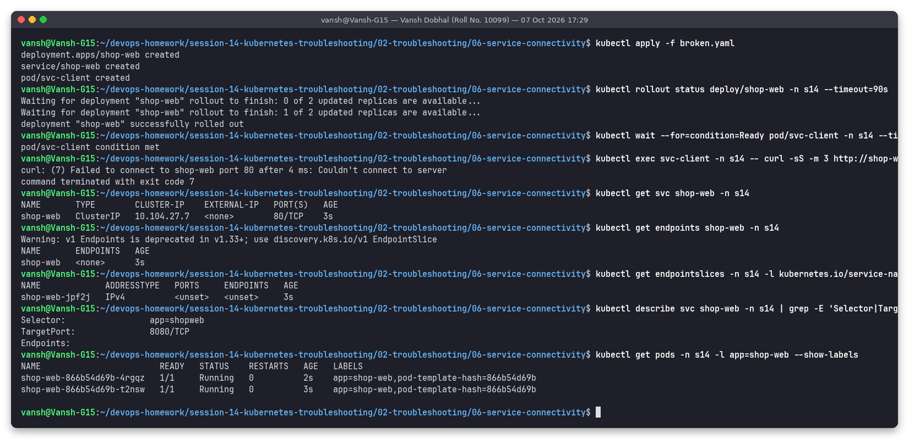
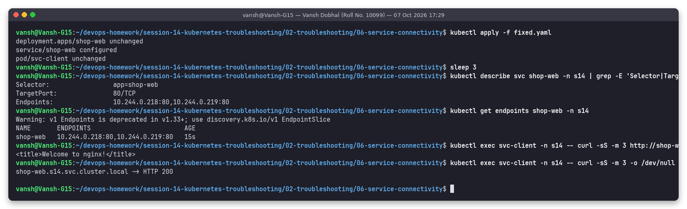

# Session 14: Kubernetes Troubleshooting

**Name:** Vansh Dobhal | **Roll No:** 10099

Environment: shared minikube (Kubernetes **v1.37.0**, containerd, docker driver, single node with 12 CPU /
~9.7 GiB allocatable, CNI **kindnet**, metrics-server enabled), kubectl v1.37.1, run from WSL Ubuntu 24.04.
My namespaces: `s14` (Tasks 1-2) and `s14-mini` (Task 3, and as the "other namespace" in the DNS issue).

Every screenshot was produced by the `snap` tool, which executes the commands for real and saves the PNG
plus the exact text (`outputs/*.txt`) of the same run. Nothing was typed in by hand. The instructor's
reference material (`devops-heros/session-14-kubernetes-troubleshooting`: `01-05` command folders,
`06-09` issue folders, `scenarios/*`, `mini-project`) was reused and adapted.

---

## Task 1: Hands-on with kubectl get, describe, logs, exec, events, explain, top, -o wide

Full write-up with every screenshot: **[01-kubectl-commands/README.md](01-kubectl-commands/README.md)**

| Command group | Screenshot | Highlights |
|---|---|---|
| `kubectl get` (nodes, pods, all, `--show-labels`, `-l`, `--field-selector`) | [01-kubectl-get](01-kubectl-commands/screenshots/01-kubectl-get.png) | STATUS vs phase (restarter shows `Error` while phase is `Running`) |
| `kubectl describe` (pod, svc, node allocation) | [02-kubectl-describe](01-kubectl-commands/screenshots/02-kubectl-describe.png) | QoS class, conditions, Events, node "Allocated resources" |
| `kubectl logs` (`--tail`, `--since`, `--timestamps`, `-c`, `-l --prefix`, `--previous`) | [03-kubectl-logs](01-kubectl-commands/screenshots/03-kubectl-logs.png) | `--previous` shows the crashed container's `ERROR: lost connection to queue` |
| `kubectl exec` (version, resolv.conf, env, ps in sidecar, wget + nslookup) | [04-kubectl-exec](01-kubectl-commands/screenshots/04-kubectl-exec.png) | DNS config injected by kubelet, Service env vars |
| `kubectl events` / `kubectl get events --sort-by` / Warning filters | [05-kubectl-events](01-kubectl-commands/screenshots/05-kubectl-events.png) | `--for pod/x`, `--types=Warning`, aggregation `x4 over 71s` |
| `kubectl explain` | [06-kubectl-explain](01-kubectl-commands/screenshots/06-kubectl-explain.png) | probe fields, `--recursive` |
| `kubectl top` (nodes, pods, `--containers`, `--sort-by`) | [07-kubectl-top](01-kubectl-commands/screenshots/07-kubectl-top.png) | per-container usage |
| Output formats (`-o wide/name/yaml/jsonpath/custom-columns`) | [08-kubectl-output-formats](01-kubectl-commands/screenshots/08-kubectl-output-formats.png) | extracting podIP + restartCount with jsonpath |



`kubectl logs -f` / `get -w` stream forever and cannot be captured as a finished screenshot; `--tail`,
`--since`, repeated `get` and `kubectl wait` were used instead.

---

## Task 2: Troubleshooting common failures

Each issue has its own folder with `broken.yaml`, `fixed.yaml`, `README.md` (problem statement,
investigation steps with real commands, root cause, fix, verification) and `screenshots/before.png` +
`screenshots/after.png`. Script: [`scripts/02-troubleshooting.sh`](scripts/02-troubleshooting.sh) (`bash 02-troubleshooting.sh 01 05` runs single scenarios).

| # | Issue | Folder | Root cause found | Fix |
|---|---|---|---|---|
| 1 | **CrashLoopBackOff** | [01-crashloopbackoff](02-troubleshooting/01-crashloopbackoff/README.md) | App exits 1: `DATABASE_URL environment variable is MISSING!` (seen with `logs --previous`) | Inject `DATABASE_URL` from a ConfigMap |
| 2 | **ImagePullBackOff** | [02-imagepullbackoff](02-troubleshooting/02-imagepullbackoff/README.md) | Tag `nginx:1.27-does-not-exist` -> registry `not found` | Real tag `nginx:1.27` |
| 3 | **ErrImagePull** | [03-errimagepull](02-troubleshooting/03-errimagepull/README.md) | Registry typo `dockerr.io` -> `lookup dockerr.io ... no such host` (NXDOMAIN from the node) | `docker.io/library/nginx:1.27` |
| 4 | **Pending** | [04-pending](02-troubleshooting/04-pending/README.md) | Requests 500 CPU / 1000Gi; node has 12 CPU / ~9.7Gi -> `Insufficient cpu, Insufficient memory` | Realistic requests (100m / 64Mi) |
| 5 | **ContainerCreating** | [05-containercreating](02-troubleshooting/05-containercreating/README.md) | `FailedMount ... configmap "web-content" not found` | Create the ConfigMap (pod recovers by itself) |
| 6 | **Service connectivity** | [06-service-connectivity](02-troubleshooting/06-service-connectivity/README.md) | Selector `app=shopweb` vs label `app=shop-web` (endpoints `<none>`), then `targetPort 8080` vs nginx on 80 | Correct selector and targetPort |
| 7 | **DNS issue** | [07-dns](02-troubleshooting/07-dns/README.md) | Short name `orders-api` used from `s14`, service is in `s14-mini` -> NXDOMAIN | FQDN `orders-api.s14-mini.svc.cluster.local` |
| 8 | **Pod networking (NetworkPolicy)** | [08-pod-networking-networkpolicy](02-troubleshooting/08-pod-networking-networkpolicy/README.md) | `default-deny-ingress` isolates all pods, no allow rule (kindnet enforces it, verified) | Add `allow-checkout-to-payments`; intruder pod still blocked |
| 9 | **Configuration (CreateContainerConfigError)** | [09-config-createcontainerconfigerror](02-troubleshooting/09-config-createcontainerconfigerror/README.md) | `couldn't find key DATABASE_HOST in ConfigMap s14/app-settings` (key is `database_host`) | Correct, case-sensitive key |
| 10 | OOMKilled (extra, from instructor scenario 5) | [10-oomkilled](02-troubleshooting/10-oomkilled/README.md) | 20Mi limit, app needs ~200MB -> `OOMKilled`, exit 137 | Limit 320Mi (real usage 204Mi) |

Before/after example (Issue 6, service connectivity):

| Before | After |
|---|---|
|  |  |

### Troubleshooting flowchart (what I actually follow)

```text
                         kubectl get pods -o wide
                                   │
      ┌──────────────┬─────────────┼────────────────┬───────────────────────┐
      ▼              ▼             ▼                ▼                       ▼
   Pending   ContainerCreating  ErrImagePull /   CrashLoopBackOff /   Running 1/1 but
  (no node)   (scheduled, no    ImagePullBackOff  Error / OOMKilled   "doesn't work"
      │        container yet)       │                  │                    │
      ▼              ▼              ▼                  ▼                    ▼
 describe pod   describe pod    describe pod      logs --previous     Running 0/1?
 FailedSchedul. FailedMount /   Failed to pull:   describe: Last      ── yes ──► readiness probe
 - Insufficient FailedAttach /  - not found (tag) State + exit code      failing (describe:
   cpu/memory   SandBox errors  - no such host    1 = app error         Unhealthy events)
 - selector/    -> missing CM/    (registry)      137+OOMKilled =     ── no ──► Service path:
   affinity     Secret/PVC,     - 401/denied        raise mem limit    get endpoints <svc>
 - taints       CNI problem       (pull secret)   127 = bad command     │ empty -> selector /
 - unbound PVC                  - 429 rate limit  CreateContainer-      │   labels / readiness
      │              │              │             ConfigError ->        │ ok -> targetPort vs
      ▼              ▼              ▼             env/CM/Secret key     │   containerPort
 fix requests/  create the     fix image ref /        │                 │   (curl podIP:port)
 labels/        missing object  add secret            ▼                 ▼
 tolerations                                      fix config,      exec: nslookup <svc>
                                                  recreate pod     NXDOMAIN -> name/namespace
                                                                   timeout  -> NetworkPolicy /
                                                                               CoreDNS
                                   │
                                   ▼
              FIX -> VERIFY (get, events, logs, curl from a client pod)
```

### Status -> likely cause -> first command (cheat table)

| Status / symptom | Most likely causes | First commands |
|---|---|---|
| `Pending` | Insufficient CPU/memory, nodeSelector/affinity, taints, unbound PVC | `kubectl describe pod <p>` (FailedScheduling), `kubectl describe node \| grep -A8 Allocated` |
| `ContainerCreating` (long) | Missing ConfigMap/Secret volume, volume attach, CNI sandbox error, big image | `kubectl events --for pod/<p>`, `kubectl get cm,secret,pvc` |
| `ErrImagePull` | Wrong registry/repo/tag, auth, DNS/network to registry, rate limit | `kubectl describe pod <p>` (Failed to pull), `docker exec minikube nslookup <registry>` |
| `ImagePullBackOff` | Same as above, now waiting between retries | same as above |
| `CrashLoopBackOff` | App error on start, bad command/args, missing env/config, failing liveness probe | `kubectl logs <p> --previous`, `kubectl describe pod <p>` (Last State, Exit Code) |
| `OOMKilled` / exit 137 | Memory limit lower than real usage, leak | `kubectl describe pod <p>`, `kubectl top pod <p>` |
| `CreateContainerConfigError` | Missing ConfigMap/Secret or key in `env`/`envFrom`, runAsNonRoot vs root image | `kubectl events --for pod/<p>`, `kubectl get cm <name> -o jsonpath='{.data}'` |
| `Running` but `0/1` | Readiness probe failing | `kubectl describe pod <p>` (Unhealthy events) |
| Service `ENDPOINTS <none>` | Selector/label mismatch, pods not Ready | `kubectl describe svc <s>`, `kubectl get pods --show-labels` |
| Endpoints OK, `connection refused` | Wrong `targetPort`, app listening on 127.0.0.1 | `curl <podIP>:<port>` from a client pod, `kubectl get svc <s> -o yaml` |
| `bad address` / NXDOMAIN | Wrong service name or namespace, CoreDNS down | `kubectl exec <p> -- nslookup <svc>`, `cat /etc/resolv.conf`, `kubectl get svc -A` |
| Timeouts between pods | NetworkPolicy, CNI problem | `kubectl get networkpolicy -A`, `kubectl describe networkpolicy` |
| HPA `<unknown>` | metrics-server missing, no CPU requests, pods not ready yet | `kubectl top pods`, `kubectl describe hpa` |

---

## Task 3: Mini project - Kubernetes Troubleshooting Challenge

Full write-up: **[mini-project/README.md](mini-project/README.md)** (namespace `s14-mini`).

Covered every section of the instructor's mini-project README: deploy Deployment + Service, check pods
(get -o wide, describe, logs, exec + `curl localhost`), check Service selector/targetPort/endpoints,
DNS check, the broken pod `project-broken-pod` (`nginx:this-tag-does-not-exist` -> ErrImagePull/ImagePullBackOff)
investigated with get/describe/events before changing YAML, the five questions answered, the
selector challenge (`app: wrong-app` -> endpoints `<none>`, found via `--show-labels` vs `describe service`,
fixed), the troubleshooting table, and the ten README questions answered in my own words.


---

## Deliverables checklist

| Deliverable | Where |
|---|---|
| Commands | Every README lists the exact commands; scripts in [`scripts/`](scripts/); raw text in each `outputs/` |
| Problem statement, investigation steps, root cause, solution | Each `02-troubleshooting/<issue>/README.md` and `mini-project/README.md` |
| Before/after output | `before.png` / `after.png` (+ `.txt`) in every issue folder |
| Screenshots | `*/screenshots/*.png` (list below) |
| README.md | This file + one per task / issue |

## Honest notes / what could not be done exactly as written

- **NetworkPolicy:** the brief warned minikube's default CNI might not enforce policies. This cluster uses kindnet, which does enforce them; I tested that in a throw-away namespace before the demo, and the demo itself shows the block and the allowed / still-blocked clients. So no substitute scenario was needed.
- **Interactive commands** (`kubectl exec -it`, `logs -f`, `get -w`) were replaced by their one-shot equivalents, because screenshots are captured non-interactively.
- **Docker Hub 429:** during the mini project the tag lookup was rate-limited (`429 Too Many Requests`) because many pulls were running on this machine at the same time. It is real output, so I explained it instead of hiding it.
- **`kubectl logs --previous` for OOMKilled** returned `unable to retrieve container logs`: the process is killed within milliseconds, so no previous log was kept; the exit code and `OOMKilled` reason are the evidence.
- `kubectl events --for pod/<name>` also shows events of an earlier pod with the **same name** (events are matched by name and kept for 1 hour). Where this happened (e.g. Issue 2 "after") the README points it out; for Issues 1 and 5 the script clears old events in `s14` first.

## Folder structure

```text
session-14-kubernetes-troubleshooting/
├── README.md
├── 01-kubectl-commands/          demo-app.yaml, README.md, screenshots/ (8), outputs/
├── 02-troubleshooting/
│   ├── 01-crashloopbackoff/      broken.yaml fixed.yaml README.md screenshots/ outputs/
│   ├── 02-imagepullbackoff/      "
│   ├── 03-errimagepull/          "
│   ├── 04-pending/               "
│   ├── 05-containercreating/     "
│   ├── 06-service-connectivity/  " (+ step1-fix-selector.png)
│   ├── 07-dns/                   "
│   ├── 08-pod-networking-networkpolicy/  "
│   ├── 09-config-createcontainerconfigerror/  "
│   └── 10-oomkilled/             "
├── mini-project/                 namespace/deployment/service/broken-pod/fixed-pod/service-broken-selector/dns-test-pod .yaml, README.md, screenshots/ (12), outputs/
└── scripts/                      01-kubectl-commands.sh, 02-troubleshooting.sh, 03-mini-project.sh
```

## How to reproduce

```bash
# inside WSL, with minikube running (metrics-server enabled) and the snap tool on PATH
cd ~/devops-homework/session-14-kubernetes-troubleshooting
bash scripts/01-kubectl-commands.sh          # Task 1  (namespace s14)
bash scripts/02-troubleshooting.sh           # Task 2  all issues; or e.g. "... 06 07" for single ones
bash scripts/03-mini-project.sh              # Task 3  (namespace s14-mini)
# without snap, run the same kubectl commands shown in each README, e.g.:
kubectl apply -f 02-troubleshooting/04-pending/broken.yaml && kubectl describe pod pending-app -n s14
kubectl delete namespace s14 s14-mini        # cleanup
```
