# Task 3: Mini Project - Kubernetes Troubleshooting Challenge

**Name:** Vansh Dobhal | **Roll No:** 10099

Based on the instructor's `session-14-kubernetes-troubleshooting/mini-project/README.md`. I followed every
section in order, in my own namespace **`s14-mini`** (the instructor's files use `default`; I added
`namespace: s14-mini` because the cluster is shared). Script: [`../scripts/03-mini-project.sh`](../scripts/03-mini-project.sh).

```text
Deploy -> Observe -> Break -> Investigate -> Find root cause -> Fix -> Verify
```

| File | Purpose |
|---|---|
| [`namespace.yaml`](namespace.yaml) | Namespace `s14-mini` |
| [`deployment.yaml`](deployment.yaml) | `troubleshooting-app`, 2 x nginx:1.27, label `app=troubleshooting-app` |
| [`service.yaml`](service.yaml) | ClusterIP `troubleshooting-service`, selector `app=troubleshooting-app`, 80 -> 80 |
| [`broken-pod.yaml`](broken-pod.yaml) | `project-broken-pod` with image `nginx:this-tag-does-not-exist` (unchanged from instructor) |
| [`fixed-pod.yaml`](fixed-pod.yaml) | Same pod with `nginx:1.27` |
| [`service-broken-selector.yaml`](service-broken-selector.yaml) | Section 8: selector changed to `app: wrong-app` |
| [`dns-test-pod.yaml`](dns-test-pod.yaml) | busybox pod for `nslookup` / `wget` tests from inside the cluster |

---

## 1. Deploy the application

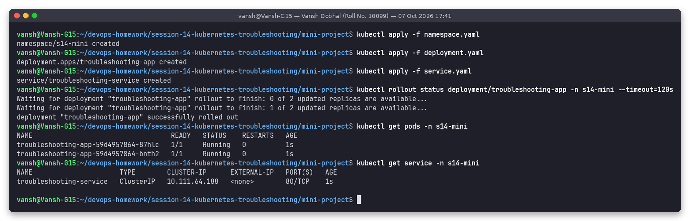

Both pods `1/1 Running`, Service `troubleshooting-service` got ClusterIP `10.111.64.188`.

## 2. Check the application (get -o wide, describe, logs, exec + curl localhost)

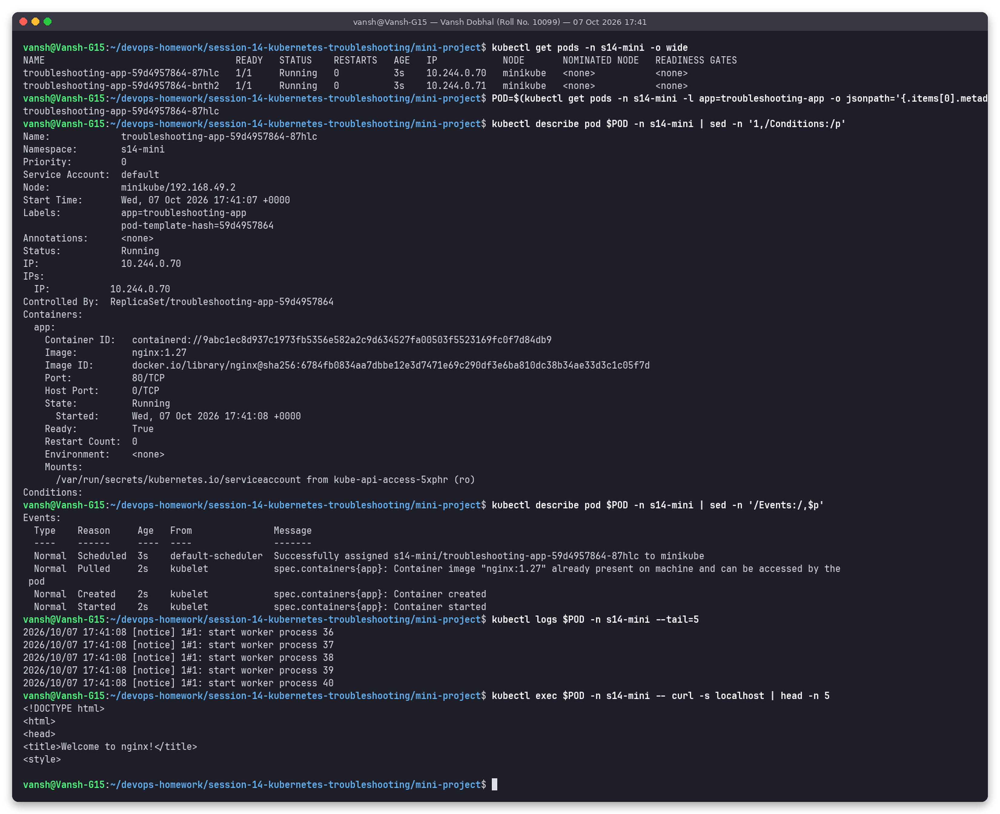

- `get pods -o wide`: IPs 10.244.0.70 / 10.244.0.71 on node `minikube`.
- `describe pod`: image `nginx:1.27`, `State: Running`, `Ready: True`, `Restart Count: 0`, events `Scheduled -> Pulled -> Created -> Started`.
- `logs`: nginx start-up notices (worker processes started), no errors.
- `exec ... -- curl -s localhost`: returns `<title>Welcome to nginx!</title>`, the Nginx response the assignment expects. (The assignment uses `kubectl exec -it <pod> -- bash` and then `curl localhost`; I ran the same `curl` as a one-shot exec because screenshots are taken non-interactively.)

## 3 + 4. Check the Service and its Endpoints

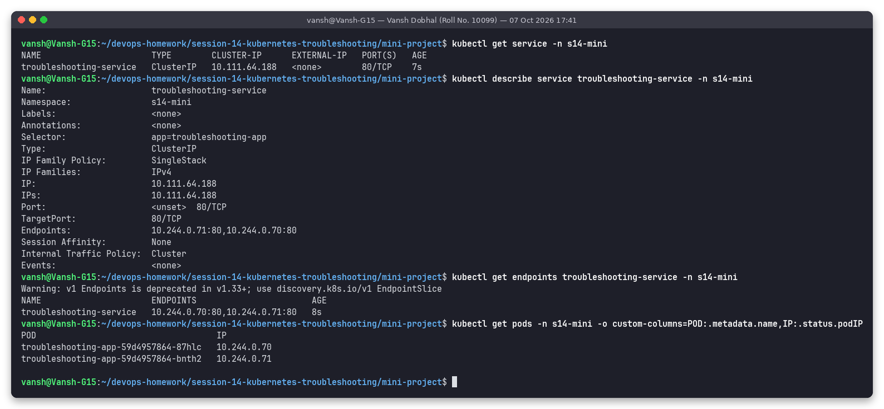

`describe service` shows **Selector** `app=troubleshooting-app`, **TargetPort** `80/TCP` and **Endpoints**
`10.244.0.71:80,10.244.0.70:80`, exactly the two pod IPs listed by `get pods -o custom-columns=POD,IP`.

### Extra: DNS check from inside the namespace

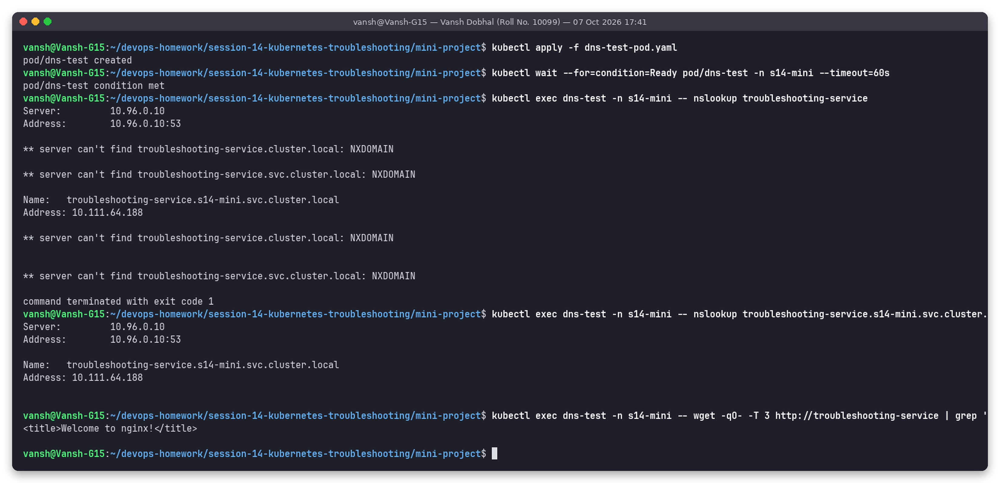

`nslookup troubleshooting-service` resolves to `10.111.64.188` via the search domain
`s14-mini.svc.cluster.local` (busybox also prints NXDOMAIN lines for the other search domains it tried and
exits 1, which is normal busybox behaviour); the FQDN resolves cleanly and `wget http://troubleshooting-service`
returns the nginx page.

## 5. Create a broken pod

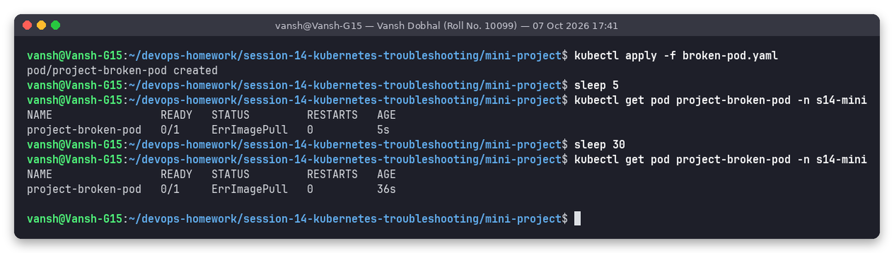

`project-broken-pod` is `0/1 ErrImagePull` after 5 s and still `ErrImagePull` after 36 s (it flips between
`ErrImagePull` and `ImagePullBackOff` on every retry).

## 6. Troubleshoot it (without touching the YAML first)

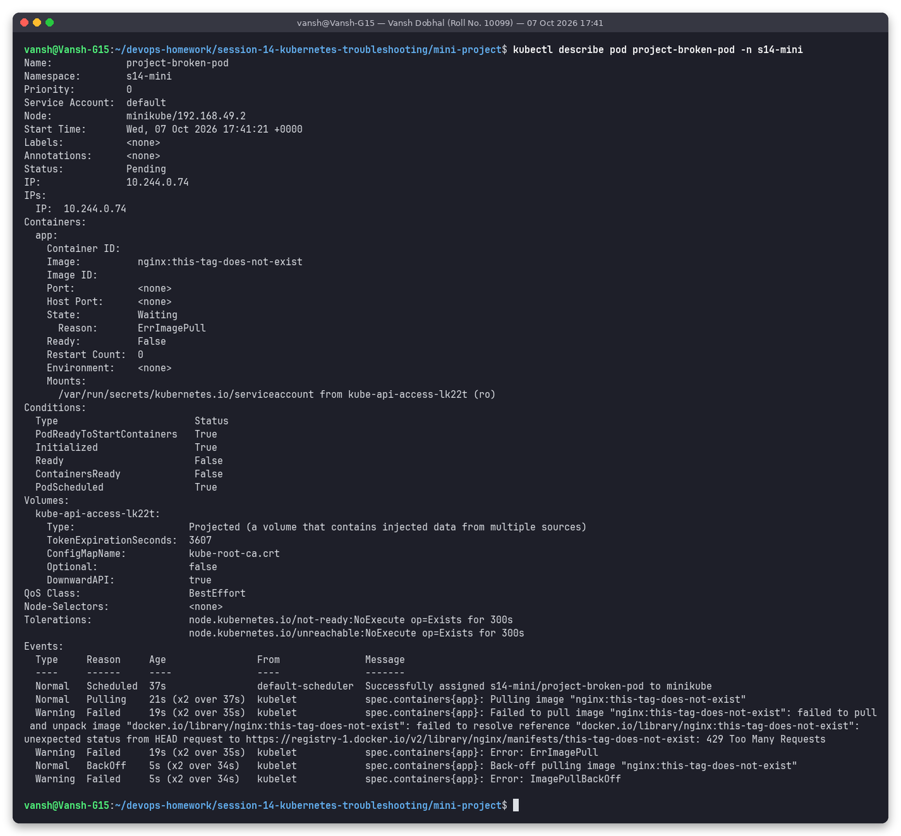

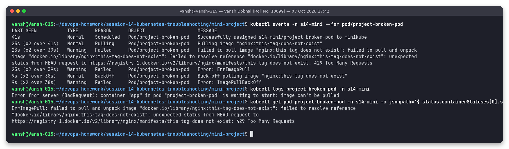

Events: `Pulling image "nginx:this-tag-does-not-exist"` -> `Failed to pull image ... failed to resolve reference "docker.io/library/nginx:this-tag-does-not-exist"`
-> `Error: ErrImagePull` -> `Back-off pulling image` -> `Error: ImagePullBackOff`.
`kubectl logs` fails with `container "app" ... is waiting to start: image can't be pulled`, which confirms the container never existed.

Interesting real detail: in this run the registry's answer was `unexpected status from HEAD request to
https://registry-1.docker.io/v2/library/nginx/manifests/this-tag-does-not-exist: 429 Too Many Requests`.
Many agents were pulling from Docker Hub on this machine at the same time, so Docker Hub rate-limited the
lookup. In Issue 2 of Task 2 the same kind of tag error came back as a clean `not found`. Either way the tag does
not exist; the 429 is a second thing to watch for (fix: authenticate pulls / use a mirror).

## 7. My answers

**Question 1: What is the Pod status?**
`ErrImagePull`, alternating with `ImagePullBackOff`. `READY 0/1`, `RESTARTS 0`, pod phase `Pending`.

**Question 2: What is the actual error?**
`Failed to pull image "nginx:this-tag-does-not-exist": failed to pull and unpack image "docker.io/library/nginx:this-tag-does-not-exist": failed to resolve reference ...` followed by `Error: ErrImagePull` and `Back-off pulling image ...` / `Error: ImagePullBackOff`.

**Question 3: Which command helped you find the reason?**
`kubectl describe pod project-broken-pod -n s14-mini` (the Events section), and `kubectl events -n s14-mini --for pod/project-broken-pod`, which shows the same events. `kubectl get pod ... -o jsonpath='{.status.containerStatuses[0].state.waiting.message}'` prints the full message.

**Question 4: What is wrong with the image?**
The repository `docker.io/library/nginx` exists but the tag `this-tag-does-not-exist` does not, so containerd cannot resolve the image reference.

**Question 5: How would you fix it?**
Use a real tag (`nginx:1.27`): delete the pod and apply [`fixed-pod.yaml`](fixed-pod.yaml) (or `kubectl set image pod/project-broken-pod app=nginx:1.27`, since the image field is mutable on a pod).

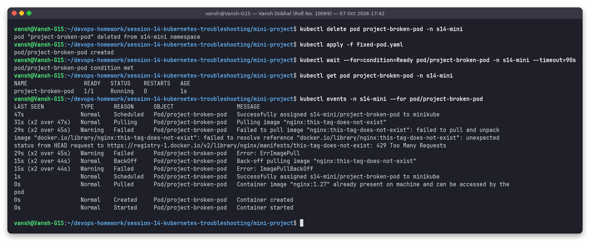

After the fix: `1/1 Running`, events `Pulled -> Created -> Started`.

## 8. Service troubleshooting challenge: broken selector

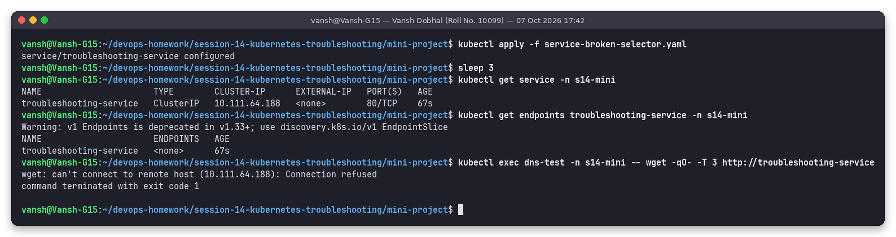

After applying `service-broken-selector.yaml` (`app: wrong-app`): the Service still exists with the same
ClusterIP, but `kubectl get endpoints troubleshooting-service` shows **`<none>`** and
`wget http://troubleshooting-service` fails with `can't connect to remote host (10.111.64.188): Connection refused`.

## 9. Find the root cause

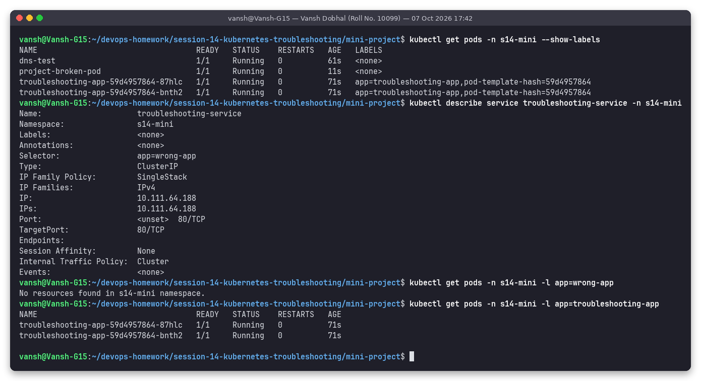

- `get pods --show-labels`: pods carry `app=troubleshooting-app`.
- `describe service`: `Selector: app=wrong-app`, `Endpoints:` empty.
- `get pods -l app=wrong-app`: `No resources found`; `-l app=troubleshooting-app`: the 2 pods.

Mismatch: selector `app=wrong-app` vs pod label `app=troubleshooting-app`. Fix: re-apply the original `service.yaml`.

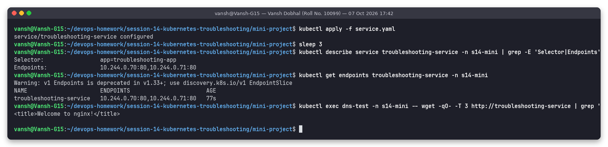

Selector back to `app=troubleshooting-app`, endpoints `10.244.0.70:80,10.244.0.71:80`, `wget` returns `<title>Welcome to nginx!</title>`.

## 10. Final troubleshooting checklist (run at the end)

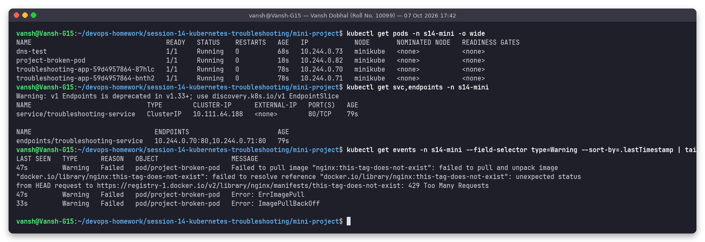

All pods Running, Service has both endpoints. The only Warning events left are the historical image pull failures of the broken pod.

## 11. Troubleshooting table

| Problem | What I Saw | Command I Used | Root Cause | Fix |
| :--- | :--- | :--- | :--- | :--- |
| **Broken Pod** | `project-broken-pod 0/1 ErrImagePull`, never Running, 0 restarts, no logs | `kubectl get pod`, `kubectl describe pod` (Events), `kubectl events --for pod/...` | Container could not be created because its image could not be pulled | Point the pod to a pullable image and recreate it (`fixed-pod.yaml`) |
| **Service Problem** | Service exists, `ENDPOINTS <none>`, `wget` -> `Connection refused` | `kubectl get endpoints`, `kubectl describe service`, `kubectl get pods --show-labels`, `-l app=wrong-app` | Selector `app=wrong-app` matches no pod (pods are `app=troubleshooting-app`) | Restore selector `app: troubleshooting-app` (`kubectl apply -f service.yaml`) |
| **Image Problem** | `Failed to pull image "nginx:this-tag-does-not-exist" ... failed to resolve reference`, then `ImagePullBackOff` | `kubectl describe pod`, `-o jsonpath=...state.waiting.message` | Tag `this-tag-does-not-exist` does not exist on Docker Hub (the lookup was additionally rate-limited with HTTP 429) | Use `nginx:1.27`; for rate limits use authenticated pulls or a registry mirror |

## 12. README questions (in my own words)

1. **What does `kubectl get` tell us?** A one-line summary per object: does it exist, and what is its current state (READY x/y, STATUS, RESTARTS, AGE; with `-o wide` also IP and node). It is the first "is anything obviously wrong?" check.
2. **Difference between `get` and `describe`?** `get` is a short table (or raw YAML/JSON with `-o`). `describe` is a human-readable deep dive into one object: container states with last state and exit codes, probes, resources, volumes, conditions and, most importantly, the related **Events**. `get` says *what* state, `describe` usually says *why*.
3. **Why do we use `kubectl logs`?** To read what the application itself printed to stdout/stderr: stack traces, config errors, "missing env var" messages. `--previous` shows the crashed instance, `-c` picks a container, `--tail/--since` limit output.
4. **When would you use `kubectl exec`?** When the pod runs but behaves wrong and you need to test from inside: `curl localhost` (is the app up?), `curl <service>` / `nslookup` (networking and DNS from the pod's view), `env`, `cat` config files, `ls` mounted volumes.
5. **What does `CrashLoopBackOff` mean?** The container starts and then exits/crashes repeatedly; the kubelet restarts it with growing delays (10 s, 20 s, 40 s ... max 5 min) and shows CrashLoopBackOff while waiting. Cause is in `logs --previous` and the `Last State` exit code.
6. **What does `ImagePullBackOff` mean?** The kubelet failed to pull the image (`ErrImagePull`) and is now waiting with back-off before trying again. Causes: wrong name/tag, wrong registry, private image without `imagePullSecrets`, network/DNS to the registry, rate limits.
7. **Why can a Pod remain `Pending`?** The scheduler cannot find a node: not enough CPU/memory for the requests, `nodeSelector`/affinity matches no node, untolerated taints, an unbound PVC, or hostPort conflicts. The `FailedScheduling` event says which.
8. **Why can a Service have no endpoints?** The selector matches no pods (typo / wrong label), the matching pods are not Ready (failing readiness probe), the pods are in a different namespace, or there simply are no pods running.
9. **Relationship between a Service selector and Pod labels?** The Service's `selector` is a label query; the endpoints controller continuously adds every **Ready** pod in the same namespace whose labels contain all selector key/values to the Service's EndpointSlices. No label match = no endpoints = no traffic.
10. **What is Kubernetes DNS?** CoreDNS running in `kube-system` (Service `kube-dns`, 10.96.0.10). Every Service gets the name `<service>.<namespace>.svc.cluster.local`; pods get that nameserver plus search domains (`<ns>.svc.cluster.local svc.cluster.local cluster.local`) in `/etc/resolv.conf`, which is why the short name works inside the same namespace and `<svc>.<ns>` is needed across namespaces.

## 13. Final architecture (what is running at the end)

```text
                    Kubernetes Cluster (minikube), namespace s14-mini
                            │
                            ▼
                  ┌──────────────────────────────┐
                  │ Service troubleshooting-service│  ClusterIP 10.111.64.188:80
                  └──────────────┬───────────────┘
                   selector app=troubleshooting-app
              ┌──────────────────┴──────────────────┐
              ▼                                     ▼
   Pod ...-87hlc 10.244.0.70:80          Pod ...-bnth2 10.244.0.71:80
              └──────────────────┬──────────────────┘
                             nginx:1.27
```

## Final rule I followed

`GET -> DESCRIBE -> EVENTS -> LOGS -> EXEC -> TEST -> FIX -> VERIFY`: for both problems I gathered evidence first
and changed YAML only after the root cause was proven by command output.
