**Name:** Vansh Dobhal | **Roll No:** 10099

# Task 1: Helm Commands

Every Helm command below was **executed for real** on the shared minikube cluster (Kubernetes v1.37.0, Helm v3.16.2) in namespace **`s15`**, using a chart generated with `helm create webapp`. Each screenshot was produced by the `snap` tool, which runs the commands and records both a PNG (`screenshots/`) and the exact text (`outputs/`).

Script that produced everything: [`../scripts/01-helm-commands.sh`](../scripts/01-helm-commands.sh)

| # | Command group | Screenshot |
|---|---------------|------------|
| 1 | `helm version`, `helm create` | [01-version-create](screenshots/01-version-create.png) |
| 2 | `helm lint`, `helm template` | [02-lint-template](screenshots/02-lint-template.png) |
| 3 | `helm show chart`, `helm show values` | [03-show-values](screenshots/03-show-values.png) |
| 4 | `helm install --dry-run` | [04-dry-run](screenshots/04-dry-run.png) |
| 5 | `helm install` | [05-install](screenshots/05-install.png) |
| 6 | `helm list`, `helm status` | [06-list-status](screenshots/06-list-status.png) |
| 7 | `helm get values / notes / manifest` | [07-get-values-notes-manifest](screenshots/07-get-values-notes-manifest.png) |
| 8 | `helm get all / hooks / metadata` | [08-get-all](screenshots/08-get-all.png) |
| 9 | `helm upgrade`, `upgrade --install --reuse-values` | [09-upgrade](screenshots/09-upgrade.png) |
| 10 | `helm history`, `helm rollback` | [10-history-rollback](screenshots/10-history-rollback.png) |
| 11 | `helm test` | [11-helm-test](screenshots/11-helm-test.png) |
| 12 | `helm repo add / list / update` | [12-repo-add-list-update](screenshots/12-repo-add-list-update.png) |
| 13 | `helm search repo`, `helm search hub` | [13-search-repo-hub](screenshots/13-search-repo-hub.png) |
| 14 | `helm package`, `helm pull` | [14-package-pull](screenshots/14-package-pull.png) |
| 15 | `helm uninstall`, `helm repo remove` | [15-uninstall-repo-remove](screenshots/15-uninstall-repo-remove.png) |

---

## 1. `helm create` – scaffold a chart

```bash
helm version --short
helm create webapp
tree -a webapp
```

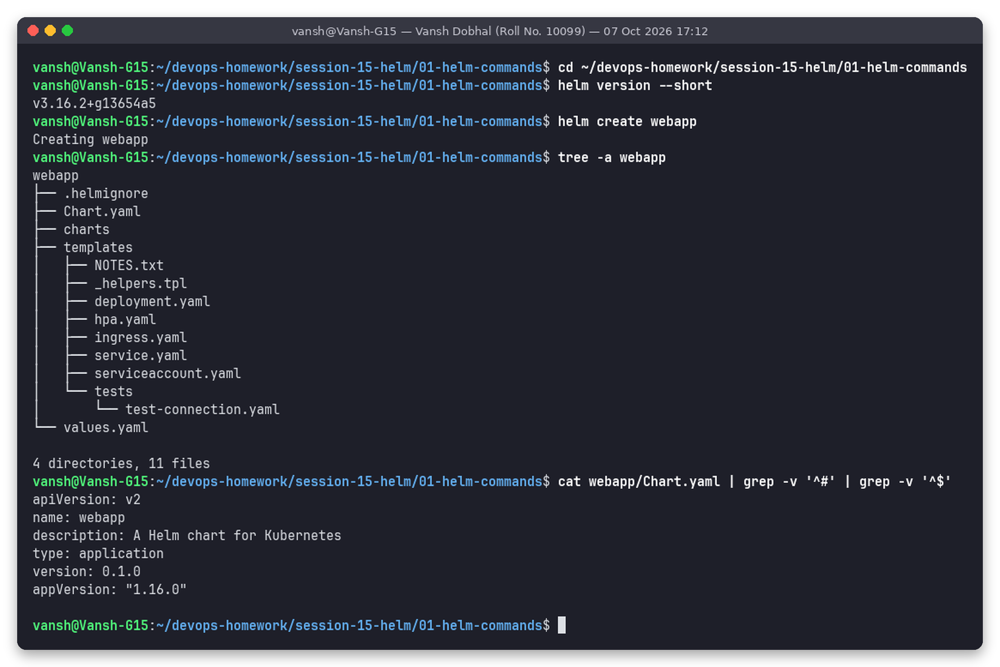

`helm create` generates a complete, working chart: `Chart.yaml` (metadata), `values.yaml` (defaults), `templates/` (Deployment, Service, ServiceAccount, Ingress, HPA, NOTES.txt, `_helpers.tpl`), a `tests/` hook pod, an empty `charts/` folder for dependencies and a `.helmignore`. The default image is `nginx` and, because `image.tag` is `""`, the tag falls back to `appVersion` (`1.16.0`). The generated chart is kept unchanged in [`webapp/`](webapp/).

## 2. `helm lint` and `helm template`

```bash
helm lint webapp
helm lint webapp --strict
helm template web1 webapp -n s15 --show-only templates/deployment.yaml
helm template web1 webapp -n s15 | grep -E '^(kind|  name):'
```

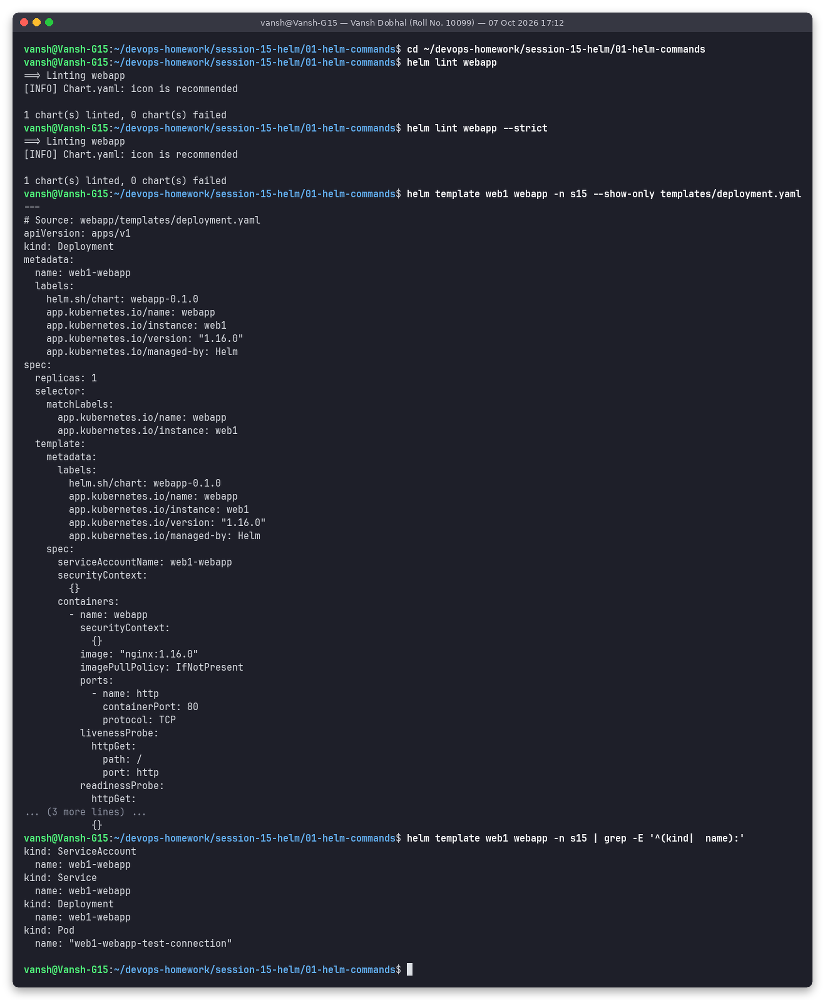

* `helm lint` checks chart structure and that templates render to valid YAML. The only message is `[INFO] icon is recommended`; `--strict` turns warnings into errors and still passes.
* `helm template` renders the manifests **locally, without touching the cluster**. `--show-only` limits the output to a single template. The rendered list shows 4 objects: ServiceAccount, Service, Deployment and the test Pod (a hook).

## 3. `helm show chart` / `helm show values`

```bash
helm show chart webapp
helm show values webapp
```

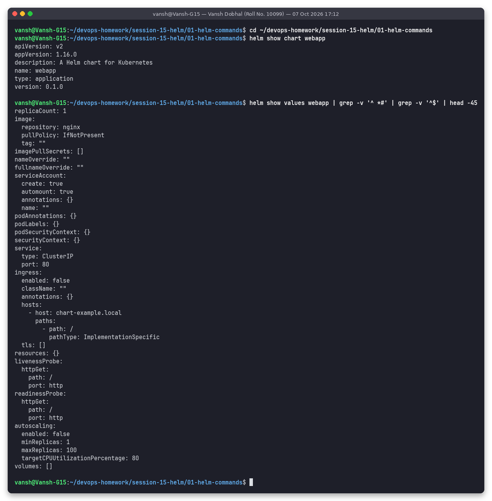

`helm show` reads a chart (local folder, `.tgz` or `repo/chart`) and prints its `Chart.yaml` or its default `values.yaml`. This is the first thing to run before installing any third-party chart, to see which keys can be overridden.

## 4. `helm install --dry-run`

```bash
helm install web1 webapp -n s15 --create-namespace --dry-run --set replicaCount=2 | head -12
helm install web1 webapp -n s15 --create-namespace --dry-run --set replicaCount=2 | grep -E 'replicas:|image:|kind:'
kubectl get all -n s15
```

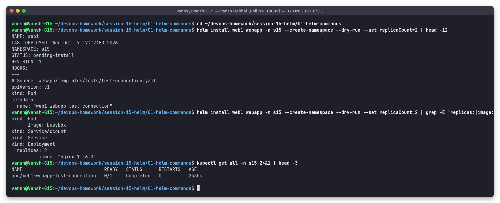

`--dry-run` goes through the whole install logic (values merge, render, hooks) and prints the result with `STATUS: pending-install`, but **creates nothing**. The `--set replicaCount=2` override is visible as `replicas: 2`, and `kubectl get all -n s15` confirms `No resources found`.

Difference to `helm template`: `template` is purely offline; `install --dry-run` also contacts the cluster (for `.Capabilities`, lookups) and prints release metadata and NOTES.

## 5. `helm install`

```bash
helm install web1 webapp -n s15 --create-namespace
kubectl rollout status deployment/web1-webapp -n s15 --timeout=120s
kubectl get all -n s15
kubectl get secrets -n s15 -l owner=helm
```

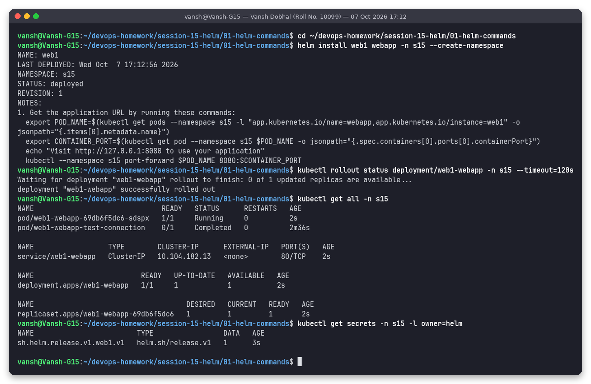

Release `web1` → revision 1, `STATUS: deployed`, and the rendered `NOTES.txt` is printed. Helm 3 stores each revision as a Secret named `sh.helm.release.v1.<release>.v<N>` in the release namespace (`sh.helm.release.v1.web1.v1`) – there is no Tiller.

## 6. `helm list` / `helm status`

```bash
helm list -n s15
helm list -A
helm status web1 -n s15
helm status web1 -n s15 --show-resources
```

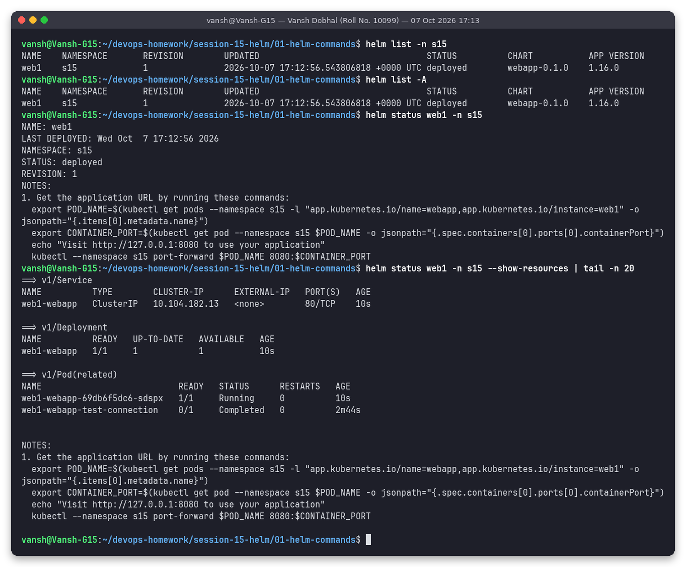

`helm list` shows releases in one namespace (`-A` = all namespaces) with revision, status, chart and app version. `helm status` shows the current state and NOTES; `--show-resources` also lists the live Service, Deployment and Pods of the release.

## 7. `helm get values / notes / manifest`

```bash
helm get values web1 -n s15            # only user-supplied values
helm get values web1 -n s15 --all      # merged (computed) values
helm get notes web1 -n s15
helm get manifest web1 -n s15
```

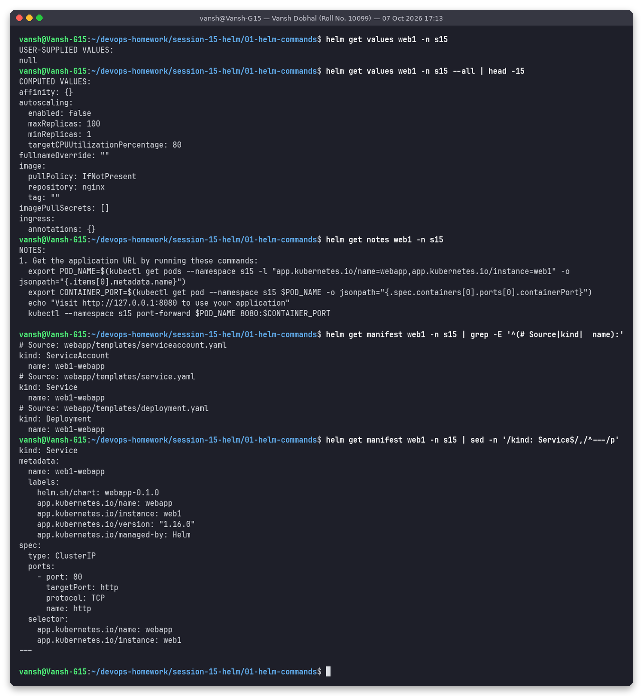

`USER-SUPPLIED VALUES: null` because the release was installed with chart defaults only; `--all` shows the full computed values. `helm get manifest` returns exactly the YAML Helm sent to the API server for this revision (very useful to debug "what did Helm actually apply?").

## 8. `helm get all / hooks / metadata`

```bash
helm get all web1 -n s15
helm get hooks web1 -n s15
helm get metadata web1 -n s15
```

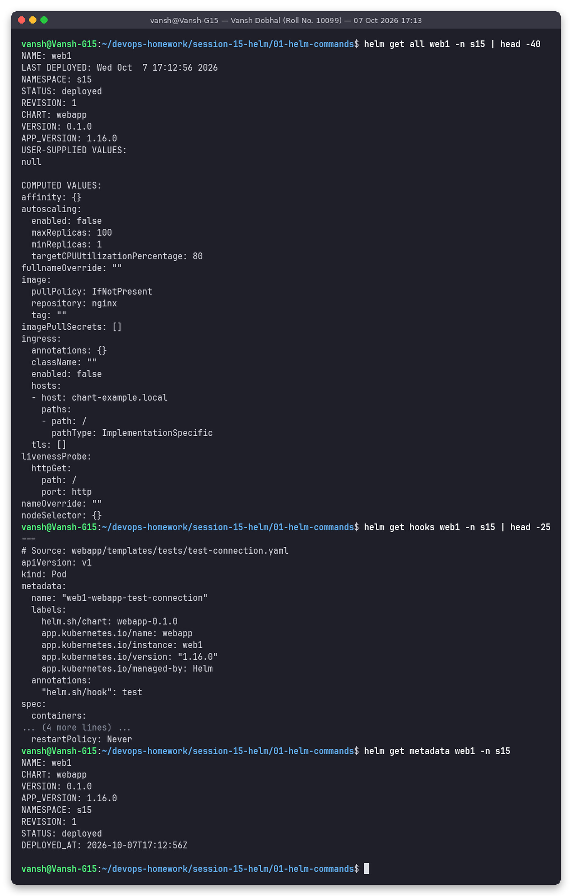

`helm get all` = metadata + values + computed values + hooks + manifest + notes in one output. `helm get hooks` shows the `helm.sh/hook: test` pod, which is **not** part of the normal manifest – it only runs on `helm test`.

## 9. `helm upgrade`

```bash
helm upgrade web1 webapp -n s15 --set replicaCount=3
kubectl rollout status deployment/web1-webapp -n s15
helm upgrade --install web1 webapp -n s15 --reuse-values --set service.type=NodePort
helm get values web1 -n s15
kubectl get svc,deploy -n s15
```

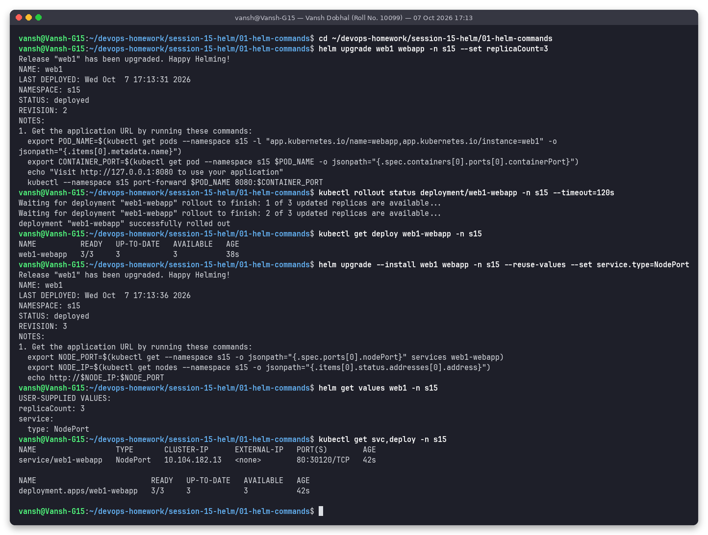

* Revision 2: `replicaCount=3` → deployment scaled to 3/3.
* Revision 3: `upgrade --install` (installs if missing, upgrades otherwise – the usual CI/CD command) with `--reuse-values`, so the previous `replicaCount: 3` was kept and `service.type: NodePort` was added. The NOTES output changed automatically to the NodePort instructions because the chart's NOTES.txt has an `if` on the service type.

## 10. `helm history` / `helm rollback`

```bash
helm history web1 -n s15
helm rollback web1 1 -n s15 --wait --timeout 120s
helm history web1 -n s15
kubectl get deploy,svc -n s15
helm get values web1 -n s15
```

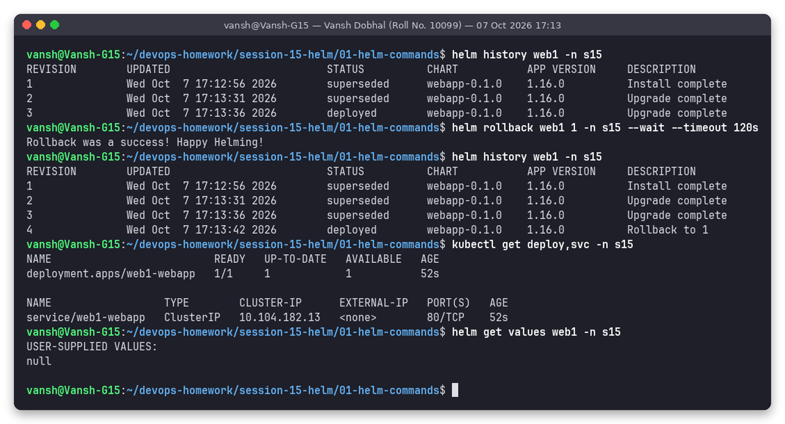

Rollback to revision 1 created **revision 4** with description `Rollback to 1` – history is never rewritten. The deployment went back to 1 replica and the Service back to `ClusterIP`, and user-supplied values are `null` again.

## 11. `helm test`

```bash
helm test web1 -n s15 --logs
kubectl get pods -n s15
```

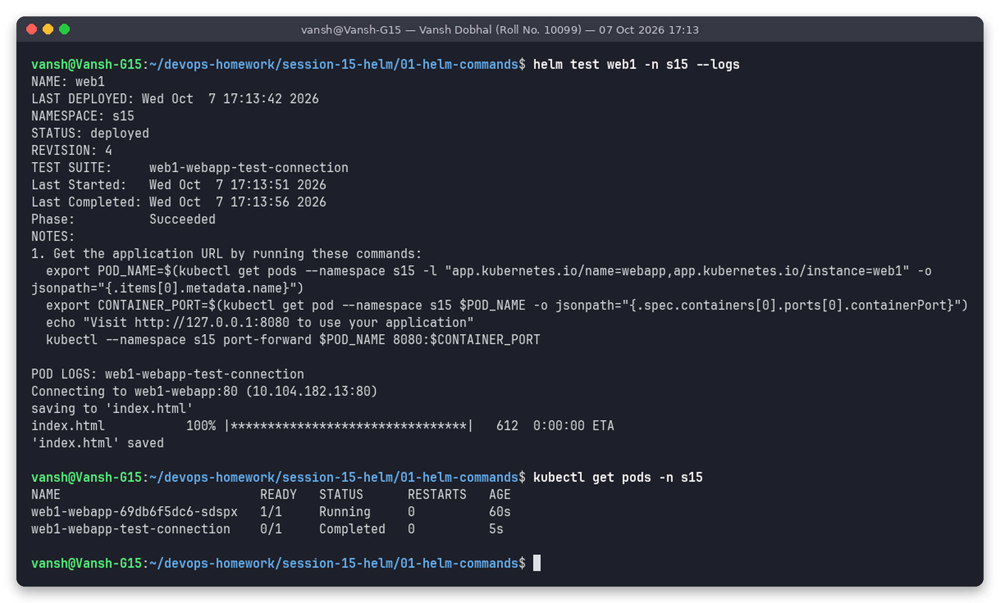

`helm test` runs the hook pod `web1-webapp-test-connection` (busybox `wget web1-webapp:80`). `Phase: Succeeded` and the log `'index.html' saved` prove the Service routes to nginx.

## 12. `helm repo add / list / update`

```bash
helm repo add bitnami https://charts.bitnami.com/bitnami
helm repo add prometheus-community https://prometheus-community.github.io/helm-charts
helm repo list
helm repo update
```

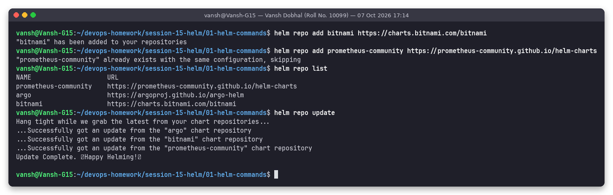

A chart repository is just an HTTP server with an `index.yaml`. `repo add` saves the URL locally, `repo update` downloads the latest index of each repository into the local cache.

## 13. `helm search repo` / `helm search hub`

```bash
helm search repo nginx
helm search repo prometheus-community/prometheus --versions
helm search repo bitnami/redis --version '>=20.0.0'
helm search hub wordpress --max-col-width 55
helm show chart bitnami/nginx
helm show values bitnami/nginx
```

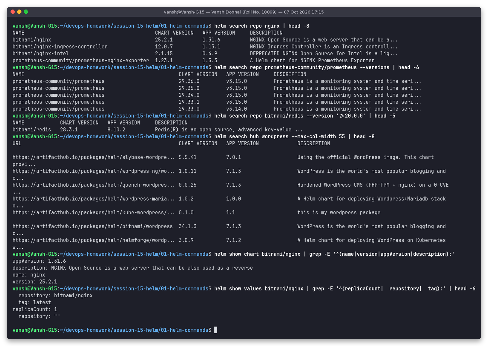

| Command | Searches | Needs `repo add`? |
|---------|----------|-------------------|
| `helm search repo` | the local cache of repos you added | yes |
| `helm search hub` | Artifact Hub (artifacthub.io), thousands of public repos | no |

`--versions` lists every chart version, `--version` accepts a SemVer constraint.

## 14. `helm package` / `helm pull`

```bash
helm package webapp -d dist
helm package webapp -d dist --version 0.2.0 --app-version 1.27.0
ls -l dist
tar -tzf dist/webapp-0.1.0.tgz
helm show chart dist/webapp-0.2.0.tgz
helm pull prometheus-community/prometheus-node-exporter -d /tmp/s15-pull
```

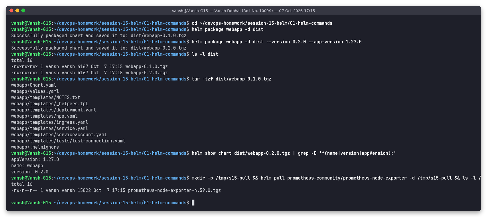

`helm package` creates a versioned `.tgz` (files listed in `.helmignore` are excluded). `--version`/`--app-version` override `Chart.yaml` at package time, which is how CI pipelines stamp build numbers. `helm pull` downloads a chart archive from a repository without installing it. The two packages are kept in [`dist/`](dist/).

## 15. `helm uninstall` / `helm repo remove`

```bash
helm uninstall web1 -n s15 --wait
helm list -n s15 --all
kubectl get all,secrets -n s15
kubectl delete pod web1-webapp-test-connection -n s15 --wait
helm repo remove bitnami
helm repo list
```

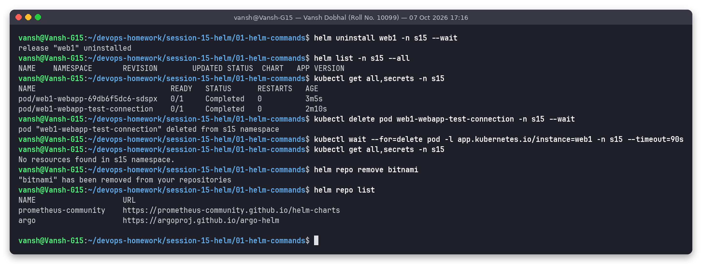

`helm uninstall` deletes all release objects **and** the release Secrets (so `helm list --all` is empty; use `--keep-history` to keep them). Observation: the `helm test` pod was **left behind** – test hooks are not tracked as release resources unless the chart sets a `helm.sh/hook-delete-policy`, so it had to be deleted manually. `prometheus-community` was intentionally kept because other session labs on the shared machine use it (the `argo` repo in the list was added by another session, not by this task).

---

## Command cheat-sheet (what I learned)

| Command | Purpose | Key flags used |
|---------|---------|----------------|
| `helm create <name>` | Scaffold a new chart | – |
| `helm lint <chart>` | Static checks of a chart | `--strict`, `-f` |
| `helm template <rel> <chart>` | Render locally, no cluster | `--show-only`, `-f`, `--set` |
| `helm show chart\|values <chart>` | Inspect chart metadata / defaults | – |
| `helm install <rel> <chart>` | Create a release (rev 1) | `-n`, `--create-namespace`, `--dry-run`, `--wait`, `-f`, `--set` |
| `helm list` | List releases | `-n`, `-A`, `--all` |
| `helm status <rel>` | Release state + NOTES | `--show-resources` |
| `helm get values\|manifest\|notes\|hooks\|metadata\|all <rel>` | What a revision contains | `--all`, `--revision N` |
| `helm upgrade <rel> <chart>` | New revision | `--install`, `--reuse-values`, `--atomic`, `--wait` |
| `helm history <rel>` | All revisions | – |
| `helm rollback <rel> [N]` | Re-apply revision N as a new revision | `--wait` |
| `helm test <rel>` | Run test hooks | `--logs` |
| `helm uninstall <rel>` | Delete release | `--keep-history`, `--wait` |
| `helm repo add\|list\|update\|remove` | Manage chart repositories | – |
| `helm search repo\|hub <kw>` | Find charts | `--versions`, `--version` |
| `helm package <chart>` | Build `.tgz` | `-d`, `--version`, `--app-version` |
| `helm pull <repo/chart>` | Download a chart archive | `-d`, `--untar` |

## Folder structure

```text
01-helm-commands/
├── README.md
├── webapp/            # chart generated by `helm create webapp` (unchanged)
├── dist/              # webapp-0.1.0.tgz, webapp-0.2.0.tgz from `helm package`
├── screenshots/       # 15 PNGs (real runs via snap)
└── outputs/           # exact text of the same runs
```

## How to reproduce

```bash
cd ~/devops-homework/session-15-helm
bash scripts/01-helm-commands.sh        # recreates webapp/, dist/, screenshots/, outputs/
kubectl delete namespace s15            # cleanup
```
