**Name:** Vansh Dobhal | **Roll No:** 10099

# Task 2: Helm Rollback – full workflow

**Install → Upgrade → Verify → Upgrade again → Verify → Rollback → Verify**, plus an automatic rollback with `--atomic`.
Everything was run for real on minikube in namespace **`s15-rollback`** (release `rb-web`, chart [`rollback-demo/`](rollback-demo/)). Script: [`../scripts/02-helm-rollback.sh`](../scripts/02-helm-rollback.sh).

## The chart and how each revision is made visibly different

The chart is a small nginx app. Its ConfigMap renders an `index.html` from values, which nginx serves over HTTP, so every revision can be checked with an HTTP request from a pod and with `kubectl ... -o jsonpath`.

| Revision | How it was created | Values file | Image | Replicas | Page shows | Extra |
|----------|--------------------|-------------|-------|----------|------------|-------|
| 1 | `helm install` | [`values.yaml`](rollback-demo/values.yaml) | `nginx:1.25-alpine` | 1 | `version=v1 color=blue` | – |
| 2 | `helm upgrade` #1 | [`values-v2.yaml`](rollback-demo/values-v2.yaml) | `nginx:1.26-alpine` | 2 | `version=v2 color=green` | – |
| 3 | `helm upgrade` #2 | [`values-v3.yaml`](rollback-demo/values-v3.yaml) | `nginx:1.27-alpine` | 3 | `version=v3 color=red` | CPU/memory requests and limits |
| 4 | `helm rollback rb-web 2` | (revision 2's stored manifest) | `nginx:1.26-alpine` | 2 | `version=v2 color=green` | limits gone again |
| 5 | `helm upgrade --atomic` with a tag that does not exist | v3 + `--set image.tag=9.99-doesnotexist` | – | – | – | **failed** |
| 6 | automatic rollback by `--atomic` | (revision 4) | `nginx:1.26-alpine` | 2 | `version=v2` | – |

Chart files:

```text
rollback-demo/
├── Chart.yaml            # name, version 0.1.0, appVersion
├── values.yaml           # revision-1 defaults
├── values-v2.yaml        # overrides for upgrade #1
├── values-v3.yaml        # overrides for upgrade #2
└── templates/
    ├── _helpers.tpl      # fullname, selectorLabels, labels
    ├── configmap.yaml    # index.html built from .Values / .Release / .Chart
    ├── deployment.yaml   # checksum/config annotation, readinessProbe, with+toYaml resources
    ├── service.yaml
    └── NOTES.txt
```

Two template details are what make the rollback test meaningful:

```yaml
# deployment.yaml – a new page means a new hash, so the pods roll even when only the ConfigMap changed
annotations:
  checksum/config: {{ include (print $.Template.BasePath "/configmap.yaml") . | sha256sum }}
...
readinessProbe:            # --wait / --atomic only count a pod once nginx answers
  httpGet: { path: /, port: http }
```

The same **verify block** runs after every step:

```bash
kubectl get deploy rb-web -n s15-rollback -o jsonpath='{"image="}{.spec.template.spec.containers[0].image}{"  replicas="}{.spec.replicas}{"  ready="}{.status.readyReplicas}{"\n"}'
kubectl get pods -n s15-rollback -l app.kubernetes.io/instance=rb-web -o custom-columns=POD:.metadata.name,STATUS:.status.phase,IMAGE:.spec.containers[0].image
kubectl exec client -n s15-rollback -- wget -qO- http://rb-web                                   # page content
kubectl exec client -n s15-rollback -- sh -c 'wget -S -qO /dev/null http://rb-web 2>&1 | grep Server'  # real nginx version
helm history rb-web -n s15-rollback
```

`client` is a `busybox:1.36` pod in the same namespace, used only to send HTTP requests to the Service.

---

## Step 0 – Lint and render the three value sets

```bash
helm lint rollback-demo
helm lint rollback-demo -f rollback-demo/values-v2.yaml
helm lint rollback-demo -f rollback-demo/values-v3.yaml
helm template rb-web rollback-demo -n s15-rollback --show-only templates/configmap.yaml
helm template rb-web rollback-demo -f rollback-demo/values-v3.yaml --show-only templates/deployment.yaml | grep -E 'replicas:|image:|checksum|cpu|memory'
```

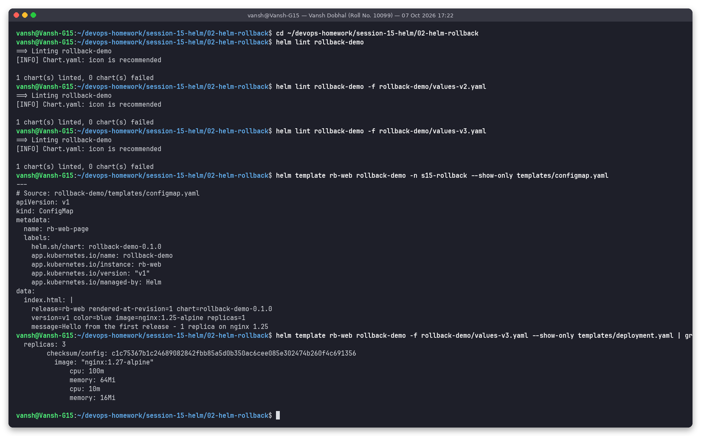

## Step 1 – Install (revision 1)

```bash
helm install rb-web rollback-demo -n s15-rollback --create-namespace --wait --timeout 120s
kubectl run client -n s15-rollback --image=busybox:1.36 --restart=Never -- sleep 3600
helm history rb-web -n s15-rollback
```

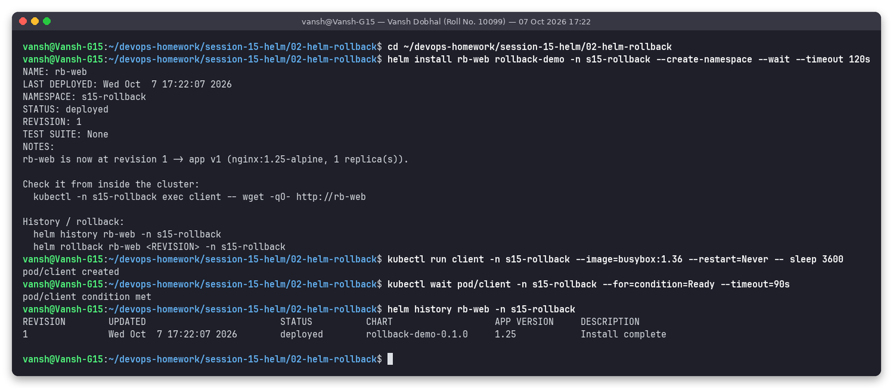

### Verify revision 1

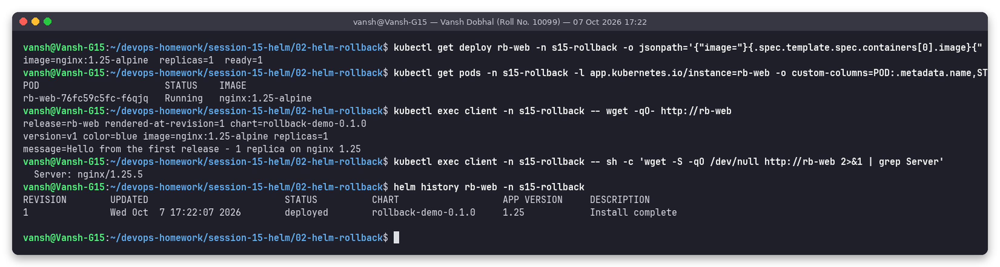

```text
image=nginx:1.25-alpine  replicas=1  ready=1
release=rb-web rendered-at-revision=1 chart=rollback-demo-0.1.0
version=v1 color=blue image=nginx:1.25-alpine replicas=1
message=Hello from the first release - 1 replica on nginx 1.25
  Server: nginx/1.25.5
```

## Step 2 – Upgrade #1 (revision 2)

```bash
helm upgrade rb-web rollback-demo -n s15-rollback -f rollback-demo/values-v2.yaml --wait --timeout 120s
helm history rb-web -n s15-rollback
```

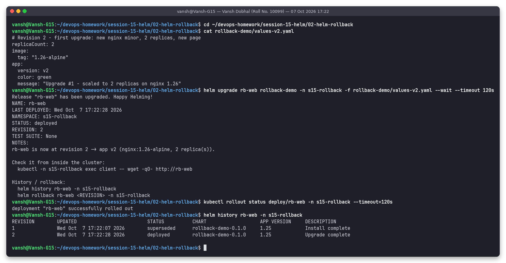

### Verify revision 2

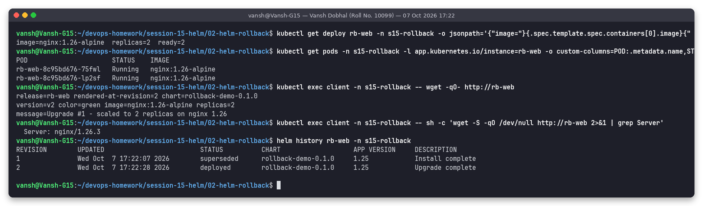

Two pods running `nginx:1.26-alpine`, the page says `version=v2 color=green`, and the `Server:` header changed to `nginx/1.26.3`. History: rev 1 `superseded`, rev 2 `deployed`.

## Step 3 – Upgrade #2 (revision 3)

```bash
helm upgrade rb-web rollback-demo -n s15-rollback -f rollback-demo/values-v3.yaml --wait --timeout 120s
helm history rb-web -n s15-rollback
```

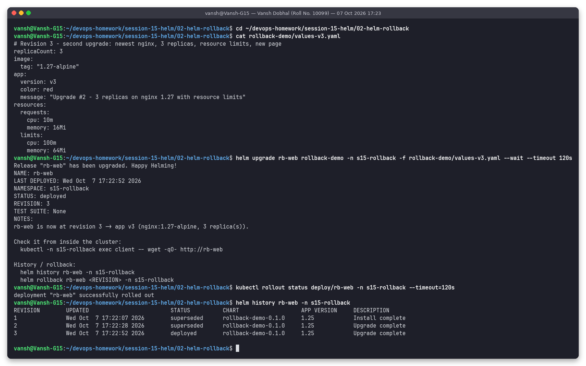

### Verify revision 3

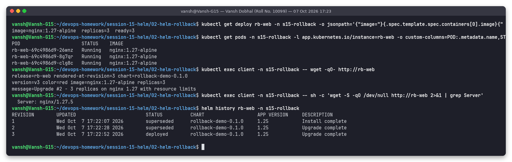

Three pods on `nginx:1.27-alpine`, `Server: nginx/1.27.5`, page `version=v3 color=red`.

### What Helm stored for each revision

```bash
helm get values rb-web -n s15-rollback --revision 1|2|3
diff <(helm get manifest rb-web -n s15-rollback --revision 2) <(helm get manifest rb-web -n s15-rollback --revision 3)
kubectl get secrets -n s15-rollback -l owner=helm,name=rb-web
kubectl get rs -n s15-rollback
```

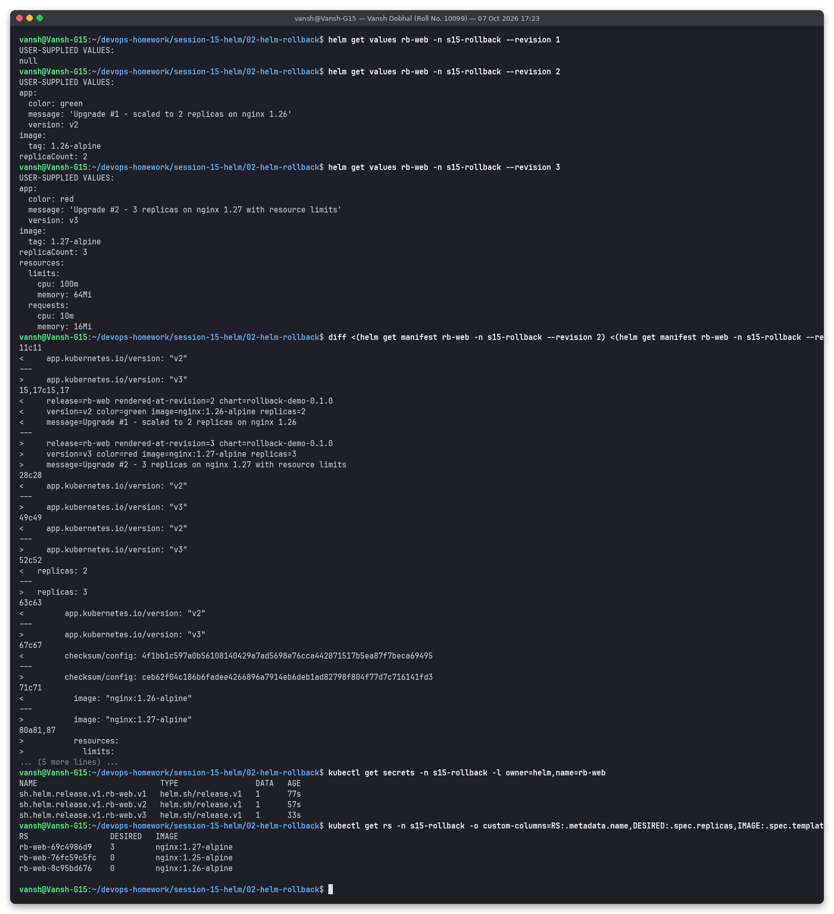

Each revision is a Secret `sh.helm.release.v1.rb-web.vN` holding the values **and** the fully rendered manifest. The diff between rev 2 and rev 3 is exactly what was changed: labels, page text, `replicas`, the checksum, the image and the new `resources` block. Kubernetes also keeps the old ReplicaSets (scaled to 0) for 1.25 and 1.26.

## Step 4 – Rollback to revision 2 (creates revision 4)

```bash
helm rollback rb-web 2 -n s15-rollback --wait --timeout 120s
helm history rb-web -n s15-rollback
helm get values rb-web -n s15-rollback
```

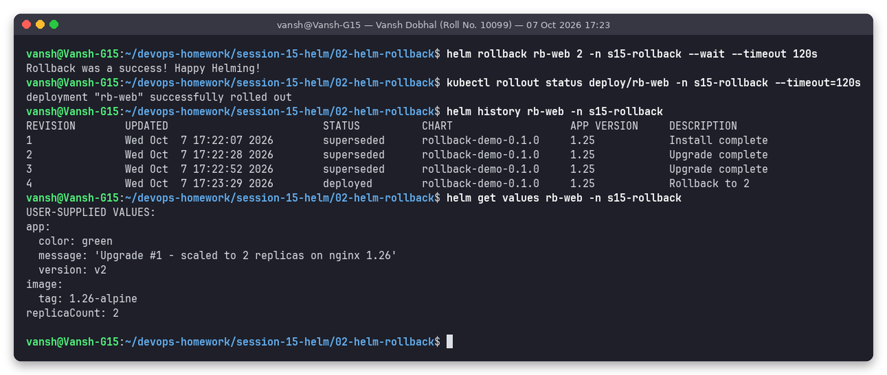

```text
REVISION  STATUS      DESCRIPTION
1         superseded  Install complete
2         superseded  Upgrade complete
3         superseded  Upgrade complete
4         deployed    Rollback to 2
```

### Verify after rollback

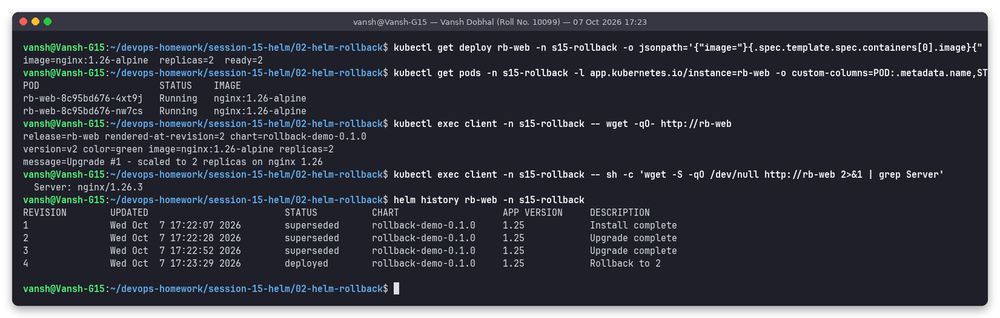

```text
image=nginx:1.26-alpine  replicas=2  ready=2
release=rb-web rendered-at-revision=2 chart=rollback-demo-0.1.0
version=v2 color=green image=nginx:1.26-alpine replicas=2
message=Upgrade #1 - scaled to 2 replicas on nginx 1.26
  Server: nginx/1.26.3
```

The app is back to v2: 2 replicas, nginx 1.26, green page, and the resource limits added in v3 are gone.
Even though the release is now at **revision 4**, the page says `rendered-at-revision=2`. That is correct: `helm rollback` does **not** re-render the templates. It re-applies the manifest stored in revision 2, so `.Release.Revision` keeps the value it had when revision 2 was rendered.

## Step 5 – Automatic rollback with `--atomic`

```bash
helm upgrade rb-web rollback-demo -n s15-rollback -f rollback-demo/values-v3.yaml \
  --set image.tag=9.99-doesnotexist --atomic --timeout 45s
helm history rb-web -n s15-rollback
```

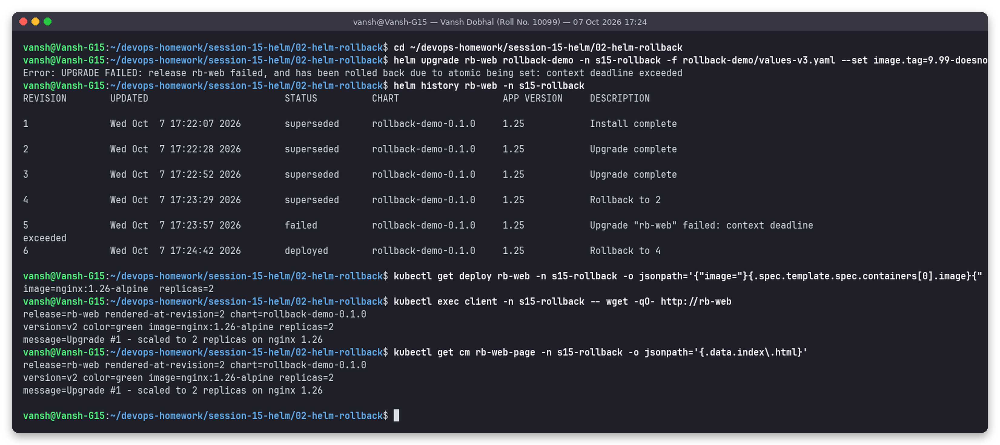

```text
Error: UPGRADE FAILED: release rb-web failed, and has been rolled back due to atomic being set: context deadline exceeded
5   failed    Upgrade "rb-web" failed: context deadline exceeded
6   deployed  Rollback to 4
```

The new pod could not pull its image and never became Ready, so after 45 s Helm marked revision 5 `failed` and rolled back on its own to the last good revision (4), which became revision 6. The deployment is back on `nginx:1.26-alpine` with 2 replicas, and the ConfigMap and page show v2 again.

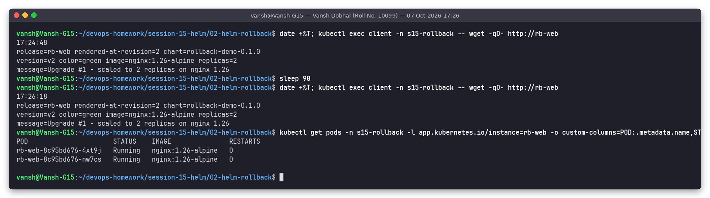

The page was checked again 90 seconds later. It still showed v2 and the pods had 0 restarts, so the failed upgrade had no lasting effect.

> **Gotcha (ConfigMap mounted as a volume):** a failed upgrade does briefly write the *new* ConfigMap. Pods that mount a ConfigMap as a directory volume pick up changes through the kubelet's periodic sync, which can take up to about a minute. In one earlier run of this same script, the page served revision 5's text for a short time after the automatic rollback, even though the ConfigMap object had already been restored. That run's output files were overwritten when the script was re-run, so the screenshots above only show the final, consistent state. Two ways to avoid this: mount the file with `subPath` (as the mini-project chart does; such files never change in place, and the checksum annotation rolls the pods), or give the ConfigMap a name that includes its content hash.

## Cleanup

```bash
helm uninstall rb-web -n s15-rollback --wait
kubectl delete pod client -n s15-rollback --now
kubectl delete namespace s15-rollback --wait
```

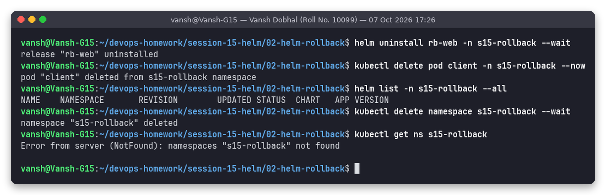

---

## What I learned

| Point | Evidence |
|-------|----------|
| Every `install`, `upgrade` and `rollback` adds a revision. History is never rewritten. | history goes 1, 2, 3, 4 (`Rollback to 2`), 5 (`failed`), 6 (`Rollback to 4`) |
| A rollback re-applies the **stored manifest** of the target revision. It does not re-render the templates. | page shows `rendered-at-revision=2` while the release is at rev 4 |
| `helm get values/manifest --revision N` shows exactly what any revision contained | screenshot 08 |
| `--wait` + a readinessProbe make "deployed" mean "actually serving" | upgrades only returned after the new pods were Ready |
| `--atomic` = `--wait` plus an automatic rollback on failure. Without it, a broken release stays `deployed` (shown in the mini project). | rev 5 `failed`, rev 6 automatic rollback |
| `checksum/config` annotation: a ConfigMap-only change still rolls the pods | the checksum line differs in the rev 2 → rev 3 diff |

| Command | Meaning |
|---------|---------|
| `helm history <rel>` | list revisions with status and description |
| `helm rollback <rel> <N>` | go back to revision N (as a new revision) |
| `helm rollback <rel>` | go back to the previous revision |
| `helm upgrade ... --atomic --timeout 45s` | roll back automatically if the upgrade isn't healthy within the timeout |
| `helm get values <rel> --revision N` | values used by revision N |

## Folder structure

```text
02-helm-rollback/
├── README.md
├── rollback-demo/        # the chart (see above)
├── screenshots/          # 13 PNGs from real runs
└── outputs/              # exact text of those runs
```

## How to reproduce

```bash
cd ~/devops-homework/session-15-helm
bash scripts/02-helm-rollback.sh    # runs every step, takes screenshots, cleans up the namespace at the end
```
