**Name:** Vansh Dobhal | **Roll No:** 10099

# Task 3: Helm Mini Project – Package and Deploy the Notes App with Helm

This follows the instructor's `mini-project/README.md` (notes-chart, `values.yaml` vs `values-prod.yaml`, install, upgrade to prod values, a broken upgrade, rollback, cleanup). I wrote my own version of the chart with a `_helpers.tpl`, a `NOTES.txt`, a notes web page rendered from values, and a dev and a prod release running side by side.
Everything was run for real on minikube in namespace **`s15-mini`**. Script: [`../scripts/03-mini-project.sh`](../scripts/03-mini-project.sh).

## What I built

```text
notes-chart/
├── .helmignore            # files kept out of the packaged .tgz
├── Chart.yaml             # chart metadata (name, version 0.1.0, appVersion 1.0)
├── values.yaml            # defaults = development
├── values-prod.yaml       # production overrides
└── templates/
    ├── _helpers.tpl       # named templates: chart, selectorLabels, labels, image
    ├── configmap.yaml     # env vars + index.html (range over notes & extraEnv)
    ├── deployment.yaml    # envFrom ConfigMap, page mounted via subPath, probes (if), resources (with/toYaml)
    ├── service.yaml       # NodePort in dev (fixed nodePort via if), ClusterIP in prod
    └── NOTES.txt          # post-install message, different for install/upgrade and NodePort/ClusterIP
```

The app is nginx serving a "Notes" page. The page, the environment variables, the replica count, the image and the resources all come from values.

### values.yaml vs values-prod.yaml

| Key | `values.yaml` (dev) | `values-prod.yaml` (prod) |
|-----|---------------------|---------------------------|
| `replicaCount` | 1 | 3 |
| `image.tag` | `1.24-alpine` | `1.25-alpine` |
| `service.type` | `NodePort` (`nodePort: 31590`) | `ClusterIP` (`nodePort: null` removes the dev key) |
| `app.environment` | `development` | `production` |
| `app.notes` | 2 notes | 4 notes |
| `extraEnv` | `LOG_LEVEL: debug` | `LOG_LEVEL: warn`, `FEATURE_SHARING: "true"` |
| `resources` | `{}` (no block rendered) | requests 25m/32Mi, limits 200m/128Mi |

`helm install -f values-prod.yaml` merges the prod file **on top of** `values.yaml`, so prod only needs the keys that differ (`app.owner` and `probes.enabled` still come from the defaults).

---

## Step 1–2: Chart structure and lint

```bash
tree -a notes-chart
helm lint notes-chart
helm lint notes-chart -f notes-chart/values-prod.yaml --strict
```

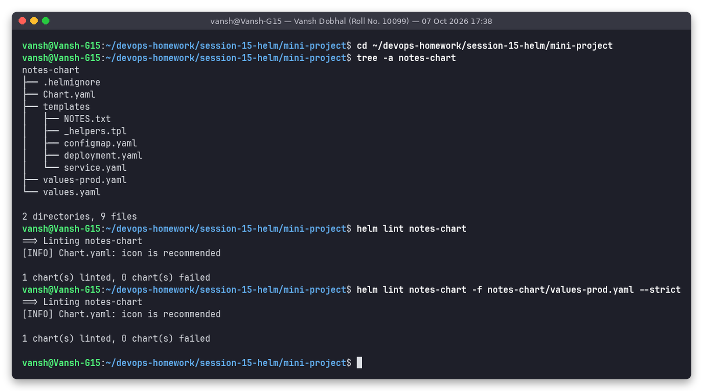

Both value sets pass the lint (only the informational "icon is recommended").

## Step 3: Render locally (`helm template`)

```bash
helm template notes-dev notes-chart -n s15-mini --show-only templates/configmap.yaml
helm template notes-dev notes-chart -n s15-mini --show-only templates/service.yaml
helm template notes-dev notes-chart --set image.repository="" 2>&1 | grep Error
```

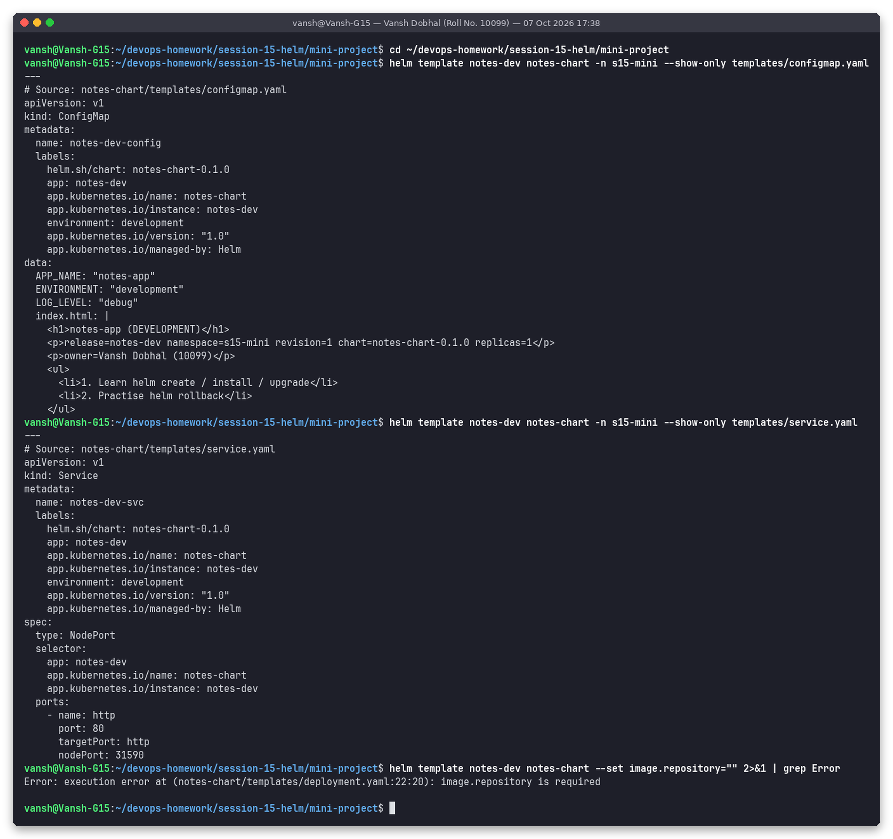

All `{{ }}` are replaced: the `range` loops produced `LOG_LEVEL` and the two `<li>` lines, `upper` produced `DEVELOPMENT`, and the `if` in service.yaml added `nodePort: 31590`. The last command shows input validation with `required`:

```text
Error: execution error at (notes-chart/templates/deployment.yaml:22:20): image.repository is required
```

### Dev vs prod rendering

```bash
helm template notes notes-chart > /tmp/s15-dev.yaml
helm template notes notes-chart -f notes-chart/values-prod.yaml > /tmp/s15-prod.yaml
diff /tmp/s15-dev.yaml /tmp/s15-prod.yaml | grep -E '^[<>]' | grep -v checksum
```

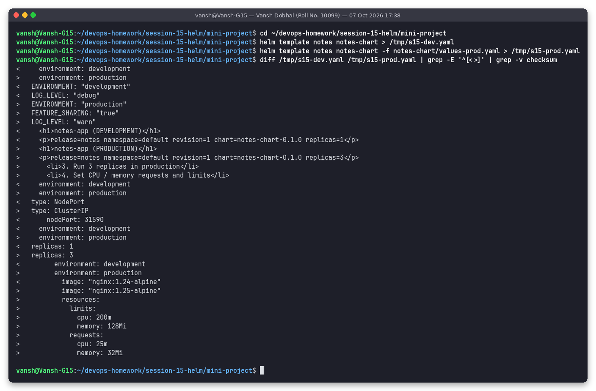

The diff shows the effect of one values file: environment labels, env vars, extra notes, `NodePort` → `ClusterIP`, `replicas 1 → 3`, image 1.24 → 1.25, and a `resources` block that only exists in prod.

## Step 4: Install – development

```bash
helm install notes-dev notes-chart -n s15-mini --create-namespace --wait --timeout 120s
kubectl get pods,svc,configmap -n s15-mini -l app.kubernetes.io/instance=notes-dev
curl -s http://$(minikube ip):31590
kubectl exec -n s15-mini deploy/notes-dev-deploy -- sh -c 'env | grep -E "APP_NAME|ENVIRONMENT|LOG_LEVEL" | sort'
```

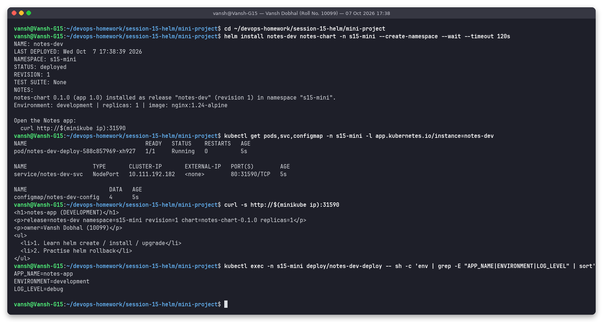

```text
<h1>notes-app (DEVELOPMENT)</h1>
<p>release=notes-dev namespace=s15-mini revision=1 chart=notes-chart-0.1.0 replicas=1</p>
<p>owner=Vansh Dobhal (10099)</p>
...
APP_NAME=notes-app
ENVIRONMENT=development
LOG_LEVEL=debug
```

The app is reachable from the host on NodePort 31590. The env vars from the ConfigMap reached the container through `envFrom`.

## Step 5: Install – production (separate release, same chart)

```bash
helm install notes-prod notes-chart -n s15-mini -f notes-chart/values-prod.yaml --wait --timeout 120s
kubectl get pods,svc -n s15-mini -l app.kubernetes.io/instance=notes-prod
kubectl exec -n s15-mini client -- wget -qO- http://notes-prod-svc
```

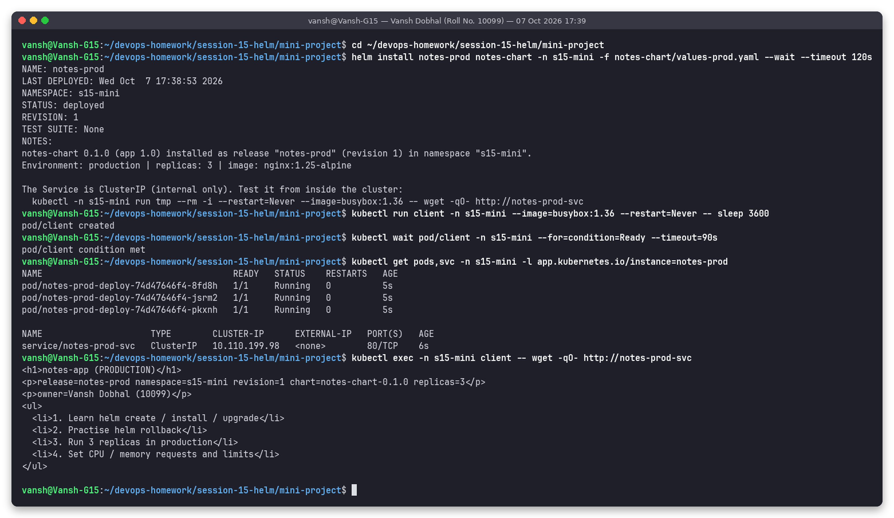

3 pods and a ClusterIP Service. The prod NOTES.txt prints the in-cluster test command instead of a NodePort URL. Because prod is internal, it was tested from a busybox `client` pod.

### Dev and prod side by side

```bash
helm list -n s15-mini
kubectl get deploy -n s15-mini -o custom-columns=NAME:...,READY:...,IMAGE:...,ENV:...,LIMITS:...
kubectl get svc -n s15-mini
helm get values notes-prod -n s15-mini
```

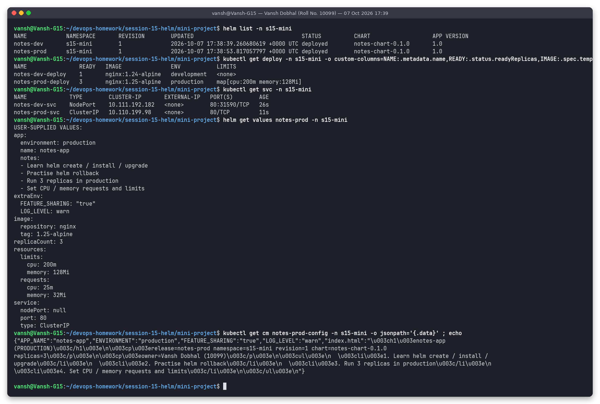

```text
NAME                READY   IMAGE               ENV           LIMITS
notes-dev-deploy    1       nginx:1.24-alpine   development   <none>
notes-prod-deploy   3       nginx:1.25-alpine   production    map[cpu:200m memory:128Mi]
```

One chart, two releases, two configurations. All names are prefixed with `.Release.Name`, so the two releases never collide.

## Step 6 (instructor step 11): Upgrade notes-dev to production values

```bash
helm upgrade notes-dev notes-chart -n s15-mini -f notes-chart/values-prod.yaml --wait --timeout 120s
kubectl get pods -n s15-mini -l app.kubernetes.io/instance=notes-dev
kubectl get svc notes-dev-svc -n s15-mini
helm history notes-dev -n s15-mini
```

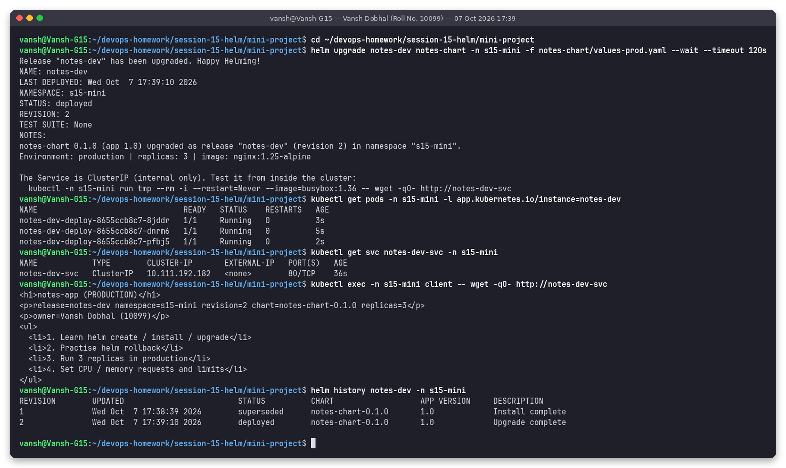

Revision 2: 3 pods on nginx 1.25, and the Service was changed in place from `NodePort` to `ClusterIP`. Helm's patch removed the `nodePort` field because it is no longer in the rendered manifest. NOTES.txt now says "upgraded ... (revision 2)" (`.Release.IsInstall` is false).

## Step 7 (instructor step 13): Simulate a bad upgrade

```bash
helm upgrade notes-dev notes-chart -n s15-mini -f notes-chart/values-prod.yaml --set image.tag=broken-tag-does-not-exist
sleep 25
kubectl get pods -n s15-mini -l app.kubernetes.io/instance=notes-dev
helm history notes-dev -n s15-mini
```

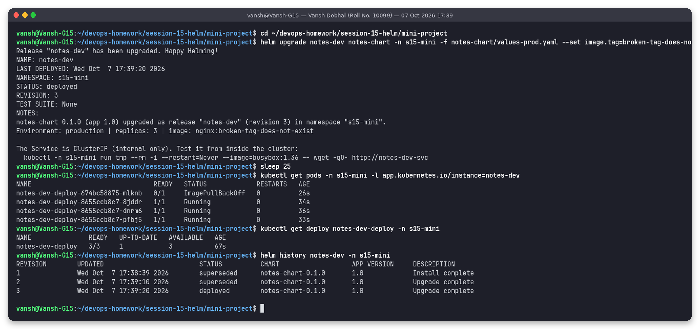

```text
notes-dev-deploy-674bc58875-mlknb   0/1     ImagePullBackOff   0          26s
notes-dev-deploy-8655ccb8c7-8jddr   1/1     Running            0          34s
...
3       ...     deployed        ...     Upgrade complete
```

Two things to note:
1. Helm reports revision 3 as **`deployed`** even though it is broken. Without `--wait`/`--atomic`, Helm only checks that the API server accepted the objects.
2. The Deployment's rolling update protected the app: the 3 old pods kept running (`READY 3/3, UP-TO-DATE 1`) while the single new pod was stuck in `ImagePullBackOff`, so users saw no outage.

(I passed `-f values-prod.yaml` together with `--set` on purpose. `helm upgrade` without `-f` or `--reuse-values` starts again from the chart defaults, which would also have reverted the release to the dev settings.)

## Step 8 (instructor step 14): Rollback to revision 2

```bash
helm rollback notes-dev 2 -n s15-mini --wait --timeout 120s
kubectl get pods -n s15-mini -l app.kubernetes.io/instance=notes-dev
kubectl get deploy notes-dev-deploy -n s15-mini -o jsonpath='{"image="}{...image}{"  replicas="}{.spec.replicas}{"\n"}'
helm history notes-dev -n s15-mini
```

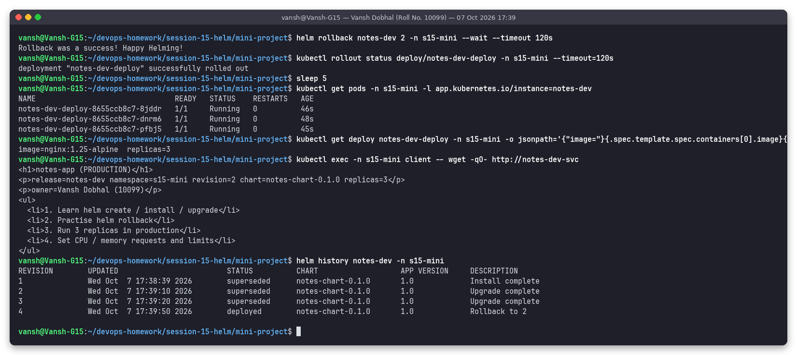

```text
image=nginx:1.25-alpine  replicas=3
4       ...     deployed        ...     Rollback to 2
```

The broken pod disappeared. The 3 healthy pods are **the same pods as before** (same ReplicaSet hash `8655ccb8c7`, ages 45–48 s): the pod template after the rollback is identical to revision 2's, so Kubernetes simply scaled the broken ReplicaSet to 0.

## Step 9: Package the chart

```bash
helm package notes-chart -d dist
tar -tzf dist/notes-chart-0.1.0.tgz
helm show chart dist/notes-chart-0.1.0.tgz
```

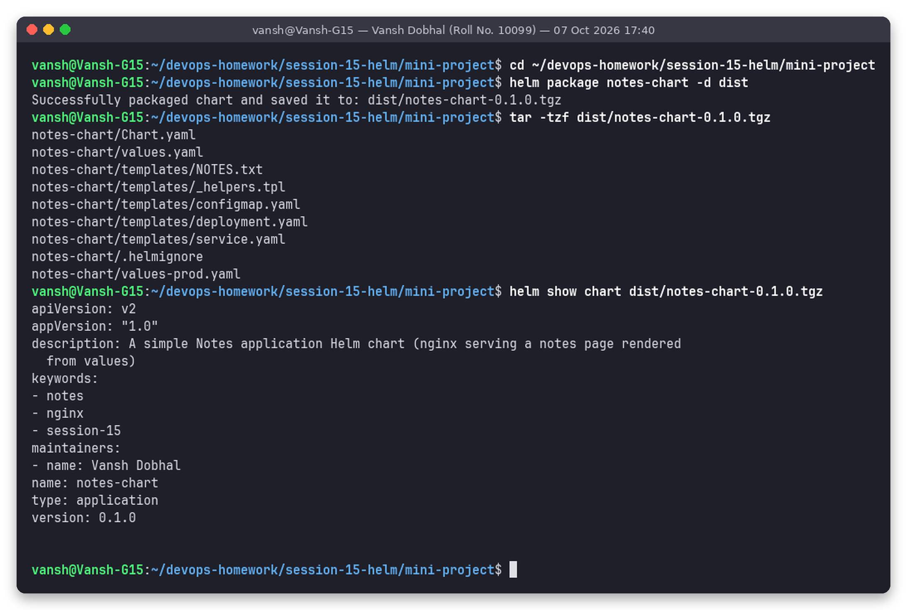

The distributable archive is [`dist/notes-chart-0.1.0.tgz`](dist/notes-chart-0.1.0.tgz).

## Step 10 (instructor step 15): Clean up

```bash
helm uninstall notes-dev notes-prod -n s15-mini --wait
kubectl delete pod client -n s15-mini --now
kubectl get pods,services,configmaps -n s15-mini
kubectl delete namespace s15-mini --wait
```

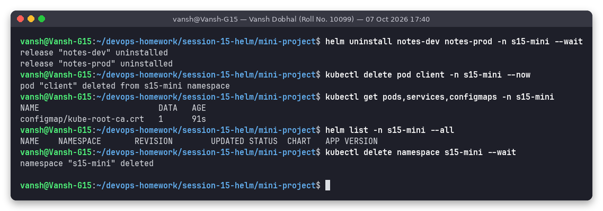

Only the automatic `kube-root-ca.crt` ConfigMap was left before the namespace was deleted.

---

## Chart structure explanation

| File | Role |
|------|------|
| `Chart.yaml` | Chart identity. `apiVersion: v2` = Helm 3 chart. `version` is the **chart's** SemVer (bump it when templates change). `appVersion` is the version of the app inside (informational, here used as the default image tag in the `notes-chart.image` helper). `type: application` (vs `library`). |
| `values.yaml` | Default configuration. Every `.Values.x` used in a template should have a default here. |
| `values-prod.yaml` | An environment overlay passed with `-f`. Merged over `values.yaml`. Later `-f` files and `--set` win. |
| `templates/*.yaml` | Kubernetes manifests with Go template expressions. Every file is rendered and sent to the API server. |
| `templates/_helpers.tpl` | Files starting with `_` are **not** rendered as manifests. They hold `define`d named templates for reuse. |
| `templates/NOTES.txt` | Rendered and printed after install/upgrade (`helm get notes` shows it later). It is not applied to the cluster. |
| `.helmignore` | Patterns excluded from `helm package`. |
| `charts/` | (optional) dependency charts; not used here. |

## Templating notes (with examples from this chart)

| Feature | Example in notes-chart | Result |
|---------|------------------------|--------|
| **Values** | `replicas: {{ .Values.replicaCount }}` | `1` (dev) / `3` (prod) |
| **Built-in `.Release`** | `{{ .Release.Name }}-deploy`, `.Release.Namespace`, `.Release.Revision`, `.Release.IsInstall`, `.Release.Service` | `notes-dev-deploy`, `s15-mini`, `2`, `false`, `Helm` |
| **Built-in `.Chart`** | `{{ .Chart.Name }}-{{ .Chart.Version }}`, `.Chart.AppVersion` | `notes-chart-0.1.0`, `1.0` |
| **`define` / `include`** | `{{- include "notes-chart.labels" . \| nindent 4 }}` | same label block in every object, indented correctly |
| **`nindent` / `indent`** | `nindent 4` adds a newline + 4 spaces to every line | valid YAML nesting |
| **`if` / `else`** | `{{- if and (eq .Values.service.type "NodePort") .Values.service.nodePort }}` | `nodePort:` only in dev. `{{- if .Values.probes.enabled }}` toggles probes. |
| **`range` over a list** | `{{- range $i, $note := .Values.app.notes }}<li>{{ add $i 1 }}. {{ $note }}</li>{{- end }}` | numbered notes on the page |
| **`range` over a map** | `{{- range $key, $value := .Values.extraEnv }}{{ $key }}: {{ $value \| quote }}{{- end }}` | `LOG_LEVEL`, `FEATURE_SHARING` keys (sorted) |
| **`with` + `toYaml`** | `{{- with .Values.resources }} resources: {{- toYaml . \| nindent 12 }}{{- end }}` | whole requests/limits map in prod, nothing in dev (`{}` is empty, so `with` skips it) |
| **`quote`, `upper`, `default`** | `{{ .Values.app.environment \| upper }}`, `{{ .Values.app.owner \| default "unknown" }}` | `PRODUCTION`, fallback value |
| **`required`** | `required "image.repository is required" .Values.image.repository` | rendering fails early with a clear message |
| **`$` and `.Template`** | `{{ include (print $.Template.BasePath "/configmap.yaml") . \| sha256sum }}` | `checksum/config` annotation, so pods roll when the ConfigMap changes |
| **Whitespace control** | `{{-` / `-}}` trims whitespace and newlines on that side | no blank lines in output |
| **Variables** | `{{- $repo := required ... -}}` in the `image` helper | local reuse inside a template |

Why the page is mounted with `subPath`: a single file mounted via `subPath` never changes inside a running container. Combined with the `checksum/config` annotation, every page change rolls new pods, so a pod's content always matches its revision (see the ConfigMap-volume gotcha in [Task 2](../02-helm-rollback/README.md)).

## What I practised (instructor checklist)

```text
[PASS] Created a Helm chart from scratch (Chart.yaml, values, templates, helpers, NOTES)
[PASS] Used values.yaml and values-prod.yaml (and ran dev + prod side by side)
[PASS] Deployed to Kubernetes with helm install
[PASS] Upgraded the release with different values (NodePort -> ClusterIP, 1 -> 3 replicas)
[PASS] Simulated a bad upgrade (broken image tag -> ImagePullBackOff)
[PASS] Rolled back to a healthy revision (rev 4 = "Rollback to 2")
[PASS] Packaged the chart (.tgz)
[PASS] Cleaned up with helm uninstall + namespace delete
```

## Folder structure

```text
mini-project/
├── README.md
├── notes-chart/          # the chart
├── dist/                 # notes-chart-0.1.0.tgz
├── screenshots/          # 11 PNGs from real runs
└── outputs/              # exact text of those runs
```

## How to reproduce

```bash
cd ~/devops-homework/session-15-helm
bash scripts/03-mini-project.sh     # all steps + screenshots, deletes namespace s15-mini at the end
```
