# Session 16 – CI/CD with GitHub Actions

**Name:** Vansh Dobhal | **Roll No:** 10099

A small **Calculator API** (Python / Flask) with unit tests, a Dockerfile, Kubernetes manifests and a
complete **GitHub Actions CI/CD pipeline**:

* **CI** – lint (flake8) → unit tests on a **matrix of Python 3.11 / 3.12 / 3.13** with a coverage gate (≥ 90 %) → coverage **artifact** → Docker image build + container smoke test → image **artifact**
* **CD** – push the image to **GHCR** (`ghcr.io/v4xsh/s16-calculator-api`, only on `main`) → **deploy to Kubernetes** (a `kind` cluster created on the runner) → rollout check + smoke test through the Service

> **How the pipeline was executed (honest note).** The repository has not been pushed to GitHub yet, so there
> are no GitHub-hosted runs to screenshot. The pipeline was executed locally with **act** (GitHub Actions runner emulator) before pushing; after pushing, the same workflow runs on GitHub – see the Actions tab.
> act runs every job in a Docker container (`catthehacker/ubuntu:act-latest`, a re-creation of `ubuntu-latest`) and uses the real
> actions (`actions/checkout`, `setup-python`, `upload-artifact`, `download-artifact`, `azure/setup-kubectl`). I gave it two
> repository *variables* so the CD part could run for real on my laptop:
> `REGISTRY=localhost:5000` (a local `registry:2` container instead of GHCR) and `CLUSTER=minikube` (my minikube, reached through a
> kubeconfig passed as a secret, instead of the `kind` cluster used on GitHub). On GitHub neither variable is set, so the
> defaults `ghcr.io` + `kind` are used. Every screenshot below comes from a real run; the full act logs are in
> [`outputs/act-s16-main-run.log`](outputs/act-s16-main-run.log) and [`outputs/act-s16-failing-tests-run.log`](outputs/act-s16-failing-tests-run.log).

---

## Contents

1. [Project and files](#1-project-and-files)
2. [Pipeline diagram](#2-pipeline-diagram)
3. [Concepts with the matching snippet from my workflow](#3-concepts-with-the-matching-snippet-from-my-workflow) – CI vs CD, CI/CD pipeline, GitHub Actions, workflow, jobs, steps, runners, secrets, artifacts, build, test, pipeline execution
4. [Running each stage directly](#4-running-each-stage-directly-on-my-machine)
5. [Pipeline execution with act – screenshots](#5-pipeline-execution-with-act--screenshots)
6. [Negative test: a failing unit test stops the pipeline](#6-negative-test-a-failing-unit-test-stops-the-pipeline)
7. [Folder structure](#7-folder-structure) · [How to reproduce](#8-how-to-reproduce) · [What I learned](#9-what-i-learned)

---

## 1. Project and files

| File | Purpose |
|---|---|
| `app/calculator.py` | Pure functions `add`, `subtract`, `multiply`, `divide`, `calculate(op, a, b)` – the logic the unit tests cover |
| `app/main.py` | Flask app: `GET /health`, `GET /version` (shows the git SHA baked into the image), `GET /api/<op>?a=&b=`, `POST /api/calculate` |
| `tests/test_calculator.py`, `tests/test_api.py` | 18 pytest tests (unit tests for the functions + HTTP tests with Flask's test client) |
| `requirements.txt` / `requirements-dev.txt` | runtime (Flask, gunicorn) / CI tools (pytest, pytest-cov, flake8) – all pinned |
| `pytest.ini`, `.flake8` | test discovery and lint settings |
| `Dockerfile` | `python:3.12-slim`, dependency layer cached first, runs **gunicorn as non-root UID 10001**, `GIT_SHA` build-arg |
| `k8s/deployment.yaml`, `k8s/service.yaml` | 2 replicas with readiness/liveness probes on `/health`, resource requests/limits, ClusterIP Service port 80 → 8000 |
| **`../.github/workflows/session16-ci-cd.yml`** | **the workflow GitHub actually runs** (repo root) |
| `.github/workflows/session16-ci-cd.yml` | identical copy kept next to the code for reading (GitHub ignores workflows that are not in the repo-root `.github/workflows`) |
| `scripts/act-stage.sh` | creates a throw-away git checkout (`~/act-stage/...`) with one local commit so act has a real SHA/branch – nothing is committed in this homework repo |
| `scripts/act-run.sh` | the exact `act` command used (runner image, artifact server, variables, dummy secrets) |
| `scripts/snaps-*.sh` | the scripts that produced every screenshot in this README |

Why the workflow sits at the repository root: GitHub only reads `.github/workflows/` at the **root** of a repository.
Because this homework repo contains one folder per session, the workflow uses a **path filter** so it only runs when
this session changes, and `defaults.run.working-directory` so every `run:` step executes inside this folder:

```yaml
on:
  push:
    branches: [main]
    paths:
      - "session-16-cicd-github-actions/**"
      - ".github/workflows/session16-ci-cd.yml"
...
defaults:
  run:
    shell: bash
    working-directory: session-16-cicd-github-actions
```

---

## 2. Pipeline diagram

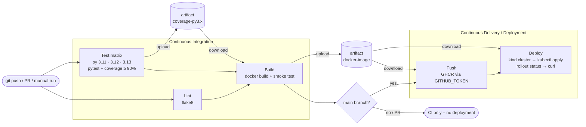

The same graph as act reads it from the YAML (`act -l`) – stage 0 jobs run in parallel, later stages wait for `needs:`:

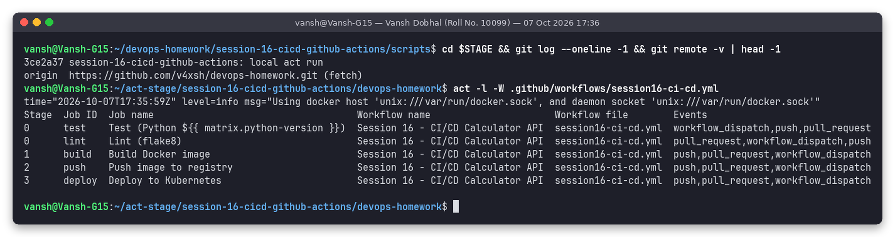

---

## 3. Concepts with the matching snippet from my workflow

### 3.1 CI vs CD

| | **Continuous Integration (CI)** | **Continuous Delivery** | **Continuous Deployment** |
|---|---|---|---|
| Goal | every change is merged often and **verified automatically** | every verified change is **packaged and ready** to release | every verified change is **released automatically** |
| Trigger | push / pull request | successful CI on the release branch | successful CI on the release branch |
| Typical steps | checkout, install, lint, unit tests, coverage, build | build image, push to registry, deploy to staging | same as delivery + deploy to production, no human click |
| Output | pass/fail feedback in minutes, test reports | a versioned artifact (image tag = commit SHA) | the new version running |
| Human gate | code review on the PR | **yes** – someone approves the release | **no** |
| In my workflow | jobs `lint`, `test`, `build` (run on every push **and** PR) | jobs `push`, `deploy` – only on `main`; the deploy job uses `environment: dev`, which on GitHub can be given *required reviewers* to turn it into a manual approval gate | without reviewers on the `dev` environment the pipeline behaves as continuous deployment |

The split is visible in the condition on the first CD job – pull requests run CI only:

```yaml
  push:
    name: Push image to registry
    needs: build
    if: github.ref == 'refs/heads/main' && (github.event_name == 'push' || (github.event_name == 'workflow_dispatch' && inputs.deploy))
```

### 3.2 CI/CD pipeline

A pipeline is an ordered set of automated **stages** that every commit passes through; each stage is a quality
gate and a failure stops everything after it (fail fast). Mine has 5 stages: **lint → test → build → push → deploy**
(see the diagram above). Ordering is expressed with `needs:`; independent work (lint and the three test jobs) runs in parallel:

```yaml
  build:
    name: Build Docker image
    needs: [lint, test]          # waits for flake8 AND all three matrix test jobs
  ...
  deploy:
    name: Deploy to Kubernetes
    needs: [build, push]         # needs build's output (the image tag) and a pushed image
```

### 3.3 GitHub Actions

GitHub's built-in automation platform. Building blocks:

| Term | Meaning | Example in this repo |
|---|---|---|
| **Event** | what starts a workflow | `push`, `pull_request`, `workflow_dispatch` |
| **Workflow** | a YAML file in `.github/workflows/` | `session16-ci-cd.yml` |
| **Job** | a set of steps that runs on **one runner**; jobs run in parallel unless linked with `needs` | `lint`, `test`, `build`, `push`, `deploy` |
| **Step** | one shell command (`run:`) or one reusable **action** (`uses:`) | `Run unit tests with coverage` |
| **Action** | reusable step published in a repo/Marketplace | `actions/checkout@v4`, `docker/login-action@v3`, `helm/kind-action@v1.10.0` |
| **Runner** | the machine that executes a job | `ubuntu-latest` (GitHub-hosted VM) |
| **Context / expression** | `${{ ... }}` values: `github.sha`, `matrix.python-version`, `secrets.X`, `needs.build.outputs.image-tag` | used throughout |

### 3.4 Workflow

The workflow file defines *when* (`on`), *with which permissions* (`permissions`), *shared settings*
(`env`, `defaults`, `concurrency`) and *what* (`jobs`):

```yaml
name: "Session 16 - CI/CD Calculator API"
on:
  push:            { branches: [main], paths: [...] }
  pull_request:    { branches: [main], paths: [...] }
  workflow_dispatch:                 # "Run workflow" button, with an input
    inputs:
      deploy:
        description: "Run the CD part (push image + deploy to Kubernetes)"
        type: boolean
        default: true

permissions:
  contents: read                     # least privilege; the push job adds packages: write for itself

concurrency:
  group: s16-${{ github.ref }}
  cancel-in-progress: true           # a newer push cancels the older run of the same branch

env:
  IMAGE_NAME: s16-calculator-api
  REGISTRY: ${{ vars.REGISTRY || 'ghcr.io' }}
  CLUSTER: ${{ vars.CLUSTER || 'kind' }}
```

### 3.5 Jobs

Five jobs; `outputs` pass data between jobs (the image tag computed once in `build` is reused by `push` and `deploy`):

```yaml
  build:
    name: Build Docker image
    needs: [lint, test]
    runs-on: ubuntu-latest
    outputs:
      image-tag: ${{ steps.meta.outputs.tag }}
    steps:
      - name: Compute image tag
        id: meta
        run: |
          TAG="${GITHUB_SHA::7}"
          echo "tag=${TAG}" >> "$GITHUB_OUTPUT"
```

Each job gets a **fresh runner** – nothing on disk survives between jobs, which is why every job starts with
`actions/checkout` and why files are passed with artifacts (3.9).

### 3.6 Steps

A step is either an action (`uses:`) or a shell script (`run:`); steps of one job share the same filesystem and run
in order. `if:` makes a step conditional, `id:` lets later steps read its outputs:

```yaml
    steps:
      - name: Checkout
        uses: actions/checkout@v4                       # action
      - name: Set up Python ${{ matrix.python-version }}
        uses: actions/setup-python@v5                   # action with inputs
        with:
          python-version: ${{ matrix.python-version }}
      - name: Install dependencies                      # shell step
        run: |
          python -m pip install --upgrade pip
          pip install -r requirements-dev.txt
      - name: Upload coverage + test report artifact
        if: always()                                    # upload reports even when tests fail
        uses: actions/upload-artifact@v4
```

### 3.7 Runners

| Runner type | What it is | When to use |
|---|---|---|
| GitHub-hosted `ubuntu-latest` / `windows-latest` / `macos-latest` | fresh VM per job, preinstalled tools (Docker, kubectl, kind, Python…), destroyed afterwards | default – used by every job here |
| Larger GitHub-hosted | more CPU/RAM, paid | heavy builds |
| Self-hosted (`runs-on: [self-hosted, linux]`) | your own machine/VM/K8s pod running the runner agent | private network access, special hardware, caching |
| act (local) | Docker container that imitates a runner | **testing workflows before pushing – what I did** |

A **matrix** fans one job out into several runner jobs – here one per Python version, `fail-fast: false` so one
broken version does not cancel the others:

```yaml
  test:
    name: Test (Python ${{ matrix.python-version }})
    runs-on: ubuntu-latest
    strategy:
      fail-fast: false
      matrix:
        python-version: ["3.11", "3.12", "3.13"]
```

act expanded it into three parallel jobs and set up each interpreter (screenshot in 5.2).

### 3.8 Secrets

Secrets are encrypted values stored in *Settings → Secrets and variables → Actions* (repo, environment or org level).
They are referenced with `${{ secrets.NAME }}`, are **not** given to workflows triggered from forks, and every
occurrence of the value in the log is **masked as `***`**. Good practice: map the secret to an environment variable
of only the step that needs it (never paste it into the script text).

```yaml
      - name: Use a repository secret (masked in logs)
        env:
          DEMO_API_KEY: ${{ secrets.DEMO_API_KEY }}
        run: |
          if [ -z "${DEMO_API_KEY}" ]; then
            echo "DEMO_API_KEY is not configured (e.g. pull request from a fork) - skipping"
          else
            echo "DEMO_API_KEY is configured (length ${#DEMO_API_KEY} characters)"
            echo "Printing it on purpose to show masking: ${DEMO_API_KEY}"
          fi
```

Real output from the act run (secret passed as a dummy value with `-s DEMO_API_KEY=...`):

```text
[Session 16 - CI/CD Calculator API/Build Docker image  ]   | DEMO_API_KEY is configured (length 28 characters)
[Session 16 - CI/CD Calculator API/Build Docker image  ]   | Printing it on purpose to show masking: ***
```

Secrets used by the workflow:

| Secret | Where | Purpose |
|---|---|---|
| `GITHUB_TOKEN` | push job, `docker/login-action` | automatic, per-run token; `permissions: packages: write` lets it push to `ghcr.io/v4xsh/...` – no personal token needed |
| `DEMO_API_KEY` | build job | demonstrates referencing + masking |
| `KUBE_CONFIG_B64` | deploy job, only when `CLUSTER != kind` | base64 kubeconfig of an external cluster (used for my minikube in the act run; on GitHub the kind cluster needs no secret) |

```yaml
      - name: Log in to GHCR
        if: env.REGISTRY == 'ghcr.io'
        uses: docker/login-action@v3
        with:
          registry: ghcr.io
          username: ${{ github.actor }}
          password: ${{ secrets.GITHUB_TOKEN }}
```

### 3.9 Artifacts

Artifacts are files a job uploads so that later jobs (or people, from the run page) can download them. Two kinds here:

| Artifact | Uploaded by | Downloaded by | Contents |
|---|---|---|---|
| `coverage-py3.11`, `coverage-py3.12`, `coverage-py3.13` | each matrix test job | `build` (the 3.12 one) | `coverage.xml`, `junit.xml`, `htmlcov/` |
| `docker-image` | `build` | `push`, `deploy` | `image.tar.gz` (≈ 43 MB) – the exact image that was tested is the one that gets pushed and deployed |

```yaml
      - name: Upload coverage + test report artifact
        if: always()
        uses: actions/upload-artifact@v4
        with:
          name: coverage-py${{ matrix.python-version }}
          path: ${{ env.APP_DIR }}/reports/      # uses: paths are relative to the repo root, not working-directory
          retention-days: 7
...
      - name: Download coverage artifact from the test job
        uses: actions/download-artifact@v4
        with:
          name: coverage-py3.12
          path: ${{ env.APP_DIR }}/downloaded-coverage
```

(Artifacts are different from the **cache** (`actions/cache`): a cache speeds up future runs, artifacts are outputs of this run.)

### 3.10 Build

"Build" turns source into a deployable, versioned unit – here a Docker image tagged with the short commit SHA, which
is also baked into the app so `/version` tells exactly which commit is running. The build job also smoke-tests the
container before it is allowed to leave the job:

```yaml
      - name: Build image
        run: |
          docker build \
            --build-arg GIT_SHA=${{ steps.meta.outputs.tag }} \
            -t ${IMAGE_NAME}:${{ steps.meta.outputs.tag }} .
      - name: Smoke test the container
        run: |
          docker run -d --name smoke-${{ github.run_id }} ${IMAGE_NAME}:${{ steps.meta.outputs.tag }}
          sleep 3
          docker exec smoke-${{ github.run_id }} python -c \
            "import urllib.request as u; print(u.urlopen('http://127.0.0.1:8000/health').read().decode()); ..."
```

### 3.11 Test

Static check (flake8) + 18 unit/API tests with pytest; `--cov-fail-under=90` turns coverage into a gate, and
`--junitxml` / `--cov-report=xml|html` produce machine-readable reports for the artifact:

```yaml
      - name: Run unit tests with coverage
        run: |
          mkdir -p reports
          pytest -v \
            --cov=app --cov-report=term-missing \
            --cov-report=xml:reports/coverage.xml \
            --cov-report=html:reports/htmlcov \
            --junitxml=reports/junit.xml \
            --cov-fail-under=90
```

### 3.12 Pipeline execution

| Trigger | What runs |
|---|---|
| push to `main` touching this folder | all 5 jobs (CI + CD) |
| pull request to `main` | `lint`, `test`, `build` only (the `if:` on `push` skips CD, and `deploy` is skipped because a job it `needs` was skipped) |
| *Actions → Run workflow* (`workflow_dispatch`) | CI, plus CD when the `deploy` input is ticked and the branch is `main` |
| push that only changes other sessions | nothing (path filter) |

The status of every job/step is shown live in the Actions tab; a red step stops its job, and every job that `needs`
it is skipped (demonstrated in section 6). On GitHub the deploy job creates a kind cluster on the runner:

```yaml
      - name: Create kind cluster
        if: env.CLUSTER == 'kind'
        uses: helm/kind-action@v1.10.0
        with:
          cluster_name: s16
      ...
      - name: Apply manifests and roll out
        run: |
          TAG=${{ needs.build.outputs.image-tag }}
          kubectl create namespace ${K8S_NAMESPACE} --dry-run=client -o yaml | kubectl apply -f -
          sed "s|image: .*|image: ${IMAGE_NAME}:${TAG}|" k8s/deployment.yaml | kubectl apply -n ${K8S_NAMESPACE} -f -
          kubectl apply -n ${K8S_NAMESPACE} -f k8s/service.yaml
          kubectl rollout status -n ${K8S_NAMESPACE} deployment/calculator-api --timeout=120s
```

---

## 4. Running each stage directly on my machine

Before trusting the pipeline I ran the same commands by hand (Ubuntu 24.04 on WSL2).

**Lint + unit tests + coverage** – flake8 reports `0` problems, 18 tests pass, coverage 100 % (the gate is 90 %):

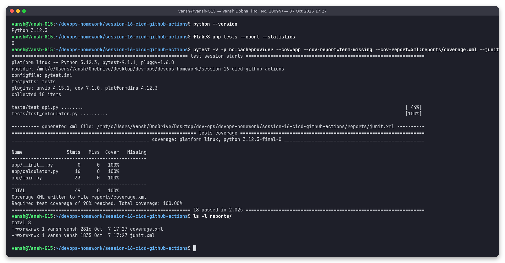

**Docker build + run** – image built, container answers on host port 8100, divide-by-zero is handled, the process runs as UID 10001:

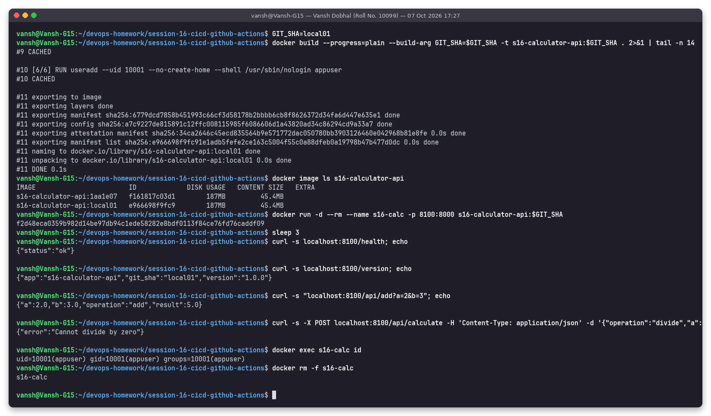

---

## 5. Pipeline execution with act – screenshots

### 5.1 Full run – every job succeeded

`act push` on the staged commit `3ce2a37` (branch `main`): Lint, the three matrix test jobs, Build, Push and Deploy
all ended with `Job succeeded` (39 successful steps, exit code 0).

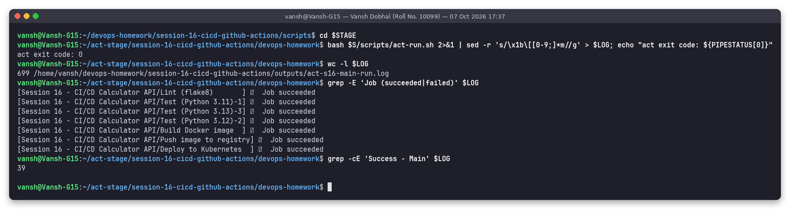

### 5.2 Runners + matrix + tests + coverage

The matrix created one job per version; `setup-python` installed CPython 3.11.17, 3.12.15 and 3.13.16; below is the 3.12
job's pytest output with the coverage table:

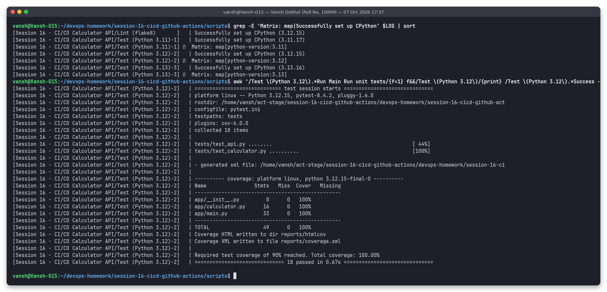

### 5.3 Artifacts and secret masking

Each test job uploaded its `coverage-py3.x` artifact, the build job downloaded the 3.12 one and read 100.0 % from it,
the secret was printed as `***`, and the four artifact zips are on act's artifact server:

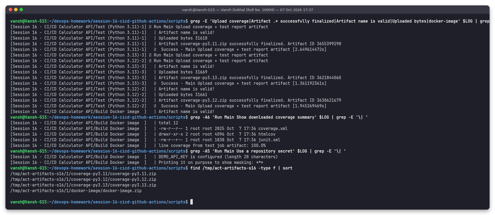

### 5.4 Push to the container registry

The push job downloaded the image artifact, loaded it and pushed the `<sha>` and `latest` tags. In this local run the
registry is `localhost:5000` (a real `registry:2` container); the registry catalog confirms the tags:

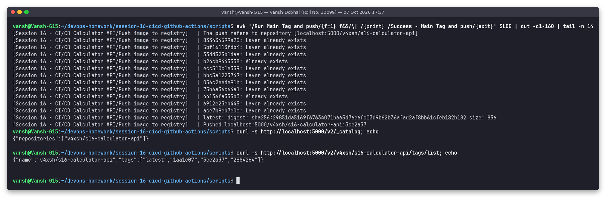

### 5.5 Deploy to Kubernetes

The deploy job wrote the kubeconfig from the `KUBE_CONFIG_B64` secret, imported the image into the cluster node (the
same thing `kind load docker-image` does on GitHub), applied the manifests in namespace `s16`, waited for
`rollout status` and smoke-tested through the Service:

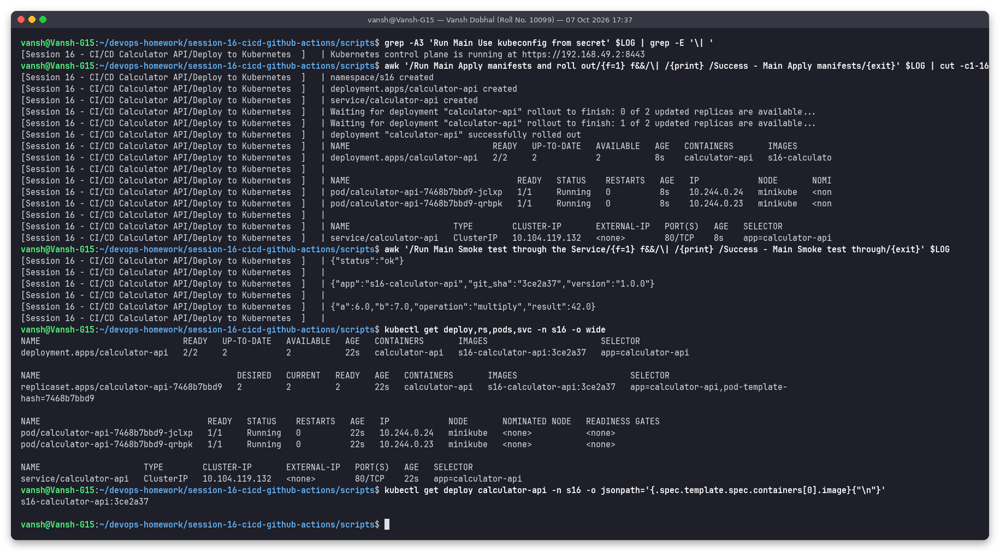

From my own terminal afterwards: the image can be pulled back from the registry, both pods run the image tag of the
commit, and the API answers through `kubectl port-forward` on host port 8101:

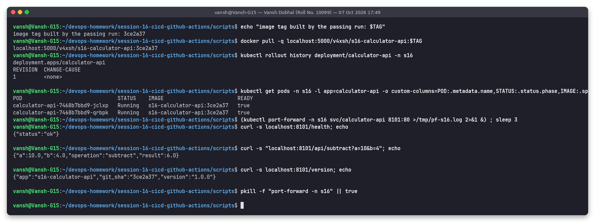

---

## 6. Negative test: a failing unit test stops the pipeline

To prove the gates work I added a second throw-away commit that breaks `add()` (`return a - b`) and ran act again.
All three matrix test jobs failed at *Run unit tests with coverage*, lint still passed, and **Build, Push and Deploy
never started** (`grep -c` for those job names in the log returns `0`) – `needs: [lint, test]` protected the
registry and the cluster. act's exit code was `1`.

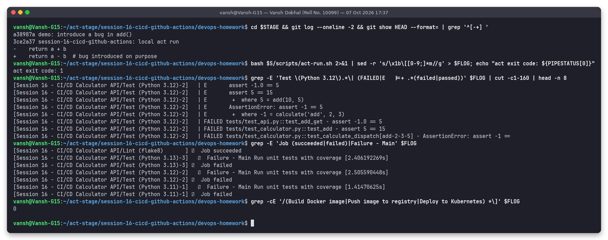

---

## 7. Folder structure

`tree -a` of this folder (the `.github/workflows` file here is the reading copy; GitHub runs the one at the repo root):

```text
.
├── .dockerignore
├── .flake8
├── .github
│   └── workflows
│       └── session16-ci-cd.yml
├── .gitignore
├── Dockerfile
├── README.md
├── app
│   ├── __init__.py
│   ├── calculator.py
│   └── main.py
├── k8s
│   ├── deployment.yaml
│   └── service.yaml
├── outputs
│   ├── 01-lint-and-unit-tests.txt
│   ├── 02-docker-build-and-run.txt
│   ├── 03-act-workflow-graph.txt
│   ├── 04-act-full-pipeline-run.txt
│   ├── 05-act-test-matrix-coverage.txt
│   ├── 06-act-artifacts-and-secret-masking.txt
│   ├── 07-act-push-to-registry.txt
│   ├── 08-act-deploy-to-kubernetes.txt
│   ├── 09-act-failing-test-blocks-pipeline.txt
│   ├── 10-verify-registry-and-k8s-from-host.txt
│   ├── act-s16-failing-tests-run.log
│   └── act-s16-main-run.log
├── pytest.ini
├── requirements-dev.txt
├── requirements.txt
├── screenshots
│   ├── 01-lint-and-unit-tests.png
│   ├── 02-docker-build-and-run.png
│   ├── 03-act-workflow-graph.png
│   ├── 04-act-full-pipeline-run.png
│   ├── 05-act-test-matrix-coverage.png
│   ├── 06-act-artifacts-and-secret-masking.png
│   ├── 07-act-push-to-registry.png
│   ├── 08-act-deploy-to-kubernetes.png
│   ├── 09-act-failing-test-blocks-pipeline.png
│   └── 10-verify-registry-and-k8s-from-host.png
├── scripts
│   ├── act-run.sh
│   ├── act-stage.sh
│   ├── snaps-act.sh
│   ├── snaps-local-stages.sh
│   └── snaps-verify.sh
└── tests
    ├── test_api.py
    └── test_calculator.py
```

---

## 8. How to reproduce

```bash
cd ~/devops-homework/session-16-cicd-github-actions

# stages by hand
python3 -m venv ~/venvs/s16 && . ~/venvs/s16/bin/activate
pip install -r requirements-dev.txt
flake8 app tests && pytest -v --cov=app --cov-fail-under=90
docker build -t s16-calculator-api:dev . && docker run --rm -p 8100:8000 s16-calculator-api:dev

# whole workflow with act (needs Docker; minikube + a local registry for the CD part)
docker run -d -p 5000:5000 --name s17-registry registry:2
bash scripts/act-stage.sh session-16-cicd-github-actions session16-ci-cd.yml
bash scripts/act-run.sh     # = act push -W .github/workflows/session16-ci-cd.yml -P ubuntu-latest=catthehacker/ubuntu:act-latest ...

# on GitHub: push the repo, then Actions -> "Session 16 - CI/CD Calculator API"
#   - create the repository secret DEMO_API_KEY (any value) to see the masking step
#   - nothing else is required: GHCR uses GITHUB_TOKEN, the deploy job creates its own kind cluster
```

Cleanup after capturing the evidence: `kubectl delete namespace s16` and `docker rm -f s17-registry`.

---

## 9. What I learned

* GitHub only reads workflows from the **repository root**; in a mono-repo, `paths:` filters plus
  `defaults.run.working-directory` keep each project's pipeline independent. `uses:` inputs such as an artifact `path:` do **not**
  follow `working-directory`, so they need the folder prefix (`${{ env.APP_DIR }}/reports/`).
* Jobs share nothing – artifacts are the hand-over mechanism, and passing the *same image tarball* from build to push to
  deploy guarantees the deployed image is exactly the tested one. `outputs:` pass small values (the tag) between jobs.
* `needs:` is what makes a pipeline a pipeline: the failing-test run never touched the registry or the cluster.
* Secrets should be mapped into the `env:` of a single step; GitHub (and act) mask the value everywhere in the log.
* `GITHUB_TOKEN` + `permissions: packages: write` is enough for GHCR – no long-lived personal token in the repo.
* act is very useful for debugging workflows before pushing. My first local run failed in the deploy job (minikube uses
  **containerd**, so `docker load` inside the node does not work – `ctr -n k8s.io images import` does), and passing a dummy
  `GITHUB_TOKEN` to act broke the cloning of the actions. Both were fixed before the workflow ever reached GitHub.
