# Session 17 – DevSecOps

**Name:** Vansh Dobhal | **Roll No:** 10099

A DevSecOps pipeline for a small Flask "secure notes" API. Security checks are built into the CI/CD flow, and a
**security gate** decides whether the image may be pushed and deployed:

```
Code → Build → Unit Test → SAST → SCA → Secret Scan → Docker Build → Image Scan → Security Gate → Push Image → Deploy to Kubernetes
```

| Stage | Tool(s) | Config in this folder |
|---|---|---|
| Build | `pip install`, `python -m compileall`, import check | `requirements.txt` |
| Unit Test | pytest + pytest-cov (gate ≥ 90 %) | `pytest.ini`, `tests/` |
| SAST | **Bandit** + **Semgrep** (8 custom rules) | `.bandit`, `.semgrep.yml` |
| SCA | **pip-audit** (PyPI/OSV advisories) + **Trivy fs** | `trivy.yaml` |
| Secret scanning | **Gitleaks** (git history + working tree) | `.gitleaks.toml` |
| Docker build | Docker, non-root image | `Dockerfile`, `.dockerignore` |
| Container image scanning | **Trivy image** (OS + Python packages) | `trivy.yaml` |
| Security gate | `security/gate.py` – blocks on HIGH/CRITICAL (fail closed) | env `GATE_SEVERITIES` |
| Container registry | GHCR via `GITHUB_TOKEN` (local run: `registry:2` on `localhost:5000`) | workflow `push` job |
| Kubernetes deployment | kind on the runner (local run: my minikube, namespace `s17`) | `k8s/deployment.yaml`, `k8s/service.yaml` |

> **How the pipeline was executed (honest note).** The repository has not been pushed to GitHub yet, so there are no
> GitHub-hosted runs to screenshot. The pipeline was executed locally with **act** (GitHub Actions runner emulator) before pushing; after pushing, the same workflow runs on GitHub – see the Actions tab.
> act ran every job in a `catthehacker/ubuntu:act-latest` container with the real actions. Two repository
> *variables* point the CD jobs at local infrastructure: `REGISTRY=localhost:5000` (a real `registry:2` container, instead of
> GHCR) and `CLUSTER=minikube` (my minikube through a kubeconfig secret, instead of the kind cluster that is created on GitHub).
> On GitHub neither variable is set, so `ghcr.io` + `kind` are used. All secrets in the act runs were dummy values.
> I also ran every tool directly (section 4). Full logs of the three act runs are in `outputs/act-s17-run*.log`.

---

## Contents

1. [Files](#1-files)
2. [Pipeline diagram](#2-pipeline-diagram)
3. [DevSecOps concepts and how each is implemented](#3-devsecops-concepts-and-how-each-is-implemented)
4. [Each security tool run directly](#4-each-security-tool-run-directly)
5. [The pipeline with act: three real runs](#5-the-pipeline-with-act-three-real-runs) – leaked secret → vulnerable build blocked by the gate → fixed build deployed
6. [Kubernetes deployment hardening – verified on the cluster](#6-kubernetes-deployment-hardening--verified-on-the-cluster)
7. [Folder structure](#7-folder-structure) · [How to reproduce](#8-how-to-reproduce) · [What I learned](#9-what-i-learned)

---

## 1. Files

| File | Purpose |
|---|---|
| `app/main.py` | Flask API: `/health`, `/api/status`, `/api/notes` (GET/POST with input validation, size limits), security headers, `SECRET_KEY` from the environment, SHA-256 (not MD5) |
| `tests/test_app.py` | 11 tests incl. validation, security headers and "secret comes from env" |
| `requirements.txt` | `Flask==3.1.3`, `gunicorn==23.0.0` (pinned – SCA can only judge exact versions) |
| `Dockerfile` | `ARG BASE_IMAGE=python:3.12-slim`, no pip cache, **USER 10001**, gunicorn with `--worker-tmp-dir /tmp` so the root FS can be read-only |
| `.bandit` | Bandit config (excludes tests and the training file) |
| `.semgrep.yml` | 8 custom Semgrep rules (debug mode, shell=True, eval/exec, unsafe YAML, pickle, MD5/SHA1, verify=False, SQL string formatting) with CWE/OWASP metadata |
| `.gitleaks.toml` | default Gitleaks rules + a custom rule for our internal token format `s17tok_…`, allowlist for PNG evidence |
| `trivy.yaml` | HIGH/CRITICAL only, `ignore-unfixed: true`, exit-code 0 (the gate decides) |
| `security/gate.py` | reads all JSON reports and blocks on HIGH/CRITICAL; a missing report also blocks (fail closed); writes a table to the GitHub job summary |
| `sast-demo/insecure_example.py` | **deliberately insecure** training file, never imported, not in the image, not part of the pipeline's SAST target – used to show what the SAST tools catch |
| `k8s/deployment.yaml`, `k8s/service.yaml` | hardened Deployment (non-root, read-only root FS, drop ALL caps, seccomp, no SA token, probes, resources) + ClusterIP Service |
| **`../.github/workflows/session17-devsecops.yml`** | **the workflow GitHub runs** (repo root); `.github/workflows/session17-devsecops.yml` here is an identical reading copy |
| `scripts/act-stage.sh`, `scripts/act-run.sh` | throw-away git checkout for act (one local commit, nothing committed in this repo) + the exact act command |
| `scripts/snaps-local.sh`, `snaps-act.sh`, `snaps-verify.sh` | the scripts that produced every screenshot |

---

## 2. Pipeline diagram

```mermaid
flowchart LR
    code([push / PR]) --> b[1 Build] --> t[2 Unit Test] --> sast[3 SAST<br/>Bandit + Semgrep]
    sast --> sca[4 SCA<br/>pip-audit + Trivy fs] --> sec[5 Secret Scan<br/>Gitleaks]
    sec -- leak found --> stop1([pipeline stops])
    sec --> db[6 Docker Build] --> is[7 Image Scan<br/>Trivy image]
    is --> gate{8 Security Gate<br/>HIGH/CRITICAL?}
    sast -. bandit.json / semgrep.json .-> gate
    sca -. pip-audit.json / trivy-fs.json .-> gate
    sec -. gitleaks.json .-> gate
    is -. trivy-image.json .-> gate
    gate -- findings --> stop2([blocked: nothing pushed or deployed])
    gate -- clean --> push[9 Push Image<br/>GHCR]
    push --> dep[10 Deploy<br/>kind / K8s → rollout → smoke test]
```

Design decisions:

* **Scanners report, the gate decides.** SAST, SCA and image-scan jobs always upload JSON reports as artifacts
  (`--exit-zero`, `exit-code: 0`); the gate job downloads all of them (`pattern: "*-reports"`, `merge-multiple: true`) and applies one policy.
  This way one run shows *all* problems instead of stopping at the first scanner.
* **Secrets are the exception – they fail immediately.** A leaked credential must never be baked into an image or pushed,
  so the Gitleaks job fails the pipeline itself.
* **Same image everywhere.** The image is built once, saved as `image.tar` artifact, scanned from that tar, and the
  exact same tar is pushed and deployed.

---

## 3. DevSecOps concepts and how each is implemented

### 3.1 DevSecOps / shift left

DevSecOps makes security a shared, automated part of every pipeline run instead of a late manual audit. "Shift left" means
finding problems at the cheapest point: a hard-coded key found by Gitleaks on a feature branch costs a commit; the same key
found in production costs a key rotation and an incident.

| Practice | Finds | When in my pipeline |
|---|---|---|
| SAST | insecure code patterns in *our* source | stage 3, before anything is built |
| SCA | known CVEs in *third-party* dependencies | stage 4 |
| Secret scanning | credentials committed to git | stage 5 – hard fail |
| Image scanning | CVEs in the OS packages and libraries inside the image | stage 7 |
| Security gate | policy decision on all of the above | stage 8 |
| Runtime hardening | limits the damage if something is still exploited | deployment manifest (section 6) |

### 3.2 App build and unit testing

```yaml
  build:
    name: 1. Build
    steps:
      - name: Install runtime dependencies
        run: pip install -r requirements.txt
      - name: Byte-compile and import the app
        run: |
          python -m compileall -q app
          python -c "from app.main import app; print('app import OK, routes:', sorted(r.rule for r in app.url_map.iter_rules()))"
  unit-test:
    name: 2. Unit Test
    needs: build
    steps:
      - name: Run pytest with coverage
        run: pytest -v --cov=app --cov-report=term-missing --cov-report=xml:reports/coverage.xml --cov-fail-under=90
```

Security-relevant tests exist too: `test_security_headers_present`, `test_input_validation` (5 bad payloads → 400) and
`test_secret_key_comes_from_environment`.

### 3.3 SAST – Static Application Security Testing

SAST reads the source code without running it and looks for dangerous patterns (injection, unsafe deserialisation, weak
crypto, debug mode…). I use two tools:

| | Bandit | Semgrep |
|---|---|---|
| Approach | Python-specific AST plugins (`B602`, `B307` …) | pattern rules written in YAML that look like code |
| Rules | ~70 built in | my 8 rules in `.semgrep.yml` (offline, deterministic) |
| Severity used by the gate | `HIGH` | `ERROR` |

```yaml
      - name: Bandit
        run: |
          mkdir -p reports
          bandit -r app --ini .bandit -f json -o reports/bandit.json --exit-zero
          bandit -r app --ini .bandit --exit-zero
      - name: Semgrep (custom rules in .semgrep.yml)
        run: |
          semgrep scan --metrics=off --config .semgrep.yml --json --output reports/semgrep.json app
          semgrep scan --metrics=off --config .semgrep.yml app
```

Example rule from `.semgrep.yml`:

```yaml
  - id: subprocess-shell-true
    languages: [python]
    severity: ERROR
    message: subprocess called with shell=True - command injection risk if any argument is user controlled.
    pattern-either:
      - pattern: subprocess.$FUNC(..., shell=True, ...)
      - pattern: os.system(...)
    metadata: {cwe: "CWE-78: OS Command Injection", owasp: "A03:2021 Injection"}
```

### 3.4 SCA – Software Composition Analysis

SCA compares the exact versions of the third-party packages we use against vulnerability databases. Two tools, because
their databases differ: **pip-audit** (PyPI advisory DB / OSV, ID like `PYSEC-…`) and **Trivy fs** (Aqua's DB with NVD
severities, ID like `CVE-…`). The OWASP Dependency-Check tool does the same job for Java/.NET projects.

```yaml
      - name: pip-audit (PyPI advisory database / OSV)
        run: |
          mkdir -p reports
          pip-audit -r requirements.txt --format json --output reports/pip-audit.json || true
          pip-audit -r requirements.txt --desc off || true
      - name: Trivy filesystem scan of dependency manifests
        run: |
          trivy fs --config trivy.yaml --format json --output reports/trivy-fs.json .
          trivy fs --config trivy.yaml --format table .
```

`trivy.yaml` (shared with the image scan):

```yaml
severity: [HIGH, CRITICAL]
scan:
  scanners: [vuln]
vulnerability:
  ignore-unfixed: true      # only actionable findings (a fixed version exists)
exit-code: 0                # trivy never fails the job; the security-gate job decides
timeout: 10m
```

### 3.5 Secret scanning

Gitleaks matches ~150 regex + entropy rules (AWS keys, GitHub tokens, private keys, generic API keys…) and my custom rule
against **every commit** (`fetch-depth: 0`) and the current files. History matters: deleting a key in a later commit
does not un-leak it – the key must be rotated.

```yaml
      - uses: actions/checkout@v4
        with:
          fetch-depth: 0
      ...
      - name: Scan git history and working tree (fails the pipeline on any leak)
        run: |
          gitleaks git --config .gitleaks.toml --redact --verbose \
            --log-opts="-- ${APP_DIR}" --report-format json --report-path reports/gitleaks-history.json ..
          gitleaks dir --config .gitleaks.toml --redact --verbose \
            --report-format json --report-path reports/gitleaks.json .
```

```toml
[extend]
useDefault = true
[[rules]]
id = "s17-internal-api-token"
description = "Session 17 internal API token"
regex = '''s17tok_[A-Za-z0-9]{32}'''
keywords = ["s17tok_"]
```

`--redact` keeps the secret value out of the CI log and report. The demo key in section 5.1 was **randomly generated
fake data**, only ever committed in a throw-away checkout, and never appears in this repository (I ran `gitleaks dir` and a
regex search over this folder afterwards – no leaks).

### 3.6 Docker image build

```dockerfile
ARG BASE_IMAGE=python:3.12-slim
FROM ${BASE_IMAGE}
ENV PYTHONDONTWRITEBYTECODE=1 PYTHONUNBUFFERED=1 PIP_NO_CACHE_DIR=1 PIP_DISABLE_PIP_VERSION_CHECK=1
WORKDIR /app
COPY requirements.txt .
RUN pip install --no-cache-dir -r requirements.txt
COPY app ./app
ARG GIT_SHA=dev
ENV GIT_SHA=${GIT_SHA}
RUN useradd --uid 10001 --no-create-home --shell /usr/sbin/nologin appuser
USER 10001
EXPOSE 8000
CMD ["gunicorn", "--bind", "0.0.0.0:8000", "--workers", "2", "--worker-tmp-dir", "/tmp", "app.main:app"]
```

Slim base (fewer packages = fewer CVEs), `.dockerignore` keeps tests, scan configs, `sast-demo/` and `.git` out of the
image, numeric non-root user that matches `runAsUser` in Kubernetes.

### 3.7 Container image scanning

Trivy unpacks the image tarball and checks the Debian packages **and** the Python packages installed inside it – this
finds problems SCA cannot see (e.g. `glibc`, `openssl` in the base image).

```yaml
      - name: Trivy image scan (OS packages + Python packages inside the image)
        run: |
          trivy image --config trivy.yaml --input image.tar --format json --output reports/trivy-image.json
          trivy image --config trivy.yaml --input image.tar --format table
```

### 3.8 Security gates

A gate is an automated pass/fail policy between stages. My policy (`security/gate.py`):

| Check | Blocks when |
|---|---|
| Bandit | any finding with severity HIGH |
| Semgrep | any finding with severity ERROR |
| pip-audit | any known vulnerability that has a fixed version |
| Trivy fs / Trivy image | any HIGH or CRITICAL vulnerability with a fix |
| Gitleaks | any finding |
| any scanner | its report is missing (fail closed – "did not run" is not "clean") |

```yaml
  security-gate:
    name: 8. Security Gate
    needs: image-scan
    steps:
      - name: Download all scanner reports
        uses: actions/download-artifact@v4
        with:
          pattern: "*-reports"
          merge-multiple: true
          path: ${{ env.APP_DIR }}/reports
      - name: Evaluate policy (block on HIGH/CRITICAL)
        env:
          GATE_SEVERITIES: HIGH,CRITICAL
        run: python3 security/gate.py reports
```

### 3.9 Container registry

Only an image that passed the gate is pushed; it is tagged with the commit SHA so a deployment can always be traced to
source. On GitHub the built-in `GITHUB_TOKEN` (with `packages: write`) logs in to GHCR – no personal access token stored.

```yaml
  push:
    name: 9. Push Image
    needs: [docker-build, security-gate]
    if: github.ref == 'refs/heads/main' && github.event_name != 'pull_request'
    permissions:
      contents: read
      packages: write
    steps:
      - name: Log in to GHCR with the built-in GITHUB_TOKEN
        if: env.REGISTRY == 'ghcr.io'
        uses: docker/login-action@v3
        with:
          registry: ghcr.io
          username: ${{ github.actor }}
          password: ${{ secrets.GITHUB_TOKEN }}
      - name: Tag and push the scanned image
        run: |
          TARGET="${REGISTRY}/${GITHUB_REPOSITORY_OWNER,,}/${IMAGE_NAME}"
          docker load -i image.tar
          docker tag ${IMAGE_NAME}:${TAG} ${TARGET}:${TAG}
          docker push ${TARGET}:${TAG}
```

### 3.10 Kubernetes deployment

The deploy job creates the namespace and the app secret (`APP_SECRET_KEY` repository secret, or a random one), deploys the
exact scanned tag, waits for `rollout status` and smoke-tests through the Service:

```yaml
      - name: Create namespace and app secret
        env:
          APP_SECRET_KEY: ${{ secrets.APP_SECRET_KEY }}
        run: |
          kubectl create namespace ${K8S_NAMESPACE} --dry-run=client -o yaml | kubectl apply -f -
          KEY="${APP_SECRET_KEY:-$(openssl rand -hex 32)}"
          kubectl create secret generic devsecops-api -n ${K8S_NAMESPACE} \
            --from-literal=app-secret-key="${KEY}" --dry-run=client -o yaml | kubectl apply -f -
      - name: Deploy and wait for rollout
        run: |
          sed "s|image: .*|image: ${IMAGE_NAME}:${TAG}|" k8s/deployment.yaml | kubectl apply -n ${K8S_NAMESPACE} -f -
          kubectl apply -n ${K8S_NAMESPACE} -f k8s/service.yaml
          kubectl rollout status -n ${K8S_NAMESPACE} deployment/devsecops-api --timeout=180s
```

Hardening in `k8s/deployment.yaml`:

```yaml
    spec:
      automountServiceAccountToken: false
      securityContext:
        runAsNonRoot: true
        runAsUser: 10001
        runAsGroup: 10001
        fsGroup: 10001
        seccompProfile: {type: RuntimeDefault}
      containers:
        - name: devsecops-api
          securityContext:
            allowPrivilegeEscalation: false
            readOnlyRootFilesystem: true
            privileged: false
            capabilities: {drop: ["ALL"]}
          resources:
            requests: {cpu: 50m, memory: 64Mi}
            limits:   {cpu: 250m, memory: 192Mi}
          readinessProbe: {httpGet: {path: /health, port: http}, initialDelaySeconds: 3, periodSeconds: 5}
          livenessProbe:  {httpGet: {path: /health, port: http}, initialDelaySeconds: 10, periodSeconds: 10}
          volumeMounts:
            - {name: tmp, mountPath: /tmp}          # only writable path
      volumes:
        - name: tmp
          emptyDir: {medium: Memory, sizeLimit: 16Mi}
```

| Setting | Protects against |
|---|---|
| `runAsNonRoot` / `runAsUser: 10001` | container breakout tricks that need root inside the container |
| `readOnlyRootFilesystem` | attacker dropping tools / modifying code; only the in-memory `/tmp` is writable |
| `allowPrivilegeEscalation: false`, `capabilities.drop: [ALL]` | setuid binaries, raw sockets, other privileged kernel operations |
| `seccompProfile: RuntimeDefault` | blocks rarely-needed dangerous syscalls |
| `automountServiceAccountToken: false` | a compromised pod cannot talk to the Kubernetes API |
| resources requests/limits | noisy neighbour / resource-exhaustion DoS |
| probes | broken pods are taken out of the Service and restarted |
| secret from a `Secret` (`secretKeyRef`) | no credentials in the image or the manifest |

---

## 4. Each security tool run directly

(Run in the throw-away checkout `~/act-stage/session-17-devsecops/...` – an exact copy of this folder with git history,
which Gitleaks needs. Semgrep also stalls when it walks up into the very large git repository that contains my Windows
home directory, so running it inside the small checkout was necessary.)

**Build + unit tests** – 11 passed, 100 % coverage:

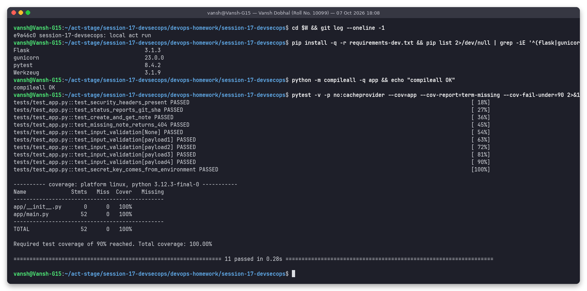

**SAST – Bandit**: `app/` has *No issues identified*; the deliberately insecure training file gets 11 findings
(4 HIGH: `B602` shell=True, `B324` MD5, `B501` verify=False, `B201` Flask debug):

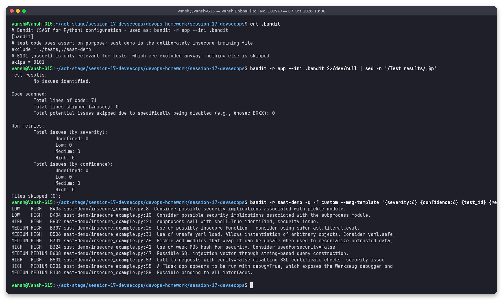

**SAST – Semgrep**: my 8 rules find 0 issues in `app/` and 8 in `sast-demo/` (6 ERROR, 2 WARNING):

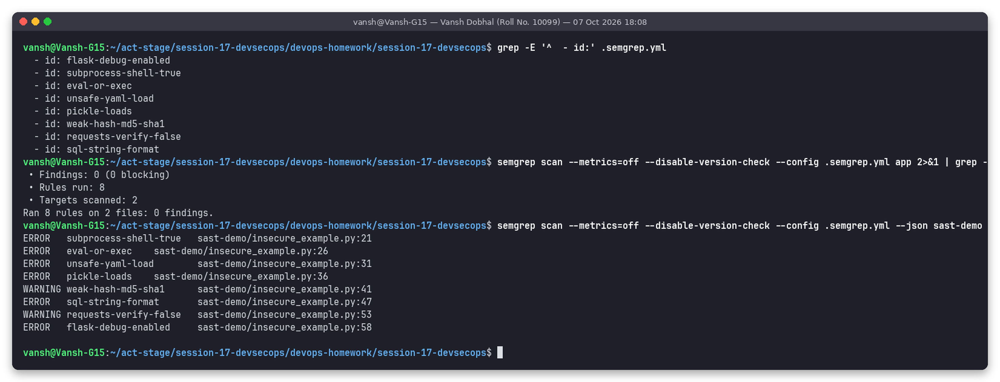

**SCA** – the current `requirements.txt` is clean in both pip-audit and Trivy fs. With the older pins
(`Flask==3.1.2`, `gunicorn==20.1.0`) pip-audit reports 6 advisory entries in 2 packages (exit code 1), and Trivy shows
2 HIGH request-smuggling CVEs in gunicorn (CVE-2024-1135, CVE-2024-6827, fixed in 22.0.0):

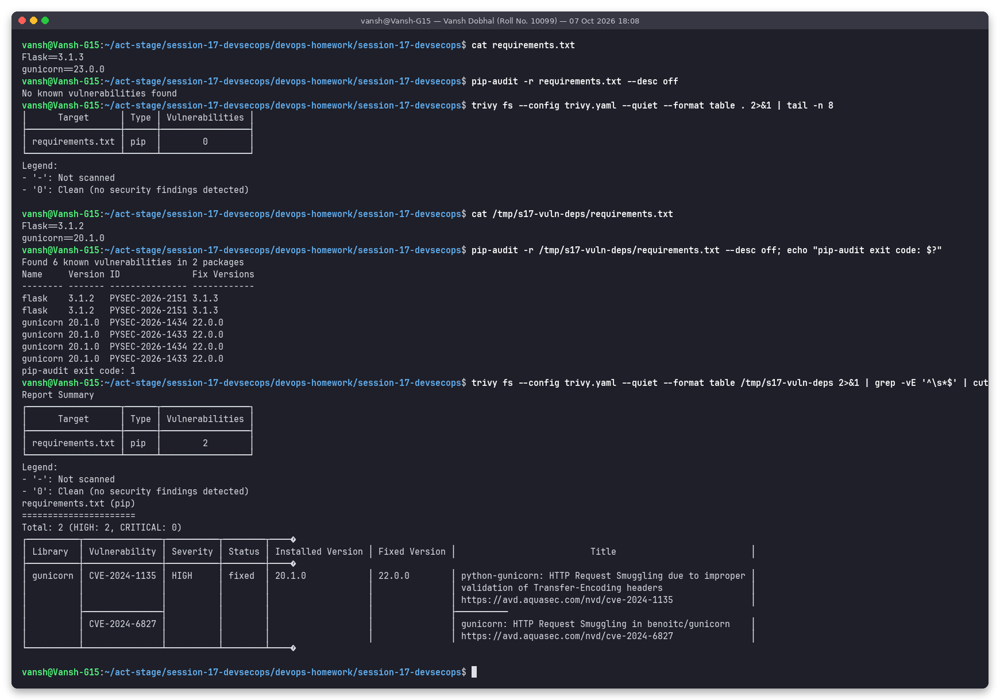

> A real finding along the way: my first version of this project pinned `Flask==3.1.2` (same as the instructor demo). The
> very first act run's SCA job reported `PYSEC-2026-2151` for it, fixed in 3.1.3 – so I upgraded the pin. That older pin
> is what I re-used as the "vulnerable" commit in section 5.2.

**Secret scanning – leak caught**: on branch `feature/add-test-fixture` a commit adds `tests/fixtures/legacy_settings.py`
with a fake AWS key pair and a fake `s17tok_…` token. Gitleaks finds all three (rules `aws-access-token`,
`generic-api-key` and my custom `s17-internal-api-token`), prints them **REDACTED**, and exits with code 1:

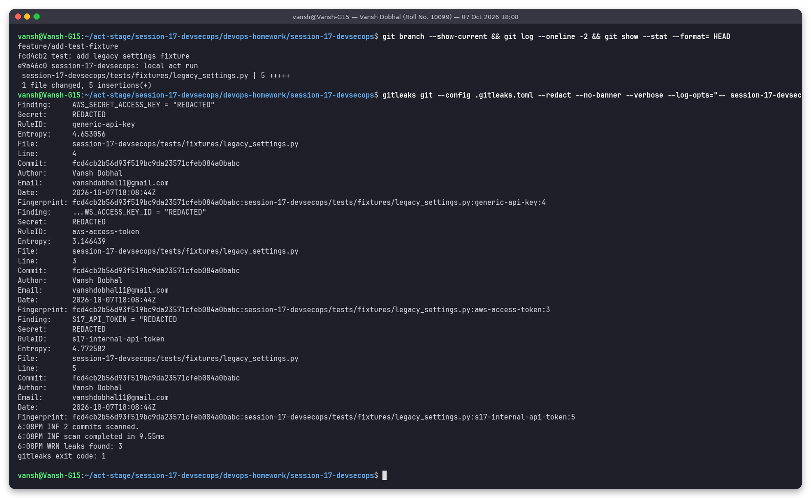

**Secret scanning – clean**: on `main` (without that commit) both history and directory scans report *no leaks found*:

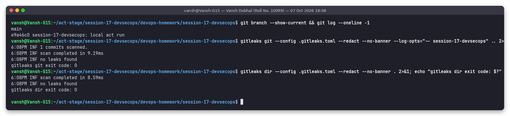

**Docker build + image scan**: the real image (`python:3.12-slim`, user 10001) has 0 fixable HIGH/CRITICAL. The same
Dockerfile built with `--build-arg BASE_IMAGE=python:3.9.7-slim-buster` (a 2021 image) has **CRITICAL=19 HIGH=58** in
Debian packages plus HIGH=4 in its bundled Python packages:

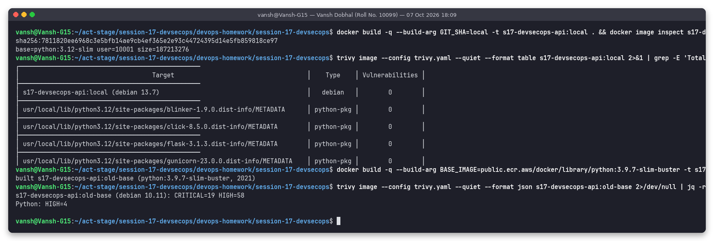

---

## 5. The pipeline with act: three real runs

### 5.1 Run 1 – planted secret on a feature branch → pipeline stops at Secret Scan

Branch `feature/add-test-fixture` (commit `fcd4cb2`). Build, Unit Test, SAST and SCA pass; the Gitleaks job fails with 3
redacted findings, and **none of Docker Build, Image Scan, Gate, Push or Deploy ran** (count of those job names in the log: `0`).
act exit code 1.

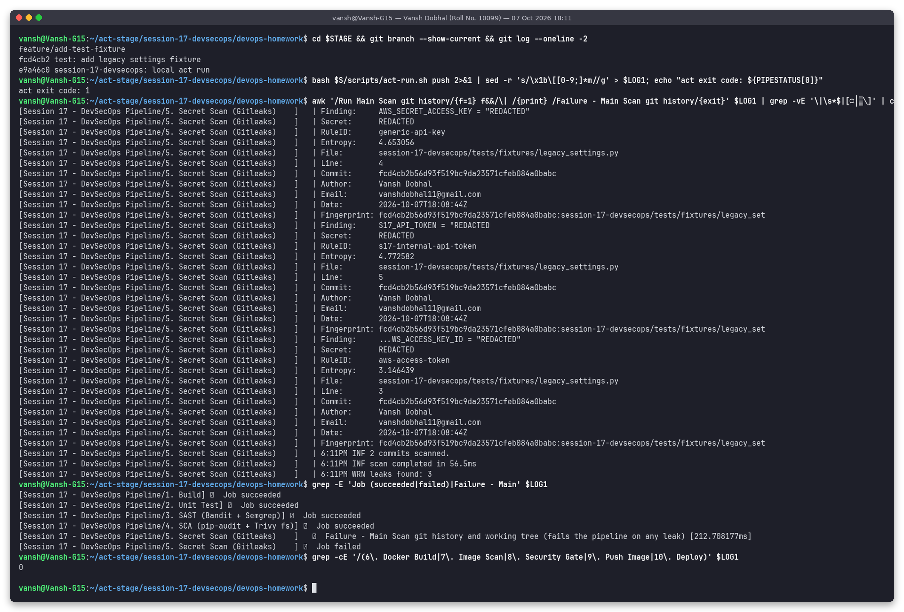

### 5.2 Run 2 – vulnerable dependencies + old base image → security gate FAILS

On `main` I committed (in the throw-away checkout) `Flask==3.1.2`, `gunicorn==20.1.0` and
`BASE_IMAGE=python:3.9.7-slim-buster`. Unit tests, SAST and secret scan are still green – the code itself did not change –
but the gate read the reports and blocked the release:

| Check | Blocking | Result |
|---|---|---|
| Bandit (HIGH) | 0 | PASS |
| Semgrep (ERROR) | 0 | PASS |
| pip-audit (fixable) | 6 | **FAIL** |
| Trivy fs (HIGH/CRITICAL) | 2 | **FAIL** |
| Gitleaks | 0 | PASS |
| Trivy image (HIGH/CRITICAL) | 83 | **FAIL** |

`SECURITY GATE: BLOCKED`; Push Image and Deploy never started (count `0`). act exit code 1.

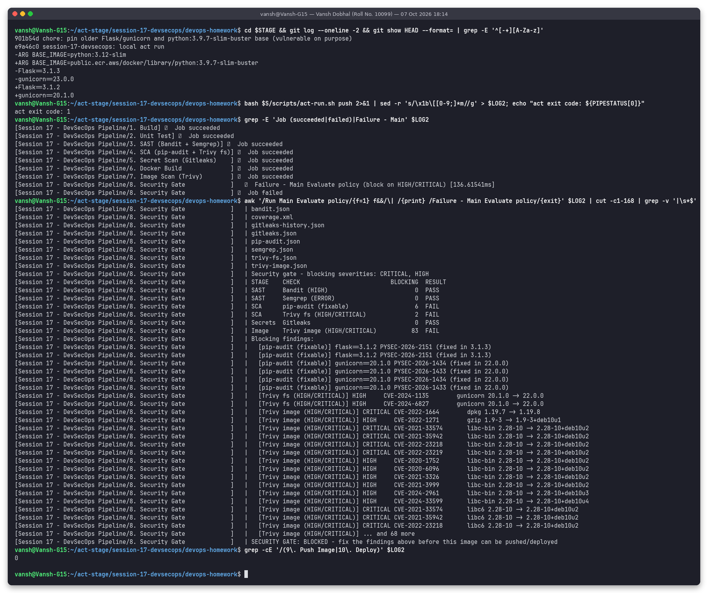

### 5.3 Run 3 – fix commit → everything passes, image pushed and deployed

Fix commit `f3b6064` (Flask 3.1.3, gunicorn 23.0.0, `python:3.12-slim`): **all 10 jobs succeeded** (48 successful steps, act exit code 0).

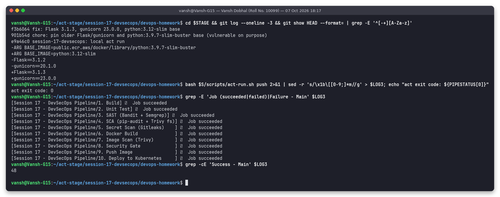

Scanner output of that run – Bandit no issues, Semgrep 0 findings, pip-audit "No known vulnerabilities found",
Trivy fs `requirements.txt … 0`, Gitleaks scanned 3 commits (the history now contains the vulnerable commit and the fix) with no leaks:

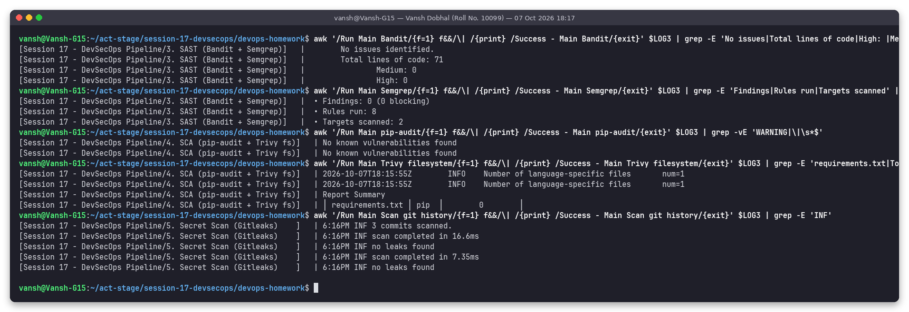

Image built as user 10001, Trivy image: 0 HIGH/CRITICAL in Debian 13.7 and in every Python package, gate **PASSED**:

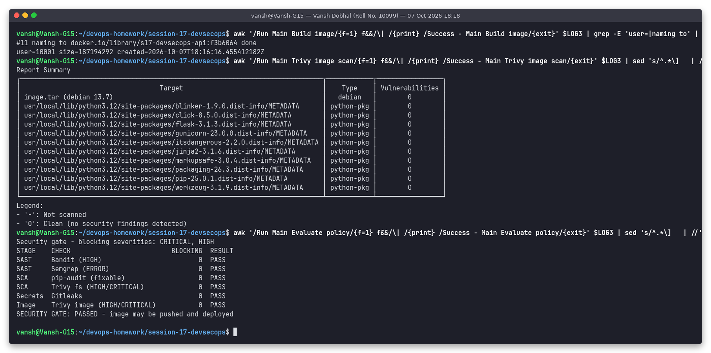

Push + deploy: image pushed to the registry as `f3b6064`, namespace + secret created, rollout finished (2/2), and the
smoke test reached `/health`, `/api/status` (git_sha `f3b6064`) and created a note through the Service:

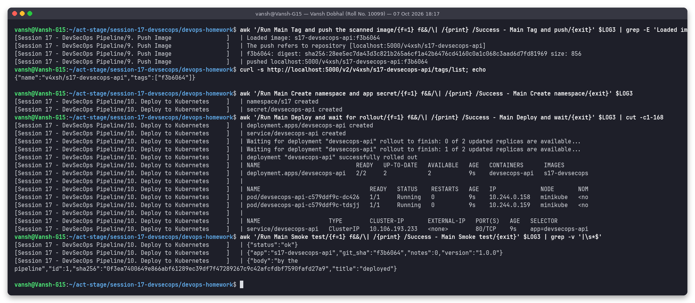

---

## 6. Kubernetes deployment hardening – verified on the cluster

From my own terminal after run 3 (namespace `s17` on minikube): the pod and container `securityContext`, resources,
`id` = uid 10001, writing to `/app` fails with *Read-only file system* while the `/tmp` emptyDir works, `CapEff` is
all zeros (no capabilities) and `NoNewPrivs: 1`, the app key lives in a Kubernetes Secret, the security headers are
returned through `kubectl port-forward` on host port 8102, and invalid input is rejected with 400:

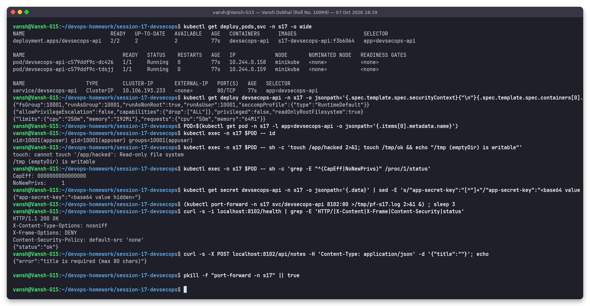

---

## 7. Folder structure

`tree -a` of this folder (`.github/workflows/` here is the reading copy; GitHub runs the copy at the repository root):

```text
.
├── .bandit
├── .dockerignore
├── .github
│   └── workflows
│       └── session17-devsecops.yml
├── .gitignore
├── .gitleaks.toml
├── .semgrep.yml
├── Dockerfile
├── README.md
├── app
│   ├── __init__.py
│   └── main.py
├── k8s
│   ├── deployment.yaml
│   └── service.yaml
├── outputs
│   ├── 01-build-and-unit-tests.txt
│   ├── 02-sast-bandit.txt
│   ├── 03-sast-semgrep.txt
│   ├── 04-sca-pip-audit-trivy-fs.txt
│   ├── 05-secret-scan-gitleaks-catches-leak.txt
│   ├── 06-secret-scan-gitleaks-clean.txt
│   ├── 07-docker-build-and-trivy-image.txt
│   ├── 08-act-run1-secret-leak-blocks-pipeline.txt
│   ├── 09-act-run2-security-gate-fails.txt
│   ├── 10-act-run3-fixed-pipeline-passes.txt
│   ├── 11-act-run3-sast-sca-secrets.txt
│   ├── 12-act-run3-image-scan-and-gate-pass.txt
│   ├── 13-act-run3-push-and-deploy.txt
│   ├── 14-k8s-hardening-verification.txt
│   ├── act-s17-run1-leak-branch.log
│   ├── act-s17-run2-vulnerable-gate-fails.log
│   └── act-s17-run3-fixed-pipeline-passes.log
├── pytest.ini
├── requirements-dev.txt
├── requirements.txt
├── sast-demo
│   └── insecure_example.py
├── screenshots
│   ├── 01-build-and-unit-tests.png
│   ├── 02-sast-bandit.png
│   ├── 03-sast-semgrep.png
│   ├── 04-sca-pip-audit-trivy-fs.png
│   ├── 05-secret-scan-gitleaks-catches-leak.png
│   ├── 06-secret-scan-gitleaks-clean.png
│   ├── 07-docker-build-and-trivy-image.png
│   ├── 08-act-run1-secret-leak-blocks-pipeline.png
│   ├── 09-act-run2-security-gate-fails.png
│   ├── 10-act-run3-fixed-pipeline-passes.png
│   ├── 11-act-run3-sast-sca-secrets.png
│   ├── 12-act-run3-image-scan-and-gate-pass.png
│   ├── 13-act-run3-push-and-deploy.png
│   └── 14-k8s-hardening-verification.png
├── scripts
│   ├── act-run.sh
│   ├── act-stage.sh
│   ├── snaps-act.sh
│   ├── snaps-local.sh
│   └── snaps-verify.sh
├── security
│   └── gate.py
├── tests
│   └── test_app.py
└── trivy.yaml
```

---

## 8. How to reproduce

```bash
cd ~/devops-homework/session-17-devsecops
python3 -m venv ~/venvs/s17 && . ~/venvs/s17/bin/activate
pip install -r requirements-dev.txt bandit==1.9.4 semgrep==1.179.0 pip-audit==2.10.1   # + trivy, gitleaks binaries

pytest -v --cov=app --cov-fail-under=90
bandit -r app --ini .bandit
semgrep scan --metrics=off --config .semgrep.yml app
pip-audit -r requirements.txt && trivy fs --config trivy.yaml .
gitleaks dir --config .gitleaks.toml --redact .
docker build -t s17-devsecops-api:dev . && trivy image --config trivy.yaml s17-devsecops-api:dev

# full pipeline locally (Docker + minikube + local registry):
docker run -d -p 5000:5000 --name s17-registry registry:2
bash scripts/snaps-local.sh      # stages a throw-away git checkout + plants the fake-secret branch
bash scripts/snaps-act.sh        # the three act runs from section 5

# on GitHub: push the repo -> Actions -> "Session 17 - DevSecOps Pipeline".
# Optional repository secret APP_SECRET_KEY; GHCR uses GITHUB_TOKEN, the deploy job creates a kind cluster.
```

Cleanup after capturing the evidence: `kubectl delete namespace s17` and `docker rm -f s17-registry`.

---

## 9. What I learned

* **Different scanners see different layers.** SAST found nothing in my code while SCA and image scanning found 91 blocking
  issues in run 2 – the risk was entirely in dependencies and the base image. A pipeline with only one type of scanner would have shipped it.
* **Report-then-gate** gives a complete picture per run and one place to change policy; only secret leaks justify failing immediately.
* `ignore-unfixed` makes the gate actionable: `python:3.12-slim` still has HIGH CVEs without a Debian fix; blocking on those would
  block every build without giving the developer anything to do. The trade-off is documented in `trivy.yaml`.
* Pinning exact versions is a security feature: SCA can only judge what it can see, and the fix (3.1.2 → 3.1.3) becomes a reviewable one-line diff.
* Secret scanning must include **git history**, and output must be `--redact`ed so the CI log does not become a second leak.
* `readOnlyRootFilesystem` needs the app to be prepared for it (gunicorn `--worker-tmp-dir /tmp` + an emptyDir) – I verified it with a
  real write attempt instead of assuming.
* Practical act lessons: `$GITHUB_PATH` only applies to the *next* step (my first secret-scan run failed with `gitleaks: command not found`),
  and minikube runs containerd, so images are loaded with `ctr -n k8s.io images import` (what `kind load` does internally).
