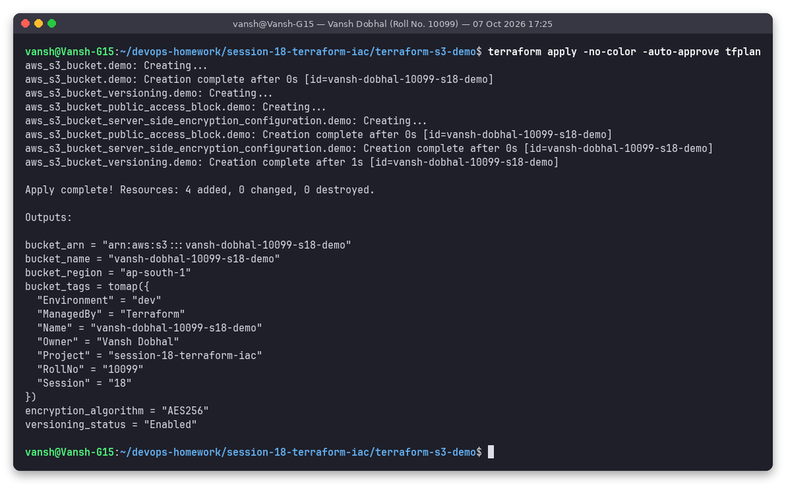

# Session 18: Terraform & Infrastructure as Code

**Name:** Vansh Dobhal | **Roll No:** 10099

This session has two parts:

1. **Task 1:** a Terraform project that builds a secure S3 bucket and walks through the full Terraform workflow.
2. **Task 2:** research notes on the core AWS services (IAM, EC2, S3, VPC, DynamoDB/RDS), each with a small hands-on CLI demo.

> **Executed against LocalStack (local AWS emulator) because no AWS account was used; to run on real AWS, set credentials and `use_localstack=false`.**
> LocalStack `localstack/localstack:4.9` (version 4.9.2, community edition) ran in Docker as `s18-localstack` on port 4566. The tools were Terraform v1.16.5, the `hashicorp/aws` provider v6.22.1 and AWS CLI v1.46.1. All screenshots are real terminal runs captured with `snap` (title bar: name, roll number, timestamp). The matching plain-text logs are in each `outputs/` folder.

## Contents

| Part | Folder | What's inside |
|------|--------|---------------|
| Task 1 | [`terraform-s3-demo/`](terraform-s3-demo/README.md) | `provider.tf`, `variables.tf`, `main.tf`, `outputs.tf`, `terraform.tfvars`, README with 11 screenshots (init → destroy) |
| Task 2 | [`aws-services/01-iam/`](aws-services/01-iam/README.md) | IAM users, groups, roles, policies, least privilege, best practices, 3 JSON policies, LocalStack demo |
| Task 2 | [`aws-services/02-ec2/`](aws-services/02-ec2/README.md) | AMI, instance types, key pairs, SGs, EBS, public/private IP, lifecycle, LocalStack demo |
| Task 2 | [`aws-services/03-s3/`](aws-services/03-s3/README.md) | Buckets, objects, storage-class table, versioning, lifecycle, encryption, bucket policies, LocalStack demo |
| Task 2 | [`aws-services/04-vpc/`](aws-services/04-vpc/README.md) | CIDR, subnets, route tables, IGW, NAT GW, SG vs NACL table, public vs private, Mermaid diagram, LocalStack demo |
| Task 2 | [`aws-services/05-dynamodb-rds/`](aws-services/05-dynamodb-rds/README.md) | DynamoDB (keys, items, attributes), RDS (engines, Multi-AZ, replicas, backups), comparison table, DynamoDB demo |
| Scripts | [`scripts/`](scripts) | The exact scripts that produced every screenshot |

## Task 1: Terraform S3 demo

Full write-up: **[terraform-s3-demo/README.md](terraform-s3-demo/README.md)**

What it builds: bucket `vansh-dobhal-10099-s18-demo` in `ap-south-1` with

- **versioning** (`aws_s3_bucket_versioning`, `Enabled`)
- **server-side encryption** (`aws_s3_bucket_server_side_encryption_configuration`, SSE-S3 `AES256` + bucket key)
- **public access block** (all 4 settings `true`)
- **tags**: `Owner = "Vansh Dobhal"`, `Environment`, `RollNo`, `Session`, `Name`, plus provider `default_tags` (`ManagedBy`, `Project`)

| Step | Command | Screenshot |
|------|---------|-----------|
| 1 | `terraform init` | [01](terraform-s3-demo/screenshots/01-terraform-init.png) |
| 2 | `terraform fmt` / `terraform validate` | [02](terraform-s3-demo/screenshots/02-terraform-fmt-validate.png) |
| 3 | `terraform plan -out=tfplan` | [03](terraform-s3-demo/screenshots/03-terraform-plan.png) |
| 4 | `terraform apply -auto-approve tfplan` | [04](terraform-s3-demo/screenshots/04-terraform-apply.png) |
| 5 | `terraform state list` / `state show` | [05](terraform-s3-demo/screenshots/05-terraform-state-show.png) |
| 6 | `terraform show` | [06](terraform-s3-demo/screenshots/06-terraform-show.png) |
| 7 | `terraform output` | [07](terraform-s3-demo/screenshots/07-terraform-output.png) |
| 8 | AWS CLI verification (versioning, encryption, access block, tags) | [08](terraform-s3-demo/screenshots/08-verify-with-aws-cli.png) |
| 9 | Upload two object versions, check SSE | [09](terraform-s3-demo/screenshots/09-upload-object-versions.png) |
| 10 | `terraform destroy -auto-approve` | [10](terraform-s3-demo/screenshots/10-terraform-destroy.png) |



### Terraform concepts used (short notes)

| Concept | Meaning | Where in my code |
|---------|---------|------------------|
| **IaC** | Infrastructure described in version-controlled files. Repeatable, reviewable, no click-ops. | the whole folder |
| **Provider** | A plugin that talks to an API (AWS here), pinned in `required_providers` | `provider.tf` |
| **Resource** | One infrastructure object Terraform manages | `main.tf` (4 resources) |
| **Variable** | An input with type, default and validation, set in `terraform.tfvars` | `variables.tf` |
| **Output** | A value printed after apply or read by other tools | `outputs.tf` |
| **State** | Terraform's record mapping resources to real IDs (`terraform.tfstate`) | git-ignored, shown via `state list` / `show` |
| **Plan / Apply / Destroy** | Preview the diff → make it real → remove everything | screenshots 03, 04, 10 |
| **Implicit dependency** | A reference such as `aws_s3_bucket.demo.id` fixes the creation order | sub-resources wait for the bucket |
| **dynamic block** | Generates nested blocks from a collection | the LocalStack `endpoints` block |

## Task 2: AWS services research

| # | Service | Notes | LocalStack demo screenshot |
|---|---------|-------|----------------------------|
| 01 | IAM | [README](aws-services/01-iam/README.md) | [users/groups/policy](aws-services/01-iam/screenshots/01-iam-users-groups-policies.png), [EC2 role](aws-services/01-iam/screenshots/02-iam-role-for-ec2.png) |
| 02 | EC2 | [README](aws-services/02-ec2/README.md) | [key pair, SG, t2.micro lifecycle](aws-services/02-ec2/screenshots/01-ec2-keypair-sg-instance-lifecycle.png) |
| 03 | S3 | [README](aws-services/03-s3/README.md) | [versioning, delete marker, lifecycle](aws-services/03-s3/screenshots/01-s3-versioning-lifecycle.png) |
| 04 | VPC | [README](aws-services/04-vpc/README.md) | [VPC, subnets, IGW, routes, NACL](aws-services/04-vpc/screenshots/01-vpc-subnets-routing-nacl.png) |
| 05 | DynamoDB & RDS | [README](aws-services/05-dynamodb-rds/README.md) | [DynamoDB table/items/query](aws-services/05-dynamodb-rds/screenshots/01-dynamodb-table-items-query.png), [RDS not in community edition](aws-services/05-dynamodb-rds/screenshots/02-rds-not-in-localstack-community.png) |

All demo objects (IAM users/roles/policies, key pair, SG, instance, buckets, VPC, table) were deleted again by the script after their screenshots.

## Honest notes / limitations

- **No real AWS account was used.** Everything ran on LocalStack. ARNs use LocalStack's fake account `000000000000`. EC2 in LocalStack community is **mocked**: the API and state machine are emulated, but no VM boots. IAM policies are stored but not enforced.
- **RDS is not available** in LocalStack community, so I didn't run an RDS demo. The real error is shown instead.
- `localstack/localstack:latest` now needs a paid auth token, so I pinned the free `4.9` image.
- AWS provider ≥ 6.23 doesn't store S3 bucket tags on LocalStack 4.9 (I tested this, see Task 1 README), so the provider is pinned to `~> 6.0, < 6.23.0`.

## Folder structure

```
session-18-terraform-iac
├── .gitignore
├── README.md
├── aws-services
│   ├── 01-iam/        README.md, policies/*.json, screenshots/, outputs/
│   ├── 02-ec2/        README.md, screenshots/, outputs/
│   ├── 03-s3/         README.md, config/lifecycle.json, screenshots/, outputs/
│   ├── 04-vpc/        README.md, screenshots/, outputs/
│   └── 05-dynamodb-rds/ README.md, screenshots/, outputs/
├── scripts
│   ├── run-aws-services-demos.sh
│   └── run-terraform-s3-demo.sh
└── terraform-s3-demo
    ├── .gitignore  .terraform.lock.hcl  README.md
    ├── main.tf  outputs.tf  provider.tf  variables.tf  terraform.tfvars
    ├── screenshots/ (00 … 10)
    └── outputs/     (00 … 10 .txt)
```

## How to reproduce

```bash
# 1. LocalStack + CLI
docker run -d --name s18-localstack -p 4566:4566 localstack/localstack:4.9
pip install --user awscli awscli-local
export AWS_ACCESS_KEY_ID=test AWS_SECRET_ACCESS_KEY=test AWS_DEFAULT_REGION=ap-south-1

# 2. Task 1 (full workflow, screenshots via snap)
bash scripts/run-terraform-s3-demo.sh

# 3. Task 2 CLI demos
bash scripts/run-aws-services-demos.sh

# 4. Clean up
docker rm -f s18-localstack
```

On real AWS: configure credentials (`aws configure` / SSO), set `use_localstack = false` in `terraform-s3-demo/terraform.tfvars`, and drop `--endpoint-url` from the CLI commands.
