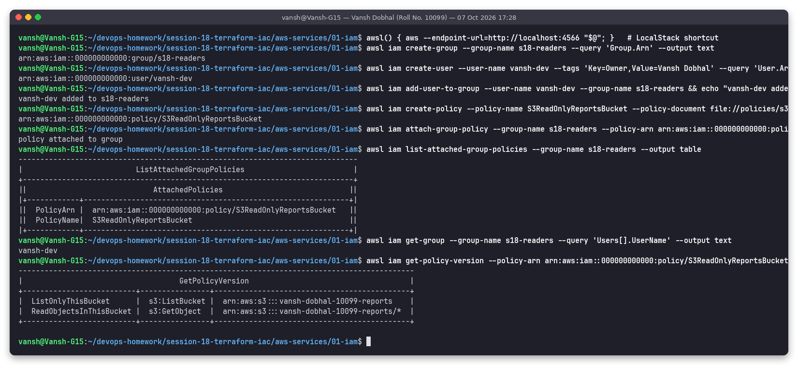
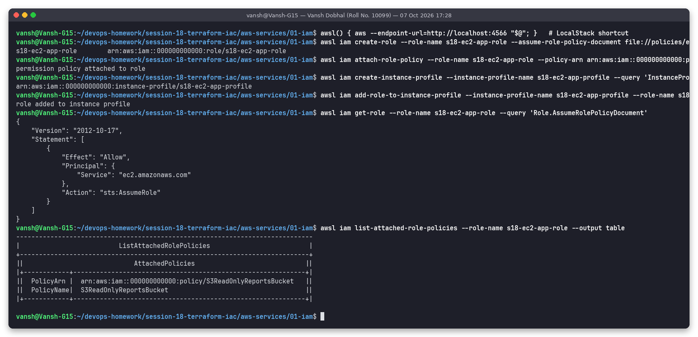

# 01: IAM (Identity and Access Management)

**Name:** Vansh Dobhal | **Roll No:** 10099

## What is IAM?

IAM is the AWS service that answers two questions for every API call: **who is calling** (authentication) and **are they allowed to do this** (authorization). It is global (not tied to a region) and free. Each call is evaluated against the policies attached to the caller and to the resource. If no policy explicitly allows the action, the call is **denied by default**.

Core building blocks:

| Concept | What it is | Example |
|--------|------------|---------|
| **Root user** | The email that created the account. Has unrestricted access. Use it only for a few account-level tasks, protect it with MFA and never create access keys for it. | Changing the support plan, closing the account |
| **User** | A long-term identity for one person or app. Can have a console password and/or access keys. | `vansh-dev` |
| **Group** | A collection of users. Policies attached to a group apply to every member. Groups can't be nested and can't be a principal in a policy. | `s18-readers`, `developers`, `admins` |
| **Role** | An identity with **no long-term credentials**. A trusted principal *assumes* it and gets temporary STS credentials (15 min – 12 h). | EC2 instance role, cross-account role, GitHub Actions OIDC role |
| **Policy** | A JSON document listing `Effect` / `Action` / `Resource` / optional `Condition`. | `S3ReadOnlyReportsBucket` |
| **Permission** | A single allowed or denied action on a resource, e.g. `s3:GetObject` on `arn:aws:s3:::bucket/*` | |

### Policy types

| Type | Attached to | Notes |
|------|-------------|-------|
| AWS-managed policy | users/groups/roles | Maintained by AWS, e.g. `ReadOnlyAccess`, `AmazonS3FullAccess`. Often broader than you need. |
| Customer-managed policy | users/groups/roles | Your own reusable, versioned policy (up to 5 versions) |
| Inline policy | one identity | Lives and dies with that identity. Good for strict 1:1 cases. |
| Resource-based policy | a resource (S3 bucket, SQS queue, KMS key) | Has a `Principal` element, so it can grant cross-account access |
| Trust policy | a role | Says *who may assume* the role (`sts:AssumeRole`) |
| Permissions boundary | user/role | The maximum permissions an identity can ever get |
| SCP (Organizations) | account / OU | A guardrail for whole accounts. It never grants anything by itself. |

### How a request is evaluated

1. Start with an **implicit deny**.
2. If any applicable policy has an **explicit `Deny`**, the request is denied. Nothing can override this.
3. If an SCP, permissions boundary or session policy applies, the action must be allowed there too.
4. If an identity-based or resource-based policy has an **`Allow`**, the request is allowed.
5. Otherwise the implicit deny stands.

## Example JSON policies (files in [`policies/`](policies))

**Least-privilege read access to one bucket** ([`s3-read-only-one-bucket.json`](policies/s3-read-only-one-bucket.json)). `ListBucket` applies to the bucket ARN and `GetObject` to the objects (`/*`). That is a common mistake to get wrong.

```json
{
  "Version": "2012-10-17",
  "Statement": [
    { "Sid": "ListOnlyThisBucket", "Effect": "Allow", "Action": "s3:ListBucket",
      "Resource": "arn:aws:s3:::vansh-dobhal-10099-reports" },
    { "Sid": "ReadObjectsInThisBucket", "Effect": "Allow", "Action": "s3:GetObject",
      "Resource": "arn:aws:s3:::vansh-dobhal-10099-reports/*" }
  ]
}
```

**Trust policy so EC2 can assume a role** ([`ec2-trust-policy.json`](policies/ec2-trust-policy.json)):

```json
{
  "Version": "2012-10-17",
  "Statement": [
    { "Effect": "Allow", "Principal": { "Service": "ec2.amazonaws.com" }, "Action": "sts:AssumeRole" }
  ]
}
```

**Explicit-deny guardrail: block everything outside Mumbai** ([`deny-outside-ap-south-1.json`](policies/deny-outside-ap-south-1.json)). It uses `NotAction` so global services such as IAM and STS keep working:

```json
{
  "Version": "2012-10-17",
  "Statement": [
    { "Sid": "DenyAllOutsideMumbai", "Effect": "Deny",
      "NotAction": ["iam:*", "sts:*", "support:*"], "Resource": "*",
      "Condition": { "StringNotEquals": { "aws:RequestedRegion": "ap-south-1" } } }
  ]
}
```

**MFA required for destructive actions** (condition-key example):

```json
{
  "Version": "2012-10-17",
  "Statement": [
    { "Effect": "Deny", "Action": ["ec2:TerminateInstances", "s3:DeleteBucket"], "Resource": "*",
      "Condition": { "BoolIfExists": { "aws:MultiFactorAuthPresent": "false" } } }
  ]
}
```

## Least privilege

Grant only the actions, on only the resources, for only as long as they're needed. In practice:

- Start from nothing, add permissions as the workload needs them, and use **IAM Access Analyzer** to generate policies from CloudTrail activity.
- Scope `Resource` to specific ARNs, not `*`. Add `Condition` keys (source IP, VPC endpoint, tags, MFA).
- Prefer **roles with temporary credentials** over users with access keys.
- Review regularly with *last accessed* data and remove unused users, keys and permissions.

## Best practices

1. Turn on MFA for root and every human user, and lock the root user away.
2. Use **IAM Identity Center (SSO)** or federation for humans instead of creating IAM users.
3. Workloads use **roles**: EC2 instance profiles, ECS task roles, Lambda execution roles, and OIDC roles for CI/CD (GitHub Actions). No access keys in code.
4. Give permissions to **groups** or roles, not to individual users.
5. Use customer-managed policies with least privilege, and use permissions boundaries when you delegate admin rights.
6. Rotate any access keys that must exist. Enforce a strong password policy.
7. Log every call with **CloudTrail**. Use Access Analyzer to find resources shared outside the account.
8. Put guardrails (SCPs) at the AWS Organizations level.

## Use cases

- A developer group with read-only production access and full dev access.
- An EC2 app reading from one S3 bucket through an instance role, with no keys on disk.
- A CI pipeline (GitHub Actions) assuming a deploy role through OIDC.
- Cross-account access: an audit account assumes a read-only role in every member account.
- Terraform running with a role that may only touch resources tagged `ManagedBy=Terraform`.

## Hands-on demo (LocalStack)

> These commands ran for real against **LocalStack 4.9.2 (local AWS emulator)**, not a real AWS account. The account ID `000000000000` is LocalStack's default. LocalStack community stores IAM objects, but it doesn't enforce them on other API calls.

**Users, groups and a customer-managed least-privilege policy.** I created the group `s18-readers` and the user `vansh-dev` (tag `Owner=Vansh Dobhal`), added the user to the group, created the policy from the JSON file and attached it to the group:



**A role for EC2.** I created a role with the EC2 trust policy, attached the same permission policy and wrapped it in an instance profile, which is what you actually pass to an EC2 instance:



The script ([`../../scripts/run-aws-services-demos.sh`](../../scripts/run-aws-services-demos.sh)) deletes all of these objects again after the screenshots.
