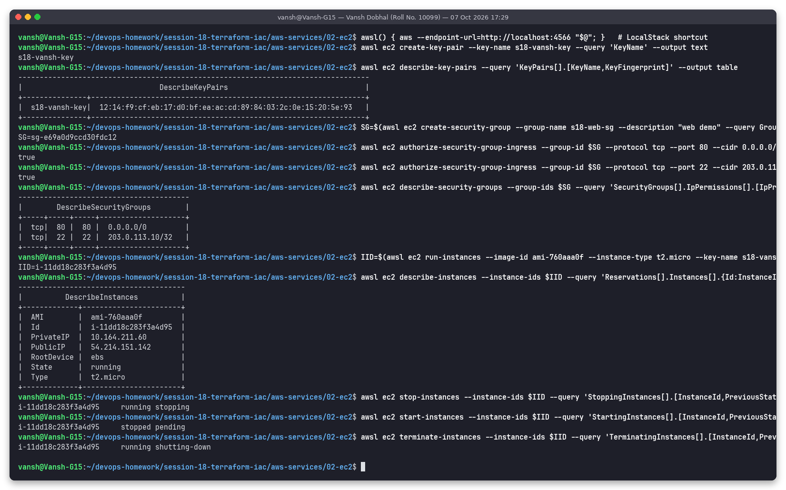

# 02: EC2 (Elastic Compute Cloud)

**Name:** Vansh Dobhal | **Roll No:** 10099

EC2 provides resizable virtual machines (**instances**) in the cloud. You choose the OS image, the hardware size, the network and the storage, and you pay per second (Linux) while the instance runs. It's the classic IaaS service: AWS manages the hardware and hypervisor, and you manage everything from the OS upward.

## AMI (Amazon Machine Image)

An AMI is the template an instance boots from. It contains the root volume snapshot (OS + software), the architecture (`x86_64` / `arm64`), the virtualization type, the block device mapping and launch permissions.

- **Sources:** AWS/vendor AMIs (Amazon Linux 2023, Ubuntu by Canonical owner `099720109477`, Windows), AWS Marketplace, and your own custom ("golden") AMIs built with Packer or *Create image*.
- AMIs are **regional**. Copy them to use in another region, and note that the same OS has a different AMI ID in each region. That's why Terraform usually looks them up with a `data "aws_ami"` filter (see session 19).

## Instance types

Name format: `family` + `generation` + `attributes` + `.size`. For example, `m7g.large` is general purpose, 7th generation, Graviton (`g`), large.

| Family | Optimised for | Examples | Typical use |
|--------|---------------|----------|-------------|
| **T** (burstable) | Cheap baseline CPU plus CPU credits for bursts | `t2.micro`, `t3.small`, `t4g.medium` | Dev/test, small websites, Free Tier |
| **M** (general purpose) | Balanced CPU:RAM (1:4) | `m6i.large`, `m7g.xlarge` | App servers, small DBs |
| **C** (compute) | High CPU:RAM (1:2) | `c6i.2xlarge`, `c7g.large` | Batch jobs, CI builds, game servers, encoding |
| **R / X** (memory) | Lots of RAM (1:8 and more) | `r6i.large`, `x2idn` | In-memory caches, SAP HANA, big DBs |
| **I / D** (storage) | Local NVMe / HDD with high IOPS | `i4i.large`, `d3.xlarge` | NoSQL DBs, data warehouses |
| **P / G / Inf / Trn** (accelerated) | GPUs / ML chips | `g5.xlarge`, `p5.48xlarge`, `inf2` | ML training/inference, rendering |

Suffix letters: `g` = Graviton (ARM), `a` = AMD, `i` = Intel, `d` = local NVMe, `n` = higher network bandwidth.

## Key pairs

A key pair is an SSH public/private key (RSA or ED25519). AWS keeps the **public** key and puts it into `~/.ssh/authorized_keys` on first boot. You download the **private** key once (`.pem`). If you lose it, you can't get it back. You connect with `ssh -i key.pem ubuntu@<public-ip>`. Modern alternatives that need no open port 22 or key at all are **EC2 Instance Connect** and **SSM Session Manager**.

## Security groups

A security group is a **stateful** virtual firewall attached to the instance's network interface (ENI):

- Only **allow** rules. Anything not allowed is dropped.
- Stateful: if inbound traffic is allowed, the reply goes out automatically, and the other way round.
- The default SG lets everything out and lets nothing in, except from members of the same SG.
- A rule's source can be a CIDR (`203.0.113.10/32`) or **another security group**. For example, "allow 5432 from the app-tier SG".
- Rules take effect immediately, and one instance can have several SGs.

Typical web server: 80/443 from `0.0.0.0/0`, 22 only from the admin IP `/32`.

## EBS (Elastic Block Store)

EBS provides network-attached block volumes that live in **one AZ** and persist independently of the instance.

| Volume | Type | Notes |
|--------|------|-------|
| `gp3` | General purpose SSD | Default. 3,000 IOPS / 125 MB/s baseline, can be raised independently of size |
| `gp2` | Older general purpose SSD | IOPS scale with size (3 IOPS per GB) |
| `io2` / `io2 Block Express` | Provisioned IOPS SSD | Up to 256k IOPS, 99.999% durability, for critical databases |
| `st1` | Throughput HDD | Big sequential workloads (logs, Kafka) |
| `sc1` | Cold HDD | Cheapest, infrequent access |

- **Snapshots** are incremental, stored in S3, and can be copied across regions. They're used for backups and AMIs.
- Encryption at rest uses KMS, and you can turn on *encryption by default* for the whole account.
- **Instance store** is different: local disks that are physically attached and very fast, but **ephemeral**. The data is lost on stop/terminate.
- `DeleteOnTermination = true` (the default for the root volume) means the volume is deleted with the instance.

## Public vs private IP

| | Private IP | Public IP (auto-assigned) | Elastic IP |
|-|-----------|---------------------------|-----------|
| Comes from | Subnet CIDR (e.g. `10.19.1.4`) | AWS pool, when the subnet has `map_public_ip_on_launch` | Allocated to your account |
| Reachable from | Inside the VPC (and peered/VPN networks) | The internet, through the IGW | The internet |
| Changes on stop/start? | No (kept for the instance's lifetime) | **Yes**, a new IP after every stop/start | No, static until you release it |
| Cost | Free | Charged per hour for every public IPv4 (since Feb 2024) | Charged per hour |

The instance's OS only ever sees the private IP. The IGW performs 1:1 NAT between the public and the private address.

## Instance lifecycle

```
            launch
              │
          [pending] ──► [running] ──stop──► [stopping] ──► [stopped] ──start──► [pending]
                          │   ▲                                 │
                   reboot │   │                                 │ terminate
                          ▼   │                                 ▼
                       (rebooting)                     [shutting-down] ──► [terminated]
                          │
                      terminate ──► [shutting-down] ──► [terminated]
```

- **running:** billed for compute.
- **stopped:** no compute charge, but EBS storage is still billed. The instance may move to new hardware and loses its auto-assigned public IP.
- **hibernate:** RAM is saved to EBS, and the next start resumes where it stopped.
- **terminated:** permanent. The root EBS volume is deleted if `DeleteOnTermination` is set.
- **Pricing models:** On-Demand, Savings Plans / Reserved (1 or 3 years, up to ~72% cheaper), Spot (up to ~90% cheaper, but can be interrupted with a 2-minute notice), Dedicated Hosts.

## Use cases

Web/app servers behind an ALB with Auto Scaling groups; self-managed databases; CI runners and build farms; bastion hosts; GPU machine learning; lift-and-shift migration of on-prem VMs; batch processing on Spot.

## Hands-on demo (LocalStack)

> Ran for real against **LocalStack 4.9.2 (local AWS emulator)**. LocalStack community **mocks** EC2: the API calls, IDs, IPs and state transitions are emulated, but no real VM boots.

I created a key pair and a security group (80 open to the world, 22 only from a /32), then launched a `t2.micro` from an Amazon Linux AMI. `describe-instances` shows the instance type, the private and public IPs, the EBS root device and the `running` state. I then walked the lifecycle: `running → stopping`, `stopped → pending`, `running → shutting-down`.


