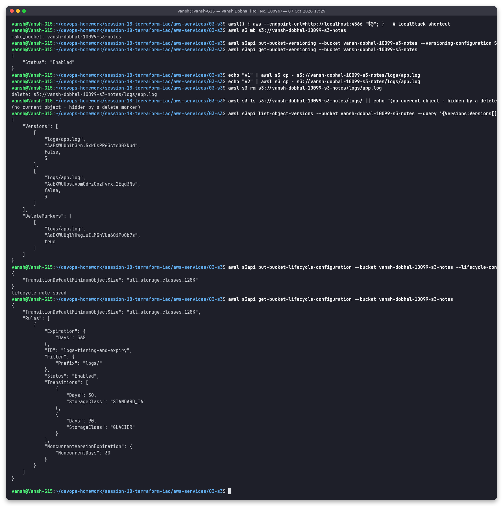

# 03: S3 (Simple Storage Service)

**Name:** Vansh Dobhal | **Roll No:** 10099

S3 is AWS's **object storage**: unlimited capacity, accessed over HTTPS APIs, designed for **99.999999999% (11 nines) durability** by storing data across at least 3 AZs (except One Zone classes).

## Buckets

- A bucket is a container for objects. Its **name is globally unique** across all AWS accounts: 3–63 characters, lowercase letters, digits, `.` and `-`.
- A bucket is created in **one region**, and its data stays there unless you replicate it.
- There's no real folder hierarchy. A "folder" is just a key prefix such as `logs/2026/10/`.
- New buckets default to: **Block Public Access on**, **ACLs disabled** (bucket-owner-enforced), **SSE-S3 encryption on**.

## Objects

- An object is **key + value (data, up to 5 TB) + metadata + version ID**.
- A single `PUT` can upload up to 5 GB. **Multipart upload** is recommended above about 100 MB and required above 5 GB.
- S3 has strong read-after-write consistency for PUTs and DELETEs (since Dec 2020).
- Objects have system metadata (Content-Type, ETag, storage class), user metadata (`x-amz-meta-*`) and up to 10 tags.

## Storage classes

| Class | Availability (SLA design) | AZs | Min. storage duration | Retrieval | Use for |
|-------|--------------------------|-----|----------------------|-----------|---------|
| **S3 Standard** | 99.99% | ≥3 | none | ms, free | Frequently accessed data, websites, apps |
| **S3 Intelligent-Tiering** | 99.9% | ≥3 | none | ms (archive tiers optional) | Unknown or changing access patterns. Moves objects automatically for a small monitoring fee. |
| **S3 Standard-IA** | 99.9% | ≥3 | 30 days | ms, per-GB fee | Accessed about monthly but needed fast (backups) |
| **S3 One Zone-IA** | 99.5% | 1 | 30 days | ms, per-GB fee | Re-creatable data, secondary copies |
| **S3 Express One Zone** | 99.95% | 1 (directory bucket) | none | single-digit ms | Lowest-latency, high-request-rate workloads |
| **S3 Glacier Instant Retrieval** | 99.9% | ≥3 | 90 days | ms | Archive read about once a quarter |
| **S3 Glacier Flexible Retrieval** | 99.99% | ≥3 | 90 days | minutes – 12 h | Archives, DR |
| **S3 Glacier Deep Archive** | 99.99% | ≥3 | 180 days | 12 – 48 h | Compliance data kept 7–10 years. Cheapest. |

## Versioning

- A bucket is in one of three states: *unversioned* (the default), **Enabled** or **Suspended**. Once enabled, versioning can only be suspended, never turned fully off.
- Every PUT to the same key creates a new **version ID**, and the old versions are kept.
- A DELETE without a version ID only adds a **delete marker**, so the object looks gone, but every version is still there and can be restored by removing the marker.
- This protects against accidental overwrites and deletes. It's required for replication (CRR/SRR) and Object Lock. **MFA Delete** adds extra protection.
- Old versions cost storage, so pair versioning with a lifecycle rule for noncurrent versions.

## Lifecycle policies

Rules, filtered by prefix or tag, that act on objects automatically:

- **Transition actions:** move objects to a cheaper class after N days, e.g. Standard → Standard-IA (≥ 30 d) → Glacier.
- **Expiration actions:** delete current versions after N days, expire noncurrent versions, remove expired delete markers, and abort incomplete multipart uploads.

The example used in the demo ([`config/lifecycle.json`](config/lifecycle.json)) applies to `logs/`: IA at 30 days, Glacier at 90, delete at 365, and noncurrent versions removed after 30 days.

## Encryption

| Option | Keys managed by | Notes |
|--------|-----------------|-------|
| **SSE-S3** (`AES256`) | S3 | The default for all new objects since Jan 2023. Free. |
| **SSE-KMS** (`aws:kms`) | AWS KMS (AWS-managed or customer-managed key) | Key policies, CloudTrail audit of key use, per-request KMS cost. **S3 Bucket Keys** cut that cost. |
| **DSSE-KMS** | KMS, two layers | For compliance that requires dual-layer encryption |
| **SSE-C** | You send the key with every request | AWS never stores the key |
| **Client-side** | You encrypt before upload | S3 only ever sees ciphertext |

**In transit:** HTTPS. You can enforce it with a bucket policy that denies requests where `aws:SecureTransport = false`.

## Bucket policies

A bucket policy is a resource-based JSON policy attached to the bucket. Because it has a `Principal`, it can grant access to other accounts, services or (when Block Public Access allows it) everyone. Example: deny non-TLS access and allow one IAM role to read.

```json
{
  "Version": "2012-10-17",
  "Statement": [
    { "Sid": "DenyInsecureTransport", "Effect": "Deny", "Principal": "*", "Action": "s3:*",
      "Resource": ["arn:aws:s3:::vansh-dobhal-10099-s3-notes", "arn:aws:s3:::vansh-dobhal-10099-s3-notes/*"],
      "Condition": { "Bool": { "aws:SecureTransport": "false" } } },
    { "Sid": "AppRoleRead", "Effect": "Allow",
      "Principal": { "AWS": "arn:aws:iam::111122223333:role/app-role" },
      "Action": "s3:GetObject", "Resource": "arn:aws:s3:::vansh-dobhal-10099-s3-notes/*" }
  ]
}
```

**Block Public Access** (4 settings: `BlockPublicAcls`, `IgnorePublicAcls`, `BlockPublicPolicy`, `RestrictPublicBuckets`) overrides any policy or ACL that would make data public. Keep it on unless you are deliberately hosting public content, and even then prefer CloudFront with OAC.

## Use cases

Static website hosting (with CloudFront); backups and DR targets; data lakes (Athena/Glue/EMR query S3 directly); log archives (ALB, CloudTrail, VPC Flow Logs); CI/CD artifacts; media storage; **Terraform remote state** (`backend "s3"` with locking).

## Hands-on demo (LocalStack)

> Ran for real against **LocalStack 4.9.2 (local AWS emulator)**, not a real AWS account.

I created a bucket and enabled versioning. I uploaded `logs/app.log` twice, then deleted it. After that, `s3 ls` shows nothing, but `list-object-versions` shows both versions plus a **delete marker** with `IsLatest = true`, which is exactly the behaviour described above. Last, I applied and read back the lifecycle rule.



The Terraform-managed bucket in [`../../terraform-s3-demo`](../../terraform-s3-demo) adds default encryption, a public access block and tags. Its step 9 screenshot shows `ServerSideEncryption: AES256` on an uploaded object.
