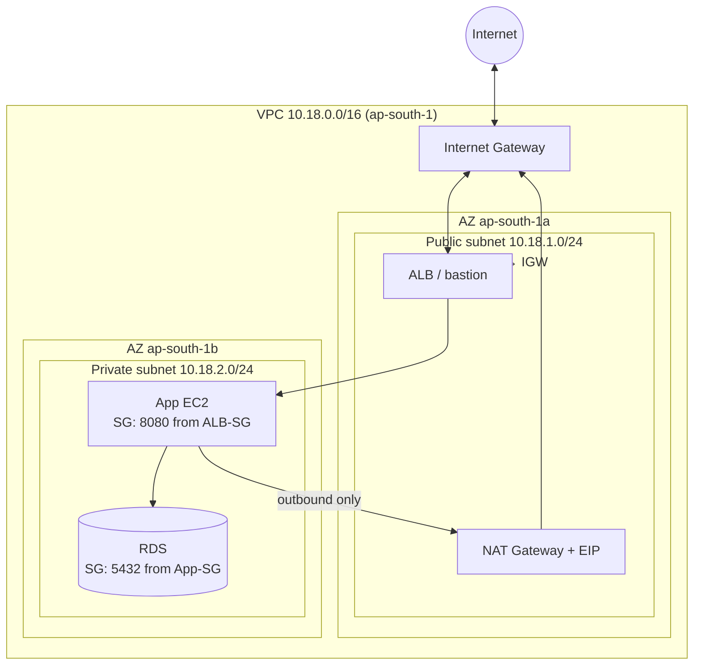
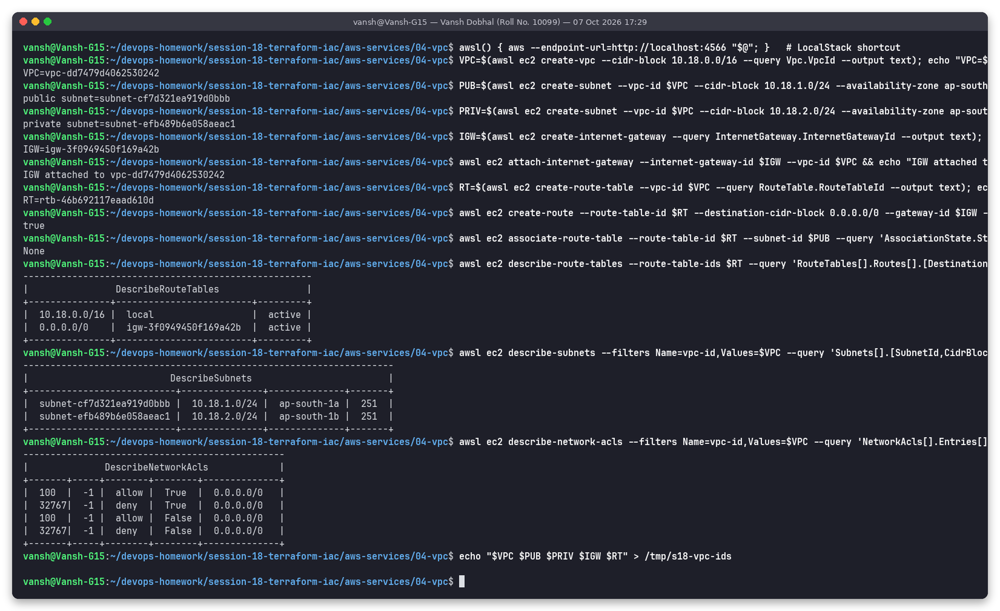

# 04: VPC (Virtual Private Cloud)

**Name:** Vansh Dobhal | **Roll No:** 10099

A VPC is your own logically isolated network inside an AWS region. You choose its IP range, cut it into subnets, and control routing and firewalls. Every EC2 instance, RDS database, Lambda-in-VPC and load balancer lives in a VPC subnet. Each region gives you a *default VPC* (`172.31.0.0/16`) with public subnets, but real projects build their own.

## CIDR (Classless Inter-Domain Routing)

A CIDR block like `10.18.0.0/16` is a base address plus a prefix length. The prefix is how many leading bits are fixed, so the remaining bits are host addresses.

| CIDR | Host bits | Addresses | Usable in an AWS subnet (−5) |
|------|-----------|-----------|------------------------------|
| `/16` | 16 | 65,536 | (VPC size) |
| `/20` | 12 | 4,096 | 4,091 |
| `/24` | 8 | 256 | **251** |
| `/28` | 4 | 16 | 11 (smallest subnet allowed) |

- A VPC can be `/16` (largest) to `/28` (smallest). Use private RFC 1918 ranges (`10.0.0.0/8`, `172.16.0.0/12`, `192.168.0.0/16`) and avoid overlap with on-prem networks and peered VPCs.
- AWS reserves **5 addresses per subnet**. For `10.18.1.0/24` these are `.0` (network), `.1` (VPC router), `.2` (DNS), `.3` (future use) and `.255` (broadcast). That is why the demo shows `AvailableIpAddressCount = 251`.

## Subnets

A subnet is a slice of the VPC CIDR that lives in exactly **one Availability Zone**. For high availability you create one public and one private subnet per AZ, for example:

| Subnet | CIDR | AZ | Type |
|--------|------|----|------|
| public-a | 10.18.1.0/24 | ap-south-1a | public |
| private-b | 10.18.2.0/24 | ap-south-1b | private |

## Route tables

Each subnet is associated with exactly one route table, which decides where packets for a destination go. The longest prefix match wins.

| Destination | Target | Meaning |
|-------------|--------|---------|
| `10.18.0.0/16` | `local` | Always present, can't be removed. All subnets in the VPC can reach each other. |
| `0.0.0.0/0` | `igw-…` | Internet through the Internet Gateway, which makes the subnet **public** |
| `0.0.0.0/0` | `nat-…` | Outbound-only internet through a NAT gateway, used in **private** subnets |
| `pl-…` / `vpce-…` | gateway endpoint | Private path to S3/DynamoDB without internet |

Subnets without an explicit association use the VPC's **main route table**.

## Internet Gateway (IGW)

A horizontally scaled, highly available VPC component that lets traffic in and out of the internet. There is one per VPC, and it is free. It performs 1:1 NAT between an instance's private IP and its public/Elastic IP. For an instance to be internet-reachable you need **all** of these: an IGW attached to the VPC, a `0.0.0.0/0 → igw` route on its subnet, a public IP, and SG + NACL rules that allow the traffic.

## NAT Gateway

A managed NAT gateway lets instances in **private** subnets start outbound connections (OS updates, external APIs) while staying unreachable from the internet.

- It lives in a **public** subnet with an Elastic IP. The private subnets' route table sends `0.0.0.0/0 → nat-…`.
- It is zonal, so create one per AZ for HA. It is billed per hour plus per GB processed (often the surprise item on an AWS bill).
- Alternatives: a NAT instance (cheap, but self-managed), VPC endpoints (for AWS services), or egress-only IGW for IPv6.

## Security Groups and NACLs

**Security Groups** work at the instance/ENI level. **Network ACLs** work at the subnet level. Every new VPC gets a default NACL that allows all traffic. You can see this in the demo, where rule 100 allows everything and rule `*` (32767) denies the rest.

| | Security Group | Network ACL |
|-|----------------|-------------|
| Applies to | ENI / instance | Whole subnet |
| State | **Stateful**: return traffic allowed automatically | **Stateless**: return traffic needs its own rule (ephemeral ports 1024-65535) |
| Rule types | Allow only | Allow **and Deny** |
| Evaluation | All rules evaluated together | In order, by rule number. The first match wins. |
| Default | Inbound: none, outbound: all | Default NACL: allow all in/out. A custom NACL denies all until you add rules. |
| Can reference | CIDRs, prefix lists, **other SGs** | CIDRs only |
| Typical use | Main per-application firewall | Coarse subnet guardrail, e.g. block a malicious IP range |

## Public vs private subnet

| | Public subnet | Private subnet |
|-|---------------|----------------|
| Route `0.0.0.0/0` | → Internet Gateway | → NAT Gateway (or none) |
| Instances get public IPs | Usually (`map_public_ip_on_launch`) | No |
| Reachable from internet | Yes, if SG/NACL allow | No |
| Typical contents | ALB, NAT GW, bastion | App servers, databases, caches |

## Diagram

## Hands-on demo (LocalStack)

> Ran for real against **LocalStack 4.9.2 (local AWS emulator)**, not a real AWS account.

I created a VPC `10.18.0.0/16`, a public subnet (1a) and a private subnet (1b), an IGW attached to the VPC, and a route table with `0.0.0.0/0 → IGW` associated only with the public subnet. The screenshot shows the route table (`local` + IGW route), both subnets with 251 usable IPs, and the default NACL rules. Everything was deleted again afterwards by [`../../scripts/run-aws-services-demos.sh`](../../scripts/run-aws-services-demos.sh).

Session 19 builds the same network with Terraform: [`../../../session-19-cloud-terraform`](../../../session-19-cloud-terraform).
