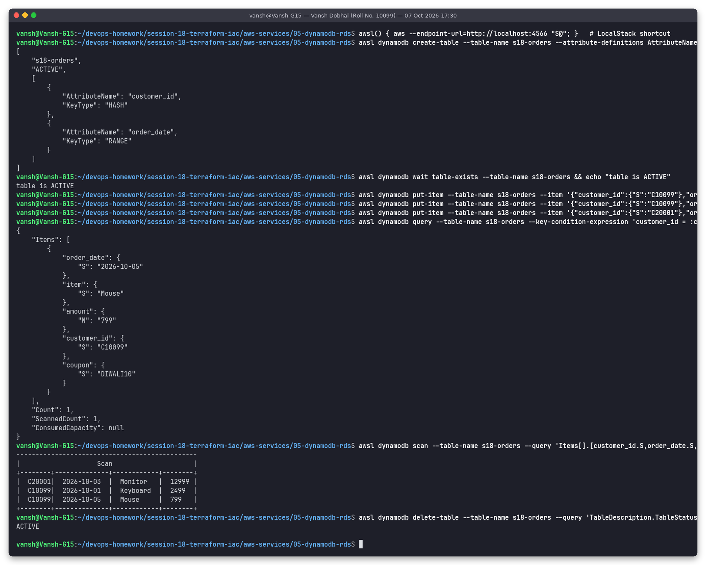
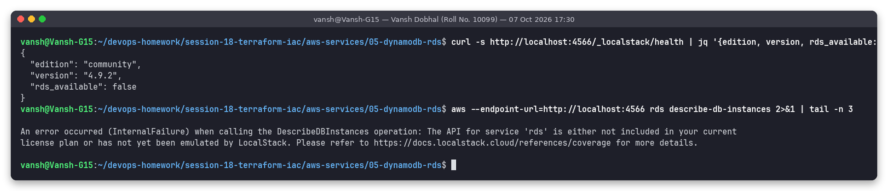

# 05: DynamoDB and RDS

**Name:** Vansh Dobhal | **Roll No:** 10099

## Part A: Amazon DynamoDB

DynamoDB is a fully managed, serverless **NoSQL key-value and document database**. There are no servers to patch, storage grows automatically, and it delivers single-digit-millisecond latency at any scale. Data is replicated across 3 AZs.

### NoSQL in short
- No fixed schema apart from the **primary key**. Each item can have different attributes.
- You design tables around **access patterns** (the queries you will run), not around normalised entities. Joins don't exist, so related data is often stored together (single-table design).
- It scales horizontally by **partitioning** data on the partition key.

### Building blocks

| Term | Meaning | Demo example |
|------|---------|--------------|
| **Table** | A collection of items | `s18-orders` |
| **Item** | One record (≈ a row), max **400 KB** | one order |
| **Attribute** | A name-value pair (≈ a column). Types: `S`, `N`, `B`, `BOOL`, `NULL`, `L`, `M`, `SS`, `NS`, `BS`. | `item`, `amount`, `coupon` |
| **Partition key** (HASH) | Hashed to choose the physical partition. It must be in every item, and the `Query` operation needs it. | `customer_id` |
| **Sort key** (RANGE) | Optional. Orders items within a partition and allows range conditions (`begins_with`, `between`, `>=`). | `order_date` |
| **Primary key** | Partition key alone, or partition key + sort key. Must be unique. | (`customer_id`, `order_date`) |
| **GSI / LSI** | Secondary indexes with another key, for other access patterns | GSI on `item` |

Choose a **high-cardinality partition key** so traffic spreads evenly and no partition becomes "hot".

### Capacity and features
- **On-demand** (pay per request, used in the demo) or **provisioned** RCU/WCU with auto scaling.
- Reads are eventually consistent by default, with strongly consistent reads as an option. **Transactions** (ACID across up to 100 items).
- **Streams** (change data capture, triggering Lambda), **TTL** (automatic expiry), **Global Tables** (multi-region active-active), **PITR** backups (35 days), **DAX** in-memory cache.
- `Query` (by key, efficient) vs `Scan` (reads the whole table, expensive, avoid in hot paths).

### Use cases
Shopping carts and user sessions, gaming leaderboards, IoT telemetry, serverless backends (API Gateway + Lambda), feature flags/config, **Terraform state locking table**.

### Hands-on demo (LocalStack)

> Ran for real against **LocalStack 4.9.2 (local AWS emulator)**, not a real AWS account.

I created table `s18-orders` with partition key `customer_id` and sort key `order_date` (on-demand billing) and put 3 items. One item carries an extra attribute `coupon`, which shows that items are schema-less. The `Query` uses `customer_id = C10099 AND order_date >= 2026-10-02` and returns only the Mouse order, with `ScannedCount = 1`, because the key condition reads just that slice. The `Scan` reads every item. Then I deleted the table.

## Part B: Amazon RDS (Relational Database Service)

RDS is a managed **relational (SQL)** database service. AWS handles provisioning, OS and engine patching, backups, monitoring and failover. You handle schema, queries, indexes and parameter tuning. Data lives in tables with a fixed schema, related by foreign keys, queried with SQL and joins, with full ACID transactions.

### Engines
**MySQL, PostgreSQL, MariaDB, Oracle, Microsoft SQL Server, IBM Db2**, plus **Amazon Aurora** (MySQL- or PostgreSQL-compatible, cloud-native storage replicated 6 ways across 3 AZs, up to 15 low-lag replicas, an Aurora Serverless v2 option).

### DB instances
- A DB instance is a managed DB server with an **instance class** (e.g. `db.t4g.micro`, `db.m7g.large`, `db.r7g.xlarge`) and storage (`gp3`, `io1/io2`) with storage autoscaling.
- It lives in a **DB subnet group**, which should use private subnets in at least 2 AZs. You connect through a DNS **endpoint**, not an IP.
- Engine settings come from **parameter groups**, and engine features from option groups.

### Security
- Put it in private subnets with `publicly_accessible = false`. The security group allows only the app tier's SG on 3306/5432.
- Encryption at rest with KMS (must be chosen at creation; snapshots and replicas inherit it). TLS in transit, optionally enforced with `rds.force_ssl`.
- Credentials in **Secrets Manager** with automatic rotation (`manage_master_user_password`), or **IAM database authentication**.
- Audit through CloudTrail (API), engine audit logs and CloudWatch Logs.

### Backups
- **Automated backups:** a daily snapshot plus transaction logs, kept 1–35 days, which gives **point-in-time restore** to any second inside that window.
- **Manual snapshots:** kept until you delete them and can be copied across regions or accounts.
- A restore always creates a **new** DB instance with a new endpoint.

### Multi-AZ
- **Multi-AZ instance:** a synchronous standby in another AZ. It isn't readable. Automatic failover takes about 60–120 s by flipping the DNS endpoint. It is for **high availability**, not for scaling.
- **Multi-AZ DB cluster** (MySQL/PostgreSQL): a writer plus 2 readable standbys in 3 AZs, with faster failover (around 35 s).

### Read replicas
- **Asynchronous** copies (same region or cross-region), up to 15 for MySQL/PostgreSQL/MariaDB. They have their own endpoint and serve read-only traffic, which is for **read scaling**.
- A replica can be **promoted** to a standalone DB (DR, migrations). Expect some replication lag.

### Use cases
Transactional apps (orders, payments, banking), ERP/CRM, CMSs (WordPress), SaaS backends needing joins, reporting and strict consistency, and lift-and-shift of on-prem MySQL/Oracle/SQL Server.

### RDS hands-on: not possible on LocalStack community

RDS is **not part of LocalStack's free community edition**. The real output below shows `rds_available: false` and the `DescribeDBInstances` error, so I didn't run an RDS demo. To try it for real: `aws rds create-db-instance --db-instance-identifier demo --engine postgres --db-instance-class db.t4g.micro --allocated-storage 20 --master-username dbadmin --manage-master-user-password` on a real (Free Tier) AWS account.

## Comparison: DynamoDB vs RDS

| Aspect | DynamoDB | RDS |
|--------|----------|-----|
| Data model | NoSQL key-value / document | Relational tables, fixed schema |
| Query language | API (`GetItem`, `Query`, `Scan`) + PartiQL | Full SQL, joins, aggregates |
| Schema | Only the primary key is fixed | Defined up front (`CREATE TABLE`), migrations needed |
| Scaling | Horizontal and automatic, virtually unlimited | Vertical (bigger instance) + read replicas. Aurora scales further. |
| Servers | Serverless, nothing to size | You pick an instance class and storage |
| Performance | Single-digit ms at any scale, if keys are designed well | Depends on instance size, indexes and query plans |
| Transactions | Yes (up to 100 items) | Full ACID, any complexity |
| HA | Built in (3 AZs). Global Tables for multi-region. | Multi-AZ option. Cross-region read replicas. |
| Backups | On-demand + PITR (35 d) | Automated (1–35 d) + snapshots, PITR |
| Pricing | Per request (on-demand) or per provisioned capacity + storage | Per instance-hour + storage + I/O (+ Multi-AZ doubles the instance cost) |
| Best for | Known access patterns at massive scale, serverless, key lookups | Complex queries, relationships, reporting, existing SQL apps |
