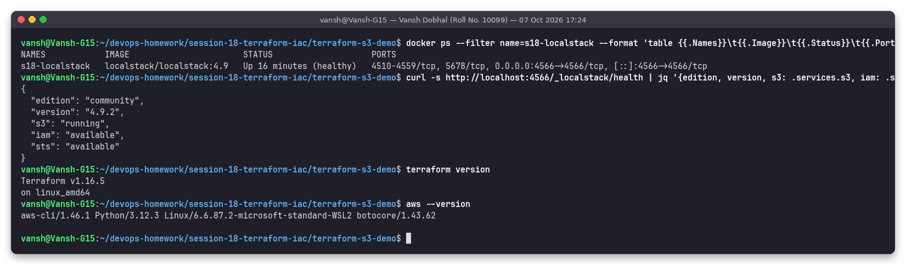
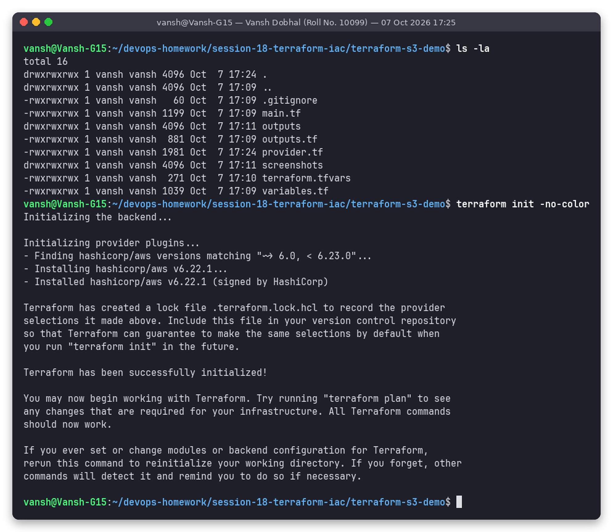
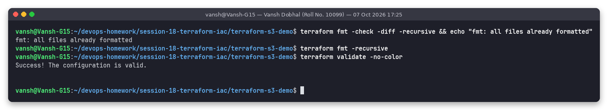
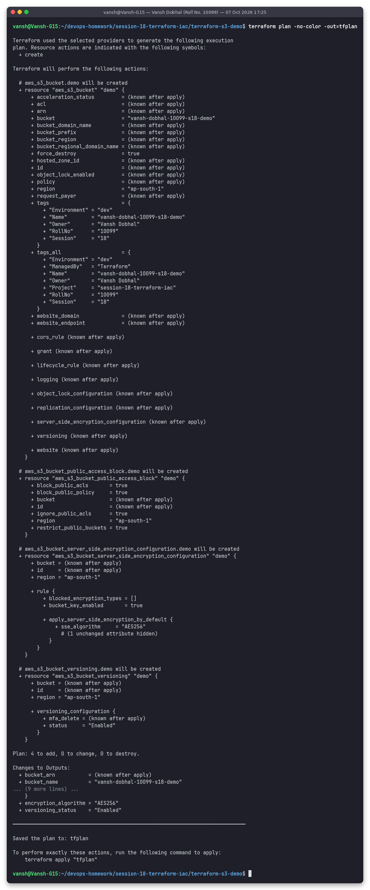
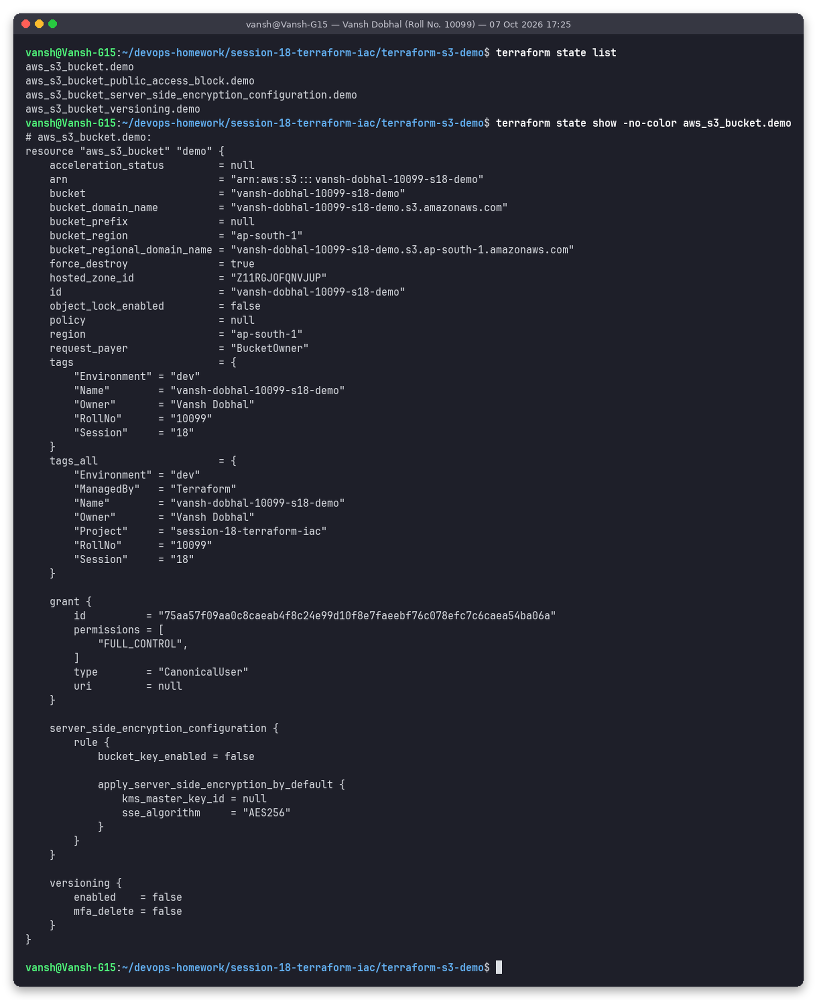
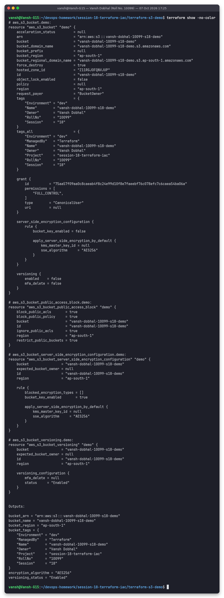
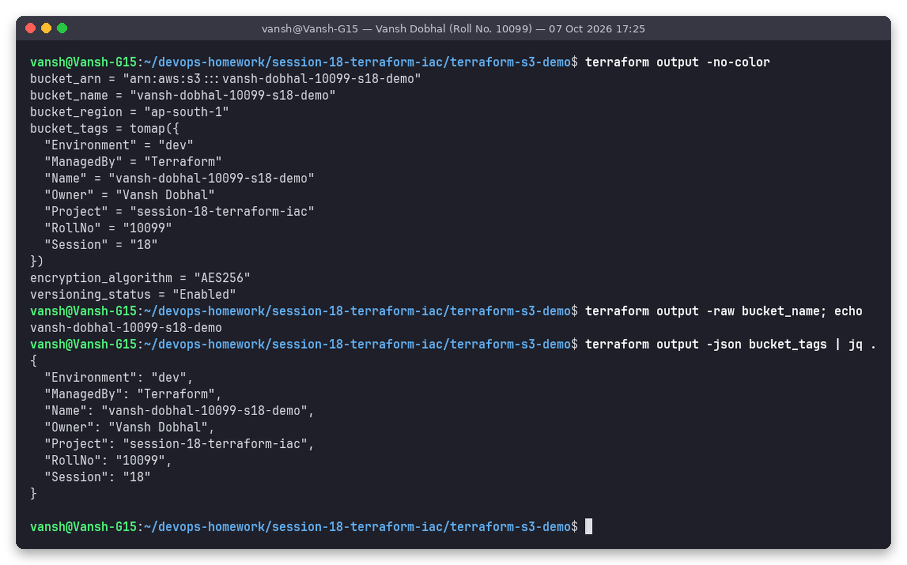
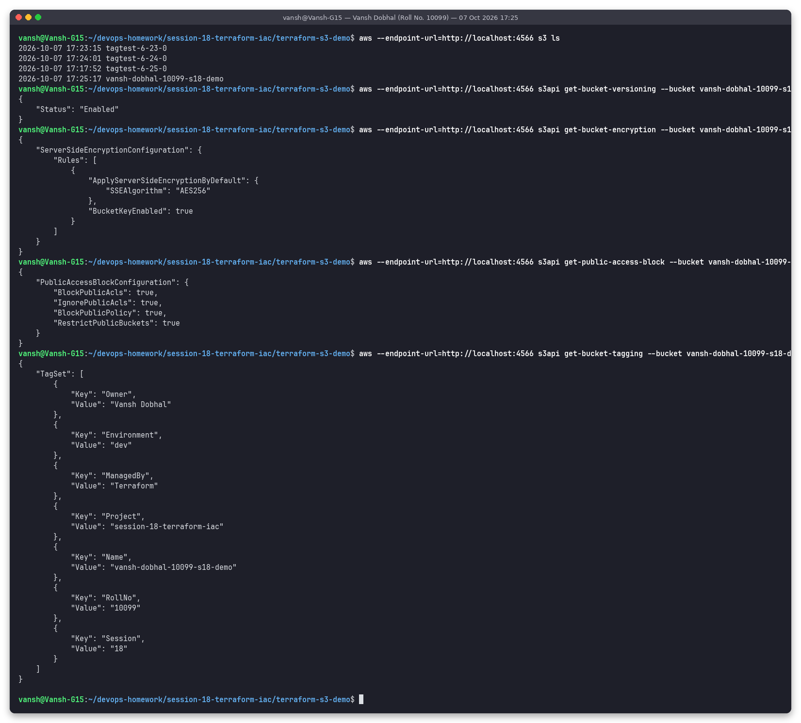
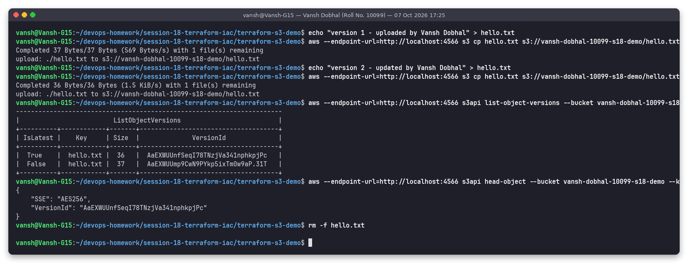
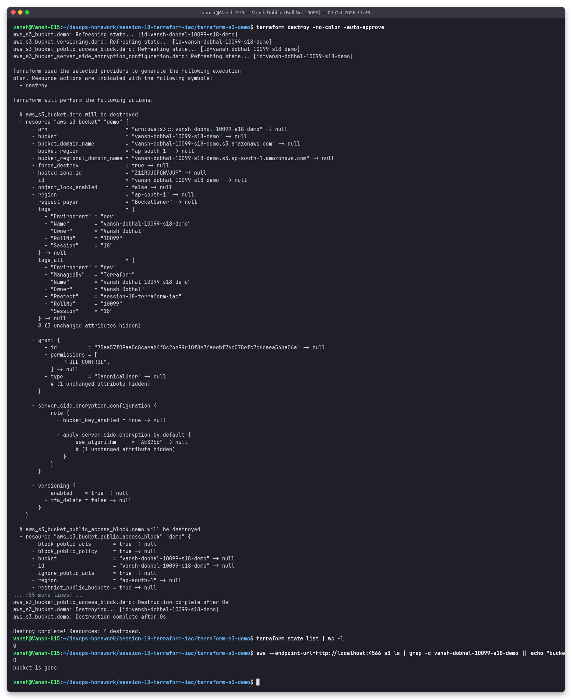

# Task 1: Terraform S3 Demo

**Name:** Vansh Dobhal | **Roll No:** 10099

An S3 bucket built with Terraform. It has versioning, default server-side encryption, a full public access block and tags (including `Owner = "Vansh Dobhal"`). I ran the whole Terraform workflow on it: `init → fmt → validate → plan → apply → state/show → output → destroy`. Every screenshot below comes from a real run.

> **Executed against LocalStack (local AWS emulator) because no AWS account was used; to run on real AWS, set credentials and `use_localstack = false`.**
> LocalStack `4.9.2` (community edition) ran in Docker as `s18-localstack` on `http://localhost:4566`. I used Terraform v1.16.5 with the `hashicorp/aws` provider v6.22.1. The ARNs, IDs and region in the outputs are LocalStack's emulated values. No real AWS resource was created and nothing was billed.

## Files

| File | Purpose |
|------|---------|
| `provider.tf` | `terraform {}` block (Terraform ≥ 1.6, AWS provider `~> 6.0, < 6.23.0`). Also holds the `aws` provider with the **LocalStack switch** and `default_tags`. |
| `variables.tf` | `aws_region`, `bucket_name` (with a regex validation), `environment`, `owner`, `use_localstack`, `localstack_endpoint` |
| `main.tf` | `aws_s3_bucket`, `aws_s3_bucket_versioning`, `aws_s3_bucket_server_side_encryption_configuration`, `aws_s3_bucket_public_access_block` |
| `outputs.tf` | bucket name, ARN, region, versioning status, encryption algorithm, all tags |
| `terraform.tfvars` | The values used for this run: bucket `vansh-dobhal-10099-s18-demo`, region `ap-south-1`, `use_localstack = true` |
| `.terraform.lock.hcl` | Provider lock file created by `terraform init`. It is committed so every run uses the same provider build. |
| `.gitignore` | Excludes `.terraform/`, `*.tfstate*`, `tfplan` |
| `../scripts/run-terraform-s3-demo.sh` | The exact script that ran every step below through `snap` |

### How one codebase targets both real AWS and LocalStack

```hcl
provider "aws" {
  region     = var.aws_region
  access_key = var.use_localstack ? "test" : null   # null -> normal credential chain
  secret_key = var.use_localstack ? "test" : null

  skip_credentials_validation = var.use_localstack
  skip_requesting_account_id  = var.use_localstack
  skip_metadata_api_check     = var.use_localstack
  s3_use_path_style           = var.use_localstack   # http://localhost:4566/<bucket>

  dynamic "endpoints" {                               # block exists only for LocalStack
    for_each = var.use_localstack ? [var.localstack_endpoint] : []
    content {
      s3  = endpoints.value
      sts = endpoints.value
      iam = endpoints.value
    }
  }
  default_tags { tags = { ManagedBy = "Terraform", Project = "session-18-terraform-iac" } }
}
```

`use_localstack` defaults to `false`, so the code behaves like a normal AWS project unless you turn LocalStack on. I preferred this over a `localstack_override.tf` file because the switch sits in one obvious place and gets reviewed with the rest of the code.

**Why the provider is pinned below 6.23.0:** on my first run I used the latest provider (v6.67.0). The bucket was created, but `get-bucket-tagging` returned `NoSuchTagSet`, so LocalStack 4.9 had not stored the tags. I tested several versions against LocalStack: 6.0, 6.20, 6.21 and 6.22 store the tags, while 6.23, 6.24, 6.25, 6.30, 6.35, 6.40 and 6.55 don't. The constraint `~> 6.0, < 6.23.0` therefore resolves to v6.22.1. That version tags buckets correctly on LocalStack and on real AWS.

**Why LocalStack 4.9 and not `latest`:** the current `localstack/localstack:latest` image (2026.9.1) quits at startup with *"License activation failed … set the LOCALSTACK_AUTH_TOKEN"*. The 4.9 tag is the free community build and needs no account.

## Workflow, step by step

### Step 0: LocalStack running



### Step 1: `terraform init`

`init` downloads the `hashicorp/aws` provider plugin matching the version constraint (v6.22.1). It also writes `.terraform.lock.hcl` and prepares the local backend, so state goes in `terraform.tfstate`. To keep the large provider binary out of the OneDrive folder, the run script exports `TF_DATA_DIR=/tmp/tfdata-s18-s3`. Terraform therefore keeps its `.terraform/` data in `/tmp`.



### Step 2: `terraform fmt` and `terraform validate`

`fmt -check -diff` reports any file that isn't in canonical HCL style, and `fmt` rewrites it. On the very first attempt `fmt` re-aligned the `=` signs in `terraform.tfvars`. In this final run every file was already formatted. `validate` checks syntax, types and references without calling AWS.



### Step 3: `terraform plan -out=tfplan`

The plan lists 4 resources to create, marked `+`. You can see the merged `tags_all`, where the provider `default_tags` are added to the resource tags, and the planned outputs. Saving the plan to `tfplan` guarantees that `apply` runs exactly what was reviewed. The full plan is in [`outputs/03-terraform-plan.txt`](outputs/03-terraform-plan.txt).



### Step 4: `terraform apply -auto-approve tfplan`

The bucket is created first. The three bucket sub-resources reference `aws_s3_bucket.demo.id`, so they depend on it implicitly, and Terraform creates them in parallel after it.


### Step 5: State (`terraform state list` / `state show`)



### Step 6: `terraform show`



Observation: in `show`, the read-only `versioning { enabled = false }` block inside `aws_s3_bucket.demo` was captured when the bucket was created, before `aws_s3_bucket_versioning` enabled versioning. The source of truth is the separate `aws_s3_bucket_versioning.demo` resource, which shows `status = "Enabled"`. A later `terraform refresh` or `plan` re-reads the bucket. This is why AWS provider v4+ split versioning, encryption and the access block into their own resources.

### Step 7: `terraform output`



### Step 8: Verifying with the AWS CLI (independent of Terraform)

`aws --endpoint-url=http://localhost:4566 s3api get-bucket-versioning / get-bucket-encryption / get-public-access-block / get-bucket-tagging` confirms all four settings, including the tag `Owner = Vansh Dobhal`.



### Step 9: Versioning and encryption in action

I uploaded `hello.txt` twice. `list-object-versions` shows two versions: the new one has `IsLatest = True` and the old one is still kept. `head-object` shows `ServerSideEncryption: AES256`, even though the upload didn't ask for encryption, because the bucket default applied it.



### Step 10: `terraform destroy -auto-approve`

Terraform destroys in reverse dependency order: the sub-resources first, then the bucket. `force_destroy = true` lets it delete the bucket even though it still holds the two `hello.txt` versions. Afterwards `state list` is empty and `s3 ls` no longer shows the bucket.



## What I learned

- **Declarative.** I describe the end state (a versioned, encrypted, private bucket) and Terraform works out the API calls and their order from the references between resources.
- **Plan before apply.** A saved plan file makes the change reviewable and reproducible.
- **State.** `terraform.tfstate` maps `aws_s3_bucket.demo` to the real bucket ID. Without it, Terraform couldn't update or destroy the bucket. State can contain sensitive values, so it's git-ignored. In a team it would live in a remote backend (S3 + DynamoDB/S3 native locking).
- **Verify independently.** The AWS CLI checks caught a real problem, the missing tags with the newest provider. That led to the provider pin.

## How to reproduce

```bash
docker run -d --name s18-localstack -p 4566:4566 localstack/localstack:4.9
pip install --user awscli awscli-local
cd terraform-s3-demo
terraform init && terraform fmt && terraform validate
terraform plan -out=tfplan && terraform apply tfplan
terraform output
terraform destroy -auto-approve
```

To run it on **real AWS**, export `AWS_ACCESS_KEY_ID` and `AWS_SECRET_ACCESS_KEY` (or set `AWS_PROFILE`), set `use_localstack = false` in `terraform.tfvars` and pick a globally unique `bucket_name`.
