# Session 19: Cloud Infrastructure with Terraform (end-to-end)

**Name:** Vansh Dobhal | **Roll No:** 10099

## Overview

This is a complete small web stack on AWS, written as Terraform code and driven through the whole lifecycle: **init → fmt → validate → plan → apply → state → show → output → graph → destroy**. It demonstrates:

| Terraform concept | Where |
|-------------------|-------|
| **Providers** (pinned version, `default_tags`, dynamic `endpoints`) | `versions.tf`, `provider.tf` |
| **Variables** (types, defaults, validation, `terraform.tfvars`) | `variables.tf`, `terraform.tfvars` |
| **Resources** (12) + a **data source** (`aws_ami`) | `vpc.tf`, `security.tf`, `ec2.tf`, `s3.tf` |
| **Outputs** (10) | `outputs.tf` |
| **Implicit dependencies** (attribute references) | e.g. `subnet_id = aws_subnet.public.id` |
| **Explicit dependency** (`depends_on`) | `aws_instance.web` → `aws_route_table_association.public` |
| **Functions / templates** (`templatefile`, `endswith`, `cidrhost`) | `ec2.tf`, `user_data.sh.tftpl`, `variables.tf` |
| **State, plan, apply, destroy, graph** | screenshots 03–12 |

> **Executed against LocalStack (local AWS emulator) because no AWS account was used; to run on real AWS, set credentials and `use_localstack=false`.**
> LocalStack 4.9.2 community ran in Docker (`s18-localstack`, port 4566), with Terraform v1.16.5, `hashicorp/aws` v6.22.1 and AWS CLI 1.46.1. LocalStack **mocks EC2**: the VPC, subnet, IGW, route table, SG and instance are real objects in the emulator's API, with IDs, IPs and states, but no virtual machine boots. So nginx was **not** actually served and there is no `curl` of the web page. What I could verify for real is that the instance stores the exact `user_data` that installs nginx and writes the page *"Deployed by Vansh Dobhal - 10099"* (screenshot 09). The public IP `54.214.x.x` comes from LocalStack's fake pool.

## Architecture

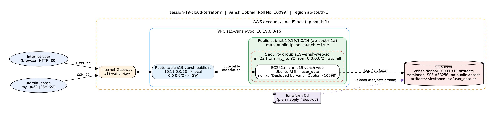

*(Hand-drawn with Graphviz from [`diagrams/architecture.dot`](diagrams/architecture.dot). It's a diagram, not a screenshot.)*

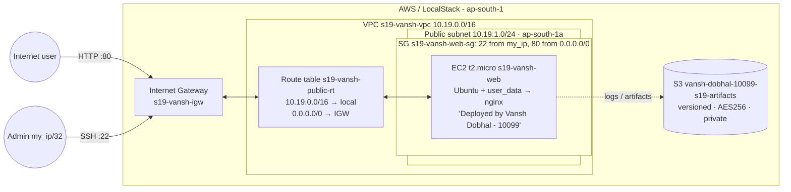

### Terraform dependency graph (`terraform graph | dot -Tpng`)

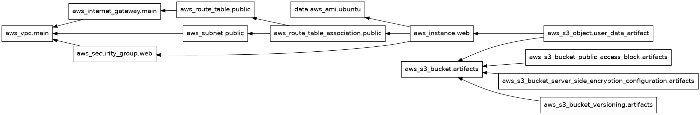

This graph is generated by Terraform itself (screenshot 10). Arrows point from a resource to what it depends on. `aws_instance.web → aws_route_table_association.public` is the **explicit** `depends_on` edge. The other edges come from attribute references. Terraform draws the graph with transitive reduction, so `aws_instance.web → aws_subnet.public` isn't drawn separately: it's already implied through the association.

## File-by-file explanation (`terraform/`)

| File | What it does |
|------|--------------|
| `versions.tf` | `required_version >= 1.6.0`, AWS provider `~> 6.0, < 6.23.0`. Provider ≥ 6.23 doesn't store S3 bucket tags on LocalStack 4.9. I tested this in session 18. |
| `provider.tf` | AWS provider for `var.aws_region`. When `use_localstack = true` it sets dummy `test` credentials, skips the account/credential checks, uses path-style S3 and adds a `dynamic "endpoints"` block that points ec2/s3/sts/iam at `http://localhost:4566`. `default_tags` adds `Owner = Vansh Dobhal`, `RollNo = 10099`, `Project`, `ManagedBy` to every resource. |
| `variables.tf` | `aws_region`, `project`, `vpc_cidr`, `public_subnet_cidr`, `my_ip` (validated as a `/32`), `instance_type` (t2.micro), `ami_id` (optional override), `key_name` (optional), `bucket_name`, `use_localstack`, `localstack_endpoint` |
| `terraform.tfvars` | The values used for the run (see the note on `my_ip` below) |
| `vpc.tf` | `aws_vpc.main` (10.19.0.0/16, DNS on) → `aws_subnet.public` (10.19.1.0/24, AZ `a`, auto public IP) → `aws_internet_gateway.main` → `aws_route_table.public` (`0.0.0.0/0 → IGW`) → `aws_route_table_association.public` |
| `security.tf` | `aws_security_group.web`: ingress 22/tcp from `var.my_ip`, ingress 80/tcp from `0.0.0.0/0`, egress all |
| `ec2.tf` | `data.aws_ami.ubuntu` (latest Canonical `ubuntu/images/hvm-ssd*/ubuntu-*-amd64-server-*`). `local.user_data` is rendered with `templatefile()`. `aws_instance.web` is a t2.micro in the public subnet with the SG, an 8 GB gp3 root volume and **`depends_on = [aws_route_table_association.public]`** |
| `user_data.sh.tftpl` | cloud-init script: `apt-get install -y nginx`, writes `index.html` with *"Deployed by Vansh Dobhal - 10099"* and enables nginx |
| `s3.tf` | `aws_s3_bucket.artifacts` + versioning + SSE-S3 + public access block. `aws_s3_object.user_data_artifact` stores the rendered bootstrap script at `artifacts/<instance-id>/user_data.sh` (its key references `aws_instance.web.id`, so it's created last). |
| `outputs.tf` | `vpc_id`, `public_subnet_id`, `internet_gateway_id`, `security_group_id`, `ami_id`, `instance_id`, `instance_public_ip`, `website_url`, `artifact_bucket`, `user_data_artifact_key` |
| `.terraform.lock.hcl` | Provider lock file (committed) |
| `.gitignore` | `.terraform/`, `*.tfstate*`, `tfplan` |

**Why the explicit `depends_on`?** Nothing in the `aws_instance` block references the route table association. Without `depends_on`, Terraform could launch the instance as soon as the subnet and SG exist, maybe before the subnet has its `0.0.0.0/0 → IGW` route. The first-boot `apt-get install nginx` would then fail with no internet. With `depends_on`, the apply log (screenshot 04) shows `aws_route_table_association.public: Creation complete` *before* `aws_instance.web: Creating...`.

**About `my_ip`:** `203.0.113.10/32` is from TEST-NET-3 (RFC 5737, reserved for documentation). I used it on purpose: LocalStack doesn't enforce security groups, and committing my real home IP to a public repo would leak it. On real AWS, pass your IP at apply time: `terraform apply -var "my_ip=$(curl -s https://checkip.amazonaws.com)/32"`.

**About the AMI:** the same `data "aws_ami"` filter returns the newest Ubuntu image on real AWS. On LocalStack it matched the emulator's built-in Ubuntu mock image `ami-1e749f67`. A specific image can be forced with `ami_id`.

## Commands and screenshots

All commands ran from `session-19-cloud-terraform/terraform` through [`scripts/run-terraform-workflow.sh`](scripts/run-terraform-workflow.sh). The full text of each step is in [`outputs/`](outputs). The script exports `TF_DATA_DIR=/tmp/tfdata-s19` so the provider binary stays out of the OneDrive folder, and it exports dummy `AWS_*` credentials for the CLI. I ran the workflow twice. The first run's `aws s3 ls` also listed throw-away buckets from my provider-version test, so I deleted those and re-ran everything. That's why `init` below says *"Using previously-installed hashicorp/aws v6.22.1"*.

### 0. LocalStack + project files
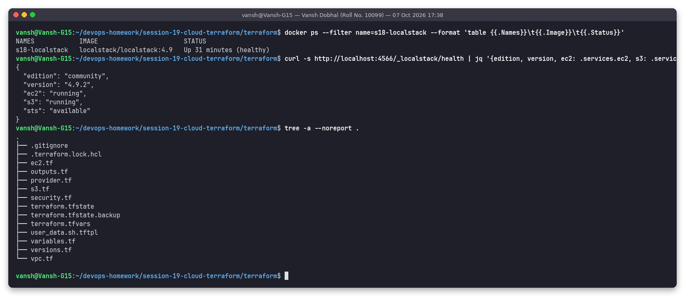

### 1. `terraform init`
Initialises the local backend and installs/locks the AWS provider.
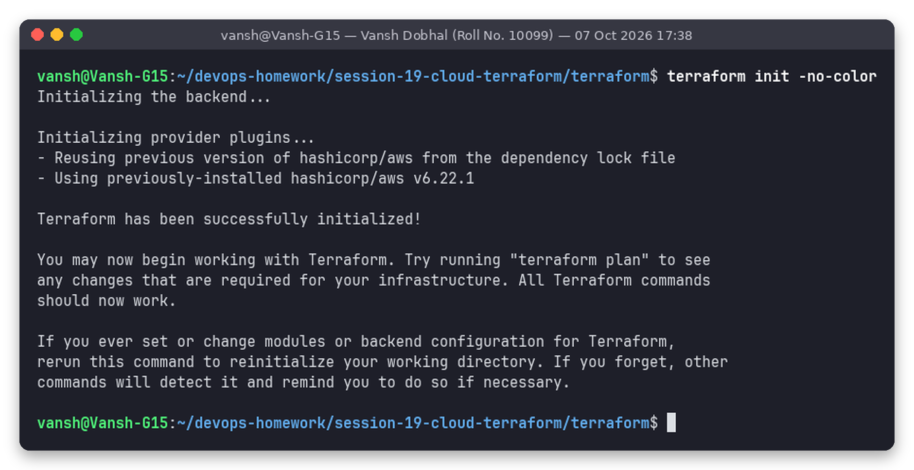

### 2. `terraform fmt -check` and `terraform validate`
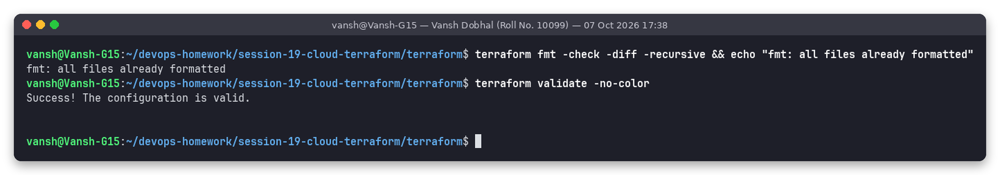

### 3. `terraform plan -out=tfplan`
`data.aws_ami.ubuntu` is read during the plan, then 12 resources are planned. The full plan is in [`outputs/03-terraform-plan.txt`](outputs/03-terraform-plan.txt), and the rendered `user_data` is visible in it.
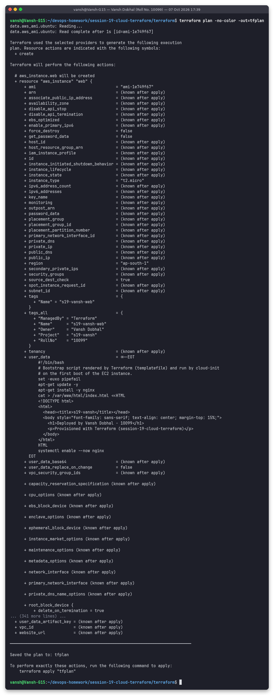

Short summary of the plan, including the `depends_on` recorded in the plan JSON:
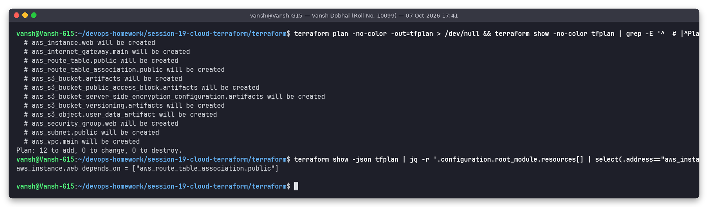

### 4. `terraform apply -auto-approve tfplan`
The order follows the graph. The VPC and the bucket start in parallel, since they're independent. Then the subnet, IGW and SG, then the route table and association, then the instance, and the S3 object last. Result: `Apply complete! Resources: 12 added`.
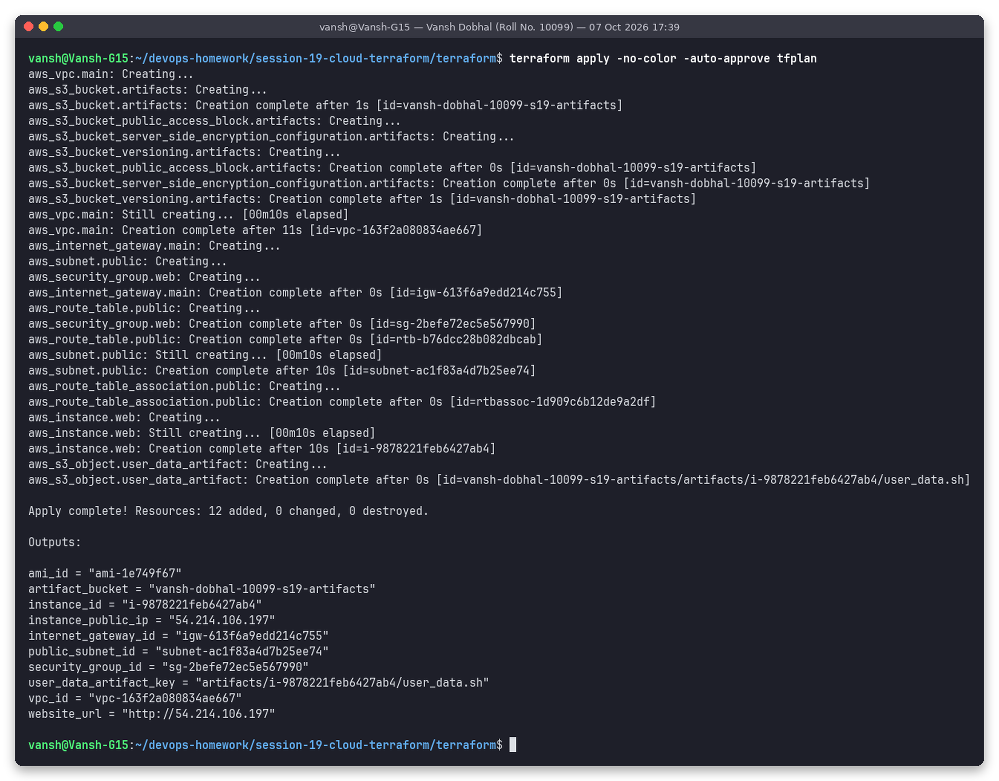

### 5. `terraform state list` / `state show`
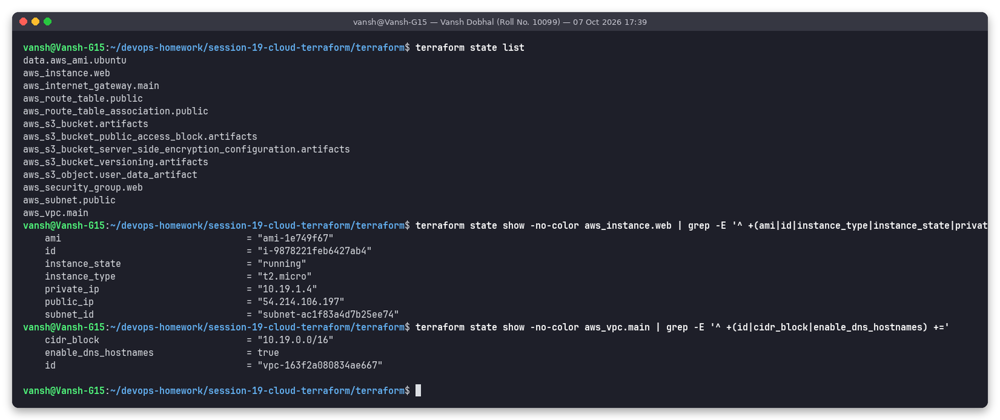

### 6. `terraform show`
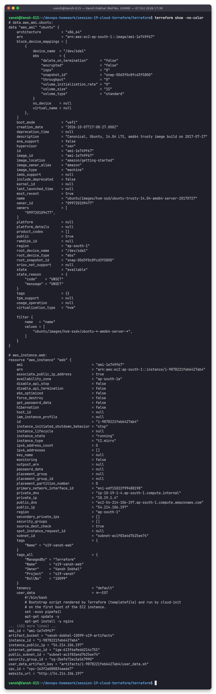

### 7. `terraform output`
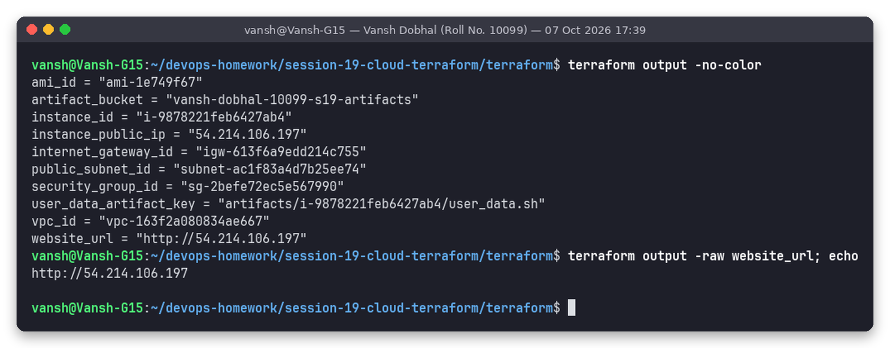

### 8. Verify the network with the AWS CLI
`describe-vpcs` (tag `Owner = Vansh Dobhal`), `describe-subnets` (`MapPublicIpOnLaunch = True`), `describe-route-tables` (`0.0.0.0/0 → igw`), `describe-internet-gateways` (attached), `describe-security-groups` (22 from the /32, 80 from anywhere).
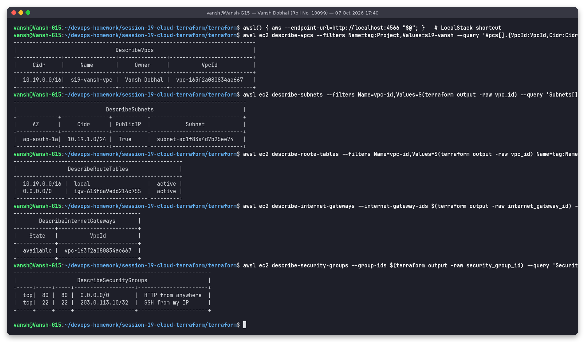

### 9. Verify EC2 and S3 with the AWS CLI
`describe-instances` shows the instance as `running`, `t2.micro`, private IP `10.19.1.4` in the public subnet, with a public IP. `describe-instance-attribute --attribute userData | base64 -d` shows the stored nginx bootstrap with *Deployed by Vansh Dobhal - 10099*. `s3 ls` shows the bucket and the uploaded `artifacts/<instance-id>/user_data.sh`, and the bucket's versioning is `Enabled`.
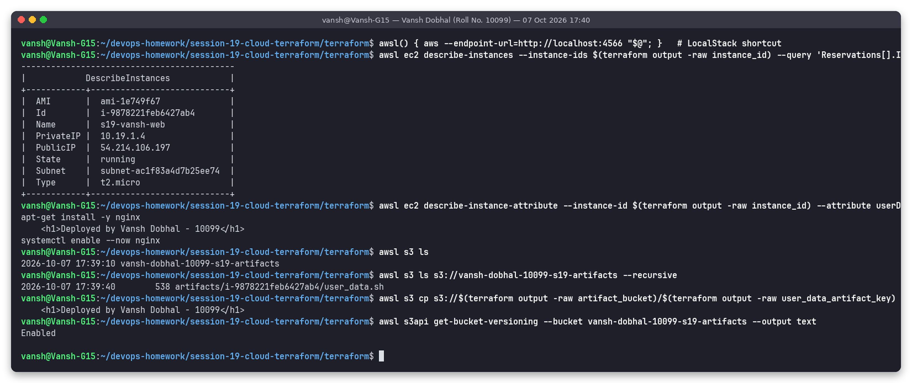

### 10. `terraform graph | dot -Tpng`
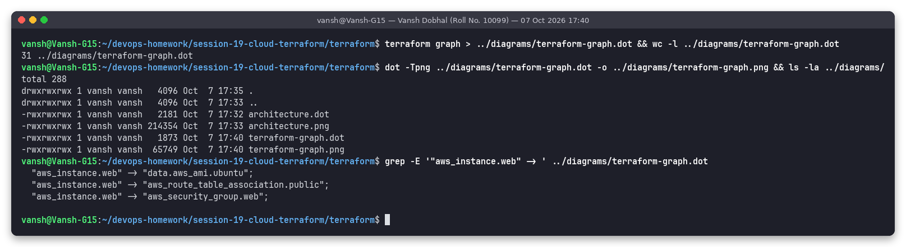

### 11. Drift check: `terraform plan -detailed-exitcode`
Exit code `0` and *No changes* mean the real infrastructure matches the code and state exactly.
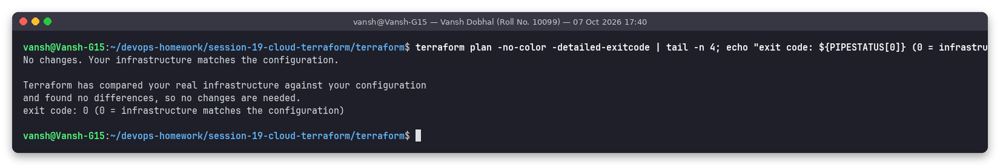

### 12. `terraform destroy -auto-approve`
Destroy runs in **reverse** dependency order: the S3 object and bucket sub-resources first, then the instance, then the association, subnet, route table and SG, then the IGW, and the VPC last. Afterwards `state list` is empty, the instance is `terminated`, no VPC is tagged `s19-vansh`, and the bucket is gone.
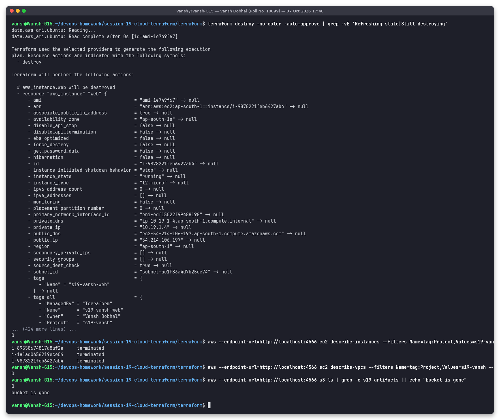

## Terraform state explained

- `terraform.tfstate` (JSON) is Terraform's **memory**. For each resource address (`aws_instance.web`) it records the real ID (`i-…`) and every attribute AWS returned. `plan` compares **code ↔ state ↔ real infrastructure (refresh)** to compute the diff. Without state, Terraform would try to create everything again.
- `terraform state list` shows the 12 managed resources plus the data source. `state show <addr>` prints one entry. `terraform show` prints the whole state in a readable form.
- `terraform.tfstate.backup` is the previous version and is written on each change.
- State can hold secrets (e.g. generated passwords, user_data), so it's **git-ignored**. It was also deleted after the destroy, when it was empty anyway.
- In a team, state goes in a **remote backend** with locking so two applies can't race. For example:
  ```hcl
  terraform {
    backend "s3" {
      bucket       = "vansh-tf-state"
      key          = "session19/terraform.tfstate"
      region       = "ap-south-1"
      encrypt      = true
      use_lockfile = true   # S3-native locking (Terraform >= 1.10); older setups used a DynamoDB table
    }
  }
  ```
- Useful state commands: `terraform state mv` (rename/refactor), `state rm` (stop managing a resource), `terraform import` / `import {}` blocks (adopt an existing resource), `terraform refresh` / `plan -refresh-only` (detect drift).

## Cost note (if run on real AWS, ap-south-1)

| Resource | Cost |
|----------|------|
| VPC, subnet, route table, IGW, security group | Free |
| EC2 `t2.micro` | Free Tier: 750 h/month for 12 months (older accounts), otherwise about US$0.0124/h (≈ US$9/month). Newer accounts get the credit-based Free Plan and may need `t3.micro`. |
| EBS gp3 8 GB root volume | Free Tier 30 GB, otherwise about US$0.0912/GB-month (≈ US$0.73/month) |
| Public IPv4 address | US$0.005/h (≈ US$3.6/month). Charged for all public IPv4 since Feb 2024 (Free Tier covers 750 h/month for the first year). |
| S3 bucket (a few KB) | Effectively US$0 (Standard ≈ US$0.025/GB-month in Mumbai) |
| Data transfer out | First 100 GB/month free |

No NAT Gateway was used on purpose: it would add about US$0.056/h plus data charges. **This run cost nothing**, since it ran on LocalStack. On real AWS, always finish with `terraform destroy`.

## Cleanup

```bash
cd terraform
terraform destroy -auto-approve       # removes all 12 resources (screenshot 12)
docker rm -f s18-localstack           # stop and remove the emulator
```

After the run I destroyed all resources, deleted the empty state files, and stopped and removed the LocalStack container.

## Folder structure

```
session-19-cloud-terraform
├── .gitignore
├── README.md
├── diagrams
│   ├── architecture.dot / architecture.png     (hand-made architecture diagram)
│   └── terraform-graph.dot / terraform-graph.png (generated by `terraform graph`)
├── scripts
│   └── run-terraform-workflow.sh               (runs every step through snap)
├── screenshots   00 … 12 (+ 03b)
├── outputs       same names, plain-text logs
└── terraform
    ├── .gitignore  .terraform.lock.hcl
    ├── versions.tf  provider.tf  variables.tf  terraform.tfvars
    ├── vpc.tf  security.tf  ec2.tf  s3.tf  outputs.tf
    └── user_data.sh.tftpl
```

## How to reproduce

**LocalStack (what I did):**
```bash
docker run -d --name s18-localstack -p 4566:4566 localstack/localstack:4.9
pip install --user awscli && export AWS_ACCESS_KEY_ID=test AWS_SECRET_ACCESS_KEY=test AWS_DEFAULT_REGION=ap-south-1
cd terraform
terraform init && terraform fmt -check && terraform validate
terraform plan -out=tfplan && terraform apply tfplan
terraform state list && terraform output
aws --endpoint-url=http://localhost:4566 ec2 describe-instances
terraform graph | dot -Tpng > ../diagrams/terraform-graph.png
terraform destroy -auto-approve
```

**Real AWS:**
```bash
aws configure            # or export AWS_PROFILE / SSO
cd terraform
sed -i 's/use_localstack = true/use_localstack = false/' terraform.tfvars
terraform init
terraform apply -var "my_ip=$(curl -s https://checkip.amazonaws.com)/32" -var "bucket_name=vansh-dobhal-10099-s19-artifacts-$(date +%s)"   # S3 names are global
curl "$(terraform output -raw website_url)"     # -> <h1>Deployed by Vansh Dobhal - 10099</h1> (after ~1 min of cloud-init)
terraform destroy -auto-approve
```
